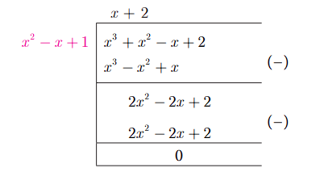
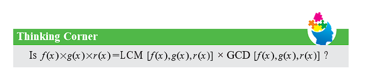
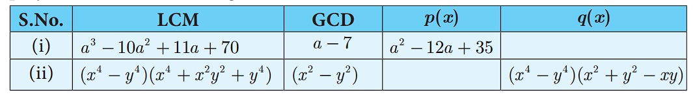

# GCD and LCM of Polynomials

## Greatest Common Divisor (GCD) or Highest Common Factor (HCF) of Polynomials

In our previous class we have learnt how to find the GCD (HCF) of second degree and third degree expressions by the method of factorization. Now we shall learn how to find the GCD of the given polynomials by the method of long division.

As discussed in Chapter 2 , (Numbers and Sequences) to find GCD of two positive integers using Euclidean Algorithm, similar techniques can be employed for two given polynomials also.

The following procedure gives a systematic way of finding ==Greatest Common Divisor== of two given polynomials _fx_ () and _gx_ ().

**Step 1:**  First, divide f(x) by g(x) to obtain f(x)=g(x)q(x)+r(x) whereq q(x) is the quotient and r(x) is the remainder. Then, $deg[r(x)] < deg[g(x)]$

**Step 2:** If the remainder r(x) is non-zero, divide g(x) by r(x)to obtaing g(x)=r(x)$q_{1}$(x)+$r_{1}$(x) where $r_{1}$(x) is the new remainder. Then $deg[$r_{1}$(x)]<deg [r(x)]$. If the reminder $r_{1}$(x) is zero, then r(x) is the required GCD.

**Step 3:** If $r_{1}$(x)  is non-zero, then continue the process until we get zero as remainder. The divisor at this stage will be the required GCD.

We write GCD[f(x),g(x)] to denote the GCD of the polynomials f(x),g(x).

**NOTE**
If f(x) and g(x) are two polynomials of same degree then the polynomial carrying the highest coefficient will be the dividend. In case, if both have the same coefficient then compare the next least degree’s coefficient and proceed with the division.

**Progress Check**
1. When two polynomials of same degree has to be divided,_________should be considered to fix the dividend and divisor.

2. If r(x) = 0 when f(x) is divided by g(x) then g(x) is called ______of the polynomials.

3. If f(x) = g(x)q(x) + r(x), ______ must be added to f(x) to make f(x) completely divisible by g(x).

4. If f(x) = g(x)q(x) + r(x), _______ must be subtracted to f(x) to make f(x) completely divisible by g(x).

**Example 3.10** Find the GCD of the polynomials $x^{3}+x^{2}-x+2$ and 	$2x^{3}-5x^{2}+5x-3$

**Solution :** Let $ f(x)=2x^{3}-5x^{2}+5x-3$ and $ g(x)=x^{3}+x^{2}-x+2$ 

$−7(x^{2} − x + 1) ≠ 0$ , note that -7 is not a divisor of g(x)
Now dividing $g(x) = x^{3} + x^{2}− x + 2$ by the new remainder $x^{2}–x+1$ (leaving the constant factor), we get
 

Here, we get zero remainder.
Therefore, GCD$(2x^{3}-5x^{2}+5x-3$ and $ g(x)=x^{3}+x^{2}-x+2$ )= $x^{2}–x+1$

**Example 3.11** Find the GCD of $6x^{3} − 30x^{2} + 60x − 48$ and $3x^{3} − 12x^{2} + 21x − 18$ .

**Solution :** Let, $f(x) = 6x^{3} − 30x^{2} + 60x − 48 = 6(x^{3} − 5x^{2} + 10x − 8)$ and $
g(x) = 3x^{3} − 12x^{2} + 21x − 18 = 3 (x^{3} − 4x^{2} + 7x − 6)$
 
Now, we shall find the GCD of $x^{3} − 5x^{2} + 10x − 8$
and $x^{3} − 4x^{2} + 7x − 6$

GCD of leading coefficients 3 and 6 is 3.
Thus, GCD $[(6x^{3} − 30x^{2} + 60x − 48,3x^{3} − 12x^{2} + 21x − 18) ]=3(x-2)$

## Least Common Multiple (LCM) of Polynomials

The ==Least Common Multiple== of two or more algebraic expressions is the expression of highest degree (or power) such that the expressions exactly divide it.
 
Consider the  following  simple  expressions $ a^{3}b^{2}, a^{2}b^{3}$
For these expressions LCM = $ a^{3}b^{2}$ . 
To find LCM by factorization method

 
(i)	Each expression is first resolved into its factors.
(ii)	The highest power of the factors will be the LCM.
(iii)	If the expressions have numerical coefficients, find their LCM.
(iv)	The product of the LCM of factors and coefficient is the required LCM.

**Example 3.12** Find the LCM of the following
(i) $8x^{4}y^{2}, 48x^{2}y^{4}$ 
(ii) $5x - 10, 5x^{2} - 20$
(iii) $x^{4} - 1, x^{2} − 2x + 1$   
(iv) $x^{3} - 27, (x - 3)^{2}, x^{2} - 9$
 
**Solution :** 
(i) $8x^{4}y^{2}, 48x^{2}y^{4}$ 

First let us find the LCM of the numerical coefficients.
 That is,	LCM (8, 48)= 2 × 2 × 2 × 6 = 48
 Then find the LCM of the terms involving variables.
 That is,	LCM ($x^{4}y^{2}, x^{2}y^{4})= x^{4}y^{4}$
 Finally find the LCM of the given expression.
We condclude that the LCM of the given expression is the product of the LCM of the numerical coefficient and the LCM of the terms with variables.
<b>Therefore, LCM ($8x^{4}y^{2}, 48x^{2}y^{4}) = 48x^{4}y^{4}$

---
(ii) $(5x - 10), (5x^{2} - 20)$
$5x - 10=5x-2$
$5x^{2} - 20=5(x^{2}-4)=5(x+2)(x-2) $
Therefore, LCM $[(5x - 10), (5x^{2} - 20)]=5(x+2)(x-2)$

---
 (iii) $(x^{4} - 1), x^{2} − 2x + 1$  
$x^{4} - 1=(x^{2})^{2} - 1)=(x^{2}+ 1)(x^{2}-1)=(x^{2}+1)(x+1)(x-1)$
$x^{2} − 2x + 1=(x-1)^{2}$ 
Therefore, LCM $[(x^{4} - 1), ?(x^{2} − 2x + 1)]=(x^{2}+1)(x+1)(x-1)^{2}$

---
(iv) $x^{3} - 27, (x - 3)^{2}, x^{2} - 9$
$x^{3} - 27=(x-3)(x^{2}+3x+9);  (x - 3)^{2}= (x - 3)^{2}; x^{2} - 9=(x+3)(x-3)$
Therefore, LCM $[(x^{3} - 27), (x - 3)^{2}, (x^{2} - 9)]=(x - 3)^{2} (x + 3) (x^{2}+3x+9)$

-----
</b>

1. Find the GCD of the given polynomials
(i) $x^{4} + 3x^{3} − x − 3, x^{3} + x^{2} − 5x + 3$
(ii) $x^{4} - 1 , x^{3} − 11x^{2} + x − 11$
(iii) $3x^{4} + 6x^{3} − 12x^{2} − 24x, 4x^{4} + 14x^{3} + 8x^{2} − 8x$
(iv) $3x^{3} + 3x^{2} + 3x + 3 , 6x^{3} + 12x^{2} + 6x + 12$

2. Find the LCM of the given expressions.
(i) $4x^{2}y, 8x^{3}y^{2}$
(ii) $9a^{3}b^{2} , 12a^{2}b^{2}c$
(iii) $16m-, 12m^{2}n^{2} , 8^{2}$
(iv)$ p^{2} −3p+2, p^{2} - 4$
(v) $2x^{2}-5x-3, 4x^{2}-36$
(vi)$ (2x^{2}-3xy)^{2}  ,(4x-6y)^{3},(8x^{3}-27y^{3})$

## Relationship between LCM and GCD

Let us consider two numbers 12 and 18.
We observe that, LCM (12,18) = 36, GCD (12,18) = 6 .
Now, LCM (12,18) × GCD(12,18) = 36 × 6 = 216 = 12 ×18
Thus LCM × GCD is equal to the product of two given numbers.
Similarly, the product of two polynomials is the product of their LCM and GCD, 
That is, $f(x)×g(x) = LCM[f (x),g(x)]×GCD[f (x), g(x)]$

**Illustration**
Consider	$f(x) = 12(x^{2} − y^{2})$ and  $g(x) = 8(x^{3} − y^{3})$
Now	$f(x) = 12(x ^{2} − y ^{2}) = 2^{2} × 3 ×(x + y)(x − y)$	...(1)
and $g(x) = 8(x ^{3} − y ^{3}) = 2^{3} ×(x − y)(x ^{2} + xy + y^{2})$ ...(2)
From (1) and (2) we get, 
LCM$[f(x), g(x)] = 2^{3} × 3 ×(x + y)(x − y)(x ^{2} + xy + y^{2})
= 24 ×(x ^{2} − y^{2})(x ^{2} + xy + y^{2})$
 
GCD $[f(x), g(x)] = 2^{2} ×(x − y) = 4(x − y)$
	 
LCM x GCD  = $24 × 4 ×(x ^{2} − y^{2})×(x ^{2} + xy + y^{2})×(x − y)$
LCM x GCD  = $96(x ^{3} − y ^{3})(x ^{2} − y ^{2})$ ...(3)
 
product of f(x) and g(x) = $12(x ^{2} − y^{2})× 8(x ^{3} − y ^{3})
= 96(x ^{2} − y^{2})(x ^{3} − y^{3})$ ...(4)
From (3) and (4) we obtain LCM × GCD = $f(x) × g(x)$

1.	Find the LCM and GCD for the following and verify that f (x)× g(x) = LCM ×GCD
 (i) $21x^{2}y, 35xy^{2}$
 (ii) $(x ^{3} − 1)(x + 1),(x ^{3} + 1)$
 (iii) $(x^{2}y + xy^{2}), (x ^{2} + xy)$
 
2.	Find the LCM of each pair of the following polynomials
(i)$	a^{2} + 4a − 12, a^{2} − 5a + 6$ whose GCD is a - 2
 (ii)$	x ^{4} - 27a ^{3}x, (x - 3a)^{2} $ whose GCD is (x - 3a)

3.	Find the GCD of each pair of the following polynomials
(i)	$12(x ^{2} - x ^{3}), 8(x ^{4} − 3x ^{3} + 2x ^{2}) $whose LCM is $24x ^{3}(x - 1)(x - 2)$
(ii)$(x^{3} + y^{3}), (x ^{4} + x 2y^{2} + y^{4} )$ whose LCM is$ (x ^{3} + y^{3})(x ^{2} + xy + y^{2})$

4. Given the LCM and GCD of the two polynomials p(x) and q(x) find the unknown polynomial in the following table

