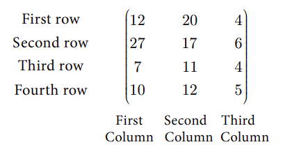
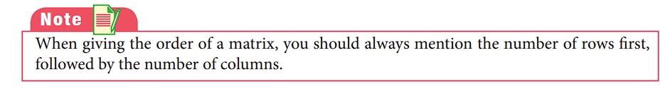
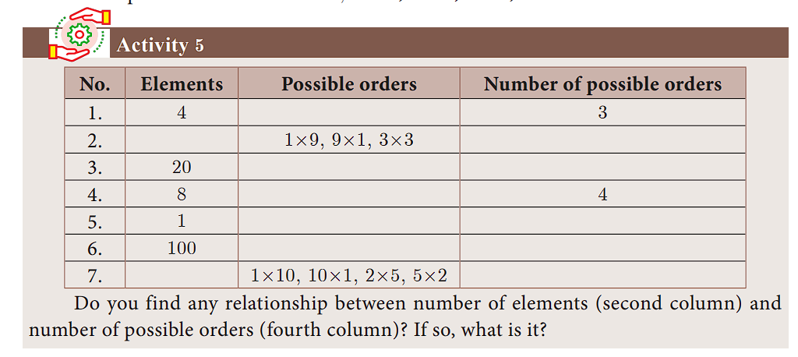


# Matrices

**Introduction**
Let us consider the following information. Vanitha has 12 story books, 20 notebooks and 4 pencils. Radha has 27 story books, 17 notebooks and 6 pencils. Gokul has 7 story books, 11 notebooks and 4 pencils. Geetha has 10 story books, 12 notebooks and 5 pencils.

| Details    | Story Books  | Note Books | Pencils |
|----------|----------|----------|----------|
| Vanitha | 12 | 20|  4 |
| Radha| 27 | 17 | 6 |
| Gokul | 7 | 11 |  4 |
| Geetha | 10| 12| 5|

Now we arrange this information in the tabular form as follows.

Here the items possessed by four people are aligned or positioned in a rectangular array containing four horizontal and three vertical arrangements. The horizontal arrangements are called “rows” and the vertical arrangements are called “columns”. The whole rectangular arrangement is called a “Matrix”. Generally, if we arrange things in a rectangular array, we call it as “ Matrix”.

Applications of matrices are found in several scientific fields. In Physics, matrices are applied in the calculations of battery power outputs, resistor conversion of electrical energy into other forms of energy. In computer based applications, matrices play a vital role in the projection of three dimensional image into a two dimensional screen, creating a realistic seeming motions. In graphic software, Matrix Algebra is used to process linear transformations to render images. One of the most important usage of matrices are encryption of message codes. The encryption and decryption process are carried out using matrix multiplication and inverse operations. The concept of matrices is used in transmission of codes when the messages are lengthy. In Geology, matrices are used for taking seismic surveys. In Robotics, matrices are used to identify the robot movements.

**Definition**

A matrix is a rectangular array of elements. The horizontal arrangements are called rows and vertical arrangements are called columns.

For example,

 
\begin{bmatrix}
    4 & 8 & 0 \\
    1 & 9 & -2 \\
\end{bmatrix}


is a matrix.
Usually capital letters such as A, B, C, X, Y, … etc., are used to represent the
matrices and small letters such as a, b, c, l, m, n, \\(a_{12},a_{13}\\),...  to indicate the entries or
elements of the matrices.
The following are some examples of matrices
(i)    
\begin{bmatrix}
    8 & 4 & -1 \\
    \frac{1}{2} & 5 & 4 \\
    9  & 0 & 1 \\
\end{bmatrix}
    
(ii) 
\begin{bmatrix}
    1+x & x^3 & sinx \\
    cosx & 2 & tanx \\
\end{bmatrix}
   
(iii)
\begin{bmatrix}
    3+1 & \sqrt2 & -1 \\
    1.5 & 8 & 9 \\
    \frac{1}{3} & 13 & \frac{-7}{9}
\end{bmatrix}
 

## Order of a Matrix

If a matrix A has m number of rows and n number of columns, then the order of the matrix A is (Number of rows)´(Number of columns) that is, m n ´ .We read m n ´ as m cross n or m by n. It may be noted that m n ´ is not a product of m and n. General form of a matrix A with m rows and n columns (order m n ´ ) can be written in the form

A=  
\begin{bmatrix}
    a_{11} & a_{12} & ...&a_{1j}& ... &a_{1n} \\
    a_{21} & a_{22} & ...&a_{2j}& ... &a_{2n} \\
    \vdots & \vdots & \vdots & \vdots & \vdots & \vdots\\
    a_{31} & a_{32} & ...&a_{mj}& ... &a_{mn} \\
\end{bmatrix}


where, a_{11},a_{12}$ ,... denote entries of the
matrix. \\(a_{11}\\)is the element in first row, first
column, \\(a_{12}\\) is the element in the first row, second
column, and so on.

In general, \\(a_{ij}\\)  is the element in the \\(i^{th}\\) row and \\(j^{th}\\) column and is referred as \\((i,j)^{th}\\) element. With this notation, we can express the matrix A as \\(A=(a_{ij})\\) where i= 1 2, ,....m and
j= 1 2,...n.
The total number of entries in the matrix\\((a_{ij})_{m×n}\\) is mn

For example, 

## Types of Matrices
In this section, we shall define certain types of matrices.
### Row Matrix
A matrix is said to be a row matrix if it has only one row and any number of columns.
A row matrix is also called as a row vector.
For example, A = ( ) 894 3 , B =  
\begin{bmatrix}
    -\frac{\sqrt3}{2} & 1 & \sqrt3 \\
\end{bmatrix}

are row matrices of order 1×4
and 1×3 respectively
In general A=(\\(a_{11} a_{12} a_{13}...a_{1n} \\)) is a row matrix of order 1×n.

### Column Matrix
A matrix is said to be a column matrix if it has only one column and any number of
rows. It is also called as a column vector.

For example, 
A=\begin{bmatrix}
    sin x \\
    cos x \\
    1 \\
\end{bmatrix}

B=\begin{bmatrix}
    \sqrt5\\
    7\\
\end{bmatrix}

C=\begin{bmatrix}
    8 \\
    -3 \\
    23\\
    17
\end{bmatrix} are column matrices of order 3×1,2×1  and 4×1  respectively.

In general, 
A=\begin{bmatrix}
   a_{11} \\
    a_{21}\\
     a_{31}\\
     \vdots\\
      a_{m1}
\end{bmatrix} is a column matrix of order mx1 .

### Square Matrix
A matrix in which the number of rows is equal to the number of columns is called a
square matrix. Thus a matrix A=\\((a_{ij})_{m×n}\\) will be a square matrix if m=n

For example,  

C=\begin{bmatrix}
    1 & 3 \\
    4 & 5\\
\end{bmatrix}
C=\begin{bmatrix}
   -1 & 0 & 2\\
   3  & 6  & 8\\
   2 & 3 & 5\\
\end{bmatrix} are square matrices.

In general, 
A=\begin{bmatrix}
   a_{11} & a_{12}\\
    a_{21} & a_{22}\\   
\end{bmatrix},
A=\begin{bmatrix}
   b_{11} & b_{12}& b_{13}\\
    b_{21} & b_{22}& b_{23}\\ 
    b_{31} & b_{32}& b_{33}\\
\end{bmatrix}
are square matrices of orders 2x2 and 3x3 respectively
 
 A=\\((a_{ij})_{m×n}\\) is a square matrix of order m.

### Diagonal Matrix
A square matrix, all of whose elements, except those in the leading diagonal are zero is called a diagonal matrix.
(ie) A square matrix A=\\((a_{ij})\\( is said to be diagonal matrix if \\(a_{ij}\\) = 0 for \\)i\neq j \\). Note
that some elements of the leading diagonal may be zero but not all.
For example,
C=\begin{bmatrix}
   8 & 0 & 0\\
   0  & -3  & 0\\
   0 & 0 & 11\\
\end{bmatrix},
C=\begin{bmatrix}
   1 & 0 & 0\\
   0  & 1  & 0\\
   0 & 0 & 0\\
\end{bmatrix}
 are diagonal matrices.

### Scalar Matrix
A diagonal matrix in which all the leading diagonal elements are equal is called a scalar matrix.

For example , 
\begin{bmatrix}
    4 & 0 \\
    0 & 4\\
\end{bmatrix},
\begin{bmatrix}
   k & 0 & 0\\
   0  & k  & 0\\
   0 & 0 & k\\
\end{bmatrix},
\begin{bmatrix}
   5 & 0 & 0\\
   0  & 5  & 0\\
   0 & 0 & 5\\
\end{bmatrix}
 In general, A=\\((a_{ij})_{m×n}\\)is said to be a scalar matrix if 

(a_{ij})=
\begin{cases}
   0 &\text{when } i ≠ j \\
   k &\text{when } i = j \\
\end{cases}
where \space k \space is \space constant


### Identity (or) Unit Matrix
A square matrix in which elements in the leading diagonal are all “1” and rest are all zero is called an identity matrix or unit matrix.

Thus, the square matrix A=\\((a_{ij})\\) is an identity matrix if 
(a_{ij})=
\begin{cases}
   1 &\text{if } i ≠ j \\
   0 &\text{if } i = j \\
\end{cases}
A unit matrix of order n is written as \\( I_n \\) .


I_2=\begin{bmatrix}
   1 & 0 \\
   0  & 1 \\
\end{bmatrix},
I_3=\begin{bmatrix}
   1 & 0 & 0\\
   0  & 1  & 0\\
   0 & 0 & 1\\
\end{bmatrix}
are identity matrices of order 2 and 3 respectively.

### Zero matrix (or) null matrix
A matrix is said to be a zero matrix or null matrix if all its elements are zero.

For example, 
(0),\begin{bmatrix}
   0 & 0 \\
   0  & 0 \\
\end{bmatrix},
\begin{bmatrix}
   0 & 0 & 0\\
   0  & 0  & 0\\
   0 & 0 & 0\\
\end{bmatrix}

 are all zero matrices of order 1x1, 2x2 and
3x3 but of different orders. We denote zero matrix of order nxn by \\( O_n\\)


\begin{bmatrix}
   0 & 0 & 0\\
   0  & 0  & 0\\
\end{bmatrix} is \space a\space zero\space matrix\space of\space  the\space  order\space  2×3 .

### Transpose of a matrix
The matrix which is obtained by interchanging the elements in rows and columns of
the given matrix A is called transpose of A and is denoted by \\(A^T\\) .
For example,

(a) If 
A=\begin{bmatrix}
   5 & 3 & -1\\
   2  & 8  & 9\\
   -4 & 7 & 5\\
\end{bmatrix}
then,\space
A^T=\begin{bmatrix}
   5 & 2 & -4\\
   3  & 8  & 7\\
   -1 & 9 & 5\\
\end{bmatrix}


(b) If 
B=\begin{bmatrix}
   1 & 5 \\
   8  & 9\\
   4 & 3\\
\end{bmatrix}
then,\space
B^T=\begin{bmatrix}
   1 & 8 & 4\\
   5  & 9  & 3\\
\end{bmatrix}


If order of A is mxn then order of \\( A^T \\) is nxm .
 We note that \\( (A^T)^T=A \\) .

### Triangular Matrix
A square matrix in which all the entries above the leading diagonal are zero is called
a lower triangular matrix.
If all the entries below the leading diagonal are zero, then it is called an upper
triangular matrix.

For example, 

A=\begin{bmatrix}
   1 & 7 & -3\\
   0  & 2  & 4\\
   0 & 0 & 7\\
\end{bmatrix}
is an upper triangular matrix and 
B=\begin{bmatrix}
   8 & 0 & 0\\
   4  & 5  & 0\\
   -11 & 3 & 1\\
\end{bmatrix}
 is a lower triangular matrix.

**Equal Matrices**

Two matrices A and B are said to be equal if and
only if they have the same order and each element of
matrix A is equal to the corresponding element of
matrix B. That is,\\(a_{ij}=b_{ij}\\) for all i,j.
For example,
If 
A=\begin{bmatrix}
   5 & 1 \\
   0  & 3 \\
\end{bmatrix},
B=\begin{bmatrix}
   1^2+2^2 & sin^2θ+cos^2θ \\
   1+\frac32-\frac52 & 2+sec^2θ-tan^2θ\\
\end{bmatrix}
 then we note that A and B have same order and \\( a_{ij}=b_{ij}\\) for
every i, j. Hence A and B are equal matrices.

**The negative of a matrix**
The negative of a matrix \\(A_{m×n}\\) denoted by \\(-A_{m×n}\\)is the matrix formed by replacing each element in the matrix \\(A_{m×n}\\) with its additive inverse.

Additive inverse of an element k is -k . That is, every element of –A is the negative of the corresponding element of A.

For example, if 
A=\begin{bmatrix}
   2 & -4 & 9\\
   5  & -3  & -1\\
\end{bmatrix} then \space 
-A=\begin{bmatrix}
   -2 & 4 & -9\\
   -5  & 3  & 1\\
\end{bmatrix}


**Example 3.56** Consider the following information regarding the number of men and women workers in three factories I, II and III.
| Factory   | Men  | Women | 
|----------|----------|----------|
| I | 23 | 18|  
| II| 47 | 36 | 
| III | 15 | 16 |  

Represent the above information in the form of a matrix. What does the entry in the second row and first column represent?
**Solution** The information is represented in the form of a 3x2 matrix as follows

A=\begin{bmatrix}
    23 & 18  \\
    47 & 36 \\
    15 & 16 \\
\end{bmatrix}

The entry in the second row and first column represent that there are 47 men workers in factory II

**Example 3.57** If a matrix has 16 elements, what are the possible orders it can have?
**Solution** We know that a matrix of order mxn , has mn elements. Thus to find all possible ordersof a matrix with 16 elements, we will find all ordered pairs of natural numbers whose product is 16.

Such ordered pairs are (1,16), (16,1), (4,4), (8,2), (2,8)
Hence possible orders are 1x16,16x1,4x4,2x8,8x2

**Example 3.58** Construct a 3x3 matrix whose elements are \\( a_{ij}=i^2j^2 \\)

**Solution** The general 3×3 matrix is given by 
A=\begin{bmatrix}
   a_{11} & a_{12}& a_{13}\\
    a_{21} & a_{22}& a_{23}\\ 
    a_{31} & a_{32}& a_{33}\\
\end{bmatrix}a_{ij}=i^2j^2 

\\(  a_{11}=1^2×1^2=1×1=1;  a_{12}=1^2×2^2=1×4=4; a_{13}=1^2×3^2=1×9=9;\\)

\\(  a_{21}=2^2×1^2=4×1=4;  a_{22}=2^2×2^2=4×4=16; a_{23}=2^2×3^2=4×9=36;\\)

\\(  a_{31}=3^2×1^2=9×1=9;  a_{32}=3^2×2^2=9×4=36; a_{33}=3^2×3^2=9×9=81;\\)

Hence the required matrix is 
A=\begin{bmatrix}
    1 & 4 & 9 \\
    4 & 16 & 36 \\
    9 & 36 & 81 \\
\end{bmatrix}

**Example 3.59** Find the value of a, b, c, d from the equation 
\begin{bmatrix}
    a-b & 2a+c \\
    2a-b & 3c+d  \\
\end{bmatrix}=\begin{bmatrix}
    1 & 5 \\
    0 & 2  \\
\end{bmatrix}

**Solution** The given matrices are equal. Thus all corresponding elements are equal.

Therefore,

a-b=1 ...(1)

2a+c=5   ...(2)   

2a-b=0  ...(3)

3c+d=2  ...(4)

(3) ⇒ 2a-b=0  

2a=b    ...(5)   

Put 2a=b in equation (1), a-2a=1 ⇒a=-1

Put a = −1 in equation (5), 2(-1)=b ⇒b=-2

Put a = −1 in equation (2), 2(-1)+c=5 ⇒c=7

Put c = 7 in equation (4), 3(7)+d=2 ⇒d=-19

Therefore, a = −1, b = −2, c = 7, d = −19

1. In the matrix 
A=\begin{bmatrix}
    8 & 9 & 4 & 3\\
    -1 & \sqrt7 & \frac{\sqrt3}{2} & 5 \\
     1 & 4 & 3 & 0\\
    6 & 8 & -11 & 1\\
\end{bmatrix}
 write (i) The number of elements
(ii) The order of the matrix (iii) Write the elements \\( a_{22},a_{23},a_{24},a_{34},a_{43},a_{44}, \\)

2. If a matrix has 18 elements, what are the possible orders it can have? What if it has 6 elements?

3. Construct a 3x3 matrix whose elements are given by 

(i) \\( a_{ij}=|i-2j| \\) (ii)\\(a_{ij}=\frac{(i+j)^3}{3}  \\)

4. 
If \space A=\begin{bmatrix}
    5 & 4 & 3 \\
    1 & -7 & 9 \\
    3 & 8 & 2 \\
\end{bmatrix}then \space find\space the\space transpose\space of\space A.

5. 
If \space A=\begin{bmatrix}
    \sqrt7 & -3 \\
    -\sqrt5 & 2 \\
    \sqrt3 & -5 \\
\end{bmatrix}then \space find\space the\space transpose\space of\space -A.

6. 
If \space A=\begin{bmatrix}
    5 & 2 & 2\\
    -\sqrt{17} & 0.7 & \frac{5}{2} \\
    8 & 3 & 1 \\
\end{bmatrix}then \space verify\space (A^T)^T=A


7. Find the values of x, y and z from the following equations

(i)
\begin{bmatrix}
    12 & 3  \\
    x & 5  \\
\end{bmatrix}=\begin{bmatrix}
    y & z  \\
    3 & 5  \\
\end{bmatrix}
\space
(ii)
\begin{bmatrix}
    x+y & 2  \\
    5+z & xy \\
\end{bmatrix}
=\begin{bmatrix}
    6 & 2  \\
    5 & 8 \\
\end{bmatrix}

(iii) \space \begin{bmatrix}
    x+y+z   \\
    x+z \\
    y+z 
\end{bmatrix}
=\begin{bmatrix}
    9  \\
    5\\
    7
\end{bmatrix}



## Operations on Matrices
In this section, we shall discuss the addition and subtraction of matrices, multiplication of a matrix by a scalar and multiplication of matrices.
**Addition and subtraction of matrices**
Two matrices can be added or subtracted if they have the same order. To add or subtract two matrices, simply add or subtract the corresponding elements.

For example, 
\begin{bmatrix}
    a & b & c \\
    d & e & f \\
\end{bmatrix}+
\begin{bmatrix}
    g & h & i \\
    j & k & l \\
\end{bmatrix}=\begin{bmatrix}
    a+g & b+h & c+i \\
    d+j & e+k & f+l \\
\end{bmatrix}


\begin{bmatrix}
    a & b \\
    c & d \\
\end{bmatrix}-\begin{bmatrix}
    e & f \\
    g & h \\
\end{bmatrix}=\begin{bmatrix}
    a-e & b-f \\
    c-g & d-h \\
\end{bmatrix}

If A=\\(a_{ij}\\),B=\\(b_{ij}\\), i=1,2,...,m, j=1,2,..n then C=A+B is such that C=\\(c_{ij}\\) where \\(c_{ij}=a_{ij}+b_{ij}\\) for all i=1,2,...m and j=1,2, ...n 

**Example 3.60**  
If \space A=\begin{bmatrix}
    1 & 2 & 3 \\
    4 & 5 & 6 \\
    7 & 8 & 9 \\
\end{bmatrix} ,
B=\begin{bmatrix}
    1 & 7 & 0 \\
    1 & 3 & 1 \\
    2 & 4 & 0 \\
\end{bmatrix}
\space find\space A+B.

**Solution** 
A+B=\begin{bmatrix}
    1 & 2 & 3 \\
    4 & 5 & 6 \\
    7 & 8 & 9 \\
\end{bmatrix} ,
+\begin{bmatrix}
    1 & 7 & 0 \\
    1 & 3 & 1 \\
    2 & 4 & 0 \\
\end{bmatrix}
=\begin{bmatrix}
    1+1 & 2+7 & 3+0 \\
    4+1 & 5+3 & 6+1 \\
    7+2 & 8+4 & 9+0 \\
\end{bmatrix}=\begin{bmatrix}
    2 & 9 & 3 \\
    5 & 8 & 7 \\
    9 & 12 & 9 \\
\end{bmatrix}

**Example 3.61** Two examinations were conducted for three groups of students namely group 1, group 2, group 3 and their data on average of marks for the subjects Tamil, English, Science and Mathematics are given below in the form of matrices A and B. Find the total marks of both the examinations for all the three groups.

A=
\begin{matrix}
    & \text{Tamil} & \text{English} & \text{Science} & \text{Mathematics}\\
   \text{Group 1} &22 & 15 & 14 & 23 \\
   \text{Group 2} &50 & 62 & 21 & 30 \\
    \text{Group 3}&53 & 80 & 32 & 40 \\

\end{matrix}
B=
\begin{matrix}
    & \text{Tamil} & \text{English} & \text{Science} & \text{Mathematics}\\
   \text{Group 1} &20 & 38 & 15 & 40 \\
   \text{Group 2} &18 & 12 & 17 & 80 \\
    \text{Group 3}&81 & 47 & 52 & 18 \\
\end{matrix}

**Solution** The total marks in both the examinations for all the three groups is the sum of the given matrices.


A+B=
\begin{bmatrix}
    22+20 & 15+38 & 14+15 & 23+40 \\
    50+18 & 62+12 & 21+17 & 30+80 \\
    53+81 & 80+47 & 32+52 & 40+18 \\
\end{bmatrix}=
\begin{bmatrix}
    42 & 53 & 29 & 63 \\
    68 & 74 & 38 & 110 \\
    134 & 127 & 84 & 58\\
\end{bmatrix}


**Example 3.62** 
If \space A=\begin{bmatrix}
    1 & 3 & -2 \\
    5 & -4 & 6 \\
    -3 & 2 & 9 \\
\end{bmatrix} ,
B=\begin{bmatrix}
    1 & 8  \\
    3 & 4 \\
    9 & 6  \\
\end{bmatrix}
\space find\space A+B.

**Solution** It is not possible to add A and B because they have different orders.

**Multiplication of Matrix by a Scalar**
We can multiply the elements of the given matrix A by a non-zero number k to obtain a new matrix kA whose elements are multiplied by k. The matrix kA is called scalar multiplication of A.

Thus if \\(A=(a_{ij})_{m×n} \\) then,

\\( kA=(ka_{ij})_{m×n} \\)  for all i = 1,2,…,m and \\(\forall\\) j = 1,2,…,n.

**Example 3.63** 
If \space A=\begin{bmatrix}
    7 & 8 & 6 \\
    1 & 3 & 9 \\
    -4 & 3 & -1 \\
\end{bmatrix} ,
B=\begin{bmatrix}
    4 & 11 & -3 \\
    -1 & 2 & 4\\
    7 & 5 & 0 \\
\end{bmatrix}
\space find\space 2A+B.

**Solution** Since A and B have same order 3x3 , 2A + B is defined


We \space have \space 2A+B=2\begin{bmatrix}
    7 & 8 & 6 \\
    1 & 3 & 9 \\
    -4 & 3 & -1 \\
\end{bmatrix}+
\begin{bmatrix}
    4 & 11 & -3 \\
    -1 & 2 & 4\\
    7 & 5 & 0 \\
\end{bmatrix}=
\begin{bmatrix}
    14 & 16 & 12 \\
    2 & 6 & 18\\
    -8 & 6 & -2 \\
\end{bmatrix}+
\begin{bmatrix}
    4 & 11 & -3 \\
    -1 & 2 & 4\\
    7 & 5 & 0 \\
\end{bmatrix}\\




=\begin{bmatrix}
    18 & 27 & 9 \\
    1 & 8 & 22\\
    -1 & 11 & -2 \\
\end{bmatrix}


**Example 3.64** 
If \space A=\begin{bmatrix}
    5 & 4 & -2 \\
    \frac12 & \frac34 & \sqrt2 \\
    1 & 9 & 4 \\
\end{bmatrix} ,
B=\begin{bmatrix}
    -7 & 4 & -3 \\
    \frac14 & \frac72 & 3\\
    5 & -6 & 9 \\
\end{bmatrix}
\space find\space 4A-3B.

**Solution** Since A, B are of the same order 3x3 , subtraction of 4A and 3B is defined.


  4A-3B=4\begin{bmatrix}
    5 & 4 & -2 \\
    \frac12 & \frac34 & \sqrt2 \\
    1 & 9 & 4 \\
\end{bmatrix} 
-3\begin{bmatrix}
    -7 & 4 & -3 \\
    \frac14 & \frac72 & 3\\
    5 & -6 & 9 \\
\end{bmatrix}


  =\begin{bmatrix}
    20 & 16 & -8 \\
    2 & 3 & 4\sqrt2 \\
    4 & 36 & 16 \\
\end{bmatrix} 
+\begin{bmatrix}
    21 & -12 & 9 \\
    -\frac{3}{4} & -\frac{21}{2} & -9\\
    -15 & 18 & 27 \\
\end{bmatrix}



 =\begin{bmatrix}
    41 & 4 & 1 \\
    \frac{5}{4} & -\frac{15}{2} & 4\sqrt2-9\\
    -11 & 54 & -11 \\
\end{bmatrix}


-----

**Properties of Matrix Addition and Scalar Multiplication**

Let A, B, C be mxn matrices and p and q be two non-zero scalars (numbers). Then we have the following properties.

(i) A + B = B + A [Commutative property of matrix addition]

(ii) A+(B+C)=(A+B)+C [Associative property of matrix addition]

(iii) (pq)A=p(qA) [Associative property of scalar multiplication]

(iv) IA=A [Scalar Identity property where I is the unit matrix]

(v) p(A+B )=pA+pB [Distributive property of scalar and two matrices]

(vi) (p+q)A = pA+qA [Distributive property of two scalars with a matrix]

**Additive Identity**

The null matrix or zero matrix is the identity for matrix addition.

Let A be any matrix.

Then, A+O = O+A = A where O is the null matrix or zero matrix of same order as that of A.

**Additive Inverse**
If A be any given matrix then –A is the additive inverse of A.

In fact we have A+(-A) = (-A)+A = O

**Example 3.65** Find the value of a, b, c, d from the following matrix equation. 


\begin{bmatrix}
    d & 8 \\
    3b & a \\
\end{bmatrix}+
\begin{bmatrix}
    3 & a \\
    -2 & -4 \\
\end{bmatrix}=
\begin{bmatrix}
    2 & 2a \\
    b & 4c \\
\end{bmatrix}+
\begin{bmatrix}
    0 & 1 \\
    -5 & 0 \\
\end{bmatrix}


**Solution**
First, we add the two matrices on both left, right hand sides to get

\begin{bmatrix}
    d+3 & 8+a \\
    3b-2 & a-4 \\
\end{bmatrix}=
\begin{bmatrix}
    2 & 2a+1 \\
    b-5 & 4c \\
\end{bmatrix}

Equating the corresponding elements of the two matrices, we have

d+3=2 ⇒ d=-1

8+a=2a+1 ⇒ a=7

3b-2=b-5 ⇒  b=\\( \frac{-3}{2}\\)

Substituting a = 7 in a-4 = 4c   ⇒  c=\\( \frac{3}{4}\\)

Therefore, a = 7, b=\\( \frac{-3}{2}\\), c=\\( \frac{3}{4}\\), d=-1

**Example 3.66** 

If \space A=
\begin{bmatrix}
    1 & 8 & 3 \\
    3 & 5 & 0 \\
    8 & 7 & 6 \\
\end{bmatrix},
B=\begin{bmatrix}
    8 & -6 & -4  \\
    2 & 11 & -3 \\
    0 & 1 & 5 \\
\end{bmatrix},
C=\begin{bmatrix}
    5 & 3 & 0 \\
    -1 & -7 & 2 \\
    1 & 4 & 3 \\
\end{bmatrix}


compute the following : (i) 3A+2B-C   (ii)\\( \frac{1}{2}A-\frac{3}{2}B \\)

**Solution** (i) 3A+2B-C 


=3
\begin{bmatrix}
    1 & 8 & 3 \\
    3 & 5 & 0 \\
    8 & 7 & 6 \\
\end{bmatrix}
+2\begin{bmatrix}
    8 & -6 & -4  \\
    2 & 11 & -3 \\
    0 & 1 & 5 \\
\end{bmatrix}
-\begin{bmatrix}
    5 & 3 & 0 \\
    -1 & -7 & 2 \\
    1 & 4 & 3 \\
\end{bmatrix}



=
\begin{bmatrix}
    3 & 24 & 9 \\
    9 & 15 & 0 \\
    24 & 21 & 18 \\
\end{bmatrix}
+\begin{bmatrix}
    16 & -12 & -8  \\
    24 & 22 & -6 \\
    0 & 2 & 10 \\
\end{bmatrix}
+\begin{bmatrix}
    -5 & -3 & 0 \\
    1 & 7 & -2 \\
    -1 & -4 & 3 \\
\end{bmatrix}



=
\begin{bmatrix}
    14 & 9 & 1 \\
    14 & 44 & -8 \\
    23 & 19 & 25 \\
\end{bmatrix}


(ii)\\( \frac{1}{2}A-\frac{3}{2}B =\frac{1}{2}(A-3B)\\)


=\frac12 \begin{bmatrix}
\begin{bmatrix}
    1 & 8 & 3 \\
    3 & 5 & 0 \\
    8 & 7 & 6 \\
\end{bmatrix}
-3\begin{bmatrix}
    8 & -6 & -4  \\
    2 & 11 & -3 \\
    0 & 1 & 5 \\
\end{bmatrix}
\end{bmatrix}



=\frac12 \begin{bmatrix}
\begin{bmatrix}
    1 & 8 & 3 \\
    3 & 5 & 0 \\
    8 & 7 & 6 \\
\end{bmatrix}
+\begin{bmatrix}
    -24 & 18 & 12  \\
    -6 & -33 & 9 \\
    0 & -3 & -15 \\
\end{bmatrix}
\end{bmatrix}



=\frac12
\begin{bmatrix}
    -23 & 26 & 15 \\
    -3 & -28 & 9 \\
    8 & 4 & -9 \\
\end{bmatrix}



=\frac12
\begin{bmatrix}
    \frac{-23}{2} & 13 & \frac{15}{2} \\
    \frac{-3}{2} & -14 & \frac{9}{2} \\
    4 & 2 & -\frac{9}{2} \\
\end{bmatrix}


1. 
If \space A=
\begin{bmatrix}
    1 & 9  \\
    3 & 4  \\
    8 & -3 \\
\end{bmatrix},B=
\begin{bmatrix}
    5 & 7  \\
    3 & 3  \\
    1 & 0 \\
\end{bmatrix}

then verify that (i) A+B=B+A (ii) A+(-A) = (-A)+A=0

2.  
If \space A=
\begin{bmatrix}
    4 & 3 &1  \\
    2 & 3 &-8  \\
    1 & 0 & -4 \\
\end{bmatrix},B=
\begin{bmatrix}
    2 & 3 & 4  \\
    1 & 9 & 2 \\
    -7 & 1 & -1 \\
\end{bmatrix},C=
\begin{bmatrix}
    8 & 3 & 4  \\
    1 & -2 & 3 \\
    2 & 4 & -1 \\
\end{bmatrix}

then verify that A+(B+C)=(A+B)+C.

3. Find X and Y if 
X+Y =
\begin{bmatrix}
    7 & 0 \\
    3 & 5 \\
\end{bmatrix}
and \space X-Y =
\begin{bmatrix}
    3 & 0 \\
    0 & 4 \\
\end{bmatrix}


4. If 
 A=
\begin{bmatrix}
    0 & 4 & 9  \\
    8 & 3 & 7  \\
\end{bmatrix},B=
\begin{bmatrix}
    7 & 3 & 8  \\
    1 & 4 & 9  \\
\end{bmatrix}
find the value of (i) B-5A (ii) 3A-9B 

5. Find the values of x, y, z if (i)
\begin{bmatrix}
    x-3 & 3x-z \\
    x+y+7 & x+y+z \\
\end{bmatrix}=
\begin{bmatrix}
    1 & 0 \\
    1 & 6 \\
\end{bmatrix}


(ii) (x y-z z+3)+(y 4 3)=(4 8 16)

6. Find x and y if x
\begin{bmatrix}
    4 \\
    -3 \\
\end{bmatrix}+y
\begin{bmatrix}
    -2 \\
    3 \\
\end{bmatrix}=
\begin{bmatrix}
    4 \\
    6 \\
\end{bmatrix}


7. Find the non-zero values of x satisfying the matrix equation

x
\begin{bmatrix}
    2x & 2  \\
    3 & x  \\
\end{bmatrix}+2
\begin{bmatrix}
    8 & 5x  \\
    4 & 4x  \\
\end{bmatrix}=2
\begin{bmatrix}
    x^2+8 & 24  \\
    10 & 6x  \\
\end{bmatrix}


8. Solve for x, y :
\begin{bmatrix}
    x^2 \\
    y^2 \\
\end{bmatrix}+2
\begin{bmatrix}
    -2x \\
    -y \\
\end{bmatrix}=
\begin{bmatrix}
    5 \\
    8 \\
\end{bmatrix}


---

**Multiplication of Matrices**

To multiply two matrices, the number of columns in the first matrix must be equal to the number of rows in the second matrix. Consider the multiplications of 3×3 and 3×2 matrices.

(Order of left hand matrix) x (order of right hand matrix)->(order of product matrix).
(3 × 3 ) (3 × 2 ) -> (3 × 2 )

Matrices are multiplied by multiplying the elements in a row of the first matrix by the elements in a column of the second matrix, and adding the results.

For example, product of matrices 

The product AB can be found if the number of columns of matrix A is equal to the number of rows of matrix B. If the order of matrix A is m x n  and B is n x p then the order of AB is m x p.

**Properties of Multiplication of Matrix**

**(a) Matrix multiplication is not commutative in general**

 If A is of order m x n and B of the order n x p then AB is defined but BA is not defined. Even if AB and BA are both defined, it is not necessary that they are equal. In general \\(AB \neq BA\\).

**(b) Matrix multiplication is distributive over matrix addition**

 (i) If A, B, C are m x n, n x p and n x p matrices respectively then
A(B+C)= AB +AC (Right Distributive Property)

(ii) If A, B, C are m x n , m x n and n x p matrices respectively then
(A+B)C=AC+BC (Left Distributive Property)

**(c) Matrix multiplication is always associative**

 If A, B, C are m x n , n x p and p x q matrices respectively then (AB)C=A(BC)

**(d) Multiplication of a matrix by a unit matrix**

 If A is a square matrix of order n x n and I is the unit matrix of same order then AI = IA = A .

 

 Illustration 

 A=
\begin{bmatrix}
    1 & -1  \\
    -1 & 1 \\
\end{bmatrix}\ne0 \space and\space B= \begin{bmatrix}
    1 & 1  \\
    1 & 1 \\
\end{bmatrix}\ne 0


But
 AB=
\begin{bmatrix}
    1 & -1  \\
    -1 & 1 \\
\end{bmatrix}×
 \begin{bmatrix}
    1 & 1  \\
    1 & 1 \\
\end{bmatrix}=
\begin{bmatrix}
    1-1 & 1-1  \\
    -1+1 & -1+1 \\
\end{bmatrix}=
\begin{bmatrix}
    0 & 0  \\
    0 & 0 \\
\end{bmatrix}
=0


**Example 3.67** 

If \space A=
\begin{bmatrix}
    1 & 2 & 0 \\
    3 & 1 & 5 \\
\end{bmatrix},
B=
\begin{bmatrix}
    8 & 3 & 1 \\
    2 & 4 & 1 \\
    5 & 3 & 1 \\
\end{bmatrix} find \space AB


**Solution** We observe that A is a 2 x 3 matrix and B is a 3×3 matrix, hence AB is defined and it will be of the order 2 × 3.


Given \space A=
\begin{bmatrix}
    1 & 2 & 0 \\
    3 & 1 & 5 \\
\end{bmatrix},
B=
\begin{bmatrix}
    8 & 3 & 1 \\
    2 & 4 & 1 \\
    5 & 3 & 1 \\
\end{bmatrix}



 \space AB=
\begin{bmatrix}
    1 & 2 & 0 \\
    3 & 1 & 5 \\
\end{bmatrix} ×
\begin{bmatrix}
    8 & 3 & 1 \\
    2 & 4 & 1 \\
    5 & 3 & 1 \\
\end{bmatrix}


=
\begin{bmatrix}
    8+4+0 & 3+8+0 & 1+2+0 \\
    24+2+25 & 9+4+15 & 3+1+5 \\
\end{bmatrix}=
\begin{bmatrix}
    12 & 11 & 3 \\
    51 & 28 & 9 \\
\end{bmatrix}


**Example 3.68** 
If \space A=
\begin{bmatrix}
    2 & 1  \\
    1 & 3  \\
\end{bmatrix}
,B=\begin{bmatrix}
    2 & 0  \\
    1 & 3  \\
\end{bmatrix}

 find AB and BA. Verify AB = BA?

 **Solution** We observe that A is a 2 x 2 matrix and B is a 2 x 2 matrix, hence AB is defined and it will be of the order 2 x 2.

 AB=
\begin{bmatrix}
    2 & 1  \\
    1 & 3  \\
\end{bmatrix} × 
\begin{bmatrix}
    2 & 0  \\
    1 & 3  \\
\end{bmatrix}=

\begin{bmatrix}
    4+1 & 0+3  \\
    2+3 & 0+9  \\
\end{bmatrix}
=
\begin{bmatrix}
    5 & 3  \\
    5 & 9  \\
\end{bmatrix}

 
 BA=
\begin{bmatrix}
    2 & 1  \\
    1 & 3  \\
\end{bmatrix} × 
\begin{bmatrix}
    2 & 1  \\
    1 & 3  \\
\end{bmatrix}=

\begin{bmatrix}
    4+0 & 2+0  \\
    2+3 & 1+9  \\
\end{bmatrix}
=
\begin{bmatrix}
    4 & 2  \\
    5 & 10  \\
\end{bmatrix}


Therefore \\( AB \neq BA  \\).

**Example 3.69**
If \space A=
\begin{bmatrix}
    2 & -2\sqrt2  \\
    \sqrt2 & 2  \\
\end{bmatrix}
,B=\begin{bmatrix}
    2 & 2\sqrt2  \\
    -\sqrt2 & 2  \\
\end{bmatrix}


Show that A and B satisfy commutative property with respect to matrix multiplication.

**Solution** We have to show that AB = BA

Hence LHS = RHS (ie) AB = BA

**Example 3.70** 

Solve
\begin{bmatrix}
    2 & 1  \\
    1 & 2 \\
\end{bmatrix}
\begin{bmatrix}
    x  \\
    y \\
\end{bmatrix}=
\begin{bmatrix}
    4  \\
    5 \\
\end{bmatrix}


**Solution** 
\begin{bmatrix}
    2 & 1  \\
    1 & 2 \\
\end{bmatrix}×
\begin{bmatrix}
    x  \\
    y \\
\end{bmatrix}=
\begin{bmatrix}
    4  \\
    5 \\
\end{bmatrix}


By matrix multiplication 
\begin{bmatrix}
    2x+y  \\
    x+2y \\
\end{bmatrix}=
\begin{bmatrix}
    4  \\
    5 \\
\end{bmatrix}


Rewriting 


\begin{aligned}
2x+y=4\\
x+2y=5\\

(1)-2 × (2) ⇒ 2x+y=4\\
& (-)\\
2x+4y=10\\
   \hline
-3y=-6  \\
⇒  y=2\\
\end{aligned}


Substituting y=2 in(1), 2x+2 =4 ⇒ x=1

Therefore, x=1,y=2.

**Example 3.71** 
 If A = (1 -1 2),
 B=
\begin{bmatrix}
    1 & -1  \\
    2 & 1  \\
    1 & 3 \\
\end{bmatrix}
and \space C=
\begin{bmatrix}
    1 & 2  \\
    2 & -1  \\
\end{bmatrix}
 show that (AB)C=A(BC).

**Solution** LHS=(AB)C
 AB=
 \begin{bmatrix}
 1 & -1 & 2
 \end{bmatrix}×
\begin{bmatrix}
    1 & -1  \\
    2 & 1  \\
    1 & 3 \\
\end{bmatrix}

=(1-2+2  - 1-1+6)=(1 4)

 (AB)C= 
 \begin{bmatrix}
 1 & 4 
 \end{bmatrix}×
\begin{bmatrix}
    1 & 2  \\
    2 & -1  \\
\end{bmatrix}

=(1+8  2-4)=(9 -2) ...(1)

RHS=A(BC)
BC=
\begin{bmatrix}
    1 & -1 \\
    2 & 1 \\
    1 & 3 \\
\end{bmatrix}×
\begin{bmatrix}
    1 & 2 \\
    2 & -1 \\
\end{bmatrix}=
\begin{bmatrix}
    1-2 & 2+1 \\
    2+2 & 4-1 \\
    1+6 & 2-3 \\
\end{bmatrix}
=\begin{bmatrix}
    -1 & 3 \\
    4 & 3 \\
    7 & -1 \\
\end{bmatrix}


 A(BC)=
 \begin{bmatrix}
 1 & -1 & 2
 \end{bmatrix}×
\begin{bmatrix}
    -1 & 3  \\
    4 & 3  \\
    7 & -1 \\
\end{bmatrix}


A(BC) = (-1-4+14  3-3-2)=(9 -2) ...(2)

From (1) and (2), (AB)C=A(BC).

**Example 3.72** 

If \space A=
\begin{bmatrix}
    1 & 1 \\
    -1 & 3 \\
\end{bmatrix},
B=
\begin{bmatrix}
    1 & 2 \\
    -4 & 2 \\
\end{bmatrix},
C=
\begin{bmatrix}
    -7 & 6 \\
    3 & 2 \\
\end{bmatrix}

verify that A(B+C)=AB+AC.

**Solution** LHS=A(B+C)

B+C=
\begin{bmatrix}
    1 & 2 \\
    -4 & 2 \\
\end{bmatrix}
+
\begin{bmatrix}
    -7 & 6 \\
    3 & 2 \\
\end{bmatrix}=
\begin{bmatrix}
    -6 & 8 \\
    -1 & 4 \\
\end{bmatrix}


A(B+C)=
\begin{bmatrix}
    1 & 1 \\
    -1 & 3 \\
\end{bmatrix}
×
\begin{bmatrix}
    -6 & 8 \\
    -1 & 4 \\
\end{bmatrix}=
\begin{bmatrix}
    -6-1 & 8+4 \\
    6-3 & -8+12 \\
\end{bmatrix}=
\begin{bmatrix}
    -7 & 12 \\
    3 & 4 \\
\end{bmatrix} ...(1)


RHS=AB+AC

AB=
\begin{bmatrix}
    1 & 1 \\
    -1 & 3 \\
\end{bmatrix}×
\begin{bmatrix}
    1 & 2 \\
    -4 & 2 \\
\end{bmatrix}=
\begin{bmatrix}
    1-4 & 2+2 \\
    -1-12 & -2+6 \\
\end{bmatrix}=
\begin{bmatrix}
    -3 & 4 \\
    -13 & 4 \\
\end{bmatrix}


AC=
\begin{bmatrix}
    1 & 1 \\
    -1 & 3 \\
\end{bmatrix}×
\begin{bmatrix}
    -7 & 6 \\
    3 & 2 \\
\end{bmatrix}=
\begin{bmatrix}
    -7+3 & 6+2 \\
    7+9 & -6+6 \\
\end{bmatrix}=
\begin{bmatrix}
    -4 & 8 \\
    16 & 0 \\
\end{bmatrix}


Therefore AB+AC

=
\begin{bmatrix}
    -3 & 4 \\
    -13 & 4 \\
\end{bmatrix}+
\begin{bmatrix}
    -4 & 8 \\
    16 & 0 \\
\end{bmatrix}=
\begin{bmatrix}
    -7 & 12 \\
    3 & 4 \\
\end{bmatrix} ...(2)

From (1) and (2), A(B+C)=AB+AC. Hence proved.

**Example 3.73** 
If \space A=
\begin{bmatrix}
    1 & 2 & 1 \\
    2 & -1 & 1 \\
\end{bmatrix}
and \space B=
\begin{bmatrix}
    2 & -1 \\
    -1 & 4\\
    0 & 2\\
\end{bmatrix}

show that \\( (AB)^T=B^T A^T \\)

From (1) and (2), \\( (AB)^T=B^T A^T \\).

Hence proved.

---

1. Find the order of the product matrix AB if

|    | (i)  | (ii) | (iii) | (iv) | (v) |
|----------|----------|----------|----------|----------|----------|
| Orders of A | 3x3 | 4x3|  4x2 | 4x5 | 1x1 |
| Orders of B | 3x3 | 3x2 | 2x2 | 5x1 | 1x3 |

2. If A is of order p x q and B is of order q x r what is the order of AB and BA?

3. A has ‘a’ rows and ‘a + 3 ’ columns. B has ‘b’ rows and ‘17–b’ columns, and if both products AB and BA exist, find a, b?

4. If A=
\begin{bmatrix}
    2 & 5 \\
    4 & 3 \\
\end{bmatrix},B=
\begin{bmatrix}
    1 & -3 \\
    2 & 5 \\
\end{bmatrix}
 find AB, BA and verify AB = BA?

5. Given that A=
\begin{bmatrix}
    1 & 3 \\
    5 & -1 \\
\end{bmatrix},B=
\begin{bmatrix}
    1 & -1 & 2 \\
    3 & 5 & 2 \\
\end{bmatrix},C=
\begin{bmatrix}
    1 & 3 & 2 \\
    -4 & 1 & 3 \\
\end{bmatrix}

verify that A(B+C) = AB+AC. 

6. Show that the matrices A=
\begin{bmatrix}
    1 & 2 \\
    3 & 1 \\
\end{bmatrix},B=
\begin{bmatrix}
    1 & -2 \\
    -3 & 1 \\
\end{bmatrix}

satisfy commutative property AB=BA

7.Let A=
\begin{bmatrix}
    1 & 2 \\
    1 & 3 \\
\end{bmatrix},B=
\begin{bmatrix}
    4 & 0 \\
    1 & 5 \\
\end{bmatrix},C=
\begin{bmatrix}
    2 & 0 \\
    1 & 2 \\
\end{bmatrix}
 Show that 

(i) A(BC)=(AB)C

(ii)(A-B)C=AC-BC 

(iii)\\( (A-B)^T=A^T-B^T\\)

8. If A=
\begin{bmatrix}
    cos\theta & 0 \\
    0 & cos\theta \\
\end{bmatrix},B=
\begin{bmatrix}
    sin\theta & 0 \\
    0 & sin\theta  \\
\end{bmatrix}
 then show that \\( A^2+B^2=I \\)

9. If A=
\begin{bmatrix}
    cos\theta & sin\theta \\
    -sin\theta & cos\theta \\
\end{bmatrix}

prove that \\( AA^T=I\\) 

10. Verify that \\( A^2=I\\) when A=
\begin{bmatrix}
    5 & -4 \\
    6 & -5 \\
\end{bmatrix}


11. If A=
\begin{bmatrix}
    a & b \\
    c & d \\
\end{bmatrix} and 
\space I=
\begin{bmatrix}
    1 & 0 \\
    0 & 1 \\
\end{bmatrix} 
show that \\(A^2-(a+d)A=(bc-ad)I_2 \\)

12. If A=
\begin{bmatrix}
    5 & 2 & 9 \\
    1 & 2 & 8\\
\end{bmatrix},B=
\begin{bmatrix}
    1 & 7 \\
    1 & 2 \\
    5 & -1\\
\end{bmatrix}

verify that \\( (AB)^T=B^T A^T  \\)

13. If A=
\begin{bmatrix}
    3 & 1 \\
    -1 & 2 \\
\end{bmatrix}

Show that \\( A^2-5A+7I_2=0 \\)

**Multiple choice questions**
1. A system of three linear equations in three variables is inconsistent if their planes

    (A) intersect only at a point (B) intersect in a line
    (C) coincides with each other (D) do not intersect

2.	The solution of the system x + y − 3z = −6 , − 7y + 7z = 7 ,3z = 9 is
 
    (A) x = 1, y = 2, z = 3
    (C) x = −1, y = −2, z = 3

    (B) x = −1, y = 2, z = 3
    (D)  x = 1, y = −2, z = 3

3.	If (x - 6) is the HCF of \\( x^2 - 2x - 24 \\)
and \\( x^2 - kx - 6 \\)then the value of k is
 
    (A) 3	(B) 5	(C) 6	(D) 8

4. \\( \frac{3y-3}{y} ÷ \frac{7y-7}{3y^2}\\)is

    (A)\\(  \frac{9y}{7} \\)
    (B)\\(  \frac{9y^3}{21y-21} \\)
    (C)\\(  \frac{21y^2-42y+21}{3y^3} \\)
    (D)\\(  \frac{7(y^2-2y+1)}{y^2}\\)

5. \\( y^2+\frac{1}{y^2}\\) is not equal to

    (A) \\( y^4+\frac{1}{y^2}\\)
    (B) \\( (y+\frac{1}{y})^2 \\)
    (C) \\( (y-\frac{1}{y})^2+2 \\)
    (D) \\( (y+\frac{1}{y})^2-2 \\)

6. \\( \frac{x}{x^2-25} - \frac{8}{x^2+6x+5} \\)gives

    (A) \\( \frac{x^2-7x+40}{(x-5)(x+5)} \\)
    (B) \\( \frac{x^2+7x+40}{(x-5)(x+5)(x+1)} \\)
    (C) \\( \frac{x^2-7x+40}{(x^2-25)(x+1)} \\)
    (D) \\( \frac{x^2-7x+40}{(x^2-25)(x+1)} \\)

7. The square root of \\(  \frac{256x^8y^4z^{10}}{25x^6y^6z^6} \\) is equal to 

    (A) \\( \frac{16}{5} |\frac{x^2z^4}{y^2}| \\)
    (B) \\(  16|\frac{y^2}{x^2z^4}| \\)
    (C) \\( \frac{16}{5} |\frac{y}{xz^2}| \\)
    (D) \\( \frac{16}{5} |\frac{xz^2}{y}| \\)

8. Which of the following should be added to make \\( x^4 +64 \\) a perfect square

    (A) \\( 4x^2 \\)
    (B) \\( 16x^2 \\)
    (C) \\( 8x^2 \\)
    (D) \\( -8x^2 \\)

9. The solution of \\( (2x-1)^2=9 \\) is equal to

    (A) -1 (B) 2 (C) –1, 2 (D) None of these

10. The values of a and b if \\( 4x^4-24x^3+76x^2+ax+b\\) is a perfect square are
(A) 100,120 (B) 10,12 (C) -120 ,100 (D) 12,10

11. If the roots of the equation \\( q^2x^2+p^2x+r^2=0\\) are the squares of the roots of the equation \\( qx^2+px+r=0\\)  then q, p, r are in _______
(A) A.P (B) G.P (C) Both A.P and G.P (D) none of these

12. Graph of a linear equation is a _______
    (A) straight line (B) circle (C) parabola (D) hyperbola

13. The number of points of intersection of the quadratic polynomial \\( x^2+4x+4 \\) with the X axis is
(A) 0 (B) 1 (C) 0 or 1 (D) 2

14. For the given matrix A=
\begin{bmatrix}
    1 & 3 & 5 & 7 \\
    2 & 4 & 6 & 8 \\
    9 & 11 & 13 & 15\\
\end{bmatrix}the order of the matrix \\(A^T\\) is

(A) 2x3  (B) 3x2  (C) 3x4  (D) 4x3

15. If A is a 2x3 matrix and B is a 3x4 matrix, how many columns does AB have

    (A) 3 (B) 4 (C) 2 (D) 5

16. If number of columns and rows are not equal in a matrix then it is said to be a

    (A) diagonal matrix (B) rectangular matrix

    (C) square matrix (D) identity matrix

17. Transpose of a column matrix is

    (A) unit matrix (B) diagonal matrix

    (C) column matrix (D) row matrix

18. Find the matrix X if 2X+
\begin{bmatrix}
    1 & 3 \\
    5 & 7 \\
\end{bmatrix}
=
\begin{bmatrix}
    5 & 7 \\
    9 & 5 \\
\end{bmatrix}


    (A)
\begin{bmatrix}
    -2 & -2 \\
    2 & -1 \\
\end{bmatrix}
(B)
\begin{bmatrix}
    2 & 2 \\
    2 & -1 \\
\end{bmatrix}
(C)
\begin{bmatrix}
    1 & 2 \\
    2 & 2 \\
\end{bmatrix}
(D)
\begin{bmatrix}
    2 & 1 \\
    2 & 2 \\
\end{bmatrix}


19. Which of the following can be calculated from the given matrices

   A=
\begin{bmatrix}
    1 & 2 \\
    3 & 4 \\
    5 & 6 \\
\end{bmatrix}
,B=
\begin{bmatrix}
    1 & 2 & 3 \\
    4 & 5 & 6 \\
    7 & 8 & 9
\end{bmatrix}
 

(i)\\(A^2\\) (ii)\\(B^2\\) 
(iii)AB (iv)BA

(A) (i) and (ii) only (B) (ii) and (iii) only
(C) (ii) and (iv) only (D) all of these

20. If A=
\begin{bmatrix}
    1 & 2 & 3 \\
    3 & 2 & 1 \\
\end{bmatrix},
B=
\begin{bmatrix}
    1 & 0 \\
    2 & -1 \\
    0 & 2 \\
\end{bmatrix}
C=
\begin{bmatrix}
    0 & 1  \\
    -2 & 5 \\
\end{bmatrix}

 Which of the following statements are correct?

 (i) AB+C=
\begin{bmatrix}
    5 & 5  \\
    5 & 5 \\
\end{bmatrix}

(ii)BC=
\begin{bmatrix}
    0 & 1  \\
    2 & -3 \\
    -4 & 10\\
\end{bmatrix}

(iii)BA+C=
\begin{bmatrix}
    2 & 5  \\
    3 & 0 \\
\end{bmatrix}

(iv)(AB)C=
\begin{bmatrix}
    -8 & 20  \\
    -8 & 13 \\
\end{bmatrix}


(A) (i) and (ii) only (B) (ii) and (iii) only

(C) (iii) and (iv) only (D) all of these

1. Solve \\( \frac{1}{3}(x + y − 5) = y − z = 2x − 11 = 9 − (x + 2z)  \\)

2. One hundred and fifty students are admitted to a school. They are distrbuted over three sections A, B and C. If 6 students are shifted from section A to section C, the sections will have equal number of students. If 4 times of students of section C exceeds the number of students of section A by the number of students in section B, find the number of students in the three sections.

3. In a three-digit number, when the tens and the hundreds digit are interchanged the new number is 54 more than three times the original number. If 198 is added to the number, the digits are reversed. The tens digit exceeds the hundreds digit by twice as that of the tens digit exceeds the unit digit. Find the original number.

4. Find the least common multiple of \\( xy(k^2+1)+k(x^2+y^2) and \space xy(k^2-1)+k(x^2-y^2) \\)

5. Find the GCD of the following by division algorithm
\\( 2x^4+13x^3+27x^2+23x+7, x^3+3x^3+3x+1, x^2+2x+1\\)

6. Reduce the given Rational expressions to its lowest form

    (i)\\( \frac{x^{3a}-8}{x^{2a}+2x^a+4} \\)
    (ii)\\( \frac{10x^3-25x^2+4x-10}{-4-10x^2} \\)

7. Simplify \\(  \frac{\frac1p+\frac{1}{q+r}}{\frac{1}{p}-\frac{1}{q+r}}  \\) x \\( \Big[1+ \frac{q^2+r^2-p^2}{2qr}\Big] \\)

8. Arul, Madan and Ram working together can clean a store in 6 hours. Working alone, Madan takes twice as long to clean the store as Arul does. Ram needs three times as long as Arul does. How long would it take each if they are working alone?

9. Find the square root of \\( 289x^4 − 612x^3 + 970x^2 − 684x + 361 \\)

10. Solve \\( \sqrt{y+1}+\sqrt{2y-5}=3 \\)

11. A boat takes 1.6 hours longer to go 36 kms up a river than down the river. If the speed of the water current is 4 km per hr, what is the speed of the boat in still water?

12. Is it possible to design a rectangular park of perimeter 320 m and area 4800 \\(m^2\\) ? If so find its length and breadth. 

13. At t minutes past 2 pm, the time needed to 3 pm is 3 minutes less than \\( \frac{t^2}{4}\\) Find t.

14. The number of seats in a row is equal to the total number of rows in a hall. The total number of seats in the hall will increase by 375 if the number of rows is doubled and the number of seats in each row is reduced by 5. Find the number of rows in the hall at the beginning.

15.	If α and β are the roots of the polynomial f (x) = \\( x^2-2x+3\\)find the polynomial whose roots are (i)α+2,β+2 (ii)\\( \frac{α-1}{α+1}, \frac{β-1}{β+1} \\)

16. If –4 is a root of the equation \\( x^2 + px − 4 = 0 \\) and if the equation \\( x^2 + px + q = 0 \\) has equal roots, find the values of p and q.

17. Two farmers Thilagan and Kausigan cultivates three varieties of grains namely rice, wheat and ragi. If the sale (in ₹) of three varieties of grains by both the farmers in the month of April is given by the matrix.

and the May month sale (in ₹) is exactly twice as that of the April month sale for each
variety.

(i) What is the average sales of the months April and May.

(ii) If the sales continues to increase in the same way in the successive months, what will be sales in the month of August? 

18. If cosθ
\begin{bmatrix}
    cosθ & sinθ \\
    -sinθ & cosθ\\
\end{bmatrix}
+sinθ \begin{bmatrix}
    x & -cosθ \\
    cosθ & x\\
\end{bmatrix}=I_2, \space find \space x


19. Given A=
\begin{bmatrix}
    p & 0  \\
    0 & 2  \\
\end{bmatrix},
B=
\begin{bmatrix}
    0 & -q  \\
    1 & 0  \\
\end{bmatrix},
C=
\begin{bmatrix}
    2 & -2  \\
    2 & 2  \\
\end{bmatrix}

 and if BA =\\( C^2 \\) , find p and q.

20. A=
\begin{bmatrix}
    3 & 0  \\
    4 & 5  \\
\end{bmatrix},
B=
\begin{bmatrix}
    6 & 3  \\
    8 & 5  \\
\end{bmatrix},
C=
\begin{bmatrix}
    3 & 6  \\
    1 & 1  \\
\end{bmatrix}


find the matrix D, such that CD–AB = 0

## Points to Remember

* A system of linear equations in three variables will be according to one of the following cases.
(i) Unique solution (ii) Infinitely many solutions (iii) No solution

* The least common multiple of two or more algebraic expressions is the expression of lowest degree (or power) such that the expressions exactly divides it.

* A polynomial of degree two in variable x is called a quadratic polynomial in x. Every quadratic polynomial can have atmost two zeroes. Also the zeroes of a quadratic polynomial intersects the x-axis. 

* The roots of the quadratic equation \\(ax^2+bx+c=0 , (a\neq0)\\) are given by
\\( x = {-b \pm \sqrt{b^2-4ac} \over 2a} \\)

* For a quadratic equation \\(ax^2+bx+c=0 , (a\neq0)\\)

    Sum of the roots α+β=\\( \frac{-b}{a}=\frac{−Co-efficient \space of \space x}{Co-efficient \space of \space x^2} \\)

    Product of the roots αβ=\\( \frac{c}{a}=\frac{Constant \space term}{Co-efficient \space of \space x^2} \\)

* If the roots of a quadratic equation are α and β, then the equation is given by \\( x^2-(α+β)x + αβ =0\\)

* The value of the discriminant (∆= \\(b^2\\) − 4ac) decides the nature of roots as follows

    (i)	When ∆> 0 , the roots are real and unequal.

    (ii) When ∆= 0 , the roots are real and equal.

    (iii) When ∆< 0 , there are no real roots.

* Solving quadratic equation graphically.

* A matrix is a rectangular array of elements arranged in rows and columns.

* Order of a matrix
If a matrix A has m number of rows and n number of columns, then the order of the matrix A is (Number of rows)x(Number of columns) that is, mxn .We read m x n as m cross n or m by n. It may be noted that m x n is not a product of m and n.

* Types of matrices

    (i)	A matrix is said to be a row matrix if it has only one row and any number of columns. A row matrix is also called as a row vector.

    (ii)A matrix is said to be a column matrix if it has only one column and any number of rows. It is also called as a column vector.

    (iii)A matrix in which the number of rows is equal to the number of columns is called a square matrix.

    (iv)A matrix is said to be a zero matrix or null matrix if all its elements are zero.

    (v)	If A is a matrix, the matrix obtained by interchanging the rows and columns of A is called its transpose and is denoted by \\( A^T\\) .

    (vi)A square matrix, all of whose elements, except those in the leading diagonal are zero is called a diagonal matrix.

    (vii)A diagonal matrix in which all the leading diagonal elements are same is called a scalar matrix.

    (viii)A square matrix in which elements in the leading diagonal are all “1” and rest are all zero is called an identity matrix (or) unit matrix.

    (ix)A square matrix in which all the entries above the leading diagonal are zero is called a lower triangular matrix. If all the entries below the leading diagonal are zero, then it is called an upper triangular matrix.

    (x)	Two matrices A and B are said to be equal if and only if they have the same order and each element of matrix A is equal to the corresponding element of matrix B. That is, \\( a_{ij}=b_{ij} \\) for all i, j.

* The negative of a matrix \\( A_{m×n}\\) denoted by \\( -A_{m×n}\\) is the matrix formed by replacing each element in the matrix \\( A_{m×n}\\) with its additive inverse.

* Addition and subtraction of matrices Two matrices can be added or subtracted if they have the same order. To add or subtract two matrices, simply add or subtract the corresponding elements.

* Multiplication of matrix by a scalar We can multiply the elements of the given matrix A by a non-zero number k to obtain a new matrix kA whose elements are multiplied by k. The matrix kA is called scalar multiplication of A.

    Thus if \\(A= (a_{ij})_{m×n}\\) then ,

     \\(kA= (ka_{ij})_{m×n}\\)  for all i = 1,2,…,m and for all j = 1,2,…,n

