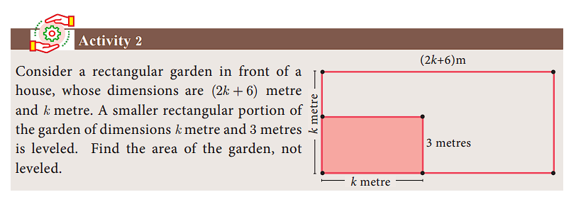
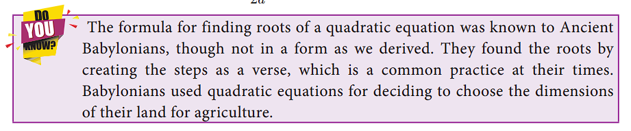
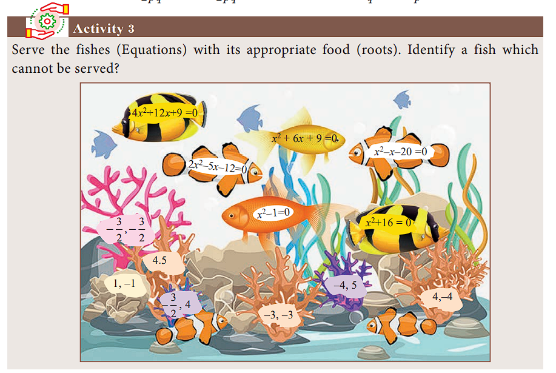
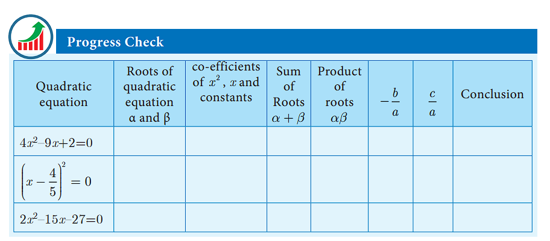


# Quadratic Equations

**Introduction**
Arab mathematician Abraham bar Hiyya Ha-Nasi, often known by the Latin name 
Savasorda, is famed for his book ‘Liber Embadorum’ published in 1145 AD(CE) which is the first book published in Europe to give the complete solution of a quadratic equation. 
For a period of more than three thousand years beginning from early civilizations to current times, humanity knew how to solve a general quadratic equation in terms of its co-efficients by using four arithmetical operations and extraction of roots. This process is called “Solving by Radicals”. Huge amount of research has been carried to this day in solving various types of equations.

**Quadratic Expression**
An expression of degree n in variable x is \\(a_0x^n + a_1x^{n−1} + a_2 x^{n−2} + ... + a_{n-1}x + a_n \\) where \\(a_0\neq0\\) and  \\(a_1,a_2,...a_n \\) are real  numbers. \\(a_0, a_1, a_2, ... a_n \\)are  called  coefficients  of  the expression.
In particular an expression of degree 2 is called a Quadratic Expression which is
expressed as \\(p(x) = ax^2 + bx + c, a\neq0 \\)and a, b, c are real numbers.

## Zeroes of a Quadratic Polynomial
Let p(x) be a polynomial. x=a is called zero of p(x) if p(a)=0
For example, if p(x)=x2–2x–8 then p(–2)=4+4–8 = 0 and p(4)= 16– 8 –8 = 0
Therefore –2 and 4 are zeros of the polynomial \\(p(x)=x^2–2x–8.\\)

## Roots of Quadratic Equations
Let \\(p(x) = ax^2 + bx + c, a\neq0 c\\)  be a quadratic equation. The values of x such that the expression \\(p(x) = ax^2 + bx + c\\) becomes zero are called roots of the quadratic equation \\(p(x) = ax^2 + bx + c\\)

We have, 
\\( ax^2 + bx + c\\) 

\\(a\Big[x^2+\frac{b}{a}x+\frac{c}{a}\Big]=0  \\)

\\( x^2+\frac{b}{a}x+\frac{c}{a}=0 \\) Since \\(a\neq0\\) 

\\( x^2+\frac{b}{2a}(2x)+(\frac{b}{2a})^2 - (\frac{b}{2a})^2 + \frac{c}{a} = 0 \\)

That is, \\( x^2+(2x) (\frac{b}{2a})^2 + (\frac{b}{2a})^2 =\frac{b^2}{4a^2}-\frac{c}{a}  \\)

\\( \Big(x+\frac{b}{2a}\Big)^2 \\) = \\( \frac{b^2-4ac}{4a^2}\\)

\\( x+\frac{b}{2a} \\) = \\( { \pm \sqrt{b^2-4ac} \over 2a} \\)

\\( x = {-b \pm \sqrt{b^2-4ac} \over 2a} \\)

Therefore, the roots are \\({-b + \sqrt{b^2-4ac} \over 2a} \\) and \\(  {-b - \sqrt{b^2-4ac} \over 2a} \\)

## Formation of a Quadratic Equation
 
if \\( \alpha \\) and \\( \beta\\) are roots of quadractic equation \\(ax^2+bx+c=0\\) then 

\\( \alpha={-b + \sqrt{b^2-4ac} \over 2a} \\) and \\( \beta={-b - \sqrt{b^2-4ac} \over 2a} \\) 

Also, \\( \alpha+\beta={-b + \sqrt{b^2-4ac}-b - \sqrt{b^2-4ac} \over 2a}=\frac{-b}{a} \\)

and \\( \alpha\beta=\Big({-b + \sqrt{b^2-4ac} \over 2a}\Big) × \Big({-b - \sqrt{b^2-4ac} \over 2a}\Big) =\frac{c}{a} \\)

Since, \\(  (x-\alpha)\\) and \\(  (x-\beta)\\) are factors of \\(ax^2+bx+c=0\\)

We have \\(  (x-\alpha)(x-\beta) =0 \\)

Hence, \\( x^2-(\alpha+\beta)x+\alpha\beta =0 \\)

That is,  \\( x^2\\) - (sum of roots) x + product of roots = 0 is the
general form of the quadratic equation when the roots are given.

**Example 3.23** Find the zeroes of the quadratic expression \\(x^2+8x+12\\)

**Solution** Let \\( p(x)=x^2+8x+12 = (x+2)(x+6) \\)

p(–2)= 4 – 16 + 12=0

p(–6)= 36 – 48 + 12=0

Therefore –2 and –6 are zeros of \\( p(x)=x^2+8x+12 \\)

**Example 3.24** Write down the quadratic equation in general form for which sum and product of the roots are given below.

(i)9,14
(ii)\\( -\frac{7}{2},\frac{5}{2} \\)
(iii)\\( -\frac{3}{5},\frac{1}{2} \\)

**Solution** (i) General form of the quadratic equation when the roots are given is 

 \\( x^2\\) - (sum of roots) x + product of roots = 0

\\( x^2-9x+14=0 \\)

(ii) \\( x^2-\Big[-\frac{7}{2}\Big]x+\frac{5}{2}=0 ⇒ 2x^2+7x+5=0\\)

(iii) \\( x^2-\Big[-\frac{3}{5}\Big]x+\Big[-\frac{1}{2}\Big]=0 ⇒ \frac{10x^2+6x-5}{10}=0\\)

Therefore, \\( {10x^2+6x-5}=0\\)

**Example 3.25** Find the sum and product of the roots for each of the following quadratic equations:

(i) \\( x^2+8x-65=0\\)
(ii) \\( 2x^2+5x+7=0\\)
(iii) \\( kx^2-k^2x-2k^3=0 \\)

Solution Let \\( \alpha \\) and \\( \beta \\) be the roots of the given quadratic equation

(i) \\( x^2+8x-65=0\\)

a = 1, b = 8, c = –65

\\( \alpha+\beta=-\frac{b}{a}=-8 \\) and \\( \alpha\beta=\frac{c}{a}=-65\\)

\\( \alpha+\beta=-8 \\);  \\( \alpha\beta=-65\\)

----

(ii) \\( 2x^2+5x+7=0\\)

a = 2, b = 5, c = 7

\\( \alpha+\beta=-\frac{b}{a}=\frac{-5}{2} \\)and \\( \alpha\beta=\frac{c}{a}=\frac{7}{2}\\)

\\( \alpha+\beta=\frac{-5}{2}  \\);  \\( \alpha\beta=\frac{7}{2}\\)

(iii) \\( kx^2-k^2x-2k^3=0 \\)

\\(a = k, b = -k^2 , c = –2k^3 \\)

\\( \alpha+\beta=-\frac{b}{a}=\frac{-(-k)^2}{k}=k \\) and \\( \alpha\beta=\frac{c}{a}=\frac{-2k^3}{k}= -2k^2\\)

1. Determine the quadratic equations, whose sum and product of roots are

(i) -9, 20 (ii)\\( \frac{5}{3},4\\) (iii)\\( \frac{-3}{2},-1\\)
(iv)\\( -(2-a)^2,(a+5)^2 \\)

2. Find the sum and product of the roots for each of the following quadratic equations

(i)\\( x^2+3x-28=0\\)

(ii)\\( x^2+3x=0\\)

(iii)\\( 3+\frac{1}{a}=\frac{10}{a^2}\\)

(iv)\\( 3y^2-y-4=0\\)

 ## Solving Quadratic Equations

 We have already learnt how to solve linear equations in one, two and three variable(s). Recall that the values of the variables which satisfies a given equation are called its solution(s). In this section, we are going to study three methods of solving quadratic equation, namely factorization method, completing the square method and using formula.
**Solving a quadratic equation by factorization method.**
We follow the steps provided below to solve a quadratic equation through factorization method.

**Step 1:** Write the equation in general form \\(ax^2+bx+c=0\\)
**Step 2:** By splitting the middle term, factorize the given equation.
**Step 3:** After factorizing, the given quadratic equation can be written as product of two linear factors.
**Step 4:** Equate each linear factor to zero and solve for x.
These values of x gives the roots of the equation

**Example** 3.26 Solve \\(2x^2-2\sqrt6x+3=0\\)

**Solution** 

\\(2x^2-2\sqrt6x+3=ax^2-\sqrt6x-\sqrt6x+3\\) (by spliting the middle term)

\\(=\sqrt2x(\sqrt2x-\sqrt3)-\sqrt3(\sqrt2x-\sqrt3)=(\sqrt2x-\sqrt3)(\sqrt2x-\sqrt3)\\)

Now, equating the factors to zero we get,

\\((\sqrt2x-\sqrt3)(\sqrt2x-\sqrt3)=0\\)

\\((\sqrt2x-\sqrt3)^2=0\\)

\\(\sqrt2x-\sqrt3=0\\)

∴ the solution is \\( x=\frac{\sqrt3}{\sqrt2}\\)

**Example 3.27** Solve \\( 2m^2+19m+30=0\\)

**Solution**

 \\( 2m^2+19m+30=2m^2+4m+15m+30=2m(m+2)+15(m+2) \\)
 \\( (m+2)(2m+15)\\)

  Equating the factors to zero we get,
 \\( (m+2)(2m+15)=0\\)

 \\(  m+2=0 ⇒m=-2 \\)or \\( 2m+15=0\\) we get, \\(m=\frac{-15}{2}\\)

 Therefore the roots are -2 ,\\(\frac{-15}{2}\\)

 Some equations which are not quadratic can be solved by reducing them to quadratic
equations by suitable substitutions. Such examples are illustrated below.

**Example 3.28** Solve \\( x^4-13x^2+42=0\\)

**Solution** Let \\(x^2=a\\) Then, \\( (x^2)^2-13x^2+42=a^3-13a+42=(a-7)(a-6)   \\)

Given, \\( (a-7)(a-6) =0  \\)we get, a = 7 or 6.

Since \\(a=x^2, x^2=7\\) then \\( x=\pm\sqrt7\\) or \\(x^2=6\\) We get,\\( x=\pm\sqrt6\\) 

Therefore the roots are \\( x=\pm\sqrt7\\), \\( \pm\sqrt6\\)

**Example 3.29** Solve \\( \frac{x}{x-1}+\frac{x+1}{x}=2\frac{1}{2}  \\)

**Solution** Let \\( y=\frac{x}{x-1}\\) then \\(\frac{1}{y}=\frac{x-1}{x}\\)

Therefore, \\( \frac{x}{x-1}+\frac{x+1}{x}=2\frac{1}{2}  \\) becomes \\( y+\frac{1}{y}=\frac{5}{2}  \\)

\\(2y^2-5y+2=0\\) then, \\(y=\frac{1}{2},2\\)

\\( \frac{x}{x-1}=\frac{1}{2}\\)  we get, 2x=x-1 implies x = −1

\\( \frac{x}{x-1}=2 \\)  we get, x=2x-2 implies x = 2

Therefore, the roots are x = −1, 2.

1. Solve the following quadratic equations by factorization method

(i) \\( 4x^2-7x-2=0\\)
(ii) \\( 3(p^2-6)=p(p+5) \\)
(iii) \\( \sqrt{a(a-7)}=3\sqrt2 \\)

(iv) \\( \sqrt2x^2+7x+5\sqrt2=0\\)
(v)\\( 2x^2-x+\frac{1}{8}=0\\)

2. The number of volleyball games that must be scheduled in a league with n teams is given by G(n)=\\(\frac{n^2-n}{2} \\)
where each team plays with every other team exactly once. A
league schedules 15 games. How many teams are in the league?

**Solving a Quadratic Equation by Completing the Square Method**

In deriving the formula for the roots of a quadratic equation we used completing
the squares method. The same technique can be applied in solving any given quadratic
equation through the following steps.

Step 1: Write the quadratic equation in general form \\(ax^2+bx+c=0\\)

Step 2: Divide both sides of the equation by the coefficient of \\(x^2\\) if it is not 1.

Step 3: Shift the constant term to the right hand side.

Step 4: Add the square of one-half of the coefficient of x to both sides.

Step 5: Write the left hand side as a square and simplify the right hand side.

Step 6: Take the square root on both sides and solve for x.

**Example 3.30** Solve \\(x^3-3x-2=0\\)

\\(x^3-3x=2\\) (Shifting the Constant to RHS)

\\(x^3-3x+(\frac{3}{2})^2=2+(\frac{3}{2})^2 \\) (Add\\( [\frac{1}{2}(co-efficient of x)]^2  \\))to both sides

\\( (x-\frac{3}{2})^2=\frac{17}{4} \\) (writing the LHS as complete square)

\\( (x-\frac{3}{2})=\pm\frac{\sqrt{17}}{2} \\) (Taking the square root on both sides)

\\( x=\frac{3}{2}+\frac{\sqrt{17}}{2}  \\)or \\( x=\frac{3}{2}-\frac{\sqrt{17}}{2}  \\)

Therefore, \\(  x=\frac{3+\sqrt{17}}{2} , \frac{3-\sqrt{17}}{2}  \\)

**Example 3.31** Solve \\( 2x^2-x-1=0 \\)

**Solution** 
\\( 2x^2-x-1=0 \\)

\\(  x^2-\frac{x}{2}-\frac{1}{2}=0\\) (÷2 make co-efficient of \\(x
^2\\) as 1)

\\(  x^2-\frac{x}{2}=\frac{1}{2}\\)

\\(  x^2-\frac{x}{2}+(\frac{1}{4})^2=\frac{1}{2}+(\frac{1}{4})^2\\)

\\( (x-\frac{1}{4})^2=\frac{9}{16}=(\frac{3}{4})^2 \\)

\\( x-\frac{1}{4}=\pm\frac{3}{4} ⇒ x=1,-\frac{1}{2} \\)

----------

**Solving a Quadratic Equation by Formula Method**
The formula for finding roots of a quadratic equation \\(ax^2+bx+c=0\\) (derivation
given in section 3.6.2) is \\( x = {-b \pm \sqrt{b^2-4ac} \over 2a} \\)

**Example 3.32** Solve \\( x^2+2x-2=0 \\) by formula method

**Solution** Compare \\( x^2+2x-2=0 \\)  with the standard form \\(ax^2+bx+c=0\\)

a = 1, b = 2, c = -2

\\( x = {-b \pm \sqrt{b^2-4ac} \over 2a} \\)

substituting the values of a, b and c in the formula we get,

\\( x = {-2 \pm \sqrt{(2)^2-4(1)(-2)} \over 2(1)} \\) = \\( {-2 \pm \sqrt{12} \over 2}= -1\pm\sqrt3 \\) 

Therefore, \\(-1+-\sqrt3, -1 -\sqrt3 \\) 

-----

**Example 3.33** Solve \\( 2x^2-3x-3=0 \\) by formula method.

**Solution** Compare \\( 2x^2-3x-3=0 \\) with the standard form \\(ax^2+bx+c=0\\)

 a = 2, b = −3 , c = −3

\\( x = {-b \pm \sqrt{b^2-4ac} \over 2a} \\)

substituting the values of a, b and c in the formula we get,

\\( x = {-(-3) \pm \sqrt{(-3)^2-4(2)(-3)} \over 2(2)} \\) = \\( {3 \pm \sqrt{33} \over 4} \\)

Therefore, \\( x= {3 + \sqrt{33} \over 4} , {3 - \sqrt{33} \over 4}  \\)

-----

**Example 3.34** Solve \\( 3p^2+2\sqrt5p-5=0 \\) by formula method

Compare \( 3p^2+2\sqrt5p-5=0 \\) with the standard form \\(ax^2+bx+c=0\\)

 a = 3, b =\\( 2\sqrt5  \\) , c = −5 . 

\\( x = {-b \pm \sqrt{b^2-4ac} \over 2a} \\)

substituting the values of a, b and c in the formula we get,

\\( x = {-2\sqrt5  \pm \sqrt{(2\sqrt5 )^2-4(3)(-5)} \over 2(3)} \\) = \\(  {-2\sqrt5  \pm \sqrt{80} \over 6} \\) = \\(  {-\sqrt5  \pm 2\sqrt{5} \over 3} \\)

Therefore, x=\\( \frac{\sqrt5}{3} , -\sqrt5 \\)

-------

**Example 3.35** Solve \\( pqx^2-(p+q)^2+(p+q)^2=0  \\)

Solution Compare the coefficients of the given equation with the standard form \\(ax^2+bx+c=0\\)

a = pq , b=\\( -(p+q)^2 \\) , c = \\( (p+q)^2 \\)

\\( x = {-b \pm \sqrt{b^2-4ac} \over 2a} \\)

substituting the values of a, b and c in the formula we get,

\\( x = {-[-(p+q)^2] \pm \sqrt{[-(p+q)^2]^2-4(pq)(p+q)^2} \over 2pq} \\) = \\(  (p+q)^2 \pm \sqrt{(p+q)^4-4(pq)(p+q)^2} \over 2pq \\)

= \\(  (p+q)^2 \pm \sqrt{(p+q)^2[(p+q)^2-4pq]} \over 2pq \\)

= \\(  (p+q)^2 \pm \sqrt{(p+q)^2(p^2+q^2+2pq-4pq)} \over 2pq \\)

= \\(  (p+q)^2 \pm \sqrt{(p+q)^2(p-q)^2} \over 2pq \\)

= \\(  (p+q)^2 \pm {(p+q)(p-q)} \over 2pq \\)

= \\(  (p+q) { \{(p+q)\pm (p-q)\} } \over 2pq \\)

Therefore, \\( x=\frac{p+q}{2pq}×2p , \frac{p+q}{2pq}×2q\\) we get, 
\\( x=\frac{p+q}{q} , \frac{p+q}{p}\\)

1. Solve the following quadratic equations by completing the square method

(i) \\( 9x^2-12x+4=0\\) 
(ii) \\( \frac{5x+7}{x-1}=3x+2\\)

2. Solve the following quadratic equations by formula method

(i) \\( 2x^2-5x+2=0\\)
(ii) \\(\sqrt2f^2-6f+3\sqrt2=0 \\)
(iii) \\( 3y^2-20y-23=0 \\)
(iv) \\( 36y^2-12ay+(a^2-b^2)=0 \\)

3. A ball rolls down a slope and travels a distance \\( d=t^2-0.75t \\) feet in t seconds. Find the time when the distance travelled by the ball is 11.25 feet.

## Solving Problems Involving Quadratic Equations
**Steps to solve a problem**
**Step 1:** Convert the word problem to a quadratic equation form
**Step 2:** Solve the quadratic equation obtained in any one of the above three methods.
Step 3: Relate the mathematical solution obtained to the statement asked in the
question

**Example 3.36** The product of Kumaran’s age (in years) two years ago and his age four years from now is one more than twice his present age. What is his present age?
**Solution** Let the present age of Kumaran be x years.
 
Two years ago, his age = (x − 2) years.

Four years from now, his age = (x + 4)years.
 
Given,	(x − 2)(x + 4)= 1 +2x
x 2 + 2x − 8=1 +2x	=> (x − 3)(x + 3) = 0 then, \\(x=\pm3\\)

Therefore, x = 3 (Rejecting −3 as age cannot be negative) Kumaran’s present age is 3 years.

----

**Example 3.37** A ladder 17 feet long is leaning against a wall. If the ladder, vertical wall and the floor from the bottom of the wall to the ladder form a right triangle, find the height of the wall where the top of the ladder meets if the distance between bottom of the wall to bottom of the ladder is 7 feet less than the height of the wall?

**Solution** Let the height of the wall AB = x feet
As per the given data BC = (x–7) feet
In the right triangle ABC, AC =17 ft, BC = (x–7) feet

By Pythagoras theorem, \\( AC^2=AB^2+BC^2 \\)

\\( (17)^2=x^2+(x-7)^2;  289=x^2+x^2-14x+49\\)

\\( x^2-7x-120=0 \\) hence, (x-15)(x+8)=0 then, x=15 (or) -8.

Therefore, height of the wall AB= 15 ft (Rejecting −8 as height cannot be negative)

-----

**Example 3.38** A flock of swans contained \\( x^2\\) members. As the clouds gathered, 10x went to a lake and one-eighth of the members flew away to a garden. The remaining three pairs played about in the water. How many swans were there in total?

**Solution** As given there are \\( x^2\\) swans.

As per the given data \\( x^2-10x-\frac{1}{8}x^2=6\\) we get, \\( 7x^2-80x-48=0\\)

\\( x = {-b \pm \sqrt{b^2-4ac} \over 2a} \\) = \\(  {80 \pm \sqrt{6400-4(7)(-48)} \over 14} \\) = \\(  {80 \pm 88} \over 14 \\) 

Therefore, x=12, \\(-\frac{4}{7}\\)

Here \\(x= -\frac{4}{7}\\) is not possible as the number of swans cannot be negative

Hence, x = 12. Therefore total number of swans is \\( x^2\\)=144

-------

**Example 3.39** A passenger train takes 1 hr more than an express train to travel a distance of 240 km from Chennai to Virudhachalam. The speed of passenger train is less than that of an express train by 20 km per hour. Find the average speed of both the trains.

**Solution** Let the average speed of passenger train be x km/hr.

Then the average speed of express train will be (x + 20) km/hr

Time taken by the passenger train to cover distance of 240 km = \\(  \frac{240}{x} \\)hr

Time taken by express train to cover distance of 240 km= \\(  \frac{240}{x+20} \\)hr

Given, \\(  \frac{240}{x} \\)=\\(  \frac{240}{x+20}+1 \\)

\\( 240[\frac{1}{x}-\frac{1}{x+20}] =1 ⇒
 240\Big[\frac{x+20-x}{x(x+20)}\Big]=1 \\) we get. 4800=\\( (x^2+20x) \\)

\\( x^2+20x-4800=0 ⇒ (x+80)(x-60)=0 \\) we get, x = –80 or 60.

Therefore x = 60 (Rejecting -80 as speed cannot be negative)
 Average speed of the passenger train is 60 km/hr
 Average speed of the express train is 80 km/hr.

1. If the difference between a number and its reciprocal is \\(\frac{24}{5} \\) , find the number.

2. A garden measuring 12m by 16m is to have a pedestrian pathway that is ‘w’ meters wide installed all the way around so that it increases the total area to 285 \\(m^2\\). What is the width of the pathway?

3. A bus covers a distance of 90 km at a uniform speed. Had the speed been 15 km/hour more it would have taken 30 minutes less for the journey. Find the original speed of the bus.

4. A girl is twice as old as her sister. Five years hence, the product of their ages (in years) will be 375. Find their present ages. 
5. A pole has to be erected at a point on the boundary of a circular ground of diameter 20 m in such a way that the difference of its distances from two diametrically opposite fixed gates P and Q on the boundary is 4 m. Is it possible to do so? If answer is yes at what distance from the two gates should the pole be erected? 

6. From a group of \\(2x^2\\) black bees , square root of half of the group went to a tree. Again eight-ninth of the bees went to the same tree. The remaining two got caught up in a fragrant lotus. How many bees were there in total? 

7. Music is been played in two opposite galleries with certain group of people. In the first gallery a group of 4 singers were singing and in the second gallery 9 singers were singing. The two galleries are separated by the distance of 70 m. Where should a person stand for hearing the same intensity of the singers voice? (Hint: The ratio of the sound intensity is equal to the square of the ratio of their corresponding distances). 

8. There is a square field whose side is 10 m. A square flower bed is prepared in its centre leaving a gravel path all round the flower bed. The total cost of laying the flower bed and gravelling the path at ₹3 and ₹4 per square metre respectively is ₹364. Find the width of the gravel path. 

9. The hypotenuse of a right angled triangle is 25 cm and its perimeter 56 cm. Find the length of the smallest side. 

## Nature of Roots of a Quadratic Equation

The roots of the quadratic equation  \\(ax^2+bx+c=0\\),\\(a\neq0\\)  are found using the formula \\( x = {-b \pm \sqrt{b^2-4ac} \over 2a} \\). Here, \\( b^2-4ac \\) called as the discriminant (which is denoted by Δ ) of the quadratic equation, decides the nature of roots as follows

| Values of Discriminant Δ= \\( b^2-4ac \\)  | Nature of Roots  | 
|----------|----------|
|  Δ>0 | Real and Unequal roots | 
|  Δ=0| Real and Equal roots |
|  Δ<0 | No Real root | 

**Example 3.40** Determine the nature of roots for the following quadratic equations

(i) \\( x^2-x-20=0 \\)
(ii) \\( 9x^2-24x+16 \\)
(iii) \\( 2x^2-2x+9=0\\)

**Solution** (i) \\( x^2-x-20=0 \\)

Here, a = 1, b = −1 , c = −20

Now, Δ= \\( b^2-4ac \\) 

Δ= \\( (-1)^2-4(1)(-20)=81 \\) 

Here, Δ=81>0  So, the equation will have real and unequal roots.

(ii) \\( 9x^2-24x+16 \\)

Here, a = 9 , b = −24 , c = 16

Now, Δ= \\( b^2-4ac =  (-24)^2-4a(9)(16)=0 \\) 

Here, Δ=0. So, the equation will have real and equal roots.

(iii) \\( 2x^2-2x+9=0\\)

Here, a = 2 , b = −2 , c = 9

Now, Δ= \\( b^2-4ac =  (-2)^2-4a(2)(9)=-68 \\) 

Here, Δ=-68<0  So, the equation will have real and unequal roots.

--------

**Example 3.41** (i) Find the values of ‘k’, for which the quadratic equation  \\(kx^2+(8k+4)x+81=0\\)  has real and equal roots?

(ii) Find the values of ‘k’ such that quadratic equation \\( (k+9)x^2+(k+1)x+1=0 \\) has no real roots?

**Solution** (i) \\(kx^2+(8k+4)x+81=0\\) 

Since the equation has real and equal roots, ∆ = 0 .

That is, \\( b^2-4ac=0 \\) 

Here, a=k , b=-(8k+4) , c = 81

That is, \\( [-(8k+4)]^2-4(k)(81)=0 \\) 

\\( 64k^2+64k+16-324k=0  \\)

\\( 64k^2-260k+16=0  \\)

Dividing by 4 we get \\( 16k^2-65k+4=0  \\)

(16k-1)(k-4)=0 then, k=\\(\frac{1}{16}\\) or k=4

----

(ii) \\( (k+9)x^2+(k+1)x+1=0 \\)

Since the equation has no real roots, ∆ < 0 

That is, \\( b^2-4ac<0 \\) 

Here, a= k + 9 , b = k + 1 , c = 1

That is, \\( (k+1)^2-4(k+9)(1)<0 \\) 

\\( k^2+2k+1-4k-36<0 \\) 

\\( k^2-2k-35<0 \\) 

\\( (k+5)(k-7)<0 \\) 

Therefore, -5 < k < 7. {If α < β and if (x-α)(x-β)<0 then, α < x < β }

--------

**Example 3.42** Prove that the equation \\( x^2(p^2+q^2)+2x(pr+qs)+r^2+s^2=0 \\) has no real roots. If ps = qr , then show that the roots are real and equal.

**Solution**  The given quadratic equation is, \\( x^2(p^2+q^2)+2x(pr+qs)+r^2+s^2=0 \\)

Here, \\( a=p^2+q^2, b=2(pr+qs), c=r^2+s^2 \\)

Now, Δ= \\( b^2-4ac\\) =\\( [2(pr+qs)]^2 -4(p^2+q^2)(r^2+s^2) \\)

\\( =[p^2r^2+2pqrs+q^2s^2-p^2r^2-p^2s^2-q^2r^2-q^2s^2] \\)

\\( =4[-p^2s^2+2pqrs-q^2r^2] \\) = \\( 4[(ps-qr)^2] <0\\)   ...(1)

Since Now, Δ= \\( b^2-4ac<0 \\),the roots are not real.

If ps = qr then  Δ=\\( -4[ps-qr]^2= -4[qr-qr]^2=0 \\) (using (1))
Thus, Δ = 0 if ps = qr and so the roots will be real and equal. 

1. Determine the nature of the roots for the following quadratic equations

(i)\\(  15x^2+11x+2=0 \\)
(ii)\\( x^2-x-1=0\\)
(iii) \\( \sqrt2t^2-3t+3\sqrt2=0\\)

(iv)\\( 9y^2-6\sqrt2y+2=0\\)
(v) \\( 9a^2b^2x^2-24abcdx+16c^2d^2=0, a\neq0, b\neq0 \\)

2. Find the value(s) of ‘k’ for which the roots of the following equations are real and equal. 
(i) \\( (5k-6)x^2+2kx+1=0 \\)
(ii) \\( kx^2+(6k+2)x+16=0 \\)

3. If the roots of \\( (a-b)x^2+(b-c)x+(c-a)=0  \\) are real and equal, then prove that b,
a, c are in arithmetic progression.

4. If a, b are real then show that the roots of the equation \\( (a-b)x^2-6(a+b)x-9(a-b)=0  \\) are real and unequal.

5. If the roots of the equation \\( (c^2-ab)x^2-2(a2-bc)x-ac=0 \\) are real and equal prove that either a=0 (or) \\( a^3+b^3+c^3=3abc \\)

## The Relation between Roots and Coefficients of a Quadratic Equation 

Let α and β are the roots of the equation \\(ax^2+bx+c=0\\) then, 
\\( α  = {-b + \sqrt{b^2-4ac} \over 2a} , β  = {-b - \sqrt{b^2-4ac} \over 2a}  \\)

From 3.6.3, we get 

α+β=\\( \frac{-b}{a}=\frac{−Co-efficient \space of \space x}{Co-efficient \space of \space x^2} \\)

αβ=\\( \frac{c}{a}=\frac{Constant \space term}{Co-efficient \space of \space x^2} \\)

**Example 3.43** If the difference between the roots of the equation \\( x^2-13x+k=0\\) is 17
find k.

**Solution** \\( x^2-13x+k=0\\) here a = 1, b = −13 , c=k

Let α , β be the roots of the equation. Then

α+β=\\( \frac{-b}{a}=\frac{-(−13)}{1} =13\\) ...(1) Also α - β=17 ...(2)

(1)+(2) we get, 2α=30 ⇒ α=15

Therefore, 15+β=13 (from(1)) ⇒ β=-2

But αβ=\\( \frac{c}{a}=\frac{k}{1} ⇒\\) 15 × −( 2) = k we get, k = −30

**Example 3.44** If α and β are the roots of \\( x^2+7x+10=0 \\) find the values of 

(i) \\( (α-β) \\)
(ii) \\( α^2+β^2 \\)
(iii) \\( α^3-β^3  \\)
(iv) \\( α^4+β^4 \\)

(v) \\( \frac{α}{β}+\frac{β}{α} \\)
(vi) \\( \frac{α^2}{β}+\frac{β^2}{α} \\)

**Solution** \\( x^2+7x+10=0 \\)   here, a = 1, b = 7 , c=10
If α and β are roots of the equation then,

α+β=\\( \frac{-b}{a}=\frac{(-7)}{1} =-7\\) \\( αβ=\frac{c}{a}=\frac{10}{1}=10  \\)

(i) \\( (α-β) =\sqrt{(α+β)^2-4αβ}= \sqrt{(-7)^2-4×10}=\sqrt9=3 \\)

(ii) \\( α^2+β^2=(α+β)^2-2αβ=(-7)^2-2×10=29\\)

(iii) \\( α^3-β^3 = (α-β)^3+3αβ(α-β)=(3)^2+3(10)(3)=117 \\)

(iv) \\( α^4+β^4= (α^2+β^2)^2-2α^2β^2=29^2-2×(10)^2=641 (from(ii),α^2+β^2=29) \\)

(v) \\( \frac{α}{β}+\frac{β}{α}= \frac{α^2+β^2}{αβ} =\frac{(α+β)^2-2αβ}{αβ} = \frac{49-20}{10}=\frac{29}{10}\\)

(vi) \\( \frac{α^2}{β}+\frac{β^2}{α}= \frac{α^3+β^3}{αβ} = \frac{(α+β)^3-3αβ(α+β)}{αβ}\\)

=\\( \frac{(-343)-3(10×(-7))}{10}=\frac{-343+210}{10}=\frac{-133}{10}  \\)

---

**Example 3.45** If α, β are the roots of the equation \\( 3x^2+7x-2=0 \\) find the values of

(i) \\( \frac{α}{β}+\frac{β}{α} \\)
(ii) \\( \frac{α^2}{β}+\frac{β^2}{α} \\)

**Solution** \\( 3x^2+7x-2=0 \\) here, a = 3 , b = 7 , c = −2

Since α, β are roots of the equation

(i) α+β=\\( \frac{-b}{a}=\frac{(-7)}{3}\\); \\( αβ=\frac{c}{a}=\frac{-2}{3}\\)

\\( \frac{α}{β}+\frac{β}{α}= \frac{α^2+β^2}{αβ} =\frac{(α+β)^2-2αβ}{αβ} = \frac{((\frac{-7}{3})^2-2(\frac{-2}{3}))}{\frac{-2}{3}}=\frac{-61}{6}\\)

(ii)\\( \frac{α^2}{β}+\frac{β^2}{α}= \frac{α^3+β^3}{αβ} = \frac{(α+β)^3-3αβ(α+β)}{αβ}\\)=\\( \frac{((\frac{-7}{3})^3-3(-\frac{2}{3})(-\frac{7}{3})) }{\frac{-2}{3}} = \frac{469}{18}\\)

Example 3.46 If α, β are the roots of the equation \\( 2x^2-x-1=0 \\) then form the equation whose roots are 
(i)\\( \frac{1}{α}, \frac{1}{β} \\)
(ii)\\(  α^2β , β^2α  \\)
(iii) 2α+β , 2β+α

**Solution"" \\( 2x^2-x-1=0 \\) here, a = 2 , b = −1 , c = −1

α+β=\\( \frac{-b}{a}=\frac{-(-1)}{2}= \frac{1}{2}\\); \\( αβ=\frac{c}{a}=-\frac{1}{2}\\)

(i) Given roots are \\( \frac{1}{α}, \frac{1}{β} \\)

Sum of the roots =\\( \frac{1}{α}+\frac{1}{β}=\frac{α+β}{αβ} = \frac{\frac{1}{2}}{-\frac{1}{2}} =-1\\)

Product of the roots = \\( \frac{1}{α}×\frac{1}{β}=\frac{1}{αβ} =\frac{1}{-\frac{1}{2}}=-2 \\)

The required equation is \\( x^2\\) –(Sum of the roots)x + (Product of the roots)=0

\\( x^2-(-1)x-2=0 ⇒ x^2+x-2=0 \\)

(ii) Given roots are \\( α^2β,β^2α \\)

Sum of the roots \\( α^2β,β^2α=αβ(α+β) =-\frac{1}{2}(\frac{1}{2})=-\frac{1}{4} \\)

Product of the roots = \\( (α^2β)×(β^2α) = α^3β^3=(αβ)^3=(-\frac{1}{2})^3=-\frac{1}{8} \\)

The required equation is \\( x^2\\) –(Sum of the roots)x + (Product of the roots)=0

\\( x^2-(-\frac{1}{4})x-\frac{1}{8}=0 ⇒ 8x^2+2x-1=0  \\)

(iii) 2α+β , 2β+α

Sum of the roots \\( 2α{+β+2β+α=3(α+β)=3(\frac{1}{2})=\frac{3}{2} } \\)

Product of the roots = \\( (2α+β)(2β+α)=4αβ+2α^2+2β^2+αβ \\)

=\\( 5αβ+2(α^2+β^2)=5αβ+2\Big[(α+β)^2-2αβ\Big]  \\)

=\\(5(-\frac{1}{2}+2[\frac{1}{4}-2 × -\frac{1}{2}]=0) \\)

The required equation is \\( x^2\\) –(Sum of the roots)x + (Product of the roots)=0

\\( x^2-\frac{3}{2}x+0=0 ⇒ 2x^2-3x=0 \\)

1. Write each of the following expression in terms of α+β  and αβ

(i) \\( \frac{α}{3β}+\frac{β}{3α} \\)
(ii) \\( \frac{1}{α^2β}+\frac{1}{β^2α} \\)
(iii) \\( (3α-1)(3β-1) \\)
(iv) \\( \frac{α+3}{β}+\frac{β+3}{α}  \\)

2. The roots of the equation \\( 2x^2-7x+5=0 \\) are α and β. Without solving for the roots,find

(i)\\( \frac{1}{α}+\frac{1}{β}  \\)
(ii)\\( \frac{α}{β}+\frac{β}{α} \\)
(iii)\\( \frac{α+2}{β+2}+\frac{β+2}{α+2} \\)

3. The roots of the equation \\( x^2+6x-4=0 \\) are α, β. Find the quadratic equation whose roots are

(i) \\( α^2 \space and \space β^2  \\)
(ii) \\( \frac{2}{α} and \frac{2}{β} \\)
(iii) \\( α^2β \space and \space β^2α \\)

4. If α, β are the roots of \\( 7x^2+ax+2=0 \\) and if β-α = \\( \frac{−13}{7} \\).Find the values of a.

5. If one root of the equation \\( 2y^2-ay+64=0 \\) is twice the other then find the values of a.

6. If one root of the equation \\( 3x^2+kx+81=0 \\) (having real roots) is the square of the other then find k.

