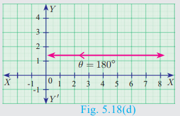
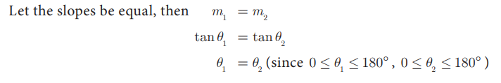
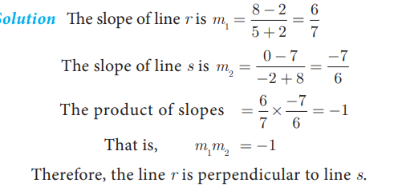
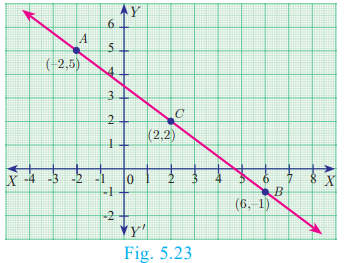
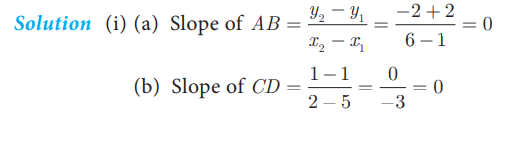
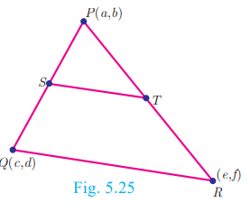
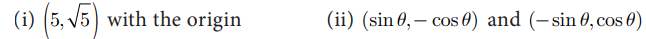

#  Inclination of line

>The inclination of a line or the angle of inclination of a line is the angle which a straight line makes with the positive direction of X axis measured in the counter-clockwise direction to the part of the line above the X axis. The inclination of the line is usually denoted by q .

## Note

- The inclination of *X* axis and every line parallel to *X* axis is 0°
  .

- The inclination of *Y* axis and every line parallel to *Y* axis is
  90°.

  # 5.4.1  Slope of a Straight line

> While laying roads one must know how steep the road will 
be.

> Similarly, when constructing a staircase, we should consider its > steepness. For the same reason, anyone travelling along a hill or a > bridge, feels hard compared to travelling along a plain road.

> All these examples illustrate one important aspect called “Steepness”.
> The measure of steepness is called slope or gradient.
>
> The concept of slope is important in economics because it is used to > measure the rate at which the demand for a product changes in a given > period of time on the basis of its price. Slope comprises of two > factors namely steepness and direction.
>

> 
>
>
>
><h3>Definition</h3>
>
> If *q* is the angle of inclination of a non-vertical straight line, > then tan *q* is called the slope or gradient of the line and is > denoted by *m*.
>
> Therefore the slope of the straight line is *m* = tan *q* , 0 ≤ *q* ≤
> 180° , *q* ≠ 90°

## Values of slopes
<table>
<tr>
<th>S. No.</th>
<th>Condition</th>
<th>Slope</th>
<th>Diagram</th>
</tr>
<tr>
<th>(i)</th>
<th>q = 0°</th>
<th>The line is parallel 
to the positive 
direction of X axis.</th>
<th></th>
</tr>
<tr>
<th>(ii)</th>
<th>0=q=90°</th>
<th>The line has positive 
slope (A line with 
positive slope rises 
from left to right).</th>
<th></th>
</tr>
<tr>
<th>(iii)</th>
<th>90°=q=180°</th>
<th>The line has negative 
slope (A line with 
negative slope falls 
from left to right).</th>
<th></th>
</tr>
<tr>
<th>(iv)</th>
<th>q = 180°</th>
<th>The line is parallel 
to the negative 
direction of X axis.</th>
<th></th>
</tr>
<tr>
<th>(v)</th>
<th>q = 90°</th>
<th>The slope is 
undefined.</th>
<th></th>
</tr>
</table>

<h3>Activity 3</h3>

>The diagram contain four lines I1,I2,I3 and I4

- (i) Which lines have positive slope?

- (ii) Which lines have negative slope?

#  Slopes of parallel lines

>Two non-vertical lines are parallel if and only if 
their slopes are equal.

>Let I1,I2 two non-vertical lines with slopes 
m1 and m2 respectively

>Let the inclination of the lines with positive direction 
of X axis be q1 and q2 respectively.

>Assume,I1,I2 are parallel

> q1=q2

>tanq1=tanq2

>m1=m2

Hence, the slopes are equal.
Therefore, non-vertical parallel lines have equal slopes.

<b>Conversely</b>

>That is the corresponding angles are equal.

>Therfore I1,I2 are parallel.

>Thus, non-vertical lines having equal slopes are parallel. 
Hence, non vertical lines are parallel if and only if their slopes are equal.

#  Slopes of perpendicular lines

>Two non-vertical lines with slopes m1
and m2 are perpendicular if and only if 
 m1m2= −1 .

>Let I1,I2 be two non-vertical lines 
with slopes  m1,m2 , respectively. Let their 
inclinations be q1 and q2 respectively

>Then m1= tanq1 and m2=tanq2

>First we assume that, I1,I2 perpendicular to each other.

>Then ∠ABC= 90°−q (sum of angles of ABC is 180°)

<b>Conversely,</b>

>Letbe I1,I2 two non-vertical lines with slopes m1 and m2 respectively, such that m1m2= −1 

<b>NOTE</b>

>Let I1,I2 be two lines with well-defined slopes m1 and m2 respectively, then

- (i) I1,I2 if and only if m1=m2 .

- (ii) I1 is perpendicular to I2 if and only if m1m2= −1 .

<b>Example 5.8</b>

- (i) What is the slope of a line whose inclination is 30°?
- (ii) What is the inclination of a line whose slope is 3 ?

<b>Solution</b>

<b>Example 5.9</b>  Find the slope of a line joining the given points

<b>Solution</b>

<b>Example 5.10</b>  The line r passes through the points (–2, 2) and (5, 8) and the line s
passes through the points (–8, 7) and (–2, 0). Is the line r perpendicular to s ?

<b>solution</b>

<b>Example 5.12</b>  Show that the points (-2,5), (6,-1) and (2,2) are collinear

<b>Solution</b> he vertices are A(-2,5), B(6,-1) and C(2,2).

>We get, Slope of AB = Slope of BC

>Therefore, the points A, B, C all lie in a same straight line
Hence the points A, B and C are collinear.

<b>Example 5.13</b>  Let A(1,-2), B(6,-2), C(5,1) and D(2,1) be four points

- (i) Find the slope of the line segments (a) AB (b) CD
- (ii) Find the slope of the line segments (a) BC (b) AD
- (iii) What can you deduce from your answer.

<b>Solution</b>

(iii) The slope of AB and CD are equal so AB, CD are parallel.
 Similarly the lines AD and BC are not parallel, since their slopes are not equal.
 So, we can deduce that the quadrilateral ABCD is a trapezium

<b>Example 5.14</b> Consider the graph representing growth of population (in crores). Find 
the slope of the line AB and hence estimate the population in the year 2030?

<b>Solution</b> The points A(2005,96) and B(2015,100)are on the line AB.

>Hence the estimated population in 2030 =106 Crores.

<b>Example 5.15</b> Without using Pythagoras theorem, show that the points (1,-4), (2,-3)and (4,-7) form a right angled triangle.

<b>Solution</b>  Let the given points be A(1,-4), B(2,-3) and C(4,-7).

<b>Example 5.16</b> Prove analytically that the line segment joining the mid-points of two sides 
of a triangle is parallel to the third side and is equal to half of its length.

<b>Solution</b> Let P(a,b) Q(c,d) and R(e,f) be the vertices of a triangle.
Let S be the mid-point of PQ and T be the mid-point of PR

>Therefore, ST is parallel to QR. (since, their slopes are equal)

<b>Exercise 5.2</b>

1. What is the slope of a line whose inclination with positive direction of x -axis is

(i) 90 ° (ii) 0 °

2.  What is the inclination of a line whose slope is (i) 0 (ii) 1
3.  Find the slope of a line joining the points

4. What is the slope of a line perpendicular to the line joining A(5,1) and P where P is 
the mid-point of the segment joining (4,2) and (-6,4).

5. Show that the given points are collinear: (-3,-4), (7,2) and (12,5)

6. If the three points (3,-1), (a,3) and (1,-3) are collinear, find the value of a.

7. The line through the points (-2,a) and (9,3) has slope -1/2. Find the value of a.

8. The line through the points (-2,6) and (4,8) is perpendicular to the line through the points (8,12) and (x,24). Find the value of x.

9. Show that the given points form a right angled triangle and check whether they satisfies pythagoras theorem

(i) A(1,-4), B(2,-3) and C(4,-7) (ii) L(0,5), M(9,12) and N(3,14)

10. Show that the given points form a parallelogram :

A(2.5,3.5), B(10,-4), C(2.5,-2.5) and D(-5,5)

