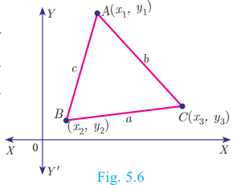
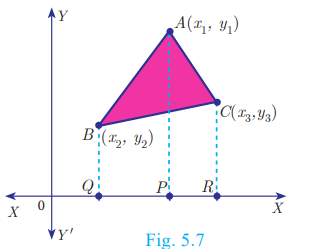
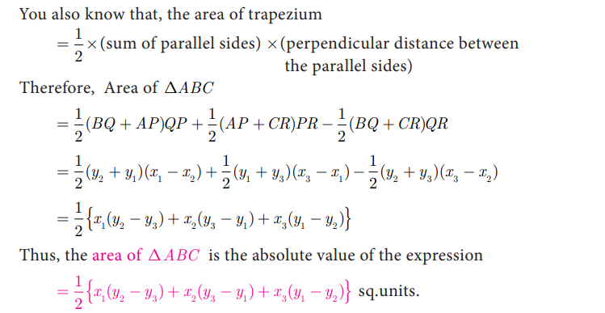

# Area of triangle

>In your earlier classes, you have studied how to calculate the area of a triangle when its base and corresponding height (altitude) are given. You have used the formula
> Area of triangle= (1/2)× base × altitude sq.units.

> Fig. 5.6
>With any three non-collinear points A (*x*1,*y*1), 
B(*x*2,*y*2) and C(*y*3,*y*3)on a plane, we can form a triangle ABC

>Using distance between two points formula, we can calculate AB = c , BC = a , CA = b . a, b, c represent the lengths of the sides of the triangle ABC. >Using 2s a = +b c + , we can calculate the area of triangle ABC by using the Heron’s formula s(s-a)(s-b)(s-c) But this procedure of finding length of sides of DABC and then calculating its area will be a tedious procedure.

>There is an elegant way of finding area of a triangle using the coordinates of its vertices. We shall discuss such a method below.

>Let ABC be any triangle whose vertices are at A (*x*1,*y*1), 
B(*x*2,*y*2) and C(*x*3,*y*3)

>Draw AP, BQ and CR perpendiculars from A, B
and C to the x-axis, respectively. 
>Clearly ABQP, APRC and BQRC are all trapeziums

>Now from Fig.5.7, it is clear that >Area of ABC= Area of trapezium ABQP + Area of trapezium APRC − Area of trapezium BQRC. You also know that, the area of trapeziumS

>The vertices A (*x*1,*y*1), B(*x*2,*y*2) and C(*x*3,*y*3) of DABC are said to be “taken in order” if A, B, C are taken in anticlockwise direction. If we do this, then area of DABC will never be negative
# Another form
>The following pictorial representation helps us to write the above formula very easily.

# process Check

The vertices of DPQR are P(0,-4), Q(3,1) and R(-8,1)
-  Draw PQR on a graph paper

-  Check if PQR is equilateral.

-  Find the area of PQR .

-  Find the coordinates of M, the mid-point of QP. 

-  Find the coordinates of N, the mid-point of QR.

-  Find the area of MPN .

-   What is the ratio between the areas of MPN and PQR ?

