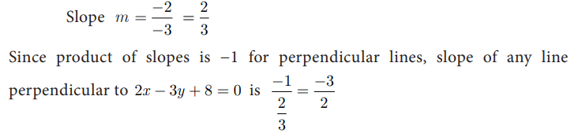
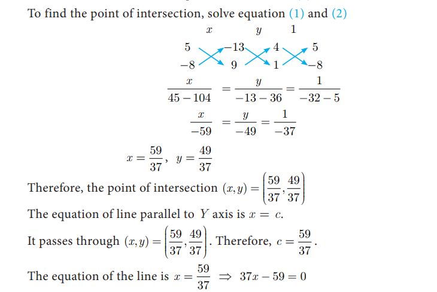
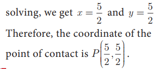
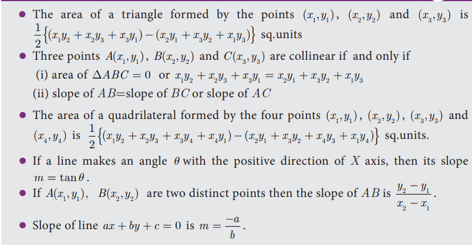
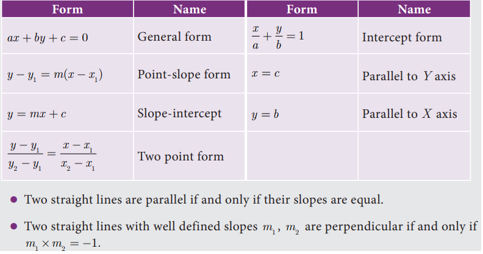
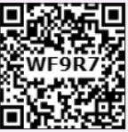

#  General Form of a Straight Line

The linear equation (first degree polynomial in two variables x and y) ax +by+ c = 0 (where a, b and c are real numbers such that at least one of a, b is non-zero) always represents a straight line. This is the general form of a straight line.

Now, let us find out the equations of a straight line in the following cases

- (i) parallel to ax + by + c = 0
- (ii) perpendicular to ax + by + c = 0

## Equation of a line parallel to the line ax + by + c = 0

The equation of all lines parallel to the line ax +by+ c = 0 can be put in the form 
ax +by+k = 0 for different values of k.

## Equation of a line perpendicular to the line ax +by+ c = 0

The equation of all lines perpendicular to the line ax +by+ c = 0 can be written as 
bx −ay+k = 0 for different values of k.

##  Slope of a straight line

The general form of the equation of a straight line is ax +by+c = 0 . (at least one of a, b is non-zero)

coefficient of x a = , coefficient of y b = , constant term= c .

The above equation can be rewritten as by = −ax −c

<b>Example 5.30</b>
Find the slope of the straight line 6x+8y+7=0.

<b>Solution</b>
 Given  6x+8y+7=0

 

<b>Example 5.31</b> Find the slope of the line which is
- (i) parallel to 3x-7y = 11
- (ii) perpendicular to 2x-3y+8=0

<b>Solution</b> 
- (i) Given straight line is 3x-7y = 11

 

- (ii) Given straight line is 2x-3y+8=0

<b>Example 5.32</b>  Show that the straight lines 2x+3y-8=0 and 4x+6y+18=0 are parallel.

<b>Solution</b>

 Slope of the straight line 4x+6y+18=0 is

 

 <b>Example 5.33</b>  Show that the straight lines x-2y+3=0 and 6x+3y+8=0 are perpendicular

 <b>Solution</b>

  Slope of the straight line x-2y+3=0

<b>Example 5.34</b>
 Find the equation of a straight line which is parallel to the line 3x-7y= 12 and passing through the point (6,4).

<b>Solution</b>
 Equation of the straight line, parallel to 3x-7y-12=0 is 3x-7y+k=0

 Since it passes through the point (6,4)

 3(6)− +7(4)+k = 0

 k = 28−18 = 10

 Therefore, equation of the required straight line is 3x-7y=10=0

 <b>Example 5.36</b>
  Find the equation of a straight line parallel to Y axis and passing through the point of intersection of the lines
  4x+5y=13 and x-8y+9=0

  <b>Solution</b>
   Given lines 
   - (1) 4x+5y=13 
   - (2) x-8y+9=0

   

<b>Example 5.37</b> The line joining the points A(0,5) and B(4,1) is a tangent to a circle whose centre C is at the point (4,4) find

- (i) the equation of the line AB.
- (ii) the equation of the line through C which is perpendicular to the line AB.
- (iii) the coordinates of the point of contact of tangent line AB with the circle

<b>Solution</b>

 (i) Equation of line AB, A(0,5) and B(4,1)

  
   

(ii) The equation of a line which is perpendicular 
to the line AB: x+y-5=0 is x-y+k=0

Since it is passing through the point (4,4), we have

4 – 4 + k = 0 ⇒ k = 0

he equation of a line which is perpendicular to AB and through C is x-y = 0

(iii) The coordinate of the point of contact P of the 
 tangent line AB with the circle is point of 
intersection of lines.

x+y-5=0 and x-y=0

## Activity 6

<b>Exercise 5.4</b>

1. Find the slope of the following straight lines 
- (i) 5y − 3 = 0 
- (ii) 7x-(3/17)=0

2. Find the slope of the line which is
- (i) parallel to y = 0.7x -11
- (ii)  perpendicular to the line x = -11

3. Check whether the given lines are parellel or perpendicular

4. If the straight lines 12y= -(p+3)x+12,12x-7y=16 are perpendicular then find ‘p’.

5. Find the equation of a straight line passing through the point P(-5,2) and parallel to 
the line joining the points Q(3,-2) and R(-5, 4).

6. Find the equation of a line passing through (6,–2) and perpendicular to the line 
joining the points (6,7) and (2,–3).

7. A(-3,0) B(10,-2) and C(12,3) are the vertices of ABC . Find the equation of the altitude through A and B.

8. Find the equation of the perpendicular bisector of the line joining the points A(-4,2) and B(6,-4).

9. Find the equation of a straight line through the intersection of lines 7x+3y=10,5x-4y=1 and parallel to the line 13x+5y+12=0

10. Find the equation of a straight line through the intersection of lines 5x-6y=2 , 3x+2y=10 and  perpendicular to the line 4x-7y+13=0

11. Find the equation of a straight line joining the point of intersection of 3x+y+2=0 and x-2y-4=0  to the point of intersection of 7x-3y= -12 and 2y=x+3

12. Find the equation of a straight line through the point of intersection of the lines 8x+3y=18, 4x+5y=9 and bisecting the line segment joining the points (5,-4) and (-7,6)

<b>Exercise 5.5</b>

### Multiple choice questions

1. The area of triangle formed by the points (−5,0) , (0,−5) and (5,0) is

(A) 0 sq.units (B) 25 sq.units (C) 5 sq.units (D) none of these

2. A man walks near a wall, such that the distance between him and the wall is 10 units. 
Consider the wall to be the Y axis. The path travelled by the man is

(A) x = 10 (B) y = 10 (C) x = 0 (D) y = 0

3. The straight line given by the equation x = 11 is

(A) parallel to X axis (B) parallel to Y axis
(C) passing through the origin (D) passing through the point (0,11)

4. If (5,7), (3,p) and (6,6) are collinear, then the value of p is

(A) 3 (B) 6 (C) 9 (D) 12

5. The point of intersection of 3x -y =4 and x+y=8 is

(A) (5,3) (B) (2,4) (C) (3,5) (D) (4,4)

7. The slope of the line which is perpendicular to a line joining the points (0,0) and
(–8,8) is

(A) –1 (B) 1 (C) 1/3 (D) -8

8. If A is a point on the Y axis whose ordinate is 8 and B is a point on the X axis whose 
abscissae is 5 then the equation of the line AB is

(A) 8x+5y=40 (B) 8x-5y=40 (C)x=8 (D)y=5

9. The equation of a line passing through the origin and perpendicular to the line 7x-3y+4=0
(A)7x-3y+4=0 (B)3x-7y+4=0(C) 3x+7y=0(D) 7x-3y=0

10. A straight line has equation 8y=4x+21. Which of the following is true

(A) The slope is 0.5 and the y intercept is 2.6

(B) The slope is 5 and the y intercept is 1.6

(C) The slope is 0.5 and the y intercept is 1.6

(D) The slope is 5 and the y intercept is 2.6

11. When proving that a quadrilateral is a trapezium, it is necessary to show

(A) Two sides are parallel. 

(B) Two parallel and two non-parallel sides

(C) Opposite sides are parallel. 

(D) All sides are of equal length.

14. When proving that a quadrilateral is a parallelogram by using slopes you must find

(A) The slopes of two sides 

(B) The slopes of two pair of opposite sides

(C) The lengths of all sides 

(D) Both the lengths and slopes of two sides

## Unit Exercise - 5

1. PQRS is a rectangle formed by joining the points P(-1,-1), Q(-1,4),R(5,4) and S(5,-1). A, B, C and D are the mid-points of PQ, QR, RS and SP respectively. Is 
the quadrilateral ABCD a square, a rectangle or a rhombus? Justify your answer

2. The area of a triangle is 5 sq.units. Two of its vertices are (2,1) and (3, –2). The 
third vertex is (x, y) where y=x+3 . Find the coordinates of the third vertex.

3. Find the area of a triangle formed by the lines 3x+y-2=0,5x+2y-3=0 and 2x-y-3=0

4. If vertices of a quadrilateral are at A(-5,7), B (k,-4), C(-1,-6) and D(4,5) and its 
area is 72 sq.units. Find the value of k.

5. Without using distance formula, show that the points (-2,-1), (4,0), (3,3) and (-3,2) are vertices of a parallelogram

6. Find the equations of the lines, whose sum and product of intercepts are 1 and –6
respectively

7. The owner of a milk store finds that, he can sell 980 litres of milk each week at ₹14/litre and 1220 litres of milk each week at ₹16/litre. Assuming a linear relationship between selling price and demand, how many litres could he sell weekly at ₹17/litre?

8. Find the image of the point (3,8) with respect to the line x+3y=7 assuming the 
line to be a plane mirror.

9. Find the equation of a line passing through the point of intersection of the lines 4x+7y-3=0 and 2x-3y+1=0 that has equal intercepts on the axes.

10. A person standing at a junction (crossing) of two straight paths represented by the equations 2x-3y+4=0 and 3x+4y-5=0 seek to reach the path whose equation is 6x-7y+8=0 in the least time. Find the equation of the path that he should follow

## Points to Remember

### Equation of straight line in various forms

### ICT CORNER

<b>ICT 5.1</b>
Step 1: Open the Browser type the URL Link given below (or) Scan the QR Code. GeoGebra work book named “Co-Ordinate Geometry” will open. In the left side of the work book there are many activity related to mensuration chapter. Select the work sheet “Area of a Quadrilateral”

Step 2: In the given worksheet you can change the Question by clicking on “New Problem”. Move the slider to see the steps. 
Work out each problem and verify your answer

<b>ICT 5.2</b>

Step 1: Open the Browser type the URL Link given below (or) Scan the QR Code. GeoGebra work book named “Co-Ordinate Geometry” will open. In the left side of the work book there are many activity related to mensuration chapter. Select the work sheet “Slope_Equation of a Straight Line”

Step 2: In the given worksheet you can change the Line by Dragging the points A and B on graph. Click on the Check boxes 
on Left Hand Side to see various forms of same straight line

You can repeat the same steps for other activities

https://www.geogebra.org/m/jfr2zzgy#chapter/356195 

or Scan the QR Code

