# 3 Algebra

> “A person who can, within a year, solve $x^2-92y^2=1$ is a mathematician” — Brahmagupta

Niccolo Fontana Tartaglia was an Italian mathematician, engineer, surveyor and bookkeeper from then Republic of Venice (now Italy). He published many books, including the first Italian translations of Archimedes and Euclid, and an acclaimed compilation of mathematics. Tartaglia was the first to apply mathematics to the investigation of the paths of cannonballs; his work was later validated by Galileo’s studies on falling bodies.

Tartaglia along with Cardano were credited for finding methods to solve any third degree polynomials called cubic equations. He also provided a nice formula for calculating volume of any tetrahedron using distance between pairs of its four vertices.

## Learning Outcomes

- To solve system of linear equations in three variables by the method of elimination
- To find GCD and LCM of polynomials
- To simplify algebraic rational expressions
- To understand and compute the square root of polynomials
- To learn about quadratic equations
- To draw quadratic graphs
- To learn about matrix, its types and operations on matrices

## 3.1 Introduction

Algebra can be thought of as the next level of study of numbers. If we need to determine anything subject to certain specific conditions, then we need Algebra. In that sense, the study of Algebra is considered as “Science of determining unknowns”. During third century AD(CE) Diophantus of Alexandria wrote a monumental book titled “Arithmetica” in thirteen volumes of which only six has survived. This book is the first source where the conditions of the problems are stated as equations and they are eventually solved. Diophantus realized that for many real life situation problems, the variables considered are usually positive integers.

The term “Algebra” has evolved as a misspelling of the word ‘al-jabr’ from one of the important work titled Al-Kitāb al-mukhtaṣar fī ḥisāb al-jabr wa’l-muqābala (“The Compendious Book on Calculation by Completion and Balancing”) written by Persian Mathematician Al-Khwarizmi of 9th Century AD(CE). Since Al-Khwarizmi’s Al-Jabr book provided the most appropriate methods of solving equations, he is hailed as “Father of Algebra”.

In the earlier classes, we had studied several important concepts in Algebra. In this class, we will continue our journey to understand other important concepts which will be of much help in solving problems of greater scope. Real understanding of these ideas will benefit much in learning higher mathematics in future classes.

##### Simultaneous Linear Equations in Two Variables

Let us recall solving a pair of linear equations in two variables.

> **Definition — Linear Equation in two variables**
>
> Any first degree equation containing two variables $x$ and $y$ is called a linear equation in two variables. The general form of linear equation in two variables $x$ and $y$ is $ax+by+c=0$, where atleast one of $a,b$ is non-zero and $a,b,c$ are real numbers.
>
> Note that linear equations are first degree equations in the given variables.

> **Note**
>
> - $xy-7=3$ is not a linear equation in two variables since the term $xy$ is of degree 2.
> - A linear equation in two variables represent a straight line in $xy$ plane.

#### Example 3.1

The father’s age is six times his son’s age. Six years hence, the age of father will be four times his son’s age. Find the present ages (in years) of the son and father.

**Solution** Let the present age of father be $x$ years and the present age of son be $y$ years.

Given,

$$
x=6y \qquad\cdots(1)
$$

$$
x+6=4(y+6) \qquad\cdots(2)
$$

Substituting (1) in (2), $6y+6=4(y+6)$.

$$
6y+6=4y+24\quad\Rightarrow\quad y=9
$$

Therefore, son’s age $=9$ years and father’s age $=54$ years.

#### Example 3.2

Solve $2x-3y=6$, $x+y=1$.

**Solution**

$$
\begin{aligned}2x-3y&=6 &&\cdots(1)\\x+y&=1 &&\cdots(2)\end{aligned}
$$

$$
\begin{aligned}(1)\times1&\Rightarrow 2x-3y=6\\(2)\times2&\Rightarrow 2x+2y=2\end{aligned}
$$

Subtracting, $-5y=4\Rightarrow y=-\dfrac45$.

Substituting $y=-\dfrac45$ in (2), $x-\dfrac45=1$, we get $x=\dfrac95$.

Therefore, $x=\dfrac95$, $y=-\dfrac45$.

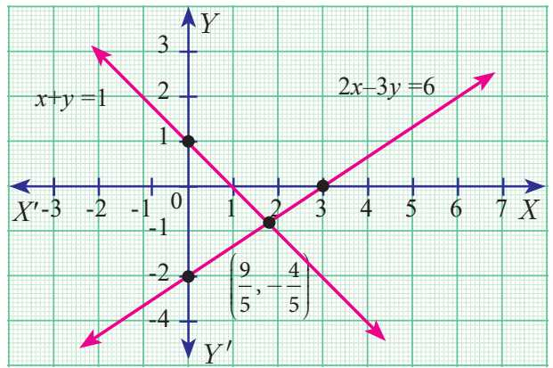

## 3.2 Simultaneous Linear Equations in Three Variables

Right from the primitive needs of calculating amount spent for various items in a super market, finding ages of people under specific conditions, finding path of an object when it is thrown upwards at an angle, Algebra plays a vital role in our daily life.

Any point in the space can be determined uniquely by knowing its latitude, longitude and altitude. Hence to locate the position of an object at a particular place situated on the Earth, three satellites are positioned to arrive three equations. Among these three equations, we get two linear equations and one quadratic (second degree) equation. Hence we can solve for the variables latitude, longitude and altitude to uniquely fix the position of any object at a given point of time. This is the basis of Global Positioning System (GPS). Hence the concept of linear equations in three variables is used in GPS systems.

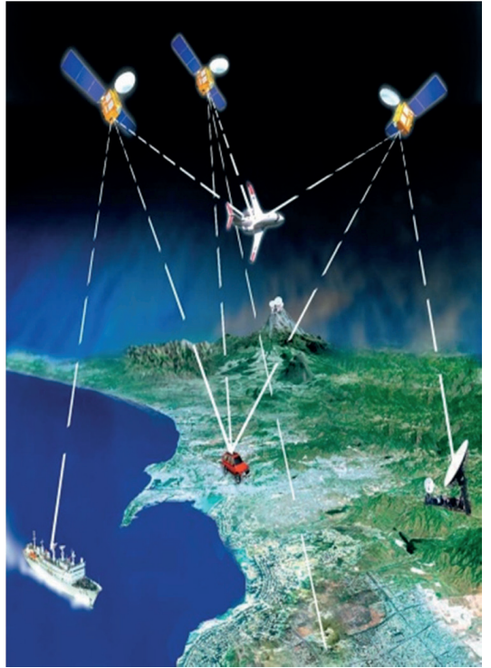

### 3.2.1 System of Linear Equations in Three Variables

In earlier classes, we have learnt different methods of solving Simultaneous Linear Equations in two variables. Here we shall learn to solve the system of linear equations in three variables namely, $x,y$ and $z$. The general form of a linear equation in three variables $x,y$ and $z$ is $ax+by+cz+d=0$ where $a,b,c,d$ are real numbers, and atleast one of $a,b,c$ is non-zero.

> **Note**
>
> - A linear equation in two variables of the form $ax+by+c=0$, represents a straight line.
> - A linear equation in three variables of the form $ax+by+cz+d=0$, represents a plane.

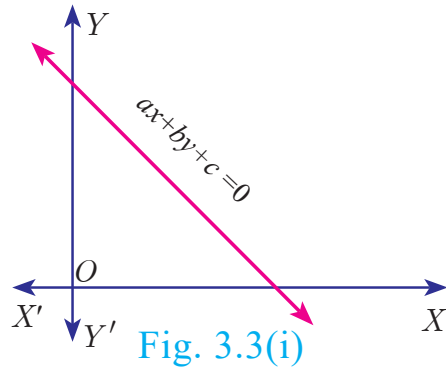

**General Form:** A system of linear equations in three variables $x,y,z$ has the general form

$$
\begin{aligned}a_1x+b_1y+c_1z+d_1&=0\\a_2x+b_2y+c_2z+d_2&=0\\a_3x+b_3y+c_3z+d_3&=0\end{aligned}
$$

Each equation in the system represents a plane in three dimensional space and solution of the system of equations is precisely the point of intersection of the three planes defined by the three linear equations of the system. The system may have only one solution, infinitely many solutions or no solution depending on how the planes intersect one another.

The figures presented below illustrate each of these possibilities.

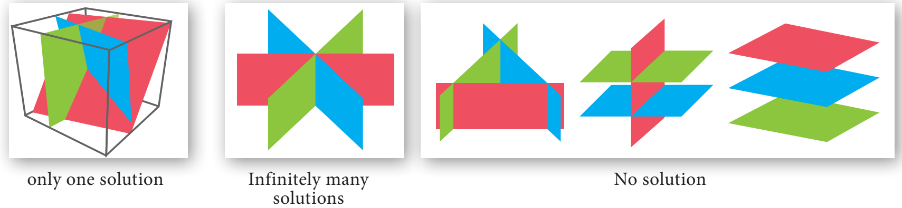

##### Procedure for solving system of linear equations in three variables

1. By taking any two equations from the given three, first multiply by some suitable non-zero constant to make the co-efficient of one variable (either $x$ or $y$ or $z$) numerically equal.
2. Eliminate one of the variables whose co-efficients are numerically equal from the equations.
3. Eliminate the same variable from another pair.
4. Now we have two equations in two variables.
5. Solve them using any method studied in earlier classes.
6. The remaining variable is then found by substituting in any one of the given equations.

> **Note**
>
> - If you obtain a false equation such as $0=1$, in any of the steps then the system has no solution.
> - If you do not obtain a false solution, but obtain an identity, such as $0=0$ then the system has infinitely many solutions.

#### Example 3.3

Solve the following system of linear equations in three variables $3x-2y+z=2$, $2x+3y-z=5$, $x+y+z=6$.

**Solution**

$$
\begin{aligned}3x-2y+z&=2 &&\cdots(1)\\2x+3y-z&=5 &&\cdots(2)\\x+y+z&=6 &&\cdots(3)\end{aligned}
$$

Adding (1) and (2),

$$
\begin{aligned}3x-2y+z&=2\\2x+3y-z&=5\\5x+y&=7 &&\cdots(4)\end{aligned}
$$

Adding (2) and (3),

$$
\begin{aligned}2x+3y-z&=5\\x+y+z&=6\\3x+4y&=11 &&\cdots(5)\end{aligned}
$$

$4\times(4)-(5)$:

$$
\begin{aligned}20x+4y&=28\\3x+4y&=11\\17x&=17\quad\Rightarrow x=1\end{aligned}
$$

Substituting $x=1$ in (4), $5+y=7\Rightarrow y=2$.

Substituting $x=1,y=2$ in (3), $1+2+z=6$, we get $z=3$.

Therefore, $x=1,y=2,z=3$.

#### Example 3.4

In an interschool athletic meet, with total of 24 individual prizes, securing a total of 56 points, a first place secures 5 points, a second place secures 3 points, and a third place secures 1 point. Having as many third place finishers as first and second place finishers, find how many athletes finished in each place.

**Solution** Let the number of I, II and III place finishers be $x,y$ and $z$ respectively.

Total number of prizes $=24$; Total number of points $=56$.

Hence, the linear equations in three variables are

$$
\begin{aligned}x+y+z&=24 &&\cdots(1)\\5x+3y+z&=56 &&\cdots(2)\\x+y&=z &&\cdots(3)\end{aligned}
$$

Substituting (3) in (1) we get, $z+z=24\Rightarrow z=12$.

$\therefore$ (3) will be, $x+y=12$.

$$
\begin{aligned}(2)&\Rightarrow5x+3y=44\\3\times(3)&\Rightarrow3x+3y=36\\&2x=8\quad\text{we get, }x=4\end{aligned}
$$

Substituting $x=4,z=12$ in (3) we get, $y=12-4=8$.

Therefore, Number of first place finishers is 4. Number of second place finishers is 8. Number of third place finishers is 12.

#### Example 3.5

Solve $x+2y-z=5$; $x-y+z=-2$; $-5x-4y+z=-11$.

**Solution**

$$
\begin{aligned}x+2y-z&=5 &&\cdots(1)\\x-y+z&=-2 &&\cdots(2)\\-5x-4y+z&=-11 &&\cdots(3)\end{aligned}
$$

Adding (1) and (2) we get,

$$
\begin{aligned}x+2y-z&=5\\x-y+z&=-2\\2x+y&=3 &&\cdots(4)\end{aligned}
$$

Subtracting (2) and (3),

$$
\begin{aligned}x-y+z&=-2\\-5x-4y+z&=-11\\6x+3y&=9\end{aligned}
$$

Dividing by 3, $2x+y=3\quad\cdots(5)$.

Subtracting (4) and (5),

$$
\begin{aligned}2x+y&=3\\2x+y&=3\\0&=0\end{aligned}
$$

Here, we arrive at an identity $0=0$.

Hence, the system has an infinite number of solutions.

#### Example 3.6

Solve $3x+y-3z=1$; $-2x-y+2z=1$; $-x-y+z=2$.

**Solution**

$$
\begin{aligned}3x+y-3z&=1 &&\cdots(1)\\-2x-y+2z&=1 &&\cdots(2)\\-x-y+z&=2 &&\cdots(3)\end{aligned}
$$

Adding (1) and (2),

$$
\begin{aligned}3x+y-3z&=1\\-2x-y+2z&=1\\ x-z&=2 &&\cdots(4)\end{aligned}
$$

Adding (1) and (3),

$$
\begin{aligned}3x+y-3z&=1\\-x-y+z&=2\\2x-2z&=3 &&\cdots(5)\end{aligned}
$$

Now, $(5)-2\times(4)$ we get,

$$
\begin{aligned}2x-2z&=3\\2x-2z&=4\\0&=-1\end{aligned}
$$

Here, we arrive at a contradiction as $0\ne-1$.

This means that the system is inconsistent and has no solution.

#### Example 3.7

Solve $\dfrac x2-1=\dfrac y6+1=\dfrac z7+2$; $\dfrac y3+\dfrac z2=13$.

**Solution** Considering, $\dfrac x2-1=\dfrac y6+1$,

$$
\frac x2-\frac y6=1+1\Rightarrow\frac{6x-2y}{12}=2\quad\text{we get, }3x-y=12\quad\cdots(1)
$$

Considering, $\dfrac x2-1=\dfrac z7+2$,

$$
\frac x2-\frac z7=1+2\Rightarrow\frac{7x-2z}{14}=3\quad\text{we get, }7x-2z=42\quad\cdots(2)
$$

Also, from $\dfrac y3+\dfrac z2=13\Rightarrow\dfrac{2y+3z}{6}=13$, we get $2y+3z=78\quad\cdots(3)$.

Eliminating $z$ from (2) and (3),

$$
\begin{aligned}(2)\times3&\Rightarrow21x-6z=126\\(3)\times2&\Rightarrow4y+6z=156\\&21x+4y=282\\(1)\times4&\Rightarrow12x-4y=48\\&33x=330\quad\text{so, }x=10\end{aligned}
$$

Substituting $x=10$ in (1), $30-y=12$ we get, $y=18$.

Substituting $x=10$ in (2), $70-2z=42$, then $z=14$.

$\therefore x=10,y=18,z=14$.

#### Example 3.8

Solve: $\dfrac1{2x}+\dfrac1{4y}-\dfrac1{3z}=\dfrac14$; $\dfrac1x=\dfrac1{3y}$; $\dfrac1x-\dfrac1{5y}+\dfrac4z=2\dfrac2{15}$.

**Solution** Let $\dfrac1x=p$, $\dfrac1y=q$, $\dfrac1z=r$.

The given equations are written as

$$
\begin{aligned}\frac p2+\frac q4-\frac r3&=\frac14\\p&=\frac q3\\p-\frac q5+4r&=2\frac2{15}=\frac{32}{15}\end{aligned}
$$

By simplifying we get,

$$
\begin{aligned}6p+3q-4r&=3 &&\cdots(1)\\3p&=q &&\cdots(2)\\15p-3q+60r&=32 &&\cdots(3)\end{aligned}
$$

Substituting (2) in (1) and (3) we get,

$$
15p-4r=3\quad\cdots(4)
$$

$$
6p+60r=32\quad\text{reduces to }3p+30r=16\quad\cdots(5)
$$

Solving (4) and (5),

$$
\begin{aligned}15p-4r&=3\\15p+150r&=80\\-154r&=-77\quad\text{we get, }r=\frac12\end{aligned}
$$

Substituting $r=\dfrac12$ in (4) we get, $15p-2=3\Rightarrow p=\dfrac13$.

From (2), $q=3p$ we get $q=1$.

Therefore, $x=\dfrac1p=3$, $y=\dfrac1q=1$, $z=\dfrac1r=2$, i.e., $x=3,y=1,z=2$.

#### Example 3.9

The sum of thrice the first number, second number and twice the third number is 5. If thrice the second number is subtracted from the sum of first number and thrice the third we get 2. If the third number is subtracted from the sum of twice the first, thrice the second, we get 1. Find the numbers.

**Solution** Let the three numbers be $x,y,z$.

From the given data we get the following equations,

$$
\begin{aligned}3x+y+2z&=5 &&\cdots(1)\\x+3z-3y&=2 &&\cdots(2)\\2x+3y-z&=1 &&\cdots(3)\end{aligned}
$$

$$
\begin{aligned}(1)\times1&\Rightarrow3x+y+2z=5\\(2)\times3&\Rightarrow3x-9y+9z=6\\&10y-7z=-1 &&\cdots(4)\end{aligned}
$$

$$
\begin{aligned}(1)\times2&\Rightarrow6x+2y+4z=10\\(3)\times3&\Rightarrow6x+9y-3z=3\\&-7y+7z=7 &&\cdots(5)\end{aligned}
$$

Adding (4) and (5),

$$
\begin{aligned}10y-7z&=-1\\-7y+7z&=7\\3y&=6\quad\Rightarrow y=2\end{aligned}
$$

Substituting $y=2$ in (5), $-14+7z=7\Rightarrow z=3$.

Substituting $y=2$ and $z=3$ in (1), $3x+2+6=5$ we get $x=-1$.

Therefore, $x=-1,y=2,z=3$.

> **Thinking Corner**
>
> 1. The number of possible solutions when solving system of linear equations in three variables are _____.
> 2. If three planes are parallel then the number of possible point(s) of intersection is/are _____.

> **Progress Check**
>
> 1. For a system of linear equations in three variables the minimum number of equations required to get unique solution is _______.
> 2. A system with _______ will reduce to identity.
> 3. A system with _______ will provide absurd equation.

### Exercise 3.1

1. Solve the following system of linear equations in three variables:

   (i) $x+y+z=5$; $2x-y+z=9$; $x-2y+3z=16$

   (ii) $\dfrac1x-\dfrac2y+4=0$; $\dfrac1y-\dfrac1z+1=0$; $\dfrac2z+\dfrac3x=14$

   (iii) $x+20=\dfrac{3y}2+10=2z+5=110-(y+z)$

2. Discuss the nature of solutions of the following system of equations:

   (i) $x+2y-z=6$; $-3x-2y+5z=-12$; $x-2z=3$

   (ii) $2y+z=3(-x+1)$; $-x+3y-z=-4$; $3x+2y+z=-\dfrac12$

   (iii) $\dfrac{y+z}4=\dfrac{z+x}3=\dfrac{x+y}2$; $x+y+z=27$

3. Vani, her father and her grand father have an average age of 53. One-half of her grand father’s age plus one-third of her father’s age plus one fourth of Vani’s age is 65. Four years ago if Vani’s grandfather was four times as old as Vani then how old are they all now?

4. The sum of the digits of a three-digit number is 11. If the digits are reversed, the new number is 46 more than five times the former number. If the hundreds digit plus twice the tens digit is equal to the units digit, then find the original three digit number?

5. There are 12 pieces of five, ten and twenty rupee currencies whose total value is ₹105. When first 2 sorts are interchanged in their numbers its value will be increased by ₹20. Find the number of currencies in each sort.

## 3.3 GCD and LCM of Polynomials

### 3.3.1 Greatest Common Divisor (GCD) or Highest Common Factor (HCF) of Polynomials

In our previous class we have learnt how to find the GCD (HCF) of second degree and third degree expressions by the method of factorization. Now we shall learn how to find the GCD of the given polynomials by the method of long division.

As discussed in Chapter 2, (Numbers and Sequences) to find GCD of two positive integers using Euclidean Algorithm, similar techniques can be employed for two given polynomials also.

The following procedure gives a systematic way of finding Greatest Common Divisor of two given polynomials $f(x)$ and $g(x)$.

**Step 1:** First, divide $f(x)$ by $g(x)$ to obtain $f(x)=g(x)q(x)+r(x)$ where $q(x)$ is the quotient and $r(x)$ is the remainder. Then, $\deg[r(x)]<\deg[g(x)]$.

**Step 2:** If the remainder $r(x)$ is non-zero, divide $g(x)$ by $r(x)$ to obtain $g(x)=r(x)q_1(x)+r_1(x)$ where $r_1(x)$ is the new remainder. Then $\deg[r_1(x)]<\deg[r(x)]$. If the remainder $r_1(x)$ is zero, then $r(x)$ is the required GCD.

**Step 3:** If $r_1(x)$ is non-zero, then continue the process till we get zero as remainder. The divisor at this stage will be the required GCD.

We write $\operatorname{GCD}[f(x),g(x)]$ to denote the GCD of the polynomials $f(x),g(x)$.

> **Note**
>
> If $f(x)$ and $g(x)$ are two polynomials of same degree then the polynomial carrying the highest coefficient will be the dividend. In case, if both have the same coefficient then compare the next least degree’s coefficient and proceed with the division.

> **Progress Check**
>
> 1. When two polynomials of same degree has to be divided, __________ should be considered to fix the dividend and divisor.
> 2. If $r(x)=0$ when $f(x)$ is divided by $g(x)$ then $g(x)$ is called ________ of the polynomials.
> 3. If $f(x)=g(x)q(x)+r(x)$, _________ must be added to $f(x)$ to make $f(x)$ completely divisible by $g(x)$.
> 4. If $f(x)=g(x)q(x)+r(x)$, _________ must be subtracted to $f(x)$ to make $f(x)$ completely divisible by $g(x)$.

#### Example 3.10

Find the GCD of the polynomials $x^3+x^2-x+2$ and $2x^3-5x^2+5x-3$.

**Solution** Let $f(x)=2x^3-5x^2+5x-3$ and $g(x)=x^3+x^2-x+2$.

Dividing $f(x)$ by $g(x)$ gives quotient $2$:

$$
\begin{array}{rrrr}2x^3&-5x^2&+5x&-3\\2x^3&+2x^2&-2x&+4\\\hline&-7x^2&+7x&-7\end{array}
$$

$$
-7x^2+7x-7=-7(x^2-x+1)
$$

$-7(x^2-x+1)\ne0$, note that $-7$ is not a divisor of $g(x)$.

Now, dividing $g(x)=x^3+x^2-x+2$ by the new remainder $x^2-x+1$ (leaving the constant factor), we get quotient $x+2$:

$$
\begin{array}{rrrr}x^3&+x^2&-x&+2\\x^3&-x^2&+x&\\\hline&2x^2&-2x&+2\\&2x^2&-2x&+2\\\hline&&0&\end{array}
$$

Here, we get zero remainder.

Therefore, $\operatorname{GCD}(2x^3-5x^2+5x-3,\ x^3+x^2-x+2)=x^2-x+1$.

#### Example 3.11

Find the GCD of $6x^3-30x^2+60x-48$ and $3x^3-12x^2+21x-18$.

**Solution** Let,

$$
\begin{aligned}f(x)&=6x^3-30x^2+60x-48=6(x^3-5x^2+10x-8)\\g(x)&=3x^3-12x^2+21x-18=3(x^3-4x^2+7x-6)\end{aligned}
$$

Now, we shall find the GCD of $x^3-5x^2+10x-8$ and $x^3-4x^2+7x-6$.

Dividing $x^3-4x^2+7x-6$ by $x^3-5x^2+10x-8$ gives quotient $1$:

$$
\begin{array}{rrrr}x^3&-4x^2&+7x&-6\\x^3&-5x^2&+10x&-8\\\hline&x^2&-3x&+2\end{array}
$$

Dividing $x^3-5x^2+10x-8$ by $x^2-3x+2$ gives quotient $x-2$:

$$
\begin{array}{rrrr}x^3&-5x^2&+10x&-8\\x^3&-3x^2&+2x&\\\hline&-2x^2&+8x&-8\\&-2x^2&+6x&-4\\\hline&&2x&-4\end{array}
$$

$$
2x-4=2(x-2)
$$

Dividing $x^2-3x+2$ by $x-2$ gives quotient $x-1$:

$$
\begin{array}{rrr}x^2&-3x&+2\\x^2&-2x&\\\hline&-x&+2\\&-x&+2\\\hline&0&\end{array}
$$

Here, we get zero remainder.

GCD of leading coefficients 3 and 6 is 3.

Thus, $\operatorname{GCD}[6x^3-30x^2+60x-48,\ 3x^3-12x^2+21x-18]=3(x-2)$.

### 3.3.2 Least Common Multiple (LCM) of Polynomials

The Least Common Multiple of two or more algebraic expressions is the expression of highest degree (or power) such that the expressions exactly divide it.

Consider the following simple expressions $a^3b^2$, $a^2b^3$.

For these expressions $\operatorname{LCM}=a^3b^3$.

To find LCM by factorization method:

(i) Each expression is first resolved into its factors.

(ii) The highest power of the factors will be the LCM.

(iii) If the expressions have numerical coefficients, find their LCM.

(iv) The product of the LCM of factors and coefficient is the required LCM.

#### Example 3.12

Find the LCM of the following:

(i) $8x^4y^2$, $48x^2y^4$

(ii) $5x-10$, $5x^2-20$

(iii) $x^4-1$, $x^2-2x+1$

(iv) $x^3-27$, $(x-3)^2$, $x^2-9$

**Solution**

(i) $8x^4y^2$, $48x^2y^4$

First let us find the LCM of the numerical coefficients.

That is, $\operatorname{LCM}(8,48)=2\times2\times2\times6=48$.

Then find the LCM of the terms involving variables.

That is, $\operatorname{LCM}(x^4y^2,x^2y^4)=x^4y^4$.

Finally find the LCM of the given expression.

We conclude that the LCM of the given expression is the product of the LCM of the numerical coefficient and the LCM of the terms with variables.

Therefore, $\operatorname{LCM}(8x^4y^2,48x^2y^4)=48x^4y^4$.

(ii) $(5x-10)$, $(5x^2-20)$

$$
\begin{aligned}5x-10&=5(x-2)\\5x^2-20&=5(x^2-4)=5(x+2)(x-2)\end{aligned}
$$

Therefore, $\operatorname{LCM}[(5x-10),(5x^2-20)]=5(x+2)(x-2)$.

(iii) $(x^4-1)$, $x^2-2x+1$

$$
\begin{aligned}x^4-1&=(x^2)^2-1=(x^2+1)(x^2-1)=(x^2+1)(x+1)(x-1)\\x^2-2x+1&=(x-1)^2\end{aligned}
$$

Therefore, $\operatorname{LCM}[(x^4-1),(x^2-2x+1)]=(x^2+1)(x+1)(x-1)^2$.

(iv) $x^3-27$, $(x-3)^2$, $x^2-9$

$$
x^3-27=(x-3)(x^2+3x+9);\quad (x-3)^2=(x-3)^2;\quad (x^2-9)=(x+3)(x-3)
$$

Therefore, $\operatorname{LCM}[(x^3-27),(x-3)^2,(x^2-9)]=(x-3)^2(x+3)(x^2+3x+9)$.

> **Thinking Corner**
>
> Complete the factor tree for the given polynomials $f(x)$ and $g(x)$. Hence find their GCD and LCM.

> $\operatorname{GCD}[f(x)\text{ and }g(x)]=\rule{1.2cm}{0.4pt}$; $\operatorname{LCM}[f(x)\text{ and }g(x)]=\rule{1.2cm}{0.4pt}$.

### Exercise 3.2

1. Find the GCD of the given polynomials:

   (i) $x^4+3x^3-x-3$, $x^3+x^2-5x+3$

   (ii) $x^4-1$, $x^3-11x^2+x-11$

   (iii) $3x^4+6x^3-12x^2-24x$, $4x^3+14x^2+8x-8$

   (iv) $3x^3+3x^2+3x+3$, $6x^3+12x^2+6x+12$

2. Find the LCM of the given expressions.

   (i) $4x^2y$, $8x^3y^2$

   (ii) $9a^3b^2$, $12a^2b^2c$

   (iii) $16m$, $12m^2n^2$, $8n^2$

   (iv) $p^2-3p+2$, $p^2-4$

   (v) $2x^2-5x-3$, $4x^2-36$

   (vi) $(2x^2-3xy)^2$, $(4x-6y)^3$, $8x^3-27y^3$

### 3.3.3 Relationship between LCM and GCD

Let us consider two numbers 12 and 18.

We observe that, $\operatorname{LCM}(12,18)=36$, $\operatorname{GCD}(12,18)=6$.

Now, $\operatorname{LCM}(12,18)\times\operatorname{GCD}(12,18)=36\times6=216=12\times18$.

Thus LCM $\times$ GCD is equal to the product of two given numbers.

Similarly, the product of two polynomials is the product of their LCM and GCD. That is,

$$
f(x)\times g(x)=\operatorname{LCM}[f(x),g(x)]\times\operatorname{GCD}[f(x),g(x)]
$$

##### Illustration

Consider $f(x)=12(x^2-y^2)$ and $g(x)=8(x^3-y^3)$.

Now,

$$
f(x)=12(x^2-y^2)=2^2\times3\times(x+y)(x-y)\quad\cdots(1)
$$

and

$$
g(x)=8(x^3-y^3)=2^3\times(x-y)(x^2+xy+y^2)\quad\cdots(2)
$$

From (1) and (2) we get,

$$
\begin{aligned}\operatorname{LCM}[f(x),g(x)]&=2^3\times3\times(x+y)(x-y)(x^2+xy+y^2)\\&=24\times(x^2-y^2)(x^2+xy+y^2)\\\operatorname{GCD}[f(x),g(x)]&=2^2\times(x-y)=4(x-y)\end{aligned}
$$

$$
\begin{aligned}\operatorname{LCM}\times\operatorname{GCD}&=24\times4\times(x^2-y^2)\times(x^2+xy+y^2)\times(x-y)\\\operatorname{LCM}\times\operatorname{GCD}&=96(x^3-y^3)(x^2-y^2)\quad\cdots(3)\end{aligned}
$$

Product of $f(x)$ and $g(x)=12(x^2-y^2)\times8(x^3-y^3)=96(x^2-y^2)(x^3-y^3)\quad\cdots(4)$.

From (3) and (4) we obtain $\operatorname{LCM}\times\operatorname{GCD}=f(x)\times g(x)$.

> **Thinking Corner**
>
> Is $f(x)\times g(x)\times r(x)=\operatorname{LCM}[f(x),g(x),r(x)]\times\operatorname{GCD}[f(x),g(x),r(x)]$?

### Exercise 3.3

1. Find the LCM and GCD for the following and verify that $f(x)\times g(x)=\operatorname{LCM}\times\operatorname{GCD}$:

   (i) $21x^2y$, $35xy^2$

   (ii) $(x^3-1)(x+1)$, $(x^3+1)$

   (iii) $(x^2y+xy^2)$, $(x^2+xy)$

2. Find the LCM of each pair of the following polynomials:

   (i) $a^2+4a-12$, $a^2-5a+6$ whose GCD is $a-2$

   (ii) $x^4-27a^3x$, $(x-3a)^2$ whose GCD is $(x-3a)$

3. Find the GCD of each pair of the following polynomials:

   (i) $12(x^4-x^3)$, $8(x^4-3x^3+2x^2)$ whose LCM is $24x^3(x-1)(x-2)$

   (ii) $(x^3+y^3)$, $(x^4+x^2y^2+y^4)$ whose LCM is $(x^3+y^3)(x^2+xy+y^2)$

4. Given the LCM and GCD of the two polynomials $p(x)$ and $q(x)$ find the unknown polynomial in the following table:

| S.No. | LCM | GCD | $p(x)$ | $q(x)$ |
| --- | --- | --- | --- | --- |
| (i) | $a^3-10a^2+11a+70$ | $a-7$ | $a^2-12a+35$ | |
| (ii) | $(x^4-y^4)(x^4+x^2y^2+y^4)$ | $(x^2-y^2)$ | | $(x^4-y^4)(x^2+y^2-xy)$ |

## 3.4 Rational Expressions

> **Definition**
>
> An expression is called a rational expression if it can be written in the form $\dfrac{p(x)}{q(x)}$ where $p(x)$ and $q(x)$ are polynomials and $q(x)\ne0$. A rational expression is the ratio of two polynomials.

The following are examples of rational expressions.

$$
\frac9x,\quad\frac{2y+1}{y^2-4y+9},\quad\frac{z^3+5}{z-4},\quad\frac a{a+10}
$$

The rational expressions are applied for describing distance-time, modeling multi-task problems, to combine workers or machines to complete a job schedule and much more.

### 3.4.1 Reduction of Rational Expression

A rational expression $\dfrac{p(x)}{q(x)}$ is said to be in its lowest form if $\operatorname{GCD}(p(x),q(x))=1$.

To reduce a rational expression to its lowest form, follow the given steps:

(i) Factorize the numerator and the denominator.

(ii) If there are common factors in the numerator and denominator, cancel them.

(iii) The resulting expression will be a rational expression in its lowest form.

#### Example 3.13

Reduce the rational expressions to its lowest form:

(i) $\dfrac{x-3}{x^2-9}$

(ii) $\dfrac{x^2-16}{x^2+8x+16}$

**Solution**

$$
\text{(i)}\quad\frac{x-3}{x^2-9}=\frac{x-3}{(x+3)(x-3)}=\frac1{x+3}
$$

$$
\text{(ii)}\quad\frac{x^2-16}{x^2+8x+16}=\frac{(x+4)(x-4)}{(x+4)^2}=\frac{x-4}{x+4}
$$

### 3.4.2 Excluded Value

A value that makes a rational expression $\dfrac{p(x)}{q(x)}$ (in its lowest form) undefined is called an Excluded value.

To find excluded value for a given rational expression in its lowest form, say $\dfrac{p(x)}{q(x)}$, consider the denominator $q(x)=0$.

For example, the rational expression $\dfrac5{x-10}$ is undefined when $x=10$. So, 10 is called an excluded value for $\dfrac5{x-10}$.

#### Example 3.14

Find the excluded values of the following expressions (if any).

(i) $\dfrac{x+10}{8x}$

(ii) $\dfrac{7p+2}{8p^2+13p+5}$

(iii) $\dfrac x{x^2+1}$

**Solution**

(i) $\dfrac{x+10}{8x}$

The expression $\dfrac{x+10}{8x}$ is undefined when $8x=0$ or $x=0$. Hence, the excluded value is 0.

(ii) $\dfrac{7p+2}{8p^2+13p+5}$

The expression $\dfrac{7p+2}{8p^2+13p+5}$ is undefined when $8p^2+13p+5=0$, that is,

$$
(8p+5)(p+1)=0
$$

$p=-\dfrac58$, $p=-1$. The excluded values are $-\dfrac58$ and $-1$.

(iii) $\dfrac x{x^2+1}$

Here, $x^2\ge0$ for all $x$. Therefore, $x^2+1\ge0+1=1$. Hence, $x^2+1\ne0$ for any $x$.

Therefore, there can be no real excluded values for the given rational expression $\dfrac x{x^2+1}$.

> **Thinking Corner**
>
> 1. Are $x^2-1$ and $\tan x=\dfrac{\sin x}{\cos x}$ rational expressions?
> 2. The number of excluded values of $\dfrac{x^3+x^2-10x+8}{x^4+8x^2-9}$ is _____.

### Exercise 3.4

1. Reduce each of the following rational expressions to its lowest form.

   (i) $\dfrac{x^2-1}{x^2+x}$

   (ii) $\dfrac{x^2-11x+18}{x^2-4x+4}$

   (iii) $\dfrac{9x^2+81x}{x^3+8x^2-9x}$

   (iv) $\dfrac{p^2-3p-40}{2p^3-24p^2+64p}$

2. Find the excluded values, if any of the following expressions.

   (i) $\dfrac y{y^2-25}$

   (ii) $\dfrac t{t^2-5t+6}$

   (iii) $\dfrac{x^2+6x+8}{x^2+x-2}$

   (iv) $\dfrac{x^3-27}{x^3+x^2-6x}$

### 3.4.3 Operations of Rational Expressions

We have studied the concepts of addition, subtraction, multiplication and division of rational numbers in previous classes. Now, let us generalize the above for rational expressions.

##### Multiplication of Rational Expressions

If $\dfrac{p(x)}{q(x)}$ and $\dfrac{r(x)}{s(x)}$ are two rational expressions where $q(x)\ne0$, $s(x)\ne0$, their product is

$$
\frac{p(x)}{q(x)}\times\frac{r(x)}{s(x)}=\frac{p(x)\times r(x)}{q(x)\times s(x)}
$$

In other words, the product of two rational expression is the product of their numerators divided by the product of their denominators and the resulting expression is then reduced to its lowest form.

##### Division of Rational Expressions

If $\dfrac{p(x)}{q(x)}$ and $\dfrac{r(x)}{s(x)}$ are two rational expressions, where $q(x),s(x)\ne0$ then,

$$
\frac{p(x)}{q(x)}\div\frac{r(x)}{s(x)}=\frac{p(x)}{q(x)}\times\frac{s(x)}{r(x)}=\frac{p(x)\times s(x)}{q(x)\times r(x)}
$$

Thus division of one rational expression by other is equivalent to the product of first and reciprocal of the second expression. If the resulting expression is not in its lowest form then reduce to its lowest form.

> **Progress Check**
>
> Find the unknown expression in the following figures.

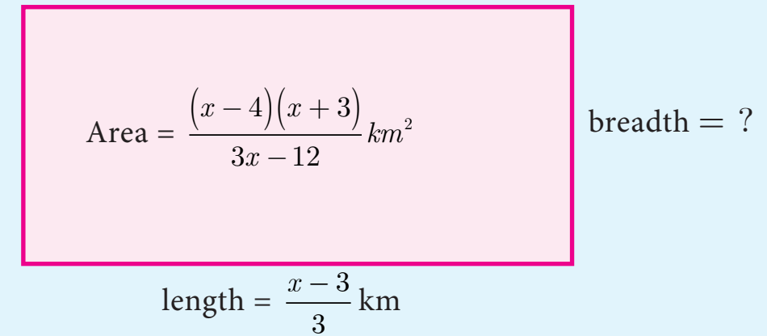

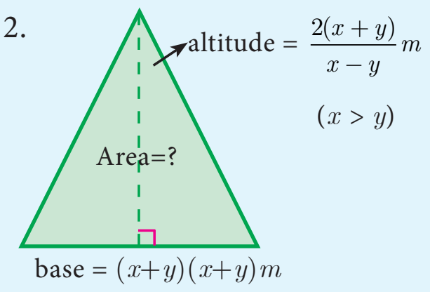

#### Example 3.15

(i) Multiply $\dfrac{x^3}{9y^2}$ by $\dfrac{27y}{x^5}$.

(ii) Multiply $\dfrac{x^4b^2}{x-1}$ by $\dfrac{x^2-1}{a^4b^3}$.

**Solution**

$$
\text{(i)}\quad\frac{x^3}{9y^2}\times\frac{27y}{x^5}=\frac3{x^2y}
$$

$$
\text{(ii)}\quad\frac{x^4b^2}{x-1}\times\frac{x^2-1}{a^4b^3}=\frac{x^4\times b^2}{x-1}\times\frac{(x+1)(x-1)}{a^4\times b^3}=\frac{x^4(x+1)}{a^4b}
$$

#### Example 3.16

Find

(i) $\dfrac{14x^4}{y}\div\dfrac{7x}{3y^4}$

(ii) $\dfrac{x^2-16}{x+4}\div\dfrac{x-4}{x+4}$

(iii) $\dfrac{16x^2-2x-3}{3x^2-2x-1}\div\dfrac{8x^2+11x+3}{3x^2-11x-4}$

**Solution:**

(i) $\dfrac{14x^4}{y}\div\dfrac{7x}{3y^4}=\dfrac{14x^4}{y}\times\dfrac{3y^4}{7x}=6x^3y^3$.

(ii) $\dfrac{x^2-16}{x+4}\div\dfrac{x-4}{x+4}=\dfrac{(x+4)(x-4)}{x+4}\times\left(\dfrac{x+4}{x-4}\right)=x+4$.

(iii)
$$
\begin{aligned}
\frac{16x^2-2x-3}{3x^2-2x-1}\div\frac{8x^2+11x+3}{3x^2-11x-4}
&=\frac{16x^2-2x-3}{3x^2-2x-1}\times\frac{3x^2-11x-4}{8x^2+11x+3}\\
&=\frac{(8x+3)(2x-1)}{(3x+1)(x-1)}\times\frac{(3x+1)(x-4)}{(8x+3)(x+1)}\\
&=\frac{(2x-1)(x-4)}{(x-1)(x+1)}=\frac{2x^2-9x+4}{x^2-1}.
\end{aligned}
$$

### Exercise 3.5

1. Simplify
   - (i) $\dfrac{4x^2y}{2z^2}\times\dfrac{6xz^3}{20y^4}$
   - (ii) $\dfrac{p^2-10p+21}{p-7}\times\dfrac{p^2+p-12}{(p-3)^2}$
   - (iii) $\dfrac{5t^3}{4t-8}\times\dfrac{6t-12}{10t}$
2. Simplify
   - (i) $\dfrac{x+4}{3x+4y}\times\dfrac{9x^2-16y^2}{2x^2+3x-20}$
   - (ii) $\dfrac{x^3-y^3}{3x^2+9xy+6y^2}\times\dfrac{x^2+2xy+y^2}{x^2-y^2}$
3. Simplify
   - (i) $\dfrac{2a^2+5a+3}{2a^2+7a+6}\div\dfrac{a^2+6a+5}{-5a^2-35a-50}$
   - (ii) $\dfrac{b^2+3b-28}{b^2+4b+4}\div\dfrac{b^2-49}{b^2-5b-14}$
   - (iii) $\dfrac{x+2}{4y}\div\dfrac{x^2-x-6}{12y^2}$
   - (iv) $\dfrac{12t^2-22t+8}{3t}\div\dfrac{3t^2+2t-8}{2t^2+4t}$
4. If $x=\dfrac{a^2+3a-4}{3a^2-3}$ and $y=\dfrac{a^2+2a-8}{2a^2-2a-4}$ find the value of $x^2y^{-2}$.
5. If a polynomial $p(x)=x^2-5x-14$ is divided by another polynomial $q(x)$ we get $\dfrac{x-7}{x+2}$, find $q(x)$.

> **Activity 1**
>
> (i) The length of a rectangular garden is the sum of a number and its reciprocal. The breadth is the difference of the square of the same number and its reciprocal. Find the length, breadth and the ratio of the length to the breadth of the rectangle.
>
> 
>
> (ii) Find the ratio of the perimeter to the area of the given triangle.
>
> 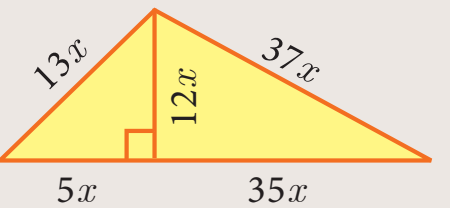

##### Addition and Subtraction of Rational Expressions

##### Addition and Subtraction of Rational Expressions with Like Denominators

(i) Add or Subtract the numerators.

(ii) Write the sum or difference of the numerators found in step (i) over the common denominator.

(iii) Reduce the resulting rational expression into its lowest form.

#### Example 3.17

Find $\dfrac{x^2+20x+36}{x^2-3x-28}-\dfrac{x^2+12x+4}{x^2-3x-28}$.

**Solution**

$$
\begin{aligned}
\frac{x^2+20x+36}{x^2-3x-28}-\frac{x^2+12x+4}{x^2-3x-28}
&=\frac{(x^2+20x+36)-(x^2+12x+4)}{x^2-3x-28}\\
&=\frac{8x+32}{x^2-3x-28}=\frac{8(x+4)}{(x-7)(x+4)}=\frac8{x-7}.
\end{aligned}
$$

##### Addition and Subtraction of Rational Expressions with unlike Denominators

(i) Determine the Least Common Multiple of the denominator.

(ii) Rewrite each fraction as an equivalent fraction with the LCM obtained in step (i). This is done by multiplying both the numerators and denominator of each expression by any factors needed to obtain the LCM.

(iii) Follow the same steps given for doing addition or subtraction of the rational expression with like denominators.

> **Progress Check**
>
> 1. Write an expression that represents the perimeter of the figure and simplify.
>
> 
>
> 2. Find the base of the given parallelogram whose perimeter is $\dfrac{4x^2+10x-50}{(x-3)(x+5)}$.
>
> 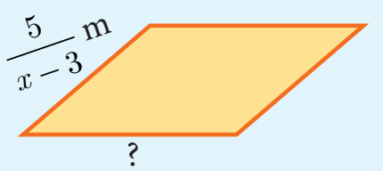

#### Example 3.18

Simplify $\dfrac1{x^2-5x+6}+\dfrac1{x^2-3x+2}-\dfrac1{x^2-8x+15}$.

**Solution**

$$
\begin{aligned}
\frac1{x^2-5x+6}+\frac1{x^2-3x+2}-\frac1{x^2-8x+15}
&=\frac1{(x-2)(x-3)}+\frac1{(x-2)(x-1)}-\frac1{(x-5)(x-3)}\\
&=\frac{(x-1)(x-5)+(x-3)(x-5)-(x-1)(x-2)}{(x-1)(x-2)(x-3)(x-5)}\\
&=\frac{(x^2-6x+5)+(x^2-8x+15)-(x^2-3x+2)}{(x-1)(x-2)(x-3)(x-5)}\\
&=\frac{x^2-11x+18}{(x-1)(x-2)(x-3)(x-5)}=\frac{(x-9)(x-2)}{(x-1)(x-2)(x-3)(x-5)}\\
&=\frac{x-9}{(x-1)(x-3)(x-5)}.
\end{aligned}
$$

> **Thinking Corner — Say True or False**
>
> 1. The sum of two rational expressions is always a rational expression.
> 2. The product of two rational expressions is always a rational expression.

### Exercise 3.6

1. Simplify (i) $\dfrac{x(x+1)}{x-2}+\dfrac{x(1-x)}{x-2}$ (ii) $\dfrac{x+2}{x+3}+\dfrac{x-1}{x-2}$ (iii) $\dfrac{x^3}{x-y}+\dfrac{y^3}{y-x}$.
2. Simplify (i) $\dfrac{(2x+1)(x-2)}{x-4}-\dfrac{2x^2-5x+2}{x-4}$ (ii) $\dfrac{4x}{x^2-1}-\dfrac{x+1}{x-1}$.
3. Subtract $\dfrac1{x^2+2}$ from $\dfrac{2x^3+x^2+3}{(x^2+2)^2}$.
4. Which rational expression should be subtracted from $\dfrac{x^2+6x+8}{x^3+8}$ to get $\dfrac3{x^2-2x+4}$?
5. If $A=\dfrac{2x+1}{2x-1}$, $B=\dfrac{2x-1}{2x+1}$ find $\dfrac1{A-B}-\dfrac{2B}{A^2-B^2}$.
6. If $A=\dfrac{x}{x+1}$, $B=\dfrac1{x+1}$, prove that $\dfrac{(A+B)^2+(A-B)^2}{A\div B}=\dfrac{2(x^2+1)}{x(x+1)^2}$.
7. Pari needs 4 hours to complete a work. His friend Yuvan needs 6 hours to complete the same work. How long will it take to complete if they work together?
8. Iniya bought 50 kg of fruits consisting of apples and bananas. She paid twice as much per kg for the apple as she did for the banana. If Iniya bought ₹ 1800 worth of apples and ₹ 600 worth bananas, then how many kgs of each fruit did she buy?

## 3.5 Square Root of Polynomials

The square root of a given positive real number is another number which when multiplied with itself is the given number.

Similarly, the square root of a given expression $p(x)$ is another expression $q(x)$ which when multiplied by itself gives $p(x)$, that is, $q(x)\cdot q(x)=p(x)$.

So, $|q(x)|=\sqrt{p(x)}$ where $|q(x)|$ is the absolute value of $q(x)$.

The following two methods are used to find the square root of a given expression:

(i) Factorization method (ii) Division method.

> **Progress Check**
>
> 1. Is $x^2+4x+4$ a perfect square?
> 2. What is the value of $x$ in $3\sqrt{x}=9$?
> 3. The square root of $361x^4y^2$ is _______.
> 4. $\sqrt{a^2x^2+2abx+b^2}=$ _______.
> 5. If a polynomial is a perfect square then, its factors will be repeated _______ number of times (odd / even).

### 3.5.1 Find the Square Root by Factorization Method

#### Example 3.19

Find the square root of the following expressions:

(i) $256(x-a)^8(x-b)^4(x-c)^{16}(x-d)^{20}$ (ii) $\dfrac{144a^8b^{12}c^{16}}{81f^{12}g^4h^{14}}$.

**Solution**

(i) $\sqrt{256(x-a)^8(x-b)^4(x-c)^{16}(x-d)^{20}}=16\left|(x-a)^4(x-b)^2(x-c)^8(x-d)^{10}\right|$.

(ii) $\sqrt{\dfrac{144a^8b^{12}c^{16}}{81f^{12}g^4h^{14}}}=\dfrac43\left|\dfrac{a^4b^6c^8}{f^6g^2h^7}\right|$.

#### Example 3.20

Find the square root of the following expressions:

(i) $16x^2+9y^2-24xy+24x-18y+9$

(ii) $(6x^2+x-1)(3x^2+2x-1)(2x^2+3x+1)$

(iii) $[\sqrt{15}x^2+(\sqrt3+\sqrt{10})x+\sqrt2][\sqrt5x^2+(2\sqrt5+1)x+2][\sqrt3x^2+(\sqrt2+2\sqrt3)x+2\sqrt2]$.

**Solution**

(i)
$$
\begin{aligned}
\sqrt{16x^2+9y^2-24xy+24x-18y+9}
&=\sqrt{(4x)^2+(-3y)^2+(3)^2+2(4x)(-3y)+2(-3y)(3)+2(4x)(3)}\\
&=\sqrt{(4x-3y+3)^2}=|4x-3y+3|.
\end{aligned}
$$

(ii)
$$
\begin{aligned}
\sqrt{(6x^2+x-1)(3x^2+2x-1)(2x^2+3x+1)}
&=\sqrt{(3x-1)(2x+1)(3x-1)(x+1)(2x+1)(x+1)}\\
&=|(3x-1)(2x+1)(x+1)|.
\end{aligned}
$$

(iii) First let us factorize the polynomials.

$$
\begin{aligned}
\sqrt{15}x^2+(\sqrt3+\sqrt{10})x+\sqrt2
&=\sqrt{15}x^2+\sqrt3x+\sqrt{10}x+\sqrt2\\
&=\sqrt3x(\sqrt5x+1)+\sqrt2(\sqrt5x+1)\\
&=(\sqrt5x+1)\times(\sqrt3x+\sqrt2).
\end{aligned}
$$

$$
\begin{aligned}
\sqrt5x^2+(2\sqrt5+1)x+2
&=\sqrt5x^2+2\sqrt5x+x+2\\
&=\sqrt5x(x+2)+1(x+2)=(\sqrt5x+1)(x+2).
\end{aligned}
$$

$$
\begin{aligned}
\sqrt3x^2+(\sqrt2+2\sqrt3)x+2\sqrt2
&=\sqrt3x^2+\sqrt2x+2\sqrt3x+2\sqrt2\\
&=x(\sqrt3x+\sqrt2)+2(\sqrt3x+\sqrt2)=(x+2)(\sqrt3x+\sqrt2).
\end{aligned}
$$

Therefore,

$$
\begin{aligned}
&\sqrt{[\sqrt{15}x^2+(\sqrt3+\sqrt{10})x+\sqrt2][\sqrt5x^2+(2\sqrt5+1)x+2][\sqrt3x^2+(\sqrt2+2\sqrt3)x+2\sqrt2]}\\
&=\sqrt{(\sqrt5x+1)(\sqrt3x+\sqrt2)(\sqrt5x+1)(x+2)(\sqrt3x+\sqrt2)(x+2)}\\
&=|(\sqrt5x+1)(\sqrt3x+\sqrt2)(x+2)|.
\end{aligned}
$$

### Exercise 3.7

1. Find the square root of the following rational expressions.
   - (i) $\dfrac{400x^4y^{12}z^{16}}{100x^8y^4z^4}$
   - (ii) $\dfrac{7x^2+2\sqrt{14}x+2}{x^2-\frac12x+\frac1{16}}$
   - (iii) $\dfrac{121(a+b)^8(x+y)^8(b-c)^8}{81(b-c)^4(a-b)^{12}(b-c)^4}$
2. Find the square root of the following.
   - (i) $4x^2+20x+25$
   - (ii) $9x^2-24xy+30xz-40yz+25z^2+16y^2$
   - (iii) $(4x^2-9x+2)(7x^2-13x-2)(28x^2-3x-1)$
   - (iv) $\left(2x^2+\dfrac{17}6x+1\right)\left(\dfrac32x^2+4x+2\right)\left(\dfrac43x^2+\dfrac{11}3x+2\right)$

### 3.5.2 Finding the Square Root of a Polynomial by Division Method

The long division method in finding the square root of a polynomial is useful when the degree of the polynomial is higher.

#### Example 3.21

Find the square root of $64x^4-16x^3+17x^2-2x+1$.

**Solution**

The square-root division is:

$$
\begin{array}{r|l}
&8x^2-x+1\\\hline
8x^2&64x^4-16x^3+17x^2-2x+1\\
&\underline{64x^4}\\
16x^2-x&-16x^3+17x^2\\
&\underline{-16x^3+x^2}\\
16x^2-2x+1&16x^2-2x+1\\
&\underline{16x^2-2x+1}\\
&0
\end{array}
$$

> **Note**
>
> Before proceeding to find the square root of a polynomial, one has to ensure that the degrees of the variables are in descending or ascending order.

Therefore, $\sqrt{64x^4-16x^3+17x^2-2x+1}=|8x^2-x+1|$.

#### Example 3.22

If $9x^4+12x^3+28x^2+ax+b$ is a perfect square, find the value of $a$ and $b$.

**Solution**

$$
\begin{array}{r|l}
&3x^2+2x+4\\\hline
3x^2&9x^4+12x^3+28x^2+ax+b\\
&\underline{9x^4}\\
6x^2+2x&12x^3+28x^2\\
&\underline{12x^3+4x^2}\\
6x^2+4x+4&24x^2+ax+b\\
&\underline{24x^2+16x+16}\\
&(a-16)x+(b-16)
\end{array}
$$

Because the given polynomial is a perfect square $a-16=0$, $b-16=0$.

Therefore, $a=16$, $b=16$.

### Exercise 3.8

1. Find the square root of the following polynomials by division method.
   - (i) $x^4-12x^3+42x^2-36x+9$
   - (ii) $37x^2-28x^3+4x^4+42x+9$
   - (iii) $16x^4+8x^2+1$
   - (iv) $121x^4-198x^3-183x^2+216x+144$
2. Find the values of $a$ and $b$ if the following polynomials are perfect squares.
   - (i) $4x^4-12x^3+37x^2+bx+a$
   - (ii) $ax^4+bx^3+361x^2+220x+100$
3. Find the values of $m$ and $n$ if the following polynomials are perfect squares.
   - (i) $36x^4-60x^3+61x^2-mx+n$
   - (ii) $x^4-8x^3+mx^2+nx+16$

## 3.6 Quadratic Equations

##### Introduction

Arab mathematician Abraham bar Hiyya Ha-Nasi, often known by the Latin name Savasorda, is famed for his book ‘Liber Embadorum’ published in 1145 AD(CE) which is the first book published in Europe to give the complete solution of a quadratic equation.

For a period of more than three thousand years beginning from early civilizations to current times, humanity knew how to solve a general quadratic equation in terms of its co-efficients by using four arithmetical operations and extraction of roots. This process is called “Solving by Radicals”. Huge amount of research has been carried to this day in solving various types of equations.

##### Quadratic Expression

An expression of degree $n$ in variable $x$ is $a_0x^n+a_1x^{n-1}+a_2x^{n-2}+\cdots+a_{n-1}x+a_n$ where $a_0\ne0$ and $a_1,a_2,\ldots,a_n$ are real numbers. $a_0,a_1,a_2,\ldots,a_n$ are called coefficients of the expression.

In particular an expression of degree 2 is called a Quadratic Expression which is expressed as $p(x)=ax^2+bx+c$, $a\ne0$ and $a,b,c$ are real numbers.

### 3.6.1 Zeroes of a Quadratic Polynomial

Let $p(x)$ be a polynomial. $x=a$ is called zero of $p(x)$ if $p(a)=0$.

For example, if $p(x)=x^2-2x-8$ then $p(-2)=4+4-8=0$ and $p(4)=16-8-8=0$.

Therefore, $-2$ and $4$ are zeros of the polynomial $p(x)=x^2-2x-8$.

### 3.6.2 Roots of Quadratic Equations

Let $ax^2+bx+c=0$, $(a\ne0)$ be a quadratic equation. The values of $x$ such that the expression $ax^2+bx+c$ becomes zero are called roots of the quadratic equation $ax^2+bx+c=0$.

We have,

$$
\begin{aligned}
ax^2+bx+c&=0\\
a\left[x^2+\frac bax+\frac ca\right]&=0\\
x^2+\frac bax+\frac ca&=0\quad(\text{since }a\ne0)\\
x^2+\frac b{2a}(2x)+\left(\frac b{2a}\right)^2-\left(\frac b{2a}\right)^2+\frac ca&=0.
\end{aligned}
$$

That is,

$$
\begin{aligned}
x^2+(2x)\left(\frac b{2a}\right)+\left(\frac b{2a}\right)^2&=\frac{b^2}{4a^2}-\frac ca\\
\left(x+\frac b{2a}\right)^2&=\frac{b^2-4ac}{4a^2}\\
x+\frac b{2a}&=\frac{\pm\sqrt{b^2-4ac}}{2a}\\
x&=\frac{-b\pm\sqrt{b^2-4ac}}{2a}.
\end{aligned}
$$

Therefore, the roots are $\dfrac{-b+\sqrt{b^2-4ac}}{2a}$ and $\dfrac{-b-\sqrt{b^2-4ac}}{2a}$.

### 3.6.3 Formation of a Quadratic Equation

If $\alpha$ and $\beta$ are roots of a quadratic equation $ax^2+bx+c=0$ then

$$
\alpha=\frac{-b+\sqrt{b^2-4ac}}{2a}\quad\text{and}\quad\beta=\frac{-b-\sqrt{b^2-4ac}}{2a}.
$$

Also,

$$
\alpha+\beta=\frac{-b+\sqrt{b^2-4ac}-b-\sqrt{b^2-4ac}}{2a}=\frac{-b}a
$$

and

$$
\alpha\beta=\left(\frac{-b+\sqrt{b^2-4ac}}{2a}\right)\times\left(\frac{-b-\sqrt{b^2-4ac}}{2a}\right)=\frac ca.
$$

Since, $(x-\alpha)$ and $(x-\beta)$ are factors of $ax^2+bx+c=0$,

We have $(x-\alpha)(x-\beta)=0$.

Hence, $x^2-(\alpha+\beta)x+\alpha\beta=0$.

That is, $x^2-(\text{sum of roots})x+\text{product of roots}=0$ is the general form of the quadratic equation when the roots are given.

> **Note**
>
> $ax^2+bx+c=0$ can equivalently be expressed as $x^2+\dfrac bax+\dfrac ca=0$, since $a\ne0$.

> **Activity 2**
>
> Consider a rectangular garden in front of a house, whose dimensions are $(2k+6)$ metre and $k$ metre. A smaller rectangular portion of the garden of dimensions $k$ metre and 3 metres is leveled. Find the area of the garden, not leveled.
>
> 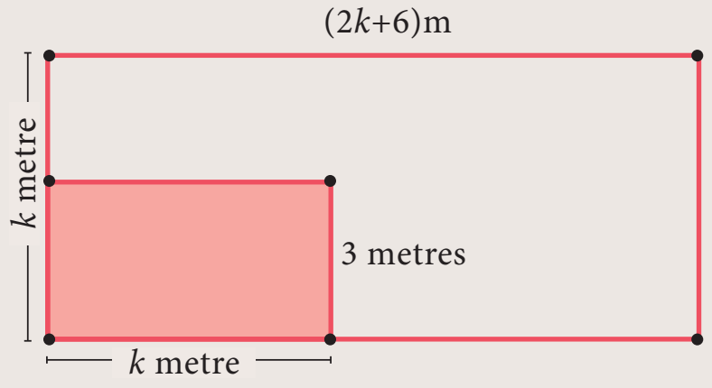

#### Example 3.23

Find the zeroes of the quadratic expression $x^2+8x+12$.

**Solution**

Let $p(x)=x^2+8x+12=(x+2)(x+6)$.

$$
p(-2)=4-16+12=0
$$
$$
p(-6)=36-48+12=0
$$

Therefore, $-2$ and $-6$ are zeros of $p(x)=x^2+8x+12$.

#### Example 3.24

Write down the quadratic equation in general form for which sum and product of the roots are given below.

(i) $9,14$ (ii) $-\dfrac72,\dfrac52$ (iii) $-\dfrac35,-\dfrac12$.

**Solution**

(i) General form of the quadratic equation when the roots are given is

$$
x^2-(\text{sum of the roots})x+\text{product of the roots}=0
$$
$$
x^2-9x+14=0.
$$

(ii) $x^2-\left(-\dfrac72\right)x+\dfrac52=0\Rightarrow2x^2+7x+5=0$.

(iii) $x^2-\left(-\dfrac35\right)x+\left(-\dfrac12\right)=0\Rightarrow\dfrac{10x^2+6x-5}{10}=0$.

Therefore, $10x^2+6x-5=0$.

#### Example 3.25

Find the sum and product of the roots for each of the following quadratic equations:

(i) $x^2+8x-65=0$ (ii) $2x^2+5x+7=0$ (iii) $kx^2-k^2x-2k^3=0$.

**Solution**

Let $\alpha$ and $\beta$ be the roots of the given quadratic equation.

(i) $x^2+8x-65=0$

$$
a=1,\quad b=8,\quad c=-65
$$
$$
\alpha+\beta=-\frac ba=-8\quad\text{and}\quad\alpha\beta=\frac ca=-65
$$
$$
\alpha+\beta=-8;\quad\alpha\beta=-65.
$$

(ii) $2x^2+5x+7=0$

$$
a=2,\quad b=5,\quad c=7
$$
$$
\alpha+\beta=-\frac ba=-\frac52\quad\text{and}\quad\alpha\beta=\frac ca=\frac72
$$
$$
\alpha+\beta=-\frac52;\quad\alpha\beta=\frac72.
$$

(iii) $kx^2-k^2x-2k^3=0$

$$
a=k,\quad b=-k^2,\quad c=-2k^3
$$
$$
\alpha+\beta=-\frac ba=\frac{-(-k^2)}k=k\quad\text{and}\quad\alpha\beta=\frac ca=\frac{-2k^3}k=-2k^2.
$$

### Exercise 3.9

1. Determine the quadratic equations, whose sum and product of roots are
   - (i) $-9,20$
   - (ii) $\dfrac53,4$
   - (iii) $-\dfrac32,-1$
   - (iv) $-(2-a)^2,(a+5)^2$
2. Find the sum and product of the roots for each of the following quadratic equations.
   - (i) $x^2+3x-28=0$
   - (ii) $x^2+3x=0$
   - (iii) $3+\dfrac1a=\dfrac{10}{a^2}$
   - (iv) $3y^2-y-4=0$

### 3.6.4 Solving Quadratic Equations

We have already learnt how to solve linear equations in one, two and three variable(s). Recall that the values of the variables which satisfies a given equation are called its solution(s). In this section, we are going to study three methods of solving quadratic equation, namely factorization method, completing the square method and using formula.

##### Solving a quadratic equation by factorization method.

We follow the steps provided below to solve a quadratic equation through factorization method.

**Step 1:** Write the equation in general form $ax^2+bx+c=0$.

**Step 2:** By splitting the middle term, factorize the given equation.

**Step 3:** After factoring, the given quadratic equation can be written as product of two linear factors.

**Step 4:** Equate each linear factor to zero and solve for $x$.

These values of $x$ gives the roots of the equation.

#### Example 3.26

Solve $2x^2-2\sqrt6x+3=0$.

**Solution**

$$
\begin{aligned}
2x^2-2\sqrt6x+3
&=2x^2-\sqrt6x-\sqrt6x+3\quad(\text{by splitting the middle term})\\
&=\sqrt2x(\sqrt2x-\sqrt3)-\sqrt3(\sqrt2x-\sqrt3)\\
&=(\sqrt2x-\sqrt3)(\sqrt2x-\sqrt3).
\end{aligned}
$$

Now, equating the factors to zero we get,

$$
(\sqrt2x-\sqrt3)(\sqrt2x-\sqrt3)=0
$$
$$
(\sqrt2x-\sqrt3)^2=0
$$
$$
\sqrt2x-\sqrt3=0.
$$

$\therefore$ the solution is $x=\dfrac{\sqrt3}{\sqrt2}$.

#### Example 3.27

Solve $2m^2+19m+30=0$.

**Solution**

$$
\begin{aligned}
2m^2+19m+30&=2m^2+4m+15m+30=2m(m+2)+15(m+2)\\
&=(m+2)(2m+15).
\end{aligned}
$$

Equating the factors to zero we get,

$$
(m+2)(2m+15)=0
$$

$m+2=0\Rightarrow m=-2$ or $2m+15=0$ we get, $m=\dfrac{-15}2$.

Therefore, the roots are $-2,\dfrac{-15}2$.

Some equations which are not quadratic can be solved by reducing them to quadratic equations by suitable substitutions. Such examples are illustrated below.

#### Example 3.28

Solve $x^4-13x^2+42=0$.

**Solution**

Let $x^2=a$. Then, $(x^2)^2-13x^2+42=a^2-13a+42=(a-7)(a-6)$.

Given, $(a-7)(a-6)=0$ we get, $a=7$ or $6$.

Since $a=x^2$, $x^2=7$ then, $x=\pm\sqrt7$ or $x^2=6$ we get, $x=\pm\sqrt6$.

Therefore, the roots are $x=\pm\sqrt7,\pm\sqrt6$.

#### Example 3.29

Solve $\dfrac{x}{x-1}+\dfrac{x-1}x=2\dfrac12$.

**Solution**

Let $y=\dfrac{x}{x-1}$ then $\dfrac1y=\dfrac{x-1}x$.

Therefore, $\dfrac{x}{x-1}+\dfrac{x-1}x=2\dfrac12$ becomes $y+\dfrac1y=\dfrac52$.

$2y^2-5y+2=0$ then, $y=\dfrac12,2$.

$\dfrac{x}{x-1}=\dfrac12$ we get, $2x=x-1$ implies $x=-1$.

$\dfrac{x}{x-1}=2$ we get, $x=2x-2$ implies $x=2$.

Therefore, the roots are $x=-1,2$.

### Exercise 3.10

1. Solve the following quadratic equations by factorization method.
   - (i) $4x^2-7x-2=0$
   - (ii) $3(p^2-6)=p(p+5)$
   - (iii) $\sqrt{a(a-7)}=3\sqrt2$
   - (iv) $\sqrt2x^2+7x+5\sqrt2=0$
   - (v) $2x^2-x+\dfrac18=0$
2. The number of volleyball games that must be scheduled in a league with $n$ teams is given by $G(n)=\dfrac{n^2-n}2$ where each team plays with every other team exactly once. A league schedules 15 games. How many teams are in the league?

##### Solving a Quadratic Equation by Completing the Square Method

In deriving the formula for the roots of a quadratic equation we used completing the squares method. The same technique can be applied in solving any given quadratic equation through the following steps.

**Step 1:** Write the quadratic equation in general form $ax^2+bx+c=0$.

**Step 2:** Divide both sides of the equation by the coefficient of $x^2$ if it is not 1.

**Step 3:** Shift the constant term to the right hand side.

**Step 4:** Add the square of one-half of the coefficient of $x$ to both sides.

**Step 5:** Write the left hand side as a square and simplify the right hand side.

**Step 6:** Take the square root on both sides and solve for $x$.

#### Example 3.30

Solve $x^2-3x-2=0$.

**Solution**

$$
\begin{aligned}
x^2-3x-2&=0\\
x^2-3x&=2\quad(\text{Shifting the Constant to RHS})\\
x^2-3x+\left(\frac32\right)^2&=2+\left(\frac32\right)^2\quad\left(\text{Add }\left[\frac12(\text{co-efficient of }x)\right]^2\text{ to both sides}\right)\\
\left(x-\frac32\right)^2&=\frac{17}4\quad(\text{writing the LHS as complete square})\\
x-\frac32&=\pm\frac{\sqrt{17}}2\quad(\text{Taking the square root on both sides})\\
x&=\frac32+\frac{\sqrt{17}}2\quad\text{or}\quad x=\frac32-\frac{\sqrt{17}}2.
\end{aligned}
$$

Therefore, $x=\dfrac{3+\sqrt{17}}2,\dfrac{3-\sqrt{17}}2$.

#### Example 3.31

Solve $2x^2-x-1=0$.

**Solution**

$$
\begin{aligned}
2x^2-x-1&=0\\
x^2-\frac x2-\frac12&=0\quad(\div2\text{ make co-efficient of }x^2\text{ as }1)\\
x^2-\frac x2&=\frac12\\
x^2-\frac x2+\left(\frac14\right)^2&=\frac12+\left(\frac14\right)^2\\
\left(x-\frac14\right)^2&=\frac9{16}=\left(\frac34\right)^2\\
x-\frac14&=\pm\frac34\Rightarrow x=1,-\frac12.
\end{aligned}
$$

##### Solving a Quadratic Equation by Formula Method

The formula for finding roots of a quadratic equation $ax^2+bx+c=0$ (derivation given in section 3.6.2) is $x=\dfrac{-b\pm\sqrt{b^2-4ac}}{2a}$.

> **Do You Know?**
>
> The formula for finding roots of a quadratic equation was known to Ancient Babylonians, though not in a form as we derived. They found the roots by creating the steps as a verse, which is a common practice at their times. Babylonians used quadratic equations for deciding to choose the dimensions of their land for agriculture.

#### Example 3.32

Solve $x^2+2x-2=0$ by formula method.

**Solution**

Compare $x^2+2x-2=0$ with the standard form $ax^2+bx+c=0$.

$$
a=1,\quad b=2,\quad c=-2
$$
$$
x=\frac{-b\pm\sqrt{b^2-4ac}}{2a}.
$$

Substituting the values of $a,b$ and $c$ in the formula we get,

$$
x=\frac{-2\pm\sqrt{(2)^2-4(1)(-2)}}{2(1)}=\frac{-2\pm\sqrt{12}}2=-1\pm\sqrt3.
$$

Therefore, $x=-1+\sqrt3,-1-\sqrt3$.

#### Example 3.33

Solve $2x^2-3x-3=0$ by formula method.

**Solution**

Compare $2x^2-3x-3=0$ with the standard form $ax^2+bx+c=0$.

$$
a=2,\quad b=-3,\quad c=-3
$$
$$
x=\frac{-b\pm\sqrt{b^2-4ac}}{2a}.
$$

Substituting the values of $a,b$ and $c$ in the formula we get,

$$
x=\frac{-(-3)\pm\sqrt{(-3)^2-4(2)(-3)}}{2(2)}=\frac{3\pm\sqrt{33}}4.
$$

Therefore, $x=\dfrac{3+\sqrt{33}}4,\dfrac{3-\sqrt{33}}4$.

#### Example 3.34

Solve $3p^2+2\sqrt5p-5=0$ by formula method.

**Solution**

Compare $3p^2+2\sqrt5p-5=0$ with the Standard form $ax^2+bx+c=0$.

$$
a=3,\quad b=2\sqrt5,\quad c=-5.
$$
$$
p=\frac{-b\pm\sqrt{b^2-4ac}}{2a}.
$$

Substituting the values of $a,b$ and $c$ in the formula we get,

$$
p=\frac{-2\sqrt5\pm\sqrt{(2\sqrt5)^2-4(3)(-5)}}{2(3)}=\frac{-2\sqrt5\pm\sqrt{80}}6=\frac{-\sqrt5\pm2\sqrt5}3.
$$

Therefore, $x=\dfrac{\sqrt5}3,-\sqrt5$.

#### Example 3.35

Solve $pqx^2-(p+q)^2x+(p+q)^2=0$.

**Solution**

Compare the coefficients of the given equation with the standard form $ax^2+bx+c=0$.

$$
a=pq,\quad b=-(p+q)^2,\quad c=(p+q)^2
$$
$$
x=\frac{-b\pm\sqrt{b^2-4ac}}{2a}.
$$

Substituting the values of $a,b$ and $c$ in the formula we get,

$$
\begin{aligned}
x&=\frac{-[-(p+q)^2]\pm\sqrt{[-(p+q)^2]^2-4(pq)(p+q)^2}}{2pq}\\
&=\frac{(p+q)^2\pm\sqrt{(p+q)^4-4(pq)(p+q)^2}}{2pq}\\
&=\frac{(p+q)^2\pm\sqrt{(p+q)^2[(p+q)^2-4pq]}}{2pq}\\
&=\frac{(p+q)^2\pm\sqrt{(p+q)^2(p^2+q^2+2pq-4pq)}}{2pq}\\
&=\frac{(p+q)^2\pm\sqrt{(p+q)^2(p-q)^2}}{2pq}\\
&=\frac{(p+q)^2\pm(p+q)(p-q)}{2pq}=\frac{(p+q)\{(p+q)\pm(p-q)\}}{2pq}.
\end{aligned}
$$

Therefore, $x=\dfrac{p+q}{2pq}\times2p,\dfrac{p+q}{2pq}\times2q$ we get, $x=\dfrac{p+q}q,\dfrac{p+q}p$.

> **Activity 3**
>
> Serve the fishes (Equations) with its appropriate food (roots). Identify a fish which cannot be served?
>
> 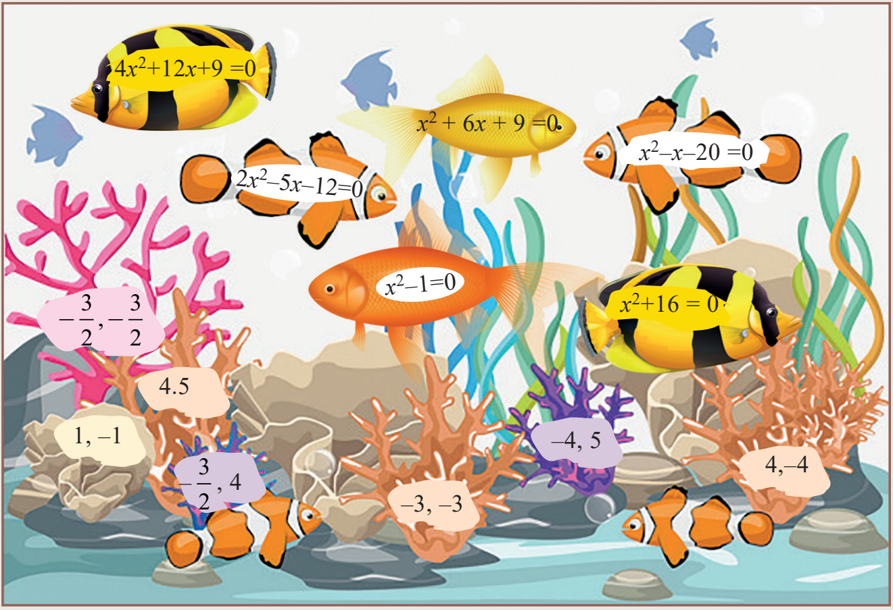

### Exercise 3.11

1. Solve the following quadratic equations by completing the square method.
   - (i) $9x^2-12x+4=0$
   - (ii) $\dfrac{5x+7}{x-1}=3x+2$
2. Solve the following quadratic equations by formula method.
   - (i) $2x^2-5x+2=0$
   - (ii) $\sqrt2f^2-6f+3\sqrt2=0$
   - (iii) $3y^2-20y-23=0$
   - (iv) $36y^2-12ay+(a^2-b^2)=0$
3. A ball rolls down a slope and travels a distance $d=t^2-0.75t$ feet in $t$ seconds. Find the time when the distance travelled by the ball is 11.25 feet.

### 3.6.5 Solving Problems Involving Quadratic Equations

> **Steps to solve a problem**
>
> **Step 1:** Convert the word problem to a quadratic equation form.
>
> **Step 2:** Solve the quadratic equation obtained in any one of the above three methods.
>
> **Step 3:** Relate the mathematical solution obtained to the statement asked in the question.

#### Example 3.36

The product of Kumaran’s age (in years) two years ago and his age four years from now is one more than twice his present age. What is his present age?

**Solution**

Let the present age of Kumaran be $x$ years.

Two years ago, his age $=(x-2)$ years.

Four years from now, his age $=(x+4)$ years.

Given,

$$
(x-2)(x+4)=1+2x
$$
$$
x^2+2x-8=1+2x\Rightarrow(x-3)(x+3)=0\quad\text{then, }x=\pm3.
$$

Therefore, $x=3$ (Rejecting $-3$ as age cannot be negative).

Kumaran’s present age is 3 years.

#### Example 3.37

A ladder 17 feet long is leaning against a wall. If the ladder, vertical wall and the floor from the bottom of the wall to the ladder form a right triangle, find the height of the wall where the top of the ladder meets if the distance between bottom of the wall to bottom of the ladder is 7 feet less than the height of the wall?

**Solution**

Let the height of the wall $AB=x$ feet.

As per the given data $BC=(x-7)$ feet.

In the right triangle $ABC$, $AC=17$ ft, $BC=(x-7)$ feet.

By Pythagoras theorem, $AC^2=AB^2+BC^2$.

$$
(17)^2=x^2+(x-7)^2;\quad289=x^2+x^2-14x+49
$$

$x^2-7x-120=0$ hence, $(x-15)(x+8)=0$ then, $x=15$ (or) $-8$.

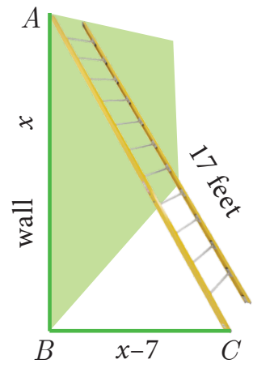

Therefore, height of the wall $AB=15$ ft (Rejecting $-8$ as height cannot be negative).

#### Example 3.38

A flock of swans contained $x^2$ members. As the clouds gathered, $10x$ went to a lake and one-eighth of the members flew away to a garden. The remaining three pairs played about in the water. How many swans were there in total?

**Solution**

As given there are $x^2$ swans.

As per the given data $x^2-10x-\dfrac18x^2=6$ we get, $7x^2-80x-48=0$.

$$
x=\frac{-b\pm\sqrt{b^2-4ac}}{2a}=\frac{80\pm\sqrt{6400-4(7)(-48)}}{14}=\frac{80\pm88}{14}
$$

Therefore, $x=12,-\dfrac47$.

Here $x=-\dfrac47$ is not possible as the number of swans cannot be negative.

Hence, $x=12$. Therefore total number of swans is $x^2=144$.

#### Example 3.39

A passenger train takes 1 hr more than an express train to travel a distance of 240 km from Chennai to Virudhachalam. The speed of the express train is more than that of the passenger train by 20 km per hour. Find the average speed of both the trains.

**Solution**

Let the average speed of passenger train be $x$ km/hr.

Then the average speed of express train will be $(x+20)$ km/hr.

Time taken by the passenger train to cover distance of 240 km $=\dfrac{240}x$ hr.

Time taken by express train to cover distance of 240 km $=\dfrac{240}{x+20}$ hr.

Given,

$$
\frac{240}x=\frac{240}{x+20}+1
$$
$$
240\left[\frac1x-\frac1{x+20}\right]=1\Rightarrow240\left[\frac{x+20-x}{x(x+20)}\right]=1\quad\text{we get, }4800=(x^2+20x)
$$
$$
x^2+20x-4800=0\Rightarrow(x+80)(x-60)=0\quad\text{we get, }x=-80\text{ or }60.
$$

Therefore $x=60$ (Rejecting $-80$ as speed cannot be negative).

Average speed of the passenger train is 60 km/hr.

Average speed of the express train is 80 km/hr.

### Exercise 3.12

1. If the difference between a number and its reciprocal is $\dfrac{24}5$, find the number.
2. A garden measuring 12 m by 16 m is to have a pedestrian pathway that is ‘$w$’ meters wide installed all the way around so that it increases the total area to 285 m². What is the width of the pathway?
3. A bus covers a distance of 90 km at a uniform speed. Had the speed been 15 km/hour more it would have taken 30 minutes less for the journey. Find the original speed of the bus.
4. A girl is twice as old as her sister. Five years hence, the product of their ages (in years) will be 375. Find their present ages.
5. A pole has to be erected at a point on the boundary of a circular ground of diameter 20 m in such a way that the difference of its distances from two diametrically opposite fixed gates P and Q on the boundary is 4 m. Is it possible to do so? If answer is yes at what distance from the two gates should the pole be erected?
6. From a group of $2x^2$ black bees, square root of half of the group went to a tree. Again eight-ninth of the bees went to the same tree. The remaining two got caught up in a fragrant lotus. How many bees were there in total?
7. Music is been played in two opposite galleries with certain group of people. In the first gallery a group of 4 singers were singing and in the second gallery 9 singers were singing. The two galleries are separated by the distance of 70 m. Where should a person stand for hearing the same intensity of the singers voice? (Hint: The ratio of the sound intensity is equal to the square of the ratio of their corresponding distances).
8. There is a square field whose side is 10 m. A square flower bed is prepared in its centre leaving a gravel path all round the flower bed. The total cost of laying the flower bed and gravelling the path at ₹3 and ₹4 per square metre respectively is ₹364. Find the width of the gravel path.
9. The hypotenuse of a right angled triangle is 25 cm and its perimeter 56 cm. Find the length of the smallest side.

### 3.6.6 Nature of Roots of a Quadratic Equation

The roots of the quadratic equation $ax^2+bx+c=0$, $a\ne0$ are found using the formula $x=\dfrac{-b\pm\sqrt{b^2-4ac}}{2a}$. Here, $b^2-4ac$ called as the discriminant (which is denoted by $\Delta$) of the quadratic equation, decides the nature of roots as follows.

| Values of Discriminant $\Delta=b^2-4ac$ | Nature of Roots |
| --- | --- |
| $\Delta>0$ | Real and Unequal roots |
| $\Delta=0$ | Real and Equal roots |
| $\Delta<0$ | No Real root |

#### Example 3.40

Determine the nature of roots for the following quadratic equations.

(i) $x^2-x-20=0$ (ii) $9x^2-24x+16=0$ (iii) $2x^2-2x+9=0$.

**Solution**

(i) $x^2-x-20=0$

Here, $a=1$, $b=-1$, $c=-20$.

Now, $\Delta=b^2-4ac$.

$$
\Delta=(-1)^2-4(1)(-20)=81.
$$

Here, $\Delta=81>0$. So, the equation will have real and unequal roots.

(ii) $9x^2-24x+16=0$

Here, $a=9$, $b=-24$, $c=16$.

Now, $\Delta=b^2-4ac=(-24)^2-4(9)(16)=0$.

Here, $\Delta=0$. So, the equation will have real and equal roots.

(iii) $2x^2-2x+9=0$

Here, $a=2$, $b=-2$, $c=9$.

Now, $\Delta=b^2-4ac=(-2)^2-4(2)(9)=-68$.

Here, $\Delta=-68<0$. So, the equation will have no real roots.

#### Example 3.41

(i) Find the values of ‘$k$’, for which the quadratic equation $kx^2-(8k+4)x+81=0$ has real and equal roots?

(ii) Find the values of ‘$k$’ such that quadratic equation $(k+9)x^2+(k+1)x+1=0$ has no real roots?

**Solution**

(i) $kx^2-(8k+4)x+81=0$

Since the equation has real and equal roots, $\Delta=0$.

That is, $b^2-4ac=0$.

Here, $a=k$, $b=-(8k+4)$, $c=81$.

That is,

$$
[-(8k+4)]^2-4(k)(81)=0
$$
$$
64k^2+64k+16-324k=0
$$
$$
64k^2-260k+16=0.
$$

Dividing by 4 we get $16k^2-65k+4=0$.

$(16k-1)(k-4)=0$ then, $k=\dfrac1{16}$ or $k=4$.

(ii) $(k+9)x^2+(k+1)x+1=0$

Since the equation has no real roots, $\Delta<0$.

That is, $b^2-4ac<0$.

Here, $a=k+9$, $b=k+1$, $c=1$.

That is,

$$
(k+1)^2-4(k+9)(1)<0
$$
$$
k^2+2k+1-4k-36<0
$$
$$
k^2-2k-35<0
$$
$$
(k+5)(k-7)<0.
$$

Therefore, $-5<k<7$. {If $\alpha<\beta$ and if $(x-\alpha)(x-\beta)<0$ then, $\alpha<x<\beta$}.

#### Example 3.42

Prove that the equation $x^2(p^2+q^2)+2x(pr+qs)+r^2+s^2=0$ has no real roots. If $ps=qr$, then show that the roots are real and equal.

**Solution**

The given quadratic equation is $x^2(p^2+q^2)+2x(pr+qs)+r^2+s^2=0$.

Here, $a=p^2+q^2$, $b=2(pr+qs)$, $c=r^2+s^2$.

Now,

$$
\begin{aligned}
\Delta=b^2-4ac&=[2(pr+qs)]^2-4(p^2+q^2)(r^2+s^2)\\
&=4[p^2r^2+2pqrs+q^2s^2-p^2r^2-p^2s^2-q^2r^2-q^2s^2]\\
&=4[-p^2s^2+2pqrs-q^2r^2]=-4[(ps-qr)^2]<0.\tag{1}
\end{aligned}
$$

Since, $\Delta=b^2-4ac<0$, the roots are not real.

If $ps=qr$ then $\Delta=-4[ps-qr]^2=-4[qr-qr]^2=0$ (using (1)).

Thus, $\Delta=0$ if $ps=qr$ and so the roots will be real and equal.

### Exercise 3.13

1. Determine the nature of the roots for the following quadratic equations.
   - (i) $15x^2+11x+2=0$
   - (ii) $x^2-x-1=0$
   - (iii) $\sqrt2t^2-3t+3\sqrt2=0$
   - (iv) $9y^2-6\sqrt2y+2=0$
   - (v) $9a^2b^2x^2-24abcdx+16c^2d^2=0$, $a\ne0$, $b\ne0$
2. Find the value(s) of ‘$k$’ for which the roots of the following equations are real and equal.
   - (i) $(5k-6)x^2+2kx+1=0$
   - (ii) $kx^2+(6k+2)x+16=0$
3. If the roots of $(a-b)x^2+(b-c)x+(c-a)=0$ are real and equal then prove that $b,a,c$ are in arithmetic progression.
4. If $a,b$ are real then show that the roots of the equation $(a-b)x^2-6(a+b)x-9(a-b)=0$ are real and unequal.
5. If the roots of the equation $(c^2-ab)x^2-2(a^2-bc)x+b^2-ac=0$ are real and equal prove that either $a=0$ (or) $a^3+b^3+c^3=3abc$.

> **Thinking Corner**
>
> Fill in the empty box in each of the given expression so that the resulting quadratic polynomial becomes a perfect square.
>
> (i) $x^2+14x+\boxed{\phantom{000}}$ (ii) $x^2-24x+\boxed{\phantom{000}}$ (iii) $p^2+2qp+\boxed{\phantom{000}}$.

### 3.6.7 The Relation between Roots and Coefficients of a Quadratic Equation

Let $\alpha$ and $\beta$ are the roots of the equation $ax^2+bx+c=0$ then,

$$
\alpha=\frac{-b+\sqrt{b^2-4ac}}{2a},\quad\beta=\frac{-b-\sqrt{b^2-4ac}}{2a}.
$$

From 3.6.3, we get

$$
\alpha+\beta=\frac{-b}a=\frac{-\text{Co-efficient of }x}{\text{Co-efficient of }x^2}
$$
$$
\alpha\beta=\frac ca=\frac{\text{Constant term}}{\text{Co-efficient of }x^2}.
$$

> **Progress Check**
>
> | Quadratic equation | Roots of quadratic equation $\alpha$ and $\beta$ | co-efficients of $x^2$, $x$ and constants | Sum of Roots $\alpha+\beta$ | Product of roots $\alpha\beta$ | $-\dfrac ba$ | $\dfrac ca$ | Conclusion |
> | --- | --- | --- | --- | --- | --- | --- | --- |
> | $4x^2-9x+2=0$ | | | | | | | |
> | $\left(x-\dfrac45\right)^2=0$ | | | | | | | |
> | $2x^2-15x-27=0$ | | | | | | | |

#### Example 3.43

If the difference between the roots of the equation $x^2-13x+k=0$ is 17 find $k$.

**Solution**

$x^2-13x+k=0$ here, $a=1$, $b=-13$, $c=k$.

Let $\alpha,\beta$ be the roots of the equation. Then

$$
\alpha+\beta=\frac{-b}a=\frac{-(-13)}1=13.\tag{1}
$$

Also $\alpha-\beta=17$. …(2)

(1)+(2) we get, $2\alpha=30\Rightarrow\alpha=15$.

Therefore, $15+\beta=13$ (from (1)) $\Rightarrow\beta=-2$.

But, $\alpha\beta=\dfrac ca=\dfrac k1\Rightarrow15\times(-2)=k$ we get, $k=-30$.

> **Thinking Corner**
>
> If the constant term of $ax^2+bx+c=0$ is zero, then the sum and product of roots are _______ and _______.

#### Example 3.44

If $\alpha$ and $\beta$ are the roots of $x^2+7x+10=0$ find the values of

(i) $(\alpha-\beta)$ (ii) $\alpha^2+\beta^2$ (iii) $\alpha^3-\beta^3$ (iv) $\alpha^4+\beta^4$ (v) $\dfrac\alpha\beta+\dfrac\beta\alpha$ (vi) $\dfrac{\alpha^2}\beta+\dfrac{\beta^2}\alpha$.

**Solution**

$x^2+7x+10=0$ here, $a=1$, $b=7$, $c=10$.

If $\alpha$ and $\beta$ are roots of the equation then,

$$
\alpha+\beta=\frac{-b}a=\frac{-7}1=-7;\quad\alpha\beta=\frac ca=\frac{10}1=10.
$$

(i) $\alpha-\beta=\sqrt{(\alpha+\beta)^2-4\alpha\beta}=\sqrt{(-7)^2-4\times10}=\sqrt9=3$.

(ii) $\alpha^2+\beta^2=(\alpha+\beta)^2-2\alpha\beta=(-7)^2-2\times10=29$.

(iii) $\alpha^3-\beta^3=(\alpha-\beta)^3+3\alpha\beta(\alpha-\beta)=(3)^3+3(10)(3)=117$.

(iv) $\alpha^4+\beta^4=(\alpha^2+\beta^2)^2-2\alpha^2\beta^2=29^2-2\times(10)^2=641$ (from (ii), $\alpha^2+\beta^2=29$).

(v) $\dfrac\alpha\beta+\dfrac\beta\alpha=\dfrac{\alpha^2+\beta^2}{\alpha\beta}=\dfrac{(\alpha+\beta)^2-2\alpha\beta}{\alpha\beta}=\dfrac{49-20}{10}=\dfrac{29}{10}$.

(vi) 

$$
\frac{\alpha^2}{\beta}+\frac{\beta^2}{\alpha}=\frac{\alpha^3+\beta^3}{\alpha\beta}=\frac{(\alpha+\beta)^3-3\alpha\beta(\alpha+\beta)}{\alpha\beta}=\frac{(-343)-3(10\times(-7))}{10}=\frac{-343+210}{10}=\frac{-133}{10}.
$$

#### Example 3.45

If $\alpha,\beta$ are the roots of the equation $3x^2+7x-2=0$, find the values of (i) $\dfrac{\alpha}{\beta}+\dfrac{\beta}{\alpha}$ (ii) $\dfrac{\alpha^2}{\beta}+\dfrac{\beta^2}{\alpha}$.

**Solution** $3x^2+7x-2=0$ here, $a=3$, $b=7$, $c=-2$.

Since, $\alpha,\beta$ are the roots of the equation,

(i) 

$$
\alpha+\beta=\frac{-b}{a}=\frac{-7}{3};\quad\alpha\beta=\frac{c}{a}=\frac{-2}{3}.
$$

$$
\frac{\alpha}{\beta}+\frac{\beta}{\alpha}=\frac{\alpha^2+\beta^2}{\alpha\beta}=\frac{(\alpha+\beta)^2-2\alpha\beta}{\alpha\beta}=\frac{\left(\frac{-7}{3}\right)^2-2\left(\frac{-2}{3}\right)}{\frac{-2}{3}}=\frac{-61}{6}.
$$

(ii) 

$$
\frac{\alpha^2}{\beta}+\frac{\beta^2}{\alpha}=\frac{\alpha^3+\beta^3}{\alpha\beta}=\frac{(\alpha+\beta)^3-3\alpha\beta(\alpha+\beta)}{\alpha\beta}=\frac{\left(-\frac73\right)^3-3\left(-\frac23\right)\left(-\frac73\right)}{-\frac23}=\frac{469}{18}.
$$

#### Example 3.46

If $\alpha,\beta$ are the roots of the equation $2x^2-x-1=0$, then form the equation whose roots are (i) $\dfrac1\alpha,\dfrac1\beta$ (ii) $\alpha^2\beta,\beta^2\alpha$ (iii) $2\alpha+\beta,2\beta+\alpha$.

**Solution** $2x^2-x-1=0$ here, $a=2$, $b=-1$, $c=-1$.

$$
\alpha+\beta=\frac{-b}{a}=\frac{-(-1)}2=\frac12;\quad\alpha\beta=\frac ca=-\frac12.
$$

(i) Given roots are $\dfrac1\alpha,\dfrac1\beta$.

$$
\text{Sum of the roots}=\frac1\alpha+\frac1\beta=\frac{\alpha+\beta}{\alpha\beta}=\frac{\frac12}{-\frac12}=-1.
$$

$$
\text{Product of the roots}=\frac1\alpha\times\frac1\beta=\frac1{\alpha\beta}=\frac1{-\frac12}=-2.
$$

The required equation is $x^2-(\text{Sum of the roots})x+(\text{Product of the roots})=0$.

$$
x^2-(-1)x-2=0\Rightarrow x^2+x-2=0.
$$

(ii) Given roots are $\alpha^2\beta,\beta^2\alpha$.

$$
\text{Sum of the roots }\alpha^2\beta+\beta^2\alpha=\alpha\beta(\alpha+\beta)=-\frac12\left(\frac12\right)=-\frac14.
$$

$$
\text{Product of the roots }(\alpha^2\beta)\times(\beta^2\alpha)=\alpha^3\beta^3=(\alpha\beta)^3=\left(-\frac12\right)^3=-\frac18.
$$

The required equation is $x^2-(\text{Sum of the roots})x+(\text{Product of the roots})=0$.

$$
x^2-\left(-\frac14\right)x-\frac18=0\Rightarrow8x^2+2x-1=0.
$$

(iii) $2\alpha+\beta,2\beta+\alpha$.

$$
\text{Sum of the roots }2\alpha+\beta+2\beta+\alpha=3(\alpha+\beta)=3\left(\frac12\right)=\frac32.
$$

$$
\begin{aligned}\text{Product of the roots}&=(2\alpha+\beta)(2\beta+\alpha)=4\alpha\beta+2\alpha^2+2\beta^2+\alpha\beta\\&=5\alpha\beta+2(\alpha^2+\beta^2)=5\alpha\beta+2[(\alpha+\beta)^2-2\alpha\beta]\\&=5\left(-\frac12\right)+2\left[\frac14-2\times-\frac12\right]=0.\end{aligned}
$$

The required equation is $x^2-(\text{Sum of the roots})x+(\text{Product of the roots})=0$.

$$
x^2-\frac32x+0=0\Rightarrow2x^2-3x=0.
$$

### Exercise 3.14

1. Write each of the following expression in terms of $\alpha+\beta$ and $\alpha\beta$.

   (i) $\dfrac{\alpha}{3\beta}+\dfrac{\beta}{3\alpha}$ (ii) $\dfrac1{\alpha^2\beta}+\dfrac1{\beta^2\alpha}$ (iii) $(3\alpha-1)(3\beta-1)$ (iv) $\dfrac{\alpha+3}{\beta}+\dfrac{\beta+3}{\alpha}$.

2. The roots of the equation $2x^2-7x+5=0$ are $\alpha$ and $\beta$. Without solving for the roots, find

   (i) $\dfrac1\alpha+\dfrac1\beta$ (ii) $\dfrac\alpha\beta+\dfrac\beta\alpha$ (iii) $\dfrac{\alpha+2}{\beta+2}+\dfrac{\beta+2}{\alpha+2}$.

3. The roots of the equation $x^2+6x-4=0$ are $\alpha,\beta$. Find the quadratic equation whose roots are

   (i) $\alpha^2$ and $\beta^2$ (ii) $\dfrac2\alpha$ and $\dfrac2\beta$ (iii) $\alpha^2\beta$ and $\beta^2\alpha$.

4. If $\alpha,\beta$ are the roots of $7x^2+ax+2=0$ and if $\beta-\alpha=\dfrac{-13}{7}$. Find the values of $a$.
5. If one root of the equation $2y^2-ay+64=0$ is twice the other then find the values of $a$.
6. If one root of the equation $3x^2+kx+81=0$ (having real roots) is the square of the other then find $k$.

## 3.7 Graph of Variations

##### Variables:

Every day, Harini travels from her home, cycling at a uniform speed, to reach her school. You can state this mathematically by an equation $d=rt$, where $d$ stands for distance travelled at any time $t$ and $r$ is the uniform rate of speed.

Suppose you want to find the distance covered by her at a speed of 20 km per hour when she has cycled for fifteen minutes.

$r=20$ and $t=\dfrac14$ (how?) and we find $d$ to be $rt=20\times\dfrac14=5$ km.

Here, we say that $d$ is a dependent variable and $r$ and $t$ are independent variables. As the distance $d$ travelled depends upon the rate $r$ and time used $t$.

Thus, an **independent variable** represents a quantity that is manipulated in a given situation where as a **dependent variable** represents a quantity whose value depends on how the independent variable is manipulated.

Equations that describe the relationship between two variables in a sentence express the variation between those variables.

Consider the monthly income of Server Suresh who works in a hotel where he is paid ₹50 per hour.

There are two variables here. One is the monthly income and the other is the number of hours he works. Which among the two is the independent variable?

##### Constants:

You know how to calculate the area of a circle when the length of its radius is given. If the area required is $A$ and the length of radius is $r$, then the formula

$$
A=\pi r^2
$$

gives the required result. Here, the area $A$ depends upon the length $r$ of radius; thus $A$ is a dependent variable and $r$ is the independent variable. But what can we say about $\pi$? It is a number that remains the same in all the situations. It is constant.

A constant is a quantity that assumes a fixed value throughout in a specific mathematical context.

##### Two types of variation:

When two things are in proportion, there is a relation between them, due to which, if the value of one of them changes, the value of the other also changes. We look into two types of variations here:

(i) Direct variation

(ii) Indirect variation.

##### (i) Direct variation:

When you go to the market, to buy more apples, you’ll have to spend more amount of money. If the cost of one kg of apples is ₹200, you pay as follows:

| Weight (Kg) | 1 | 2 | 3 | 4 | 5 |
|---|---|---|---|---|---|
| Cost (₹) | 200 | 400 | 600 | 800 | 1000 |

You find that $\dfrac1{200}=\dfrac2{400}=\dfrac3{600}=\dfrac4{800}=\dfrac5{1000}=\cdots$.

This kind of proportionate variation is known as **Direct variation**. Here to find the cost, the weight is multiplied by the constant 200.

If we denote the variable weight as $x$ and the variable cost as $y$ we can express this algebraically as $y=200x$. The multiplying constant here is 200.

> If $\dfrac yx=k$ where $k$ is a positive number (a constant), then $x$ and $y$ are said to vary directly. Here, $k$ is known as the constant of proportionality.

> **Do You Know — Mathematics in real life:** This figure shows that doubling the force doubles the displacement. This is a consequence of what is known as *Hooke’s law*. It states $F=kx$ where $F$ is the force needed to produce a displacement of $x$ in the position of a spring. To double the displacement, you double the force on the spring; the constant of proportionality $k$ depends on the stiffness of the spring. So this is an example of a direct proportionality.
>
> 

##### Visualising Direct variation:

To identify direct variation is to look at the equation and determine if it is of the form $y=kx$, where $k$ is the constant of proportionality. Thus, an equation like $y=5x$ will always indicate direct proportion among variables.

> **Thinking Corner**
>
> What can you say if the variables $x$ and $y$ are related by the equation $3y-7x=0$? It also indicates direct variation. How? Think about it. In that case, what is the constant of proportionality?

**Observe this graph:**

The distance travelled and the time taken are proportional, but how do we know that?

Note that

(i) The graph is a straight line.

(ii) The line passes through the origin. When both of these features are present we know that the two quantities on the graph must be directly proportional.

Do you see this in the graph?

| Time (in minutes) | 4 | 8 | 12 | 16 |
|---|---|---|---|---|
| Distance (in km) | 8 | 16 | 24 | 32 |

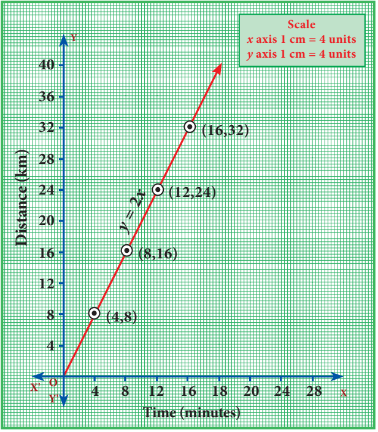

If one variable doubles, the other also doubles. From this you can see the relation $d=rt$ and it is easy to guess the constant of proportionality.

#### Example 3.47

Varshika drew 6 circles with different sizes. Draw a graph for the relationship between the diameter and circumference (approximately related) of each circle as shown in the table and use it to find the circumference of a circle when its diameter is 6 cm.

| Diameter ($x$) cm | 1 | 2 | 3 | 4 | 5 |
|---|---|---|---|---|---|
| Circumference ($y$) cm | 3.1 | 6.2 | 9.3 | 12.4 | 15.5 |

**Solution:**

From the table, we found that as $x$ increases, $y$ also increases. Thus, the variation is a **direct variation**.

Let $y=kx$, where $k$ is a constant of proportionality.

From the given values, we have,

$$
k=\frac{3.1}1=\frac{6.2}2=\frac{9.3}3=\frac{12.4}4=\cdots=3.1.
$$

When you plot the points $(1,3.1)$ $(2,6.2)$ $(3,9.3)$, $(4,12.4)$, $(5,15.5)$, you find the relation $y=(3.1)x$ forms a straight-line graph.

Clearly, from the graph, when diameter is 6 cm, its circumference is 18.6 cm.

#### Example 3.48

A bus is travelling at a uniform speed of 50 km/hr. Draw the time-distance graph and hence find

(i) the constant of variation

(ii) how far will it travel in 90 minutes?

(iii) the time required to cover a distance of 300 km from the graph.

**Solution**

Let $x$ be the time taken in minutes and $y$ be the distance travelled in km.

| Time taken $x$ (in minutes) | 60 | 120 | 180 | 240 |
|---|---|---|---|---|
| Distance $y$ (in km) | 50 | 100 | 150 | 200 |

(i) Observe that as time increases, the distance travelled also increases. Therefore, the variation is a direct variation. It is of the form $y=kx$.

Constant of variation

$$
k=\frac yx=\frac{50}{60}=\frac{100}{120}=\frac{150}{180}=\frac{200}{240}=\frac56.
$$

Hence, the relation may be given as

$$
y=kx\Rightarrow y=\frac56x.
$$

(ii) From the graph, $y=\dfrac{5x}6$, if $x=90$, then $y=\dfrac56\times90=75$ km.

The distance travelled for 90 minutes is 75 km.

(iii) From the graph, $y=\dfrac{5x}6$, if $y=300$ then $x=\dfrac{6y}5=\dfrac65\times300=360$ minutes (or) 6 hours.

The time taken to cover 300 km is 360 minutes (or) 6 hours.

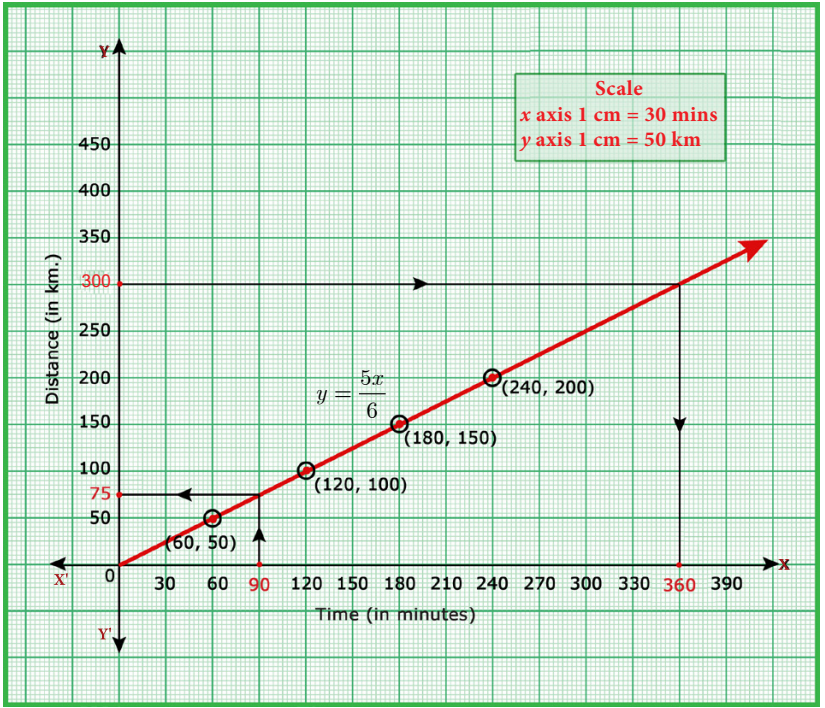

##### (ii) Indirect variation:

The distance between Chennai and Madurai is (nearly) 480 km. Think of a train that starts from Chennai and travels towards Madurai. As it **increases** speed more and more, the time taken for travel will **decrease**. In the following table speed $v$ is given in km and time $t$ is given in hours:

| Speed ($v$) (km/hr) | 30 | 40 | 60 | 80 |
|---|---|---|---|---|
| Time ($t$) (hours) | 16 | 12 | 8 | 6 |

From the table it is clear that if you travel at a slower speed, the time increases and if the train is faster, the time decreases. You find, $30\times16=40\times12=60\times8=80\times6$, which tells that $vt$ is a constant. Here, $vt=480$. In such a case, we say the variables $v$ and $t$ are inversely proportional. Observe that the graph of equation like $vt=480$ will not be a straight line. Inverse variation implies that as one variable increases, the other variable decreases.

##### Visualising Indirect variation:

Look at the adjacent graph. It is a graph of the equation $xy=8$. We have taken only the [positive values of $x,y$.

The table of values is:

| $x$ | 1 | 2 | 4 | 8 |
|---|---|---|---|---|
| $y=\dfrac8x$ | 8 | 4 | 2 | 1 |

This is an illustration of inverse variation or indirect variation. The graph is a part of a curve called Rectangular Hyperbola.

#### Example 3.49

A company initially started with 40 workers to complete the work by 150 days. Later, it decided to fasten up the work increasing the number of workers as shown below.

| Number of workers ($x$) | 40 | 50 | 60 | 75 |
|---|---|---|---|---|
| Number of days ($y$) | 150 | 120 | 100 | 80 |

(i) Graph the above data and identify the type of variation.

(ii) From the graph, find the number of days required to complete the work if the company decides to opt for 120 workers?

(iii) If the work has to be completed by 200 days, how many workers are required?

(i)

From the given table, we observe that as $x$ increases, $y$ decreases. Thus, the variation is an inverse variation.

Let $y=\dfrac kx$.

$\Rightarrow xy=k$, $k>0$ is called the constant of variation.

From the table, $k=40\times150=50\times120=\cdots=75\times80=6000$.

Therefore, $xy=6000$.

Plot the points $(40,150)$, $(50,120)$, $(60,100)$ of $(75,80)$ and join to get a free hand smooth curve (Rectangular Hyperbola).

(ii) From the graph, the required number of days to complete the work when the company decides to work with 120 workers is 50 days.

Also, from $xy=6000$ if $x=120$, then $y=\dfrac{6000}{120}=50$.

(iii) From the graph, if the work has to be completed by 200 days, the number of workers required is 30.

Also, from $xy=6000$ if $y=200$, then $x=\dfrac{6000}{200}=30$.

#### Example 3.50

Nishanth is the winner in a Marathon race of 12 km distance. He ran at the uniform speed of 12 km/hr and reached the destination in 1 hour. He was followed by Aradhana, Jeyanth, Sathya and Swetha with their respective speed of 6 km/hr, 4 km/hr, 3 km/hr and 2 km/hr. And, they covered the distance in 2 hrs, 3 hrs, 4 hrs and 6 hours respectively.

Draw the speed-time graph and use it to find the time taken to Kaushik with his speed of 2.4 km/hr.

**Solution:** Let us form the table with the given details.

| Speed $x$ (km/hr) | 12 | 6 | 4 | 3 | 2 |
|---|---|---|---|---|---|
| Time $y$ (hours) | 1 | 2 | 3 | 4 | 6 |

From the table, we observe that as $x$ decreases, $y$ increases. Hence, the type is **inverse variation**.

Let $y=\dfrac kx$.

$\Rightarrow xy=k$, $k>0$ is called the constant of variation.

From the table $k=12\times1=6\times2=\cdots=2\times6=12$.

Therefore, $xy=12$.

Plot the points $(12,1)$, $(6,2)$, $(4,3)$, $(3,4)$, $(2,6)$ and join these points by a smooth curve (Rectangular Hyperbola).

From the graph, we observe that Kaushik takes 5 hrs with a speed of 2.4 km/hr.

> **Note**
>
> Already we learned that, the linear equation of straight line is $y=mx+c$, where $m$ is the slope of the straight line and $c$ is the $y$-intercept. Also, the equation reduces to $y=mx$ when the straight line passes through origin. As the graph of direct variation refer to straight line and its general form is $y=kx$, we can conclude that **‘constant of proportionality’** is nothing but **‘slope’** of its straight line.

### Exercise 3.15

1. A garment shop announces a flat 50% discount on every purchase of items for their customers. Draw the graph for the relation between the Marked Price and the Discount. Hence find

   (i) the marked price when a customer gets a discount of ₹3250 (from graph)

   (ii) the discount when the marked price is ₹2500.

2. Draw the graph of $xy=24$, $x,y>0$. Using the graph find, (i) $y$ when $x=3$ and (ii) $x$ when $y=6$.
3. Graph the following linear function $y=\dfrac12x$. Identify the constant of variation and verify it with the graph. Also (i) find $y$ when $x=9$ (ii) find $x$ when $y=7.5$.
4. The following table shows the data about the number of pipes and the time taken to fill the same tank.

   | No. of pipes ($x$) | 2 | 3 | 6 | 9 |
   |---|---|---|---|---|
   | Time Taken (in min) ($y$) | 45 | 30 | 15 | 10 |

   Draw the graph for the above data and hence

   (i) find the time taken to fill the tank when five pipes are used

   (ii) Find the number of pipes when the time is 9 minutes.

5. A school announces that for a certain competitions, the cash price will be distributed for all the participants equally as show below

   | No. of participants ($x$) | 2 | 4 | 6 | 8 | 10 |
   |---|---|---|---|---|---|
   | Amount for each participant in ₹ ($y$) | 180 | 90 | 60 | 45 | 36 |

   (i) Find the constant of variation.

   (ii) Graph the above data and hence, find how much will each participant get if the number of participants are 12.

6. A two wheeler parking zone near bus stand charges as below.

   | Time (in hours) ($x$) | 4 | 8 | 12 | 24 |
   |---|---|---|---|---|
   | Amount ₹ ($y$) | 60 | 120 | 180 | 360 |

   Check if the amount charged are in direct variation or in inverse variation to the parking time. Graph the data. Also (i) find the amount to be paid when parking time is 6 hr; (ii) find the parking duration when the amount paid is ₹150.

## 3.8 Quadratic Graphs

##### Introduction

The trajectory followed by an object (say, a ball) thrown upward at an angle gives a curve known as a parabola. Trajectory of water jets in a fountain or of a bouncing ball results in a parabolic path. A parabola represents a **Quadratic function**.

A quadratic function has the form $f(x)=ax^2+bx+c$, where $a,b,c$ are constants, and $a\ne0$.

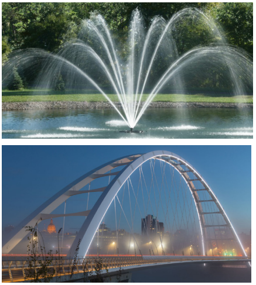

Many quadratic functions can be graphed easily by hand using the techniques of stretching/shrinking and shifting the parabola $y=x^2$ (We can easily sketch the curve $y=x^2$ by preparing a table of values and plotting the ordered pairs).

The “basic” parabola, $y=x^2$, looks like this Fig. 3.16.

The coefficient $a$ in the general equation is responsible for parabolas to open upward or downward and vary in “width” (“wider” or “skinnier”), but they all have the same basic “∪” shape.

The greater the quadratic coefficient of $x^2$, the narrower is the parabola.

The lesser the quadratic coefficient of $x^2$, the wider is the parabola.

Graph $y=x^2$ is broader than graph $y=4x^2$.

Graph $y=x^2$ is narrower than graph $y=\dfrac14x^2$.

A parabola is symmetric with respect to a line called the axis of symmetry. The point of intersection of the parabola and the **axis of symmetry** is called the **vertex** of the parabola. The graph of any second degree polynomial gives a curve called “parabola”.

> **Hint:** For a quadratic equation, the axis is given by $x=\dfrac{-b}{2a}$ and the vertex is given by $\left(\dfrac{-b}{2a},\dfrac{-\Delta}{4a}\right)$ where $\Delta=b^2-4ac$ is the discriminant of the quadratic equation $ax^2+bx+c=0$. Where $a\ne0$.

We have already studied how to find the roots of any quadratic equation $ax^2+bx+c=0$ where $a,b,c\in\mathbb R$ and $a\ne0$ theoretically. In this section, we will learn how to solve a quadratic equation and obtain its roots graphically.

### 3.8.1 Finding the Nature of Solution of Quadratic Equations Graphically

To obtain the roots of the quadratic equation $ax^2+bx+c=0$ graphically, we first draw the graph of $y=ax^2+bx+c$.

The solutions of the quadratic equation are the $x$ coordinates of the points of intersection of the curve with $X$ axis.

To determine the nature of solutions of a quadratic equation, we can use the following procedure.

(i) If the graph of the given quadratic equation intersect the $X$ axis at two distinct points, then the given equation has **two real and unequal roots**.

(ii) If the graph of the given quadratic equation touch the $X$ axis at only one point, then the given equation has only one root which is same as saying **two real and equal roots**.

(iii) If the graph of the given equation does not intersect the $X$ axis at any point then the given equation has **no real root**.

#### Example 3.51

Discuss the nature of solutions of the following quadratic equations.

(i) $x^2+x-12=0$ (ii) $x^2-8x+16=0$ (iii) $x^2+2x+5=0$.

**Solution**

(i) $x^2+x-12=0$.

**Step 1:** Prepare the table of values for the equation $y=x^2+x-12$.

| $x$ | $-5$ | $-4$ | $-3$ | $-2$ | $-1$ | 0 | 1 | 2 | 3 | 4 |
|---|---|---|---|---|---|---|---|---|---|---|
| $y$ | 8 | 0 | $-6$ | $-10$ | $-12$ | $-12$ | $-10$ | $-6$ | 0 | 8 |

**Step 2:** Plot the points for the above ordered pairs $(x,y)$ on the graph using suitable scale.

**Step 3:** Draw the parabola and mark the co-ordinates of the parabola which intersect the $X$ axis.

**Step 4:** The roots of the equation are the $x$ coordinates of the intersecting points $(-4,0)$ and $(3,0)$ of the parabola with the $X$ axis which are $-4$ and 3 respectively.

Since there are two points of intersection with the $X$ axis, the quadratic equation $x^2+x-12=0$ has **real and unequal roots**.

(ii) $x^2-8x+16=0$.

**Step 1:** Prepare the table of values for the equation $y=x^2-8x+16$.

| $x$ | $-1$ | 0 | 1 | 2 | 3 | 4 | 5 | 6 | 7 | 8 |
|---|---|---|---|---|---|---|---|---|---|---|
| $y$ | 25 | 16 | 9 | 4 | 1 | 0 | 1 | 4 | 9 | 16 |

**Step 2:** Plot the points for the above ordered pairs $(x,y)$ on the graph using suitable scale.

**Step 3:** Draw the parabola and mark the coordinates of the parabola which intersect with the $X$ axis.

**Step 4:** The roots of the equation are the $x$ coordinates of the intersecting points of the parabola with the $X$ axis $(4,0)$ which is 4.

Since there is only one point of intersection with $X$ axis, the quadratic equation $x^2-8x+16=0$ has **real and equal roots**.

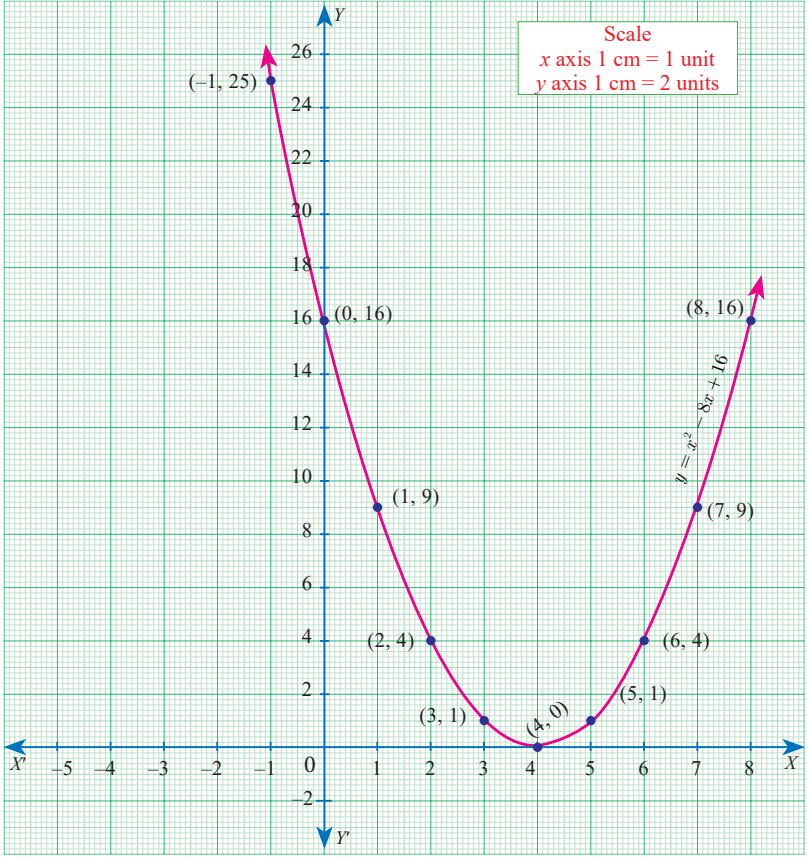

(iii) $x^2+2x+5=0$.

Let $y=x^2+2x+5$.

**Step 1:** Prepare a table of values for the equation $y=x^2+2x+5$.

| $x$ | $-3$ | $-2$ | $-1$ | 0 | 1 | 2 | 3 |
|---|---|---|---|---|---|---|---|
| $y$ | 8 | 5 | 4 | 5 | 8 | 13 | 20 |

**Step 2:** Plot the above ordered pairs $(x,y)$ on the graph using suitable scale.

**Step 3:** Join the points by a free-hand smooth curve this smooth curve is the graph of $y=x^2+2x+5$.

**Step 4:** The solutions of the given quadratic equation are the $x$ coordinates of the intersecting points of the parabola the $X$ axis.

Here, the parabola doesn’t intersect or touch the $X$ axis.

So, we conclude that there is **no real root** for the given quadratic equation.

> **Progress Check**
>
> Connect the graphs to its respective number of points of intersection with $X$ axis and to its corresponding nature of solutions which is given in the following table.

| S. No. | Graphs | Number of points of Intersection with $X$ axis | Nature of solutions |
|---|---|---|---|
| 1. | 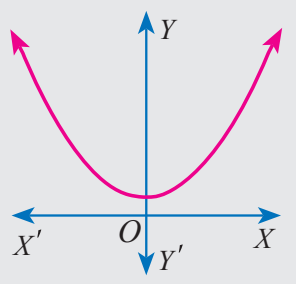 | 2 | Real and equal roots |
| 2. | 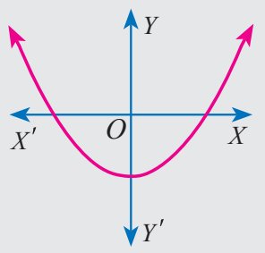 | 1 | No real roots |
| 3. |  | 2 | No real roots |
| 4. |  | 0 | Real and equal roots |
| 5. |  | 0 | Real and unequal roots |
| 6. | 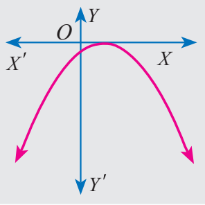 | 1 | Real and unequal roots |

The illustrated connection is Graph 1 → 0 points of intersection → No real roots.

### 3.8.2 Solving quadratic equations through intersection of lines

We can determine roots of a quadratic equation graphically by choosing appropriate parabola and intersecting it with a desired straight line.

(i) If the straight line **intersects the parabola at two distinct points**, then the $x$ coordinates of those points will be the **roots** of the given quadratic equation.

(ii) If the straight line just **touch the parabola at only one point**, then the $x$ coordinate of the common point will be the **single root** of the quadratic equation.

(iii) If the straight line **doesn’t intersect or touch the parabola** then the quadratic equation will have **no real roots**.

#### Example 3.52

Draw the graph of $y=2x^2$ and hence solve $2x^2-x-6=0$.

**Solution — Step 1:** Draw the graph of $y=2x^2$ by preparing the table of values as below

| $x$ | $-2$ | $-1$ | 0 | 1 | 2 |
|---|---|---|---|---|---|
| $y$ | 8 | 2 | 0 | 2 | 8 |

**Step 2:** To solve $2x^2-x-6=0$, subtract $2x^2-x-6=0$ from $y=2x^2$.

$$
\begin{array}{rcl}y&=&2x^2\\0&=&2x^2-x-6\quad(-)\\\hline y&=&x+6\end{array}
$$

The equation $y=x+6$ represents a straight line. Draw the graph of $y=x+6$ by forming table of values as below

| $x$ | $-2$ | $-1$ | 0 | 1 | 2 |
|---|---|---|---|---|---|
| $y$ | 4 | 5 | 6 | 7 | 8 |

**Step 3:** Mark the points of intersection of the curve $y=2x^2$ and the line $y=x+6$. That is, $(-1.5,4.5)$ and $(2,8)$.

**Step 4:** The $x$ coordinates of the respective points forms the solution set $\{-1.5,2\}$ for $2x^2-x-6=0$.

#### Example 3.53

Draw the graph of $y=x^2+4x+3$ and hence find the roots of $x^2+x+1=0$.

**Solution**

**Step 1:** Draw the graph of $y=x^2+4x+3$ by preparing the table of values as below

| $x$ | $-4$ | $-3$ | $-2$ | $-1$ | 0 | 1 | 2 |
|---|---|---|---|---|---|---|---|
| $y$ | 3 | 0 | $-1$ | 0 | 3 | 8 | 15 |

**Step 2:** To solve $x^2+x+1=0$, subtract $x^2+x+1=0$ from $y=x^2+4x+3$.

$$
\begin{array}{rcl}y&=&x^2+4x+3\\0&=&x^2+x+1\quad(-)\\\hline y&=&3x+2\end{array}
$$

The equation represent a straight line. Draw the graph of $y=3x+2$ forming the table of values as below.

| $x$ | $-2$ | $-1$ | 0 | 1 | 2 |
|---|---|---|---|---|---|
| $y$ | $-4$ | $-1$ | 2 | 5 | 8 |

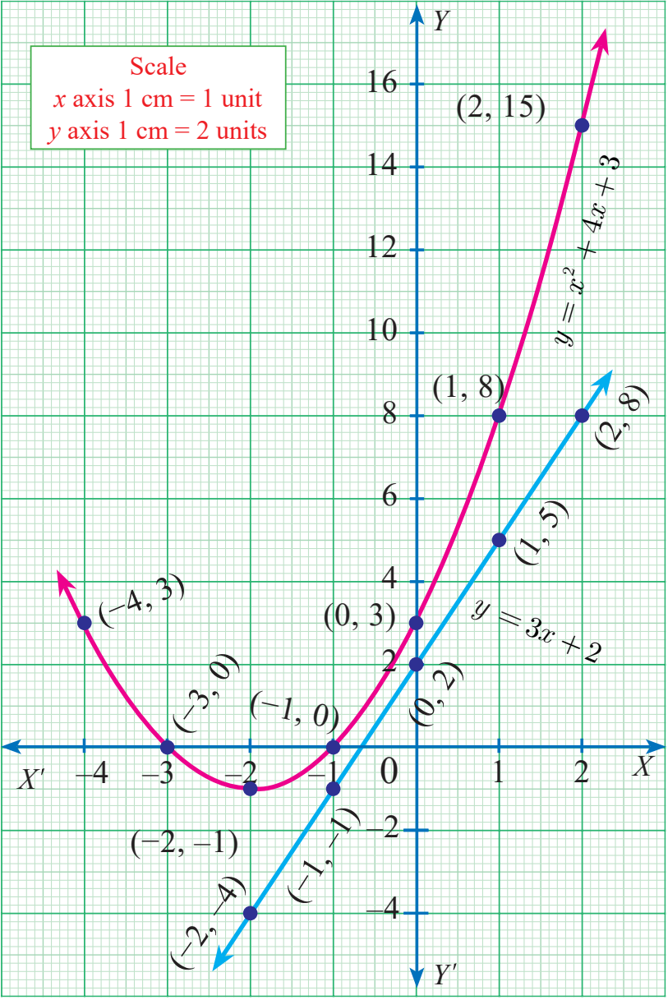

**Step 3:** Observe that the graph of $y=3x+2$ does not intersect or touch the graph of the parabola $y=x^2+4x+3$.

Thus $x^2+x+1=0$ has no real roots.

#### Example 3.54

Draw the graph of $y=x^2+x-2$ and hence solve $x^2+x-2=0$.

**Solution**

**Step 1:** Draw the graph of $y=x^2+x-2$ by preparing the table of values as below

| $x$ | $-3$ | $-2$ | $-1$ | 0 | 1 | 2 |
|---|---|---|---|---|---|---|
| $y$ | 4 | 0 | $-2$ | $-2$ | 0 | 4 |

**Step 2:** To solve $x^2+x-2=0$ subtract $x^2+x-2=0$ from $y=x^2+x-2$ that is

$$
\begin{array}{rcl}y&=&x^2+x-2\\0&=&x^2+x-2\quad(-)\\\hline y&=&0\end{array}
$$

The equation $y=0$ represents the $X$ axis.

**Step 3:** Mark the point of intersection of the curve $y=x^2+x-2$ with the $X$ axis. That is $(-2,0)$ and $(1,0)$.

**Step 4:** The $x$ coordinates of the respective points form the solution set $\{-2,1\}$ for $x^2+x-2=0$.

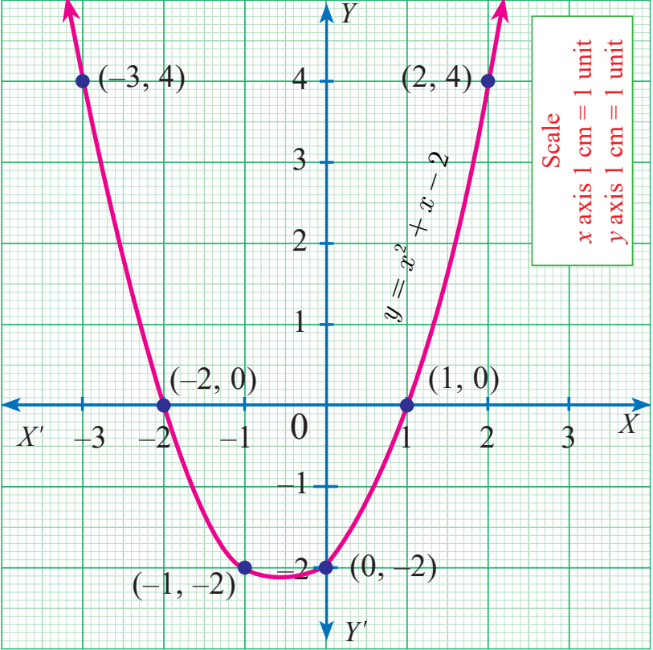

#### Example 3.55

Draw the graph of $y=x^2-4x+3$ and use it to solve $x^2-6x+9=0$.

**Solution**

**Step 1:** Draw the graph of $y=x^2-4x+3$ by preparing the table of values as below

| $x$ | $-2$ | $-1$ | 0 | 1 | 2 | 3 | 4 |
|---|---|---|---|---|---|---|---|
| $y$ | 15 | 8 | 3 | 0 | $-1$ | 0 | 3 |

**Step 2:** To solve $x^2-6x+9=0$, subtract $x^2-6x+9=0$ from $y=x^2-4x+3$ that is

$$
\begin{array}{rcl}y&=&x^2-4x+3\\0&=&x^2-6x+9\quad(-)\\\hline y&=&2x-6\end{array}
$$

The equation $y=2x-6$ represent a straight line. Draw the graph of $y=2x-6$ forming the table of values as below.

| $x$ | 0 | 1 | 2 | 3 | 4 | 5 |
|---|---|---|---|---|---|---|
| $y$ | $-6$ | $-4$ | $-2$ | 0 | 2 | 4 |

The line $y=2x-6$ intersect $y=x^2-4x+3$ only at one point.

**Step 3:** Mark the point of intersection of the curve $y=x^2-4x+3$ and $y=2x-6$ that is $(3,0)$.

Therefore, the $x$ coordinate 3 is the only solution for the equation $x^2-6x+9=0$.

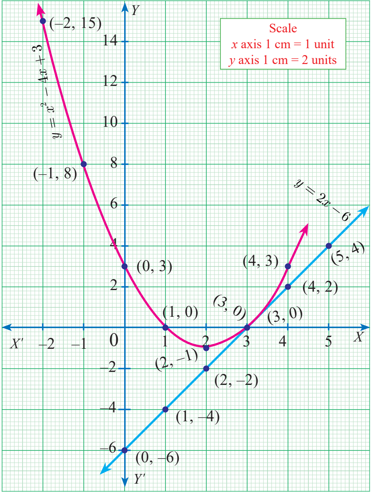

### Exercise 3.16

1. Graph the following quadratic equations and state their nature of solutions.

   (i) $x^2-9x+20=0$ (ii) $x^2-4x+4=0$ (iii) $x^2+x+7=0$

   (iv) $x^2-9=0$ (v) $x^2-6x+9=0$ (vi) $(2x-3)(x+2)=0$.

2. Draw the graph of $y=x^2-4$ and hence solve $x^2-x-12=0$.
3. Draw the graph of $y=x^2+x$ and hence solve $x^2+1=0$.
4. Draw the graph of $y=x^2+3x+2$ and use it to solve $x^2+2x+1=0$.
5. Draw the graph of $y=x^2+3x-4$ and hence use it to solve $x^2+3x-4=0$.
6. Draw the graph of $y=x^2-5x-6$ and hence solve $x^2-5x-14=0$.
7. Draw the graph of $y=2x^2-3x-5$ and hence solve $2x^2-4x-6=0$.
8. Draw the graph of $y=(x-1)(x+3)$ and hence solve $x^2-x-6=0$.

## 3.9 Matrices

##### Introduction

Let us consider the following information. Vanitha has 12 story books, 20 notebooks and 4 pencils. Radha has 27 story books, 17 notebooks and 6 pencils. Gokul has 7 story books, 11 notebooks and 4 pencils. Geetha has 10 story books, 12 notebooks and 5 pencils.

| Details | Story Books | Note Books | Pencils |
|---|---|---|---|
| Vanitha | 12 | 20 | 4 |
| Radha | 27 | 17 | 6 |
| Gokul | 7 | 11 | 4 |
| Geetha | 10 | 12 | 5 |

Now, we arrange this information in the tabular form as follows.

$$
\begin{array}{c}\text{First row}\\\text{Second row}\\\text{Third row}\\\text{Fourth row}\end{array}\quad\begin{pmatrix}12&20&4\\27&17&6\\7&11&4\\10&12&5\end{pmatrix}
$$

The three columns are labelled First Column, Second Column and Third Column respectively.

Here, the items possessed by four people are aligned or positioned in a rectangular array containing four horizontal and three vertical arrangements. The horizontal arrangements are called **“rows”** and the vertical arrangements are called **“columns”**. The whole rectangular arrangement is called a **“Matrix”**. Generally, if we arrange things in a rectangular array, we call it as “Matrix”.

Applications of matrices are found in several scientific fields. In Physics, matrices are applied in the calculations of battery power outputs, resistor conversion of electrical energy into other forms of energy. In computer based applications, matrices play a vital role in the projection of three dimensional image into a two dimensional screen, creating a realistic seeming motions. In graphic software, Matrix Algebra is used to process linear transformations to render images. One of the most important usage of matrices are encryption of message codes. The encryption and decryption processes are carried out using matrix multiplication and inverse operations. The concept of matrices is used in transmission of codes when the messages are lengthy. In Geology, matrices are used for taking seismic surveys. In Robotics, matrices are used to identify the robot movements.

> **Definition**
>
> A matrix is a rectangular array of elements. The horizontal arrangements are called **rows** and vertical arrangements are called **columns**.

For example, $\begin{pmatrix}4&8&0\\1&9&-2\end{pmatrix}$ is a matrix.

Usually capital letters such as $A,B,C,X,Y,\ldots$ etc., are used to represent the matrices and small letters such as $a,b,c,l,m,n,a_{12},a_{13},\ldots$ to indicate the entries or elements of the matrices.

The following are some examples of matrices

(i) $\begin{pmatrix}8&4&-1\\\frac12&5&4\\9&0&1\end{pmatrix}$ (ii) $\begin{pmatrix}1+x&x^3&\sin x\\\cos x&2&\tan x\end{pmatrix}$ (iii) $\begin{pmatrix}3+1&\sqrt2&-1\\1.5&8&9\\\frac13&13&-\frac79\end{pmatrix}$.

### 3.9.1 Order of a Matrix

If a matrix $A$ has $m$ number of rows and $n$ number of columns, then the order of the matrix $A$ is (Number of rows) × (Number of columns) that is, $m\times n$. We read $m\times n$ as $m$ cross $n$ or $m$ by $n$. It may be noted that $m\times n$ is not a product of $m$ and $n$.

General form of a matrix $A$ with $m$ rows and $n$ columns (order $m\times n$) can be written in the form

$$
A=\begin{pmatrix}a_{11}&a_{12}&\ldots&a_{1j}&\ldots&a_{1n}\\a_{21}&a_{22}&\ldots&a_{2j}&\ldots&a_{2n}\\\vdots&\vdots&\vdots&\vdots&\vdots&\vdots\\a_{m1}&a_{m2}&\ldots&a_{mj}&\ldots&a_{mn}\end{pmatrix}
$$

where, $a_{11},a_{12},\ldots$ denote entries of the matrix. $a_{11}$ is the element in first row, first column, $a_{12}$ is the element in the first row, second column, and so on.

> **Progress Check**
>
> 1. Find is the element in the second row and third column of the matrix $\begin{pmatrix}1&-2&3\\2&1&5\end{pmatrix}$.
> 2. Find is the order of the matrix $\begin{pmatrix}\sin\theta\\\cos\theta\\\tan\theta\end{pmatrix}$.
> 3. Determine the entries denoted by $a_{11},a_{22},a_{33},a_{44}$ from the matrix $\begin{pmatrix}2&1&3&4\\5&9&-4&\sqrt7\\3&\frac52&8&9\\7&0&1&4\end{pmatrix}$.

In general, $a_{ij}$ is the element in the $i$th row and $j$th column and is referred as $(i,j)$th element.

With this notation, we can express the matrix $A$ as $A=(a_{ij})_{m\times n}$ where $i=1,2,\ldots,m$ and $j=1,2,\ldots,n$.

The total number of entries in the matrix $A=(a_{ij})_{m\times n}$ is $mn$.

> **Note**
>
> When giving the order of a matrix, you should always mention the number of rows first, followed by the number of columns.

For example,

| S.No. | Matrices | Elements of the matrix | Order of the matrix |
|---|---|---|---|
| 1. | $\begin{pmatrix}\sin\theta&-\cos\theta\\\cos\theta&\sin\theta\end{pmatrix}$ | $a_{11}=\sin\theta$, $a_{12}=-\cos\theta$, $a_{21}=\cos\theta$, $a_{22}=\sin\theta$ | $2\times2$ |
| 2. | $\begin{pmatrix}1&3\\\sqrt2&5\\\frac12&-4\end{pmatrix}$ | $a_{11}=1$, $a_{12}=3$, $a_{21}=\sqrt2$, $a_{22}=5$, $a_{31}=\frac12$, $a_{32}=-4$ | $3\times2$ |

> **Activity 4**
>
> (i) Take calendar sheets of a particular month in a particular year.
>
> (ii) Construct matrices from the dates of the calendar sheet.
>
> (iii) Write down the number of possible matrices of orders $2\times2$, $3\times2$, $2\times3$, $3\times3$, $4\times3$, etc.
>
> (iv) Find the maximum possible order of a matrix that you can create from the given calendar sheet.
>
> (v) Mention the use of matrices to organize information from daily life situations.
>
> 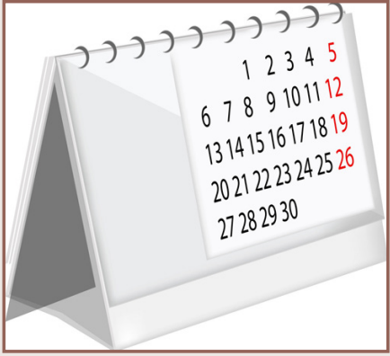

### 3.9.2 Types of Matrices

In this section, we shall define certain types of matrices.

##### 1. Row Matrix

A matrix is said to be a **row matrix** if it has only one row and any number of columns. A row matrix is also called as a **row vector**.

For example, $A=\begin{pmatrix}8&9&4&3\end{pmatrix}$, $B=\begin{pmatrix}-\dfrac{\sqrt3}2&1&\sqrt3\end{pmatrix}$ are row matrices of order $1\times4$ and $1\times3$ respectively.

In general $A=\begin{pmatrix}a_{11}&a_{12}&a_{13}&\ldots&a_{1n}\end{pmatrix}$ is a row matrix of order $1\times n$.

##### 2. Column Matrix

A matrix is said to be a **column matrix** if it has only one column and any number of rows. It is also called as a **column vector**.

For example, $A=\begin{pmatrix}\sin x\\\cos x\\1\end{pmatrix}$, $B=\begin{pmatrix}\sqrt5\\7\end{pmatrix}$ and $C=\begin{pmatrix}8\\-3\\23\\17\end{pmatrix}$ are column matrices of order $3\times1$, $2\times1$ and $4\times1$ respectively.

In general, $A=\begin{pmatrix}a_{11}\\a_{21}\\a_{31}\\\vdots\\a_{m1}\end{pmatrix}$ is a column matrix of order $m\times1$.

##### 3. Square Matrix

A matrix in which the **number of rows** is **equal** to the **number of columns** is called a **square matrix**. Thus a matrix $A=(a_{ij})_{m\times n}$ will be a square matrix if $m=n$.

For example, $\begin{pmatrix}1&3\\4&5\end{pmatrix}_{2\times2}$, $\begin{pmatrix}-1&0&2\\3&6&8\\2&3&5\end{pmatrix}_{3\times3}$ are square matrices.

In general, $\begin{pmatrix}a_{11}&a_{12}\\a_{21}&a_{22}\end{pmatrix}_{2\times2}$, $\begin{pmatrix}b_{11}&b_{12}&b_{13}\\b_{21}&b_{22}&b_{23}\\b_{31}&b_{32}&b_{33}\end{pmatrix}$ are square matrices of orders $2\times2$ and $3\times3$ respectively.

$A=(a_{ij})_{m\times m}$ is a square matrix of order $m$.

> **Definition:** In a square matrix, the elements of the form $a_{11},a_{22},a_{33},\ldots$ (i.e) $a_{ii}$ are called leading **diagonal elements**. For example in the matrix $\begin{pmatrix}1&3\\4&5\end{pmatrix}$, 1 and 5 are leading diagonal elements.

##### 4. Diagonal Matrix

A square matrix, all of whose elements, except those in the leading diagonal are zero is called a **diagonal matrix**.

(ie) A square matrix $A=(a_{ij})$ is said to be diagonal matrix if $a_{ij}=0$ for $i\ne j$. Note that some elements of the leading diagonal may be zero but not all.

For example, $\begin{pmatrix}8&0&0\\0&-3&0\\0&0&11\end{pmatrix}$, $\begin{pmatrix}1&0&0\\0&1&0\\0&0&0\end{pmatrix}$ are diagonal matrices.

##### 5. Scalar Matrix

A diagonal matrix in which all the leading diagonal elements are equal is called a **scalar matrix**.

For example,
$$
\begin{pmatrix}4&0\\0&4\end{pmatrix},\quad\begin{pmatrix}k&0&0\\0&k&0\\0&0&k\end{pmatrix},\quad\begin{pmatrix}5&0&0\\0&5&0\\0&0&5\end{pmatrix}.
$$
In general, $A=(a_{ij})_{m\times m}$ is said to be a scalar matrix if
$$
a_{ij}=\begin{cases}0&\text{when }i\ne j\\k&\text{when }i=j\end{cases}
$$
where $k$ is constant.

##### 6. Identity (or) Unit Matrix

A square matrix in which elements in the leading diagonal are all “1” and rest are all zero is called an **identity matrix** or **unit matrix**.

Thus, the square matrix $A=(a_{ij})$ is an identity matrix if
$$
a_{ij}=\begin{cases}1&\text{if }i=j\\0&\text{if }i\ne j.\end{cases}
$$
A unit matrix of order $n$ is written as $I_n$.
$$
I_2=\begin{pmatrix}1&0\\0&1\end{pmatrix},\quad I_3=\begin{pmatrix}1&0&0\\0&1&0\\0&0&1\end{pmatrix}
$$
are identity matrices of order 2 and 3 respectively.

##### 7. Zero matrix (or) null matrix

A matrix is said to be a **zero matrix** or **null matrix** if all its elements are zero.

For example, $(0)$, $\begin{pmatrix}0&0\\0&0\end{pmatrix}$, $\begin{pmatrix}0&0&0\\0&0&0\\0&0&0\end{pmatrix}$ are all zero matrices of order $1\times1$, $2\times2$ and $3\times3$ but of different orders. We denote zero matrix of order $n\times n$ by $O_n$.

$\begin{pmatrix}0&0&0\\0&0&0\end{pmatrix}$ is a zero matrix of the order $2\times3$.

##### 8. Transpose of a matrix

The matrix which is obtained by interchanging the elements in rows and columns of the given matrix $A$ is called **transpose of $A$** and is denoted by $A^T$.

For example,

(a) If $A=\begin{pmatrix}5&3&-1\\2&8&9\\-4&7&5\end{pmatrix}_{3\times3}$ then $A^T=\begin{pmatrix}5&2&-4\\3&8&7\\-1&9&5\end{pmatrix}_{3\times3}$.

(b) If $B=\begin{pmatrix}1&5\\8&9\\4&3\end{pmatrix}_{3\times2}$ then $B^T=\begin{pmatrix}1&8&4\\5&9&3\end{pmatrix}_{2\times3}$.

If order of $A$ is $m\times n$ then order of $A^T$ is $n\times m$.

We note that $(A^T)^T=A$.

##### 9. Triangular Matrix

A square matrix in which all the entries above the leading diagonal are zero is called a **lower triangular matrix**.

If all the entries below the leading diagonal are zero, then it is called an **upper triangular matrix**.

> **Definition:** A square matrix $A=(a_{ij})_{n\times n}$ is called upper triangular matrix if $a_{ij}=0$ for $i>j$ and is called lower triangular matrix if $a_{ij}=0$, $i<j$.

For example, $A=\begin{pmatrix}1&7&-3\\0&2&4\\0&0&7\end{pmatrix}$ is an upper triangular matrix and $B=\begin{pmatrix}8&0&0\\4&5&0\\-11&3&1\end{pmatrix}$ is a lower triangular matrix.

##### Equal Matrices

Two matrices $A$ and $B$ are said to be equal if and only if they have the same order and each element of matrix $A$ is equal to the corresponding element of matrix $B$. That is, $a_{ij}=b_{ij}$ for all $i,j$.

For example, if $A=\begin{pmatrix}5&1\\0&3\end{pmatrix}$,
$$
B=\begin{pmatrix}1^2+2^2&\sin^2\theta+\cos^2\theta\\1+\frac32-\frac52&2+\sec^2\theta-\tan^2\theta\end{pmatrix}
$$
then we note that $A$ and $B$ have same order and $a_{ij}=b_{ij}$ for every $i,j$. Hence, $A$ and $B$ are equal matrices.

> **Progress Check**
>
> 1. The number of column(s) in a column matrix are _______.
> 2. The number of row(s) in a row matrix are _______.
> 3. The non-diagonal elements in any unit matrix are _______.
> 4. Does there exist a square matrix with 32 elements?

##### The negative of a matrix

The negative of a matrix $A_{m\times n}$ denoted by $-A_{m\times n}$ is the matrix formed by replacing each element in the matrix $A_{m\times n}$ with its additive inverse.

Additive inverse of an element $k$ is $-k$. That is, every element of $-A$ is the negative of the corresponding element of $A$.

For example, if $A=\begin{pmatrix}2&-4&9\\5&-3&-1\end{pmatrix}_{2\times3}$ then $-A=\begin{pmatrix}-2&4&-9\\-5&3&1\end{pmatrix}_{2\times3}$.

#### Example 3.56

Consider the following information regarding the number of men and women workers in three factories I, II and III.

| Factory | Men | Women |
|---|---|---|
| I | 23 | 18 |
| II | 47 | 36 |
| III | 15 | 16 |

Represent the above information in the form of a matrix. What does the entry in the second row and first column represent?

**Solution** The information is represented in the form of a $3\times2$ matrix as follows
$$
A=\begin{pmatrix}23&18\\47&36\\15&16\end{pmatrix}.
$$
The entry in the second row and first column represent that there are 47 men workers in factory II.

#### Example 3.57

If a matrix has 16 elements, what are the possible orders it can have?

**Solution** We know that a matrix of order $m\times n$, has $mn$ elements. Thus to find all possible orders of a matrix with 16 elements, we will find all ordered pairs of natural numbers whose product is 16.

Such ordered pairs are $(1,16)$, $(16,1)$, $(4,4)$, $(8,2)$, $(2,8)$.

Hence, possible orders are $1\times16$, $16\times1$, $4\times4$, $2\times8$, $8\times2$.

##### Activity 5

| No. | Elements | Possible orders | Number of possible orders |
|---|---|---|---|
| 1. | 4 | | 3 |
| 2. | | $1\times9$, $9\times1$, $3\times3$ | |
| 3. | 20 | | |
| 4. | 8 | | 4 |
| 5. | 1 | | |
| 6. | 100 | | |
| 7. | | $1\times10$, $10\times1$, $2\times5$, $5\times2$ | |

Do you find any relationship between number of elements (second column) and number of possible orders (fourth column)? If so, what is it?

#### Example 3.58

Construct a $3\times3$ matrix whose elements are $a_{ij}=i^2j^2$.

**Solution** The general $3\times3$ matrix is given by
$$
A=\begin{pmatrix}a_{11}&a_{12}&a_{13}\\a_{21}&a_{22}&a_{23}\\a_{31}&a_{32}&a_{33}\end{pmatrix},\qquad a_{ij}=i^2j^2.
$$
$$
\begin{aligned}
a_{11}&=1^2\times1^2=1\times1=1;&a_{12}&=1^2\times2^2=1\times4=4;&a_{13}&=1^2\times3^2=1\times9=9;\\
a_{21}&=2^2\times1^2=4\times1=4;&a_{22}&=2^2\times2^2=4\times4=16;&a_{23}&=2^2\times3^2=4\times9=36;\\
a_{31}&=3^2\times1^2=9\times1=9;&a_{32}&=3^2\times2^2=9\times4=36;&a_{33}&=3^2\times3^2=9\times9=81.
\end{aligned}
$$
Hence, the required matrix is $A=\begin{pmatrix}1&4&9\\4&16&36\\9&36&81\end{pmatrix}$.

#### Example 3.59

Find the value of $a,b,c,d$ from the equation $\begin{pmatrix}a-b&2a+c\\2a-b&3c+d\end{pmatrix}=\begin{pmatrix}1&5\\0&2\end{pmatrix}$.

**Solution** The given matrices are equal. Thus all corresponding elements are equal.
Therefore,
$$
\begin{aligned}a-b&=1&&\ldots(1)\\2a+c&=5&&\ldots(2)\\2a-b&=0&&\ldots(3)\\3c+d&=2&&\ldots(4)\end{aligned}
$$
$(3)\Rightarrow 2a-b=0$, $2a=b\quad\ldots(5)$.

Put $2a=b$ in equation (1), $a-2a=1\Rightarrow a=-1$.

Put $a=-1$ in equation (5), $2(-1)=b\Rightarrow b=-2$.

Put $a=-1$ in equation (2), $2(-1)+c=5\Rightarrow c=7$.

Put $c=7$ in equation (4), $3(7)+d=2\Rightarrow d=-19$.

Therefore, $a=-1,b=-2,c=7,d=-19$.

### Exercise 3.17

1. In the matrix $A=\begin{pmatrix}8&9&4&3\\-1&\sqrt7&\frac{\sqrt3}{2}&5\\1&4&3&0\\6&8&-11&1\end{pmatrix}$, write (i) The number of elements (ii) The order of the matrix (iii) Write the elements $a_{22},a_{23},a_{24},a_{34},a_{43},a_{44}$.
2. If a matrix has 18 elements, what are the possible orders it can have? What if it has 6 elements?
3. Construct a $3\times3$ matrix whose elements are given by (i) $a_{ij}=|i-2j|$ (ii) $a_{ij}=\frac{(i+j)^3}{3}$.
4. If $A=\begin{pmatrix}5&4&3\\1&-7&9\\3&8&2\end{pmatrix}$ then find the transpose of $A$.
5. If $A=\begin{pmatrix}\sqrt7&-3\\-\sqrt5&2\\\sqrt3&-5\end{pmatrix}$ then find the transpose of $-A$.
6. If $A=\begin{pmatrix}5&2&2\\-\sqrt{17}&0.7&\frac52\\8&3&1\end{pmatrix}$ then verify $(A^T)^T=A$.
7. Find the values of $x,y$ and $z$ from the following equations: (i) $\begin{pmatrix}12&3\\x&5\end{pmatrix}=\begin{pmatrix}y&z\\3&5\end{pmatrix}$ (ii) $\begin{pmatrix}x+y&2\\5+z&xy\end{pmatrix}=\begin{pmatrix}6&2\\5&8\end{pmatrix}$ (iii) $\begin{pmatrix}x+y+z\\x+z\\y+z\end{pmatrix}=\begin{pmatrix}9\\5\\7\end{pmatrix}$.

### 3.9.3 Operations on Matrices

In this section, we shall discuss the addition and subtraction of matrices, multiplication of a matrix by a scalar and multiplication of matrices.

##### Addition and subtraction of matrices

Two matrices can be added or subtracted if they have the same order. To add or subtract two matrices, simply add or subtract the corresponding elements.

For example,
$$
\begin{pmatrix}a&b&c\\d&e&f\end{pmatrix}+\begin{pmatrix}g&h&i\\j&k&l\end{pmatrix}=\begin{pmatrix}a+g&b+h&c+i\\d+j&e+k&f+l\end{pmatrix}
$$
$$
\begin{pmatrix}a&b\\c&d\end{pmatrix}-\begin{pmatrix}e&f\\g&h\end{pmatrix}=\begin{pmatrix}a-e&b-f\\c-g&d-h\end{pmatrix}.
$$
If $A=(a_{ij})$, $B=(b_{ij})$, $i=1,2,\ldots,m$, $j=1,2,\ldots,n$ then $C=A+B$ is such that $C=(c_{ij})$ where $c_{ij}=a_{ij}+b_{ij}$ for all $i=1,2,\ldots,m$ and $j=1,2,\ldots,n$.

#### Example 3.60

If $A=\begin{pmatrix}1&2&3\\4&5&6\\7&8&9\end{pmatrix}$, $B=\begin{pmatrix}1&7&0\\1&3&1\\2&4&0\end{pmatrix}$, find $A+B$.

**Solution**
$$
A+B=\begin{pmatrix}1&2&3\\4&5&6\\7&8&9\end{pmatrix}+\begin{pmatrix}1&7&0\\1&3&1\\2&4&0\end{pmatrix}=\begin{pmatrix}1+1&2+7&3+0\\4+1&5+3&6+1\\7+2&8+4&9+0\end{pmatrix}=\begin{pmatrix}2&9&3\\5&8&7\\9&12&9\end{pmatrix}.
$$

#### Example 3.61

Two examinations were conducted for three groups of students namely group 1, group 2, group 3 and their data on average of marks for the subjects Tamil, English, Science and Mathematics are given below in the form of matrices $A$ and $B$. Find the total marks of both the examinations for all the three groups.

The columns are Tamil, English, Science and Mathematics respectively; the rows are Group 1, Group 2 and Group 3.
$$
A=\begin{pmatrix}22&15&14&23\\50&62&21&30\\53&80&32&40\end{pmatrix},\qquad B=\begin{pmatrix}20&38&15&40\\18&12&17&80\\81&47&52&18\end{pmatrix}.
$$
**Solution** The total marks in both the examinations for all the three groups is the sum of the given matrices.
$$
A+B=\begin{pmatrix}22+20&15+38&14+15&23+40\\50+18&62+12&21+17&30+80\\53+81&80+47&32+52&40+18\end{pmatrix}=\begin{pmatrix}42&53&29&63\\68&74&38&110\\134&127&84&58\end{pmatrix}.
$$

#### Example 3.62

If $A=\begin{pmatrix}1&3&-2\\5&-4&6\\-3&2&9\end{pmatrix}$, $B=\begin{pmatrix}1&8\\3&4\\9&6\end{pmatrix}$, find $A+B$.

**Solution** It is not possible to add $A$ and $B$ because they have different orders.

##### Multiplication of Matrix by a Scalar

We can multiply the elements of the given matrix $A$ by a non-zero number $k$ to obtain a new matrix $kA$ whose elements are multiplied by $k$. The matrix $kA$ is called scalar multiplication of $A$.

Thus if $A=(a_{ij})_{m\times n}$ then, $kA=(ka_{ij})_{m\times n}$ for all $i=1,2,\ldots,m$ and $\forall j=1,2,\ldots,n$.

#### Example 3.63

If $A=\begin{pmatrix}7&8&6\\1&3&9\\-4&3&-1\end{pmatrix}$, $B=\begin{pmatrix}4&11&-3\\-1&2&4\\7&5&0\end{pmatrix}$ then Find $2A+B$.

**Solution** Since $A$ and $B$ have same order $3\times3$, $2A+B$ is defined.

We have
$$
\begin{aligned}2A+B&=2\begin{pmatrix}7&8&6\\1&3&9\\-4&3&-1\end{pmatrix}+\begin{pmatrix}4&11&-3\\-1&2&4\\7&5&0\end{pmatrix}\\&=\begin{pmatrix}14&16&12\\2&6&18\\-8&6&-2\end{pmatrix}+\begin{pmatrix}4&11&-3\\-1&2&4\\7&5&0\end{pmatrix}\\&=\begin{pmatrix}18&27&9\\1&8&22\\-1&11&-2\end{pmatrix}.\end{aligned}
$$

#### Example 3.64

If $A=\begin{pmatrix}5&4&-2\\\frac12&\frac34&\sqrt2\\1&9&4\end{pmatrix}$, $B=\begin{pmatrix}-7&4&-3\\\frac14&\frac72&3\\5&-6&9\end{pmatrix}$, find $4A-3B$.

**Solution** Since $A,B$ are of the same order $3\times3$, subtraction of $4A$ and $3B$ is defined.
$$
\begin{aligned}4A-3B&=4\begin{pmatrix}5&4&-2\\\frac12&\frac34&\sqrt2\\1&9&4\end{pmatrix}-3\begin{pmatrix}-7&4&-3\\\frac14&\frac72&3\\5&-6&9\end{pmatrix}\\&=\begin{pmatrix}20&16&-8\\2&3&4\sqrt2\\4&36&16\end{pmatrix}+\begin{pmatrix}21&-12&9\\-\frac34&-\frac{21}{2}&-9\\-15&18&-27\end{pmatrix}\\&=\begin{pmatrix}41&4&1\\\frac54&-\frac{15}{2}&4\sqrt2-9\\-11&54&-11\end{pmatrix}.\end{aligned}
$$

##### Properties of Matrix Addition and Scalar Multiplication

Let $A,B,C$ be $m\times n$ matrices and $p$ and $q$ be two non-zero scalars (numbers). Then we have the following properties.

| | Property | Description |
|---|---|---|
| (i) | $A+B=B+A$ | Commutative property of matrix addition |
| (ii) | $A+(B+C)=(A+B)+C$ | Associative property of matrix addition |
| (iii) | $(pq)A=p(qA)$ | Associative property of scalar multiplication |
| (iv) | $IA=A$ | Scalar Identity property where $I$ is the unit matrix |
| (v) | $p(A+B)=pA+pB$ | Distributive property of scalar and two matrices |
| (vi) | $(p+q)A=pA+qA$ | Distributive property of two scalars with a matrix |

##### Additive Identity

The null matrix or zero matrix is the **identity** for matrix addition.

Let $A$ be any matrix.

Then, $A+O=O+A=A$ where $O$ is the null matrix or zero matrix of same order as that of $A$.

##### Additive Inverse

If $A$ be any given matrix then $-A$ is the **additive inverse** of $A$.

In fact we have $A+(-A)=(-A)+A=O$.

#### Example 3.65

Find the value of $a,b,c,d$ from the following matrix equation.
$$
\begin{pmatrix}d&8\\3b&a\end{pmatrix}+\begin{pmatrix}3&a\\-2&-4\end{pmatrix}=\begin{pmatrix}2&2a\\b&4c\end{pmatrix}+\begin{pmatrix}0&1\\-5&0\end{pmatrix}.
$$
**Solution**

First, we add the two matrices on both left, right hand sides to get
$$
\begin{pmatrix}d+3&8+a\\3b-2&a-4\end{pmatrix}=\begin{pmatrix}2&2a+1\\b-5&4c\end{pmatrix}.
$$
Equating the corresponding elements of the two matrices, we have
$$
\begin{aligned}d+3=2&\Rightarrow d=-1\\8+a=2a+1&\Rightarrow a=7\\3b-2=b-5&\Rightarrow b=-\frac32.\end{aligned}
$$
Substituting $a=7$ in $a-4=4c\Rightarrow c=\frac34$.

Therefore, $a=7,b=-\frac32,c=\frac34,d=-1$.

#### Example 3.66

If $A=\begin{pmatrix}1&8&3\\3&5&0\\8&7&6\end{pmatrix}$, $B=\begin{pmatrix}8&-6&-4\\2&11&-3\\0&1&5\end{pmatrix}$, $C=\begin{pmatrix}5&3&0\\-1&-7&2\\1&4&3\end{pmatrix}$ compute the following: (i) $3A+2B-C$ (ii) $\frac12A-\frac32B$.

**Solution**

(i)
$$
\begin{aligned}3A+2B-C&=3\begin{pmatrix}1&8&3\\3&5&0\\8&7&6\end{pmatrix}+2\begin{pmatrix}8&-6&-4\\2&11&-3\\0&1&5\end{pmatrix}-\begin{pmatrix}5&3&0\\-1&-7&2\\1&4&3\end{pmatrix}\\&=\begin{pmatrix}3&24&9\\9&15&0\\24&21&18\end{pmatrix}+\begin{pmatrix}16&-12&-8\\4&22&-6\\0&2&10\end{pmatrix}+\begin{pmatrix}-5&-3&0\\1&7&-2\\-1&-4&-3\end{pmatrix}\\&=\begin{pmatrix}14&9&1\\14&44&-8\\23&19&25\end{pmatrix}.\end{aligned}
$$
(ii)
$$
\begin{aligned}\frac12A-\frac32B&=\frac12(A-3B)\\&=\frac12\left(\begin{pmatrix}1&8&3\\3&5&0\\8&7&6\end{pmatrix}-3\begin{pmatrix}8&-6&-4\\2&11&-3\\0&1&5\end{pmatrix}\right)\\&=\frac12\left(\begin{pmatrix}1&8&3\\3&5&0\\8&7&6\end{pmatrix}+\begin{pmatrix}-24&18&12\\-6&-33&9\\0&-3&-15\end{pmatrix}\right)\\&=\frac12\begin{pmatrix}-23&26&15\\-3&-28&9\\8&4&-9\end{pmatrix}\\&=\begin{pmatrix}-\frac{23}{2}&13&\frac{15}{2}\\-\frac32&-14&\frac92\\4&2&-\frac92\end{pmatrix}.\end{aligned}
$$

### Exercise 3.18

1. If $A=\begin{pmatrix}1&9\\3&4\\8&-3\end{pmatrix}$, $B=\begin{pmatrix}5&7\\3&3\\1&0\end{pmatrix}$ then verify that (i) $A+B=B+A$ (ii) $A+(-A)=(-A)+A=O$.
2. If $A=\begin{pmatrix}4&3&1\\2&3&-8\\1&0&-4\end{pmatrix}$, $B=\begin{pmatrix}2&3&4\\1&9&2\\-7&1&-1\end{pmatrix}$ and $C=\begin{pmatrix}8&3&4\\1&-2&3\\2&4&-1\end{pmatrix}$ then verify that $A+(B+C)=(A+B)+C$.
3. Find $X$ and $Y$ if $X+Y=\begin{pmatrix}7&0\\3&5\end{pmatrix}$ and $X-Y=\begin{pmatrix}3&0\\0&4\end{pmatrix}$.
4. If $A=\begin{pmatrix}0&4&9\\8&3&7\end{pmatrix}$, $B=\begin{pmatrix}7&3&8\\1&4&9\end{pmatrix}$ find the value of (i) $B-5A$ (ii) $3A-9B$.
5. Find the values of $x,y,z$ if (i) $\begin{pmatrix}x-3&3x-z\\x+y+7&x+y+z\end{pmatrix}=\begin{pmatrix}1&0\\1&6\end{pmatrix}$ (ii) $\begin{pmatrix}x&y-z&z+3\end{pmatrix}+\begin{pmatrix}y&4&3\end{pmatrix}=\begin{pmatrix}4&8&16\end{pmatrix}$.
6. Find $x$ and $y$ if $x\begin{pmatrix}4\\-3\end{pmatrix}+y\begin{pmatrix}-2\\3\end{pmatrix}=\begin{pmatrix}4\\6\end{pmatrix}$.
7. Find the non-zero values of $x$ satisfying the matrix equation $x\begin{pmatrix}2x&2\\3&x\end{pmatrix}+2\begin{pmatrix}8&5x\\4&4x\end{pmatrix}=2\begin{pmatrix}x^2+8&24\\10&6x\end{pmatrix}$.
8. Solve for $x,y$: $\begin{pmatrix}x^2\\y^2\end{pmatrix}+2\begin{pmatrix}-2x\\-y\end{pmatrix}=\begin{pmatrix}5\\8\end{pmatrix}$.

##### Multiplication of Matrices

To multiply two matrices, the number of columns in the first matrix must be equal to the number of rows in the second matrix. Consider the multiplications of $3\times3$ and $3\times2$ matrices.

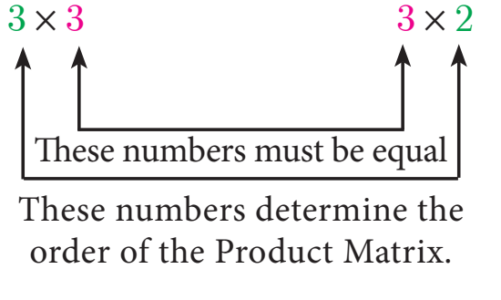

(Order of left hand matrix) $\times$ (order of right hand matrix) $\to$ (order of product matrix).
$$
(3\times3)\qquad(3\times2)\qquad\to\qquad(3\times2).
$$
Matrices are multiplied by multiplying the elements in a row of the first matrix by the elements in a column of the second matrix, and adding the results.

For example, product of matrices
$$
\begin{pmatrix}a&b\\c&d\\e&f\end{pmatrix}\times\begin{pmatrix}g&h&i\\k&l&m\end{pmatrix}=\begin{pmatrix}ag+bk&ah+bl&ai+bm\\cg+dk&ch+dl&ci+dm\\eg+fk&eh+fl&ei+fm\end{pmatrix}.
$$
The product $AB$ can be found if the number of columns of matrix $A$ is equal to the number of rows of matrix $B$. If the order of matrix $A$ is $m\times n$ and $B$ is $n\times p$ then the order of $AB$ is $m\times p$.

##### Properties of Multiplication of Matrix

(a) **Matrix multiplication is not commutative in general**

If $A$ is of order $m\times n$ and $B$ of the order $n\times p$ then $AB$ is defined but $BA$ is not defined. Even if $AB$ and $BA$ are both defined, it is not necessary that they are equal. In general $AB\ne BA$.

(b) **Matrix multiplication is distributive over matrix addition**

(i) If $A,B,C$ are $m\times n$, $n\times p$ and $n\times p$ matrices respectively then $A(B+C)=AB+AC$ (Right Distributive Property).

(ii) If $A,B,C$ are $m\times n$, $m\times n$ and $n\times p$ matrices respectively then $(A+B)C=AC+BC$ (Left Distributive Property).

(c) **Matrix multiplication is always associative**

If $A,B,C$ are $m\times n$, $n\times p$ and $p\times q$ matrices respectively then $(AB)C=A(BC)$.

(d) **Multiplication of a matrix by a unit matrix**

If $A$ is a square matrix of order $n\times n$ and $I$ is the unit matrix of same order then $AI=IA=A$.

> **Note**
>
> - If $x$ and $y$ are two real numbers such that $xy=0$ then either $x=0$ or $y=0$. But this condition may not be true with respect to two matrices.
> - $AB=0$ does not necessarily imply that $A=0$ or $B=0$ or both $A,B=0$.

##### Illustration

$$
A=\begin{pmatrix}1&-1\\-1&1\end{pmatrix}\ne0\quad\text{and}\quad B=\begin{pmatrix}1&1\\1&1\end{pmatrix}\ne0.
$$
But
$$
AB=\begin{pmatrix}1&-1\\-1&1\end{pmatrix}\times\begin{pmatrix}1&1\\1&1\end{pmatrix}=\begin{pmatrix}1-1&1-1\\-1+1&-1+1\end{pmatrix}=\begin{pmatrix}0&0\\0&0\end{pmatrix}=0.
$$
Thus $A\ne0,B\ne0$ but $AB=0$.

#### Example 3.67

If $A=\begin{pmatrix}1&2&0\\3&1&5\end{pmatrix}$, $B=\begin{pmatrix}8&3&1\\2&4&1\\5&3&1\end{pmatrix}$, find $AB$.

**Solution** We observe that $A$ is a $2\times3$ matrix and $B$ is a $3\times3$ matrix, hence $AB$ is defined and it will be of the order $2\times3$.

Given $A=\begin{pmatrix}1&2&0\\3&1&5\end{pmatrix}_{2\times3}$, $B=\begin{pmatrix}8&3&1\\2&4&1\\5&3&1\end{pmatrix}_{3\times3}$.
$$
\begin{aligned}AB&=\begin{pmatrix}1&2&0\\3&1&5\end{pmatrix}\times\begin{pmatrix}8&3&1\\2&4&1\\5&3&1\end{pmatrix}\\&=\begin{pmatrix}8+4+0&3+8+0&1+2+0\\24+2+25&9+4+15&3+1+5\end{pmatrix}=\begin{pmatrix}12&11&3\\51&28&9\end{pmatrix}.\end{aligned}
$$

#### Example 3.68

If $A=\begin{pmatrix}2&1\\1&3\end{pmatrix}$, $B=\begin{pmatrix}2&0\\1&3\end{pmatrix}$ find $AB$ and $BA$. Verify $AB=BA$?

**Solution** We observe that $A$ is a $2\times2$ matrix and $B$ is a $2\times2$ matrix, hence $AB$ is defined and it will be of the order $2\times2$.
$$
AB=\begin{pmatrix}2&1\\1&3\end{pmatrix}\times\begin{pmatrix}2&0\\1&3\end{pmatrix}=\begin{pmatrix}4+1&0+3\\2+3&0+9\end{pmatrix}=\begin{pmatrix}5&3\\5&9\end{pmatrix}.
$$
$$
BA=\begin{pmatrix}2&0\\1&3\end{pmatrix}\times\begin{pmatrix}2&1\\1&3\end{pmatrix}=\begin{pmatrix}4+0&2+0\\2+3&1+9\end{pmatrix}=\begin{pmatrix}4&2\\5&10\end{pmatrix}.
$$
Therefore, $AB\ne BA$.

#### Example 3.69

If $A=\begin{pmatrix}2&-2\sqrt2\\\sqrt2&2\end{pmatrix}$ and $B=\begin{pmatrix}2&2\sqrt2\\-\sqrt2&2\end{pmatrix}$.

Show that $A$ and $B$ satisfy commutative property with respect to matrix multiplication.

**Solution** We have to show that $AB=BA$.
$$
\begin{aligned}\text{LHS}=AB&=\begin{pmatrix}2&-2\sqrt2\\\sqrt2&2\end{pmatrix}\times\begin{pmatrix}2&2\sqrt2\\-\sqrt2&2\end{pmatrix}\\&=\begin{pmatrix}4+4&4\sqrt2-4\sqrt2\\2\sqrt2-2\sqrt2&4+4\end{pmatrix}=\begin{pmatrix}8&0\\0&8\end{pmatrix}.\end{aligned}
$$
$$
\begin{aligned}\text{RHS}=BA&=\begin{pmatrix}2&2\sqrt2\\-\sqrt2&2\end{pmatrix}\times\begin{pmatrix}2&-2\sqrt2\\\sqrt2&2\end{pmatrix}\\&=\begin{pmatrix}4+4&-4\sqrt2+4\sqrt2\\-2\sqrt2+2\sqrt2&4+4\end{pmatrix}=\begin{pmatrix}8&0\\0&8\end{pmatrix}.\end{aligned}
$$
Hence, LHS = RHS (ie) $AB=BA$.

> **Note**
>
> - If $A$ and $B$ are any two non zero matrices, then $(A+B)^2\ne A^2+2AB+B^2$.
> - However if $AB=BA$ then $(A+B)^2=A^2+2AB+B^2$.

#### Example 3.70

Solve $\begin{pmatrix}2&1\\1&2\end{pmatrix}\begin{pmatrix}x\\y\end{pmatrix}=\begin{pmatrix}4\\5\end{pmatrix}$.

**Solution**
$$
\begin{pmatrix}2&1\\1&2\end{pmatrix}_{2\times2}\times\begin{pmatrix}x\\y\end{pmatrix}_{2\times1}=\begin{pmatrix}4\\5\end{pmatrix}.
$$
By matrix multiplication $\begin{pmatrix}2x+y\\x+2y\end{pmatrix}=\begin{pmatrix}4\\5\end{pmatrix}$.

Rewriting
$$
\begin{aligned}2x+y&=4&&\ldots(1)\\x+2y&=5&&\ldots(2).\end{aligned}
$$
$(1)-2\times(2)\Rightarrow$
$$
\begin{array}{rrr}2x+y&=&4\\2x+4y&=&10\\\hline-3y&=&-6\end{array}\quad\Rightarrow y=2.
$$
Substituting $y=2$ in (1), $2x+2=4\Rightarrow x=1$.

Therefore, $x=1,y=2$.

#### Example 3.71

If $A=\begin{pmatrix}1&-1&2\end{pmatrix}$, $B=\begin{pmatrix}1&-1\\2&1\\1&3\end{pmatrix}$ and $C=\begin{pmatrix}1&2\\2&-1\end{pmatrix}$ show that $(AB)C=A(BC)$.

**Solution** LHS = $(AB)C$.
$$
AB=\begin{pmatrix}1&-1&2\end{pmatrix}_{1\times3}\times\begin{pmatrix}1&-1\\2&1\\1&3\end{pmatrix}_{3\times2}=\begin{pmatrix}1-2+2&-1-1+6\end{pmatrix}=\begin{pmatrix}1&4\end{pmatrix}.
$$
$$
(AB)C=\begin{pmatrix}1&4\end{pmatrix}_{1\times2}\times\begin{pmatrix}1&2\\2&-1\end{pmatrix}_{2\times2}=\begin{pmatrix}1+8&2-4\end{pmatrix}=\begin{pmatrix}9&-2\end{pmatrix}\quad\ldots(1).
$$
RHS = $A(BC)$.
$$
BC=\begin{pmatrix}1&-1\\2&1\\1&3\end{pmatrix}_{3\times2}\times\begin{pmatrix}1&2\\2&-1\end{pmatrix}_{2\times2}=\begin{pmatrix}1-2&2+1\\2+2&4-1\\1+6&2-3\end{pmatrix}=\begin{pmatrix}-1&3\\4&3\\7&-1\end{pmatrix}.
$$
$$
A(BC)=\begin{pmatrix}1&-1&2\end{pmatrix}_{1\times3}\times\begin{pmatrix}-1&3\\4&3\\7&-1\end{pmatrix}_{3\times2}.
$$
$$
A(BC)=\begin{pmatrix}-1-4+14&3-3-2\end{pmatrix}=\begin{pmatrix}9&-2\end{pmatrix}\quad\ldots(2).
$$
From (1) and (2), $(AB)C=A(BC)$.

#### Example 3.72

If $A=\begin{pmatrix}1&1\\-1&3\end{pmatrix}$, $B=\begin{pmatrix}1&2\\-4&2\end{pmatrix}$, $C=\begin{pmatrix}-7&6\\3&2\end{pmatrix}$ verify that $A(B+C)=AB+AC$.

**Solution** LHS = $A(B+C)$.
$$
B+C=\begin{pmatrix}1&2\\-4&2\end{pmatrix}+\begin{pmatrix}-7&6\\3&2\end{pmatrix}=\begin{pmatrix}-6&8\\-1&4\end{pmatrix}.
$$
$$
A(B+C)=\begin{pmatrix}1&1\\-1&3\end{pmatrix}\times\begin{pmatrix}-6&8\\-1&4\end{pmatrix}=\begin{pmatrix}-6-1&8+4\\6-3&-8+12\end{pmatrix}=\begin{pmatrix}-7&12\\3&4\end{pmatrix}\quad\ldots(1).
$$
RHS = $AB+AC$.
$$
AB=\begin{pmatrix}1&1\\-1&3\end{pmatrix}\times\begin{pmatrix}1&2\\-4&2\end{pmatrix}=\begin{pmatrix}1-4&2+2\\-1-12&-2+6\end{pmatrix}=\begin{pmatrix}-3&4\\-13&4\end{pmatrix}.
$$
$$
AC=\begin{pmatrix}1&1\\-1&3\end{pmatrix}\times\begin{pmatrix}-7&6\\3&2\end{pmatrix}=\begin{pmatrix}-7+3&6+2\\7+9&-6+6\end{pmatrix}=\begin{pmatrix}-4&8\\16&0\end{pmatrix}.
$$
Therefore,
$$
AB+AC=\begin{pmatrix}-3&4\\-13&4\end{pmatrix}+\begin{pmatrix}-4&8\\16&0\end{pmatrix}=\begin{pmatrix}-7&12\\3&4\end{pmatrix}\quad\ldots(2).
$$
From (1) and (2), $A(B+C)=AB+AC$. Hence proved.

#### Example 3.73

If $A=\begin{pmatrix}1&2&1\\2&-1&1\end{pmatrix}$ and $B=\begin{pmatrix}2&-1\\-1&4\\0&2\end{pmatrix}$ show that $(AB)^T=B^TA^T$.

**Solution** LHS = $(AB)^T$.
$$
\begin{aligned}AB&=\begin{pmatrix}1&2&1\\2&-1&1\end{pmatrix}_{2\times3}\times\begin{pmatrix}2&-1\\-1&4\\0&2\end{pmatrix}_{3\times2}\\&=\begin{pmatrix}2-2+0&-1+8+2\\4+1+0&-2-4+2\end{pmatrix}=\begin{pmatrix}0&9\\5&-4\end{pmatrix}.\end{aligned}
$$
$$
(AB)^T=\begin{pmatrix}0&9\\5&-4\end{pmatrix}^T=\begin{pmatrix}0&5\\9&-4\end{pmatrix}\quad\ldots(1).
$$
RHS = $(B^TA^T)$.
$$
B^T=\begin{pmatrix}2&-1&0\\-1&4&2\end{pmatrix},\qquad A^T=\begin{pmatrix}1&2\\2&-1\\1&1\end{pmatrix}.
$$
$$
\begin{aligned}B^TA^T&=\begin{pmatrix}2&-1&0\\-1&4&2\end{pmatrix}_{2\times3}\times\begin{pmatrix}1&2\\2&-1\\1&1\end{pmatrix}_{3\times2}\\&=\begin{pmatrix}2-2+0&4+1+0\\-1+8+2&-2-4+2\end{pmatrix}.\end{aligned}
$$
$$
B^TA^T=\begin{pmatrix}0&5\\9&-4\end{pmatrix}\quad\ldots(2).
$$
From (1) and (2), $(AB)^T=B^TA^T$.

Hence proved.

### Exercise 3.19

1. Find the order of the product matrix $AB$ if

   | | (i) | (ii) | (iii) | (iv) | (v) |
   |---|---|---|---|---|---|
   | Orders of $A$ | $3\times3$ | $4\times3$ | $4\times2$ | $4\times5$ | $1\times1$ |
   | Orders of $B$ | $3\times3$ | $3\times2$ | $2\times2$ | $5\times1$ | $1\times3$ |

2. If $A$ is of order $p\times q$ and $B$ is of order $q\times r$ what is the order of $AB$ and $BA$?
3. $A$ has ‘$a$’ rows and ‘$a+3$’ columns. $B$ has ‘$b$’ rows and ‘$17-b$’ columns, and if both products $AB$ and $BA$ exist, find $a,b$?
4. If $A=\begin{pmatrix}2&5\\4&3\end{pmatrix}$, $B=\begin{pmatrix}1&-3\\2&5\end{pmatrix}$ find $AB,BA$ and verify $AB=BA$?
5. Given that $A=\begin{pmatrix}1&3\\5&-1\end{pmatrix}$, $B=\begin{pmatrix}1&-1&2\\3&5&2\end{pmatrix}$, $C=\begin{pmatrix}1&3&2\\-4&1&3\end{pmatrix}$ verify that $A(B+C)=AB+AC$.
6. Show that the matrices $A=\begin{pmatrix}1&2\\3&1\end{pmatrix}$, $B=\begin{pmatrix}1&-2\\-3&1\end{pmatrix}$ satisfy commutative property $AB=BA$.
7. Let $A=\begin{pmatrix}1&2\\1&3\end{pmatrix}$, $B=\begin{pmatrix}4&0\\1&5\end{pmatrix}$, $C=\begin{pmatrix}2&0\\1&2\end{pmatrix}$. Show that (i) $A(BC)=(AB)C$ (ii) $(A-B)C=AC-BC$ (iii) $(A-B)^T=A^T-B^T$.
8. If $A=\begin{pmatrix}\cos\theta&0\\0&\cos\theta\end{pmatrix}$, $B=\begin{pmatrix}\sin\theta&0\\0&\sin\theta\end{pmatrix}$ then show that $A^2+B^2=I$.
9. If $A=\begin{pmatrix}\cos\theta&\sin\theta\\-\sin\theta&\cos\theta\end{pmatrix}$ prove that $AA^T=I$.
10. Verify that $A^2=I$ when $A=\begin{pmatrix}5&-4\\6&-5\end{pmatrix}$.
11. If $A=\begin{pmatrix}a&b\\c&d\end{pmatrix}$ and $I=\begin{pmatrix}1&0\\0&1\end{pmatrix}$ show that $A^2-(a+d)A=(bc-ad)I_2$.
12. If $A=\begin{pmatrix}5&2&9\\1&2&8\end{pmatrix}$, $B=\begin{pmatrix}1&7\\1&2\\5&-1\end{pmatrix}$ verify that $(AB)^T=B^TA^T$.
13. If $A=\begin{pmatrix}3&1\\-1&2\end{pmatrix}$ show that $A^2-5A+7I_2=0$.

### Exercise 3.20

##### Multiple choice questions

1. A system of three linear equations in three variables is inconsistent if their planes

   (A) intersect only at a point (B) intersect in a line (C) coincides with each other (D) do not intersect.

2. The solution of the system $x+y-3z=-6$, $-7y+7z=7$, $3z=9$ is

   (A) $x=1,y=2,z=3$ (B) $x=-1,y=2,z=3$ (C) $x=-1,y=-2,z=3$ (D) $x=1,y=-2,z=3$.

3. If $(x-6)$ is the HCF of $x^2-2x-24$ and $x^2-kx-6$ then the value of $k$ is

   (A) 3 (B) 5 (C) 6 (D) 8.

4. $\frac{3y-3}{y}\div\frac{7y-7}{3y^2}$ is

   (A) $\frac{9y}{7}$ (B) $\frac{9y^3}{21y-21}$ (C) $\frac{21y^2-42y+21}{3y^3}$ (D) $\frac{7(y^2-2y+1)}{y^2}$.

5. $y^2+\frac1{y^2}$ is not equal to

   (A) $\frac{y^4+1}{y^2}$ (B) $\left(y+\frac1y\right)^2$ (C) $\left(y-\frac1y\right)^2+2$ (D) $\left(y+\frac1y\right)^2-2$.

6. $\frac{x}{x^2-25}-\frac8{x^2+6x+5}$ gives

   (A) $\frac{x^2-7x+40}{(x-5)(x+5)}$ (B) $\frac{x^2+7x+40}{(x-5)(x+5)(x+1)}$ (C) $\frac{x^2-7x+40}{(x^2-25)(x+1)}$ (D) $\frac{x^2+10}{(x^2-25)(x+1)}$.

7. The square root of $\frac{256x^8y^4z^{10}}{25x^6y^6z^6}$ is equal to

   (A) $\frac{16}{5}\left|\frac{x^2z^4}{y^2}\right|$ (B) $16\left|\frac{y^2}{x^2z^4}\right|$ (C) $\frac{16}{5}\left|\frac{y}{xz^2}\right|$ (D) $\frac{16}{5}\left|\frac{xz^2}{y}\right|$.

8. Which of the following should be added to make $x^4+64$ a perfect square

   (A) $4x^2$ (B) $16x^2$ (C) $8x^2$ (D) $-8x^2$.

9. The solution of $(2x-1)^2=9$ is equal to

   (A) $-1$ (B) 2 (C) $-1,2$ (D) None of these.

10. The values of $a$ and $b$ if $4x^4-24x^3+76x^2+ax+b$ is a perfect square are

    (A) $100,120$ (B) $10,12$ (C) $-120,100$ (D) $12,10$.

11. If the roots of the equation $q^2x^2+p^2x+r^2=0$ are the squares of the roots of the equation $qx^2+px+r=0$, then $q,p,r$ are in _______

    (A) A.P (B) G.P (C) Both A.P and G.P (D) none of these.

12. Graph of a linear equation is a _______

    (A) straight line (B) circle (C) parabola (D) hyperbola.

13. The number of points of intersection of the quadratic polynomial $x^2+4x+4$ with the X axis is

    (A) 0 (B) 1 (C) 0 or 1 (D) 2.

14. For the given matrix $A=\begin{pmatrix}1&3&5&7\\2&4&6&8\\9&11&13&15\end{pmatrix}$ the order of the matrix $A^T$ is

    (A) $2\times3$ (B) $3\times2$ (C) $3\times4$ (D) $4\times3$.

15. If $A$ is a $2\times3$ matrix and $B$ is a $3\times4$ matrix, how many columns does $AB$ have

    (A) 3 (B) 4 (C) 2 (D) 5.

16. If number of columns and rows are not equal in a matrix then it is said to be a

    (A) diagonal matrix (B) rectangular matrix (C) square matrix (D) identity matrix.

17. Transpose of a column matrix is

    (A) unit matrix (B) diagonal matrix (C) column matrix (D) row matrix.

18. Find the matrix $X$ if $2X+\begin{pmatrix}1&3\\5&7\end{pmatrix}=\begin{pmatrix}5&7\\9&5\end{pmatrix}$.

    (A) $\begin{pmatrix}-2&-2\\2&-1\end{pmatrix}$ (B) $\begin{pmatrix}2&2\\2&-1\end{pmatrix}$ (C) $\begin{pmatrix}1&2\\2&2\end{pmatrix}$ (D) $\begin{pmatrix}2&1\\2&2\end{pmatrix}$.

19. Which of the following can be calculated from the given matrices $A=\begin{pmatrix}1&2\\3&4\\5&6\end{pmatrix}$, $B=\begin{pmatrix}1&2&3\\4&5&6\\7&8&9\end{pmatrix}$, (i) $A^2$ (ii) $B^2$ (iii) $AB$ (iv) $BA$.

    (A) (i) and (ii) only (B) (ii) and (iii) only (C) (ii) and (iv) only (D) all of these.

20. If $A=\begin{pmatrix}1&2&3\\3&2&1\end{pmatrix}$, $B=\begin{pmatrix}1&0\\2&-1\\0&2\end{pmatrix}$ and $C=\begin{pmatrix}0&1\\-2&5\end{pmatrix}$. Which of the following statements are correct? (i) $AB+C=\begin{pmatrix}5&5\\5&5\end{pmatrix}$ (ii) $BC=\begin{pmatrix}0&1\\2&-3\\-4&10\end{pmatrix}$ (iii) $BA+C=\begin{pmatrix}2&5\\3&0\end{pmatrix}$ (iv) $(AB)C=\begin{pmatrix}-8&20\\-8&13\end{pmatrix}$.

    (A) (i) and (ii) only (B) (ii) and (iii) only (C) (iii) and (iv) only (D) all of these.

## Unit Exercise - 3

1. Solve $\frac13(x+y-5)=y-z=2x-11=9-(x+2z)$.
2. One hundred and fifty students are admitted to a school. They are distributed over three sections $A,B$ and $C$. If 6 students are shifted from section A to section $C$, the sections will have equal number of students. If 4 times of students of section $C$ exceeds the number of students of section $A$ by the number of students in section $B$, find the number of students in the three sections.
3. In a three-digit number, when the tens and the hundreds digit are interchanged the new number is 54 more than three times the original number. If 198 is added to the number, the digits are reversed. The tens digit exceeds the hundreds digit by twice as that of the tens digit exceeds the unit digit. Find the original number.
4. Find the least common multiple of $xy(k^2+1)+k(x^2+y^2)$ and $xy(k^2-1)+k(x^2-y^2)$.
5. Find the GCD of the following by division algorithm $2x^4+13x^3+27x^2+23x+7$, $x^3+3x^2+3x+1$, $x^2+2x+1$.
6. Reduce the given Rational expressions to its lowest form (i) $\frac{x^{3a}-8}{x^{2a}+2x^a+4}$ (ii) $\frac{10x^3-25x^2+4x-10}{-4-10x^2}$.
7. Simplify $\frac{\frac1p+\frac1{q+r}}{\frac1p-\frac1{q+r}}\times\left(1+\frac{q^2+r^2-p^2}{2qr}\right)$.
8. Arul, Madan and Ram working together can clean a store in 6 hours. Working alone, Madan takes twice as long to clean the store as Arul does. Ram needs three times as long as Arul does. How long would it take each if they are working alone?
9. Find the square root of $289x^4-612x^3+970x^2-684x+361$.
10. Solve $\sqrt{y+1}+\sqrt{2y-5}=3$.
11. A boat takes 1.6 hours longer to go 36 kms up a river than down the river. If the speed of the water current is 4 km per hr, what is the speed of boat in still water?
12. Is it possible to design a rectangular park of perimeter 320 m and area $4800\text{ m}^2$? If so find its length and breadth.
13. At $t$ minutes past 2 pm, the time needed to 3 pm is 3 minutes less than $\frac{t^2}{4}$. Find $t$.
14. The number of seats in a row is equal to the total number of rows in a hall. The total number of seats in the hall will increase by 375 if the number of rows is doubled and the number of seats in each row is reduced by 5. Find the number of rows in the hall at the beginning.
15. If $\alpha$ and $\beta$ are the roots of the polynomial $f(x)=x^2-2x+3$, find the polynomial whose roots are (i) $\alpha+2,\beta+2$ (ii) $\frac{\alpha-1}{\alpha+1},\frac{\beta-1}{\beta+1}$.
16. If $-4$ is a root of the equation $x^2+px-4=0$ and if the equation $x^2+px+q=0$ has equal roots, find the values of $p$ and $q$.
17. Two farmers Thilagan and Kausigan cultivates three varieties of grains namely rice, wheat and ragi. If the sale (in ₹) of three varieties of grains by both the farmers in the month of April is given by the matrix.

    April sale in ₹; columns rice, wheat, ragi; rows Thilagan, Kausigan:
    $$
    A=\begin{pmatrix}500&1000&1500\\2500&1500&500\end{pmatrix}.
    $$
    and the May month sale (in ₹) is exactly twice as that of the April month sale for each variety.

    (i) What is the average sales of the months April and May.

    (ii) If the sales continues to increase in the same way in the successive months, what will be sales in the month of August?

18. If $\cos\theta\begin{pmatrix}\cos\theta&\sin\theta\\-\sin\theta&\cos\theta\end{pmatrix}+\sin\theta\begin{pmatrix}x&-\cos\theta\\\cos\theta&x\end{pmatrix}=I_2$, find $x$.
19. Given $A=\begin{pmatrix}p&0\\0&2\end{pmatrix}$, $B=\begin{pmatrix}0&-q\\1&0\end{pmatrix}$, $C=\begin{pmatrix}2&-2\\2&2\end{pmatrix}$ and if $BA=C^2$, find $p$ and $q$.
20. $A=\begin{pmatrix}3&0\\4&5\end{pmatrix}$, $B=\begin{pmatrix}6&3\\8&5\end{pmatrix}$, $C=\begin{pmatrix}3&6\\1&1\end{pmatrix}$ find the matrix $D$, such that $CD-AB=0$.

## Points to Remember

- A system of linear equations in three variables will be according to one of the following cases.

  (i) Unique solution (ii) Infinitely many solutions (iii) No solution.

- The least common multiple of two or more algebraic expressions is the expression of lowest degree (or power) such that the expressions exactly divides it.
- A polynomial of degree two in variable $x$ is called a quadratic polynomial in $x$. Every quadratic polynomial can have atmost two zeroes. Also the zeroes of a quadratic polynomial intersects the $x$-axis.
- The roots of the quadratic equation $ax^2+bx+c=0$, $(a\ne0)$ are given by $\frac{-b\pm\sqrt{b^2-4ac}}{2a}$.
- For a quadratic equation $ax^2+bx+c=0$, $a\ne0$

  Sum of the roots $\alpha+\beta=\frac{-b}{a}=\frac{-\text{Co-efficient of }x}{\text{Co-efficient of }x^2}$.

  Product of the roots $\alpha\beta=\frac ca=\frac{\text{Constant term}}{\text{Co-efficient of }x^2}$.

- If the roots of a quadratic equation are $\alpha$ and $\beta$, then the equation is given by $x^2-(\alpha+\beta)x+\alpha\beta=0$.
- The value of the discriminant $(\Delta=b^2-4ac)$ decides the nature of roots as follows

  (i) When $\Delta>0$, the roots are real and unequal.

  (ii) When $\Delta=0$, the roots are real and equal.

  (iii) When $\Delta<0$, there are no real roots.

- Solving quadratic equation graphically.
- A matrix is a rectangular array of elements arranged in rows and columns.
- Order of a matrix

  If a matrix $A$ has $m$ number of rows and $n$ number of columns, then the order of the matrix $A$ is (Number of rows) $\times$ (Number of columns) that is, $m\times n$. We read $m\times n$ as $m$ cross $n$ or $m$ by $n$. It may be noted that $m\times n$ is not a product of $m$ and $n$.

- Types of matrices

  (i) A matrix is said to be a **row matrix** if it has only one row and any number of columns. A **row matrix** is also called as a **row vector**.

  (ii) A matrix is said to be a **column matrix** if it has only one column and any number of rows. It is also called as a **column vector**.

  (iii) A matrix in which the **number of rows is equal** to the **number of columns** is called a **square matrix**.

  (iv) A matrix is said to be a **zero matrix** or **null matrix** if all its elements are zero.

  (v) If $A$ is a matrix, the matrix obtained by interchanging the rows and columns of $A$ is called its transpose and is denoted by $A^T$.

  (vi) A square matrix, all of whose elements, except those in the leading diagonal are zero is called a **diagonal matrix**.

  (vii) A diagonal matrix in which all the leading diagonal elements are same is called a **scalar matrix**.

  (viii) A square matrix in which elements in the leading diagonal are all “1” and rest are all zero is called an **identity matrix** (or) **unit matrix**.

  (ix) A square matrix in which all the entries above the leading diagonal are zero is called a **lower triangular matrix**.

  If all the entries below the leading diagonal are zero, then it is called an **upper triangular matrix**.

  (x) Two matrices $A$ and $B$ are said to be equal if and only if they have the same order and each element of matrix $A$ is equal to the corresponding element of matrix $B$. That is, $a_{ij}=b_{ij}$ for all $i,j$.

- The negative of a matrix $A_{m\times n}$ denoted by $-A_{m\times n}$ is the matrix formed by replacing each element in the matrix $A_{m\times n}$ with its additive inverse.
- **Addition and subtraction of matrices**

  Two matrices can be added or subtracted if they have the same order. To add or subtract two matrices, simply add or subtract the corresponding elements.

- **Multiplication of matrix by a scalar**

  We can multiply the elements of the given matrix $A$ by a non-zero number $k$ to obtain a new matrix $kA$ whose elements are multiplied by $k$. The matrix $kA$ is called scalar multiplication of $A$.

  Thus if $A=(a_{ij})_{m\times n}$ then, $kA=(ka_{ij})_{m\times n}$ for all $i=1,2,\ldots,m$ and for all $j=1,2,\ldots,n$.

## ICT CORNER

### ICT 3.1

**Step 1:** Open the Browser type the URL Link given below (or) Scan the QR Code. Chapter named “Algebra” will open. Select the work sheet “Simultaneous equations”.

**Step 2:** In the given worksheet you can see three linear equations and you can change the equations by typing new values for a, b and c for each equation. You can move the 3-D graph to observe. Observe the nature of solutions by changing the equations.

### ICT 3.2

**Step - 1:** Open the Browser type the URL Link given below (or) Scan the QR Code. GeoGebra work book named “ALGEBRA” will open. Click on the worksheet named “Nature of Quadratic Equation”.

**Step - 2:** In the given worksheet you can change the co-efficient by moving the sliders given. Click on “New position” and move the sliders to fix the boundary for throwing the shell. Then click on “Get Ball” and click “fire” to hit the target. Here you can learn what happen to the curve when each co-efficient is changed.

*You can repeat the same steps for other activities*

[https://www.geogebra.org/m/jfr2zzgy#chapter/356193](https://www.geogebra.org/m/jfr2zzgy#chapter/356193)

or Scan the QR Code.
