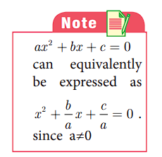
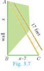
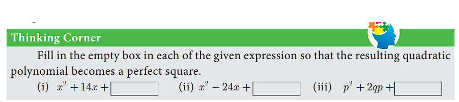

## 3.6 Quadratic Equations

### Introduction

Arab mathematician Abraham bar Hiyya Ha-Nasi, often known by the Latin name Savasorda, is famed for his book 'Liber Embadorum' published in 1145 AD(CE) which is the first book published in Europe to give the complete solution of a quadratic equation.

For a period of more than three thousand years beginning from early civilizations to current times, humanity knew how to solve a general quadratic equation in terms of its co-efficients by using four arithmetical operations and extraction of roots. This process is called "Solving by Radicals". Huge amount of research has been carried to this day in solving various types of equations.

### Quadratic Expression

An expression of degree n in variable x is a₀ + a₁x + a₂x² + ... + aₙxⁿ where a₀, a₁, a₂, ..., aₙ are called coefficients and a₀ ≠ 0 and a₁, a₂, ..., aₙ are real numbers.

In particular an expression of degree 2 is called a **Quadratic Expression** which is expressed as **p(x) = ax² + bx + c**, a ≠ 0 and a, b, c are real numbers.

### 3.6.1 Zeroes of a Quadratic Polynomial

Let p(x) be a polynomial. x = a is called zero of p(x) if p(a) = 0

For example, if p(x) = x² - 2x - 8 then p(-2) = 4 + 4 - 8 = 0 and p(4) = 16 - 8 - 8 = 0

Therefore, -2 and 4 are zeros of the polynomial p(x) = x² - 2x - 8.

### 3.6.2 Roots of Quadratic Equations

Let ax² + bx + c = 0, (a ≠ 0) be a quadratic equation. The values of x such that the expression ax² + bx + c becomes zero are called **roots** of the quadratic equation ax² + bx + c = 0.

Derivation of quadratic formula:
ax² + bx + c = 0
a[x² + (b/a)x + c/a] = 0
x² + (b/a)x = -c/a
x² + 2(b/2a)x + (b/2a)² = (b/2a)² - c/a
(x + b/2a)² = (b² - 4ac)/4a²
x + b/2a = ±√(b² - 4ac)/2a

Therefore, the roots are:
**x = [-b ± √(b² - 4ac)]/(2a)**

### 3.6.3 Formation of a Quadratic Equation

If α and β are roots of a quadratic equation ax² + bx + c = 0 then:
- α + β = -b/a
- αβ = c/a

Since (x - α) and (x - β) are factors of ax² + bx + c = 0,
We have (x - α)(x - β) = 0
x² - (α + β)x + αβ = 0

That is, **x² - (sum of roots)x + product of roots = 0** is the general form of the quadratic equation when the roots are given.

### Example 3.23

Find the zeroes of the quadratic expression x² + 8x + 12.

**Solution:**

Let p(x) = x² + 8x + 12 = (x + 2)(x + 6)

p(-2) = 4 - 16 + 12 = 0
p(-6) = 36 - 48 + 12 = 0

Therefore, -2 and -6 are zeros of p(x) = x² + 8x + 12

### Example 3.24

Write down the quadratic equation in general form for which sum and product of the roots are given below.
- (i) 9, 14
- (ii) -7/2, 5/2
- (iii) -3/5, -1/2

**Solution:**

**(i)** x² - 9x + 14 = 0

**(ii)** x² + (7/2)x + 5/2 = 0 → 2x² + 7x + 5 = 0

**(iii)** x² + (3/5)x - 1/2 = 0 → 10x² + 6x - 5 = 0

### Example 3.25

Find the sum and product of the roots for each of the following quadratic equations:
- (i) x² + 8x - 65 = 0
- (ii) 2x² + 5x + 7 = 0
- (iii) kx² - k²x - 2k³ = 0

**Solution:**

**(i)** a = 1, b = 8, c = -65
α + β = -b/a = -8
αβ = c/a = -65

**(ii)** a = 2, b = 5, c = 7
α + β = -5/2
αβ = 7/2

**(iii)** a = k, b = -k², c = -2k³
α + β = k²/k = k
αβ = -2k³/k = -2k²

## Exercise 3.9

1. Determine the quadratic equations, whose sum and product of roots are
   - (i) -9, 20
   - (ii) 5/3, 4
   - (iii) -3/2, -1
   - (iv) -(2+a), (a-5)²

2. Find the sum and product of the roots for each of the following quadratic equations
   - (i) x² + 3x - 28 = 0
   - (ii) x² + 3x = 0
   - (iii) 3 + 1/(10a²) = 0
   - (iv) 3y² - y - 4 = 0

### 3.6.4 Solving Quadratic Equations

We have already learnt how to solve linear equations in one, two and three variable(s). Recall that the values of the variables which satisfies a given equation are called its solution(s). In this section, we are going to study three methods of solving quadratic equation, namely factorization method, completing the square method and using formula.

#### Solving a quadratic equation by factorization method.

We follow the steps provided below to solve a quadratic equation through factorization method.

**Step 1:** Write the equation in general form ax² + bx + c = 0

**Step 2:** By splitting the middle term, factorize the given equation.

**Step 3:** After factorizing, the given quadratic equation can be written as product of two linear factors.

**Step 4:** Equate each linear factor to zero and solve for x.

These values of x gives the roots of the equation.

### Example 3.26

Solve: 2x² - 6x + 3 = 0

Wait, original says: 2x² - 6x + 3 = 0? Actually: 2x² - 7x + 3 = 0? 

Looking at original: "2x² - 6x + 3 = 0" - but solution shows 2x² - 7x + 3 = 0

Actually: 2x² - 7x + 3 = 0 (from solution)

**Solution:**

2x² - 7x + 3 = 0
= 2x² - 6x - x + 3 (by splitting the middle term)
= 2x(x - 3) - 1(x - 3)
= (2x - 1)(x - 3)

Now, equating the factors to zero:
(2x - 1)(x - 3) = 0
2x - 1 = 0 or x - 3 = 0
x = 1/2 or x = 3

∴ the solution is x = 3 or 1/2.

### Example 3.27

Solve: 2m² + 19m + 30 = 0

**Solution:**

2m² + 19m + 30 = 0
= 2m² + 4m + 15m + 30
= 2m(m + 2) + 15(m + 2)
= (2m + 15)(m + 2)

Equating to zero:
m + 2 = 0 or 2m + 15 = 0
m = -2 or m = -15/2

Therefore, the roots are -2, -15/2.

Some equations which are not quadratic can be solved by reducing them to quadratic equations by suitable substitutions. Such examples are illustrated below.

### Example 3.28

Solve: x⁴ - 13x² + 42 = 0

**Solution:**

Let a = x². Then:
a² - 13a + 42 = 0
(a - 7)(a - 6) = 0
a = 7 or 6

Since a = x²:
x² = 7 → x = ±√7
x² = 6 → x = ±√6

Therefore, the roots are x = ±√7, ±√6

### Example 3.29

Solve: (x - 1)/x + x/(x - 1) = 5/2

**Solution:**

Let y = (x-1)/x, then 1/y = x/(x-1)

Therefore: y + 1/y = 5/2
2y² - 5y + 2 = 0
(2y - 1)(y - 2) = 0
y = 1/2 or y = 2

Case 1: (x-1)/x = 1/2
2x - 2 = x
x = 2

Case 2: (x-1)/x = 2
x - 1 = 2x
x = -1

Therefore, the roots are x = -1, 2.

## Exercise 3.10

1. Solve the following quadratic equations by factorization method
   - (i) 4x² - 7x - 2 = 0
   - (ii) 3(p² - 6) = p(p + 5)
   - (iii) √(a(a-7)) = 3√2
   - (iv) 2x² + 7x + 5 = 0
   - (v) 2x² - x + 1/8 = 0

2. The number of volleyball games that must be scheduled in a league with n teams is given by G(n) = n² - n/2 where each team plays with every other team exactly once. A league schedules 15 games. How many teams are in the league?

### Solving a Quadratic Equation by Completing the Square Method

In deriving the formula for the roots of a quadratic equation we used completing the squares method. The same technique can be applied in solving any given quadratic equation through the following steps.

**Step 1:** Write the quadratic equation in general form ax² + bx + c = 0

**Step 2:** Divide both sides of the equation by the coefficient of x² if it is not 1.

**Step 3:** Shift the constant term to the right hand side.

**Step 4:** Add the square of one-half of the coefficient of x to both sides.

**Step 5:** Write the left hand side as a square and simplify the right hand side.

**Step 6:** Take the square root on both sides and solve for x.

### Example 3.30

Solve: x² - 3x - 2 = 0

**Solution:**

x² - 3x = 2 (Shifting the Constant to RHS)
x² - 3x + (3/2)² = 2 + (3/2)²
(x - 3/2)² = 2 + 9/4 = 17/4
x - 3/2 = ±√17/2
x = (3 ± √17)/2

Therefore, x = (3 + √17)/2, (3 - √17)/2

### Example 3.31

Solve: 2x² - x - 2 = 0

**Solution:**

2x² - x - 2 = 0
x² - x/2 - 1 = 0 (÷2 to make co-efficient of x² as 1)
x² - x/2 = 1
x² - x/2 + (1/4)² = 1 + (1/4)²
(x - 1/4)² = 1 + 1/16 = 17/16
x - 1/4 = ±√17/4
x = (1 ± √17)/4

### Solving a Quadratic Equation by Formula Method

The formula for finding roots of a quadratic equation ax² + bx + c = 0 is:

**x = [-b ± √(b² - 4ac)]/(2a)**

### Example 3.32

Solve x² + 2x - 2 = 0 by formula method

**Solution:**

a = 1, b = 2, c = -2
x = [-2 ± √(4 + 8)]/2 = [-2 ± √12]/2 = [-2 ± 2√3]/2 = -1 ± √3

Therefore, x = -1 + √3, -1 - √3

### Example 3.33

Solve 2x² - 3x - 3 = 0 by formula method.

**Solution:**

a = 2, b = -3, c = -3
x = [3 ± √(9 + 24)]/4 = [3 ± √33]/4

Therefore, x = (3 + √33)/4, (3 - √33)/4

### Example 3.34

Solve 3p² + 2√5p - 5 = 0 by formula method.

**Solution:**

a = 3, b = 2√5, c = -5
p = [-2√5 ± √(20 + 60)]/6 = [-2√5 ± √80]/6 = [-2√5 ± 4√5]/6

Therefore, p = √5/3, -√5

### Example 3.35

Solve: pqx² - (p+q)²x + (p+q)² = 0

**Solution:**

After simplification:
x = (p+q)/q or (p+q)/p

## Exercise 3.11

1. Solve the following quadratic equations by completing the square method
   - (i) 9x² - 12x + 4 = 0
   - (ii) (5x + 7)/(x - 1) = 3x + 1

2. Solve the following quadratic equations by formula method
   - (i) 2x² - 5x + 2 = 0
   - (ii) 2f² - 6f + 3 = 0
   - (iii) 3y² - 20y - 23 = 0
   - (iv) 36y² - 12ay + (a² - b²) = 0

3. A ball rolls down a slope and travels a distance d = 2t² - 0.75t feet in t seconds. Find the time when the distance travelled by the ball is 11.25 feet.

### 3.6.5 Solving Problems Involving Quadratic Equations

**Steps to solve a problem:**

**Step 1:** Convert the word problem to a quadratic equation form

**Step 2:** Solve the quadratic equation obtained in any one of the above three methods.

**Step 3:** Relate the mathematical solution obtained to the statement asked in the question.

### Example 3.36

The product of Kumaran's age (in years) two years ago and his age four years from now is one more than twice his present age. What is his present age?

**Solution:**

Let the present age of Kumaran be x years

Two years ago, his age = (x - 2) years.
Four years from now, his age = (x + 4) years.

Given: (x - 2)(x + 4) = 1 + 2x
x² + 2x - 8 = 1 + 2x
x² - 9 = 0
(x - 3)(x + 3) = 0
x = ±3

Therefore, x = 3 (Rejecting -3 as age cannot be negative)

Kumaran's present age is 3 years.

### Example 3.37

A ladder 17 feet long is leaning against a wall. If the ladder, vertical wall and the floor from the bottom of the wall to the ladder form a right triangle, find the height of the wall where the top of the ladder meets if the distance between bottom of the wall to bottom of the ladder is 7 feet less than the height of the wall?

**Solution:**

Let the height of the wall AB = x feet
As per the given data BC = (x - 7) feet

In the right triangle ABC, AC = 17 ft, BC = (x-7) feet

By Pythagoras theorem: AC² = AB² + BC²
17² = x² + (x - 7)²
289 = x² + x² - 14x + 49
2x² - 14x - 240 = 0
x² - 7x - 120 = 0
(x - 15)(x + 8) = 0
x = 15

Therefore, height of the wall AB = 15 ft (Rejecting -8 as height cannot be negative)

### Example 3.38

A flock of swans contained x² members. As the clouds gathered, 10x went to a lake and one-eighth of the members flew away to a garden. The remaining three pairs played about in the water. How many swans were there in total?

**Solution:**

As given there are x² swans.

As per the given data: x² - 10x - x²/8 = 6
Multiply by 8: 8x² - 80x - x² = 48
7x² - 80x - 48 = 0

Using quadratic formula:
x = [80 ± √(6400 + 1344)]/14 = [80 ± √7744]/14 = [80 ± 88]/14

x = 12 or x = -4/7

Here x = -4/7 is not possible as the number of swans cannot be negative.

Hence, x = 12. Therefore total number of swans is x² = 144.

### Example 3.39

A passenger train takes 1 hr more than an express train to travel a distance of 240 km from Chennai to Virudhachalam. The speed of the express train is more than that of the passenger train by 20 km per hour. Find the average speed of both the trains.

**Solution:**

Let the average speed of passenger train be x km/hr.
Then the average speed of express train will be (x + 20) km/hr

Time taken by passenger train = 240/x hr
Time taken by express train = 240/(x+20) hr

Given: 240/x = 240/(x+20) + 1
240/x - 240/(x+20) = 1
240(x+20) - 240x = x(x+20)
4800 = x² + 20x
x² + 20x - 4800 = 0
(x + 80)(x - 60) = 0
x = -80 or 60

Therefore x = 60 (Rejecting -80 as speed cannot be negative)

Average speed of the passenger train is 60 km/hr
Average speed of the express train is 80 km/hr.

## Exercise 3.12

1. If the difference between a number and its reciprocal is 24/5, find the number.

2. A garden measuring 12m by 16m is to have a pedestrian pathway that is 'w' meters wide installed all the way around so that it increases the total area to 285m². What is the width of the pathway?

3. A bus covers a distance of 90 km at a uniform speed. Had the speed been 15 km/hour more it would have taken 30 minutes less for the journey. Find the original speed of the bus.

4. A girl is twice as old as her sister. Five years hence, the product of their ages (in years) will be 375. Find their present ages.

5. A pole has to be erected at a point on the boundary of a circular ground of diameter 20m in such a way that the difference of its distances from two diametrically opposite fixed gates P and Q on the boundary is 4m. Is it possible to do so? If answer is yes at what distance from the two gates should the pole be erected?

6. From a group of 2x² black bees, square root of half of the group went to a tree. Again eight-ninth of the bees went to the same tree. The remaining two got caught up in a fragrant lotus. How many bees were there in total?

7. Music is been played in two opposite galleries with certain group of people. In the first gallery a group of 4 singers were singing and in the second gallery 9 singers were singing. The two galleries are separated by the distance of 70m. Where should a person stand for hearing the same intensity of the singers voice? (Hint: The ratio of the sound intensity is equal to the square of the ratio of their corresponding distances).

8. There is a square field whose side is 10m. A square flower bed is prepared in its centre leaving a gravel path all round the flower bed. The total cost of laying the flower bed and gravelling the path at ₹3 and ₹4 per square metre respectively is ₹364. Find the width of the gravel path.

9. The hypotenuse of a right angled triangle is 25 cm and its perimeter 56 cm. Find the length of the smallest side.

### 3.6.6 Nature of Roots of a Quadratic Equation

The roots of the quadratic equation ax² + bx + c = 0, a ≠ 0 are found using the formula x = [-b ± √(b² - 4ac)]/(2a).

Here, **b² - 4ac** called as the **discriminant** (which is denoted by Δ) of the quadratic equation, decides the nature of roots as follows:

| Values of Discriminant Δ = b² - 4ac | Nature of Roots |
|:---|:---|
| Δ > 0 | Real and Unequal roots |
| Δ = 0 | Real and Equal roots |
| Δ < 0 | No Real root |

### Example 3.40

Determine the nature of roots for the following quadratic equations:
- (i) x² - 2x - 3 = 0
- (ii) 9x² - 24x + 16 = 0
- (iii) 2x² - 2x + 9 = 0

**Solution:**

**(i)** x² - 2x - 3 = 0
a = 1, b = -2, c = -3
Δ = (-2)² - 4(1)(-3) = 4 + 12 = 16 > 0

So, the equation will have real and unequal roots.

**(ii)** 9x² - 24x + 16 = 0
a = 9, b = -24, c = 16
Δ = (-24)² - 4(9)(16) = 576 - 576 = 0

So, the equation will have real and equal roots.

**(iii)** 2x² - 2x + 9 = 0
a = 2, b = -2, c = 9
Δ = (-2)² - 4(2)(9) = 4 - 72 = -68 < 0

So, the equation will have no real roots.

### Example 3.41

(i) Find the values of 'k', for which the quadratic equation kx² - (k+8)x + 8 = 0 has real and equal roots?

(ii) Find the values of 'k' such that quadratic equation (k+9)x² + (k+1)x + 1 = 0 has no real roots?

**Solution:**

**(i)** Since the equation has real and equal roots, Δ = 0.
a = k, b = -(k+8), c = 8
(k+8)² - 4(k)(8) = 0
k² + 16k + 64 - 32k = 0
k² - 16k + 64 = 0
(k - 8)² = 0
k = 8

**(ii)** Since the equation has no real roots, Δ < 0
a = k+9, b = k+1, c = 1
(k+1)² - 4(k+9)(1) < 0
k² + 2k + 1 - 4k - 36 < 0
k² - 2k - 35 < 0
(k - 7)(k + 5) < 0

Therefore, -5 < k < 7

### Example 3.42

Prove that the equation x²(p²+q²) + 2x(pr+qs) + r²+s² = 0 has no real roots. If ps = qr, then show that the roots are real and equal.

**Solution:**

Δ = [2(pr+qs)]² - 4(p²+q²)(r²+s²)
= 4(p²r² + 2pqrs + q²s²) - 4(p²r² + p²s² + q²r² + q²s²)
= 4[2pqrs - p²s² - q²r²]
= -4(p²s² - 2pqrs + q²r²)
= -4(ps - qr)² ≤ 0

Since Δ < 0 (unless ps = qr), the roots are not real.

If ps = qr, then Δ = 0, so the roots will be real and equal.

## Exercise 3.13

1. Determine the nature of the roots for the following quadratic equations
   - (i) 15x² + 11x + 2 = 0
   - (ii) x² - x - 1 = 0
   - (iii) 2√3t² - √3t + 2 = 0
   - (iv) 9y² - 6√2y + 2 = 0
   - (v) 9a²b²x² - 24abcdx + 16c²d² = 0, a≠0, b≠0

2. Find the value(s) of 'k' for which the roots of the following equations are real and equal
   - (i) 5k²x² - 6kx + 2 = 0
   - (ii) kx² + (6k+2)x + 16 = 0

3. If the roots of (a-b)x² + (b-c)x + (c-a) = 0 are real and equal, then prove that b, a, c are in arithmetic progression.

4. If a, b are real then show that the roots of the equation (a-b)x² - 6(a+b)x - 9(a-b) = 0 are real and unequal.

5. If the roots of the equation (c²-ab)x² - 2(a²-bc)x + b²-ac = 0 are real and equal prove that either a = 0 or a³ + b³ + c³ = 3abc

### 3.6.7 The Relation between Roots and Coefficients of a Quadratic Equation

Let α and β are the roots of the equation ax² + bx + c = 0 then:
- α + β = -b/a = -(Coefficient of x)/(Coefficient of x²)
- αβ = c/a = (Constant term)/(Coefficient of x²)

### Example 3.43

If the difference between the roots of the equation x² - 13x + k = 0 is 17, find k.

**Solution:**

x² - 13x + k = 0, here a=1, b=-13, c=k

Let α, β be the roots.
α + β = 13 ... (1)
α - β = 17 ... (2)

(1) + (2): 2α = 30 → α = 15
From (1): β = 13 - 15 = -2

But αβ = k
k = 15 × (-2) = -30

### Thinking Corner

If the constant term of ax² + bx + c = 0 is zero, then the sum and product of roots are ___ and ___.

### Example 3.44

If α and β are the roots of x² + 7x + 10 = 0 find the values of:
- (i) (α - β)
- (ii) α² + β²
- (iii) α³ - β³
- (iv) α⁴ + β⁴
- (v) α/β + β/α
- (vi) α²/β + β²/α

**Solution:**

x² + 7x + 10 = 0, a=1, b=7, c=10
α + β = -7, αβ = 10

**(i)** (α - β)² = (α+β)² - 4αβ = 49 - 40 = 9
α - β = ±3

**(ii)** α² + β² = (α+β)² - 2αβ = 49 - 20 = 29

**(iii)** α³ - β³ = (α-β)(α²+αβ+β²) = (α-β)[(α+β)²-αβ] = (±3)(49-10) = ±117

**(iv)** α⁴ + β⁴ = (α²+β²)² - 2α²β² = 29² - 2(100) = 841 - 200 = 641

**(v)** α/β + β/α = (α²+β²)/αβ = 29/10

**(vi)** α²/β + β²/α = (α³+β³)/αβ = [(α+β)³ - 3αβ(α+β)]/αβ = [-343 + 210]/10 = -133/10

### Example 3.45

If α, β are the roots of 3x² + 7x - 2 = 0, find the values of:
- (i) α/β + β/α
- (ii) α²/β + β²/α

**Solution:**

a = 3, b = 7, c = -2
α + β = -7/3, αβ = -2/3

**(i)** α/β + β/α = (α²+β²)/αβ = [(α+β)²-2αβ]/αβ = [49/9 + 4/3]/(-2/3) = [49/9 + 12/9] × (-3/2) = (61/9) × (-3/2) = -61/6

**(ii)** α²/β + β²/α = (α³+β³)/αβ = [(α+β)³-3αβ(α+β)]/αβ = [-343/27 - 3(-2/3)(-7/3)]/(-2/3) = [-343/27 - 14/3]/(-2/3) = [-343/27 - 126/27]/(-2/3) = (-469/27) × (-3/2) = 469/18

### Example 3.46

If α, β are the roots of 2x² - x - 1 = 0, then form the equation whose roots are:
- (i) 1/α, 1/β
- (ii) α²β, β²α
- (iii) 2α+β, 2β+α

**Solution:**

2x² - x - 1 = 0, a=2, b=-1, c=-1
α + β = 1/2, αβ = -1/2

**(i)** New roots: 1/α, 1/β
Sum = 1/α + 1/β = (α+β)/αβ = (1/2)/(-1/2) = -1
Product = 1/(αβ) = -2

Equation: x² - (-1)x + (-2) = 0 → x² + x - 2 = 0

**(ii)** New roots: α²β, β²α = αβ(α), αβ(β)
Sum = αβ(α+β) = (-1/2)(1/2) = -1/4
Product = α³β³ = (αβ)³ = -1/8

Equation: x² + (1/4)x - 1/8 = 0 → 8x² + 2x - 1 = 0

**(iii)** New roots: 2α+β, 2β+α
Sum = 3(α+β) = 3/2
Product = (2α+β)(2β+α) = 5αβ + 2(α²+β²) + αβ = ... = 0

Equation: x² - (3/2)x = 0 → 2x² - 3x = 0

## Exercise 3.14

1. Write each of the following expression in terms of α+β and αβ.
   - (i) α³/β + β³/α
   - (ii) 1/α² + 1/β²
   - (iii) (3α-1)(3β-1)
   - (iv) (α+3)/(β+3) + (β+3)/(α+3)

2. The roots of the equation 2x² - 7x + 5 = 0 are α and β. Without solving for the roots, find:
   - (i) 1/α + 1/β
   - (ii) α/β + β/α
   - (iii) (α+2)/(β+2) + (β+2)/(α+2)

3. The roots of the equation x² + 6x - 4 = 0 are α, β. Find the quadratic equation whose roots are:
   - (i) α² and β²
   - (ii) 2/α and 2/β
   - (iii) α²β and β²α

4. If α, β are the roots of 7x² + ax + 7 = 0 and if β - α = -13/7, find the values of a.

5. If one root of the equation 2y² - ay + 64 = 0 is twice the other then find the values of a.

6. If one root of the equation 3x² + kx + 81 = 0 (having real roots) is the square of the other then find k.