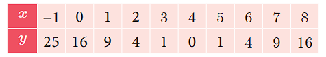
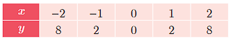
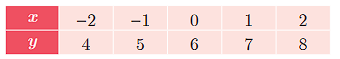
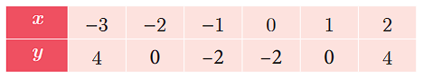
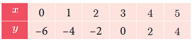


# Quadratic Graphs

**Introduction**

The trajectory followed by an object (say, a ball) thrown upward at an angle gives a curve known as a parabola. Trajectory of water jets in a fountain or of a bouncing ball results in a parabolic path. A parabola represents a ==Quadratic function==.

A quadratic function has the form \\(f(x)=ax^2+bx+c\\) 
where a, b, c are constants, and a ≠ 0.

Many quadratic functions can be graphed easily by
hand using the techniques of stretching/shrinking and
shifting the parabola \\(y=x^2\\) (We can easily sketch the
curve \\(y=x^2\\) by preparing a table of values and plotting
the ordered pairs). 

The “basic” parabola, \\(y=x^2\\), looks like this Fig.3.16.
The coefficient a in the general equation is
responsible for parabolas to open upward or downward
and vary in “width” (“wider” or “skinnier”), but they all
have the same basic "∪" shape. 

The greater the quadratic coefficient of \\(x^2\\), the narrower is the parabola.
The lesser the quadratic coefficient of  \\(x^2\\), the wider is the parabola.

A parabola is symmetric with respect to a line called the axis of symmetry. The point of intersection of the parabola and the axis of symmetry is called the vertex of the parabola. The graph of any second degree polynomial gives a curve called “parabola”.

We have already studied how to find the roots of any quadratic equation 
\\(ax^2+bx+c=0\\) where a,b,c ∈ ℝ and a ≠ 0 theoretically. In this section, we will learn how to solve a quadratic equation and obtain its roots graphically.

## Finding the Nature of Solution of Quadratic Equations Graphically

To obtain the roots of the quadratic equation \\(ax^2+bx+c=0\\)   graphically, we first draw the graph of \\(y=ax^2+bx+c\\)  . 

The solutions of the quadratic equation are the x coordinates of the points of intersection of the curve with X axis.
To determine the nature of solutions of a quadratic equation, we can use the following procedure.

(i) If the graph of the given quadratic equation intersect the X axis at two distinct points, then the given equation has two real and unequal roots.
(ii) If the graph of the given quadratic equation touch the X axis at only one point, then the given equation has only one root which is same as saying two real and equal roots.
(iii) If the graph of the given equation does not intersect the X axis at any point then the given equation has no real root.

**Example 3.51** Discuss the nature of solutions of the following quadratic equations. 

(i)\\(x^2+x-12=0\\)  (ii)\\(x^2-8x+16=0\\) (iii)\\(x^2+2x+5=0\\)

**Solution**
(i)\\(x^2+x-12=0\\)

**Step 1:** Prepare the table of values for the equation y= \\(x^2+x-12\\)

**Step 2:**  Plot the points for the above ordered
pairs (x, y) on the graph using
suitable scale.

**Step 3:**  Draw the parabola and mark the
co-ordinates of the parabola which
intersect the X axis.

**Step 4:** The roots of the equation are the x
coordinates of the intersecting points
(–4, 0) and (3,0)of the parabola
with the X axis which are −4 and 3
respectively.

Since there are two points of intersection
with the X axis, the quadratic equation
\\(x^2+x-12=0\\) has real and unequal roots.

  (ii)\\(x^2-8x+16=0\\)
  **Step 1:**   Prepare the table of values for the equation \\(y=x^2-8x+16\\)

  

**Step 2:**  Plot the points for the above ordered pairs (x, y) on the graph using suitable scale.

**Step 3:**  Draw the parabola and mark the coordinates of the parabola which intersect with the X axis.

**Step 4:**  The roots of the equation are the x coordinates of the intersecting points of the parabola with the X axis (4,0) which is 4. Since there is only one point of intersection with X axis, the quadratic equation \\(x^2-8x+16=0\\) has real and equal roots.

(iii)\\(x^2+2x+5=0\\)

Let \\(y=x^2+2x+5\\)

**Step 1:** Prepare a table of values for the equation \\(y=x^2+2x+5\\)

**Step 2:** Plot the above ordered pairs (x, y) on the graph using suitable scale.

**Step 3:** Join the points by a free-hand smooth curve this smooth curve is the graph of \\(y=x^2+2x+5\\)

**Step 4:** The solutions of the given quadratic equation are the x coordinates of the intersecting points of the parabola the X axis. Here the parabola doesn’t intersect or touch the X axis.

So, we conclude that there is no real root for the given quadratic equation.

 ## Solving quadratic equations through intersection of lines

 We can determine roots of a quadratic equation graphically by choosing appropriate parabola and intersecting it with a desired straight line.

(i) If the straight line intersects the parabola at two distinct points, then the x coordinates of those points will be the roots of the given quadratic equation.

(ii) If the straight line just touch the parabola at only one point, then the x coordinate of the common point will be the single root of the quadratic equation.

(iii) If the straight line doesn’t intersect or touch the parabola then the quadratic equation will have no real roots.

**Example 3.52** Draw the graph of \\(y=2x^2\\) and hence solve \\(2x^2-x-6=0\\)

**Solution Step 1:** Draw the graph of \\(y=2x^2\\)  by
preparing the table of values as below

**Step 2:** To solve \\(2x^2-x-6=0\\), substract 
\\(2x^2-x-6=0\\) from \\(y=2x^2\\) 


\begin{aligned}
   &y=2x^2 \\
   (-)\\
&0=2x^2-x-6 \\
\hline
&y=x+6\\
\hline
\end{aligned}


The equation y= x + 6 represents a
straight line. Draw the graph of y = x+6 by
forming table of values as below

**Step 3:** Mark the points of intersection of the curve \\(y=2x^2\\) and the line y=x + 6 . That is, (–1.5, 4.5) and (2,8)

**Step 4:** The x coordinates of the respective points forms the solution set {–1.5,2} for \\(2x^2-x-6=0\\) 

**Example 3.53** Draw the graph of
\\(y=x^2+4x+3\\) and hence find the roots of
\\(x^2+x+1=0\\)

**Solution**
**Step 1:** Draw the graph of \\(y=x^2+4x+3\\) by
preparing the table of values as below

**Step 2:** To solve \\(x^2+x+1=0\\),
 subtract \\(x^2+x+1=0\\) from \\(y=x^2+4x+3\\) 

 
\begin{aligned}
& y=x^2+4x+3 \\
  -\\
& 0=x^2+x+1\\
\hline
&y=3x+2\\
   \hline
\end{aligned}


The equation represent a straight line.
Draw the graph of y = 3x+2 forming the table
of values as below.

Step 3: Observe that the graph of y = 3x+2 does not intersect or touch the graph of the
parabola \\(y=x^2+4x+3\\)
Thus \\(x^2+x+1\\) has no real roots

**Example 3.54** Draw the graph of \\(y=x^2+x-2\\) and hence solve \\(x^2+x-2=0\\)
**Solution**
**Step 1:** Draw the graph of \\(y=x^2+x-2\\) by preparing the table of values as below

**Step 2:** To solve \\(x^2+x-2=0\\) subtract \\(x^2+x-2=0$ from  $y=x^2+x-2\\)
that is 


\begin{aligned}
& y=x^2+x-2 \\
  -\\
& 0=x^2+x-2\\
\hline
&y=0\\

   \hline
\end{aligned}


The equation y = 0 represents the X axis.

**Step 3:** Mark the point of intersection of
the curve \\(y=x^2+x-2\\) with the
X axis. That is (–2,0) and (1,0)

**Step 4:** The x coordinates of the respective
points form the solution set {−2,1}
for \\(x^2+x-2=0\\)

**Example 3.55** Draw the graph of
\\(y=x^2-4x+3\\) and use it to solve \\(x^2-6x+9=0\\)

**Solution**
**Step 1:** Draw the graph of \\(y=x^2-4x+3\\) by preparing the table of values as below

**Step 2:** To solve \\(x^2-6x+9=0\\), subtract  \\(x^2-6x+9=0\\) from \\(y=x^2-4x+3\\)
that is


\begin{aligned}
& y=x^2-4x+3 \\
  -\\
& 0=x^2-6x+9\\
\hline
&y=2x-6\\
   \hline
\end{aligned}


The equation y=2x-6 represent a straight line. Draw the graph of y=2x-6 forming the table of values as below.

The line  y=2x-6 intersect
\\(y=x^2-4x+3\\) only at one point.

**Step 3:** Mark the point of intersection of
the curve \\(y=x^2-4x+3\\)  and y=2x-6
that is (3,0).
Therefore, the x coordinate 3 is the
only solution for the equation 
\\(x^2-6x+9=0\\)

1. Graph the following quadratic equations and state their nature of solutions.
(i) \\(x^2-9x+20=0\\) (ii)\\(x^2-4x+4=0\\)
(iii) \\(x^2+x+7=0\\) (iv)\\(x^2-9=0\\) 
(v) \\(x^2-6x+9=0\\) (vi) \\((2x-3)(x+2)=0\\)
2. Draw the graph of \\(y=x^2-4\\)  and hence solve \\(x^2-x-12=0\\)
3. Draw the graph of \\(y=x^2+x\\) and hence solve \\(x^2+1=0\\)
4. Draw the graph of \\(y=x^2+3x+2\\) and use it to solve \\(x^2+2x+1=0\\)
5. Draw the graph of \\(y=x^2+3x-4\\)  and hence use it to solve \\(x^2+3x-4=0\\)
6. Draw the graph of \\(y=x^2-5x-6\\) and hence solve \\(x^2-5x-14=0\\)
7. Draw the graph of \\(y=2x^2-3x-5\\)and hence solve \\(2x^2-4x-6=0\\) 
8. Draw the graph of \\(y=(x-1)(x+3)\\) and hence solve \\(x^2-x-6=0\\)