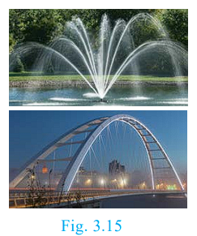
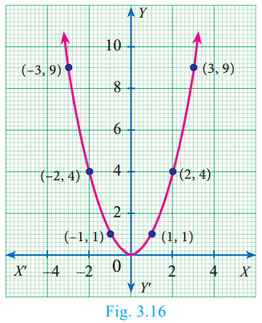
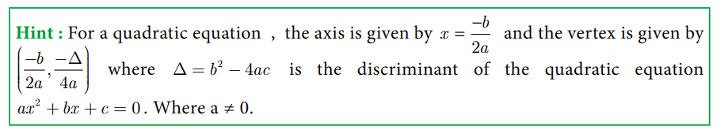
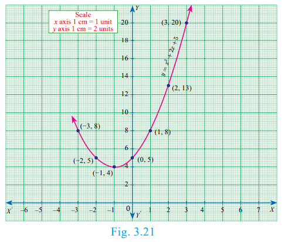
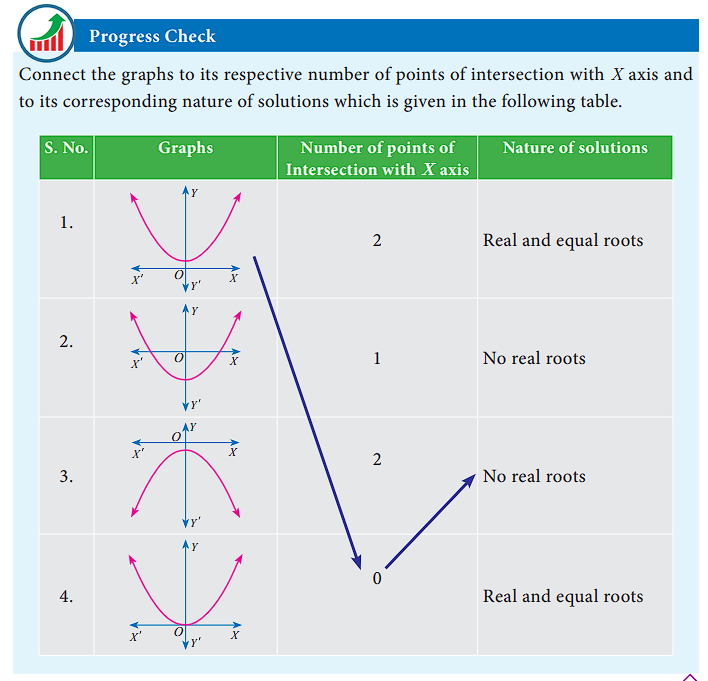
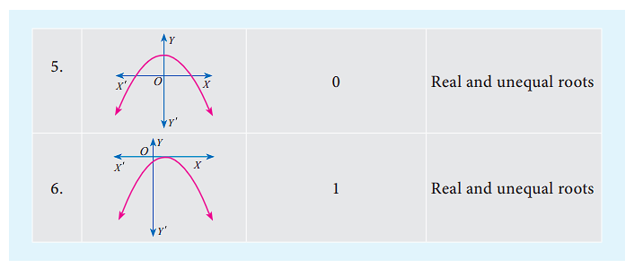
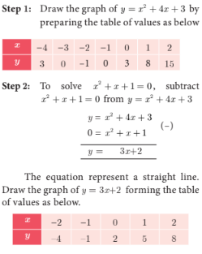
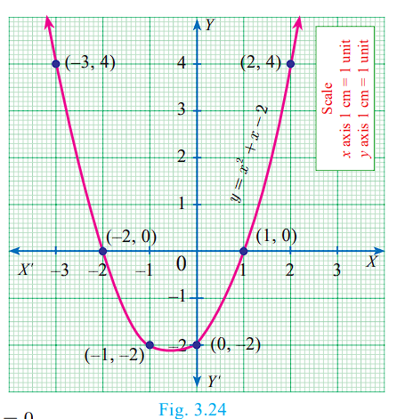

## 3.8 Quadratic Graphs

### Introduction

The trajectory followed by an object (say, a ball) thrown upward at an angle gives a curve known as a **parabola**. Trajectory of water jets in a fountain or of a bouncing ball results in a parabolic path. A parabola represents a **Quadratic function**.

A quadratic function has the form **f(x) = ax² + bx + c**, where a, b, c are constants, and a ≠ 0.

Many quadratic functions can be graphed easily by hand using the techniques of stretching/shrinking and shifting the parabola y = x² (We can easily sketch the curve y = x² by preparing a table of values and plotting the ordered pairs).

The "basic" parabola, y = x², looks like this. The coefficient a in the general equation is responsible for parabolas to open upward or downward and vary in "width" ("wider" or "skinnier"), but they all have the same basic "U" shape.

- The greater the quadratic coefficient of x², the narrower is the parabola.
- The lesser the quadratic coefficient of x², the wider is the parabola.

A parabola is symmetric with respect to a line called the **axis of symmetry**. The point of intersection of the parabola and the axis of symmetry is called the **vertex** of the parabola. The graph of any second degree polynomial gives a curve called "parabola".

### 3.8.1 Finding the Nature of Solution of Quadratic Equations Graphically

To obtain the roots of the quadratic equation ax² + bx + c = 0 graphically, we first draw the graph of y = ax² + bx + c.

The solutions of the quadratic equation are the x coordinates of the points of intersection of the curve with X-axis.

To determine the nature of solutions of a quadratic equation, we can use the following procedure.

- (i) If the graph of the given quadratic equation intersect the X axis at two distinct points, then the given equation has two real and unequal roots.
- (ii) If the graph of the given quadratic equation touch the X axis at only one point, then the given equation has only one root which is same as saying two real and equal roots.
- (iii) If the graph of the given equation does not intersect the X axis at any point then the given equation has no real root.

### Example 3.51

Discuss the nature of solutions of the following quadratic equations.
- (i) x² + x - 12 = 0
- (ii) x² - 8x + 16 = 0
- (iii) x² + 2x + 5 = 0

**Solution:**

**(i)** x² + x - 12 = 0

Step 1: Prepare table of values
| x | -5 | -4 | -3 | -2 | -1 | 0 | 1 | 2 | 3 | 4 |
|:---|:---|:---|:---|:---|:---|:---|:---|:---|:---|:---|
| y | 8 | 0 | -6 | -10 | -12 | -12 | -10 | -6 | 0 | 8 |

The parabola intersects X-axis at (-4, 0) and (3, 0).
Since there are two points of intersection, the equation has **real and unequal roots**: x = -4, 3

**(ii)** x² - 8x + 16 = 0

| x | -1 | 0 | 1 | 2 | 3 | 4 | 5 | 6 | 7 | 8 |
|:---|:---|:---|:---|:---|:---|:---|:---|:---|:---|:---|
| y | 25 | 16 | 9 | 4 | 1 | 0 | 1 | 4 | 9 | 16 |

The parabola touches X-axis at (4, 0) only.
Since there is only one point of intersection, the equation has **real and equal roots**: x = 4

**(iii)** x² + 2x + 5 = 0

| x | -3 | -2 | -1 | 0 | 1 | 2 | 3 |
|:---|:---|:---|:---|:---|:---|:---|:---|
| y | 8 | 5 | 4 | 5 | 8 | 13 | 20 |

The parabola doesn't intersect or touch the X-axis.
So, there is **no real root** for the given quadratic equation.

### 3.8.2 Solving quadratic equations through intersection of lines

We can determine roots of a quadratic equation graphically by choosing appropriate parabola and intersecting it with a desired straight line.

- (i) If the straight line intersects the parabola at two distinct points, then the x coordinates of those points will be the roots of the given quadratic equation.
- (ii) If the straight line just touch the parabola at only one point, then the x coordinate of the common point will be the single root of the quadratic equation.
- (iii) If the straight line doesn't intersect or touch the parabola then the quadratic equation will have no real roots.

### Example 3.52

Draw the graph of y = 2x² and hence solve 2x² - x - 6 = 0

**Solution:**

Step 1: Draw y = 2x²

| x | -2 | -1 | 0 | 1 | 2 |
|:---|:---|:---|:---|:---|:---|
| y | 8 | 2 | 0 | 2 | 8 |

Step 2: To solve 2x² - x - 6 = 0, subtract from y = 2x²:
y = 2x²
0 = 2x² - x - 6
(-)
---------
y = x + 6

Draw y = x + 6:

| x | -2 | -1 | 0 | 1 | 2 |
|:---|:---|:---|:---|:---|:---|
| y | 4 | 5 | 6 | 7 | 8 |

Step 3: Mark intersection points: (-1.5, 4.5) and (2, 8)

Step 4: The x coordinates form the solution set {-1.5, 2} for 2x² - x - 6 = 0

### Example 3.53

Draw the graph of y = x² + 4x + 3 and hence find the roots of x² + x + 1 = 0

**Solution:**

The line y = 3x + 2 does not intersect or touch the parabola y = x² + 4x + 3.

Thus x² + x + 1 = 0 has **no real roots**.

### Example 3.54

Draw the graph of y = x² + x - 2 and hence solve x² + x - 2 = 0.

**Solution:**

Step 1: Table of Values

Draw the graph of y = x² + x - 2 by preparing the table of values:

| x | -3 | -2 | -1 | 0  | 1 | 2 |
| - | -- | -- | -- | -- | - | - |
| y | 4  | 0  | -2 | -2 | 0 | 4 |

Step 2

To solve x² + x - 2 = 0 consider:

y = x² + x - 2

If

x² + x - 2 = 0
then

y=0

The equation y=0 represents the x-axis.

Step 3

Mark the points where the curve 
y =  x² + x - 2 intersects the x-axis.
The parabola intersects X-axis at (-2, 0) and (1, 0).

Solution set: {-2, 1}

### Example 3.55

Draw the graph of y = x² - 4x + 3 and use it to solve x² - 6x + 9 = 0

**Solution:**

**Step 1:** Draw the graph of y = x² - 4x + 3 by preparing the table of values as below

| x | -2 | -1 | 0 | 1 | 2 | 3 | 4 |
|:---:|:----:|:----:|:---:|:---:|:---:|:---:|:---:|
| y | 15 | 8 | 3 | 0 | -1 | 0 | 3 |

**Step 2:** To solve x² - 6x + 9 = 0, subtract x² - 6x + 9 = 0 from y = x² - 4x + 3

that is 
y = x² - 4x + 3

0 = x² - 6x + 9   (-)

 ________________

y = 2x - 6

The equation y = 2x - 6 represent a straight line. Draw the graph of y = 2x - 6 forming the table of values as below.

| x | 0 | 1 | 2 | 3 | 4 | 5 |
|:---:|:---:|:---:|:---:|:---:|:---:|:---:|
| y | -6 | -4 | -2 | 0 | 2 | 4 |

The line y = 2x - 6 intersect y = x² - 4x + 3 only at one point.

**Step 3:** Mark the point of intersection of the curve y = x² - 4x + 3 and y = 2x - 6 that is (3, 0).

Therefore, the x coordinate 3 is the only solution for the equation x² - 6x + 9 = 0.

## Exercise 3.16

1. Graph the following quadratic equations and state their nature of solutions.
   - (i) x² - 9x + 20 = 0
   - (ii) x² - 4x + 4 = 0
   - (iii) x² + x + 7 = 0
   - (iv) x² - 9 = 0
   - (v) x² - 6x + 9 = 0
   - (vi) (2x-3)(x+2) = 0

2. Draw the graph of y = x² - 4 and hence solve x² - x - 12 = 0

3. Draw the graph of y = x² + x and hence solve x² + 1 = 0

4. Draw the graph of y = x² + 3x + 2 and hence solve x² + 2x + 1 = 0

5. Draw the graph of y = x² + 3x - 4 and hence use it to solve x² + 3x - 4 = 0

6. Draw the graph of y = x² - 5x - 6 and hence solve x² - 5x - 14 = 0

7. Draw the graph of y = 2x² - 3x - 5 and hence solve 2x² - 4x - 6 = 0

8. Draw the graph of y = (x-1)(x+3) and hence solve x² - x - 6 = 0