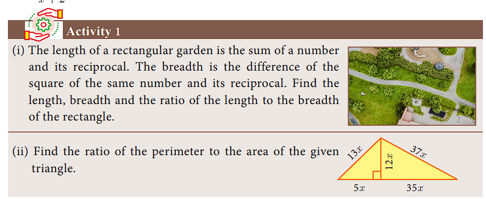
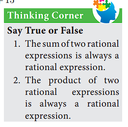

## 3.4 Rational Expressions

**Definition:** An expression is called a rational expression if it can be written in the form p(x)/q(x) where p(x) and q(x) are polynomials and q(x) ≠ 0. A rational expression is the ratio of two polynomials.

The following are examples of rational expressions:
- 9/x, (2y + 1)/(y² - 4y + 9), (z³ + 5)/(z - 4), a/(a + 10)

The rational expressions are applied for describing distance-time, modeling multitask problems, to combine workers or machines to complete a job schedule and much more.

### 3.4.1 Reduction of Rational Expression

A rational expression p(x)/q(x) is said to be in its lowest form if GCD[p(x), q(x)] = 1.

To reduce a rational expression to its lowest form, follow the given steps:
- (i) Factorize the numerator and the denominator
- (ii) If there are common factors in the numerator and denominator, cancel them.
- (iii) The resulting expression will be a rational expression in its lowest form.

### Example 3.13

Reduce the rational expressions to its lowest form
- (i) (x - 3)/(x² - 9)
- (ii) (x² - 16)/(x² + 8x + 16)

**Solution:**

**(i)** (x - 3)/(x² - 9) = (x - 3)/[(x + 3)(x - 3)] = 1/(x + 3)

**(ii)** (x² - 16)/(x² + 8x + 16) = [(x + 4)(x - 4)]/(x + 4)² = (x - 4)/(x + 4)

### 3.4.2 Excluded Value

A value that makes a rational expression p(x)/q(x) (in its lowest form) undefined is called an Excluded value.

To find excluded value for a given rational expression in its lowest form, say p(x)/q(x), consider the denominator q(x) = 0.

For example, the rational expression 5/(10 - x) is undefined when x = 10. So, 10 is called an excluded value for 5/(10 - x).

### Example 3.14

Find the excluded values of the following expressions (if any).
- (i) (x + 10)/(8x)
- (ii) (7p + 2)/(8p² + 13p + 5)
- (iii) x/(x² + 1)

**Solution:**

**(i)** (x + 10)/(8x)

The expression is undefined when 8x = 0 or x = 0. Hence, the excluded value is 0.

**(ii)** (7p + 2)/(8p² + 13p + 5)

The expression is undefined when 8p² + 13p + 5 = 0
That is, (8p + 5)(p + 1) = 0
p = -5/8, p = -1

The excluded values are -5/8 and -1.

**(iii)** x/(x² + 1)

Here, x² ≥ 0 for all x. Therefore, x² + 1 ≥ 1. Hence, x² + 1 ≠ 0 for any x.

Therefore, there can be no real excluded values for the given rational expression x/(x² + 1).

## Thinking Corner

1. Are x² - 1 and tan x = sin x/cos x rational expressions?
2. The number of excluded values of (x³ + 10x² - 8x)/(x⁴ + 8x - 89) is _____.

## Exercise 3.4

1. Reduce each of the following rational expressions to its lowest form.
   - (i) (x² - 1)/(x² + 1)
   - (ii) (x² - 11x + 18)/(x² - 4x + 4)
   - (iii) (9x² + 81)/(x⁴ + 8x³ - 9x²)
   - (iv) (p² - 3p - 40)/(p² - 2p² + 4p - 64)

2. Find the excluded values, if any of the following expressions.
   - (i) y/(y² - 25)
   - (ii) t/(t² - 5t + 6)
   - (iii) (x² + 6x + 8)/(x² + x - 2)
   - (iv) x³/(x² - 6x + 9)

### 3.4.3 Operations of Rational Expressions

We have studied the concepts of addition, subtraction, multiplication and division of rational numbers in previous classes. Now, let us generalize the above for rational expressions.

#### Multiplication of Rational Expressions

If p(x)/q(x) and r(x)/s(x) are two rational expressions where q(x) ≠ 0, s(x) ≠ 0, their product is:

[p(x)/q(x)] × [r(x)/s(x)] = [p(x) × r(x)]/[q(x) × s(x)]

In other words, the product of two rational expression is the product of their numerators divided by the product of their denominators and the resulting expression is then reduced to its lowest form.

#### Division of Rational Expressions

If p(x)/q(x) and r(x)/s(x) are two rational expressions, where q(x), s(x) ≠ 0 then:

[p(x)/q(x)] ÷ [r(x)/s(x)] = [p(x)/q(x)] × [s(x)/r(x)] = [p(x) × s(x)]/[q(x) × r(x)]

Thus division of one rational expression by other is equivalent to the product of first and reciprocal of the second expression. If the resulting expression is not in its lowest form, reduce it.

### Example 3.15

(i) Multiply x³/y² by 9y/27x⁵
(ii) Multiply (x⁴ - b⁴)/x² by x²/(a⁴b⁴ - 1)

**Solution:**

**(i)** (x³/y²) × (9y/27x⁵) = 9x³y/27x⁵y² = 1/(3x²y)

**(ii)** [(x⁴ - b⁴)/x²] × [x²/(a⁴b⁴ - 1)] = (x⁴ - b⁴)/(a⁴b⁴ - 1)

### Example 3.16

Find:
(i) (14x⁴/y³) ÷ (7x/y⁴)
(ii) [(x² - 16)/(x + 4)] ÷ [(x - 4)/(x² + 4)]
(iii) [(16x² - 23)/(x² - 3x - 2)] ÷ [(32x² - 1)/(x² + x - 1)]

**Solution:**

**(i)** (14x⁴/y³) ÷ (7x/y⁴) = (14x⁴/y³) × (y⁴/7x) = 2x³y

**(ii)** [(x² - 16)/(x + 4)] ÷ [(x - 4)/(x² + 4)] = [(x+4)(x-4)/(x+4)] × [(x²+4)/(x-4)] = x² + 4

**(iii)** [(16x² - 23)/(x² - 3x - 2)] ÷ [(32x² - 1)/(x² + x - 1)] 
= [(16x² - 23)/(x² - 3x - 2)] × [(x² + x - 1)/(32x² - 1)]

## Exercise 3.5

1. Simplify
   - (i) (4x²y⁶/z²) × (xz³/y⁴)
   - (ii) [(p² - 10p + 21)/(p - 7)] × [(p² - 9)/(p² - 12p + 35)]
   - (iii) (5/3t) × [(4t - 8)/(6t - 12)]

2. Simplify
   - (i) [(x + 4)/(x² - 9)] × [(x² - 16)/(x² + 4x)]
   - (ii) [(x³ - y³)/(x² + xy + y²)] × [(x² + 2xy + y²)/(x² - y²)]

3. Simplify
   - (i) [(2a² + 5a + 3)/(a² + 3a + 2)] ÷ [(2a² + 7a + 6)/(a² + 5a + 6)]
   - (ii) [(b² + 3b - 28)/(b² + 4b + 4)] ÷ [(b² - 49)/(5b² - 14b - 5)]
   - (iii) [x/(y²)] ÷ [(x² - 4)/(6y - 12)]
   - (iv) [(12t² - 2t + 8)/(t² + 3)] ÷ [(3t² - 2t + 8)/(t² + 2t + 1)]

4. If x = (a² - 34)/(3a + 33) and y = (a² - 28)/(2a² - 24), find the value of x²y² - ...

5. If a polynomial p(x) = x² - 5x - 14 is divided by another polynomial q(x) we get (x - 7)/(x + 2), find q(x).

## Addition and Subtraction of Rational Expressions

### Addition and Subtraction of Rational Expressions with Like Denominators
(i) Add or Subtract the numerators
(ii) Write the sum or difference of the numerators found in step (i) over the common denominator.
(iii) Reduce the resulting rational expression into its lowest form.

### Example 3.17

Find: (x² + 20x + 36)/(x² - 3x - 28) - (x² + 12x + 4)/(x² - 3x - 28)

**Solution:**

= [(x² + 20x + 36) - (x² + 12x + 4)]/(x² - 3x - 28)
= (8x + 32)/(x² - 3x - 28)
= 8(x + 4)/[(x - 7)(x + 4)]
= 8/(x - 7)

### Addition and Subtraction of Rational Expressions with unlike Denominators

(i) Determine the Least Common Multiple of the denominator.
(ii) Rewrite each fraction as an equivalent fraction with the LCM obtained in step (i). This is done by multiplying both the numerators and denominator of each expression by any factors needed to obtain the LCM.
(iii) Follow the same steps given for doing addition or subtraction of the rational expression with like denominators.

### Example 3.18

Simplify: 1/(x² - 5x + 6) + 1/(x² - 3x + 2) - 1/(x² - 8x + 15)

**Solution:**

= 1/[(x-2)(x-3)] + 1/[(x-1)(x-2)] - 1/[(x-3)(x-5)]

= [(x-1)(x-5) + (x-3)(x-5) - (x-1)(x-2)]/[(x-1)(x-2)(x-3)(x-5)]

After simplification:
= (x² - 11x + 18)/[(x-1)(x-2)(x-3)(x-5)]
= [(x-9)(x-2)]/[(x-1)(x-2)(x-3)(x-5)]
= (x - 9)/[(x-1)(x-3)(x-5)]

## Exercise 3.6

1. Simplify
   - (i) [(x+1)/(x-2)] + [(x-1)/(x+2)] - [(x-2)/(x+1)]
   - (ii) [x/(x+2)] + [(x+3)/(x-1)] - [(x-2)/(x+3)]
   - (iii) x³/(x-y) + y³/(y-x)

2. Simplify
   - (i) [(x+2)(x+1)/(x-2)] - [(x-2)/(x+4)] + [(x-2)/(x+1)]
   - (ii) [4x/(x²-1)] - [(x+1)/(x-1)]

3. Subtract 1/(x²+2) from (2x³ + x² + 3)/(x² + 2)²

4. Which rational expression should be subtracted from (x² + 6x + 8)/(x³ + 8) to get 3/(2x² - x + 4)?

5. If A = (x+2)/(x-1), B = (x-2)/(x+1), find A² - B²

6. If A = x/(x+1), B = 1/(x+1) prove that [(A+B)² + (A-B)²]/(A÷B) = (2x² + 1)/[x(x+1)²]

7. Pari needs 4 hours to complete a work. His friend Yuvan needs 6 hours to complete the same work. How long will it take to complete if they work together?

8. Iniya bought 50 kg of fruits consisting of apples and bananas. She paid twice as much per kg for the apple as she did for the banana. If Iniya bought ₹1800 worth of apples and ₹600 worth bananas, then how many kgs of each fruit did she buy?

