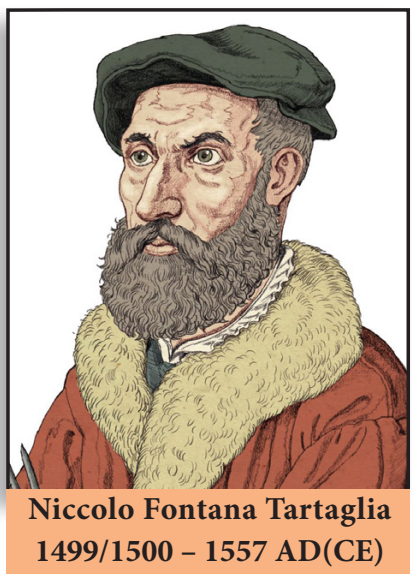

> "A person who can, within a year, solve $x^2-92y^2=1$ is a mathematician" — Brahmagupta

Niccolo Fontana Tartaglia was an Italian mathematician, engineer, surveyor and bookkeeper from then Republic of Venice (now Italy). He published many books, including the first Italian translations of Archimedes and Euclid, and an acclaimed compilation of mathematics. Tartaglia was the first to apply mathematics to the investigation of the paths of cannonballs; his work was later validated by Galileo's studies on falling bodies.

Tartaglia along with Cardano were credited for finding methods to solve any third degree polynomials called cubic equations. He also provided a nice formula for calculating volume of any tetrahedron using distance between pairs of its four vertices.

