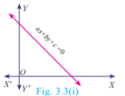
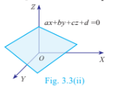

### 3.2 Simultaneous Linear Equations in Three Variables

Right from the primitive needs of calculating amount spent for various items in a super market, finding ages of people under specific conditions, finding path of an object when it is thrown upwards at an angle, Algebra plays a vital role in our daily life.

Any point in the space can be determined uniquely by knowing its latitude, longitude and altitude. Hence to locate the position of an object at a particular place situated on the Earth, three satellites are positioned to arrive three equations. Among these three equations, we get two linear equations and one quadratic (second degree) equation. Hence we can solve for the variables latitude, longitude and altitude to uniquely fix the position of any object at a given point of time. This is the basis of Global Positioning System (GPS). Hence the concept of linear equations in three variables is used in GPS systems.

Fig. 3.2

Global Positioning System (GPS). Hence the concept of linear equations in three variables is used in GPS systems.

### 3.2.1 System of Linear Equations in Three Variables

In earlier classes, we have learnt different methods of solving Simultaneous Linear Equations in two variables. Here we shall learn to solve the system of linear equations in three variables namely, \(x\), \(y\) and \(z\). The general form of a linear equation in three variables \(x\), \(y\) and \(z\) is \(ax + by + cz + d = 0\) where \(a\), \(b\), \(c\), \(d\) are real numbers, and atleast one of \(a\), \(b\), \(c\) is non-zero.

**Note**

A linear equation in two variables of the form \(ax + by + c = 0\), represents a straight line.

Fig. 3.3(i)

A linear equation in three variables of the form \(ax + by + cz + d = 0\), represents a plane.

Fig. 3.3(ii)

**General Form:** A system of linear equations in three variables \(x, y, z\) has the general form

\[
a_1x + b_1y + c_1z + d_1 = 0
\]

\[
a_2x + b_2y + c_2z + d_2 = 0
\]

\[
a_3x + b_3y + c_3z + d_3 = 0
\]

Each equation in the system represents a plane in three dimensional space and solution of the system of equations is precisely the point of intersection of the three planes defined by the three linear equations of the system. The system may have only one solution, infinitely many solutions or no solution depending on how the planes intersect one another.

The figures presented below illustrate each of these possibilities.

Fig. 3.4

**Procedure for solving system of linear equations in three variables**

**Step 1:** By taking any two equations from the given three, first multiply by some suitable non-zero constant to make the coefficient of one variable (either \(x\) or \(y\) or \(z\)) numerically equal.

**Step 2:** Eliminate one of the variables whose coefficients are numerically equal from the equations.

**Step 3:** Eliminate the same variable from another pair.

**Step 4:** Now we have two equations in two variables.

**Step 5:** Solve them using any method studied in earlier classes.

**Step 6:** The remaining variable is then found by substituting in any one of the given equations.

**Note**

* If you obtain a false equation such as \(0 = 1\), in any of the steps then the system has no solution.

* If you do not obtain a false solution, but obtain an identity, such as \(0 = 0\) then the system has infinitely many solutions.

**Example 3.3** Solve the following system of linear equations in three variables

\[
3x - 2y + z = 2, \quad 2x + 3y - z = 5, \quad x + y + z = 6
\]

**Solution** \(3x - 2y + z = 2\) ...(1)

\(2x + 3y - z = 5\) ...(2)

\(x + y + z = 6\) ...(3)

Adding (1) and (2),

$$\begin{array}{rll}
3x - 2y + z &= 2 \\
2x + 3y - z &= 5 & (+) \\
\hline
5x + y &= 7 & \dots(4)
\end{array}$$

Adding (2) and (3),

$$\begin{array}{rll}
2x + 3y - z &= 5 \\
x + y + z &= 6 & (+) \\
\hline
3x + 4y &= 11 & \dots(5)
\end{array}$$

$4 \times (4) - (5)$

$$\begin{array}{rll}
20x + 4y &= 28 \\
3x + 4y &= 11 & (-) \\
\hline
17x &= 17 & \Rightarrow x = 1
\end{array}$$

Substituting $x = 1$ in (4), $5 + y = 7 \Rightarrow y = 2$

Substituting $x = 1, y = 2$ in (3), $1 + 2 + z = 6$ we get, $z = 3$

Therefore, $\quad x = 1, y = 2, z = 3$

**Example 3.4** In an interschool atheletic meet, with total of 24 individual prizes, securing a total of 56 points, a first place secures 5 points, a second place secures 3 points, and a third place secures 1 point. Having as many third place finishers as first and second place finishers, find how many athletes finished in each place.

**Solution** Let the number of I, II and III place finishers be $x$, $y$ and $z$ respectively.

Total number of prizes $= 24$; Total number of points $= 56$.

Hence, the linear equations in three variables are

$$x + y + z = 24 \quad \dots(1) \qquad 5x + 3y + z = 56 \quad \dots(2) \qquad x + y = z \quad \dots(3)$$

Substituting (3) in (1) we get, $z + z = 24 \Rightarrow z = 12$

$\therefore$ (3) will be, $x + y = 12$

$$\begin{array}{lrl}
(2) \Rightarrow & 5x + 3y &= 44 \\
3 \times (3) \Rightarrow & 3x + 3y &= 36 \quad (-) \\
\hline
& 2x &= 8 \quad \text{we get, } x = 4
\end{array}$$

Substituting $x = 4, z = 12$ in (3) we get, $y = 12 - 4 = 8$

Therefore, Number of first place finishers is 4

Number of second place finishers is 8

Number of third place finishers is 12.

**Example 3.5** Solve $x + 2y - z = 5$; $x - y + z = -2$; $-5x - 4y + z = -11$

**Solution** $\quad x + 2y - z = 5 \dots(1) \quad x - y + z = -2 \dots(2) \quad -5x - 4y + z = -11 \quad \dots(3)$

Adding $(1)$ and $(2)$ we get,

$$\begin{aligned}
x + 2y - z &= 5 \\
x - y + z &= -2 \quad (+) \\
\hline
2x + y \quad &= 3 \quad \dots(4)
\end{aligned}$$

Subtracting $(2)$ and $(3)$,

$$\begin{aligned}
x - y + z &= -2 \\
-5x - 4y + z &= -11 \quad (-) \\
\hline
6x + 3y \quad &= 9
\end{aligned}$$

Dividing by $3 \quad 2x + y = 3 \quad \dots(5)$

Subtracting $(4)$ and $(5)$,

$$\begin{aligned}
2x + y &= 3 \\
2x + y &= 3 \\
\hline
0 &= 0
\end{aligned}$$

Here, we arrive at an identity $0 = 0$.

Hence, the system has an infinite number of solutions.

**Example 3.6** Solve $3x + y - 3z = 1$; $-2x - y + 2z = 1$; $-x - y + z = 2$.

**Solution** $\quad 3x + y - 3z = 1 \quad \dots(1) \quad -2x - y + 2z = 1 \quad \dots(2) \quad -x - y + z = 2 \quad \dots(3)$

Adding $(1)$ and $(2)$,

$$\begin{aligned}
3x + y - 3z &= 1 \\
-2x - y + 2z &= 1 \quad (+) \\
\hline
x \quad - \quad z &= 2 \quad \dots(4)
\end{aligned}$$

Adding $(1)$ and $(3)$,

$$\begin{aligned}
3x + y - 3z &= 1 \\
-x - y + z &= 2 \quad (+) \\
\hline
2x - 2z &= 3 \quad \dots(5)
\end{aligned}$$

Now, $(5) - 2 \times (4)$ we get,

$$\begin{aligned}
2x - 2z &= 3 \\
2x - 2z &= 4 \quad (-) \\
\hline
0 &= -1
\end{aligned}$$

Here, we arrive at a contradiction as $0 \neq -1$.

This means that the system is inconsistent and has no solution.

**Example 3.7** Solve $\frac{x}{2} - 1 = \frac{y}{6} + 1 = \frac{z}{7} + 2$; $\frac{y}{3} + \frac{z}{2} = 13$

**Solution** Considering, $\frac{x}{2} - 1 = \frac{y}{6} + 1$

$$\frac{x}{2} - \frac{y}{6} = 1 + 1 \Rightarrow \frac{6x - 2y}{12} = 2 \text{ we get, } 3x - y = 12 \quad \dots (1)$$

Considering, $\frac{x}{2} - 1 = \frac{z}{7} + 2$

$$\frac{x}{2} - \frac{z}{7} = 1 + 2 \Rightarrow \frac{7x - 2z}{14} = 3 \text{ we get, } 7x - 2z = 42 \quad \dots (2)$$

Also, from $\frac{y}{3} + \frac{z}{2} = 13 \Rightarrow \frac{2y + 3z}{6} = 13 \text{ we get, } 2y + 3z = 78 \quad \dots (3)$

Eliminating $z$ from $(2)$ and $(3)$

$$\begin{aligned}
(2) \times 3 \Rightarrow & & 21x \quad\quad - 6z &= 126 \\
(3) \times 2 \Rightarrow & & 4y + 6z &= 156 \quad (+) \\
\hline
& & 21x + 4y \quad\quad &= 282 \\
(1) \times 4 \Rightarrow & & 12x - 4y \quad\quad &= 48 \quad (+) \\
\hline
& & 33x \quad\quad\quad\quad &= 330 \quad \text{so, } x = 10
\end{aligned}$$

Substituting $x = 10$ in $(1)$, $30 - y = 12$ we get, $y = 18$

Substituting $x = 10$ in $(2)$, $70 - 2z = 42$ then, $z = 14$

$\therefore x = 10, \, y = 18, \, z = 14\,.$

**Example 3.8** Solve : $\frac{1}{2x} + \frac{1}{4y} - \frac{1}{3z} = \frac{1}{4}$; $\frac{1}{x} = \frac{1}{3y}$; $\frac{1}{x} - \frac{1}{5y} + \frac{4}{z} = 2\frac{2}{15}$

**Solution** Let $\frac{1}{x} = p$ , $\frac{1}{y} = q$ , $\frac{1}{z} = r$

The given equations are written as

$$\begin{aligned}
\frac{p}{2} + \frac{q}{4} - \frac{r}{3} &= \frac{1}{4} \\
p &= \frac{q}{3} \\
p - \frac{q}{5} + 4r &= 2\frac{2}{15} = \frac{32}{15}
\end{aligned}$$

By simplifying we get,

$$6p + 3q - 4r = 3 \quad \dots(1)$$

$$3p = q \quad \dots(2)$$

$$15p - 3q + 60r = 32 \quad \dots(3)$$

Substituting $(2)$ in $(1)$ and $(3)$ we get,

$$15p - 4r = 3 \quad \dots(4)$$

$$6p + 60r = 32 \text{ reduces to } 3p + 30r = 16 \quad \dots(5)$$

Solving $(4)$ and $(5)$,

$$\begin{aligned}
15p - 4r &= 3 \\
15p + 150r &= 80 \quad (-) \\
\hline
-154r &= -77 \quad \text{we get, } r = \frac{1}{2}
\end{aligned}$$

Substituting $r = \frac{1}{2}$ in $(4)$ we get, $15p - 2 = 3 \Rightarrow p = \frac{1}{3}$

From $(2)$, $q = 3p$ we get $q = 1$

Therefore, $x = \frac{1}{p} = 3, \quad y = \frac{1}{q} = 1, \quad z = \frac{1}{r} = 2$. i.e., $x = 3, y = 1, z = 2$.

**Example 3.9** The sum of thrice the first number, second number and twice the third number is $5$. If thrice the second number is subtracted from the sum of first number and thrice the third we get $2$. If the third number is subtracted from the sum of twice the first, thrice the second, we get $1$. Find the numbers.

**Solution** Let the three numbers be $x$, $y$, $z$

From the given data we get the following equations,
$3x + y + 2z = 5 \dots(1) \quad\quad x + 3z - 3y = 2 \quad\quad \dots(2) \quad\quad 2x + 3y - z = 1 \dots(3)$

$$\begin{aligned}
(1) \times 1 \Rightarrow & & 3x + y + 2z &= 5 \\
(2) \times 3 \Rightarrow & & 3x - 9y + 9z &= 6 \quad (-) \\
\hline
& & 10y - 7z &= -1 \quad \dots(4)
\end{aligned}$$

$$\begin{aligned}
(1) \times 2 \Rightarrow & & 6x + 2y + 4z &= 10 \\
(3) \times 3 \Rightarrow & & 6x + 9y - 3z &= 3 \quad (-) \\
\hline
& & -7y + 7z &= 7 \quad \dots(5)
\end{aligned}$$

Adding $(4)$ and $(5)$,

$$\begin{aligned}
10y - 7z &= -1 \\
-7y + 7z &= 7 \\
\hline
3y \quad\quad &= 6 \Rightarrow y = 2
\end{aligned}$$

Substituting $y = 2$ in $(5)$, $-14 + 7z = 7 \Rightarrow z = 3$

Substituting $y = 2$ and $z = 3$ in $(1)$,

$$3x + 2 + 6 = 5 \text{ we get } x = -1$$

Therefore, $x = -1$, $y = 2$, $z = 3$.

 **Thinking Corner**
 1. The number of possible solutions when solving system of linear equations in three variables are _______.
 2. If three planes are parallel then the number of possible point(s) of intersection is/are _______.
 

## Progress Check

1. For a system of linear equations in three variables the minimum number of equations required to get unique solution is ______.

2. A system with ______ will reduce to identity.

3. A system with ______ will provide absurd equation.

## Exercise 3.1

1. Solve the following system of linear equations in three variables

(i) \(x + y + z = 5; \quad 2x - y + z = 9; \quad x - 2y + 3z = 16\)

(ii) \(\frac{1}{x} - \frac{2}{y} + 4 = 0; \quad \frac{1}{y} - \frac{1}{z} + 1 = 0; \quad \frac{2}{z} + \frac{3}{x} = 14\)

(iii) \(x + 20 = \frac{3y}{2} + 10 = 2z + 5 = 110 - (y + z)\)

2. Discuss the nature of solutions of the following system of equations

(i) \(x + 2y - z = 6; \quad -3x - 2y + 5z = -12; \quad x - 2z = 3\)

(ii) \(2y + z = 3(-x + 1); \quad -x + 3y - z = -4; \quad 3x + 2y + z = -\frac{1}{2}\)

(iii) \(\frac{y + z}{4} = \frac{z + x}{3} = \frac{x + y}{2}; \quad x + y + z = 27\)

3. Vani, her father and her grand father have an average age of 53. One-half of her grand father's age plus one-third of her father's age plus one fourth of Vani's age is 65. Four years ago if Vani's grandfather was four times as old as Vani then how old are they all now?

4. The sum of the digits of a three-digit number is 11. If the digits are reversed, the new number is 46 more than five times the former number. If the hundreds digit plus twice the tens digit is equal to the units digit, then find the original three digit number?

5. There are 12 pieces of five, ten and twenty rupee currencies whose total value is ₹105. When first 2 sorts are interchanged in their numbers its value will be increased by ₹20. Find the number of currencies in each sort.

---
