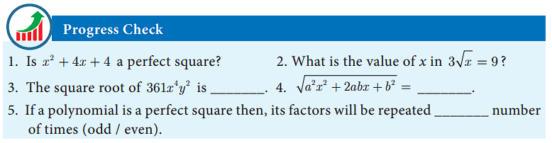
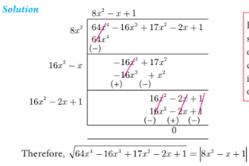
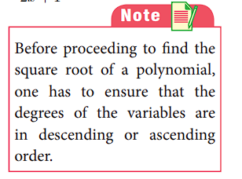
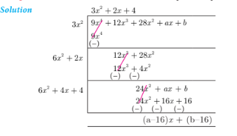

## 3.5 Square Root of Polynomials

The square root of a given positive real number is another number which when multiplied with itself is the given number.

Similarly, the square root of a given expression p(x) is another expression q(x) which when multiplied by itself gives p(x), that is, q(x) × q(x) = p(x).

So, |q(x)| = √p(x) where |q(x)| is the absolute value of q(x).

The following two methods are used to find the square root of a given expression:
- (i) Factorization method
- (ii) Division method

### 3.5.1 Find the Square Root by Factorization Method

### Example 3.19

Find the square root of the following expressions:
- (i) 256(x-a)⁸(x-b)⁴(x-c)¹⁶(x-d)²⁰
- (ii) (144a⁸b¹²c¹⁶)/(81f¹²g⁴h¹⁴)

**Solution:**

**(i)** √[256(x-a)⁸(x-b)⁴(x-c)¹⁶(x-d)²⁰]
= 16(x-a)⁴(x-b)²(x-c)⁸(x-d)¹⁰

**(ii)** √[(144a⁸b¹²c¹⁶)/(81f¹²g⁴h¹⁴)]
= (12a⁴b⁶c⁸)/(9f⁶g²h⁷)
= (4a⁴b⁶c⁸)/(3f⁶g²h⁷)

### Example 3.20

Find the square root of the following expressions:
- (i) 16x⁴ - 24x³y + 25x²y² - 24xy³ + 16y⁴
- (ii) (6x² - x - 1)(3x² - 2x - 1)(2x² - 3x + 1)
- (iii) [√15x² + (√3 + √10)x + √2][√5x² + (2√5 + 1)x + 2][√3x² + (√2 + 2√3)x + 2√2]

**Solution:**

**(i)** 16x⁴ - 24x³y + 25x²y² - 24xy³ + 16y⁴
= (4x² - 3xy + 4y²)²

√ = |4x² - 3xy + 4y²|

**(ii)** Factorizing each:
- 6x² - x - 1 = (3x + 1)(2x - 1)
- 3x² - 2x - 1 = (3x + 1)(x - 1)
- 2x² - 3x + 1 = (2x - 1)(x - 1)

Product = (3x+1)²(2x-1)²(x-1)²
√ = |(3x+1)(2x-1)(x-1)|

**(iii)** After factorization:
First: (√5x + 1)(√3x + √2)
Second: (√5x + 1)(x + 2)
Third: (x + 2)(√3x + √2)

Product = (√5x+1)²(x+2)²(√3x+√2)²
√ = |(√5x+1)(x+2)(√3x+√2)|

## Exercise 3.7

1. Find the square root of the following rational expressions.
   - (i) (400x⁴y¹²z¹⁶)/(100x⁸y⁴z⁴)
   - (ii) (7x² + 2√14x + 2)/(x² - x/2 + 1/16)
   - (iii) [121(a+b)⁸(x+y)⁸(b-c)⁸]/[81(b-c)⁴(a-b)¹²(b-c)⁴]

2. Find the square root of the following
   - (i) 4x² + 20x + 25
   - (ii) 9x² - 24xy + 16y² + 30xz - 40yz + 25z²
   - (iii) (4x² - 9x + 2)(7x² - 13x - 2)(28x² - 3x - 1)
   - (iv) [2x² + (17/6)x + 1][(3/2)x² + 4x + 2][(4/3)x² + (11/3)x + 2]

### 3.5.2 Finding the Square Root of a Polynomial by Division Method

The long division method in finding the square root of a polynomial is useful when the degree of the polynomial is higher.

### Example 3.21

Find the square root of 64x⁴ - 16x³ + 17x² - 2x + 1

**Solution:**

Using long division method:
√(64x⁴ - 16x³ + 17x² - 2x + 1) = |8x² - x + 1|

### Example 3.22

If 9x⁴ + 12x³ + 28x² + ax + b is a perfect square, find the values of a and b.

**Solution:**

Using division method, we find:
a - 16 = 0, b - 16 = 0
Therefore, a = 16, b = 16.

## Exercise 3.8

1. Find the square root of the following polynomials by division method
   - (i) x⁴ - 12x³ + 42x² - 36x + 9
   - (ii) 37x⁴ - 28x³ + 4x² + 42x + 9
   - (iii) 16x⁴ + 8x² + 1
   - (iv) 121x⁴ - 198x³ - 183x² + 216x + 144

2. Find the values of a and b if the following polynomials are perfect squares
   - (i) 4x⁴ - 12x³ + 37x² + bx + a
   - (ii) ax⁴ + bx³ + 36x² + 12x + 20

3. Find the values of m and n if the following polynomials are perfect squares
   - (i) 36x⁴ - 60x³ + 61x² - mx + n
   - (ii) x⁴ - 8x³ + mx² + nx + 16
