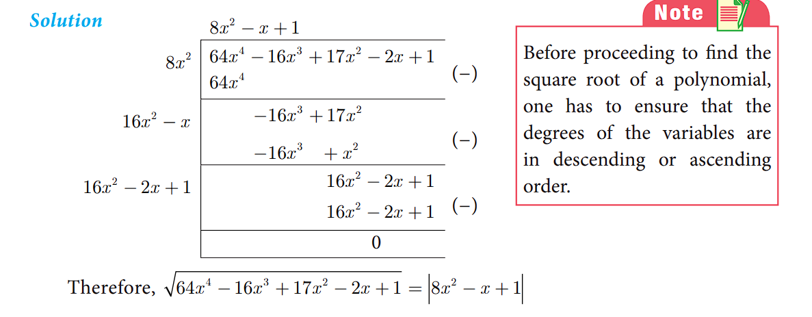


# Square Root of Polynomials

The ==square root== of a given positive real number is another number which when multiplied with itself is the given number.
Similarly, the square root of a given expression p(x) is another expression q(x) which when multiplied by itself gives p(x), that is, q(x). q(x) = p(x)
So,\\(|q(x)|\\) = \\(\sqrt{p(x)}\\) where \\(|q(x)|\\) is the absolute value of q(x).

The following two methods are used to find the square root of a given expression
(i) Factorization method (ii) Division method

## Find the Square Root by Factorization Method
**Example 3.19** Find the square root of the following expressions

(i)\\( 256(x-1)^8(x-b)^4(x-c)^{16}(x-d)^{20} \\) 
(ii)\\(\frac{144a^8b^{12}c^{16}}{81f^{12}g^4h^{14}}\\) 

**Solution** 
(i)\\(\sqrt{256(x-1)^8(x-b)^4(x-c)^{16}(x-d)^{20}} \\) = \\( 16|(x-1)^4(x-b)^2(x-c)^{8}(x-d)^{10}| \\) 

(ii)\\(\sqrt{\frac{144a^8b^{12}c^{16}}{81f^{12}g^4h^{14}}}\\) =\\(\frac{4}{3}\\)\\( \Big| \frac{a^4b^6c^8}{f^6g^2h^7} \Big|\\) 

**Example 3.20** Find the square root of the following expressions

(i) \\( 16x^2+9y^2-24xy+24x=18y+9\\)

(ii) \\( (6x^2+x-1)(3x^2+2x-1)(2x^2+3x+1) \\)

(iii) \\( [\sqrt{15}x^2+(\sqrt3 + \sqrt10)x + \sqrt2] [\sqrt{5}x^2 + (2\sqrt5 + 1)x+2 ] [\sqrt3x^2 + (\sqrt2+2\sqrt3)x+2\sqrt2] \\)

**Solution** 

(i) \\(\sqrt{16x^2+9y^2-24xy+24x=18y+9}\\)

=\\( \sqrt{(4x)^2 + (-3y)^2 + (3)^2 + 2(4x)(-3y)+2(-3y)(3)+2(4x)(3)}\\)

=\\( \sqrt{(4x-3y+3)^2} = |4x-3y+3| \\)

(ii) \\( \sqrt{(6x^2+x-1)(3x^2+2x-1)(2x^2+3x+1)} \\)

=\\( \sqrt{(3x-1)(2x+1)(3x-1)(x+1)(2x+1)(x+1)} \\) = \\( |(3x-1)(2x+1)(x+1)| \\)

(iii) First let us factorize the polynomials

\\( \sqrt{15}x^2+(\sqrt3 + \sqrt10)x + \sqrt2 \\)

=\\( \sqrt{15}x^2+\sqrt3x+\sqrt{10}x+\sqrt2 \\)

=\\( \sqrt3x(\sqrt5x+1)+\sqrt2(\sqrt5x+1) \\)

=\\( (\sqrt5x+1)×(\sqrt3x+\sqrt2) \\)

 \\( \sqrt{5}x^2 + (2\sqrt5 + 1)x+2 \\) =  \\( \sqrt{5}x^2 + 2\sqrt5x+x+2 \\)

 =\\( \sqrt5x(x+2)+1(x+2) \\)
 =\\( (\sqrt5x+1) (x+2) \\)

 \\( \sqrt3x^2 + (\sqrt2+2\sqrt3)x+2\sqrt2 \\)= \\( \sqrt3x^2 + \sqrt2x+2\sqrt3x+2\sqrt2 \\)

 =\\( x(\sqrt3x+\sqrt2)+2(\sqrt3x+\sqrt2) \\)=\\( (x+2)(\sqrt3x+\sqrt2) \\)

 Therefore,

 \\( \sqrt{\big[ \sqrt15x^2 + (\sqrt3+\sqrt10)x + \sqrt2 \big][\sqrt5x^2+(2\sqrt5+1)x+2][\sqrt3x^2+(\sqrt2+2\sqrt3)x+2\sqrt2]  }\\)
 
 =\\( \sqrt{(\sqrt5x+1)(\sqrt3x+\sqrt2)(\sqrt5x+1)(x+2)(\sqrt3x+\sqrt2)(x+2)}  \\)

=\\( \big|(\sqrt5x+1)(\sqrt3x+\sqrt2)(x+2)\big| \\)

**Exercise 3.7**

1. Find the square root of the following rational expressions.

(i) \\(\frac{400x^4y^{12}z^{16}}{100x^8y^4z^4}\\) 
(ii) \\(\frac{7x^2+2\sqrt14x+2}{x^2-\frac{1}{2}x+\frac{1}{16}}\\) 
(iii) \\(\frac{121(a+b)^8(x+y)^8(b-c)^8}{81(b-c)^4(a-b)^{12}(b-c)^4}\\) 

2. Find the square root of the following

(i) \\( 4x^2+20x+25 \\)
(ii) \\( 9x^2-24xy+30xz-40yz+25z^2+16y^2\\)

(iii) \\( (4x^2-9x+2)(7x^2-13x-2)(28x^2-3x-1)\\)

(iv) \\( [2x^2+\frac{17}{6}x+1][\frac{3}{2}x^2+4x+2][\frac{4}{3}x^2+\frac{11}{3}x+2] \\)

## Finding the Square Root of a Polynomial by Division Method

The long division method in finding the square root of a polynomial is useful when the degree of the polynomial is higher.

**Example 3.21** Find the square root of \\( 64x^4-16x^3+17x^2-2x+1 \\)

**Example 3.22** If \\( 9x^4+12x^3+28x^2+ax+b\\)  is a perfect square, find the values of a and b.

**Solution** 

Because the given polynomial is a perfect square a-16=0, b-16=0 Therefore a=16, b=16

**Exercise 3.8**

1. Find the square root of the following polynomials by division method

(i)\\(  x^4-12x^3+42x^2-36x+9 \\)
(ii) \\( 37x^2-28x^3+4x^4+42x+9\\)
(iii) \\( 16x^4+8x^2+1\\)
(iv) \\( 121x^4-198x^3-183x^2+216x+144\\)

2. Find the values of a and b if the following polynomials are perfect squares

(i) \\( 4x^4-12x^3+37x^2+bx+a\\)

(ii) \\( ax^4+bx^3+361x^2+220x+100\\)

3. Find the values of m and n if the following polynomials are perfect sqaures

(i) \\( 36x^4-60x^3+61x^2-mx+n\\)
(ii) \\( x^4-8x^3+mx^2+nx+16  \\)