## 5.4 Inclination of a Line

The **inclination** of a line or the **angle of inclination** of a line is the angle which a straight line makes with the positive direction of X-axis measured in the counter-clockwise direction to the part of the line above the X-axis. The inclination of the line is usually denoted by \theta.

> **Note:**
> - The inclination of X-axis and every line parallel to X-axis is 0°.
> - The inclination of Y-axis and every line parallel to Y-axis is 90°.

### 5.4.1 Slope of a Straight line

While laying roads one must know how steep the road will be. Similarly, when constructing a staircase, we should consider its steepness. For the same reason, anyone travelling along a hill or a bridge, feels hard compared to travelling along a plain road.

All these examples illustrate one important aspect called **"Steepness"**. The measure of steepness is called **slope** or **gradient**.
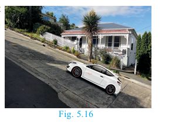

The concept of slope is important in economics because it is used to measure the rate at which the demand for a product changes in a given period of time on the basis of its price. Slope comprises of two factors namely steepness and direction.

#### Definition

If \theta is the angle of inclination of a non-vertical straight line, then \tan\theta is called the **slope** or **gradient** of the line and is denoted by m.

Therefore the slope of the straight line is:


m = \tan\theta, \quad 0° \leq \theta \leq 180°, \quad \theta \neq 90°


#### To find the slope of a straight line when two points are given
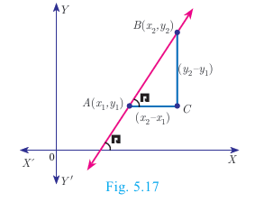


\text{Slope } m = \tan\theta = \frac{\text{opposite side}}{\text{adjacent side}} = \frac{BC}{AC} = \frac{y_2 - y_1}{x_2 - x_1}



\text{Slope } m = \frac{\text{Difference in y coordinates}}{\text{Difference in x coordinates}}


> **Note:**
> - The slope of a vertical line is **undefined**.
> - The slope of the line through (x_1, y_1) and (x_2, y_2) with x_1 \neq x_2 is \frac{y_2 - y_1}{x_2 - x_1}.

#### Values of slopes

| S.No. | Condition | Slope | Diagram |
|-------|-----------|-------|---------|
| (i) | \theta = 0° | m = 0 | The line is parallel to the positive direction of X axis. |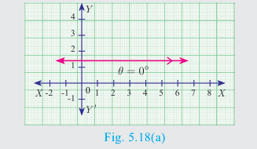|
| (ii) | 0° < \theta < 90° | m > 0 (positive) | The line has positive slope (A line with positive slope rises from left to right). |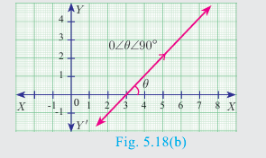
| (iii) | 90° < \theta < 180° | m < 0 (negative) | The line has negative slope (A line with negative slope falls from left to right). |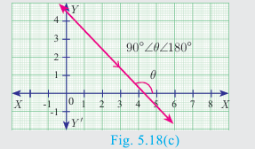
| (iv) | \theta = 180° | m = 0 | The line is parallel to the negative direction of X axis. |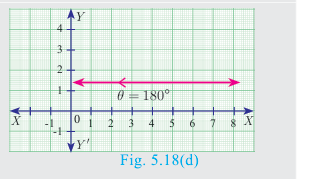
| (v) | \theta = 90° | undefined | The slope is undefined. |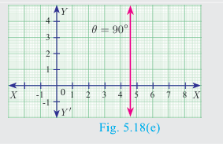

---

## Activity 3

The diagram contains four lines l_1, l_2, l_3 and l_4.

(i) Which lines have positive slope?
(ii) Which lines have negative slope?

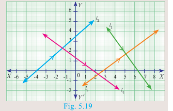

---

## Progress Check

Write down the slope of each of the lines shown on the grid below. One is solved for you.

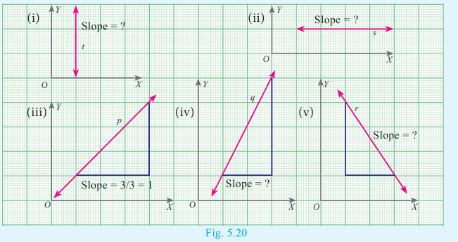

**Solution (iii):** Slope of the line p = \frac{\text{Difference in y coordinate}}{\text{Difference in x coordinate}} = \frac{3}{3} = 1

---

## 5.4.2 Slopes of parallel lines

Two non-vertical lines are parallel if and only if their slopes are equal.
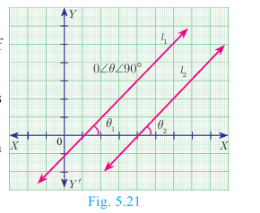

Let l_1 and l_2 be two non-vertical lines with slopes m_1 and m_2 respectively.

Let the inclination of the lines with positive direction of X axis be \theta_1 and \theta_2 respectively.

Assume, l_1 and l_2 are parallel.


\theta_1 = \theta_2 \text{ (Since, } \theta_1, \theta_2 \text{ are corresponding angles)}



\tan\theta_1 = \tan\theta_2



m_1 = m_2


Hence, the slopes are equal. Therefore, non-vertical parallel lines have equal slopes.

### Conversely

Let the slopes be equal, then m_1 = m_2


\tan\theta_1 = \tan\theta_2



\theta_1 = \theta_2 \text{ (since } 0° \leq \theta_1, \theta_2 \leq 180°)


That is the corresponding angles are equal.

Therefore, l_1 and l_2 are parallel.

Thus, non-vertical lines having equal slopes are parallel.

**Hence, non vertical lines are parallel if and only if their slopes are equal.**

---

## 5.4.3 Slopes of perpendicular lines

Two non-vertical lines with slopes m_1 and m_2 are perpendicular if and only if m_1 \cdot m_2 = -1.
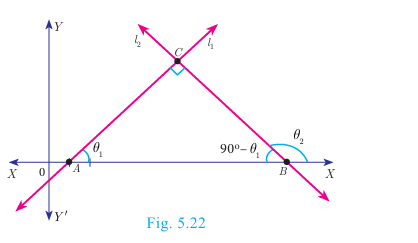
Let l_1 and l_2 be two non-vertical lines with slopes m_1 and m_2 respectively. Let their inclinations be \theta_1 and \theta_2 respectively.

Then m_1 = \tan\theta_1 and m_2 = \tan\theta_2

First we assume that, l_1 and l_2 are perpendicular to each other.

Then \angle ABC = 90° - \theta_1 (sum of angles of \triangle ABC is 180°)

Now measuring slope of l_2 through angles \theta_2 and 90° - \theta_1, which are opposite to each other, we get:


\tan\theta_2 = -\tan(90° - \theta_1) = -\frac{\sin(90° - \theta_1)}{\cos(90° - \theta_1)} = -\frac{\cos\theta_1}{\sin\theta_1} = -\cot\theta_1



\tan\theta_2 = -\frac{1}{\tan\theta_1}



\tan\theta_1 \cdot \tan\theta_2 = -1


Thus, when the line l_1 is perpendicular to line l_2 then m_1 \cdot m_2 = -1.

### Conversely

Let l_1 and l_2 be two non-vertical lines with slopes m_1 and m_2 respectively, such that m_1 \cdot m_2 = -1.

Since m_1 = \tan\theta_1, m_2 = \tan\theta_2

We have \tan\theta_1 \cdot \tan\theta_2 = -1


\tan\theta_2 = -\frac{1}{\tan\theta_1} = -\cot\theta_1 = \tan(90° + \theta_1)



\theta_2 = 90° + \theta_1


But in \triangle ABC, \theta_2 = \angle C + \theta_1

Therefore, \angle C = 90°

> **Note:** In any triangle, exterior angle is equal to sum of the interior opposite angles.

> **KNOW?** Let l_1 and l_2 be two lines with well-defined slopes m_1 and m_2 respectively, then:
> - (i) l_1 is parallel to l_2 if and only if m_1 = m_2.
> - (ii) l_1 is perpendicular to l_2 if and only if m_1 \cdot m_2 = -1.

---

### Example 5.8

(i) What is the slope of a line whose inclination is 30°?
(ii) What is the inclination of a line whose slope is \sqrt{3}?

**Solution:**

(i) Here \theta = 30°

Slope m = \tan\theta

Therefore, slope m = \tan 30° = \frac{1}{\sqrt{3}}.

(ii) Given m = \sqrt{3}, let \theta be the inclination of the line


\tan\theta = \sqrt{3}


We get, \theta = 60°

---

### Thinking Corner

The straight lines X-axis and Y-axis are perpendicular to each other. Is the condition m_1 \cdot m_2 = -1 true?

---

### Example 5.9

Find the slope of a line joining the given points

(i) (-6,1) and (-3,2)
(ii) \left(-\frac{1}{3}, \frac{1}{2}\right) and \left(\frac{2}{7}, \frac{3}{7}\right)
(iii) (14,10) and (14,-6)

**Solution:**

(i) (-6,1) and (-3,2)

The slope = \frac{y_2 - y_1}{x_2 - x_1} = \frac{2-1}{-3+6} = \frac{1}{3}

(ii) \left(-\frac{1}{3}, \frac{1}{2}\right) and \left(\frac{2}{7}, \frac{3}{7}\right)

The slope = \frac{\frac{3}{7} - \frac{1}{2}}{\frac{2}{7} + \frac{1}{3}} = \frac{\frac{6-7}{14}}{\frac{6+7}{21}} = -\frac{1}{14} \times \frac{21}{13} = -\frac{3}{26}

(iii) (14,10) and (14,-6)

The slope = \frac{-6-10}{14-14} = \frac{-16}{0}

The slope is **undefined**.

---

## Progress Check

Fill in the missing boxes

| S.No. | Points | Slope |
|-------|--------|-------|
| 1 | A(-a, b), B(3a, -b) | |
| 2 | A(2, 3), B(\_, \_) | 2 |
| 3 | A(\_, \_), B(\_, \_) | 0 |
| 4 | A(\_, \_), B(\_, \_) | undefined |

---

### Example 5.10

The line r passes through the points (-2,2) and (5,8) and the line s passes through the points (-8,7) and (-2,0). Is the line r perpendicular to s?

**Solution:**

The slope of line r is m_1 = \frac{8-2}{5+2} = \frac{6}{7}

The slope of line s is m_2 = \frac{0-7}{-2+8} = \frac{-7}{6}

The product of slopes = \frac{6}{7} \times \frac{-7}{6} = -1

That is, m_1 \cdot m_2 = -1

Therefore, the line r is perpendicular to line s.

---

### Example 5.11

The line p passes through the points (3,-2), (12,4) and the line q passes through the points (6,-2) and (12,2). Is p parallel to q?

**Solution:**

The slope of line p is m_1 = \frac{4+2}{12-3} = \frac{6}{9} = \frac{2}{3}

The slope of line q is m_2 = \frac{2+2}{12-6} = \frac{4}{6} = \frac{2}{3}

Thus, slope of line p = slope of line q.

Therefore, line p is parallel to the line q.

---

### Example 5.12

Show that the points (-2,5), (6,-1) and (2,2) are collinear.

**Solution:** The vertices are A(-2,5), B(6,-1) and C(2,2).
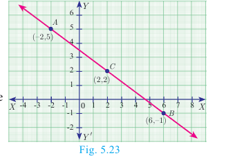

Slope of AB = \frac{-1-5}{6+2} = \frac{-6}{8} = -\frac{3}{4}

Slope of BC = \frac{2+1}{2-6} = \frac{3}{-4} = -\frac{3}{4}

We get, Slope of AB = Slope of BC

Therefore, the points A, B, C all lie in a same straight line.

Hence the points A, B and C are collinear.

---

### Example 5.13

Let A(1,-2), B(6,-2), C(5,1) and D(2,1) be four points

(i) Find the slope of the line segments (a) AB (b) CD
(ii) Find the slope of the line segments (a) BC (b) AD
(iii) What can you deduce from your answer.

**Solution:**

(i) (a) Slope of AB = \frac{y_2 - y_1}{x_2 - x_1} = \frac{-2+2}{6-1} = 0

(b) Slope of CD = \frac{1-1}{2-5} = \frac{0}{-3} = 0

(ii) (a) Slope of BC = \frac{1+2}{5-6} = \frac{3}{-1} = -3

(b) Slope of AD = \frac{1+2}{2-1} = \frac{3}{1} = 3

(iii) The slope of AB and CD are equal so AB, CD are parallel.

Similarly the lines AD and BC are not parallel, since their slopes are not equal. So, we can deduce that the quadrilateral ABCD is a **trapezium**.

> If the slopes of both the pairs of opposite sides are equal then the quadrilateral is a **parallelogram**.

---

### Example 5.14

Consider the graph representing growth of population (in crores). Find the slope of the line AB and hence estimate the population in the year 2030?

**Solution:** The points A(2005, 96) and B(2015, 100) are on the line AB.
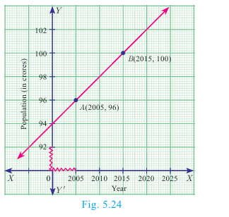


\text{Slope of } AB = \frac{100-96}{2015-2005} = \frac{4}{10} = \frac{2}{5}


Let the growth of population in 2030 be k crores.

Assuming that the point C(2030, k) is on AB,

we have, slope of AC = slope of AB


\frac{k-96}{2030-2005} = \frac{2}{5} \text{ gives } \frac{k-96}{25} = \frac{2}{5}



k - 96 = 10



k = 106


Hence the estimated population in 2030 = **106 Crores**.

---

### Example 5.15

Without using Pythagoras theorem, show that the points (1,-4), (2,-3) and (4,-7) form a right angled triangle.

**Solution:** Let the given points be A(1,-4), B(2,-3) and C(4,-7).


\text{The slope of } AB = \frac{-3+4}{2-1} = \frac{1}{1} = 1



\text{The slope of } AC = \frac{-7+4}{4-1} = \frac{-3}{3} = -1



\text{Slope of } AB \times \text{slope of } AC = (1)(-1) = -1


AB is perpendicular to AC. \angle A = 90°

Therefore, \triangle ABC is a right angled triangle.

---

## Thinking Corner

Provide three examples of using the concept of slope in real-life situations.

---

### Example 5.16

Prove analytically that the line segment joining the mid-points of two sides of a triangle is parallel to the third side and is equal to half of its length.

**Solution:** Let P(a,b), Q(c,d) and R(e,f) be the vertices of a triangle.
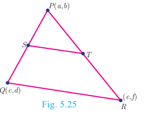

Let S be the mid-point of PQ and T be the mid-point of PR.

Therefore,


S = \left(\frac{a+c}{2}, \frac{b+d}{2}\right) \text{ and } T = \left(\frac{a+e}{2}, \frac{b+f}{2}\right)



\text{Slope of } ST = \frac{\frac{b+f}{2} - \frac{b+d}{2}}{\frac{a+e}{2} - \frac{a+c}{2}} = \frac{f-d}{e-c}


And slope of QR = \frac{f-d}{e-c}

Therefore, ST is parallel to QR. (since, their slopes are equal)

Also,


ST = \sqrt{\left(\frac{a+e}{2} - \frac{a+c}{2}\right)^2 + \left(\frac{b+f}{2} - \frac{b+d}{2}\right)^2}



= \sqrt{\frac{(e-c)^2}{4} + \frac{(f-d)^2}{4}} = \frac{1}{2}\sqrt{(e-c)^2 + (f-d)^2} = \frac{1}{2}QR


Thus ST is parallel to QR and half of it.

> **Note:** This example illustrates how a geometrical result can be proved using coordinate Geometry.

---

## Exercise 5.2

1. What is the slope of a line whose inclination with positive direction of x-axis is (i) 90° (ii) 0°

2. What is the inclination of a line whose slope is (i) 0 (ii) 1

3. Find the slope of a line joining the points
   - (i) (5,\sqrt{5}) with the origin
   - (ii) (\sin\theta, -\cos\theta) and (-\sin\theta, \cos\theta)

4. What is the slope of a line perpendicular to the line joining A(5,1) and P where P is the mid-point of the segment joining (4,2) and (-6,4).

5. Show that the given points are collinear: (-3,-4), (7,2) and (12,5)

6. If the three points (3,1), (a,3) and (1,-3) are collinear, find the value of a.

7. The line through the points (-2,a) and (9,3) has slope -\frac{1}{2}. Find the value of a.

8. The line through the points (-2,6) and (4,8) is perpendicular to the line through the points (8,12) and (x,24). Find the value of x.

9. Show that the given points form a right angled triangle.
   - (i) A(1,-4), B(2,-3) and C(4,-7)
   - (ii) L(0,5), M(9,12) and N(3,14)

10. Show that the given points form a parallelogram: A(2.5, 3.5), B(10,-4), C(2.5,-2.5) and D(-5,5)

11. If the points A(2,2), B(-2,-3), C(1,-3) and D(x,y) form a parallelogram then find the value of x and y.

12. Let A(3,-4), B(9,-4), C(5,-7) and D(7,-7). Show that ABCD is a trapezium.

13. A quadrilateral has vertices at A(-4,-2), B(5,-1), C(6,5) and D(-7,6). Show that the mid-points of its sides form a parallelogram.

---