>
> Apollonius was born at Perga, in modern day Turkey. His greatest work > was called “conics” which introduced curves like circle, parabola > geometrically. He wrote six other books all related to the basics of > modern day coordinate geometry.
>
> His ideas were applied to study planetary theory and solve practical
> problems. He developed the sundial and contributed to other
>
> **Apollonius**
>
> **262 - 190 BC (BCE)**
>
> branches of science using his exceptional geometric skills. For this
> reason, Apollonius is hailed as “The Great Geometer”.

- To find area of a triangle formed by three given points.

- To find area of a quadrilateral formed by four given points.

- To find the slope of a straight line.

- To determine equation of a straight line in various forms.

- To find the equation of a line parallel to the line *ax* + *by* + *c*
  = 0 .

- To find the equation of a line perpendicular to the line *ax* + *by* +
  *c* = 0 .

> **Learning Outcomes**

# 5.1 Introduction

> Coordinate geometry, also called Analytical geometry is a branch of > mathematics, in which curves in a plane are represented by algebraic > equations. For example, the equation *x* 2 + > *y*2 = 1 , describes a circle of unit radius in the plane. > Thus coordinate geometry can be seen as a branch of mathematics which > interlinks algebra and geometry, where algebraic equations are > represented by geometric curves. This connection makes it possible to > reformulate problems in geometry to problems in algebra and vice > versa. Thus, in coordinate geometry, the algebraic equations have > visual representations thereby making our understanding much deeper. > For instance, the first degree equation in two variables *ax* + *by* + > *c* = 0 represents a straight line in a plane. Overall, coordinate > geometry is a tool to understand concepts visually and created new > branches of mathematics in modern times.
>
> 

>
> In the earlier classes, we initiated the study of coordinate geometry > where we studied about coordinate axes, coordinate plane, plotting of > points in a plane, distance between two points, section formulae, etc. > All these concepts form the basics of coordinate geometry. Let us now > recall some of the basic formulae.
>

## Distance between two points

> Distance between two points *A*(*x*1,*y*1 ) and *B*(*x*2,*y*2 ) is
>
> B(*x*2*, y*2)

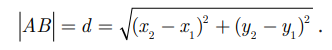

> Fig. 5.1

## Mid-point of line segment

> The mid-point *M*, of the line segment joining

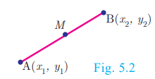

>

> 
## Section Formula
## Internal Division
>Let A(*x*1,*y*1)and B(*x*2,*y*2)be two distinct points such that point 
P (x ,y) divides AB internally in the ratio m:n.

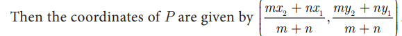
>
> A(*x*1, y1) Fig. 5.3

## External Division
>Let A(*x*1,*y*1)and B(*x*2,*y*2)be two distinct points such that point 
P (x ,y) divides AB externally in the ratio m:n.

## Centroid of a triangle
>The coordinates of the centroidG of a triangle with vertices.

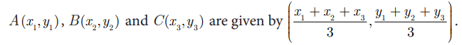

<table style="width:100%;">
<colgroup>
<col style="width: 8%" />
<col style="width: 20%" />
<col style="width: 13%" />
<col style="width: 8%" />
<col style="width: 12%" />
<col style="width: 9%" />
<col style="width: 14%" />
<col style="width: 11%" />
</colgroup>
<thead>
<tr class="header">
<th rowspan="2"><blockquote>

S.No.

</blockquote></th>
<th rowspan="2"><blockquote>

Points

</blockquote></th>
<th rowspan="2"><blockquote>

Distance

</blockquote></th>
<th rowspan="2"><blockquote>

Mid Point

</blockquote></th>
<th colspan="2"><blockquote>

Internal

</blockquote></th>
<th colspan="2"><blockquote>

External

</blockquote></th>
</tr>
<tr class="odd">
<th><blockquote>

Point

</blockquote></th>
<th><blockquote>

Ratio

</blockquote></th>
<th><blockquote>

Point

</blockquote></th>
<th><blockquote>

Ratio

</blockquote></th>
</tr>
</thead>
<tbody>
<tr class="odd">
<td><blockquote>

(i)

</blockquote></td>
<td><blockquote>

(3, 4), (5, 5)

</blockquote></td>
<td></td>
<td></td>
<td></td>
<td><blockquote>

2:3

</blockquote></td>
<td></td>
<td><blockquote>

2:3

</blockquote></td>
</tr>
<tr class="even">
<td><blockquote>

(ii)

</blockquote></td>
<td><blockquote>

(–7,13),(–3,1)

</blockquote></td>
<td></td>
<td></td>
<td><blockquote>

− <u>13/3</u> , 5

</blockquote></td>
<td></td>
<td><blockquote>

(–13, 15)

</blockquote></td>
<td></td>
</tr>
</tbody>
</table>

# 5.2 Area of a Triangle
>In your earlier classes, you have studied how 
to calculate the area of a triangle when its base and 
corresponding height (altitude) are given. You have used 
the formula
> Area of triangle= (1/2)× base × altitude sq.units.

> Fig. 5.6
>With any three non-collinear points A (*x*1,*y*1), 
B(*x*2,*y*2) and C(*y*3,*y*3)on a plane, we can form a triangle ABC

>Using distance between two points formula, we can calculate AB = c , BC = a , 
CA = b . a, b, c represent the lengths of the sides of the triangle ABC.
>Using 2s a = +b c + , we can calculate the area of triangle ABC by using the Heron’s formula s(s-a)(s-b)(s-c) But this procedure of finding length of sides of DABC
and then calculating its area will be a tedious procedure.

>There is an elegant way of finding area of a triangle 
using the coordinates of its vertices. We shall discuss 
such a method below.

>

>Let ABC be any triangle whose vertices are at A (*x*1,*y*1), 
B(*x*2,*y*2) and C(*x*3,*y*3)

>Draw AP, BQ and CR perpendiculars from A, B
and C to the x-axis, respectively. 
>Clearly ABQP, APRC and BQRC are all trapeziums

>Now from Fig.5.7, it is clear that
>Area of ABC= Area of trapezium ABQP + Area of trapezium APRC − Area of trapezium BQRC.
You also know that, the area of trapeziumS

>The vertices A (*x*1,*y*1), B(*x*2,*y*2) and C(*x*3,*y*3) of DABC are said to be “taken in order” 
if A, B, C are taken in anticlockwise direction. If we do this, then area of DABC will 
never be negative
# Another form
>The following pictorial representation helps us to 
write the above formula very easily.

# process Check

The vertices of DPQR are P(0,-4), Q(3,1) and R(-8,1)
-  Draw PQR on a graph paper

-  Check if PQR is equilateral.

-  Find the area of PQR .

-  Find the coordinates of M, the mid-point of QP. 

-  Find the coordinates of N, the mid-point of QR.

-  Find the area of MPN .

-   What is the ratio between the areas of MPN and PQR ?

## 5.2.1 Collinearity of three points

>If three distinct points A (*x*1,*y*1), B(*x*2,*y*2) and C(*x*3,*y*3)  are collinear, then we 
cannot form a triangle, because for such a 
triangle there will be no altitude (height). 
Therefore, three points A (*x*1,*y*1), B(*x*2,*y*2) and C(*x*3,*y*3) will be collinear if the area of 
∆ = ABC 0 . 

>Similarly, if the area of ABC is zero, then the three points lie on the same straight 
line. Thus, three distinct points A (*x*1,*y*1), B(*x*2,*y*2) and C(*x*3,*y*3)  will be collinear if and 
only if area of ∆ = ABC 0 .

# 5.3 Area of a Quadrilateral

>If ABCD is a quadrilateral, then considering the 
diagonal AC, we can split the quadrilateral ABCD into 
two triangles ABC and ACD.

>Using area of triangle formula given its vertices, we 
can calculate the areas of triangles ABC and ACD.

>Now, Area of the quadrilateral ABCD
= Area of triangle ABC + Area of triangle ACD
>We use this information to find area of a quadrilateral 
when its vertices are given.

>Let  be the A (*x*1,*y*1), B(*x*2,*y*2), C(*x*3,*y*3) and D(*x*4,*y*4)
vertices of a quadrilateral ABCD.

>Now, Area of quadrilateral ABCD
= Area of the DABD +Area of the DBCD (Fig 5.9)

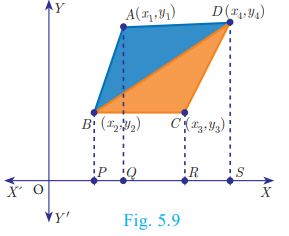

>The following pictorial representation helps us to write the above formula very easily. 
Take the vertices A (*x*1,*y*1), B(*x*2,*y*2), C(*x*3,*y*3) and D(*x*4,*y*4) in counter-clockwise direction 
and write them column-wise as that of the area of a triangle

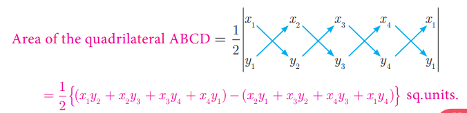

>
**Thinking Corner**

>If the area of a quadrilateral formed by the points (a, a), (–a, a), (a, –a) and 
(–a, –a), where a ¹ 0 is 64 square units, then identify the type of the quadrilateral

>Find all possible values of a.

<b>Example 5.1</b> Find the area of the triangle whose vertices are (-3,5), (5,6) and (5,-2)

<b>Solution</b> Plot the points in a rough diagram and take them in counter-clockwise order

>Let the vertices be A(-3,5), B(5,-2), C(5,6)

<b>Example 5.2</b> Show that the points P(-1.5,3), Q(6,-2), R(-3,4) are collinear.

<b>Solution</b> The points are P(-1.5,3), Q(6,-2), R(-3,4)

Therefore, the given points are collinear.

<b>Example 5.3</b> If the area of the triangle formed by the vertices A(-1,2), B (k,-2) and 
C(7,4) (taken in order) is 22 sq. units, find the value of k.

<b>Solution</b> The vertices are A(-1,2), B(k,-2) and C(7,4)
Area of triangle ABC is 22 sq.units

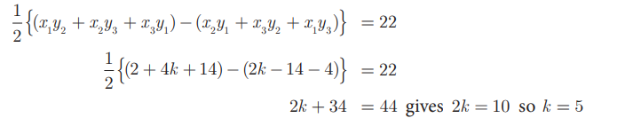

<b>Example 5.4</b> If the points P(-1,-4), Q(b,c) and R(5,-1) are collinear and if 2b+c=4 , 
then find the values of b and c

<b>Solution</b> Since the three points P(-1,-4), Q(b,c) and R(5,-1) are collinear,

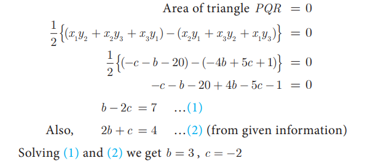

<b>Example 5.5</b> The floor of a hall is covered with identical tiles which are in the shapes of 
triangles. One such triangle has the vertices at (-3,2), (-1,-1) and (1,2). If the floor of 
the hall is completely covered by 110 tiles, find the area of the floor.

<b>Solution</b> Vertices of one triangular tile are at 
 (-3,2), (-1,-1) and (1,2)

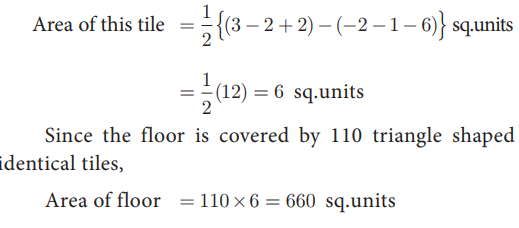

<b>Example 5.6</b> Find the area of the quadrilateral formed by the points (8,6), (5,11), (-5,12) and (-4,3).

<b>Solution</b> Before determining the area of quadrilateral, plot the vertices in a graph.
Let the vertices be A(8,6), B(5,11), C(–5,12) and D(–4,3)
Therefore, area of the quadrilateral ABCD

# process Check

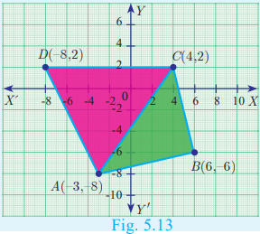

Given a quadrilateral ABCD with vertices A(–3,–8), B(6,–6), C(4,2), D(–8,2)

-   Find the area of ABC .

-   Find the area of ACD .

-   Calculate area of ABC + area of ACD .

-   Find the area of quadrilateral ABCD. 

-   Compare the answers obtained in 3 and 4.

<b>Example 5.7</b> The given diagram shows a plan for constructing a 
new parking lot at a campus. It is estimated that such construction 
would cost `1300 per square feet. What will be the total cost for 
making the parking lot?

<b>Solution</b> The parking lot is a quadrilateral whose vertices are at 
A(2,2), B(5,5), C(4,9) and D(1,7).

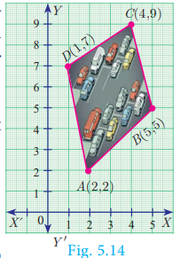
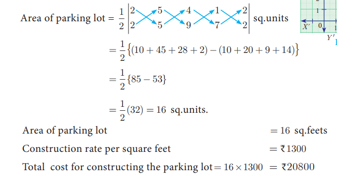

Activity 1

-    Take a graph sheet.

-    Consider a triangle whose base is the line joining the points (0,0) and (6,0)

-    Take the third vertex as (1,1), (2,2), (3,3), (4,4),(5,5) and find their areas.Fill in the details given.

-    Do you see any pattern with A1, A2, A3, A4, A5 ? If so mention it.

-    Repeat the same process by taking third vertex in step (iii) as (1,2), (2,4), (3,8), 
(4,16), (5,32).

-     Fill the table with these new vertices.

-     What pattern do you observe now withA1, A2, A3, A4, A5?

Activity 2

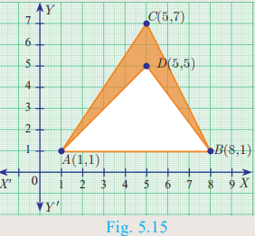 Find the area of the shaded region

<h3>Exercise 5.1 </h3>

1. Find the area of the triangle formed by the points

>(i) (1,–1), (–4, 6) and (–3, –5) (ii) (–10, –4), (–8, –1) and (–3, –5)

2. Determine whether the sets of points are collinear?

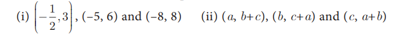

3. Vertices of given triangles are taken in order and their areas are provided aside. In each case, find the value of ‘p ’.
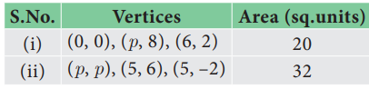

4. In each of the following, find the value of ‘a’ for which the given points are collinear.

>(i) (2, 3), (4, a) and (6, –3) (ii) (a, 2–2a), (–a+1, 2a) and (–4–a, 6–2a)

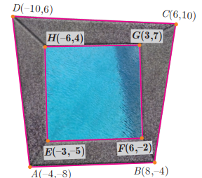

5. Find the area of the quadrilateral whose vertices are at

>(i) (–9, –2), (–8, –4), (2, 2) and (1, –3) (ii) (–9, 0), (–8, 6), (–1, –2) and (–6, –3)

6. Find the value of k, if the area of a quadrilateral is 28 sq.units, whose vertices are taken in the order (–4, –2), (–3, k), (3, –2) and (2, 3) 

7. If the points A( , -3 9), B a( ,b) and C( , 4 5 - ) are collinear and if a b + = 1 , then find a and b.

8. Let P(11,7), Q( 13.5,) and R(9.5,)4 be the midpoints of the sides AB, BC and AC respectively of 
ABC . Find the coordinates of the vertices A, B
and C. Hence find the area of DABC and compare 
this with area of PQR .

9. In the figure, the quadrilateral swimming pool 
shown is surrounded by concrete patio. Find the 
area of the patio

10. A triangular shaped glass with vertices at 
A(-5,-4), B(1,6) and C(7,-4) has to be painted. If 
one bucket of paint covers 6 square feet, how many 
buckets of paint will be required to paint the whole 
glass, if only one coat of paint is applied.

11. In the figure, find the area of (i) triangle AGF
(ii) triangle FED (iii) quadrilateral BCEG.

# 5.4 Inclination of a Line

>The inclination of a line or the angle of inclination of a line is the angle which a 
straight line makes with the positive direction of X axis measured in the counter-clockwise 
direction to the part of the line above the X axis. The inclination of the line is usually 
denoted by q .

## Note

- The inclination of *X* axis and every line parallel to *X* axis is 0°
  .

- The inclination of *Y* axis and every line parallel to *Y* axis is
  90°.

  # 5.4.1  Slope of a Straight line

> While laying roads one must know how steep the road will 
be.

> Similarly, when constructing a staircase, we should consider its
> steepness. For the same reason, anyone travelling along a hill or a
> bridge, feels hard compared to travelling along a plain road.

> All these examples illustrate one important aspect called “Steepness”.
> The measure of steepness is called slope or gradient.
>
> The concept of slope is important in economics because it is used to
> measure the rate at which the demand for a product changes in a given
> period of time on the basis of its price. Slope comprises of two
> factors namely steepness and direction.
>

> 
>
>
>
><h3>Definition</h3>
>
> If *q* is the angle of inclination of a non-vertical straight line,
> then tan *q* is called the slope or gradient of the line and is
> denoted by *m*.
>
> Therefore the slope of the straight line is *m* = tan *q* , 0 ≤ *q* ≤
> 180° , *q* ≠ 90°

## Values of slopes
<table>
<tr>
<th>S. No.</th>
<th>Condition</th>
<th>Slope</th>
<th>Diagram</th>
</tr>
<tr>
<th>(i)</th>
<th>q = 0°</th>
<th>The line is parallel 
to the positive 
direction of X axis.</th>
<th>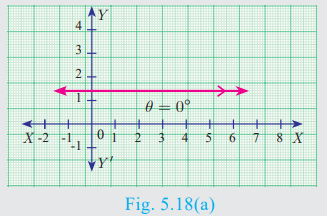</th>
</tr>
<tr>
<th>(ii)</th>
<th>0=q=90°</th>
<th>The line has positive 
slope (A line with 
positive slope rises 
from left to right).</th>
<th>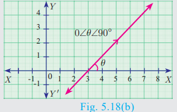</th>
</tr>
<tr>
<th>(iii)</th>
<th>90°=q=180°</th>
<th>The line has negative 
slope (A line with 
negative slope falls 
from left to right).</th>
<th>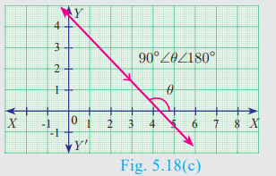</th>
</tr>
<tr>
<th>(iv)</th>
<th>q = 180°</th>
<th>The line is parallel 
to the negative 
direction of X axis.</th>
<th></th>
</tr>
<tr>
<th>(v)</th>
<th>q = 90°</th>
<th>The slope is 
undefined.</th>
<th>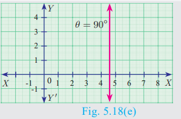</th>
</tr>
</table>

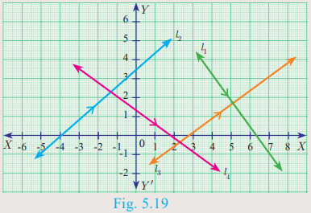

<h3>Activity 3</h3>

>The diagram contain four lines I1,I2,I3 and I4

- (i) Which lines have positive slope?

- (ii) Which lines have negative slope?

## Conversely

  