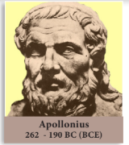

# 5. COORDINATE GEOMETRY

“A line is breadthless length” - Euclid
Apollonius was born at Perga, in modern day Turkey. His greatest
work was called “conics” which introduced curves like circle, parabola
geometrically. He wrote six other books all related to the basics of modern day coordinate geometry.

His ideas were applied to study planetary theory and solve
practical problems. He developed the sundial and contributed to other
branches of science using his exceptional geometric skills. For this reason, Apollonius is hailed as “The Great Geometer”.

**Learning Outcomes**

• To find area of a triangle formed by three given points.

• To find area of a quadrilateral formed by four given points.

• To find the slope of a straight line.

• To determine equation of a straight line in various forms.

• To find the equation of a line parallel to the line ax + by + c = 0 .

• To find the equation of a line perpendicular to the line ax+by+c= 0.

---
