# Chapter 5

## COORDINATE GEOMETRY

"A line is breadthless length" - Euclid

Apollonius was born at Perga, in modern day Turkey. His greatest work was called 'conics' which introduced curves like circle, parabola geometrically. He wrote six other books all related to the basics of modern day coordinate geometry.

His ideas were applied to study planetary theory and solve practical problems. He developed the sundial and contributed to other branches of science using his exceptional geometric skills. For this reason, Apollonius is hailed as "The Great Geometer".

<center>

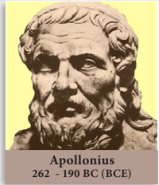

Apollonius (262 BC - 190 BC)
</center>

---

## Learning Outcomes

- To find area of a triangle formed by three given points.
- To find area of a quadrilateral formed by four given points.
- To find the slope of a straight line.
- To determine equation of a straight line in various forms.
- To find the equation of a line parallel to the line ax + by + c = 0.
- To find the equation of a line perpendicular to the line ax + by + c = 0.

---

### 5.1 Introduction


In the earlier classes, we initiated the study of coordinate geometry where we studied about coordinate axes, coordinate plane, plotting of points in a plane, distance between two points, section formulae, etc. All these concepts form the basics of coordinate geometry. Let us now recall some of the basic formulae.

**Recall**

**Distance between two points**

**Mid-point of line segment**

The mid-point M, of the line segment joining

**Section Formula**

**Internal Division**

**External Division**

**Centroid of a triangle**

The coordinates of the centroidG of a triangle with vertices

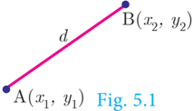

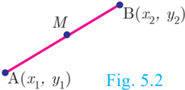

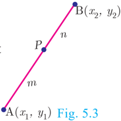

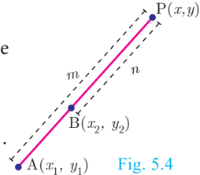

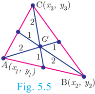

**Progress Check**

**1. Complete the following table.**

| S.No. | Points | Distance | Mid | Internal | Internal | External | External | \n |
| --- | --- | --- | --- | --- | --- | --- | --- | \n |
|  |  |  | Point | Point | Ratio | Point | Ratio | \n |
| (i) | (3, 4), (5, 5) |  |  |  | 2:3 |  | 2:3 | \n |
| (ii) | (–7,13),(–3,1) |  |  | − 
<br> 
<br> 
<br>
<br> 
<br>
<br> 
<br>
<br> 
<br> 
<br> 
<br>
<br> 
<br>
<br> 
<br>
<br> 
<br>
<br> 13 3  , 5 |  | (–13, 15) |  |  |

- A(, 05), B(, 50) and C(, --47) are vertices of a triangle then its centroid will be at _____.

### 5.2 Area of a Triangle

In your earlier classes, you have studied how to calculate the area of a triangle when its base and corresponding height (altitude) are given. You have used the formula.

Area of triangle = 1 2 × base × altitude sq.units .

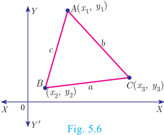

Using distance between two points formula, we can calculate AB = c , BC = a , CA = b . a , b , c represent the lengths of the sides of the triangle ABC. C.

Using 2sa =+bc + , we can calculate the area of triangle ABC by using the Heron's formula ss() -- as()bs() -c ) c . But this procedure of finding length of sides of DABC and then calculating its area will be a tedious procedure.

There is an elegant way of finding area of a triangle using the coordinates of its vertices. We shall discuss such a method below.

Draw AP, BQ and CR perpendiculars from A, B and C to the x-axis, respectively.

Clearly ABQP , APRC and BQRC are all trapeziums.

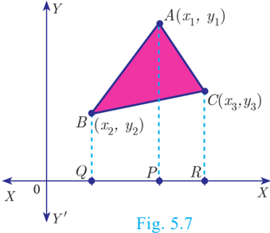

Now from Fig.5.7, it is clear that

Area of DABC

= Area of trapezium ABQP + Area of trapezium APRC − Area of trapezium BQRC. C.

You also know that, the area of trapezium

Therefore, Area of DABC

Thus, the area of DABC is the absolute value of the expression

**Another form**

The following pictorial representation helps us to write the above formula very easily.

"As the area of a triangle can never be negative, we must take the absolute value, in case area happens to be negative".

**Progress Check**

The vertices of DPQR are P(, 04 - ) , Q(, 31) and R(, -81)

- Draw DPQR on a graph paper.
- Check if DPQR is equilateral.
- Find the area of DPQR .
- Find the coordinates of M, the mid-point of QP .
- Find the coordinates of N, the mid-point of QR .
- Find the area of DMPN .
- What is the ratio between the areas of DMPN and DPQR ?

10th 206 Standard Mathematics the parallel sides)

#### 5.2.1 Collinearity of three points

### 5.3 Area of a Quadrilateral

If ABCD is a quadrilateral, then considering the diagonal AC, we can split the quadrilateral ABCD into two triangles ABC and ACD .

Using area of triangle formula given its vertices, we can calculate the areas of triangles ABC and ACD .

Now, Area of the quadrilateral ABCD

- = Area of triangle ABC + Area of triangle ACD

We use this information to find area of a quadrilateral when its vertices are given.

Now, Area of quadrilateral ABCD

- = Area of the DABD +Area of the DBCD (Fig 5.9)

**Note**

**Another condition for collinearity**

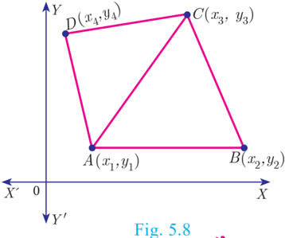

**Thinking Corner**

How many triangles exist, whose area is zero?

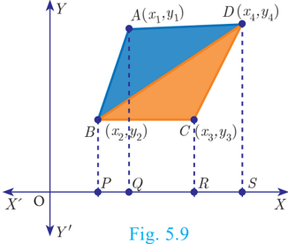

Note

- ¾ To find the area of a quadrilateral, we divide it into triangular regions, which have no common area and then add the area of these regions.
- ¾ The area of the quadrilateral is never negative. That is, we always take the area of quadrilateral as positive.

**Thinking Corner**

- If the area of a quadrilateral formed by the points (a , a ), (–a , a ), (a, –a) and (–a , – a ), where a ¹ 0 is 64 square units, then identify the type of the quadrilateral
- Find all possible values of a .

Example 5.1 Find the area of the triangle whose vertices are (, -35) , (, 56) and (, 52 - ) Solution Plot the points in a rough diagram and take them in counter-clockwise order.

Example 5.2 Show that the points P(. -15,)3 , Q(, 62 - ) , R(, -34) are collinear.

The points are P(. -15,)3 , Q(, 62 - ) , R(, -34)

Therefore, the given points are collinear.

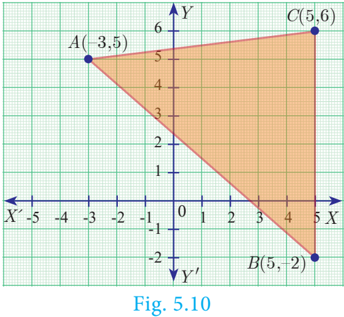

Example 5.3 If the area of the triangle formed by the vertices A(, -12) , Bk(,-2) and C(, 74) (taken in order) is 22 sq. units, find the value of k .

10th 208 Standard Mathematics

The vertices are A(, -12) , Bk(,-2) and C(, 74)

Area of triangle ABC is 22 sq.units

Example 5.4 If the points P(, --14) , Qb(,c) and R(, 51 - ) are collinear and if 24 bc += , then find the values of b and c .

Since the three points P(, --14) , Qb(,c) and R(, 51 - ) are collinear,

Solving (1) and (2) we get b = 3 , c =−2

Example 5.5 The floor of a hall is covered with identical tiles which are in the shapes of triangles. One such triangle has the vertices at (, -32) , (, --11) and (, 12). If the floor of the hall is completely covered by 110 tiles, find the area of the floor.

Vertices of one triangular tile are at

Since the floor is covered by 110 triangle shaped identical tiles,

Area of floor =× 110 6 = 660 sq.units

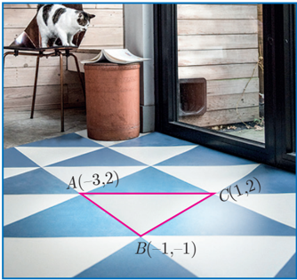

Example 5.6 Find the area of the quadrilateral formed by the points (, 86) , (, 511) , (, -512) and (, -43) .

Before determining the area of quadrilateral, plot the vertices in a graph.

Let the vertices be A(8,6), B(5,11), C(–5,12) and D(–4,3)

Therefore, area of the quadrilateral ABCD

**Progress Check**

Given a quadrilateral ABCD with vertices A(–3, –8), B(6, –6), C(4, 2), D(–8, 2)

- Find the area of DABC .
- Find the area of DACD .
- Calculate area of DABC + area of DACD
- Find the area of quadrilateral ABCD.
- Compare the answers obtained in 3 and 4.

Example 5.7 The given diagram shows a plan for constructing a new parking lot at a campus. It is estimated that such construction would cost `1300 per square feet. What will be the total cost for making the parking lot?

The parking lot is a quadrilateral whose vertices are at A(, 22) , B(, 55) , C(, 49) and D(,17) .

Area of parking lot

Construction rate per square feet

Total cost for constructing the parking lot=× 16 1300 = ₹20800

10th 210 Standard Mathematics

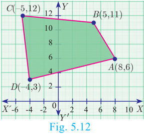

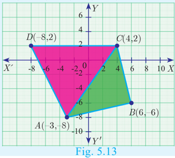

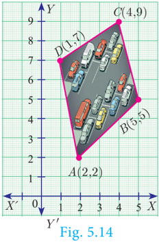

= 16 sq.feets

= ₹1300

**Activity 1**

- (i) Take a graph sheet.
- (ii) Consider a triangle whose base is the line joining the points (0,0) and (6,0)
- (iii) Take the third vertex as (1,1), (2,2), (3,3), (4,4), (5,5) and find their areas. Fill in the details given.
- (iv) Do you see any pattern with A 1, A 2, A 3, A 4, A 5 ? If so mention it.
- (v) Repeat the same process by taking third vertex in step (iii) as (1,2), (2,4), (3,8), (4,16), (5,32).
- (vi) Fill the table with these new vertices.
- (vii) What pattern do you observe now with A 1, A 2, A 3, A 4, A 5 ?

**Activity 2**

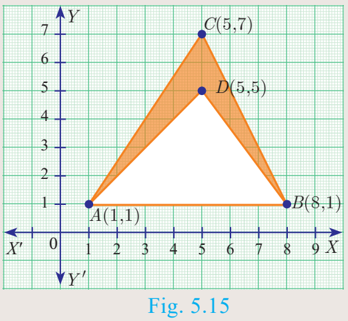

Find the area of the shaded region


- Find the area of the triangle formed by the points

- Determine whether the sets of points are collinear?

- Vertices of given triangles are taken in order and their areas are provided aside. In each case, find the value of 'p '.

|  | Third vertex Area of Triangle | \n |
| --- | --- | \n |
| (1,1) | A 1  = | \n |
| (2,2) | A 2  = | \n |
| (3,3) | A 3  = | \n |
| (4,4) | A 4  = | \n |
| (5,5) | A 5   = |  |

Third vertex Area of Triangle

(1,2)

A --- A --- A --- A --- A --- A --- A --- A --- A --- A --- A --- A --- A --- A --- A --- A --- A --- A --- A --- A --- A --- A --- A --- A --- A --- A --- A --- A --- A --- A --- A --- A --- A --- A --- A --- A --- A --- A --- A --- A --- A --- A --- A --- A --- A --- A --- A --- A --- A --- A --- A --- A --- A --- A --- A --- A --- A --- A --- A --- A --- A --- A --- A --- A --- A --- A --- A --- A --- A --- A --- A --- A --- A --- A --- A --- A --- A --- A --- A --- A --- A --- A --- A --- A --- A --- A --- A --- A --- A --- A --- A --- A --- A --- A --- A --- A --- A --- A --- A --- A --- A

1 --- 1 --- 1 --- 1 --- 1 --- 1 --- 1 --- 1 --- 1 --- 1 --- 1 --- 1 --- 1 --- 1 --- 1 --- 1 --- 1 --- 1 --- 1 --- 1 --- 1 --- 1 --- 1 --- 1 --- 1 --- 1 --- 1 --- 1 --- 1 --- 1 --- 1 --- 1 --- 1 --- 1 --- 1 --- 1 --- 1 --- 1 --- 1 --- 1 --- 1 --- 1 --- 1 --- 1 --- 1 --- 1 --- 1 --- 1 --- 1 --- 1 --- 1 --- 1 --- 1 --- 1 --- 1 --- 1 --- 1 --- 1 --- 1 --- 1 --- 1 --- 1 --- 1 --- 1 --- 1 --- 1 --- 1 --- 1 --- 1 --- 1 --- 1 --- 1 --- 1 --- 1 --- 1 --- 1 --- 1 --- 1 --- 1 --- 1 --- 1 --- 1 --- 1 --- 1 --- 1 --- 1 --- 1 --- 1 --- 1 --- 1 --- 1 --- 1 --- 1 --- 1 --- 1 --- 1 --- 1 --- 1 --- 1 --- 1 --- 1

(2,4)

A --- A --- A --- A --- A --- A --- A --- A --- A --- A --- A --- A --- A --- A --- A --- A --- A --- A --- A --- A --- A --- A --- A --- A --- A --- A --- A --- A --- A --- A --- A --- A --- A --- A --- A --- A --- A --- A --- A --- A --- A --- A --- A --- A --- A --- A --- A --- A --- A --- A --- A --- A --- A --- A --- A --- A --- A --- A --- A --- A --- A --- A --- A --- A --- A --- A --- A --- A --- A --- A --- A --- A --- A --- A --- A --- A --- A --- A --- A --- A --- A --- A --- A --- A --- A --- A --- A --- A --- A --- A --- A --- A --- A --- A --- A --- A --- A --- A --- A --- A --- A

2 --- 2 --- 2 --- 2 --- 2 --- 2 --- 2 --- 2 --- 2 --- 2 --- 2 --- 2 --- 2 --- 2 --- 2 --- 2 --- 2 --- 2 --- 2 --- 2 --- 2 --- 2 --- 2 --- 2 --- 2 --- 2 --- 2 --- 2 --- 2 --- 2 --- 2 --- 2 --- 2 --- 2 --- 2 --- 2 --- 2 --- 2 --- 2 --- 2 --- 2 --- 2 --- 2 --- 2 --- 2 --- 2 --- 2 --- 2 --- 2 --- 2 --- 2 --- 2 --- 2 --- 2 --- 2 --- 2 --- 2 --- 2 --- 2 --- 2 --- 2 --- 2 --- 2 --- 2 --- 2 --- 2 --- 2 --- 2 --- 2 --- 2 --- 2 --- 2 --- 2 --- 2 --- 2 --- 2 --- 2 --- 2 --- 2 --- 2 --- 2 --- 2 --- 2 --- 2 --- 2 --- 2 --- 2 --- 2 --- 2 --- 2 --- 2 --- 2 --- 2 --- 2 --- 2 --- 2 --- 2 --- 2 --- 2 --- 2 ---

(3,8)

A --- A --- A --- A --- A --- A --- A --- A --- A --- A --- A --- A --- A --- A --- A --- A --- A --- A --- A --- A --- A --- A --- A --- A --- A --- A --- A --- A --- A --- A --- A --- A --- A --- A --- A --- A --- A --- A --- A --- A --- A --- A --- A --- A --- A --- A --- A --- A --- A --- A --- A --- A --- A --- A --- A --- A --- A --- A --- A --- A --- A --- A --- A --- A --- A --- A --- A --- A --- A --- A --- A --- A --- A --- A --- A --- A --- A --- A --- A --- A --- A --- A --- A --- A --- A --- A --- A --- A --- A --- A --- A --- A --- A --- A --- A --- A --- A --- A --- A --- A --- A

3 ``` 3 ``` ``` 3 ``` 3 ``` 3 ``` 3 ``` 3 ``` 3 ``` 3 ``` 3 ``` 3 ``` 3 ``` 3 ``` 3 ``` 3 ``` 3 ``` 3 ``` 3 ``` 3 ``` 3 ``` 3 ``` 3 ``` 3 ``` 3 ``` 3 ``` 3 ``` 3 ``` 3 ``` 3 ``` 3 ``` 3 ``` 3 ``` 3 ``` 3 ``` 3 ``` 3 ``` 3 ``` 3 ``` 3 ``` 3 ``` 3 ``` 3 ``` 3 ``` 3 ``` 3 ``` 3 ``` 3 ``` 3 ``` 3 ``` 3 ``` 3 ``` 3 ``` 3 ``` 3 ``` 3 ``` 3 ``` 3 ``` 3 ``` 3 ``` 3 ``` 3 ``` 3 ``` 3 ``` 3 ``` 3 ``` 3 ``` 3 ``` 3 ``` 3 ``` 3 ``` 3 ``` 3 ``` 3 ``` 3 ``` 3 ``` 3 ``` 3 ``` 3 ``` 3 ``` 3 ``` 3 ``` 3 ``` 3 ``` 3 ``` 3 ``` 3 ``` 3 ``` 3 ``` 3 ``` 3 ``` 3 ``` 3 ``` 3 ``` 3 ``` 3 ``` 3 ``` 3 ``` 3 ``` 3 ``` 3 ```

(4,16)

A --- A --- A --- A --- A --- A --- A --- A --- A --- A --- A --- A --- A --- A --- A --- A --- A --- A --- A --- A --- A --- A --- A --- A --- A --- A --- A --- A --- A --- A --- A --- A --- A --- A --- A --- A --- A --- A --- A --- A --- A --- A --- A --- A --- A --- A --- A --- A --- A --- A --- A --- A --- A --- A --- A --- A --- A --- A --- A --- A --- A --- A --- A --- A --- A --- A --- A --- A --- A --- A --- A --- A --- A --- A --- A --- A --- A --- A --- A --- A --- A --- A --- A --- A --- A --- A --- A --- A --- A --- A --- A --- A --- A --- A --- A --- A --- A --- A --- A --- A --- A

4 --- 4 --- 4 --- 4 --- 4 --- 4 --- 4 --- 4 --- 4 --- 4 --- 4 --- 4 --- 4 --- 4 --- 4 --- 4 --- 4 --- 4 --- 4 --- 4 --- 4 --- 4 --- 4 --- 4 --- 4 --- 4 --- 4 --- 4 --- 4 --- 4 --- 4 --- 4 --- 4 --- 4 --- 4 --- 4 --- 4 --- 4 --- 4 --- 4 --- 4 --- 4 --- 4 --- 4 --- 4 --- 4 --- 4 --- 4 --- 4 --- 4 --- 4 --- 4 --- 4 --- 4 --- 4 --- 4 --- 4 --- 4 --- 4 --- 4 --- 4 --- 4 --- 4 --- 4 --- 4 --- 4 --- 4 --- 4 --- 4 --- 4 --- 4 --- 4 --- 4 --- 4 --- 4 --- 4 --- 4 --- 4 --- 4 --- 4 --- 4 --- 4 --- 4 --- 4 --- 4 --- 4 --- 4 --- 4 --- 4 --- 4 --- 4 --- 4 --- 4 --- 4 --- 4 --- 4 --- 4 --- 4 --- 4 --- 4 ---

(5,32)

A --- A --- A --- A --- A --- A --- A --- A --- A --- A --- A --- A --- A --- A --- A --- A --- A --- A --- A --- A --- A --- A --- A --- A --- A --- A --- A --- A --- A --- A --- A --- A --- A --- A --- A --- A --- A --- A --- A --- A --- A --- A --- A --- A --- A --- A --- A --- A --- A --- A --- A --- A --- A --- A --- A --- A --- A --- A --- A --- A --- A --- A --- A --- A --- A --- A --- A --- A --- A --- A --- A --- A --- A --- A --- A --- A --- A --- A --- A --- A --- A --- A --- A --- A --- A --- A --- A --- A --- A --- A --- A --- A --- A --- A --- A --- A --- A --- A --- A --- A --- A

5 --- 5 --- 5 --- 5 --- 5 --- 5 --- 5 --- 5 --- 5 --- 5 --- 5 --- 5 --- 5 --- 5 --- 5 --- 5 --- 5 --- 5 --- 5 --- 5 --- 5 --- 5 --- 5 --- 5 --- 5 --- 5 --- 5 --- 5 --- 5 --- 5 --- 5 --- 5 --- 5 --- 5 --- 5 --- 5 --- 5 --- 5 --- 5 --- 5 --- 5 --- 5 --- 5 --- 5 --- 5 --- 5 --- 5 --- 5 --- 5 --- 5 --- 5 --- 5 --- 5 --- 5 --- 5 --- 5 --- 5 --- 5 --- 5 --- 5 --- 5 --- 5 --- 5 --- 5 --- 5 --- 5 --- 5 --- 5 --- 5 --- 5 --- 5 --- 5 --- 5 --- 5 --- 5 --- 5 --- 5 --- 5 --- 5 --- 5 --- 5 --- 5 --- 5 --- 5 --- 5 --- 5 --- 5 --- 5 --- 5 --- 5 --- 5 --- 5 --- 5 --- 5 --- 5 --- 5 --- 5 --- 5 --- 5 --- 5 ---

Two French mathematicians Rene Descartes and Pierre-de-Fermat were the first to conceive the idea of modern coordinate geometry by 1630s.

| S.No. | Vertices | Area (sq.units) | \n |
| --- | --- | --- | \n |
| (i) | (0, 0), (p, 8), (6, 2) | 20 | \n |
| (ii) | (p , p  p), (5, 6), (5, –2) | 32 |  |

- In each of the following, find the value of 'a' for which the given points are collinear.

- Find the area of the quadrilateral whose vertices are at (i) (–9, –2), (–8, –4), (2, 2) and (1, –3) (ii) (–9, 0), (–8, 6), (–1, –2) and (–6, –3)
- Find the value of k, if the area of a quadrilateral is 28 sq.units, whose vertices are taken in the order (–4, –2), (–3, k), (3, –2) and (2, 3)
- If the points A(, -39) , Ba(,b) and C(, 45 - ) are collinear and if ab += 1 , then find a a and b .
- Let P(, 11 7) , Q(. 13 54,) and R(. 95,)4 be the midpoints of the sides AB, BC and AC respectively of DABC . Find the coordinates of the vertices A, B and C. Hence find the area of DABC and compare this with area of DPQR .
- In the figure, the quadrilateral swimming pool shown is surrounded by concrete patio. Find the area of the patio.
- A triangular shaped glass with vertices at A(, --54) , B(,16) and C(, 74 - ) has to be painted. If one bucket of paint covers 6 square feet, how many buckets of paint will be required to paint the whole glass, if only one coat of paint is applied.
- In the figure, find the area of (i) triangle AGF (ii) triangle FED (iii) quadrilateral BCEG .

### 5.4 Inclination of a Line

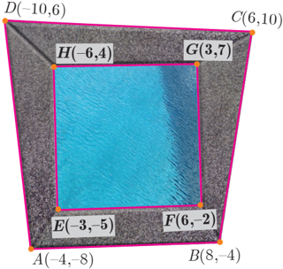

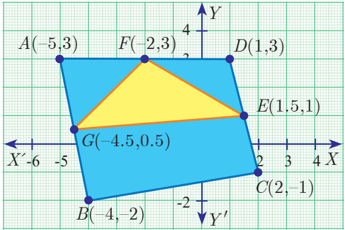

The inclination of a line or the angle of inclination of a line is the angle which a straight line makes with the positive direction of X axis measured in the counter-clockwise direction to the part of the line above the X axis. The inclination of the line is usually denoted by q .

- ¾ The inclination of X axis and every line parallel to X axis is 0 ° .
- ¾ The inclination of Y axis and every line parallel to Y axis is90 ° .

#### 5.4.1 Slope of a Straight line

While laying roads one must know how steep the road will be. Similarly, when constructing a staircase, we should consider its steepness. For the same reason, anyone travelling along a hill or a bridge, feels hard compared to travelling along a plain road.

All these examples illustrate one important aspect called "Steepness". The measure of steepness is called slope or gradient .

The concept of slope is important in economics because it is used to measure the rate at which the demand for a product changes in a given period of time on the basis of its price. Slope comprises of two factors namely steepness and direction.

**Definition**

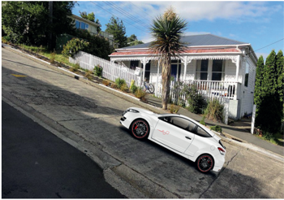

If q is the angle of inclination of a non-vertical straight line, then tan q is called the slope or gradient of the line and is denoted by m .

Therefore the slope of the straight line is m = tan q , 0 ≤≤q 180 ° , q ≠° 90

**To find the slope of a straight line when two points are given**

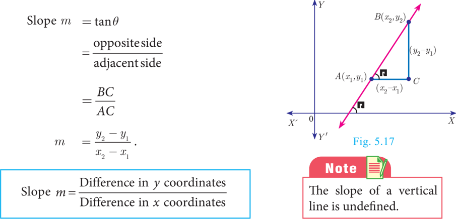

**Values of slopes**

| S. No. | Condition | Slope | Diagram Y 4 | \n |
| --- | --- | --- | --- | \n |
| (i) | q =°0 | The line is parallel  to the positive  direction of X axis. | X -2  -1  1  2  3  4  5  6  7  8  X Y  ¢ 3 2 1 -1 0 q =°0 Fig. 5.18(a) |  |

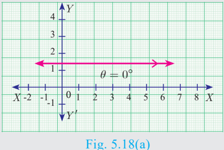

|  |  |  | \n |
| --- | --- | --- | \n |
| (ii) | 09 <<q  0 ° | The line has positive  slope (A line with  positive slope rises  from left to right). | \n |
| (iii) | 90°< q <° 180 | The line has negative  slope (A line with  negative slope falls  from left to right). | \n |
| (iv) | q =° 180 | The line is parallel  to the negative  direction of X axis. | \n |
| (v) | q =° 90 | The slope is  undefined. |  |

**Activity 3**

- (i) Which lines have positive slope?
- (ii) Which lines have negative slope?

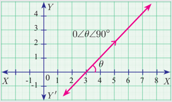

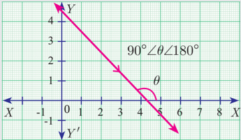

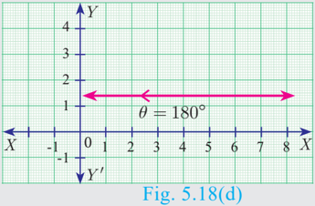

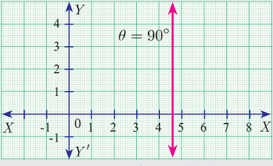

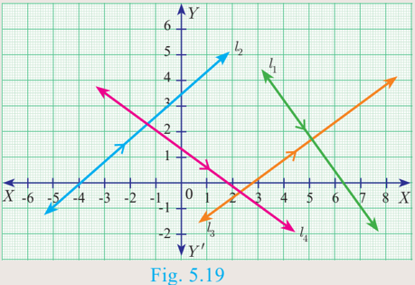

Write down the slope of each of the lines shown on the grid below. One is solved for you.

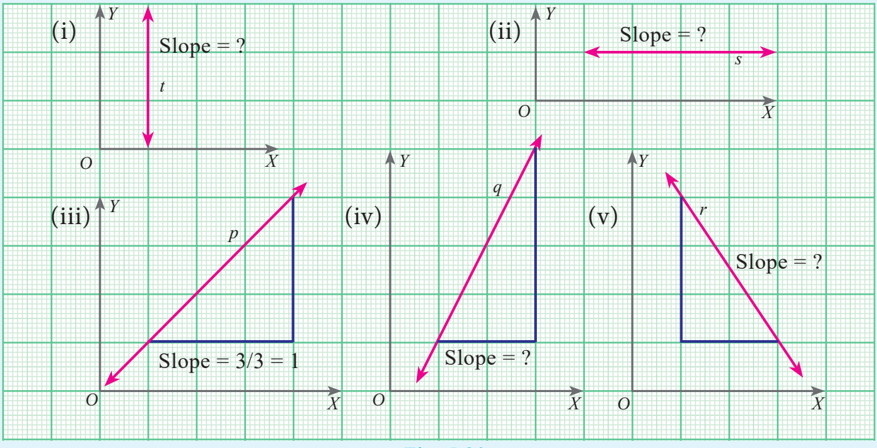

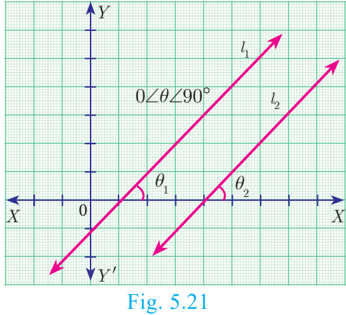

#### 5.4.2 Slopes of parallel lines

Two non-vertical lines are parallel if and only if their slopes are equal .

Let the inclination of the lines with positive direction of X axis be q1 q1 and q2 q2 respectively.

q1 = q2 (Since, q1 , q2 are corresponding angles)

Hence, the slopes are equal.

Therefore, non-vertical parallel lines have equal slopes.

**Conversely**

Let the slopes be equal, then m 1 = m 2

tan q1

tan q2

q1

q2

That is the corresponding angles are equal.

Thus, non-vertical lines having equal slopes are parallel.

Hence, non vertical lines are parallel if and only if their slopes are equal .

#### 5.4.3 Slopes of perpendicular lines

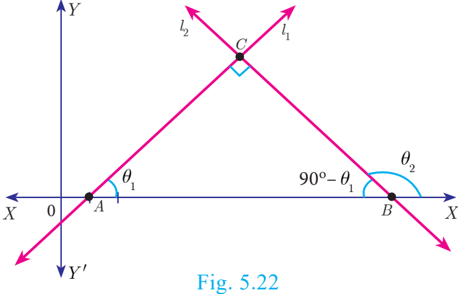

Two non-vertical lines with slopes m 1 and m 2 are perpendicular if and only if mm1 m12 =− 1 .

Then ∠= ABC 90°− 1 q 1 q (sum of angles of DABC is 180°)

**Conversely,**

10th 216 Standard Mathematics

In any triangle, exterior angle is equal to sum of the interior opposite angles.

Therefore,

Example 5.8 (i) What is the slope of a line whose inclination is 30 ° ?

- (ii) What is the inclination of a line whose slope is 3 ?

Solution (i) Here q =° 30

**Thinking Corner**

Slope m = tan q

The straight lines X axis and Y axis are perpendicular to each other. Is the condition mm1 m12 =− 1 true?

- (ii) Givenm = 3 , let q be the inclination of the line

Example 5.9 Find the slope of a line joining the given points

**Solution**

- (i) (, -61) and (, -32)

**Progress Check**

Fill in the missing boxes

| S.No. | Points | Slope | \n |
| --- | --- | --- | \n |
| 1 | A(–a, b), B(3a ,– b) |  | \n |
| 2 | A(2, 3), B(_,_) | 2 | \n |
| 3 | A(_, _), B(_,_) | 0 | \n |
| 4 | A(_, _), B(_,_) | undefined |  |

- (iii) (, 14 10) and (, 14 - 6)

The slope is undefined.

Example 5.10 The line r passes through the points (–2, 2) and (5, 8) and the line s passes through the points (–8, 7) and (–2, 0). Is the line r perpendicular to s ?

Therefore, the line r is perpendicular to line s .

Example 5.11 The line p passes through the points (, 32 - ) , (, 12 4) and the line q passes through the points (, 62 - ) and (, 12 2). Is p parallel to q ?

Therefore, line p is parallel to the line q.

Example 5.12 Show that the points (, -25) , (, 61 - ) and (, 22) are collinear.

The vertices are A(, -25) , B(, 61 - ) and C(, 22) .

We get, Slope of AB = Slope of BC

Therefore, the points A, B, C all lie in a same straight line.

Hence the points A , B and C are collinear.

Example 5.13 Let A(,12 - ) , B(, 62 - ) , C(, 51) and D(, 21) be four points

- (i) Find the slope of the line segments (a) AB (b) CD
- (ii) Find the slope of the line segments (a) BC (b) AD
- (iii) What can you deduce from your answer.

10th 218 Standard Mathematics If the slopes of both the pairs of opposite sides are equal then the quadrilateral is a parallelogram.

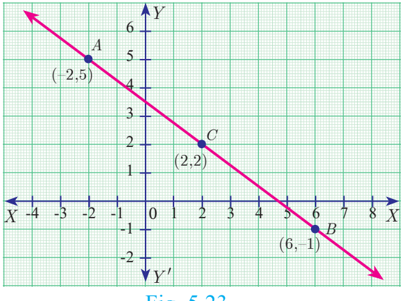

- (iii) The slope of AB and CD are equal so AB, CD are parallel.

Similarly the lines AD and BC are not parallel, since their slopes are not equal. So, we can deduce that the quadrilateral ABCD is a trapezium.

Example 5.14 Consider the graph representing growth of population (in crores). Find the slope of the line AB and hence estimate the population in the year 2030?

The points A(, 2005 96) and B(, 2015 100) are on the line AB .

Let the growth of population in 2030 be k crores.

Assuming that the point Ck (, 2030 ) is on AB ,

we have , slope of AC =slope of AB

Hence the estimated population in 2030 =106 Crores.

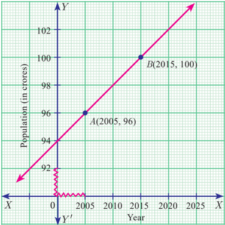

Example 5.15 Without using Pythagoras theorem, show that the points (,14 - ) , (, 23 - ) and (, 47 - ) form a right angled triangle.

Let the given points be A(,14 - ) , B(, 23 - ) and C(, 47 - ) .

Slope of AB ´slope of AC =− ()11 () =−1

AB is perpendicular to AC. ∠= A 90 °

Therefore, DABC is a right angled triangle.

**Thinking Corner**

Provide three examples of using the concept of slope in real-life situations.

Example 5.16 Prove analytically that the line segment joining the mid-points of two sides of a triangle is parallel to the third side and is equal to half of its length.

Let Pa(,b) Qc(,d) and Re(, f) be the vertices of a triangle.

Let S be the mid-point of PQ and T be the mid-point of PR

Therefore, ST is parallel to QR . (since, their slopes are equal)

Also

Thus ST is parallel to QR and half of it.


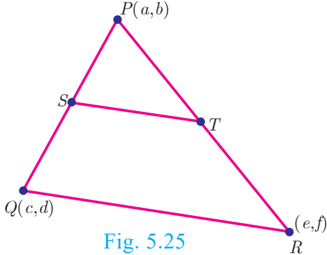

**Note**

This example illustrates how a geometrical result can be proved using coordinate Geometry.

- What is the slope of a line whose inclination with positive direction of x -axis is (i) 90 ° (ii) 0 °
- What is the inclination of a line whose slope is (i) 0 (ii) 1
- Find the slope of a line joining the points
- (i) () 55 , , with the origin (ii) (sin qq ,c - os q os ) and (s - in qq ,cos )
- What is the slope of a line perpendicular to the line joining A(, 51) and P where P is the mid-point of the segment joining (, 42) and (, -64) .
- Show that the given points are collinear: (, --34) , (, 72) and (, 12 5)
- If the three points (, 31 - ) , (, a 3) and (,13 - ) are collinear, find the value of a .
- The line through the points (, -2 a) and (, 93) has slope - 1 2 . Find the value of a .
- The line through the points (, -26) and (4,8) is perpendicular to the line through the points (8,12) and (, x 24). Find the value of x .
- Show that the given points form a right angled triangle.
- (i) A(,14 - ) , B(, 23 - ) and C(, 47 - ) (ii) L(, 05) , M(, 912) and N(, 314)

10th 220 Standard Mathematics

**10. Show that the given points form a parallelogram :**

- If the points A(2,2) , B(–2, –3) , C(1, –3) and D(x, x, y) form a parallelogram then find the value of x and y .
- Let A(, 34 - ) , B(, 94 - ) , C(, 57 - ) and D(, 77 - ). Show that ABCD is a trapezium.
- A quadrilateral has vertices at A(, --42) , B(, 51 - ) , C(, 65) and D(, -76). Show that the mid-points of its sides form a parallelogram.

### 5.5 Straight Line

Any first degree equation in two variables x and y of the form ax ++ by c = 0 … (1) where a , b , c are real numbers and at least one of a , b is non-zero is called "Straight line" in XY plane.

#### 5.5.1 Equation of coordinate axes

The X axis and Y axis together are called coordinate axes. The x coordinate of every point on OY (Y axis) is 0. Therefore equation of OY(Y axis) is x = 0 (fig 5.27)

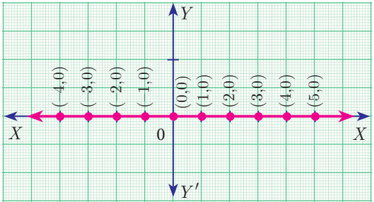

The y coordinate of every point on OX (X axis) is 0 . Therefore the equation of OX (X axis) is y = 0 (fig 5.28)

*Fig. 5.28*

#### 5.5.2 Equation of a straight line parallel to X axis

Let AB be a straight line parallel to X axis, which is at a distance 'b'. Then y coordinate of every point on ' AB' is 'b'. (fig 5.29)

Therefore, the equation of AB is y = b

Note

- ¾ If b > 0 , then the line y=b lies above the X axis
- ¾ If b < 0 , then the line y=b lies below the X axis
- ¾ If b = 0 , then the line y=b is the X axis itself.

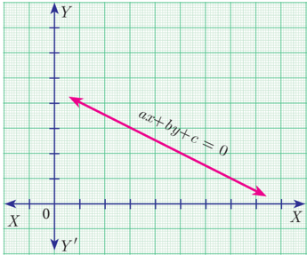

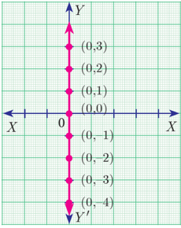

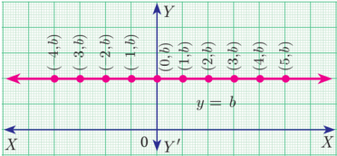

#### 5.5.3 Equation of a Straight line parallel to the Y axis

Let CD be a straight line parallel to Y axis, which is at a distance 'c'. Then x coordinate of every point on CD is 'c'. The equation of CD is x = c . (fig 5.30)

Note

- ¾ If c > 0 , then the line x=c lies right to the side of the Y axis
- ¾ If c < 0 , then the line x=c lies left to the side of the Y axis
- ¾ If c = 0 , then the line x=c is the Y axis itself.

Example 5.17 Find the equation of a straight line passing through (5,7) and is (i) parallel to X axis (ii) parallel to Y axis.

(i) The equation of any straight line parallel to X axis is y=b .

Since it passes through (5,7) , b = 7 .

Therefore, the required equation of the line is y=7 .

- (ii) The equation of any straight line parallel toY axis is x=c Since it passes through (5,7) , c = 5

Therefore, the required equation of the line is x=5 .

#### 5.5.4 Slope-Intercept Form

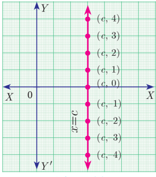

Every straight line that is not vertical will cut the Y axis at a single point. The y coordinate of this point is called y intercept of the line.

A line with slope m and y intercept c can be expressed through the equation y = mx+c

We call this equation as the slope-intercept form of the equation of a line.


- ¾ If a line with slope m , m≠0 makes x intercept d, then the equation of the straight line is y = m (x– x– d) .
- ¾ y = mx represent equation of a straight line with slope m and passing through the origin.

Example 5.18 Find the equation of a straight line whose

- (i) Slope is 5 and y intercept is -9 (ii) Inclination is 45 ° and y intercept is 11

(i) Given, Slope = 5, y intercept, c =−9

Therefore, equation of a straight line is ym =+xc

- (ii) Given, q =° 45 , = 11

y intercept, c Slope m m = tan q =° tan45 = 1

Therefore, equation of a straight line is of the form ym =+xc

Hence we get, y=+x 11 ⇒ xy −+ 11 = 0

10th 222 Standard Mathematics Example 5.19 Calculate the slope and y intercept of the straight line 87 xy −+ 60 =

Equation of the given straight line is 87 xy −+ 6 = 0

7y =+ 86 x (bringing it to the form ym =+xc )

Comparing (1) with ym =+xc


For, the point (x, y) in a xy plane, the x coordinate x is called "Abscissae" and the y coordinate y is called "Ordinate".

Example 5.20 The graph relates temperatures y (in Fahrenheit degree) to temperatures x (in Celsius degree) (a) Find the slope and y intercept (b) Write an equation of the line (c) What is the mean temperature of the earth in Fahrenheit degree if its mean temperature is 25 ° Celsius?

The line crosses the Y axis at (0, 32)

- (b) Use the slope and y intercept to write an equation

- (c) In Celsius, the mean temperature of the earth is25 ° . To find the mean temperature in Fahrenheit, we find the value of y when x = 25

Therefore, the mean temperature of the earth is 77 ° F.

#### 5.5.5 Point-Slope form

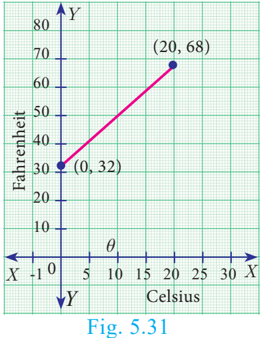

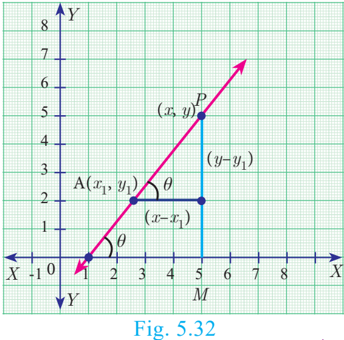

Example 5.21 Find the equation of a line passing through the point (, 34 - ) and having slope - 5 7

Is it possible to express, the equation of a straight line in slope-intercept form, when it is parallel to Y axis?

Example 5.22 Find the equation of a line passing through the point A(,14) and perpendicular to the line joining points (, 25) and (, 47) .

**Solution**

Let the given points be A(,14) , B(, 25) and C(, 47) .

Let m be the slope of the required line.

Since the required line is perpendicular to BC, C,

The required line also pass through the point A(1,4).

#### 5.5.6 Two Point form

From the equation of the straight line in point slope form, we get

Hence,

*Fig. 5.33*

Example 5.23 Find the equation of a straight line passing through (, 53 - ) and (, 74 - ) .

10th 224 Standard Mathematics

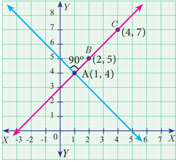

The great mathematical physicists like Galileo and Newton used coordinate geometry to characterize the motions of objects in plane and space.

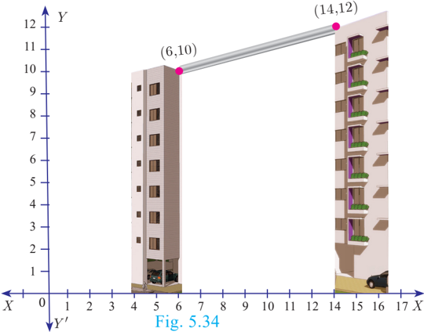

Example 5.24 Two buildings of different heights are located at opposite sides of each other. If a heavy rod is attached joining the terrace of the buildings from (, 610) to (, 14 12) , find the equation of the rod joining the buildings ?

Let A(, 610) , B(, 14 12) be the points denoting the terrace of the buildings.

The equation of the rod is the equation of the straight line passing through A(6,10) and B(14,12)

Hence, equation of the rod is xy −+ 4340 =

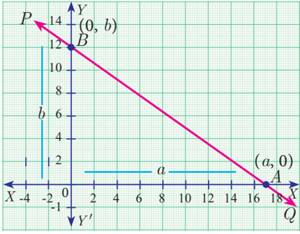

#### 5.5.7 Intercept Form

We will find the equation of a line whose intercepts are a and b on the coordinate axes respectively.

Let PQ be a line meeting X axis at A and Y axis at B. Let OA=a, OB=b. Then the coordinates of A and B are (, a 0) and (, 0 b) respectively. Therefore, the equation of the line joining A and B is

*Fig. 5.35*

Fill the details in respective boxes

| Form | When to use? | Name | \n |
| --- | --- | --- | \n |
| ym =+xc | Slope=m, Intercept=c are given |  | \n |
| yy− yy− 
<br>2 xx− xx−
<br>2 − −  =  − − 1 y
<br>21 1 x
<br>21 |  |  | \n |
|  | The intercepts are given | Intercept form |  |

Example 5.25 Find the equation of a line which passes through (5,7) and makes intercepts on the axes equal in magnitude but opposite in sign.

Let the x intercept be 'a' and y intercept be '–a'.

Since (1) passes through (5,7)

Thus the required equation of the straight line is xy −= −2 ; or xy −+ 20 =

Example 5.26 Find the intercepts made by the line 49 xy −+ 36 = 0 on the coordinate axes. Solution Equation of the given line is 49 xy −+ 36 = 0

49 xy - =−36 (bringing it to the normal form)

we write it as

Dividing by -36 we get,

Comparing (1) with intercept form, we get x intercept a=−9 ; y intercept b = 4

Example 5.27 A mobile phone is put to use when the battery power is 100%. The percent of battery power 'y' (in decimal) remaining after using the mobile phone for x hours is assumed as yx =−02. 5 . x 51 +

- (i) Find the number of hours elapsed if the battery power is 40%.
- (ii) How much time does it take so that the battery has no power?

**Solution**

- (i) To find the time when the battery power is 40%,

we have to take y = 04. . 0

- (ii) If the battery power is 0 then y = 0

Therefore, 0 =−02. . 51 x + gives - s - 02. . 5x = 1 hence x = 4 hours.

Thus, after 4 hours, the battery of the mobile phone will have no power.

10th 226 Standard Mathematics Example 5.28 A line makes positive intercepts on coordinate axes whose sum is 7 and it passes through (, -38). Find its equation.


If a and b are the intercepts then ab += 7 or ba =−7

By intercept form

As this line pass through the point (, -38), we have

Solving this equation () aa −+ 37 () = 0

Since a is positive, we have a = 3 and b = 7–a = 7–3 =4.

Therefore, 43 xy +−12 = 0 is the required equation.

Example 5.29 A circular garden is bounded by East Avenue and Cross Road. Cross Road intersects North Street at D and East Avenue at E . AD is tangential to the circular garden at A(3, 10). Using the figure.

- (a) Find the equation of
- (i) East Avenue.
- (ii) North Street
- (iii) Cross Road
- (b) Where does the Cross Road intersect?
- (i) North Street (ii) East Avenue

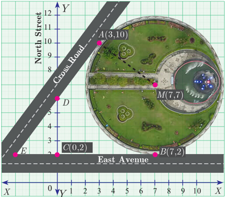

(a) (i) East Avenue is the straight line joining C(, 02) and B(, 72). Thus the equation of East Avenue is obtained by using two-point form which is

- (ii) Since the point D lie vertically above C(, 02). The x coordinate of D is 0

Since any point on North Street has x coordinate value 0 .

The equation of North Street is x = 0

- (iii) To find equation of Cross Road.

Center of circular garden M is at (7, 7), A is (3, 10)

We first find slope of MA, which we call m 1

Since the Cross Road is perpendicular to MA, if m 2 is the slope of the Cross Road then, mm1 m12 m 2 1 3 4 =− 1 − gives =− so m 2 4 3 = .

Now, the cross road has slope 4 3 and it passes through the point A() 31, 0 , 0 .

- (b) (i) If D is (, 0 k) then D is a point on the Cross Road.

Therefore, substituting x = 0 , yk = in the equation of Cross Road,

we get, 03 −+k 18 = 0

Value of k = 6

Therefore, D is (0, 6)

- (ii) To find E, let E be (, q 2)

Puty = 2 in the equation of the Cross Road,

Therefore, The point E is (, -32)

Thus the Cross Road meets the North Street at D(0, 6) and East Avenue at E (, -32) .

**Progress Check Fill the details in respective boxes**

| S.No. | Equation | Slope | x intercept | y intercept | \n |
| --- | --- | --- | --- | --- | \n |
| 1 | 3x – 4y + 2 = 0 |  |  |  | \n |
| 2 | y = 14x |  |  | 0 | \n |
| 3 |  |  | 2 | –3 |  |

10th 228 Standard Mathematics

**Activity 4**

- (i) find the equation of line l 1

**Activity 5**

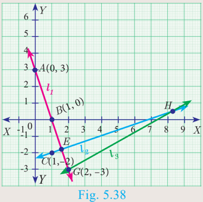

A ladder is placed against a vertical wall with its foot touching the horizontal floor. Find the equation of the ladder under the following conditions.

| No. | Condition | Picture | Equation of the  ladder | \n |
| --- | --- | --- | --- | \n |
| (i) | The ladder is  inclined at 60 °   to  the floor and it  touches the wall at  (0,8) | (0, 8) Ladder  Wall X  -7  -6  -5  -4  -3  -2  -1  0  1  2 X Y  ¢ Fig. 5.39 Y  8 7 6 5 4 3 2 1 C 60 ° | _________ | \n |
| (ii) | The foot and top of  the ladder are at the  points (2,4) and (5,1) | _________ | _________ |  |


- Find the equation of a straight line passing through the mid-point of a line segment joining the points (,15 - ) , (4,2) and parallel to (i) X axis (ii) Y axis
- The equation of a straight line is 25 () xy −+ = 0 . Find its slope, inclination and intercept on the Y axis.
- Find the equation of a line whose inclination is 30˚ and making an intercept -3 on the Y axis.
- Find the slope and y intercept of 31 xy +− () 33 = .
- Find the value of 'a', if the line through (–2,3) and (8,5) is perpendicular to ya =+x 2

229

Coordinate Geometry

- The hill in the form of a right triangle has its foot at (, 19 3). The inclination of the hill to the ground is 45˚. Find the equation of the hill joining the foot and top.
- Find the equation of a line through the given pair of points

- A cat is located at the point(, --64) in xy plane. A bottle of milk is kept at (, 511) . The cat wish to consume the milk travelling through shortest possible distance. Find the equation of the path it needs to take its milk.
- If the vertices of a DABC are A(, 62) , B(, --51) and C(,19); through the vertex A
- (i) find the equation of median
- (ii) find the equation of altitude
- Find the equation of a straight line which has slope - 5 4 and passing through the point (–1,2) .
- You are downloading a song. The percent y (in decimal form) of mega bytes remaining to get downloaded in x seconds is given by yx =−01. . + 1 .
- (i) find the total MB of the song.
- (ii) after how many seconds will 75% of the song gets downloaded?
- (iii) after how many seconds the song will be downloaded completely?
- Find the equation of a line whose intercepts on the x and y axes are given below.
- (ii) - 5 3 4 ,

- Find the intercepts made by the following lines on the coordinate axes.

- Find the equation of a straight line
- (i) passing through (,14 - ) and has intercepts which are in the ratio 2:5
- (ii) passing through (, -84) and making equal intercepts on the coordinate axes

### 5.6 General Form of a Straight Line

The linear equation (first degree polynomial in two variables x and y) ax ++ by c = 0 (where a, b and c are real numbers such that at least one of a, b is non-zero) always represents a straight line. This is the general form of a straight line.

Now, let us find out the equations of a straight line in the following cases

- (i) parallel to ax + by + c = 0
- (ii) perpendicular to ax + by + c = 0

#### 5.6.1 Equation of a line parallel to the line ax ++ by c = 0

The equation of all lines parallel to the line ax ++ by c = 0 can be put in the form ax ++ by k = 0 for different values of k .

#### 5.6.2 Equation of a line perpendicular to the line ax ++ by c = 0

The equation of all lines perpendicular to the line ax ++ by c = 0 can be written as bx −+ ay k = 0 for different values of k .

10th 230 Standard Mathematics

**Fill the details in respective boxes**

**Progress Check**

| No. | Equations | Parallel or  perpendicular | S.No. | Equations | Parallel or  perpendicular | \n |
| --- | --- | --- | --- | --- | --- | \n |
| 1 | 52 xy ++ 50 = 52 xy +− 30 = |  | 3 | 81 xy −+ 0110 = 4x–5y+16 = 0 |  | \n |
| 2 | 376 xy −−  = 0 73 xy ++ 80 = |  | 4 | 29 yx −− 70 = 27yx +− 6210 = |  |  |

#### 5.6.3 Slope of a straight line

The general form of the equation of a straight line is ax ++ by c = 0 . (at least one of a , b is non-zero)

coefficient of xa = = , coefficient of yb = , constant term= c .

The above equation can be rewritten as by =−ax − c

Example 5.30 Find the slope of the straight line 68 xy ++ 70 = .

Solution Given 68 xy ++ 70 =

Therefore, the slope of the straight line is - 3 4 .

Example 5.31 Find the slope of the line which is

- (ii) perpendicular to 23 xy −+ 80 =


How many straight lines do you have with slope 1?

(i) Given straight line is 37 xy −= 11

Since parallel lines have same slopes, slope of any line parallel to

- (ii) Given straight line is 23 xy −+ 80 =

Since product of slopes is −1 for perpendicular lines, slope of any line

Example 5.32 Show that the straight lines 23 xy +− 80 = and 46 xy ++ 18 = 0 are parallel.

Slope of the straight line 23 xy +− 80 = is

**Aliter**

Slope of the straight line 46 xy ++ 18 = 0 is

Hence the lines are parallel.

That is, slopes are equal. Hence, the two straight lines are parallel.

Example 5.33 Show that the straight lines xy −+ 23 = 0 and 63 xy ++ 80 = are perpendicular.

Slope of the straight line xy −+ 23 = 0 is

**Aliter**

Slope of the straight line 63 xy ++ 80 = is

The lines are perpendicular.

Hence, the two straight lines are perpendicular.

Example 5.34 Find the equation of a straight line which is parallel to the line 37 xy −= 12 and passing through the point (6,4) .

10th 232 Standard Mathematics

Equation of the straight line, parallel to 37 xy −−12 = 0 is 37 xy −+ k = 0 Since it passes through the point (6,4)

Therefore, equation of the required straight line is 37 xy −+ 10 = 0 .

The equation y x =− 4 3 7 can be written as 43 xy − 3 y −− 21 = 0 .

Equation of a straight line perpendicular to 43 xy −− 21 = 0 is 34 xy ++ k = 0

Since it is passes through the point (7, –1) ,

Therefore, equation of the required straight line is 34 xy +−17 = 0 .

Example 5.36 Find the equation of a straight line parallel to Y axis and passing through the point of intersection of the lines 45 xy += 13 and xy −+ 89 = 0 .

Solution Given lines

To find the point of intersection, solve equation (1) and (2)

The equation of line parallel to Y axis is x = c .

The equation of the line is x = 59 37 ⇒ 37x −= 59 0

Example 5.37 The line joining the points A(, 05) and B(, 41) is a tangent to a circle whose centre C is at the point (, 44) find

- (i) the equation of the line AB .
- (ii) the equation of the line through C which is perpendicular to the line AB .
- (iii) the coordinates of the point of contact of tangent line AB with the circle.

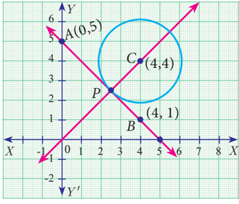

(i) Equation of line AB, A(, 05) and B(, 41)

- (ii) The equation of a line which is perpendicular

*Fig. 5.40*

- to the line AB : xy +− 50 = is xy −+ k = 0

Since it is passing through the point (4,4), we have

The equation of a line which is perpendicular to AB and through C is xy −= 0

- (iii) The coordinate of the point of contact P of the tangent line AB with the circle is point of intersection of lines.

**Thinking Corner**

- Find the number of point of intersection of two straight lines.

- Find the number of straight lines perpendicular to the line 23 xy −+ 60 = .

**Activity 6**

Find the equation of a straight line for the given diagrams

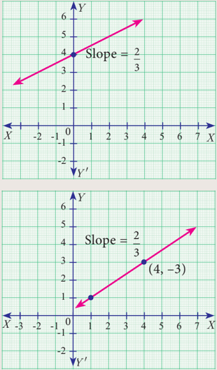

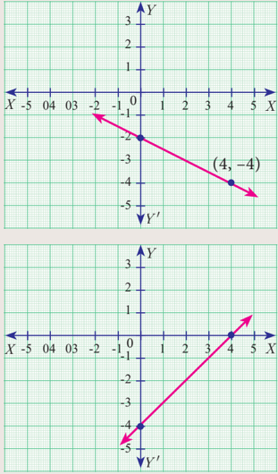


- Find the slope of the following straight lines
- Find the slope of the line which is
- (i) parallel to yx =− 07. . 11
- (ii) perpendicular to the line x =−11
- Check whether the given lines are parellel or perpendicular

- (ii) 52 xy ++ 3140 = and 23xy −+ 59 = 0
- If the straight lines 12yp =−() ++ 31 x 2 , 12xy −= 716 are perpendicular then find 'p'.
- Find the equation of a straight line passing through the point P(, -52) and parallel to the line joining the points Q(, 32 - ) and R(, -54) .
- Find the equation of a line passing through (6,–2) and perpendicular to the line joining the points (6,7) and (2,–3).
- A(, -30) B(, 10 - 2) and C(, 12 3) are the vertices of DABC . Find the equation of the altitude through A and B .
- Find the equation of the perpendicular bisector of the line joining the points A(, -42) and B(, 64 - ) .
- Find the equation of a straight line through the intersection of lines 73 xy += 10 , 54 xy −= 1 and parallel to the line 13xy ++ 5120 =
- Find the equation of a straight line through the intersection of lines 56 xy −= 2 , 32 xy += 10 and perpendicular to the line 471 xy −+ 30 =
- Find the equation of a straight line joining the point of intersection of 32 xy ++= 0 and xy −2 y −− 2 y − 24 = 0 to the point of intersection of 73 xy −= −12 and 23 yx =+
- Find the equation of a straight line through the point of intersection of the lines 831 xy += 8 , 45 xy += 9 and bisecting the line segment joining the points (5,–4) and (–7,6).


**Multiple choice questions**

- The area of triangle formed by the points (−5,0) , (0,−5) and (5,0) is
- (D) none of these
- (A) 0 sq.units
- (B) 25 sq.units
- (C) 5 sq.units
- A man walks near a wall, such that the distance between him and the wall is 10 units. Consider the wall to be the Y axis. The path travelled by the man is
- (A) x = 10
- (B) y = 10
- (C) x = 0
- (D) y = 0
- The straight line given by the equation x = 11 is
- (A) parallel to X axis
- (B) parallel to Y axis
- (D) passing through the point (0,11)
- (C) passing through the origin

- If (5,7) , (3,p) and (6,6) are collinear, then the value of p is
- (A) 3
- (B) 6
- (C) 9
- (D) 12
- The point of intersection of 34 xy −= and xy += 8 is
- (A) (5,3)
- (B) (2,4)
- (C) (3,5)
- (D) (4,4)
- The slope of the line joining (, 12 3) , (, 4 a) is 1 8 . The value of 'a' is
- (A) 1
- (B) 4
- (C) - 5
- (D) 2
- The slope of the line which is perpendicular to a line joining the points (0,0) and (–8,8) is
- (C) 1 3
- (A) –1
- (B) 1
- (D) - 8
8. If slope of the line PQ is 1 3 then slope of the perpendicular bisector of PQ is
- (C) 1 3
- (A) 3
- (B) - 3
- (D) 0
- If A is a point on the Y axis whose ordinate is 8 and B is a point on the X axis whose abscissae is 5 then the equation of the line AB is
- (A) 85 xy += 40
- (B) 85 xy −= 40
- (C) x = 8
- (D) y = 5
- The equation of a line passing through the origin and perpendicular to the line 734 xy −+ = 0 is

(A) 734 xy −+

= 0 (B) 37 xy −+ 40 =

(C) 37 xy += 0

- (D) 73 xy −= 0
- Consider four straight lines

y x ; 43 += 7

x ```markdown x ``` ``` ``` ``` ``` ``` ``` ``` ``` ``` ``` ``` ``` ``` ``` ``` ``` ``` ``` ``` ``` ``` ``` ``` ``` ``` ``` ``` ``` ``` ``` ``` ``` ``` ``` ``` ``` ``` ``` ``` ``` ``` ``` ``` ``` ``` ``` ``` ``` ``` ``` ``` ``` ``` ``` ``` ``` ``` ``` ``` ``` ``` ``` ``` ``` ``` ``` ``` ``` ``` ``` ``` ``` ``` ``` ``` ``` ``` ``` ``` ``` ``` ``` ``` ``` ``` ``` ``` ``` ``` ``` ``` ``` ``` ``` ``` ``` ``` ``` ``` ``` ``` ``` ``` ``` ``` ``` ``` ``` ``` ``` ``` ``` ``` ``` ``` ``` ``` ``` ``` ``` ``` ``` ``` ``` ``` ``` ``` ``` ``` ``` ``` ``` ``` ``` ``` ``` ``` ``` ``` ``` ``` ``` ``` ``` ``` ``` ``` ``` ``` ``` ``` ``` ``` ``` ``` ``` ``` ``` ``` ``` ``` ``` ``` ``` ```

Which of the following statement is true ?

- A straight line has equation 84 yx =+ 21. Which of the following is true
- (A) The slope is 0.5 and the y intercept is 2.6
- (B) The slope is 5 and the y intercept is 1.6
- (C) The slope is 0.5 and the y intercept is 1.6
- (D) The slope is 5 and the y intercept is 2.6
- When proving that a quadrilateral is a trapezium, it is necessary to show
- (A) Two sides are parallel.
- (B) Two parallel and two non-parallel sides.
- (C) Opposite sides are parallel.
- (D) All sides are of equal length.
- When proving that a quadrilateral is a parallelogram by using slopes you must find
- (A) The slopes of two sides
- (B) The slopes of two pair of opposite sides
- (C) The lengths of all sides
- (D) Both the lengths and slopes of two sides
- (2, 1) is the point of intersection of two lines.
- (A) xy − y −− 30 =− ; 3x − 37 xy −= 0
- (B) xy += 33 ; xy += 7
- (C) 33 xy += ; xy += 7
- (D) xy +− 33 =− 07 ; xy − − 7 xy −= 0

10th 236 Standard Mathematics

**Unit Exercise - 5**


- PQRS is a rectangle formed by joining the points P(, --11) , Q(, -14) , R(, 54) and S(, 51 - ) . A, B, C and D are the mid-points of PQ, QR, RS and SP respectively. Is the quadrilateral ABCD a square, a rectangle or a rhombus? Justify your answer.
- The area of a triangle is 5 sq.units. Two of its vertices are (2,1) and (3, –2). The third vertex is (x , y) where yx =+ 3 . Find the coordinates of the third vertex.
- Find the area of a triangle formed by the lines 32 xy +−= 0 , 52 xy +− 30 = and 23 xy −− = 0
- If vertices of a quadrilateral are at A(, -57) , Bk (, -4 ) , C(, --16) and D(, 45) and its area is 72 sq.units. Find the value of k .
- Without using distance formula, show that the points (, --21) , (, 40) , (, 33) and (, -32) are vertices of a parallelogram.
- Find the equations of the lines, whose sum and product of intercepts are 1 and –6 respectively.
- The owner of a milk store finds that, he can sell 980 litres of milk each week at ₹14/litre and 1220 litres of milk each week at ₹16/litre. Assuming a linear relationship between selling price and demand, how many litres could he sell weekly at ₹17/litre?
- Find the image of the point (3,8) with respect to the line xy += 37 assuming the line to be a plane mirror.
- Find the equation of a line passing through the point of intersection of the lines 47 xy +− 30 = and 23 xy −+ 10 = that has equal intercepts on the axes.
- A person standing at a junction (crossing) of two straight paths represented by the equations 23 xy −+ 40 = and 34 xy +− 50 = seek to reach the path whose equation is 67 xy −+ 80 = in the least time. Find the equation of the path that he should follow.

**Points to Remember**

- (ii) slope of AB=slope of BC or slope of AC
- are collinear if and only if
- z If a line makes an angle q with the positive direction of X axis, then its slope m = tan q .
- z Slope of line ax ++ by c = 0 is m a b = − .

**Equation of straight line in various forms**

| Form | Name | Form | Name | \n |
| --- | --- | --- | --- | \n |
| ax ++ by  c  = 0 | General form | x a y b y
<br>+= 1 | Intercept form | \n |
| yy − y −=  mx ( −  x  mx x 11 ( x − x 
<br>1 () | Point-slope form | xc =  = | Parallel to Y axis | \n |
| ym =+xc | Slope-intercept | yb = | Parallel to X axis | \n |
| yy− yy− 
<br>2 xx− xx−
<br>2 − −  =  − − 1 y
<br>21 1 x
<br>21 | Two point form |  |  |  |

- z Two straight lines are parallel if and only if their slopes are equal.

**ICT CORNER**

**ICT 5.1**

Step 1: Open the Browser type the URL Link given below (or) Scan the QR Code. GeoGebra work book named "Co-Ordinate Geometry" will open. In the left side of the work book there are many activity related to mensuration chapter. Select the work sheet "Area of a Quadrilateral"

In the given worksheet you can change the Question by clicking on "New Problem". Move the slider to see the steps. Work out each problem and verify your answer.

**Step 2**

**ICT 5.2**

**Expected results**

Step 1: Open the Browser type the URL Link given below (or) Scan the QR Code. GeoGebra work book named "Co-Ordinate Geometry" will open. In the left side of the work book there are many activity related to mensuration chapter. Select the work sheet "Slope_Equation of a Straight Line"

In the given worksheet you can change the Line by Dragging the points A and B on graph. Click on the Check boxes on Left Hand Side to see various forms of same straight line.

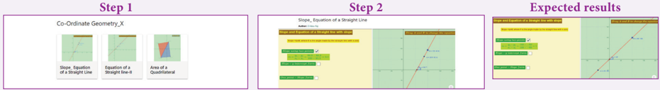

You can repeat the same steps for other activities

https://www.geogebra.org/m/jfr2zzgy#chapter/356195

or Scan the QR Code.

10th 238 Standard Mathematics
