# 5 Coordinate Geometry

> “A line is breadthless length” — Euclid

Apollonius was born at Perga, in modern day Turkey. His greatest work was called “conics” which introduced curves like circle, parabola geometrically. He wrote six other books all related to the basics of modern day coordinate geometry.

His ideas were applied to study planetary theory and solve practical problems. He developed the sundial and contributed to other branches of science using his exceptional geometric skills. For this reason, Apollonius is hailed as “The Great Geometer”.

## Learning Outcomes

- To find area of a triangle formed by three given points.
- To find area of a quadrilateral formed by four given points.
- To find the slope of a straight line.
- To determine equation of a straight line in various forms.
- To find the equation of a line parallel to the line $ax+by+c=0$.
- To find the equation of a line perpendicular to the line $ax+by+c=0$.

## 5.1 Introduction

Coordinate geometry, also called Analytical geometry is a branch of mathematics, in which curves in a plane are represented by algebraic equations. For example, the equation $x^2+y^2=1$, describes a circle of unit radius in the plane. Thus coordinate geometry can be seen as a branch of mathematics which interlinks algebra and geometry, where algebraic equations are represented by geometric curves. This connection makes it possible to reformulate problems in geometry to problems in algebra and vice versa. Thus, in coordinate geometry, the algebraic equations have visual representations thereby making our understanding much deeper. For instance, the first degree equation in two variables $ax+by+c=0$ represents a straight line in a plane. Overall, coordinate geometry is a tool to understand concepts visually and created new branches of mathematics in modern times.

In the earlier classes, we initiated the study of coordinate geometry where we studied about coordinate axes, coordinate plane, plotting of points in a plane, distance between two points, section formulae, etc. All these concepts form the basics of coordinate geometry. Let us now recall some of the basic formulae.

### Recall

##### Distance between two points

Distance between two points $A(x_1,y_1)$ and $B(x_2,y_2)$ is

$$
|AB|=d=\sqrt{(x_2-x_1)^2+(y_2-y_1)^2}.
$$

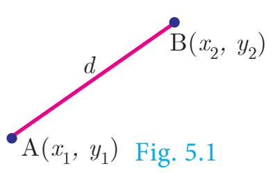

##### Mid-point of line segment

The mid-point $M$, of the line segment joining $A(x_1,y_1)$ and $B(x_2,y_2)$ is

$$
\left(\frac{x_1+x_2}2,\frac{y_1+y_2}2\right).
$$

##### Section Formula

**Internal Division**

Let $A(x_1,y_1)$ and $B(x_2,y_2)$ be two distinct points such that point $P(x,y)$ divides $AB$ internally in the ratio $m:n$.

Then the coordinates of $P$ are given by

$$
\left(\frac{mx_2+nx_1}{m+n},\frac{my_2+ny_1}{m+n}\right).
$$

**External Division**

Let $A(x_1,y_1)$ and $B(x_2,y_2)$ be two distinct points such that the point $P(x,y)$ divides $AB$ externally in the ratio $m:n$.

Then the coordinates of $P$ are given by

$$
\left(\frac{mx_2-nx_1}{m-n},\frac{my_2-ny_1}{m-n}\right).
$$

##### Centroid of a triangle

The coordinates of the centroid $G$ of a triangle with vertices $A(x_1,y_1)$, $B(x_2,y_2)$ and $C(x_3,y_3)$ are given by

$$
\left(\frac{x_1+x_2+x_3}3,\frac{y_1+y_2+y_3}3\right).
$$

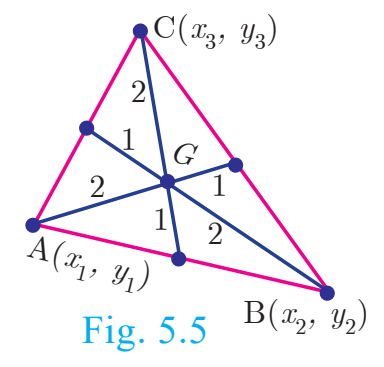

> **Progress Check**
>
> 1. Complete the following table.
>
> | S.No. | Points | Distance | Mid Point | Internal Point | Internal Ratio | External Point | External Ratio |
> | --- | --- | --- | --- | --- | --- | --- | --- |
> | (i) | $(3,4),(5,5)$ | | | | $2:3$ | | $2:3$ |
> | (ii) | $(-7,13),(-3,1)$ | | | $\left(-\dfrac{13}3,5\right)$ | | $(-13,15)$ | |
>
> 2. $A(0,5)$, $B(5,0)$ and $C(-4,-7)$ are vertices of a triangle then its centroid will be at _____.

## 5.2 Area of a Triangle

In your earlier classes, you have studied how to calculate the area of a triangle when its base and corresponding height (altitude) are given. You have used the formula.

$$
\text{Area of triangle}=\frac12\times\text{base}\times\text{altitude}\text{ sq.units}.
$$

With any three non-collinear points $A(x_1,y_1)$, $B(x_2,y_2)$ and $C(y_3,y_3)$ on a plane, we can form a triangle $ABC$.

Using distance between two points formula, we can calculate $AB=c$, $BC=a$, $CA=b$. $a,b,c$ represent the lengths of the sides of the triangle $ABC$.

Using $2s=a+b+c$, we can calculate the area of triangle $ABC$ by using the Heron’s formula $\sqrt{s(s-a)(s-b)(s-c)}$. But this procedure of finding sides of $\triangle ABC$ and then calculating its area will be a tedious procedure.

There is an elegant way of finding area of a triangle using the coordinates of its vertices. We shall discuss such a method below.

Let $ABC$ be any triangle whose vertices are at $A(x_1,y_1)$, $B(x_2,y_2)$ and $C(x_3,y_3)$.

Draw $AP$, $BQ$ and $CR$ perpendiculars from $A$, $B$ and $C$ to the $x$-axis, respectively.

Clearly $ABQP$, $APRC$ and $BQRC$ are all trapeziums.

Now from Fig. 5.7, it is clear that

$$
\text{Area of }\triangle ABC=\text{Area of trapezium }ABQP+\text{Area of trapezium }APRC-\text{Area of trapezium }BQRC.
$$

You also know that, the area of trapezium

$$
=\frac12\times\text{(sum of parallel sides)}\times\text{(perpendicular distance between the parallel sides)}.
$$

Therefore, Area of $\triangle ABC$

$$
\begin{aligned}
&=\frac12(BQ+AP)QP+\frac12(AP+CR)PR-\frac12(BQ+CR)QR\\
&=\frac12(y_2+y_1)(x_1-x_2)+\frac12(y_1+y_3)(x_3-x_1)-\frac12(y_2+y_3)(x_3-x_2)\\
&=\frac12\{x_1(y_2-y_3)+x_2(y_3-y_1)+x_3(y_1-y_2)\}.
\end{aligned}
$$

Thus, the area of $\triangle ABC$ is the absolute value of the expression

$$
\frac12\{x_1(y_2-y_3)+x_2(y_3-y_1)+x_3(y_1-y_2)\}\text{ sq.units}.
$$

The vertices $A(x_1,y_1)$, $B(x_2,y_2)$ and $C(x_3,y_3)$ of $\triangle ABC$ are said to be “taken in order” if $A,B,C$ are taken in anticlockwise direction. If we do this, then area of $\triangle ABC$ will never be negative.

##### Another form

The following pictorial representation helps us to write the above formula very easily.

$$
\text{Area of }\triangle ABC=\frac12\{(x_1y_2+x_2y_3+x_3y_1)-(x_2y_1+x_3y_2+x_1y_3)\}\text{ sq.units}.
$$

> **Note**
>
> “As the area of a triangle can never be negative, we must take the absolute value, in case area happens to be negative”.

> **Progress Check**
>
> The vertices of $\triangle PQR$ are $P(0,-4)$, $Q(3,1)$ and $R(-8,1)$.
>
> 1. Draw $\triangle PQR$ on a graph paper.
> 2. Check if $\triangle PQR$ is equilateral.
> 3. Find the area of $\triangle PQR$.
> 4. Find the coordinates of $M$, the mid-point of $QP$.
> 5. Find the coordinates of $N$, the mid-point of $QR$.
> 6. Find the area of $\triangle MPN$.
> 7. What is the ratio between the areas of $\triangle MPN$ and $\triangle PQR$?

### 5.2.1 Collinearity of three points

If three distinct points $A(x_1,y_1)$, $B(x_2,y_2)$ and $C(x_3,y_3)$ are collinear, then we cannot form a triangle, because for such a triangle there will be no altitude (height). Therefore, three points $A(x_1,y_1)$, $B(x_2,y_2)$ and $C(x_3,y_3)$ will be collinear if the area of $\triangle ABC=0$.

> **Note — Another condition for collinearity**
>
> If $A(x_1,y_1)$, $B(x_2,y_2)$ and $C(x_3,y_3)$ are collinear points, then
>
> $x_1(y_2-y_3)+x_2(y_3-y_1)+x_3(y_1-y_2)=0$
>
> or $x_1y_2+x_2y_3+x_3y_1=x_1y_3+x_2y_1+x_3y_2$.

Similarly, if the area of $\triangle ABC$ is zero, then the three points lie on the same straight line. Thus, three distinct points $A(x_1,y_1)$, $B(x_2,y_2)$ and $C(x_3,y_3)$ will be collinear if and only if area of $\triangle ABC=0$.

## 5.3 Area of a Quadrilateral

If $ABCD$ is a quadrilateral, then considering the diagonal $AC$, we can split the quadrilateral $ABCD$ into two triangles $ABC$ and $ACD$.

Using area of triangle formula given its vertices, we can calculate the areas of triangles $ABC$ and $ACD$.

Now, Area of the quadrilateral $ABCD=\text{Area of triangle }ABC+\text{Area of triangle }ACD$.

We use this information to find area of a quadrilateral when its vertices are given.

> **Thinking Corner**
>
> How many triangles exist, whose area is zero?

Let $A(x_1,y_1)$, $B(x_2,y_2)$, $C(x_3,y_3)$ and $D(x_4,y_4)$ be the vertices of a quadrilateral $ABCD$.

Now, Area of quadrilateral $ABCD=\text{Area of the }\triangle ABD+\text{Area of the }\triangle BCD$ (Fig. 5.9)

$$
\begin{aligned}
&=\frac12\{(x_1y_2+x_2y_4+x_4y_1)-(x_2y_1+x_4y_2+x_1y_4)\}\\
&\quad+\frac12\{(x_2y_3+x_3y_4+x_4y_2)-(x_3y_2+x_4y_3+x_2y_4)\}\\
&=\frac12\{(x_1y_2+x_2y_3+x_3y_4+x_4y_1)-(x_2y_1+x_3y_2+x_4y_3+x_1y_4)\}\\
&=\frac12\{(x_1-x_3)(y_2-y_4)-(x_2-x_4)(y_1-y_3)\}\text{ sq.units}.
\end{aligned}
$$

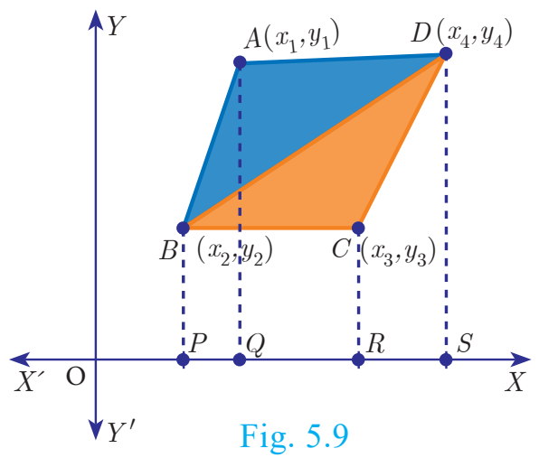

The following pictorial representation helps us to write the above formula very easily. Take the vertices $A(x_1,y_1)$, $B(x_2,y_2)$, $C(x_3,y_3)$ and $D(x_4,y_4)$ in counter-clockwise direction and write them column-wise as that of the area of a triangle.

$$
\text{Area of the quadrilateral }ABCD=\frac12\{(x_1y_2+x_2y_3+x_3y_4+x_4y_1)-(x_2y_1+x_3y_2+x_4y_3+x_1y_4)\}\text{ sq.units}.
$$

> **Note**
>
> - To find the area of a quadrilateral, we divide it into triangular regions, which have no common area and then add the area of these regions.
> - The area of the quadrilateral is never negative. That is, always take the area of quadrilateral as positive.

> **Thinking Corner**
>
> 1. If the area of a quadrilateral formed by the points $(a,a)$, $(-a,a)$, $(a,-a)$ and $(-a,-a)$, where $a\ne0$ is 64 square units, then identify the type of the quadrilateral.
> 2. Find all possible values of $a$.

#### Example 5.1

Find the area of the triangle whose vertices are $(-3,5)$, $(5,6)$ and $(5,-2)$.

**Solution** Plot the points in a rough diagram and take them in counter-clockwise order.

Let the vertices be $A(-3,5)$, $B(5,-2)$, $C(5,6)$ corresponding to $(x_1,y_1)$, $(x_2,y_2)$, $(x_3,y_3)$.

The area of $\triangle ABC$ is

$$
\begin{aligned}
&=\frac12\{(x_1y_2+x_2y_3+x_3y_1)-(x_2y_1+x_3y_2+x_1y_3)\}\\
&=\frac12\{(6+30+25)-(25-10-18)\}\\
&=\frac12\{61+3\}\\
&=\frac12(64)=32\text{ sq.units}.
\end{aligned}
$$

#### Example 5.2

Show that the points $P(-1.5,3)$, $Q(6,-2)$, $R(-3,4)$ are collinear.

**Solution** The points are $P(-1.5,3)$, $Q(6,-2)$, $R(-3,4)$.

$$
\begin{aligned}
\text{Area of }\triangle PQR&=\frac12\{(x_1y_2+x_2y_3+x_3y_1)-(x_2y_1+x_3y_2+x_1y_3)\}\\
&=\frac12\{(3+24-9)-(18+6-6)\}=\frac12\{18-18\}=0.
\end{aligned}
$$

Therefore, the given points are collinear.

#### Example 5.3

If the area of the triangle formed by the vertices $A(-1,2)$, $B(k,-2)$ and $C(7,4)$ (taken in order) is 22 sq. units, find the value of $k$.

**Solution** The vertices are $A(-1,2)$, $B(k,-2)$ and $C(7,4)$.

Area of triangle $ABC$ is 22 sq.units.

$$
\begin{aligned}
\frac12\{(x_1y_2+x_2y_3+x_3y_1)-(x_2y_1+x_3y_2+x_1y_3)\}&=22\\
\frac12\{(2+4k+14)-(2k-14-4)\}&=22\\
2k+34&=44\text{ gives }2k=10\text{ so }k=5.
\end{aligned}
$$

#### Example 5.4

If the points $P(-1,-4)$, $Q(b,c)$ and $R(5,-1)$ are collinear and if $2b+c=4$, then find the values of $b$ and $c$.

**Solution** Since the three points $P(-1,-4)$, $Q(b,c)$ and $R(5,-1)$ are collinear,

$$
\begin{aligned}
\text{Area of triangle }PQR&=0\\
\frac12\{(x_1y_2+x_2y_3+x_3y_1)-(x_2y_1+x_3y_2+x_1y_3)\}&=0\\
\frac12\{(-c-b-20)-(-4b+5c+1)\}&=0\\
-c-b-20+4b-5c-1&=0\\
b-2c&=7\quad\cdots(1).
\end{aligned}
$$

Also, $2b+c=4\quad\cdots(2)$ (from given information).

Solving (1) and (2) we get $b=3,c=-2$.

#### Example 5.5

The floor of a hall is covered with identical tiles which are in the shapes of triangles. One such triangle has the vertices at $(-3,2)$, $(-1,-1)$ and $(1,2)$. If the floor of the hall is completely covered by 110 tiles, find the area of the floor.

**Solution** Vertices of one triangular tile are at $(-3,2)$, $(-1,-1)$ and $(1,2)$.

$$
\begin{aligned}
\text{Area of this tile}&=\frac12\{(3-2+2)-(-2-1-6)\}\text{ sq.units}\\
&=\frac12(12)=6\text{ sq.units}.
\end{aligned}
$$

Since the floor is covered by 110 triangle shaped identical tiles,

$$
\text{Area of floor}=110\times6=660\text{ sq.units}.
$$

#### Example 5.6

Find the area of the quadrilateral formed by the points $(8,6)$, $(5,11)$, $(-5,12)$ and $(-4,3)$.

**Solution** Before determining the area of quadrilateral, plot the vertices in a graph.

Let the vertices be $A(8,6)$, $B(5,11)$, $C(-5,12)$ and $D(-4,3)$.

Therefore, area of the quadrilateral $ABCD$

$$
\begin{aligned}
&=\frac12\{(x_1y_2+x_2y_3+x_3y_4+x_4y_1)-(x_2y_1+x_3y_2+x_4y_3+x_1y_4)\}\\
&=\frac12\{(88+60-15-24)-(30-55-48+24)\}\\
&=\frac12\{109+49\}\\
&=\frac12\{158\}=79\text{ sq.units}.
\end{aligned}
$$

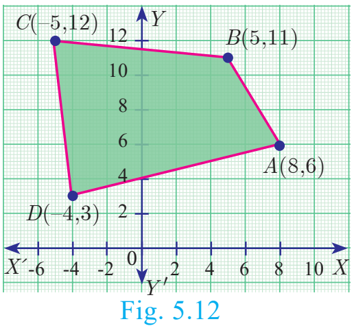

> **Progress Check**
>
> Given a quadrilateral $ABCD$ with vertices $A(-3,-8)$, $B(6,-6)$, $C(4,2)$, $D(-8,2)$.
>
> 1. Find the area of $\triangle ABC$.
> 2. Find the area of $\triangle ACD$.
> 3. Calculate area of $\triangle ABC+\text{area of }\triangle ACD$.
> 4. Find the area of quadrilateral $ABCD$.
> 5. Compare the answers obtained in 3 and 4.
>
> 

#### Example 5.7

The given diagram shows a plan for constructing a new parking lot at a campus. It is estimated that such construction would cost ₹1300 per square feet. What will be the total cost for making the parking lot?

**Solution** The parking lot is a quadrilateral whose vertices are at $A(2,2)$, $B(5,5)$, $C(4,9)$ and $D(1,7)$.

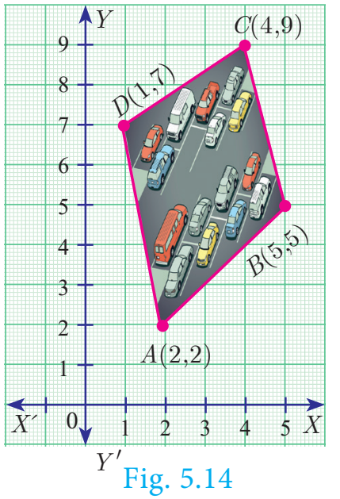

$$
\begin{aligned}
\text{Area of parking lot}&=\frac12\{(10+45+28+2)-(10+20+9+14)\}\\
&=\frac12\{85-53\}\\
&=\frac12(32)=16\text{ sq.units}.
\end{aligned}
$$

Area of parking lot $=16$ sq.feets.

Construction rate per square feet $=₹1300$.

Total cost for constructing the parking lot $=16\times1300=₹20800$.

> **Activity 1**
>
> (i) Take a graph sheet.
>
> (ii) Consider a triangle whose base is the line joining the points $(0,0)$ and $(6,0)$.
>
> (iii) Take the third vertex as $(1,1)$, $(2,2)$, $(3,3)$, $(4,4)$, $(5,5)$ and find their areas. Fill in the details given.
>
> (iv) Do you see any pattern with $A_1,A_2,A_3,A_4,A_5$? If so mention it.
>
> | Third vertex | Area of Triangle |
> | --- | --- |
> | $(1,1)$ | $A_1=$ |
> | $(2,2)$ | $A_2=$ |
> | $(3,3)$ | $A_3=$ |
> | $(4,4)$ | $A_4=$ |
> | $(5,5)$ | $A_5=$ |
>
> (v) Repeat the same process by taking third vertex in step (iii) as $(1,2)$, $(2,4)$, $(3,8)$, $(4,16)$, $(5,32)$.
>
> (vi) Fill the table with these new vertices.
>
> (vii) What pattern do you observe now with $A_1,A_2,A_3,A_4,A_5$?
>
> | Third vertex | Area of Triangle |
> | --- | --- |
> | $(1,2)$ | $A_1=$ |
> | $(2,4)$ | $A_2=$ |
> | $(3,8)$ | $A_3=$ |
> | $(4,16)$ | $A_4=$ |
> | $(5,32)$ | $A_5=$ |

> **Activity 2**
>
> Find the area of the shaded region.
>
> 

> **Do You Know?**
>
> Two French mathematicians Rene Descartes and Pierre-de-Fermat were the first to conceive the idea of modern coordinate geometry by 1630s.

### Exercise 5.1

1. Find the area of the triangle formed by the points:

   (i) $(1,-1)$, $(-4,6)$ and $(-3,-5)$

   (ii) $(-10,-4)$, $(-8,-1)$ and $(-3,-5)$

2. Determine whether the sets of points are collinear?

   (i) $\left(-\dfrac12,3\right)$, $(-5,6)$ and $(-8,8)$

   (ii) $(a,b+c)$, $(b,c+a)$ and $(c,a+b)$

3. Vertices of given triangles are taken in order and their areas are provided aside. In each case, find the value of ‘$p$’.

   | S.No. | Vertices | Area (sq.units) |
   | --- | --- | --- |
   | (i) | $(0,0),(p,8),(6,2)$ | 20 |
   | (ii) | $(p,p),(5,6),(5,-2)$ | 32 |

4. In each of the following, find the value of ‘$a$’ for which the given points are collinear.

   (i) $(2,3)$, $(4,a)$ and $(6,-3)$

   (ii) $(a,2-2a)$, $(-a+1,2a)$ and $(-4-a,6-2a)$

5. Find the area of the quadrilateral whose vertices are at

   (i) $(-9,-2)$, $(-8,-4)$, $(2,2)$ and $(1,-3)$

   (ii) $(-9,0)$, $(-8,6)$, $(-1,-2)$ and $(-6,-3)$

6. Find the value of $k$, if the area of a quadrilateral is 28 sq.units, whose vertices are taken in the order $(-4,-2)$, $(-3,k)$, $(3,-2)$ and $(2,3)$.

7. If the points $A(-3,9)$, $B(a,b)$ and $C(4,-5)$ are collinear and if $a+b=1$, then find $a$ and $b$.

8. Let $P(11,7)$, $Q(13.5,4)$ and $R(9.5,4)$ be the mid-points of the sides $AB$, $BC$ and $AC$ respectively of $\triangle ABC$. Find the coordinates of the vertices $A$, $B$ and $C$. Hence find the area of $\triangle ABC$ and compare this with area of $\triangle PQR$.

9. In the figure, the quadrilateral swimming pool shown is surrounded by concrete patio. Find the area of the patio.

   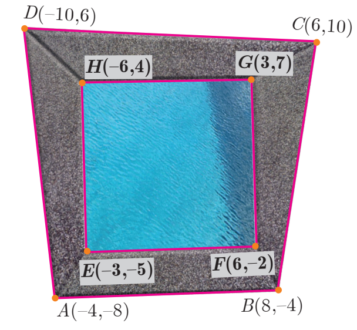

10. A triangular shaped glass with vertices at $A(-5,-4)$, $B(1,6)$ and $C(7,-4)$ has to be painted. If one bucket of paint covers 6 square feet, how many buckets of paint will be required to paint the whole glass, if only one coat of paint is applied.

11. In the figure, find the area of (i) triangle $AGF$ (ii) triangle $FED$ (iii) quadrilateral $BCEG$.

    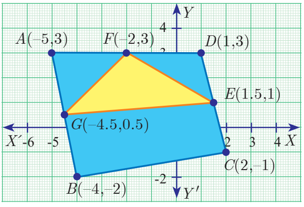

## 5.4 Inclination of a Line

The inclination of a line or the **angle of inclination** of a line is the angle which a straight line makes with the positive direction of $X$ axis measured in the counter-clockwise direction to the part of the line above the $X$ axis. The inclination of the line is usually denoted by $\theta$.

> **Note**
>
> - The inclination of $X$ axis and every line parallel to $X$ axis is $0^\circ$.
> - The inclination of $Y$ axis and every line parallel to $Y$ axis is $90^\circ$.

### 5.4.1 Slope of a Straight line

While laying roads one must know how steep the road will be. Similarly, when constructing a staircase, we should consider its steepness. For the same reason, anyone travelling along a hill or a bridge, feels hard compared to traveling along a plain road.

All these examples illustrate one important aspect called “Steepness”. The measure of steepness is called **slope** or **gradient**.

The concept of slope is important in economics because it is used to measure the rate at which the demand for a product changes in a given period of time on the basis of its price. Slope comprises of two factors namely steepness and direction.

> **Definition**
>
> If $\theta$ is the angle of inclination of a non-vertical straight line, then $\tan\theta$ is called the slope or gradient of the line and is denoted by $m$.
>
> Therefore the slope of the straight line is $m=\tan\theta$, $0\leq\theta\leq180^\circ$, $\theta\neq90^\circ$.

##### To find the slope of a straight line when two points are given

$$
\begin{aligned}
\text{Slope }m&=\tan\theta\\
&=\frac{\text{opposite side}}{\text{adjacent side}}\\
&=\frac{BC}{AC}\\
m&=\frac{y_2-y_1}{x_2-x_1}.
\end{aligned}
$$

$$
\boxed{\text{Slope }m=\frac{\text{Difference in }y\text{ coordinates}}{\text{Difference in }x\text{ coordinates}}}
$$

> **Note**
>
> The slope of a vertical line is undefined.

The slope of the line through $(x_1,y_1)$ and $(x_2,y_2)$ with $x_1\neq x_2$ is $\dfrac{y_2-y_1}{x_2-x_1}$.

##### Values of slopes

| S. No. | Condition | Slope | Diagram |
| --- | --- | --- | --- |
| (i) | $\theta=0^\circ$ | The line is parallel to the positive direction of $X$ axis. |  |
| (ii) | $0<\theta<90^\circ$ | The line has positive slope (A line with positive slope rises from left to right). |  |
| (iii) | $90^\circ<\theta<180^\circ$ | The line has negative slope (A line with negative slope falls from left to right). |  |
| (iv) | $\theta=180^\circ$ | The line is parallel to the negative direction of $X$ axis. | 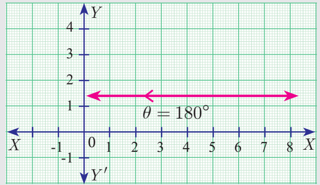 |
| (v) | $\theta=90^\circ$ | The slope is undefined. |  |

> **Activity 3**
>
> The diagram contain four lines $l_1$, $l_2$, $l_3$ and $l_4$.
>
> (i) Which lines have positive slope?
>
> (ii) Which lines have negative slope?
>
> 

> **Progress Check**
>
> Write down the slope of each of the lines shown on the grid below. One is solved for you.
>
> 
>
> **Solution** (iii) Slope of the line $p=\dfrac{\text{Difference in }y\text{ coordinate}}{\text{Difference in }x\text{ coordinate}}=\dfrac{3}{3}=1$.

### 5.4.2 Slopes of parallel lines

Two non-vertical lines are **parallel** if and only if their **slopes are equal**.

Let $l_1$ and $l_2$ be two non-vertical lines with slopes $m_1$ and $m_2$ respectively.

Let the inclination of the lines with positive direction of $X$ axis be $\theta_1$ and $\theta_2$ respectively.

Assume, $l_1$ and $l_2$ are parallel

$$
\begin{aligned}
\theta_1&=\theta_2\quad\text{(Since, }\theta_1,\theta_2\text{ are corresponding angles)}\\
\tan\theta_1&=\tan\theta_2\\
m_1&=m_2
\end{aligned}
$$

Hence, the slopes are equal.

Therefore, non-vertical parallel lines have equal slopes.

##### Conversely

Let the slopes be equal, then

$$
\begin{aligned}
m_1&=m_2\\
\tan\theta_1&=\tan\theta_2\\
\theta_1&=\theta_2\quad\text{(since }0\leq\theta_1\leq180^\circ,\ 0\leq\theta_2\leq180^\circ\text{)}
\end{aligned}
$$

That is the corresponding angles are equal.

Therefore, $l_1$ and $l_2$ are parallel.

Thus, non-vertical lines having equal slopes are parallel.

Hence, **non vertical lines** are **parallel** if and only if their **slopes are equal**.

### 5.4.3 Slopes of perpendicular lines

Two non-vertical lines with slopes $m_1$ and $m_2$ are **perpendicular** if and only if $m_1m_2=-1$.

Let $l_1$ and $l_2$ be two non-vertical lines with slopes $m_1$ and $m_2$, respectively. Let their inclinations be $\theta_1$ and $\theta_2$ respectively.

Then $m_1=\tan\theta_1$ and $m_2=\tan\theta_2$.

First we assume that, $l_1$ and $l_2$ are perpendicular to each other.

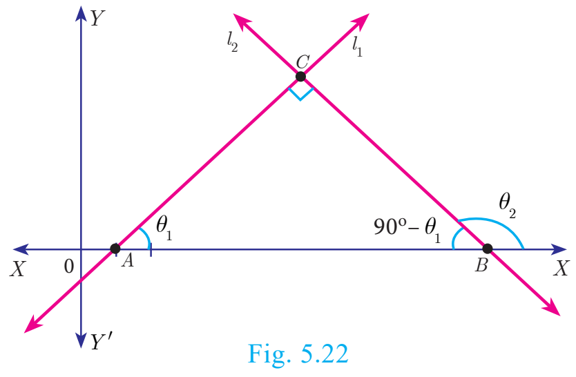

Then $\angle ABC=90^\circ-\theta_1$ (sum of angles of $\triangle ABC$ is $180^\circ$).

Now measuring slope of $l_2$ through angles $\theta_2$ and $90^\circ-\theta_1$, which are opposite to each other, we get

$$
\begin{aligned}
\tan\theta_2&=-\tan(90^\circ-\theta_1)\\
&=\frac{-\sin(90^\circ-\theta_1)}{\cos(90^\circ-\theta_1)}=\frac{-\cos\theta_1}{\sin\theta_1}=-\cot\theta_1
\end{aligned}
$$

gives, $\tan\theta_2=-\dfrac{1}{\tan\theta_1}$

$$
\begin{aligned}
\tan\theta_1\cdot\tan\theta_2&=-1\\
m_1\cdot m_2&=-1.
\end{aligned}
$$

Thus, when the line $l_1$ is perpendicular to line $l_2$ then $m_1m_2=-1$.

##### Conversely,

Let $l_1$ and $l_2$ be two non-vertical lines with slopes $m_1$ and $m_2$ respectively, such that $m_1m_2=-1$.

Since $m_1=\tan\theta_1$, $m_2=\tan\theta_2$

We have

$$
\begin{aligned}
\tan\theta_1\tan\theta_2&=-1\\
\tan\theta_1&=-\frac{1}{\tan\theta_2}\\
\tan\theta_1&=-\cot\theta_2\\
\tan\theta_1&=-\tan(90^\circ-\theta_2)\\
\tan\theta_1&=\tan\bigl(-(90^\circ-\theta_2)\bigr)=\tan(\theta_2-90^\circ)\\
\theta_1&=\theta_2-90^\circ\quad\text{(since }0\leq\theta_1\leq180^\circ,\ 0\leq\theta_2\leq180^\circ\text{)}\\
\theta_2&=90^\circ+\theta_1
\end{aligned}
$$

But in $\triangle ABC$, $\theta_2=\angle C+\theta_1$.

Therefore, $\angle C=90^\circ$.

> **Do You Know?**
>
> In any triangle, exterior angle is equal to sum of the interior opposite angles.

> **Note**
>
> Let $l_1$ and $l_2$ be two lines with well-defined slopes $m_1$ and $m_2$ respectively, then
>
> (i) $l_1$ is parallel to $l_2$ if and only if $m_1=m_2$.
>
> (ii) $l_1$ is perpendicular to $l_2$ if and only if $m_1m_2=-1$.

#### Example 5.8

(i) What is the slope of a line whose inclination is $30^\circ$?

(ii) What is the inclination of a line whose slope is $\sqrt{3}$?

**Solution**

(i) Here $\theta=30^\circ$

Slope $m=\tan\theta$

Therefore, slope $m=\tan30^\circ=\dfrac{1}{\sqrt{3}}$.

(ii) Given $m=\sqrt{3}$, let $\theta$ be the inclination of the line

$$
\tan\theta=\sqrt{3}
$$

We get, $\theta=60^\circ$.

> **Thinking Corner**
>
> The straight lines $X$ axis and $Y$ axis are perpendicular to each other. Is the condition $m_1m_2=-1$ true?

#### Example 5.9

Find the slope of a line joining the given points

(i) $(-6,1)$ and $(-3,2)$

(ii) $\left(-\dfrac{1}{3},\dfrac{1}{2}\right)$ and $\left(\dfrac{2}{7},\dfrac{3}{7}\right)$

(iii) $(14,10)$ and $(14,-6)$

**Solution**

(i) $(-6,1)$ and $(-3,2)$

$$
\text{The slope}=\frac{y_2-y_1}{x_2-x_1}=\frac{2-1}{-3+6}=\frac{1}{3}.
$$

(ii) $\left(-\dfrac{1}{3},\dfrac{1}{2}\right)$ and $\left(\dfrac{2}{7},\dfrac{3}{7}\right)$

$$
\begin{aligned}
\text{The slope}&=\frac{\frac{3}{7}-\frac{1}{2}}{\frac{2}{7}+\frac{1}{3}}=\frac{\frac{6-7}{14}}{\frac{6+7}{21}}\\
&=-\frac{1}{14}\times\frac{21}{13}=-\frac{3}{26}.
\end{aligned}
$$

(iii) $(14,10)$ and $(14,-6)$

$$
\text{The slope}=\frac{-6-10}{14-14}=\frac{-16}{0}.
$$

The slope is undefined.

> **Progress Check**
>
> Fill in the missing boxes
>
> | S.No. | Points | Slope |
> | --- | --- | --- |
> | 1 | $A(-a,b)$, $B(3a,-b)$ | |
> | 2 | $A(2,3)$, $B(\_,\_)$ | $2$ |
> | 3 | $A(\_,\_)$, $B(\_,\_)$ | $0$ |
> | 4 | $A(\_,\_)$, $B(\_,\_)$ | undefined |

#### Example 5.10

The line $r$ passes through the points $(-2,2)$ and $(5,8)$ and the line $s$ passes through the points $(-8,7)$ and $(-2,0)$. Is the line $r$ perpendicular to $s$?

**Solution**

The slope of line $r$ is

$$
m_1=\frac{8-2}{5+2}=\frac{6}{7}
$$

The slope of line $s$ is

$$
m_2=\frac{0-7}{-2+8}=\frac{-7}{6}
$$

$$
\text{The product of slopes}=\frac{6}{7}\times\frac{-7}{6}=-1
$$

That is, $m_1m_2=-1$.

Therefore, the line $r$ is perpendicular to line $s$.

#### Example 5.11

The line $p$ passes through the points $(3,-2)$, $(12,4)$ and the line $q$ passes through the points $(6,-2)$ and $(12,2)$. Is $p$ parallel to $q$?

**Solution**

The slope of line $p$ is

$$
m_1=\frac{4+2}{12-3}=\frac{6}{9}=\frac{2}{3}
$$

The slope of line $q$ is

$$
m_2=\frac{2+2}{12-6}=\frac{4}{6}=\frac{2}{3}
$$

Thus, slope of line $p=$ slope of line $q$.

Therefore, line $p$ is parallel to the line $q$.

#### Example 5.12

Show that the points $(-2,5)$, $(6,-1)$ and $(2,2)$ are collinear.

**Solution**

The vertices are $A(-2,5)$, $B(6,-1)$ and $C(2,2)$.

$$
\begin{aligned}
\text{Slope of }AB&=\frac{-1-5}{6+2}=\frac{-6}{8}=\frac{-3}{4}\\
\text{Slope of }BC&=\frac{2+1}{2-6}=\frac{3}{-4}=\frac{-3}{4}
\end{aligned}
$$

We get, Slope of $AB=$ Slope of $BC$.

Therefore, the points $A$, $B$, $C$ all lie in a same straight line.

Hence the points $A$, $B$ and $C$ are collinear.

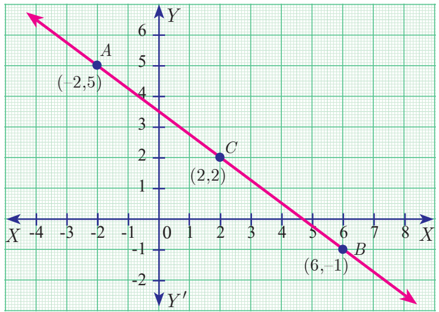

#### Example 5.13

Let $A(1,-2)$, $B(6,-2)$, $C(5,1)$ and $D(2,1)$ be four points

(i) Find the slope of the line segments (a) $AB$ (b) $CD$

(ii) Find the slope of the line segments (a) $BC$ (b) $AD$

(iii) What can you deduce from your answer.

**Solution**

(i) (a)

$$
\text{Slope of }AB=\frac{y_2-y_1}{x_2-x_1}=\frac{-2+2}{6-1}=0
$$

(b)

$$
\text{Slope of }CD=\frac{1-1}{2-5}=\frac{0}{-3}=0
$$

> **Do You Know?**
>
> If the slopes of both the pairs of opposite sides are equal then the quadrilateral is a parallelogram.

(ii) (a)

$$
\text{Slope of }BC=\frac{1+2}{5-6}=\frac{3}{-1}=-3
$$

(b)

$$
\text{Slope of }AD=\frac{1+2}{2-1}=\frac{3}{1}=3
$$

(iii) The slope of $AB$ and $CD$ are equal so $AB$, $CD$ are parallel.

Similarly the lines $AD$ and $BC$ are not parallel, since their slopes are not equal.

So, we can deduce that the quadrilateral $ABCD$ is a trapezium.

#### Example 5.14

Consider the graph representing growth of population (in crores). Find the slope of the line $AB$ and hence estimate the population in the year 2030?

**Solution**

The points $A(2005,96)$ and $B(2015,100)$ are on the line $AB$.

$$
\text{Slope of }AB=\frac{100-96}{2015-2005}=\frac{4}{10}=\frac{2}{5}
$$

Let the growth of population in 2030 be $k$ crores.

Assuming that the point $C(2030,k)$ is on $AB$,

we have, slope of $AC=$ slope of $AB$

$$
\frac{k-96}{2030-2005}=\frac{2}{5}\quad\text{gives}\quad\frac{k-96}{25}=\frac{2}{5}
$$

$$
\begin{aligned}
k-96&=10\\
k&=106
\end{aligned}
$$

Hence the estimated population in $2030=106$ Crores.

#### Example 5.15

Without using Pythagoras theorem, show that the points $(1,-4)$, $(2,-3)$ and $(4,-7)$ form a right angled triangle.

**Solution**

Let the given points be $A(1,-4)$, $B(2,-3)$ and $C(4,-7)$.

$$
\begin{aligned}
\text{The slope of }AB&=\frac{-3+4}{2-1}=\frac{1}{1}=1\\
\text{The slope of }BC&=\frac{-7+3}{4-2}=\frac{-4}{2}=-2\\
\text{The slope of }AC&=\frac{-7+4}{4-1}=\frac{-3}{3}=-1
\end{aligned}
$$

$$
\text{Slope of }AB\times\text{slope of }AC=(1)(-1)=-1
$$

$AB$ is perpendicular to $AC$. $\angle A=90^\circ$.

Therefore, $\triangle ABC$ is a right angled triangle.

> **Thinking Corner**
>
> Provide three examples of using the concept of slope in real-life situations.

#### Example 5.16

Prove analytically that the line segment joining the mid-points of two sides of a triangle is parallel to the third side and is equal to half of its length.

**Solution**

Let $P(a,b)$, $Q(c,d)$ and $R(e,f)$ be the vertices of a triangle.

Let $S$ be the mid-point of $PQ$ and $T$ be the mid-point of $PR$.

Therefore,

$$
S=\left(\frac{a+c}{2},\frac{b+d}{2}\right)\quad\text{and}\quad T=\left(\frac{a+e}{2},\frac{b+f}{2}\right)
$$

Now,

$$
\text{slope of }ST=\frac{\frac{b+f}{2}-\frac{b+d}{2}}{\frac{a+e}{2}-\frac{a+c}{2}}=\frac{f-d}{e-c}
$$

And

$$
\text{slope of }QR=\frac{f-d}{e-c}
$$

Therefore, $ST$ is parallel to $QR$. (since, their slopes are equal)

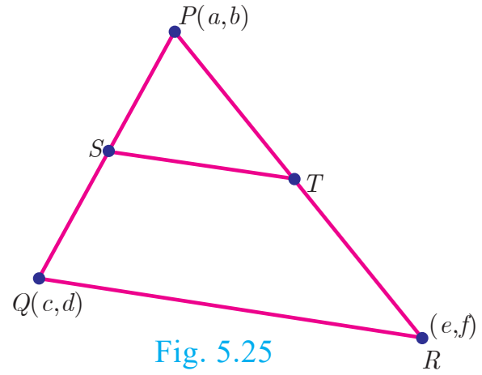

Also

$$
\begin{aligned}
ST&=\sqrt{\left(\frac{a+e}{2}-\frac{a+c}{2}\right)^2+\left(\frac{b+f}{2}-\frac{b+d}{2}\right)^2}\\
&=\frac{1}{2}\sqrt{(e-c)^2+(f-d)^2}\\
ST&=\frac{1}{2}QR
\end{aligned}
$$

Thus $ST$ is parallel to $QR$ and half of it.

> **Note**
>
> This example illustrates how a geometrical result can be proved using coordinate Geometry.

### Exercise 5.2

1. What is the slope of a line whose inclination with positive direction of $x$-axis is

   (i) $90^\circ$ (ii) $0^\circ$

2. What is the inclination of a line whose slope is (i) $0$ (ii) $1$

3. Find the slope of a line joining the points

   (i) $(5,\sqrt{5})$ with the origin

   (ii) $(\sin\theta,-\cos\theta)$ and $(-\sin\theta,\cos\theta)$

4. What is the slope of a line perpendicular to the line joining $A(5,1)$ and $P$ where $P$ is the mid-point of the segment joining $(4,2)$ and $(-6,4)$.

5. Show that the given points are collinear: $(-3,-4)$, $(7,2)$ and $(12,5)$

6. If the three points $(3,-1)$, $(a,3)$ and $(1,-3)$ are collinear, find the value of $a$.

7. The line through the points $(-2,a)$ and $(9,3)$ has slope $-\dfrac{1}{2}$. Find the value of $a$.

8. The line through the points $(-2,6)$ and $(4,8)$ is perpendicular to the line through the points $(8,12)$ and $(x,24)$. Find the value of $x$.

9. Show that the given points form a right angled triangle.

   (i) $A(1,-4)$, $B(2,-3)$ and $C(4,-7)$

   (ii) $L(0,5)$, $M(9,12)$ and $N(3,14)$

10. Show that the given points form a parallelogram: $A(2.5,3.5)$, $B(10,-4)$, $C(2.5,-2.5)$ and $D(-5,5)$.

11. If the points $A(2,2)$, $B(-2,-3)$, $C(1,-3)$ and $D(x,y)$ form a parallelogram then find the value of $x$ and $y$.

12. Let $A(3,-4)$, $B(9,-4)$, $C(5,-7)$ and $D(7,-7)$. Show that $ABCD$ is a trapezium.

13. A quadrilateral has vertices at $A(-4,-2)$, $B(5,-1)$, $C(6,5)$ and $D(-7,6)$. Show that the mid-points of its sides form a parallelogram.

## 5.5 Straight Line

Any first degree equation in two variables $x$ and $y$ of the form $ax+by+c=0$ …(1) where $a$, $b$, $c$ are real numbers and at least one of $a$, $b$ is non-zero is called “Straight line” in $XY$ plane.

### 5.5.1 Equation of coordinate axes

The $X$ axis and $Y$ axis together are called coordinate axes. The $x$ coordinate of every point on $OY$ ($Y$ axis) is 0. Therefore equation of $OY$ ($Y$ axis) is $x=0$ (fig 5.27).

The $y$ coordinate of every point on $OX$ ($X$ axis) is 0. Therefore the equation of $OX$ ($X$ axis) is $y=0$ (fig 5.28).

### 5.5.2 Equation of a straight line parallel to $X$ axis

Let $AB$ be a straight line parallel to $X$ axis, which is at a distance ‘$b$’. Then $y$ coordinate of every point on ‘$AB$’ is ‘$b$’. (fig 5.29)

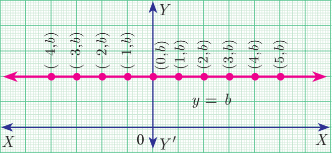

Therefore, the equation of $AB$ is $y=b$.

> **Note**
>
> - If $b>0$, then the line $y=b$ lies above the $X$ axis.
> - If $b<0$, then the line $y=b$ lies below the $X$ axis.
> - If $b=0$, then the line $y=b$ is the $X$ axis itself.

### 5.5.3 Equation of a Straight line parallel to the $Y$ axis

Let $CD$ be a straight line parallel to $Y$ axis, which is at a distance ‘$c$’. Then $x$ coordinate of every point on $CD$ is ‘$c$’. The equation of $CD$ is $x=c$. (fig 5.30)

> **Note**
>
> - If $c>0$, then the line $x=c$ lies right to the side of the $Y$ axis.
> - If $c<0$, then the line $x=c$ lies left to the side of the $Y$ axis.
> - If $c=0$, then the line $x=c$ is the $Y$ axis itself.

#### Example 5.17

Find the equation of a straight line passing through $(5,7)$ and is (i) parallel to $X$ axis (ii) parallel to $Y$ axis.

**Solution**

(i) The equation of any straight line parallel to $X$ axis is $y=b$.

Since it passes through $(5,7)$, $b=7$.

Therefore, the required equation of the line is $y=7$.

(ii) The equation of any straight line parallel to $Y$ axis is $x=c$.

Since it passes through $(5,7)$, $c=5$.

Therefore, the required equation of the line is $x=5$.

### 5.5.4 Slope-Intercept Form

Every straight line that is not vertical will cut the $Y$ axis at a single point. The $y$ coordinate of this point is called $y$ intercept of the line.

A line with slope $m$ and $y$ intercept $c$ can be expressed through the equation

$$
y=mx+c
$$

We call this equation as the slope-intercept form of the equation of a line.

> **Do You Know?**
>
> - If a line with slope $m$, $m\ne0$ makes $x$ intercept $d$, then the equation of the straight line is $y=m(x-d)$.
> - $y=mx$ represent equation of a straight line with slope $m$ and passing through the origin.

#### Example 5.18

Find the equation of a straight line whose

(i) Slope is 5 and $y$ intercept is $-9$.

(ii) Inclination is $45^\circ$ and $y$ intercept is 11.

**Solution**

(i) Given, Slope $=5$, $y$ intercept, $c=-9$.

Therefore, equation of a straight line is $y=mx+c$.

$$
y=5x-9\Rightarrow5x-y-9=0
$$

(ii) Given, $\theta=45^\circ$, $y$ intercept, $c=11$.

Slope $m=\tan\theta=\tan45^\circ=1$.

Therefore, equation of a straight line is of the form $y=mx+c$.

Hence we get,

$$
y=x+11\Rightarrow x-y+11=0
$$

#### Example 5.19

Calculate the slope and $y$ intercept of the straight line $8x-7y+6=0$.

**Solution** Equation of the given straight line is $8x-7y+6=0$.

$$
7y=8x+6
$$

(bringing it to the form $y=mx+c$)

$$
y=\frac87x+\frac67\qquad\ldots(1)
$$

Comparing (1) with $y=mx+c$,

Slope $m=\dfrac87$ and $y$ intercept $c=\dfrac67$.

> **Do You Know?**
>
> For, the point $(x,y)$ in a $xy$ plane, the $x$ coordinate $x$ is called “Abscissae” and the $y$ coordinate $y$ is called “Ordinate”.

#### Example 5.20

The graph relates temperatures $y$ (in Fahrenheit degree) to temperatures $x$ (in Celsius degree) (a) Find the slope and $y$ intercept (b) Write an equation of the line (c) What is the mean temperature of the earth in Fahrenheit degree if its mean temperature is $25^\circ$ Celsius?

**Solution**

(a) From the figure,

$$
\text{slope}=\frac{\text{change in }y\text{ coordinate}}{\text{change in }x\text{ coordinate}}=\frac{68-32}{20-0}=\frac{36}{20}=\frac95=1.8
$$

The line crosses the $Y$ axis at $(0,32)$.

So the slope is $\dfrac95$ and $y$ intercept is 32.

(b) Use the slope and $y$ intercept to write an equation.

The equation is $y=\dfrac95x+32$.

(c) In Celsius, the mean temperature of the earth is $25^\circ$. To find the mean temperature in Fahrenheit, we find the value of $y$ when $x=25$.

$$
\begin{aligned}
y&=\frac95x+32\\
y&=\frac95(25)+32\\
y&=77
\end{aligned}
$$

Therefore, the mean temperature of the earth is $77^\circ\mathrm{F}$.

> **Note**
>
> The formula for converting Celsius to Fahrenheit is given by $F=\dfrac95C+32$ which is the linear equation representing a straight line derived in the example.

### 5.5.5 Point-Slope form

Here we will find the equation of a straight line passing through a given point $A(x_1,y_1)$ and having the slope $m$.

Let $P(x,y)$ be any point other than $A$ on the given line. Slope of the line joining $A(x_1,y_1)$ and $P(x,y)$ is given by

$$
m=\tan\theta=\frac{y-y_1}{x-x_1}
$$

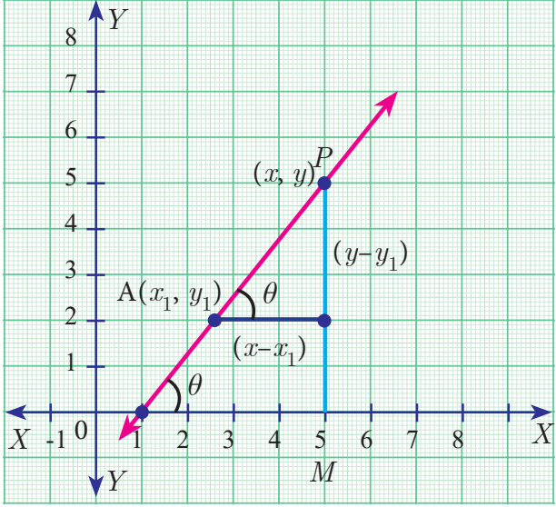

Therefore, the equation of the required line is

$$
y-y_1=m(x-x_1)\quad\text{(Point slope form)}
$$

> **Thinking Corner**
>
> Is it possible to express, the equation of a straight line in slope-intercept form, when it is parallel to $Y$ axis?

#### Example 5.21

Find the equation of a line passing through the point $(3,-4)$ and having slope $\dfrac{-5}{7}$.

**Solution** Given, $(x_1,y_1)=(3,-4)$ and $m=\dfrac{-5}{7}$.

The equation of the point-slope form of the straight line is $y-y_1=m(x-x_1)$.

We write it as

$$
y+4=-\frac57(x-3)
$$

$$
\Rightarrow5x+7y+13=0
$$

#### Example 5.22

Find the equation of a line passing through the point $A(1,4)$ and perpendicular to the line joining points $(2,5)$ and $(4,7)$.

**Solution**

Let the given points be $A(1,4)$, $B(2,5)$ and $C(4,7)$.

$$
\text{Slope of line }BC=\frac{7-5}{4-2}=\frac22=1
$$

Let $m$ be the slope of the required line.

Since the required line is perpendicular to $BC$,

$$
\begin{aligned}
m\times1&=-1\\
m&=-1
\end{aligned}
$$

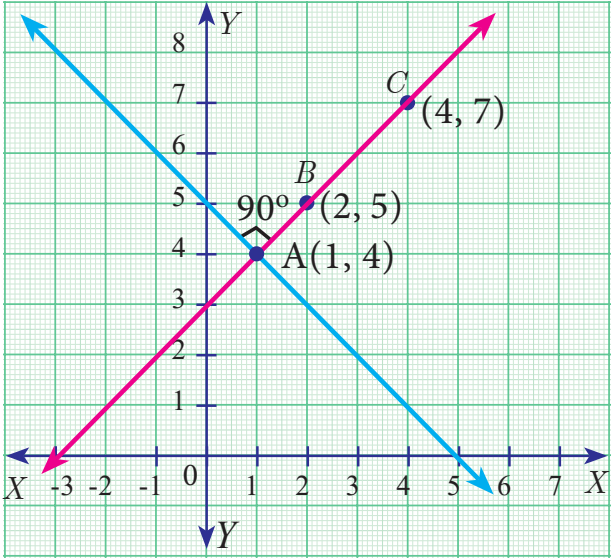

The required line also pass through the point $A(1,4)$.

The equation of the required straight line is $y-y_1=m(x-x_1)$.

$$
\begin{aligned}
y-4&=-1(x-1)\\
y-4&=-x+1
\end{aligned}
$$

We get, $x+y-5=0$.

### 5.5.6 Two Point form

Let $A(x_1,y_1)$ and $B(x_2,y_2)$ be two given distinct points. Slope of the straight line passing through these points is given by $m=\dfrac{y_2-y_1}{x_2-x_1}$, $(x_2\ne x_1)$.

From the equation of the straight line in point slope form, we get

$$
y-y_1=\frac{y_2-y_1}{x_2-x_1}(x-x_1)
$$

Hence,

$$
\frac{y-y_1}{y_2-y_1}=\frac{x-x_1}{x_2-x_1}
$$

(is the equation of the line in two-point form)

#### Example 5.23

Find the equation of a straight line passing through $(5,-3)$ and $(7,-4)$.

**Solution** The equation of a straight line passing through the two points $(x_1,y_1)$ and $(x_2,y_2)$ is

$$
\frac{y-y_1}{y_2-y_1}=\frac{x-x_1}{x_2-x_1}
$$

Substituting the points we get,

$$
\frac{y+3}{-4+3}=\frac{x-5}{7-5}
$$

$$
\Rightarrow2y+6=-x+5
$$

Therefore, $x+2y+1=0$.

> **Do You Know?**
>
> The great mathematical physicists like Galileo and Newton used coordinate geometry to characterize the motions of objects in plane and space.

#### Example 5.24

Two buildings of different heights are located at opposite sides of each other. If a heavy rod is attached joining the terrace of the buildings from $(6,10)$ to $(14,12)$, find the equation of the rod joining the buildings?

**Solution** Let $A(6,10)$, $B(14,12)$ be the points denoting the terrace of the buildings.

The equation of the rod is the equation of the straight line passing through $A(6,10)$ and $B(14,12)$.

$$
\frac{y-y_1}{y_2-y_1}=\frac{x-x_1}{x_2-x_1}\quad\text{gives}\quad\frac{y-10}{12-10}=\frac{x-6}{14-6}
$$

$$
\frac{y-10}{2}=\frac{x-6}{8}
$$

Therefore, $x-4y+34=0$.

Hence, equation of the rod is $x-4y+34=0$.

### 5.5.7 Intercept Form

We will find the equation of a line whose intercepts are $a$ and $b$ on the coordinate axes respectively.

Let $PQ$ be a line meeting $X$ axis at $A$ and $Y$ axis at $B$. Let $OA=a$, $OB=b$. Then the coordinates of $A$ and $B$ are $(a,0)$ and $(0,b)$ respectively. Therefore, the equation of the line joining $A$ and $B$ is

$$
\frac{y-0}{b-0}=\frac{x-a}{0-a}\quad\text{we get,}\quad\frac yb=\frac{x-a}{-a}\quad\text{gives}\quad\frac yb=\frac{-x}{a}+1
$$

Hence,

$$
\frac xa+\frac yb=1\quad\text{(Intercept form of a line)}
$$

> **Progress Check**
>
> Fill the details in respective boxes.
>
> | Form | When to use? | Name |
> |---|---|---|
> | $y=mx+c$ | Slope $=m$, Intercept $=c$ are given | |
> | $\dfrac{y-y_1}{y_2-y_1}=\dfrac{x-x_1}{x_2-x_1}$ | | |
> | | The intercepts are given | Intercept form |

#### Example 5.25

Find the equation of a line which passes through $(5,7)$ and makes intercepts on the axes equal in magnitude but opposite in sign.

**Solution** Let the $x$ intercept be ‘$a$’ and $y$ intercept be ‘$-a$’.

The equation of the line in intercept form is

$$
\frac xa+\frac yb=1
$$

$$
\Rightarrow\frac xa+\frac y{-a}=1\quad\text{(Here }b=-a\text{)}
$$

$$
\therefore x-y=a.\qquad\ldots(1)
$$

Since (1) passes through $(5,7)$,

Therefore, $5-7=a\Rightarrow a=-2$.

Thus the required equation of the straight line is $x-y=-2$; or $x-y+2=0$.

#### Example 5.26

Find the intercepts made by the line $4x-9y+36=0$ on the coordinate axes.

**Solution** Equation of the given line is $4x-9y+36=0$.

We write it as $4x-9y=-36$ (bringing it to the normal form).

Dividing by $-36$ we get,

$$
\frac x{-9}+\frac y4=1\qquad\ldots(1)
$$

Comparing (1) with intercept form, we get $x$ intercept $a=-9$; $y$ intercept $b=4$.

#### Example 5.27

A mobile phone is put to use when the battery power is 100%. The percent of battery power ‘$y$’ (in decimal) remaining after using the mobile phone for $x$ hours is assumed as $y=-0.25x+1$.

(i) Find the number of hours elapsed if the battery power is 40%.

(ii) How much time does it take so that the battery has no power?

**Solution**

(i) To find the time when the battery power is 40%, we have to take $y=0.40$.

$$
0.40=-0.25x+1\Rightarrow0.25x=0.60
$$

We get, $x=\dfrac{0.60}{0.25}=2.4$ hours.

(ii) If the battery power is 0 then $y=0$.

Therefore, $0=-0.25x+1$ gives $0.25x=1$ hence $x=4$ hours.

Thus, after 4 hours, the battery of the mobile phone will have no power.

#### Example 5.28

A line makes positive intercepts on coordinate axes whose sum is 7 and it passes through $(-3,8)$. Find its equation.

**Solution** If $a$ and $b$ are the intercepts then $a+b=7$ or $b=7-a$.

By intercept form

$$
\frac xa+\frac yb=1
$$

We have

$$
\frac xa+\frac y{7-a}=1
$$

As this line pass through the point $(-3,8)$, we have

$$
\frac{-3}{a}+\frac8{7-a}=1\Rightarrow-3(7-a)+8a=a(7-a)
$$

$$
-21+3a+8a=7a-a^2
$$

So, $a^2+4a-21=0$.

Solving this equation $(a-3)(a+7)=0$,

$$
a=3\quad\text{or}\quad a=-7
$$

Since $a$ is positive, we have $a=3$ and $b=7-a=7-3=4$.

Hence

$$
\frac x3+\frac y4=1
$$

Therefore, $4x+3y-12=0$ is the required equation.

#### Example 5.29

A circular garden is bounded by East Avenue and Cross Road. Cross Road intersects North Street at $D$ and East Avenue at $E$. $AD$ is tangential to the circular garden at $A(3,10)$. Using the figure,

(a) Find the equation of

(i) East Avenue.

(ii) North Street.

(iii) Cross Road.

(b) Where does the Cross Road intersect?

(i) North Street (ii) East Avenue.

**Solution**

(a) (i) East Avenue is the straight line joining $C(0,2)$ and $B(7,2)$. Thus the equation of East Avenue is obtained by using two-point form which is

$$
\frac{y-2}{2-2}=\frac{x-0}{7-0}
$$

$$
\frac{y-2}{0}=\frac x7\Rightarrow y=2
$$

(ii) Since the point $D$ lie vertically above $C(0,2)$. The $x$ coordinate of $D$ is 0.

Since any point on North Street has $x$ coordinate value 0.

The equation of North Street is $x=0$.

(iii) To find equation of Cross Road.

Center of circular garden $M$ is at $(7,7)$, $A$ is $(3,10)$.

We first find slope of $MA$, which we call $m_1$.

Thus

$$
m_1=\frac{10-7}{3-7}=\frac{-3}{4}.
$$

Since the Cross Road is perpendicular to $MA$, if $m_2$ is the slope of the Cross Road then, $m_1m_2=-1$ gives $\dfrac{-3}{4}m_2=-1$ so $m_2=\dfrac43$.

Now, the cross road has slope $\dfrac43$ and it passes through the point $A(3,10)$.

The equation of the Cross Road is

$$
y-10=\frac43(x-3)
$$

$$
3y-30=4x-12
$$

Hence, $4x-3y+18=0$.

(b) (i) If $D$ is $(0,k)$ then $D$ is a point on the Cross Road.

Therefore, substituting $x=0$, $y=k$ in the equation of Cross Road, we get,

$$
0-3k+18=0
$$

Value of $k=6$.

Therefore, $D$ is $(0,6)$.

(ii) To find $E$, let $E$ be $(q,2)$.

Put $y=2$ in the equation of the Cross Road, we get,

$$
4q-6+18=0
$$

$$
4q=-12\quad\text{gives}\quad q=-3
$$

Therefore, The point $E$ is $(-3,2)$.

Thus the Cross Road meets the North Street at $D(0,6)$ and East Avenue at $E(-3,2)$.

> **Progress Check**
>
> Fill the details in respective boxes.
>
> | S.No. | Equation | Slope | $x$ intercept | $y$ intercept |
> |---|---|---|---|---|
> | 1 | $3x-4y+2=0$ | | | |
> | 2 | $y=14x$ | | | 0 |
> | 3 | | | 2 | $-3$ |

> **Activity 4**
>
> If line $l_1$ is perpendicular to line $l_2$ and line $l_3$ has slope 3 then
>
> (i) find the equation of line $l_1$.
>
> (ii) find the equation of line $l_2$.
>
> (iii) find the equation of line $l_3$.
>
> 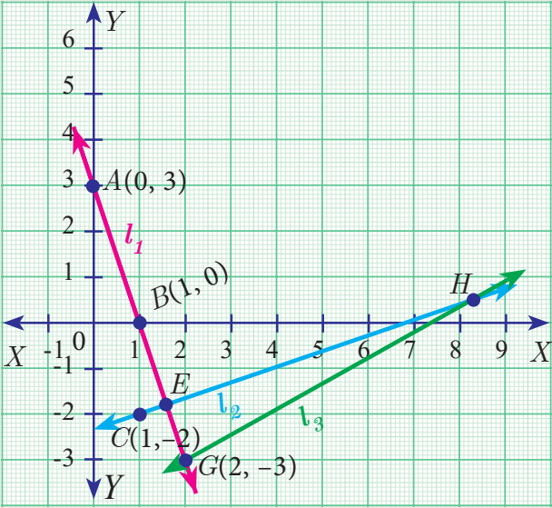

> **Activity 5**
>
> A ladder is placed against a vertical wall with its foot touching the horizontal floor. Find the equation of the ladder under the following conditions.
>
> | No. | Condition | Picture | Equation of the ladder |
> |---|---|---|---|
> | (i) | The ladder is inclined at $60^\circ$ to the floor and it touches the wall at $(0,8)$ | 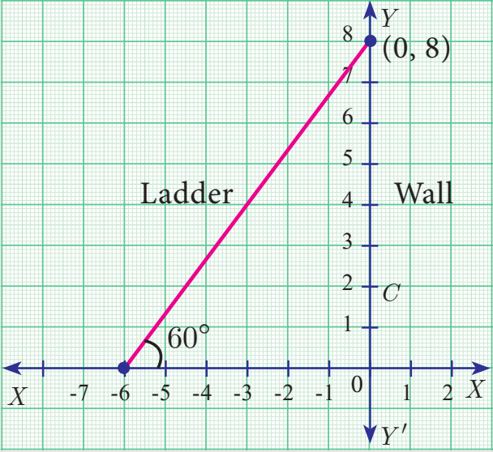 | __________ |
> | (ii) | The foot and top of the ladder are at the points $(2,4)$ and $(5,1)$ | __________ | __________ |

### Exercise 5.3

1. Find the equation of a straight line passing through the mid-point of a line segment joining the points $(1,-5)$, $(4,2)$ and parallel to (i) $X$ axis (ii) $Y$ axis.

2. The equation of a straight line is $2(x-y)+5=0$. Find its slope, inclination and intercept on the $Y$ axis.

3. Find the equation of a line whose inclination is $30^\circ$ and making an intercept $-3$ on the $Y$ axis.

4. Find the slope and $y$ intercept of $\sqrt3x+(1-\sqrt3)y=3$.

5. Find the value of ‘$a$’, if the line through $(-2,3)$ and $(8,5)$ is perpendicular to $y=ax+2$.

6. The hill in the form of a right triangle has its foot at $(19,3)$. The inclination of the hill to the ground is $45^\circ$. Find the equation of the hill joining the foot and top.

7. Find the equation of a line through the given pair of points

   (i) $\left(2,\frac{2}{3}\right)$ and $\left(-\frac{1}{2},-2\right)$

   (ii) $(2,3)$ and $(-7,-1)$

8. A cat is located at the point $(-6,-4)$ in $xy$ plane. A bottle of milk is kept at $(5,11)$. The cat wish to consume the milk travelling through shortest possible distance. Find the equation of the path it needs to take its milk.

9. If the vertices of a $\triangle ABC$ are $A(6,2)$, $B(-5,-1)$ and $C(1,9)$; through the vertex $A$

   (i) find the equation of median

   (ii) find the equation of altitude

10. Find the equation of a straight line which has slope $-\frac{5}{4}$ and passing through the point $(-1,2)$.

11. You are downloading a song. The percent $y$ (in decimal form) of mega bytes remaining to get downloaded in $x$ seconds is given by $y=-0.1x+1$.

    (i) find the total MB of the song.

    (ii) after how many seconds will 75% of the song gets downloaded?

    (iii) after how many seconds the song will be downloaded completely?

12. Find the equation of a line whose intercepts on the $x$ and $y$ axes are given below.

    (i) $4,-6$

    (ii) $-5,\frac{3}{4}$

13. Find the intercepts made by the following lines on the coordinate axes.

    (i) $3x-2y-6=0$

    (ii) $4x+3y+12=0$

14. Find the equation of a straight line

    (i) passing through $(1,-4)$ and has intercepts which are in the ratio $2:5$

    (ii) passing through $(-8,4)$ and making equal intercepts on the coordinate axes

## 5.6 General Form of a Straight Line

The linear equation (first degree polynomial in two variables $x$ and $y$) $ax+by+c=0$ (where $a$, $b$ and $c$ are real numbers such that at least one of $a$, $b$ is non-zero) always represents a straight line. This is the general form of a straight line.

Now, let us find out the equations of a straight line in the following cases

(i) parallel to $ax+by+c=0$

(ii) perpendicular to $ax+by+c=0$

### 5.6.1 Equation of a line parallel to the line $ax+by+c=0$

The equation of all lines parallel to the line $ax+by+c=0$ can be put in the form $ax+by+k=0$ for different values of $k$.

### 5.6.2 Equation of a line perpendicular to the line $ax+by+c=0$

The equation of all lines perpendicular to the line $ax+by+c=0$ can be written as $bx-ay+k=0$ for different values of $k$.

> **Do You Know?**
>
> Two straight lines $a_1x+b_1y+c_1=0$ and $a_2x+b_2y+c_2=0$ where the coefficients are non-zero, are
>
> (i) parallel if and only if $\frac{a_1}{a_2}=\frac{b_1}{b_2}$; That is, $a_1b_2-a_2b_1=0$
>
> (ii) perpendicular if and only if $a_1a_2+b_1b_2=0$

> **Progress Check**
>
> Fill the details in respective boxes
>
> | No. | Equations | Parallel or perpendicular |
> |---|---|---|
> | 1 | $5x+2y+5=0$ $5x+2y-3=0$ | |
> | 2 | $3x-7y-6=0$ $7x+3y+8=0$ | |
> | 3 | $8x-10y+11=0$ $4x-5y+16=0$ | |
> | 4 | $2y-9x-7=0$ $27y+6x-21=0$ | |

### 5.6.3 Slope of a straight line

The general form of the equation of a straight line is $ax+by+c=0$. (at least one of $a$, $b$ is non-zero)

coefficient of $x=a$, coefficient of $y=b$, constant term $=c$.

The above equation can be rewritten as $by=-ax-c$

gives

$$
y=-\frac{a}{b}x-\frac{c}{b},\quad\text{if }b\ne0 \tag{1}
$$

comparing (1) with the form $y=mx+l$

We get, slope

$$
m=-\frac{a}{b}
$$

$$
m=\frac{-\text{coefficient of }x}{\text{coefficient of }y}
$$

$$
y\text{ intercept }l=-\frac{c}{b}
$$

$$
y\text{ intercept}=\frac{-\text{constant term}}{\text{coefficient of }y}
$$

> **Thinking Corner**
>
> How many straight lines do you have with slope 1?

#### Example 5.30

Find the slope of the straight line $6x+8y+7=0$.

**Solution** Given $6x+8y+7=0$

$$
\text{slope }m=\frac{-\text{coefficient of }x}{\text{coefficient of }y}=-\frac{6}{8}=-\frac{3}{4}
$$

Therefore, the slope of the straight line is $-\frac{3}{4}$.

#### Example 5.31

Find the slope of the line which is

(i) parallel to $3x-7y=11$

(ii) perpendicular to $2x-3y+8=0$

**Solution** (i) Given straight line is $3x-7y=11$

$$
\Rightarrow 3x-7y-11=0
$$

$$
\text{Slope }m=\frac{-3}{-7}=\frac{3}{7}
$$

Since parallel lines have same slopes, slope of any line parallel to $3x-7y=11$ is $\frac{3}{7}$.

(ii) Given straight line is $2x-3y+8=0$

$$
\text{Slope }m=\frac{-2}{-3}=\frac{2}{3}
$$

Since product of slopes is $-1$ for perpendicular lines, slope of any line perpendicular to $2x-3y+8=0$ is $\frac{-1}{\frac{2}{3}}=\frac{-3}{2}$.

#### Example 5.32

Show that the straight lines $2x+3y-8=0$ and $4x+6y+18=0$ are parallel.

**Solution** Slope of the straight line $2x+3y-8=0$ is

$$
m_1=\frac{-\text{coefficient of }x}{\text{coefficient of }y}
$$

$$
m_1=\frac{-2}{3}
$$

Slope of the straight line $4x+6y+18=0$ is

$$
m_2=\frac{-4}{6}=\frac{-2}{3}
$$

Here, $m_1=m_2$

That is, slopes are equal. Hence, the two straight lines are parallel.

> **Aliter**
>
> $a_1=2$, $b_1=3$
>
> $a_2=4$, $b_2=6$
>
> $\frac{a_1}{a_2}=\frac{2}{4}=\frac{1}{2}$
>
> $\frac{b_1}{b_2}=\frac{3}{6}=\frac{1}{2}$
>
> Therefore, $\frac{a_1}{a_2}=\frac{b_1}{b_2}$
>
> Hence the lines are parallel.

#### Example 5.33

Show that the straight lines $x-2y+3=0$ and $6x+3y+8=0$ are perpendicular.

**Solution** Slope of the straight line $x-2y+3=0$ is

$$
m_1=\frac{-1}{-2}=\frac{1}{2}
$$

Slope of the straight line $6x+3y+8=0$ is

$$
m_2=\frac{-6}{3}=-2
$$

Now,

$$
m_1\times m_2=\frac{1}{2}\times(-2)=-1
$$

Hence, the two straight lines are perpendicular.

> **Aliter**
>
> $a_1=1$, $b_1=-2$;
>
> $a_2=6$, $b_2=3$
>
> $a_1a_2+b_1b_2=6-6=0$
>
> The lines are perpendicular.

#### Example 5.34

Find the equation of a straight line which is parallel to the line $3x-7y=12$ and passing through the point $(6,4)$.

**Solution** Equation of the straight line, parallel to $3x-7y-12=0$ is $3x-7y+k=0$

Since it passes through the point $(6,4)$

$$
3(6)-7(4)+k=0
$$

$$
k=28-18=10
$$

Therefore, equation of the required straight line is $3x-7y+10=0$.

#### Example 5.35

Find the equation of a straight line perpendicular to the line $y=\frac{4}{3}x-7$ and passing through the point $(7,-1)$.

**Solution** The equation $y=\frac{4x}{3}-7$ can be written as $4x-3y-21=0$.

Equation of a straight line perpendicular to $4x-3y-21=0$ is $3x+4y+k=0$

Since it is passes through the point $(7,-1)$,

$$
21-4+k=0\quad\text{we get, }k=-17
$$

Therefore, equation of the required straight line is $3x+4y-17=0$.

#### Example 5.36

Find the equation of a straight line parallel to $Y$ axis and passing through the point of intersection of the lines $4x+5y=13$ and $x-8y+9=0$.

**Solution** Given lines

$$
4x+5y-13=0 \tag{1}
$$

$$
x-8y+9=0 \tag{2}
$$

To find the point of intersection, solve equation (1) and (2)

$$
\frac{x}{45-104}=\frac{y}{-13-36}=\frac{1}{-32-5}
$$

$$
\frac{x}{-59}=\frac{y}{-49}=\frac{1}{-37}
$$

$$
x=\frac{59}{37},\quad y=\frac{49}{37}
$$

Therefore, the point of intersection $(x,y)=\left(\frac{59}{37},\frac{49}{37}\right)$

The equation of line parallel to $Y$ axis is $x=c$.

It passes through $(x,y)=\left(\frac{59}{37},\frac{49}{37}\right)$. Therefore, $c=\frac{59}{37}$.

The equation of the line is

$$
x=\frac{59}{37}\quad\Rightarrow\quad37x-59=0
$$

#### Example 5.37

The line joining the points $A(0,5)$ and $B(4,1)$ is a tangent to a circle whose centre $C$ is at the point $(4,4)$ find

(i) the equation of the line $AB$.

(ii) the equation of the line through $C$ which is perpendicular to the line $AB$.

(iii) the coordinates of the point of contact of tangent line $AB$ with the circle.

**Solution** (i) Equation of line AB, $A(0,5)$ and $B(4,1)$

$$
\frac{y-y_1}{y_2-y_1}=\frac{x-x_1}{x_2-x_1}
$$

$$
\frac{y-5}{1-5}=\frac{x-0}{4-0}
$$

$$
4(y-5)=-4x\quad\Rightarrow\quad y-5=-x
$$

$$
x+y-5=0
$$

(ii) The equation of a line which is perpendicular to the line $AB$: $x+y-5=0$ is $x-y+k=0$

Since it is passing through the point $(4,4)$, we have

$$
4-4+k=0\quad\Rightarrow\quad k=0
$$

The equation of a line which is perpendicular to $AB$ and through $C$ is $x-y=0$

(iii) The coordinate of the point of contact $P$ of the tangent line $AB$ with the circle is point of intersection of lines.

$$
x+y-5=0\quad\text{and}\quad x-y=0
$$

solving, we get $x=\frac{5}{2}$ and $y=\frac{5}{2}$

Therefore, the coordinate of the point of contact is $P\left(\frac{5}{2},\frac{5}{2}\right)$.

> **Thinking Corner**
>
> 1. Find the number of point of intersection of two straight lines.
> 2. Find the number of straight lines perpendicular to the line $2x-3y+6=0$.

> **Activity 6**
>
> Find the equation of a straight line for the given diagrams
>
> 

### Exercise 5.4

1. Find the slope of the following straight lines

   (i) $5y-3=0$

   (ii) $7x-\frac{3}{17}=0$

2. Find the slope of the line which is

   (i) parallel to $y=0.7x-11$

   (ii) perpendicular to the line $x=-11$

3. Check whether the given lines are parallel or perpendicular

   (i) $\frac{x}{3}+\frac{y}{4}+\frac{1}{7}=0$ and $\frac{2x}{3}+\frac{y}{2}+\frac{1}{10}=0$

   (ii) $5x+23y+14=0$ and $23x-5y+9=0$

4. If the straight lines $12y=-(p+3)x+12$, $12x-7y=16$ are perpendicular find '$p$'.

5. Find the equation of a straight line passing through the point $P(-5,2)$ and parallel to the line joining the points $Q(3,-2)$ and $R(-5,4)$.

6. Find the equation of a line passing through $(6,-2)$ and perpendicular to the line joining the points $(6,7)$ and $(2,-3)$.

7. $A(-3,0)$, $B(10,-2)$ and $C(12,3)$ are the vertices of $\triangle ABC$. Find the equation of the altitude through $A$ and $B$.

8. Find the equation of the perpendicular bisector of the line joining the points $A(-4,2)$ and $B(6,-4)$.

9. Find the equation of a straight line through the intersection of lines $7x+3y=10$, $5x-4y=1$ and parallel to the line $13x+5y+12=0$

10. Find the equation of a straight line through the intersection of lines $5x-6y=2$, $3x+2y=10$ and perpendicular to the line $4x-7y+13=0$

11. Find the equation of a straight line joining the point of intersection of $3x+y+2=0$ and $x-2y-4=0$ to the point of intersection of $7x-3y=-12$ and $2y=x+3$

12. Find the equation of a straight line through the point of intersection of the lines $8x+3y=18$, $4x+5y=9$ and bisecting the line segment joining the points $(5,-4)$ and $(-7,6)$.

### Exercise 5.5

##### Multiple choice questions

1. The area of triangle formed by the points $(-5,0)$, $(0,-5)$ and $(5,0)$ is

   (A) 0 sq.units  
   (B) 25 sq.units  
   (C) 5 sq.units  
   (D) none of these

2. A man walks near a wall, such that the distance between him and the wall is 10 units. Consider the wall to be the $Y$ axis. The path travelled by the man is

   (A) $x=10$  
   (B) $y=10$  
   (C) $x=0$  
   (D) $y=0$

3. The straight line given by the equation $x=11$ is

   (A) parallel to $X$ axis  
   (B) parallel to $Y$ axis  
   (C) passing through the origin  
   (D) passing through the point $(0,11)$

4. If $(5,7)$, $(3,p)$ and $(6,6)$ are collinear, then the value of $p$ is

   (A) 3  
   (B) 6  
   (C) 9  
   (D) 12

5. The point of intersection of $3x-y=4$ and $x+y=8$ is

   (A) $(5,3)$  
   (B) $(2,4)$  
   (C) $(3,5)$  
   (D) $(4,4)$

6. The slope of the line joining $(12,3)$, $(4,a)$ is $\frac{1}{8}$. The value of '$a$' is

   (A) 1  
   (B) 4  
   (C) $-5$  
   (D) 2

7. The slope of the line which is perpendicular to a line joining the points $(0,0)$ and $(-8,8)$ is

   (A) $-1$  
   (B) 1  
   (C) $\frac{1}{3}$  
   (D) $-8$

8. If slope of the line $PQ$ is $\frac{1}{\sqrt{3}}$ then slope of the perpendicular bisector of $PQ$ is

   (A) $\sqrt{3}$  
   (B) $-\sqrt{3}$  
   (C) $\frac{1}{\sqrt{3}}$  
   (D) 0

9. If $A$ is a point on the $Y$ axis whose ordinate is 8 and $B$ is a point on the $X$ axis whose abscissae is 5 then the equation of the line $AB$ is

   (A) $8x+5y=40$  
   (B) $8x-5y=40$  
   (C) $x=8$  
   (D) $y=5$

10. The equation of a line passing through the origin and perpendicular to the line $7x-3y+4=0$ is

    (A) $7x-3y+4=0$  
    (B) $3x-7y+4=0$  
    (C) $3x+7y=0$  
    (D) $7x-3y=0$

11. Consider four straight lines

    (i) $l_1$; $3y=4x+5$

    (ii) $l_2$; $4y=3x-1$

    (iii) $l_3$; $4y+3x=7$

    (iv) $l_4$; $4x+3y=2$

    Which of the following statement is true?

    (A) $l_1$ and $l_2$ are perpendicular  
    (B) $l_1$ and $l_4$ are parallel  
    (C) $l_2$ and $l_4$ are perpendicular  
    (D) $l_2$ and $l_3$ are parallel

12. A straight line has equation $8y=4x+21$. Which of the following is true

    (A) The slope is 0.5 and the $y$ intercept is 2.6  
    (B) The slope is 5 and the $y$ intercept is 1.6  
    (C) The slope is 0.5 and the $y$ intercept is 1.6  
    (D) The slope is 5 and the $y$ intercept is 2.6

13. When proving that a quadrilateral is a trapezium, it is necessary to show

    (A) Two sides are parallel.  
    (B) Two parallel and two non-parallel sides.  
    (C) Opposite sides are parallel.  
    (D) All sides are of equal length.

14. When proving that a quadrilateral is a parallelogram by using slopes you must find

    (A) The slopes of two sides  
    (B) The slopes of two pair of opposite sides  
    (C) The lengths of all sides  
    (D) Both the lengths and slopes of two sides

15. $(2,1)$ is the point of intersection of two lines.

    (A) $x-y-3=0$; $3x-y-7=0$  
    (B) $x+y=3$; $3x+y=7$  
    (C) $3x+y=3$; $x+y=7$  
    (D) $x+3y-3=0$; $x-y-7=0$

### Unit Exercise - 5

1. PQRS is a rectangle formed by joining the points $P(-1,-1)$, $Q(-1,4)$, $R(5,4)$ and $S(5,-1)$. $A$, $B$, $C$ and $D$ are the mid-points of $PQ$, $QR$, $RS$ and $SP$ respectively. Is the quadrilateral $ABCD$ a square, a rectangle or a rhombus? Justify your answer.

2. The area of a triangle is 5 sq.units. Two of its vertices are $(2,1)$ and $(3,-2)$. The third vertex is $(x,y)$ where $y=x+3$. Find the coordinates of the third vertex.

3. Find the area of a triangle formed by the lines $3x+y-2=0$, $5x+2y-3=0$ and $2x-y-3=0$

4. If vertices of a quadrilateral are at $A(-5,7)$, $B(-4,k)$, $C(-1,-6)$ and $D(4,5)$ and its area is 72 sq.units. Find the value of $k$.

5. Without using distance formula, show that the points $(-2,-1)$, $(4,0)$, $(3,3)$ and $(-3,2)$ are vertices of a parallelogram.

6. Find the equations of the lines, whose sum and product of intercepts are 1 and $-6$ respectively.

7. The owner of a milk store finds that, he can sell 980 litres of milk each week at ₹14/litre and 1220 litres of milk each week at ₹16/litre. Assuming a linear relationship between selling price and demand, how many litres could he sell weekly at ₹17/litre?

8. Find the image of the point $(3,8)$ with respect to the line $x+3y=7$ assuming the line to be a plane mirror.

9. Find the equation of a line passing through the point of intersection of the lines $4x+7y-3=0$ and $2x-3y+1=0$ that has equal intercepts on the axes.

10. A person standing at a junction (crossing) of two straight paths represented by the equations $2x-3y+4=0$ and $3x+4y-5=0$ seek to reach the path whose equation is $6x-7y+8=0$ in the least time. Find the equation of the path that he should follow.

##### Points to Remember

- The area of a triangle formed by the points $(x_1,y_1)$, $(x_2,y_2)$ and $(x_3,y_3)$ is

  $$
  \frac{1}{2}\left\{(x_1y_2+x_2y_3+x_3y_1)-(x_2y_1+x_3y_2+x_1y_3)\right\}\text{ sq.units}
  $$

- Three points $A(x_1,y_1)$, $B(x_2,y_2)$ and $C(x_3,y_3)$ are collinear if and only if

  (i) area of $\triangle ABC=0$ or $x_1y_2+x_2y_3+x_3y_1=x_2y_1+x_3y_2+x_1y_3$

  (ii) slope of $AB$ = slope of $BC$ or slope of $AC$

- The area of a quadrilateral formed by the four points $(x_1,y_1)$, $(x_2,y_2)$, $(x_3,y_3)$ and $(x_4,y_4)$ is

  $$
  \frac{1}{2}\left\{(x_1y_2+x_2y_3+x_3y_4+x_4y_1)-(x_2y_1+x_3y_2+x_4y_3+x_1y_4)\right\}\text{ sq.units.}
  $$

- If a line makes an angle $\theta$ with the positive direction of $X$ axis, then its slope $m=\tan\theta$.

- If $A(x_1,y_1)$, $B(x_2,y_2)$ are two distinct points then the slope of $AB$ is $\frac{y_2-y_1}{x_2-x_1}$.

- Slope of line $ax+by+c=0$ is $m=\frac{-a}{b}$.

##### Equation of straight line in various forms

| Form | Name | Form | Name |
|---|---|---|---|
| $ax+by+c=0$ | General form | $\frac{x}{a}+\frac{y}{b}=1$ | Intercept form |
| $y-y_1=m(x-x_1)$ | Point-slope form | $x=c$ | Parallel to $Y$ axis |
| $y=mx+c$ | Slope-intercept | $y=b$ | Parallel to $X$ axis |
| $\frac{y-y_1}{y_2-y_1}=\frac{x-x_1}{x_2-x_1}$ | Two point form | | |

- Two straight lines are parallel if and only if their slopes are equal.

- Two straight lines with well defined slopes $m_1$, $m_2$ are perpendicular if and only if $m_1\times m_2=-1$.

##### ICT CORNER

##### ICT 5.1

**Step 1:** Open the Browser type the URL Link given below (or) Scan the QR Code. GeoGebra work book named **“Co-Ordinate Geometry”** will open. In the left side of the work book there are many activity related to mensuration chapter. Select the work sheet **“Area of a Quadrilateral”**

**Step 2:** In the given worksheet you can change the Question by clicking on “New Problem”. Move the slider to see the steps. Work out each problem and verify your answer.

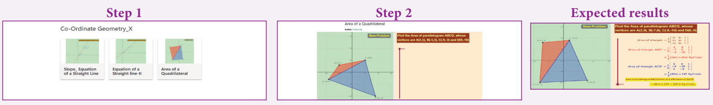

##### ICT 5.2

**Step 1:** Open the Browser type the URL Link given below (or) Scan the QR Code. GeoGebra work book named **“Co-Ordinate Geometry”** will open. In the left side of the work book there are many activity related to mensuration chapter. Select the work sheet **“Slope_Equation of a Straight Line”**

**Step 2:** In the given worksheet you can change the Line by Dragging the points A and B on graph. Click on the Check boxes on Left Hand Side to see various forms of same straight line.

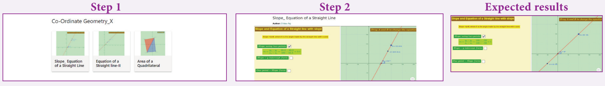

*You can repeat the same steps for other activities*

[https://www.geogebra.org/m/jfr2zzgy#chapter/356195](https://www.geogebra.org/m/jfr2zzgy#chapter/356195)

or Scan the QR Code.
