## 5.3 Area of a Quadrilateral

If $ABCD$ is a quadrilateral, then considering the diagonal $AC$, we can split the quadrilateral $ABCD$ into two triangles $ABC$ and $ACD$.
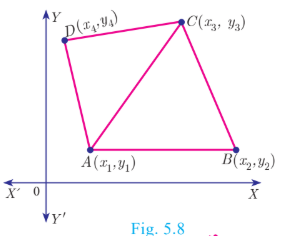
Using area of triangle formula given its vertices, we can calculate the areas of triangles $ABC$ and $ACD$.

Now, Area of the quadrilateral $ABCD$

$$= \text{Area of triangle } ABC + \text{Area of triangle } ACD$$

We use this information to find area of a quadrilateral when its vertices are given.

Let $A(x_1, y_1)$, $B(x_2, y_2)$, $C(x_3, y_3)$ and $D(x_4, y_4)$ be the vertices of a quadrilateral $ABCD$.

Now, Area of quadrilateral $ABCD$

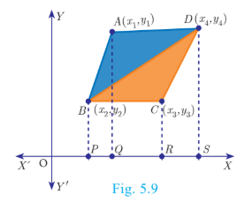
$$= \text{Area of the } \Delta ABD + \text{Area of the } \Delta BCD \text{ (Fig 5.9)}$$

$$= \frac{1}{2} \{(x_1y_2 + x_2y_4 + x_4y_1) - (x_2y_1 + x_4y_2 + x_1y_4)\}$$

$$+ \frac{1}{2} \{(x_2y_3 + x_3y_4 + x_4y_2) - (x_3y_2 + x_4y_3 + x_2y_4)\}$$

$$= \frac{1}{2} \{(x_1y_2 + x_2y_3 + x_3y_4 + x_4y_1) - (x_2y_1 + x_3y_2 + x_4y_3 + x_1y_4)\}$$

$$= \frac{1}{2} \{(x_1 - x_3)(y_2 - y_4) - (x_2 - x_4)(y_1 - y_3)\} \text{ sq.units.}$$

The following pictorial representation helps us to write the above formula very easily. Take the vertices $A(x_1, y_1)$, $B(x_2, y_2)$, $C(x_3, y_3)$ and $D(x_4, y_4)$ in counter-clockwise direction and write them column-wise as that of the area of a triangle.

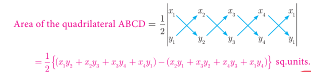

> **Note**
>
> - To find the area of a quadrilateral, we divide it into triangular regions, which have no common area and then add the area of these regions.
> - The area of the quadrilateral is never negative.That is, we always take the area of quadrilateral as positive.

### Thinking Corner
1. If the area of a quadrilateral formed by the points $(a, a)$, $(-a, a)$, $(a, -a)$ and $(-a, -a)$, where $a \neq 0$ is 64 square units, then identify the type of the quadrilateral  
2. Find all possible values of $a$. 

**Example 5.1**

Find the area of the triangle whose vertices are \( (-3, 5) \), \( (5, -2) \) and \( (5, 6) \).

**Solution**

Plot the points in a rough diagram and take them in counter-clockwise order.
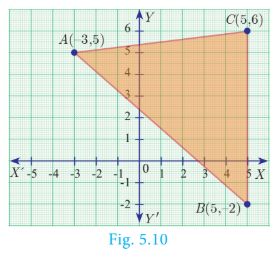
Let the vertices be $A(-3,5)$, $B(5,-2)$, $C(5,6)$  $$\begin{array}{ccc} \downarrow & \downarrow & \downarrow \\ (x_1, y_1) & (x_2, y_2) & (x_3, y_3) \end{array}$$The area of $\Delta ABC$ is$$= \frac{1}{2}\{(x_1y_2 + x_2y_3 + x_3y_1) - (x_2y_1 + x_3y_2 + x_1y_3)\}$$$$= \frac{1}{2}\{(6 + 30 + 25) - (25 - 10 - 18)\}$$$$= \frac{1}{2}\{61 + 3\}$$$$= \frac{1}{2}(64) = 32 \text{ sq.units}$$

**Answer:** \( 32 \) sq. units.

---

**Example 5.2**

Show that the points \( P(-1.5, 3) \), \( Q(6, -2) \), \( R(-3, 4) \) are collinear.

**Solution**

The points are $P(-1.5, 3)$, $Q(6, -2)$, $R(-3, 4)$
$$\text{Area of } \Delta PQR = \frac{1}{2} \{(x_1y_2 + x_2y_3 + x_3y_1) - (x_2y_1 + x_3y_2 + x_1y_3)\}$$
$$= \frac{1}{2} \{(3 + 24 - 9) - (18 + 6 - 6)\} = \frac{1}{2} \{18 - 18\} = 0$$
Therefore, the given points are collinear.

---

**Example 5.3**

If the area of the triangle formed by the vertices \( A(-1, 2) \), \( B(k, -2) \), \( C(7, 4) \) (taken in order) is 22 sq. units, find the value of \( k \).

**Solution**

The vertices are $A(-1, 2)$, $B(k, -2)$ and $C(7, 4)$

Area of triangle $ABC$ is $22\text{ sq. units}$

$$\frac{1}{2} \{(x_1y_2 + x_2y_3 + x_3y_1) - (x_2y_1 + x_3y_2 + x_1y_3)\} = 22$$

$$\frac{1}{2} \{(2 + 4k + 14) - (2k - 14 - 4)\} = 22$$$$2k + 34 = 44 \implies 2k = 10 \implies k = 5$$

---

**Example 5.4**

If the points \( P(-1, -4) \), \( Q(b, c) \), \( R(5, -1) \) are collinear and if \( 2b + c = 4 \), then find the values of \( b \) and \( c \).

**Solution**

Since the three points $P(-1,-4)$, $Q(b,c)$ and $R(5,-1)$ are collinear,

$$\text{Area of triangle } PQR = 0$$

$$\frac{1}{2}\{(x_1y_2 + x_2y_3 + x_3y_1) - (x_2y_1 + x_3y_2 + x_1y_3)\} = 0$$

$$\frac{1}{2}\{(-c - b - 20) - (-4b + 5c + 1)\} = 0$$

$$-c - b - 20 + 4b - 5c - 1 = 0$$

$$b - 2c = 7 \quad \dots(1)$$

$$\text{Also,} \quad 2b + c = 4 \quad \dots(2) \text{ (from given information)}$$

Solving $(1)$ and $(2)$ we get $b = 3$, $c = -2$

---

**Example 5.5**

The floor of a hall is covered with identical tiles which are in the shapes of triangles. One such triangle has vertices at \( (-3, 2) \), \( (-1, -1) \) and \( (1, 2) \). If the floor of the hall is completely covered by 110 tiles, find the area of the floor.
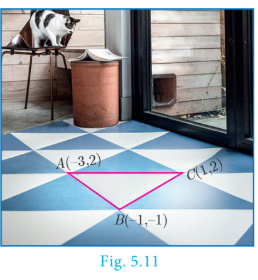
**Solution**

Vertices of one triangular tile are at \( (-3, 2) \), \( (-1, -1) \), \( (1, 2) \).

\[
\text{Area of this tile} = \frac{1}{2} \left[ (-3 -2 - 2) - (-2 -1 - 6)\right] \text{ sq. units}
\]

\[
= \frac{1}{2} \left[ (12) \right] \text{ sq. units}
\]

\[
= 6 \text{ sq. units}
\]

Since the floor is covered by 110 triangle shaped identical tiles:

\[
\text{Area of floor} = 110 \times 6 = 660 \text{ sq. units}
\]

**Answer:** \( 660 \) sq. units.

---

**Example 5.6**

Find the area of the quadrilateral formed by the points \( (8, 6) \), \( (5, 11) \), \( (-5, 12) \) and \( (-4, 3) \).
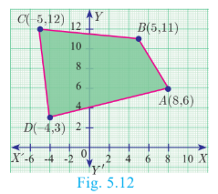
**Solution**
Before determining the area of quadrilateral, plot the vertices in a graph.

Let the vertices be \( A(8, 6) \), \( B(5, 11) \), \( C(-5, 12) \), \( D(-4, 3) \).

\[
\text{Area} = \frac{1}{2} \left[ x_1 y_2 + x_2 y_3 + x_3 y_4 + x_4 y_1 - (x_2 y_1 + x_3 y_2 + x_4 y_3 + x_1 y_4) \right]
\]

\[
= \frac{1}{2} \left[ 8 \cdot 11 + 5 \cdot 12 + (-5) \cdot 3 + (-4) \cdot 6 - (5 \cdot 6 + (-5) \cdot 11 + (-4) \cdot 12 + 8 \cdot 3) \right]
\]

\[
= \frac{1}{2} \left[ 88 + 60 - 15 - 24 - (30 - 55 - 48 + 24) \right]
\]

\[
= \frac{1}{2} \left[ 109 - (-49) \right] = \frac{1}{2} \times 158 = 79
\]

**Answer:** \( 79 \) sq. units.

---
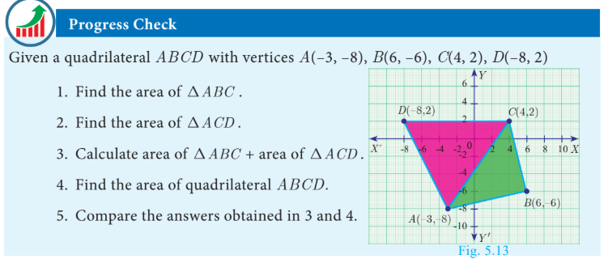

**Example 5.7**

The given diagram shows a plan for constructing a new parking lot at a campus. It is estimated that such construction would cost ₹1300 per square feet. What will be the total cost for making the parking lot?
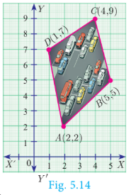
**Solution**

The parking lot is a quadrilateral whose vertices are at \( A(2, 2) \), \( B(5, 5) \), \( C(4, 9) \), \( D(1, 7) \).

\[
\text{Area} = \frac{1}{2} \left[ 2 \cdot 5 + 5 \cdot 9 + 4 \cdot 7 + 1 \cdot 2 - (2 \cdot 5 + 5 \cdot 4 + 9 \cdot 1 + 7 \cdot 2) \right]
\]

\[
= \frac{1}{2} \left[ 10 + 45 + 28 + 2 - (10 + 20 + 9 + 14) \right]
\]

\[
= \frac{1}{2} \left[ 85 - 53 \right] = \frac{1}{2} \times 32 = 16 \text{ sq. ft}
\]
Area of parking lot = 16 sq.feets

Construction rate per square feet = ₹1300

\[
\text{Total cost for constructing the parking lot} = 16 \times 1300 = ₹20800
\]

**Answer:** ₹20800

---

Here is the text extracted from the provided textbook page:

---

### Activity 1

(i) Take a graph sheet.
(ii) Consider a triangle whose base is the line joining the points $(0,0)$ and $(6,0)$
(iii) Take the third vertex as $(1,1)$, $(2,2)$, $(3,3)$, $(4,4)$, $(5,5)$ and find their areas. Fill in the details given.
(iv) Do you see any pattern with $A_1, A_2, A_3, A_4, A_5$ ? If so mention it.
(v) Repeat the same process by taking third vertex in step (iii) as $(1,2)$, $(2,4)$, $(3,8)$, $(4,16)$, $(5,32)$.
(vi) Fill the table with these new vertices.
(vii) What pattern do you observe now with $A_1, A_2, A_3, A_4, A_5$?

**Tables for Activity 1:**

| Third vertex | Area of Triangle |
| --- | --- |
| $(1,1)$ | $A_1 =$ |
| $(2,2)$ | $A_2 =$ |
| $(3,3)$ | $A_3 =$ |
| $(4,4)$ | $A_4 =$ |
| $(5,5)$ | $A_5 =$ |

| Third vertex | Area of Triangle |
| --- | --- |
| $(1,2)$ | $A_1 =$ |
| $(2,4)$ | $A_2 =$ |
| $(3,8)$ | $A_3 =$ |
| $(4,16)$ | $A_4 =$ |
| $(5,32)$ | $A_5 =$ |

---

### Activity 2

Find the area of the shaded region
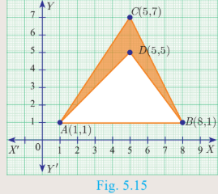

### Do You Know?

Two French mathematicians Rene Descartes and Pierre-de-Fermat were the first to conceive the idea of modern coordinate geometry by 1630s.

**Exercise 5.1**

1. Find the area of the triangle formed by the points:

   (i) \( (1, -1) \), \( (-4, 6) \), \( (-3, -5) \)
   (ii) \( (-10, -4) \), \( (-8, -1) \), \( (-3, -5) \)

2. Determine whether the sets of points are collinear:

   (i) \( \left( -\frac{1}{2}, 3 \right) \), \( (-5, 6) \), \( (-8, 8) \)
   (ii) \( (a, b+c) \), \( (b, c+a) \), \( (c, a+b) \)

3. Vertices of given triangles are taken in order and their areas are provided aside. In each case, find the value of 'p'.
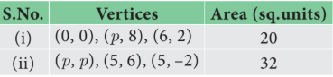
  

4. In each of the following, find the value of 'a' for which the given points are collinear:
   (i) \( (2, 3) \), \( (4, a) \), \( (6, -3) \)
   (ii) \( (a, 2-2a) \), \( (-a+1, 2a) \), \( (-4-a, 6-2a) \)

5. Find the area of the quadrilateral whose vertices are at:
   (i) \( (-9, -2) \), \( (-8, -4) \), \( (2, 2) \), \( (1, -3) \)
   (ii) \( (-9, 0) \), \( (-8, 6) \), \( (-1, -2) \), \( (-6, -3) \)

6. Find the value of \( k \), if the area of a quadrilateral is 28 sq. units, whose vertices are taken in the order \( (-4, -2) \), \( (-3, k) \), \( (3, -2) \), \( (2, 3) \).

7. If the points \( A(-3, 9) \), \( B(a, b) \), \( C(4, -5) \) are collinear and if \( a + b = 1 \), then find \( a \) and \( b \).

8. Let $P(11,7)$, $Q(13.5,4)$ and $R(9.5,4)$ be the mid-points of the sides $AB$, $BC$ and $AC$ respectively of $\Delta ABC$. Find the coordinates of the vertices $A$, $B$ and $C$. Hence find the area of $\Delta ABC$ and compare this with area of $\Delta PQR$.

9. In the figure, the quadrilateral swimming pool shown is surrounded by concrete patio. Find the area of the patio.
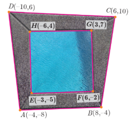

10. A triangular shaped glass with vertices at $A(-5,-4)$, $B(1,6)$ and $C(7,-4)$ has to be painted. If one bucket of paint covers 6 square feet, how many buckets of paint will be required to paint the whole glass, if only one coat of paint is applied.  

11. In the figure, find the area of (i) triangle $AGF$ (ii) triangle $FED$ (iii) quadrilateral $BCEG$.
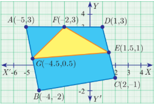

---
