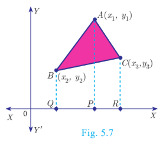
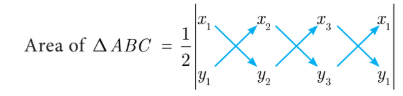

## 5.2 Area of a Triangle
In your earlier classes, you have studied how to calculate the area of a triangle when its base and corresponding height (altitude) are given. You have used the formula.

Area of triangle = 1/2 × base × altitude sq.units.

With any three non-collinear points \( A(x_1, y_1) \), \( B(x_2, y_2) \) and \( C(x_3, y_3) \) on a plane, we can form a triangle ABC.

Using the distance between two points formula, we can calculate \( AB = c \), \( BC = a \), \( CA = b \). a, b, c represent the lengths of the sides of the triangle ABC.

Using $2s = a + b + c$, we can calculate the area of triangle $ABC$ by using the Heron's formula $\sqrt{s(s-a)(s-b)(s-c)}$. But this procedure of finding length of sides of $\Delta ABC$ and then calculating its area will be a tedious procedure.

There is an elegant way of finding the area of a triangle using the coordinates of its vertices.We shall discuss such a method below.

Let ABC be any triangle whose vertices are at \( A(x_1, y_1) \), \( B(x_2, y_2) \) and \( C(x_3, y_3) \).

Draw AP, BQ and CR perpendiculars from A, B and C to the x-axis, respectively.

Clearly ABQP, APRC and BQRC are all trapeziums.

Now from Fig.5.7, it is clear that
$$\text{Area of } \Delta ABC = \text{Area of trapezium } ABQP + \text{Area of trapezium } APRC - \text{Area of trapezium } BQRC.$$

You also know that, the area of trapezium 

$$= \frac{1}{2} \times (\text{sum of parallel sides}) \times (\text{perpendicular distance between the parallel sides})$$
Therefore, $\text{Area of } \Delta ABC$
$$= \frac{1}{2}(BQ + AP)QP + \frac{1}{2}(AP + CR)PR - \frac{1}{2}(BQ + CR)QR$$
$$= \frac{1}{2}(y_2 + y_1)(x_1 - x_2) + \frac{1}{2}(y_1 + y_3)(x_3 - x_1) - \frac{1}{2}(y_2 + y_3)(x_3 - x_2)$$
$$= \frac{1}{2}\{x_1(y_2 - y_3) + x_2(y_3 - y_1) + x_3(y_1 - y_2)\}$$
Thus, the area of $\Delta ABC$ is the absolute value of the expression
$$= \frac{1}{2}\{x_1(y_2 - y_3) + x_2(y_3 - y_1) + x_3(y_1 - y_2)\} \text{ sq.units.}$$
The vertices $A(x_1, y_1)$, $B(x_2, y_2)$ and $C(x_3, y_3)$ of $\Delta ABC$ are said to be "taken in order" if $A, B, C$ are taken in anticlockwise direction. If we do this, then area of $\Delta ABC$ will never be negative.

**Another form**

The following pictorial representation helps us to write the above formula very easily.

$$= \frac{1}{2} \{(x_1y_2 + x_2y_3 + x_3y_1) - (x_2y_1 + x_3y_2 + x_1y_3)\} \text{ sq.units.}$$
> **Note**
>
> As the area of a triangle can never be negative, we must take the absolute value, in case the area happens to be negative.

Here is the text alone extracted from the image:

**Progress Check**

The vertices of $\Delta PQR$ are $P(0,-4)$, $Q(3,1)$ and $R(-8,1)$

1. Draw $\Delta PQR$ on a graph paper.
2. Check if $\Delta PQR$ is equilateral.
3. Find the area of $\Delta PQR$.
4. Find the coordinates of $M$, the mid-point of $QP$.
5. Find the coordinates of $N$, the mid-point of $QR$.
6. Find the area of $\Delta MPN$.
7. What is the ratio between the areas of $\Delta MPN$ and $\Delta PQR$?

### 5.2.1 Collinearity of Three Points

If three distinct points $A(x_1,y_1)$, $B(x_2,y_2)$ and $C(x_3,y_3)$ are collinear, then we cannot form a triangle, because for such a triangle there will be no altitude (height). Therefore, three points $A(x_1,y_1)$, $B(x_2,y_2)$ and $C(x_3,y_3)$ will be collinear if the area of $\Delta ABC = 0$.

Similarly, if the area of $\Delta ABC$ is zero, then the three points lie on the same straight line. Thus, three distinct points $A(x_1,y_1)$, $B(x_2,y_2)$ and $C(x_3,y_3)$ will be collinear if and only if area of $\Delta ABC = 0$.

> **Note**
>
> Another condition for collinearity:
> If $A(x_1,y_1)$, $B(x_2,y_2)$ and $C(x_3,y_3)$ are collinear points, then
>$$x_1(y_2-y_3)+x_2(y_3-y_1)+x_3(y_1-y_2) = 0$$
>(or)  $x_1y_2 + x_2y_3 + x_3y_1 = x_1y_3 + x_2y_1 + x_3y_2$.

---