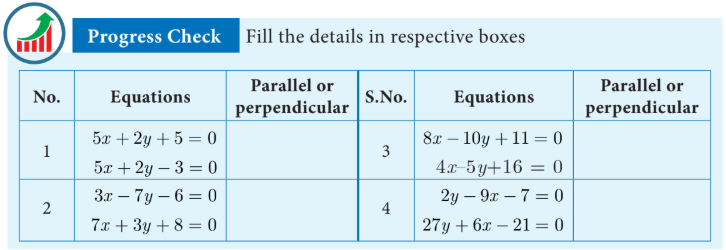
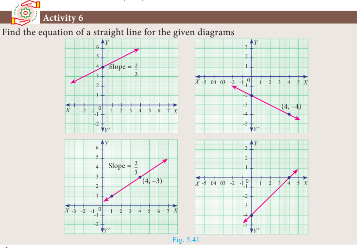

## 5.6 General Form of a Straight Line

The linear equation (first degree polynomial in two variables x and y) \( ax + by + c = 0 \) (where \( a, b, c \) are real numbers such that at least one of \( a, b \) is non-zero) always represents a straight line. This is the general form of a straight line.

Now, let us find out the equations of a straight line in the following cases

(i) parallel to $ax + by + c = 0$

(ii) perpendicular to $ax + by + c = 0$

### 5.6.1 Equation of a line parallel to the line $ax + by + c = 0$

The equation of all lines parallel to the line $ax + by + c = 0$ can be put in the form $ax + by + k = 0$ for different values of $k$.  

### 5.6.2 Equation of a line perpendicular to the line $ax + by + c = 0$  

The equation of all lines perpendicular to the line $ax + by + c = 0$ can be written as $bx - ay + k = 0$ for different values of $k$.  

**Do You Know?**

Two straight lines $a_1x + b_1y + c_1 = 0$ and $a_2x + b_2y + c_2 = 0$ where the coefficients are non-zero, are

(i) parallel if and only if $\frac{a_1}{a_2} = \frac{b_1}{b_2}$; That is, $a_1b_2 - a_2b_1 = 0$

(ii) perpendicular if and only if $a_1a_2 + b_1b_2 = 0$

### 5.6.3 Slope of a straight line

The general form of the equation of a straight line is $ax + by + c = 0$. (at least one of $a$, $b$ is non-zero)

coefficient of $x = a$, coefficient of $y = b$, constant term $= c$.

The above equation can be rewritten as $by = -ax - c$gives $\quad y = -\frac{a}{b}x - \frac{c}{b}$, if $b \neq 0 \quad$ ...(1)

comparing (1) with the form $\quad y = mx + l$

We get, $\qquad$ slope $m = -\frac{a}{b}$

$$\begin{aligned} m &= \frac{-\text{coefficient of } x}{\text{coefficient of } y} \\ \\ y \text{ intercept } l &= -\frac{c}{b} \\ \\ y \text{ intercept } &= \frac{-\text{constant term}}{\text{coefficient of } y} \end{aligned}$$

**Thinking Corner**

How many straight lines do you have with slope 1?

**Example 5.30**

Find the slope of the straight line $6x + 8y + 7 = 0$.

**Solution** 

Given $6x + 8y + 7 = 0$

$$\text{slope } m = \frac{-\text{coefficient of } x}{\text{coefficient of } y} = -\frac{6}{8} = -\frac{3}{4}$$Therefore, the slope of the straight line is $-\frac{3}{4}$.

---
**Example 5.31**

Find the slope of the line which is:

(i) parallel to \( 3x - 7y = 11 \)
(ii) perpendicular to \( 2x - 3y + 8 = 0 \)

**Solution**

(i) Given straight line is $3x - 7y = 11$
$$\Rightarrow 3x - 7y - 11 = 0$$
$$\text{Slope } m = \frac{-3}{-7} = \frac{3}{7}$$Since parallel lines have same slopes, slope of any line parallel to $3x - 7y = 11$ is $\frac{3}{7}$.

(ii) Given straight line is $2x - 3y + 8 = 0$
$$\text{Slope } m = \frac{-2}{-3} = \frac{2}{3}$$
Since product of slopes is $-1$ for perpendicular lines, slope of any line perpendicular to $2x - 3y + 8 = 0$ is $\frac{-1}{\frac{2}{3}} = \frac{-3}{2}$.

---

**Example 5.32**

Show that the straight lines \( 2x + 3y - 8 = 0 \) and \( 4x + 6y + 18 = 0 \) are parallel.

**Solution**

Slope of the straight line $2x + 3y - 8 = 0$ is
$$m_1 = \frac{-\text{coefficient of } x}{\text{coefficient of } y}$$
$$m_1 = \frac{-2}{3}$$
Slope of the straight line $4x + 6y + 18 = 0$ is
$$m_2 = \frac{-4}{6} = \frac{-2}{3}$$Here, $\quad m_1 = m_2$That is, slopes are equal. Hence, the two straight lines are parallel.

**Aliter**
$a_1 = 2, \ b_1 = 3$

$a_2 = 4, \ b_2 = 6$

$\frac{a_1}{a_2} = \frac{2}{4} = \frac{1}{2}$

$\frac{b_1}{b_2} = \frac{3}{6} = \frac{1}{2}$

Therefore, $\frac{a_1}{a_2} = \frac{b_1}{b_2}$

Hence the lines are parallel.  

---

**Example 5.33**

Show that the straight lines \( x - 2y + 3 = 0 \) and \( 6x + 3y + 8 = 0 \) are perpendicular.

**Solution**

Slope of the straight line $x - 2y + 3 = 0$ is

$$m_1 = \frac{-1}{-2} = \frac{1}{2}$$
Slope of the straight line $6x + 3y + 8 = 0$ is
$$m_2 = \frac{-6}{3} = -2$$Now, $\quad m_1 \times m_2 = \frac{1}{2} \times (-2) = -1$Hence, the two straight lines are perpendicular.

**Aliter**
$a_1 = 1, \ b_1 = -2;$

$a_2 = 6, \ b_2 = 3$

$a_1a_2 + b_1b_2 = 6 - 6 = 0$

The lines are perpendicular.

---

**Example 5.34**

Find the equation of a straight line which is parallel to the line \( 3x - 7y = 12 \) and passing through the point \( (6, 4) \).

**Solution**

Equation of the line parallel to \( 3x - 7y - 12 = 0 \) is \( 3x - 7y + k = 0 \).

Since it passes through \( (6, 4) \):

\[
3(6) - 7(4) + k = 0
\]

\[
18 - 28 + k = 0 \Rightarrow k = 10
\]

Therefore, equation of the required straight line is \( 3x - 7y + 10 = 0 \)

---

**Example 5.35**

Find the equation of a straight line perpendicular to the line \( y = \frac{4}{3}x - 7 \) and passing through the point \( (7, -1) \).

**Solution**

\[
y = \frac{4}{3}x - 7 \Rightarrow 4x - 3y - 21 = 0
\]

Equation of a line perpendicular to \( 4x - 3y - 21 = 0 \) is \( 3x + 4y + k = 0 \).

Since it passes through \( (7, -1) \):

\[
3(7) + 4(-1) + k = 0
\]

\[
21 - 4 + k = 0 \Rightarrow k = -17
\]

Therefore, equation of the required straight line is \( 3x + 4y - 17 = 0 \)

---

**Example 5.36**

Find the equation of a straight line parallel to Y-axis and passing through the point of intersection of the lines \( 4x + 5y = 13 \) and \( x - 8y + 9 = 0 \).

**Solution**
Given lines 
\[
4x + 5y - 13 = 0 \tag{1} 
\]

\[
x - 8y + 9 = 0 \tag{2}
\]

To find the point of intersection, solve equation (1) and (2)

Using determinants:

$$\begin{array}{ccccccc} & x & & y & & 1 & \\ 5 & \searrow \! \nearrow & -13 & \searrow \! \nearrow & 4 & \searrow \! \nearrow & 5 \\ -8 & \nearrow \! \searrow & 9 & \nearrow \! \searrow & 1 & \nearrow \! \searrow & -8 \end{array}$$

$$\frac{x}{45 - 104} = \frac{y}{-13 - 36} = \frac{1}{-32 - 5}$$
$$\frac{x}{-59} = \frac{y}{-49} = \frac{1}{-37}$$
$$x = \frac{59}{37}, \ y = \frac{49}{37}$$

Therefore, the point of intersection $(x,y) = \left(\frac{59}{37}, \frac{49}{37}\right)$ 

The equation of line parallel to $Y$ axis is $x = c$. 

It passes through $(x,y) = \left(\frac{59}{37}, \frac{49}{37}\right)$. Therefore, $c = \frac{59}{37}$.  

The equation of the line is $x = \frac{59}{37} \implies 37x - 59 = 0$  

---

**Example 5.37**

The line joining the points A(0, 5) and B(4, 1) is a tangent to a circle whose centre C is at the point (4, 4). Find:

(i) the equation of the line AB
(ii) the equation of the line through C which is perpendicular to the line AB
(iii) the coordinates of the point of contact of tangent line AB with the circle

**Solution**

(i) Equation of line AB through A(0, 5) and B(4, 1):

$$\frac{y - y_1}{y_2 - y_1} = \frac{x - x_1}{x_2 - x_1}$$

\[
\frac{y - 5}{1 - 5} = \frac{x - 0}{4 - 0}
\]

\[
\frac{y - 5}{-4} = \frac{x}{4}
\]

\[
y - 5 = -x \Rightarrow x + y - 5 = 0
\]

(ii) The equation of a line which is perpendicular to the line $AB:
 x + y - 5 = 0$ is $x - y + k = 0$

 Since it is passing through the point $(4,4)$, we have
 $$4 - 4 + k = 0 \implies k = 0$$The equation of a line which is perpendicular to $AB$ and through $C$ is $x - y = 0$

(iii) The coordinate of the point of contact $P$ of the tangent line $AB$ with the circle is point of intersection of lines.$$x + y - 5 = 0 \quad \text{and} \quad x - y = 0$$solving, we get $x = \frac{5}{2}$ and $y = \frac{5}{2}$  Therefore, the coordinate of the point of contact is $P\left(\frac{5}{2}, \frac{5}{2}\right)$.  

**Thinking Corner**

Find the number of point of intersection of two straight lines. 

Find the number of straight lines perpendicular to the line $2x - 3y + 6 = 0$.  

---

**Exercise 5.4**

1. Find the slope of the following straight lines:
   (i) \( 5y - 3 = 0 \)
   (ii) \( 7x - \frac{3}{17} = 0 \)

2. Find the slope of the line which is:
   (i) parallel to \( y = 0.7x - 11 \)
   (ii) perpendicular to the line \( x = -11 \)

3. Check whether the given lines are parallel or perpendicular:
   (i) \( \frac{x}{3} + \frac{y}{4} + \frac{1}{7} = 0 \) and \( \frac{2x}{3} + \frac{y}{2} + \frac{1}{10} = 0 \)
   (ii) \( 5x + 23y + 14 = 0 \) and \( 23x - 5y + 9 = 0 \)

4. If the straight lines \( 12y = -(p+3)x + 12 \) and \( 12x - 7y = 16 \) are perpendicular, then find 'p'.

5. Find the equation of a straight line passing through the point P(-5, 2) and parallel to the line joining the points Q(3, -2) and R(-5, 4).

6. Find the equation of a line passing through (6, -2) and perpendicular to the line joining the points (6, 7) and (2, -3).

7. A(-3, 0), B(10, -2) and C(12, 3) are the vertices of triangle ABC. Find the equation of the altitude through A and B.

8. Find the equation of the perpendicular bisector of the line joining the points A(-4, 2) and B(6, -4).

9. Find the equation of a straight line through the intersection of lines \( 7x + 3y = 10 \), \( 5x - 4y = 1 \) and parallel to the line \( 13x + 5y + 12 = 0 \).

10. Find the equation of a straight line through the intersection of lines \( 5x - 6y = 2 \), \( 3x + 2y = 10 \) and perpendicular to the line \( 4x - 7y + 13 = 0 \).

11. Find the equation of a straight line joining the point of intersection of $3x + y + 2 = 0$ and $x - 2y - 4 = 0$ to the point of intersection of $7x - 3y = -12$ and $2y = x + 3$  

12. Find the equation of a straight line through the point of intersection of the lines $8x + 3y = 18$, $4x + 5y = 9$ and bisecting the line segment joining the points $(5,-4)$ and $(-7,6)$. 

---

## Exercise 5.5 - Multiple Choice Questions

1. The area of triangle formed by the points \( (-5, 0) \), \( (0, -5) \), \( (5, 0) \) is

(a) 0 sq.units &nbsp;&nbsp; (b) 25 sq.units &nbsp;&nbsp; (c) 5 sq.units &nbsp;&nbsp; (d) none of these

2. A man walks near a wall such that the distance between him and the wall is 10 units. Consider the wall to be the Y-axis. The path travelled by the man is

(a) \( x = 10 \) &nbsp;&nbsp; (b) \( y = 10 \) &nbsp;&nbsp; (c) \( x = 0 \) &nbsp;&nbsp; (d) \( y = 0 \)

3. The straight line given by the equation \( x = 11 \) is

(a) parallel to X-axis &nbsp;&nbsp; (b) parallel to Y-axis &nbsp;&nbsp; (c) passing through the origin &nbsp;&nbsp; (d) passing through the point \( (0, 11) \)

4. If \( (5, 7) \), \( (3, p) \), \( (6, 6) \) are collinear, then the value of \( p \) is

(a) 3 &nbsp;&nbsp; (b) 6 &nbsp;&nbsp; (c) 9 &nbsp;&nbsp; (d) 12

5. The point of intersection of \( 3x - 4y = 4 \) and \( x + y = 8 \) is

(a) \( (5, 3) \) &nbsp;&nbsp; (b) \( (2, 4) \) &nbsp;&nbsp; (c) \( (3, 5) \) &nbsp;&nbsp; (d) \( (4, 4) \)

6. The slope of the line joining \( (12, 3) \), \( (4, a) \) is \( \frac{1}{8} \). The value of 'a' is

(a) 1 &nbsp;&nbsp; (b) 4 &nbsp;&nbsp; (c) -5 &nbsp;&nbsp; (d) 2

7. The slope of the line which is perpendicular to a line joining the points \( (0, 0) \) and \( (-8, 8) \) is

(a) -1 &nbsp;&nbsp; (b) 1 &nbsp;&nbsp; (c) \( \frac{1}{3} \) &nbsp;&nbsp; (d) -8

8. If slope of the line PQ is \( \frac{1}{\sqrt{3}} \), then slope of the perpendicular bisector of PQ is

(a) \( \sqrt{3} \) &nbsp;&nbsp; (b) \( -\sqrt{3} \) &nbsp;&nbsp; (c) \( \frac{1}{\sqrt{3}} \) &nbsp;&nbsp; (d) 0

9. If A is a point on the Y-axis whose ordinate is 8 and B is a point on the X-axis whose abscissa is 5, then the equation of the line AB is

(a) \( 8x + 5y = 40 \) &nbsp;&nbsp; (b) \( 8x - 5y = 40 \) &nbsp;&nbsp; (c) \( x = 8 \) &nbsp;&nbsp; (d) \( y = 5 \)

10. The equation of a line passing through the origin and perpendicular to the line \( 7x - 3y + 4 = 0 \) is

(a) \( 7x - 3y + 4 = 0 \) &nbsp;&nbsp; (b) \( 3x - 7y + 4 = 0 \) &nbsp;&nbsp; (c) \( 3x + 7y = 0 \) &nbsp;&nbsp; (d) \( 7x - 3y = 0 \)

11. Consider four straight lines:
\( l_1: y = \frac{3}{4}x + 5 \), \( l_2: y = \frac{4}{3}x - 1 \), \( l_3: y + \frac{4}{3}x = 7 \), \( l_4: 4x + 3y = 2 \)

Which of the following statement is true?

(a) \( l_1 \) and \( l_2 \) are perpendicular &nbsp;&nbsp; (b) \( l_1 \) and \( l_4 \) are parallel &nbsp;&nbsp; (c) \( l_2 \) and \( l_4 \) are perpendicular &nbsp;&nbsp; (d) \( l_2 \) and \( l_3 \) are parallel

12. A straight line has equation \( 8y = 4x + 21 \). Which of the following is true?

(a) The slope is 0.5 and the y-intercept is 2.6 &nbsp;&nbsp; (b) The slope is 5 and the y-intercept is 1.6 &nbsp;&nbsp; (c) The slope is 0.5 and the y-intercept is 1.6 &nbsp;&nbsp; (d) The slope is 5 and the y-intercept is 2.6

13. When proving that a quadrilateral is a trapezium, it is necessary to show

(a) Two sides are parallel &nbsp;&nbsp; (b) Two parallel and two non-parallel sides &nbsp;&nbsp; (c) Opposite sides are parallel &nbsp;&nbsp; (d) All sides are of equal length

14. When proving that a quadrilateral is a parallelogram by using slopes, you must find

(a) The slopes of two sides &nbsp;&nbsp; (b) The slopes of two pairs of opposite sides &nbsp;&nbsp; (c) The lengths of all sides &nbsp;&nbsp; (d) Both the lengths and slopes of two sides

15. \( (2, 1) \) is the point of intersection of two lines:

(a) \( x - y - 3 = 0 \), \( x - 3y - 7 = 0 \) &nbsp;&nbsp; (b) \( x + y = 3 \), \( x + 3y = 7 \) &nbsp;&nbsp; (c) \( 3x + y = 3 \), \( x + y = 7 \) &nbsp;&nbsp; (d) \( x + y - 3 = 0 \), \( x - 3y - 7 = 0 \)

---

**Unit Exercise - 5**

1. $PQRS$ is a rectangle formed by joining the points $P(-1,-1)$, $Q(-1,4)$, $R(5,4)$ and $S(5,-1)$. $A, B, C$ and $D$ are the mid-points of $PQ, QR, RS$ and $SP$ respectively. Is the quadrilateral $ABCD$ a square, a rectangle or a rhombus? Justify your answer.

2. The area of a triangle is $5\text{ sq.units}$. Two of its vertices are $(2,1)$ and $(3, -2)$. The third vertex is $(x, y)$ where $y = x + 3$. Find the coordinates of the third vertex.

3. Find the area of a triangle formed by the lines $3x + y - 2 = 0$, $5x + 2y - 3 = 0$ and $2x - y - 3 = 0$

4. If vertices of a quadrilateral are at $A(-5,7)$, $B(-4,k)$, $C(-1,-6)$ and $D(4,5)$ and its area is $72\text{ sq.units}$. Find the value of $k$.

5. Without using distance formula, show that the points $(-2,-1)$, $(4,0)$, $(3,3)$ and $(-3,2)$ are vertices of a parallelogram.

6. Find the equations of the lines, whose sum and product of intercepts are $1$ and $-6$ respectively.

7. The owner of a milk store finds that, he can sell $980\text{ litres}$ of milk each week at $₹14/\text{litre}$ and $1220\text{ litres}$ of milk each week at $₹16/\text{litre}$. Assuming a linear relationship between selling price and demand, how many litres could he sell weekly at $₹17/\text{litre}$?

8. Find the image of the point $(3,8)$ with respect to the line $x + 3y = 7$ assuming the line to be a plane mirror.

9. Find the equation of a line passing through the point of intersection of the lines $4x + 7y - 3 = 0$ and $2x - 3y + 1 = 0$ that has equal intercepts on the axes.

10. A person standing at a junction (crossing) of two straight paths represented by the equations $2x - 3y + 4 = 0$ and $3x + 4y - 5 = 0$ seek to reach the path whose equation is $6x - 7y + 8 = 0$ in the least time. Find the equation of the path that he should follow.
---

## Points to Remember

* The area of a triangle formed by the points $(x_1,y_1)$, $(x_2,y_2)$ and $(x_3,y_3)$ is $\frac{1}{2}\{(x_1y_2 + x_2y_3 + x_3y_1) - (x_2y_1 + x_3y_2 + x_1y_3)\} \text{ sq.units}$

* Three points $A(x_1,y_1)$, $B(x_2,y_2)$ and $C(x_3,y_3)$ are collinear if and only if(i) $\text{area of } \Delta ABC = 0$ or $x_1y_2 + x_2y_3 + x_3y_1 = x_2y_1 + x_3y_2 + x_1y_3$(ii) $\text{slope of } AB = \text{slope of } BC \text{ or slope of } AC$

* The area of a quadrilateral formed by the four points $(x_1,y_1)$, $(x_2,y_2)$, $(x_3,y_3)$ and $(x_4,y_4)$ is $\frac{1}{2}\{(x_1y_2 + x_2y_3 + x_3y_4 + x_4y_1) - (x_2y_1 + x_3y_2 + x_4y_3 + x_1y_4)\} \text{ sq.units.}$

* If a line makes an angle $\theta$ with the positive direction of $X$ axis, then its slope $m = \tan \theta$.

* If $A(x_1,y_1)$, $B(x_2,y_2)$ are two distinct points then the slope of $AB$ is $\frac{y_2 - y_1}{x_2 - x_1}$.

* Slope of line $ax + by + c = 0$ is $m = \frac{-a}{b}$.

**Equation of straight line in various forms:**

| Form | Name | Form | Name |
| --- | --- | --- | --- |
| $ax + by + c = 0$ | General form | $\frac{x}{a} + \frac{y}{b} = 1$ | Intercept form |
| $y - y_1 = m(x - x_1)$ | Point-slope form | $x = c$ | Parallel to $Y$ axis |
| $y = mx + c$ | Slope-intercept | $y = b$ | Parallel to $X$ axis |
| $\frac{y - y_1}{y_2 - y_1} = \frac{x - x_1}{x_2 - x_1}$ | Two point form |  |  |

* Two straight lines are parallel if and only if their slopes are equal ($m_1 = m_2$).
* Two straight lines with well defined slopes $m_1, m_2$ are perpendicular if and only if:
$$m_1 \times m_2 = -1$$

---
