## 5.4 Inclination of a Line

The inclination of a line or the angle of inclination of a line is the angle which a straight line makes with the positive direction of X-axis measured in the counter-clockwise direction to the part of the line above the X-axis. The inclination of the line is usually denoted by \( \theta \).

> **Note**
>
> - The inclination of X-axis and every line parallel to X-axis is \( 0^\circ \).
> - The inclination of Y-axis and every line parallel to Y-axis is \( 90^\circ \).

### 5.4.1 Slope of a Straight Line

While laying roads one must know how steep the road will be. Similarly, when constructing a staircase, we should consider its steepness. For the same reason, anyone travelling along a hill or a bridge, feels hard compared to travelling along a plain road.

All these examples illustrate one important aspect called “Steepness”. The measure of steepness is called **slope or gradient**.

The concept of slope is important in economics because it is used to measure the rate at which the demand for a product changes in a given period of time on the basis of its price. Slope comprises of two factors
namely steepness and direction.
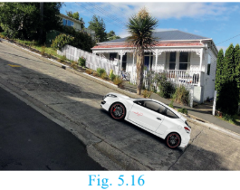

**Definition:** If \( \theta \) is the angle of inclination of a non-vertical straight line, then \( \tan \theta \) is called the slope or gradient of the line and is denoted by \( m \).

Therefore the slope of the straight line is
\[
m = \tan \theta, \quad 0^\circ \leq \theta \leq 180^\circ, \quad \theta \neq 90^\circ
\]

**To find the slope of a straight line when two points are given**

$$\text{Slope } m = \tan\theta$$

$$= \frac{\text{opposite side}}{\text{adjacent side}}$$

$$= \frac{BC}{AC}$$$$m = \frac{y_2 - y_1}{x_2 - x_1}.$$

$$\boxed{\text{Slope } m = \frac{\text{Difference in } y \text{ coordinates}}{\text{Difference in } x \text{ coordinates}}}$$

The slope of the line through $(x_1, y_1)$ and $(x_2, y_2)$ with $x_1 \neq x_2$ is $\frac{y_2 - y_1}{x_2 - x_1}$.

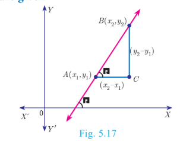

> **Note**
>
> The slope of a vertical line is **undefined**.

**Values of slopes:**

| Condition | Slope | Diagram |
|-----------|-------|-----------|
| \( \theta = 0^\circ \) |The line is parallel to the positive direction of X axis.|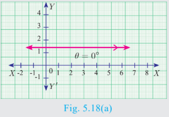|
| \( 0^\circ < \theta < 90^\circ \) | The line has positive slope (A line with positive slope rises from left to right). | 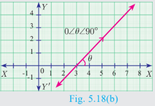 |
| \( 90^\circ < \theta < 180^\circ \) |The line has negativeslope (A line with negative slope falls from left to right).|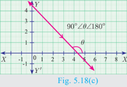|
| \( \theta = 180^\circ \) |The line is parallelto the negative direction of X axis.|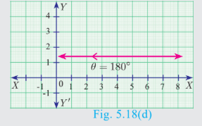|
| \( \theta = 90^\circ \) |The slope is undefined.|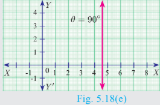|

**Activity 3**
The diagram contains four lines $l_1$, $l_2$, $l_3$ and $l_4$.

(i) Which lines have positive slope?
(ii) Which lines have negative slope?

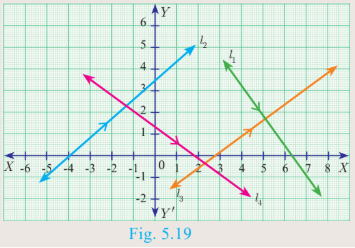
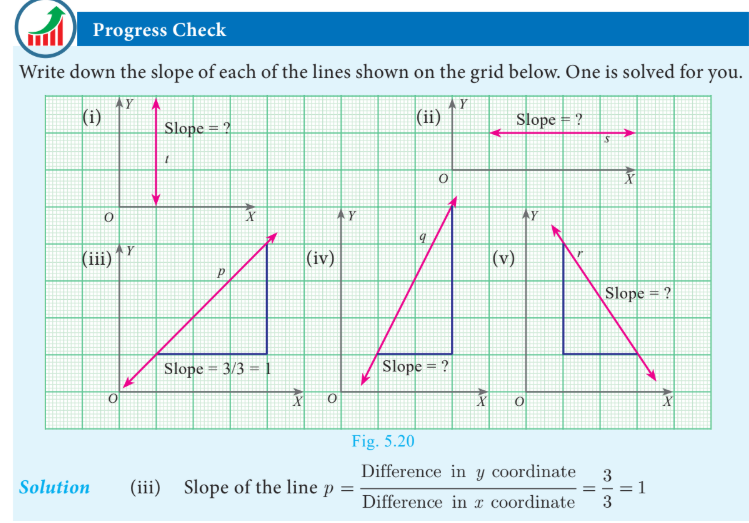

Here is the text extracted from the provided textbook page:

---

### 5.4.2 Slopes of parallel lines

Two non-vertical lines are **parallel** if and only if their **slopes are equal**.
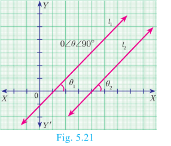
Let $l_1$ and $l_2$ be two non-vertical lines with slopes $m_1$ and $m_2$ respectively.

Let the inclination of the lines with positive direction of $X$ axis be $\theta_1$ and $\theta_2$ respectively.

Assume, $l_1$ and $l_2$ are parallel

$$\theta_1 = \theta_2 \text{ (Since, } \theta_1, \theta_2 \text{ are corresponding angles)}$$

$$\tan \theta_1 = \tan \theta_2$$

$$m_1 = m_2$$

Hence, the slopes are equal.

Therefore, non-vertical parallel lines have equal slopes.

#### Conversely

Let the slopes be equal, then

$$m_1 = m_2$$

$$\tan \theta_1 = \tan \theta_2$$

$$\theta_1 = \theta_2 \text{ (since } 0 \le \theta_1 \le 180^\circ, \ 0 \le \theta_2 \le 180^\circ\text{)}$$

That is the corresponding angles are equal.

Therfore, \(l_1\) and \(l_2\) are parallel.

Thus, non-vertical lines having equal slopes are parallel.

Hence,**non vertical lines** are **parallel** if and only if their **slopes are equal**.

---

### 5.4.3 Slopes of Perpendicular Lines

Two non-vertical lines with slopes $m_1$ and $m_2$ are **perpendicular** if and only if $m_1m_2 = -1$.

Let $l_1$ and $l_2$ be two non-vertical lines with slopes $m_1$ and $m_2$, respectively. Let their inclinations be $\theta_1$ and $\theta_2$ respectively.
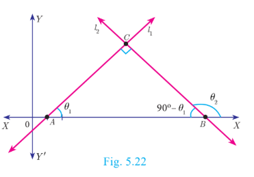
Then $m_1 = \tan\theta_1$ and $m_2 = \tan\theta_2$

First we assume that, $l_1$ and $l_2$ are perpendicular to each other.

Then $\angle ABC = 90^\circ - \theta_1$ (sum of angles of $\Delta ABC$ is $180^\circ$)

Now measuring slope of $l_2$ through angles $\theta_2$ and $90^\circ - \theta_1$, which are opposite to each other, we get

$$\tan\theta_2 = -\tan(90^\circ - \theta_1)$$

$$= \frac{-\sin(90^\circ - \theta_1)}{\cos(90^\circ - \theta_1)} = \frac{-\cos\theta_1}{\sin\theta_1} = -\cot\theta_1 \quad \text{gives, } \tan\theta_2 = -\frac{1}{\tan\theta_1}$$

$$\tan\theta_1 \cdot \tan\theta_2 = -1$$

$$m_1 \cdot m_2 = -1.$$

Thus, when the line $l_1$ is perpendicular to line $l_2$ then $m_1m_2 = -1$.

#### Conversely,

Let $l_1$ and $l_2$ be two non-vertical lines with slopes $m_1$ and $m_2$ respectively, such that $m_1m_2 = -1$.

Since $m_1 = \tan \theta_1$, $m_2 = \tan \theta_2$

We have $\tan \theta_1 \tan \theta_2 = -1$

$$\tan \theta_1 = -\frac{1}{\tan \theta_2}$$

$$\tan \theta_1 = -\cot \theta_2$$

$$\tan \theta_1 = -\tan(90^\circ - \theta_2)$$

$$\tan \theta_1 = \tan(-(90^\circ - \theta_2)) = \tan(\theta_2 - 90^\circ)$$

$$\theta_1 = \theta_2 - 90^\circ \quad \text{(since } 0 \le \theta_1 \le 180^\circ, \ 0 \le \theta_2 \le 180^\circ\text{)}$$

$$\theta_2 = 90^\circ + \theta_1$$

But in $\Delta ABC$, $\theta_2 = \angle C + \theta_1$

Therefore, $\angle C = 90^\circ$

### Do You Know?

In any triangle, exterior angle is equal to sum of the interior opposite angles.

>**Note**
>Let $l_1$ and $l_2$ be two lines with well-defined slopes $m_1$ and $m_2$ respectively, then
>(i) $l_1$ is parallel to $l_2$ if and only if $m_1$ = $m_2$ .
>(ii) $l_1$ is perpendicular to $l_2$ if and only if $m_1$ $m_2$ =−1 .

---

**Example 5.8**

(i) What is the slope of a line whose inclination is \( 30^\circ \)?
(ii) What is the inclination of a line whose slope is \( \sqrt{3} \)?

**Solution**
(i) Here $\theta = 30^\circ$

$$\text{Slope } m = \tan \theta$$

$$\text{Therefore, slope } m = \tan 30^\circ = \frac{1}{\sqrt{3}}$$

(ii) Given $m = \sqrt{3}$, let $\theta$ be the inclination of the line$$\tan \theta = \sqrt{3}$$

$$\text{We get, } \quad \theta = 60^\circ$$

**Thinking Corner**
The straight lines X axis and Y axis are perpendicular to each
other. Is the condition $m_1$$m_2$ =−1 true?

**Example 5.9**

Find the slope of a line joining the given points:

(i) \( (-6, 1) \) and \( (-3, 2) \)
(ii) \( \left( -\frac{1}{3}, \frac{1}{2} \right) \) and \( \left( \frac{2}{7}, \frac{3}{7} \right) \)
(iii) \( (14, 10) \) and \( (14, -6) \)

**Solution**

(i) $(-6,1)$ and $(-3,2)$

$$\text{The slope } = \frac{y_2 - y_1}{x_2 - x_1} = \frac{2 - 1}{-3 + 6} = \frac{1}{3}.$$

(ii) $\left(-\frac{1}{3}, \frac{1}{2}\right)$ and $\left(\frac{2}{7}, \frac{3}{7}\right)$

$$\text{The slope } = \frac{\frac{3}{7} - \frac{1}{2}}{\frac{2}{7} + \frac{1}{3}} = \frac{\frac{6 - 7}{14}}{\frac{6 + 7}{21}}$$

$$= -\frac{1}{14} \times \frac{21}{13} = -\frac{3}{26}.$$

(iii) $(14,10)$ and $(14,-6)$

$$\text{The slope} \quad = \frac{-6 - 10}{14 - 14} = \frac{-16}{0}.$$

The slope is undefined.

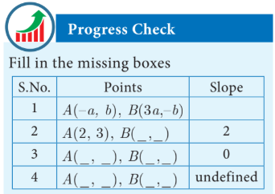

**Example 5.10**

The line \( r \) passes through the points \( (-2, 2) \) and \( (5, 8) \), and the line \( s \) passes through the points \( (-8, 7) \) and \( (-2, 0) \). Is the line \( r \) perpendicular to \( s \)?

**Solution**

\[
\text{The slope of line r is } m_r = \frac{8 - 2}{5 - (-2)} = \frac{6}{7}
\]

\[
\text{The slope of line s is }m_s = \frac{0 - 7}{-2 - (-8)} = \frac{-7}{6}
\]

\[
\text{The product of slopes }= \frac{6}{7} \times \frac{-7}{6} = -1
\]

That is, $m_1$$m_2$ =−1

Therefore, the line r is perpendicular to line s.

---
**Example 5.11**

The line \( p \) passes through the points \( (3, -2) \) and \( (12, 4) \), and the line \( q \) passes through the points \( (6, -2) \) and \( (12, 2) \). Is \( p \) parallel to \( q \)?

**Solution**

\[
\text{The slope of line p is }m_1 = \frac{4 - (-2)}{12 - 3} = \frac{6}{9} = \frac{2}{3}
\]

\[
\text{The slope of line q is }m_2 = \frac{2 - (-2)}{12 - 6} = \frac{4}{6} = \frac{2}{3}
\]

Thus, slope of line p = slope of line q.

Therefore, line p is parallel to the line q.

---

**Example 5.12**

Show that the points \( (-2, 5) \), \( (6, -1) \) and \( (2, 2) \) are collinear.

**Solution**
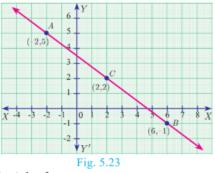
The vertices are A(-2 , 5), B(6 , -1) and C(2,2).

Slope of AB:

\[
\text{Slope of AB:} = \frac{-1 - 5}{6 - (-2)} = \frac{-6}{8} = -\frac{3}{4}
\]

\[
\text{Slope of BC:}= \frac{2 - (-1)}{2 - 6} = \frac{3}{-4} = -\frac{3}{4}
\]
We get, Slope of AB = Slope of BC

Therefore, the points A, B, C all lie in a same
straight line.

Hence the points A, B and C are collinear.

---

**Example 5.13**

Let \( A(1, -2) \), \( B(6, -2) \), \( C(5, 1) \) and \( D(2, 1) \) be four points.

(i) Find the slope of the line segments: (a) AB (b) CD
(ii) Find the slope of the line segments: (a) BC (b) AD
(iii) What can you deduce from your answer?

**Solution**

(i) (a) \( \text{Slope of AB} = \frac{-2 + (2)}{6 - 1} = 0 \)

(b) \( \text{Slope of CD} = \frac{1 - 1}{2 - 5} = 0 \)

(ii) (a) \( \text{Slope of BC} = \frac{1 + (2)}{5 - 6} = -3 \)

(b) \( \text{Slope of AD} = \frac{1 + (2)}{2 - 1} = 3 \)

(iii) The slope of AB and CD are equal so AB, CD are parallel.

Similarly the lines AD and BC are not parallel, since their slopes are not equal.
So, we can deduce that the quadrilateral ABCD is a trapezium.

---

**Example 5.14**

Consider the graph representing growth of population (in crores). Find the slope of the line AB and hence estimate the population in the year 2030.
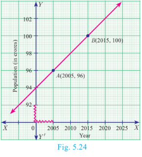
**Solution**

The points A(2005, 96) and B(2015, 100) are on the line AB.

\[
\text{Slope of AB} = \frac{100 - 96}{2015 - 2005} = \frac{4}{10} = \frac{2}{5}
\]

Let the growth of population in 2030 be \( k \) crores. Assuming point C(2030, \( k \)) is on AB:

\[
\frac{k - 96}{2030 - 2005} = \frac{2}{5}
\]

\[
\frac{k - 96}{25} = \frac{2}{5} \Rightarrow k - 96 = 10 \Rightarrow k = 106
\]

Hence the estimated population in 2030 =106 Crores.

---

**Example 5.15**

Without using Pythagoras theorem, show that the points \( (1, -4) \), \( (2, -3) \) and \( (4, -7) \) form a right angled triangle.

**Solution**

\[
\text{Slope of AB:} = \frac{-3 + 4}{2 - 1} = 1
\]

\[
\text{The slope of BC} = \frac{-7 + 3}{4 - 2} = \frac{-4}{2} = -2
\]

\[
\text{The slope of AC} = \frac{-7 + 4 }{4 - 1} = \frac{-3}{3} = -1
\]

Slope of AB  ́slope of AC =(1)(-1) =−1

AB is perpendicular to AC.

\( \angle A = 90^\circ \), hence \( \triangle ABC \) is right-angled triangle.

**Thinking Corner**
Provide three examples of using the concept of slope in real-life situations.

---

**Example 5.16**

Prove analytically that the line segment joining the mid-points of two sides of a triangle is parallel to the third side and is equal to half of its length.

**Solution**
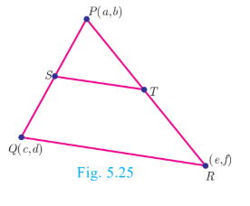
Let \( P(a, b) \), \( Q(c, d) \), \( R(e, f) \) be the vertices of a triangle.

Let S be the mid-point of PQ and T be the mid-point of PR.

\[
S = \left( \frac{a + c}{2}, \frac{b + d}{2} \right), \quad T = \left( \frac{a + e}{2}, \frac{b + f}{2} \right)
\]

\[
\text{Slope of ST} = \frac{\frac{b + f}{2} - \frac{b + d}{2}}{\frac{a + e}{2} - \frac{a + c}{2}} = \frac{f - d}{e - c}
\]

\[
\text{Slope of QR} = \frac{f - d}{e - c}
\]

Therefore, ST is parallel to QR. (since, their slopes are equal)

Also,

$$ST = \sqrt{\left(\frac{a + e}{2} - \frac{a + c}{2}\right)^2 + \left(\frac{b + f}{2} - \frac{b + d}{2}\right)^2}$$

\[
ST = \frac{1}{2} \sqrt{(e - c)^2 + (f - d)^2} = \frac{1}{2} QR
\]

Thus, ST is parallel to QR and half of it.

>**Note**
>This example illustrates how a geometrical result can be proved using coordinate Geometry.

---

**Exercise 5.2**

1. What is the slope of a line whose inclination with positive direction of x-axis is:
   (i) \( 90^\circ \) &nbsp;&nbsp; (ii) \( 0^\circ \)

2. What is the inclination of a line whose slope is:
   (i) 0 &nbsp;&nbsp; (ii) 1

3. Find the slope of a line joining the points:
   (i) \( (5, \sqrt{5}) \) with the origin
   (ii) \( (\sin \theta, -\cos \theta) \) and \( (-\sin \theta, \cos \theta) \)

4. What is the slope of a line perpendicular to the line joining A(5, 1) and P where P is the mid-point of the segment joining (4, 2) and (-6, 4)?

5. Show that the given points are collinear: \( (-3, -4) \), \( (7, 2) \), \( (12, 5) \)

6. If the three points \( (3, -1) \), \( (a, 3) \), \( (1, -3) \) are collinear, find the value of \( a \).

7. The line through the points \( (-2, a) \) and \( (9, 3) \) has slope \( -\frac{1}{2} \). Find the value of \( a \).

8. The line through the points \( (-2, 6) \) and \( (4, 8) \) is perpendicular to the line through the points \( (8, 12) \) and \( (x, 24) \). Find the value of \( x \).

9. Show that the given points form a right angled triangle:
   (i) A(1, -4), B(2, -3), C(4, -7)
   (ii) L(0, 5), M(9, 12), N(3, 14)

10. Show that the given points form a parallelogram:
    A(2.5, 3.5), B(10, -4), C(2.5, -2.5), D(-5, 5)

11. If the points A(2,2), B(–2, –3), C(1, –3) and D(x, y) form a parallelogram then find the value of x and y.

12. Let A(3,-4), B(9,-4), C(5,-7 ) and D(7,-7). Show that ABCD is a trapezium.

13. A quadrilateral has vertices at A(-4,-2), B(5,-1), C(6,5) and D(-7,6). Show that the mid-points of its sides form a parallelogram.

---
