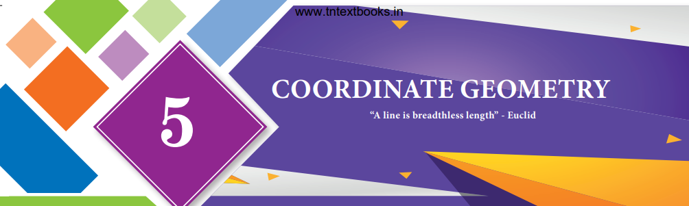

>
> Apollonius was born at Perga, in modern day Turkey. His greatest work > was called “conics” which introduced curves like circle, parabola > geometrically. He wrote six other books all related to the basics of > modern day coordinate geometry.
>
> His ideas were applied to study planetary theory and solve practical
> problems. He developed the sundial and contributed to other
>
> **Apollonius**
>
> **262 - 190 BC (BCE)**
>
> branches of science using his exceptional geometric skills. For this
> reason, Apollonius is hailed as “The Great Geometer”.

- To find area of a triangle formed by three given points.

- To find area of a quadrilateral formed by four given points.

- To find the slope of a straight line.

- To determine equation of a straight line in various forms.

- To find the equation of a line parallel to the line *ax* + *by* + *c*
  = 0 .

- To find the equation of a line perpendicular to the line *ax* + *by* +
  *c* = 0 .

> **Learning Outcomes**

# introduction

>Coordinate geometry, also called Analytical geometry is a branch of > mathematics, in which curves in a plane are represented by algebraic > equations. For example, the equation *x* 2 + > *y*2 = 1 , describes a circle of unit radius in the plane. > Thus coordinate geometry can be seen as a branch of mathematics which > interlinks algebra and geometry, where algebraic equations are > represented by geometric curves. This connection makes it possible to > reformulate problems in geometry to problems in algebra and vice > versa. Thus, in coordinate geometry, the algebraic equations have > visual representations thereby making our understanding much deeper. > For instance, the first degree equation in two variables *ax* + *by* + > *c* = 0 represents a straight line in a plane. Overall, coordinate > geometry is a tool to understand concepts visually and created new > branches of mathematics in modern times.
>
> 

>
> In the earlier classes, we initiated the study of coordinate geometry > where we studied about coordinate axes, coordinate plane, plotting of > points in a plane, distance between two points, section formulae, etc. > All these concepts form the basics of coordinate geometry. Let us now > recall some of the basic formulae.
>