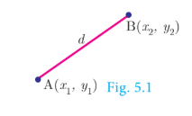
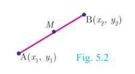
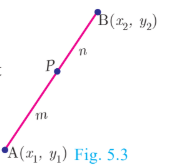
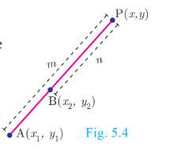
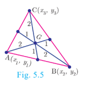

## 5.1 Introduction

Coordinate geometry, also called Analytical geometry, is a branch of mathematics in which curves in a plane are represented by algebraic equations. For example, the equation \( x^2 + y^2 = 1 \) describes a circle of unit radius in the plane. Thus coordinate geometry can be seen as a branch of mathematics which interlinks algebra and geometry, where algebraic equations are represented by geometric curves. This connection makes it possible to reformulate problems in geometry to problems in algebra and vice versa.

Thus, in coordinate geometry, the algebraic equations have
visual representations thereby making our understanding much deeper. For instance, the first degree equation in two variables ax+by+c = 0 represents a straight line in a plane. Overall, coordinate geometry is a tool to understand concepts visually and created new branches of mathematics in modern times.

In the earlier classes, we initiated the study of coordinate geometry where we studied about coordinate axes, coordinate plane, plotting of points in a plane, distance between two points, section formulae, etc. All these concepts form the basics of coordinate geometry. Let us now recall some of the basic formulae.

**Recall**

**Distance between two points:**

Distance between two points \( A(x_1, y_1) \) and \( B(x_2, y_2) \) is
\[
|AB| = d = \sqrt{(x_2 - x_1)^2 + (y_2 - y_1)^2}
\]

**Mid-point of line segment:**

The mid-point M of the line segment joining \( A(x_1, y_1) \) and \( B(x_2, y_2) \) is
\[
 M = \left( \frac{x_1 + x_2}{2}, \frac{y_1 + y_2}{2} \right)
\]

**Section Formula (Internal Division):**

Let \( A(x_1, y_1) \) and \( B(x_2, y_2) \) be two distinct points such that point \( P(x, y) \) divides AB internally in the ratio \( m : n \). Then the coordinates of P are
\[
P = \left( \frac{m x_2 + n x_1}{m + n}, \frac{m y_2 + n y_1}{m + n} \right)
\]

**Section Formula (External Division):**

Let \( A(x_1, y_1) \) and \( B(x_2, y_2) \) be two distinct points such that point \( P(x, y) \) divides AB externally in the ratio \( m : n \). Then the coordinates of P are
\[
P = \left( \frac{m x_2 - n x_1}{m - n}, \frac{m y_2 - n y_1}{m - n} \right)
\]

**Centroid of a triangle:**

The coordinates of the centroid G of a triangle with vertices \( A(x_1, y_1) \), \( B(x_2, y_2) \), \( C(x_3, y_3) \) are
\[
G = \left( \frac{x_1 + x_2 + x_3}{3}, \frac{y_1 + y_2 + y_3}{3} \right)
\]

## Progress Check
1. Complete the following table.

| S.No. | Points | Distance | Mid Point | Internal Point | Internal Ratio | External Point | External Ratio |
| --- | --- | --- | --- | --- | --- | --- | --- |
| **(i)** | $(3, 4)$, $(5, 5)$ |  |  |  | $2:3$ |  | $2:3$ |
| **(ii)** | $(-7, 13)$, $(-3, 1)$ |  |  | $\left(-\frac{13}{3}, 5\right)$ |  | $(-13, 15)$ |  |

2. $A(0,5)$, $B(5,0)$ and $C(-4,-7)$ are vertices of a triangle then its centroid will be at _______.
---
