## 5.5 Straight Line

Any first degree equation in two variables \( x \) and \( y \) of the form:

\[
ax + by + c = 0
\]

where \( a, b, c \) are real numbers and at least one of \( a, b \) is non-zero, is called a **"Straight line"** in XY plane.
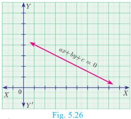
### 5.5.1 Equation of Coordinate Axes

The $X$ axis and $Y$ axis together are called coordinate axes. The $x$ coordinate of every point on $OY$ ($Y$ axis) is 0. Therefore equation of $OY$ ($Y$ axis) is $x = 0$ (fig 5.27)
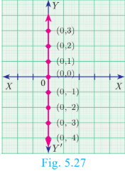
The $y$ coordinate of every point on $OX$ ($X$ axis) is 0. Therefore the equation of $OX$ ($X$ axis) is $y = 0$ (fig 5.28)
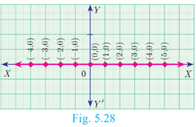

### 5.5.2 Equation of a Line Parallel to X-axis

Let $AB$ be a straight line parallel to $X$ axis, which is at a distance ‘$b$’. Then $y$ coordinate of every point on ‘$AB$’ is ‘$b$’.(fig 5.29)

Therefore, the equation of $AB$ is $y = b$
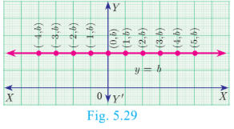

> **Note**
>
> - If \( b > 0 \), then the line y=b lies above the X axis
> - If \( b < 0 \), then the line y=b lies below the X axis
> - If \( b = 0 \), then the line y=b is the X axis itself.

### 5.5.3 Equation of a Line Parallel to Y-axis

Let CD be a straight line parallel to Y-axis at distance \( c \). Then \( x \)-coordinate of every point on CD is \( c \).The equation of CD is
x = c (fig 5.30)
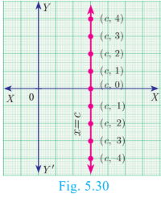

> **Note**
>
> - If \( c > 0 \), then the line x=c lies right to the side of the Y axis
> - If \( c < 0 \), then the line x=c lies left to the side of the Y axis
> - If \( c = 0 \), then the line x=c is the Y axis itself.
---

**Example 5.17**

Find the equation of a straight line passing through \( (5, 7) \) and is:
(i) parallel to X-axis
(ii) parallel to Y-axis

**Solution**

(i) The equation of any line parallel to X-axis is \( y = b \). Since it passes through \( (5, 7) \), \( b = 7 \).

Therefore, the required equation of the line is y=7.

(ii) The equation of any line parallel to Y-axis is \( x = c \). Since it passes through \( (5, 7) \), \( c = 5 \).

Therefore, the required equation of the line is x=5.

---

### 5.5.4 Slope-Intercept Form

Every straight line that is not vertical will cut the Y axis at a single point. The y coordinate of this point is called y intercept of the line.

A line with slope \( m \) and y-intercept \( c \) can be expressed through the equation:

\[
y = mx + c
\]

We call this equation as the slope-intercept form of the equation of a line.

> **Note**
>
> - If a line with slope \( m \), \( m \neq 0 \) makes x-intercept \( d \), then the equation is \( y = m(x - d) \).
> - \( y = mx \) represents equation of a straight line with slope \( m \) passing through the origin.

---

**Example 5.18**

Find the equation of a straight line whose:
(i) Slope is 5 and y-intercept is -9
(ii) Inclination is \( 45^\circ \) and y-intercept is 11

**Solution**

(i) Given, Slope = 5, y intercept, c =−9

Therefore, equation of a straight line is \(y = {mx} + c\)
\[
y = 5x - 9 \Rightarrow 5x - y - 9 = 0
\]

(ii) Given, $\theta = 45^\circ$, $y\text{ intercept}, c = 11$

$\text{Slope } m = \tan \theta = \tan 45^\circ = 1$

Therefore, equation of a straight line is of the form $y = mx + c$

Hence we get, $y = x + 11 \implies x - y + 11 = 0$

---

**Example 5.19**

Calculate the slope and y-intercept of the straight line \( 8x - 7y + 6 = 0 \).

**Solution**
Equation of the given straight line is
\[
8x - 7y + 6 = 0
\]

\[
7y = 8x + 6  \text{(bringing it to the form $y = m x + c$ )}
\]

\[
y = \frac{8}{7}x + \frac{6}{7}  ...(1)
\]

Comparing (1) with \( y = mx + c \):

\( \text{Slope m } = \frac{8}{7} \) , \( \text{y intercept c} = \frac{6}{7} \)

**Do You Know?**

For, the point $(x, y)$ in a $xy$ plane, the $x$ coordinate $x$ is called "Abscissae" and the $y$ coordinate $y$ is called "Ordinate".

---

**Example 5.20**

The graph relates temperatures \( y \) (in Fahrenheit degree) to temperatures \( x \) (in Celsius degree).

(a) Find the slope and y-intercept.
(b) Write an equation of the line.
(c) What is the mean temperature of the earth in Fahrenheit degree if its mean temperature is \( 25^\circ \) Celsius?

**Solution**

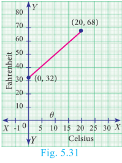
(a) From the figure, $\text{slope} = \frac{\text{change in } y \text{ coordinate}}{\text{change is } x \text{ coordinate}} = \frac{68 - 32}{20 - 0} = \frac{36}{20} = \frac{9}{5} = 1.8$

The line crosses the $Y$ axis at $(0, 32)$ 

So the slope is $\frac{9}{5}$ and $y$ intercept is 32. 

(b) Use the slope and $y$ intercept to write an equation  

The equation is $y = \frac{9}{5}x + 32$  

(c) In Celsius, the mean temperature of the earth is $25^\circ$. To find the mean temperature in Fahrenheit, we find the value of $y$ when $x = 25$ 

$$y = \frac{9}{5}x + 32$$$$y = \frac{9}{5}(25) + 32$$$$y = 77$$

Therefore, the mean temperature of the earth is $77^\circ\text{F}$. 

>**Note**
>The formula for converting Celsius to Fahrenheit is given by $F = \frac{9}{5}C + 32$, which is the linear equation representing a straight line derived in the example.

---

### 5.5.5 Point-Slope Form
Here we will find the equation of a straight line passing through a given point A($x_1$,$y_1$) and having the slope m.

Let P(x,y) be any point other than A on the given line. Slope of the line joining A($x_1$,$y_1$) and P(x,y) is given by

$$m = \tan \theta = \frac{y - y_1}{x - x_1}$$
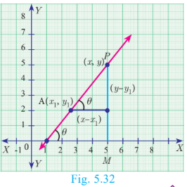
Therefore, the equation of the required line is $y - y_1 = m(x - x_1)$ (Point slope form)

**Thinking Corner**
Is it possible to express, the equation of a straight line in slope-intercept form, when it is parallel to Y axis?

---

**Example 5.21**

Find the equation of a line passing through the point \( (3, -4) \) and having slope \( -\frac{5}{7} \).

**Solution**

Given \( (x_1, y_1) = (3, -4) \) and \( m = -\frac{5}{7} \).
The equation of the point-slope form of the straight line is y - $y_1$ = m(x - $x_1$)
\[
y - (-4) = -\frac{5}{7}(x - 3)
\]

\[
y + 4 = -\frac{5}{7}x + \frac{15}{7}
\]

\[
7y + 28 = -5x + 15
\]

\[
5x + 7y + 13 = 0\]

---

**Example 5.22**

Find the equation of a line passing through the point A(1, 4) and perpendicular to the line joining points (2, 5) and (4, 7).

**Solution**
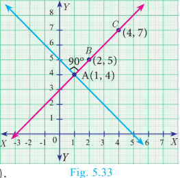
Let the given points be A(1,4) , B(2,5) and C(4,7)
\[
\text{Slope of line BC} = \frac{7 - 5}{4 - 2} = 1
\]

Let \( m \) be the slope of the required line. Since the required line is perpendicular to BC:

\[
m \cdot 1 = -1 \Rightarrow m = -1
\]
The required line also pass through the point A(1,4).
The equation of the required straight line is y - $y_1$ = m(x - $x_1$)
\[
y - 4 = -1(x - 1)
\]

\[
y - 4 = -x + 1
\]

\[
x + y - 5 = 0
\]

---

### 5.5.6 Two-Point Form

Let $A(x_1, y_1)$ and $B(x_2, y_2)$ be two given distinct points. Slope of the straight line passing through these points is given by $m = \frac{y_2 - y_1}{x_2 - x_1}$, $(x_2 \neq x_1)$.

From the equation of the straight line in point slope form, we get

$$y - y_1 = \frac{y_2 - y_1}{x_2 - x_1}(x - x_1)$$

Hence, $\frac{y - y_1}{y_2 - y_1} = \frac{x - x_1}{x_2 - x_1}$ (is the equation of the line in two-point form)

---

**Example 5.23**

Find the equation of a straight line passing through \( (5, -3) \) and \( (7, -4) \).

**Solution**
The equation of a straight line passing through the two points ($x_1$,$y_1$ ) and ($x_2$,$y_2$) is 

$\frac{y - y_1}{y_2 - y_1} = \frac{x - x_1}{x_2 - x_1}$

\[
\frac{y - (-3)}{-4 - (-3)} = \frac{x - 5}{7 - 5}
\]

\[
\frac{y + 3}{-1} = \frac{x - 5}{2}
\]

\[
2y + 6 = -x + 5
\]

\[
x + 2y + 1 = 0
\]

**Do You Know ?**
The great mathematical physicists like Galileo and Newton used coordinate geometry to characterize the motions of objects in plane and space.

---

**Example 5.24**

Two buildings of different heights are located at opposite sides of each other. If a heavy rod is attached joining the terrace of the buildings from \( (6, 10) \) to \( (14, 12) \), find the equation of the rod joining the buildings.

**Solution**

Let A(6, 10) and B(14, 12) be the points denoting the terrace of the buildings.

The equation of the rod is the equation of the straight line passing through A(6, 10) and B(14, 12)

$\frac{y - y_1}{y_2 - y_1} = \frac{x - x_1}{x_2 - x_1}$

\[
\frac{y - 10}{12 - 10} = \frac{x - 6}{14 - 6}
\]

\[
\frac{y - 10}{2} = \frac{x - 6}{8}
\]

\[
8y - 80 = 2x - 12
\]

\[
x - 4y + 34 = 0
\]

Hence, equation of the rod is x- 4y + 34 =0

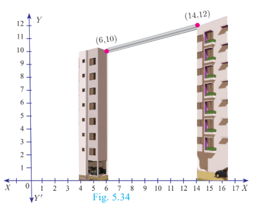

---

### 5.5.7 Intercept Form

We will find the equation of a line whose intercepts are $a$ and $b$ on the coordinate axes respectively. 

Let $PQ$ be a line meeting $X$ axis at $A$ and $Y$ axis at $B$. Let $OA = a$, $OB = b$. Then the coordinates of $A$ and $B$ are $(a, 0)$ and $(0, b)$ respectively. Therefore, the equation of the line joining $A$ and $B$ is  

$$\frac{y - 0}{b - 0} = \frac{x - a}{0 - a} \text{ we get, } \frac{y}{b} = \frac{x - a}{-a} \text{ gives } \frac{y}{b} = \frac{-x}{a} + 1$$

Hence, $\frac{x}{a} + \frac{y}{b} = 1$ (Intercept form of a line)

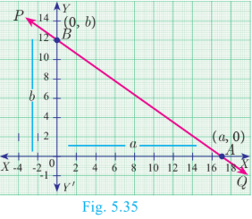

---
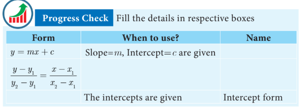
**Example 5.25**

Find the equation of a line which passes through \( (5, 7) \) and makes intercepts on the axes equal in magnitude but opposite in sign.

**Solution**

Let x-intercept be \( a \) and y-intercept be \( -a \).

The equation of the line in intercept form is $\frac{x}{a} + \frac{y}{b} = 1$

$$\Rightarrow \frac{x}{a} + \frac{y}{-a} = 1 \text{ (Here } b = -a)$$

$$\therefore x - y = a \quad \dots(1)$$

Since $(1)$ passes through $(5,7)$Therefore, $5 - 7 = a \Rightarrow a = -2$Thus the required equation of the straight line is $x - y = -2$ ; or $x - y + 2 = 0$

---

**Example 5.26**

Find the intercepts made by the line \( 4x - 9y + 36 = 0 \) on the coordinate axes.

**Solution**

 Equation of the given line is $4x - 9y + 36 = 0$
 
 $$\text{we write it as } 4x - 9y = -36 \text{ (bringing it to the normal form)}$$
 
 Dividing by $-36$ we get, $\frac{x}{-9} + \frac{y}{4} = 1 \quad \dots(1)$
 
 Comparing $(1)$ with intercept form, we get $x$ intercept $a = -9$ ; $y$ intercept $b = 4$ 

---

**Example 5.27**

A mobile phone is put to use when the battery power is 100%. The percent of battery power 'y' (in decimal) remaining after using the mobile phone for x hours is assumed as:

\[
y = {-0.25}{x} + 1
\]

(i) Find the number of hours elapsed if the battery power is 40%.
(ii) How much time does it take so that the battery has no power?
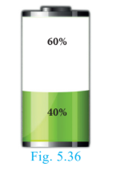
**Solution**

(i) To find the time when the battery power is $40\%$, we have to take $y = 0.40$

$$0.40 = -0.25x + 1 \implies 0.25x = 0.60$$

$$\text{we get, } x = \frac{0.60}{0.25} = 2.4 \text{ hours.}$$

(ii) If the battery power is 0 then y=0

Therefore, 0=−0.25x+1 gives 0.25x=1 hence x=4 hours.

Thus, after 4 hours, the battery of the mobile phone will have no power.

---

**Example 5.28**

A line makes positive intercepts on coordinate axes whose sum is 7 and it passes through \( (-3, 8) \). Find its equation.

**Solution**

Let intercepts be \( a \) and \( b \). Then \( a + b = 7 \Rightarrow b = 7 - a \).

\[
\frac{x}{a} + \frac{y}{7 - a} = 1
\]

Since it passes through \( (-3, 8) \):

\[
\frac{-3}{a} + \frac{8}{7 - a} = 1
\]

\[
-3(7 - a) + 8a = a(7 - a)
\]

\[
-21 + 3a + 8a = 7a - a^2
\]

\[
-21 + 11a = 7a - a^2
\]

\[
a^2 + 4a - 21 = 0
\]

\[
(a + 7)(a - 3) = 0 \Rightarrow a = 3 \text{ or } a = -7
\]

Since \( a \) is positive, \( a = 3 \), \( b = 4 \).

**Answer:** \( \frac{x}{3} + \frac{y}{4} = 1 \Rightarrow 4x + 3y - 12 = 0 \)

---

**Example 5.29**

A circular garden is bounded by East Avenue and Cross Road. Cross Road
intersects North Street at D and East Avenue at E. AD is tangential to the circular garden at A(3, 10). Using the figure.
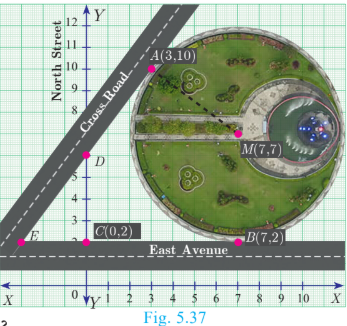
(a) Find the equation of

(i) East Avenue.
(ii) North Street
(iii) Cross Road

(b) Where does the Cross Road intersect?

(i) North Street (ii) East Avenue

**solution**

(a) (i) East Avenue is the straight line joining $C(0,2)$ and $B(7,2)$. Thus the equation of East Avenue is obtained by using two-point form which is$$\frac{y - 2}{2 - 2} = \frac{x - 0}{7 - 0}$$$$\frac{y - 2}{0} = \frac{x}{7} \implies y = 2$$

(ii) Since the point $D$ lie vertically above $C(0,2)$. The $x$ coordinate of $D$ is $0$.  Since any point on North Street has $x$ coordinate value $0$.  The equation of North Street is $x = 0$  

(iii) To find equation of Cross Road.  Center of circular garden $M$ is at $(7, 7)$, $A$ is $(3, 10)$  We first find slope of $MA$, which we call $m_1$  $$\text{Thus } m_1 = \frac{10 - 7}{3 - 7} = \frac{-3}{4}.$$

Since the Cross Road is perpendicular to $MA$, if $m_2$ is the slope of the Cross Road then, $m_1 m_2 = -1$ gives $\frac{-3}{4} m_2 = -1$ so $m_2 = \frac{4}{3}$.  Now, the cross road has slope $\frac{4}{3}$ and it passes through the point $A(3,10)$.  The equation of the Cross Road is $y - 10 = \frac{4}{3}(x - 3)$  $$3y - 30 = 4x - 12$$$$\text{Hence, } 4x - 3y + 18 = 0$$

(b) (i) If $D$ is $(0, k)$ then $D$ is a point on the Cross Road.Therefore, substituting $x = 0$, $y = k$ in the equation of Cross Road,$$\text{we get, } 0 - 3k + 18 = 0$$$$\text{Value of } k = 6$$

Therefore, $D$ is $(0, 6)$(ii) To find $E$, let $E$ be $(q, 2)$Put $y = 2$ in the equation of the Cross Road,$$\text{we get, } 4q - 6 + 18 = 0$$$$4q = -12 \text{ gives } q = -3$$Therefore, The point $E$ is $(-3, 2)$Thus the Cross Road meets the North Street at $D(0, 6)$ and East Avenue at E $(-3, 2)$.

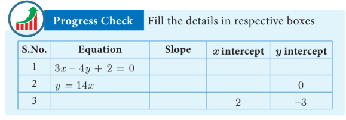

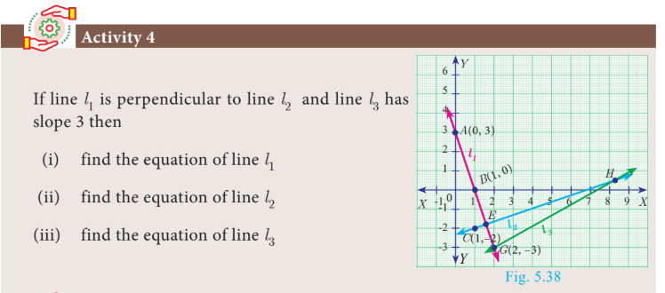

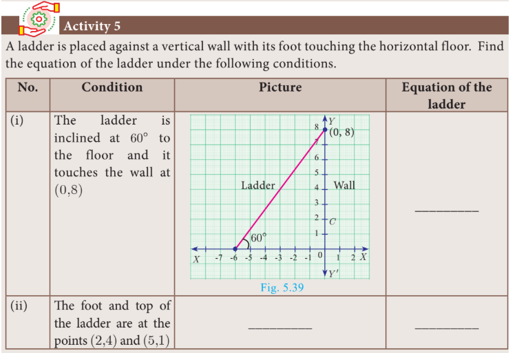

**Exercise 5.3**

1. Find the equation of a straight line passing through the mid-point of a line segment joining the points \( (1, -5) \), \( (4, 2) \) and parallel to:
   (i) X-axis &nbsp;&nbsp; (ii) Y-axis

2. The equation of a straight line is \( 2(x - y) + 5 = 0 \). Find its slope, inclination and intercept on the Y-axis.

3. Find the equation of a line whose inclination is \( 30^\circ \) and making an intercept -3 on the Y-axis.

4. Find the slope and y-intercept of \( \sqrt{3}x + (1 - \sqrt{3})y = 3 \).

5. Find the value of 'a', if the line through \( (-2, 3) \) and \( (8, 5) \) is perpendicular to \( y = ax + 2 \).

6. The hill in the form of a right triangle has its foot at \( (19, 3) \). The inclination of the hill to the ground is \( 45^\circ \). Find the equation of the hill joining the foot and top.

7. Find the equation of a line through the given pair of points:
   (i) \( \left( 2, \frac{2}{3} \right) \) and \( \left( -\frac{1}{2}, -2 \right) \)
   (ii) \( (2, 3) \) and \( (-7, -1) \)

8. A cat is located at the point \( (-6, -4) \) in xy-plane. A bottle of milk is kept at \( (5, 11) \). The cat wishes to consume the milk travelling through shortest possible distance. Find the equation of the path it needs to take its milk.

9. If the vertices of a triangle ABC are A(6, 2), B(-5, -1), C(1, 9); through the vertex A:
   (i) find the equation of median
   (ii) find the equation of altitude

10. Find the equation of a straight line which has slope \( -\frac{5}{4} \) and passing through the point (-1, 2).

11. You are downloading a song. The percent $y$ (in decimal form) of mega bytes remaining to get downloaded in $x$ seconds is given by $y = -0.1x + 1$.
(i) find the total MB of the song.
(ii) after how many seconds will $75\%$ of the song gets downloaded?
(iii) after how many seconds the song will be downloaded completely?  

12. Find the equation of a line whose intercepts on the $x$ and $y$ axes are given below.
(i) $4, -6$
(ii) $-5, \frac{3}{4}$ 

13. Find the intercepts made by the following lines on the coordinate axes.
(i) $3x - 2y - 6 = 0$
(ii) $4x + 3y + 12 = 0$  

14. Find the equation of a straight line
(i) passing through $(1, -4)$ and has intercepts which are in the ratio 2:5
(ii) passing through $(-8, 4)$ and making equal intercepts on the coordinate axes

---