# Straight Line

Any first degree equation in two variables x and y of the form ax + + by c = 0 …(1) where a, b, c are real numbers and at least one of a, b is non-zero is called “Straight line” in XY plane.

## Equation of coordinate axes

The X axis and Y axis together are called coordinate axes. The x coordinate of every point on OY (Y axis) is 0. Therefore equation of OY(Y axis) is x = 0 (fig 5.27)

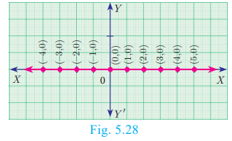

The y coordinate of every point on OX (X axis) is 0. Therefore the equation of OX (X axis) is y = 0 (fig 5.28)

## Equation of a straight line parallel to X axis

Let AB be a straight line parallel to X axis, which is at a distance ‘b’. Then y coordinate of every point on ‘AB’ is ‘b’. (fig 5.29)

Therefore, the equation of AB is y = b

##  Equation of a Straight line parallel to the Y axis

Let CD be a straight line parallel to Y axis, which is at a distance ‘c’. Then x coordinate of every point on CD is ‘c’. The equation of CD is x = c. (fig 5.30)

<b>Example 5.17</b> Find the equation of a straight line passing 
through (5,7) and is (i) parallel to X axis (ii) parallel to Y axis.

<b>Solution</b>
 (i) The equation of any straight line parallel to X axis is y=b.Since it passes through (5,7), b = 7 .Therefore, the required equation of the line is y=7.
  (ii) The equation of any straight line parallel toY axis is x=c Since it passes through (5,7), c = 5 Therefore, the required equation of the line is x=5.

## Slope-Intercept Form

> Every straight line that is not vertical will cut the Y axis at a single point. The 
y coordinate of this point is called y intercept of the line.

>A line with slope m and y intercept c can be expressed through the equation y=mx+c

>We call this equation as the slope-intercept form of the equation of a line.

<b>Example 5.18</b>  Find the equation of a straight line whose
(i) Slope is 5 and y intercept is -9 (ii) Inclination is 45° and y intercept is 11

<b>Solution</b>

 (i) Given, Slope = 5, y intercept, c = −9

Therefore, equation of a straight line is y m = +x c

y =5x-9 ⇒ 5x-9-y= 0

(ii) Given, q = ° 45 , y intercept, c = 11

Slope m = tan q = ° tan 45 = 1

Therefore, equation of a straight line is of the form y m = +x c

Hence we get, y=x+11 ⇒ x-y+11=0

<b>Example 5.19</b>

Calculate the slope and y intercept of the straight line  8x-7y+6=0

<b>Solution</b>

Equation of the given straight line is 8x-7y+6=0

7y = 8x+6 (bringing it to the form y=mx+c)

<b>Example 5.20</b> The graph relates temperatures y (in Fahrenheit degree) to temperatures x (in Celsius degree) (a) Find the slope and y intercept (b) Write an equation of the line (c) What is the mean temperature of the earth in Fahrenheit degree if its mean temperature is 25° Celsius?

<b>Solution</b>

The line crosses the Y axis at (0, 32)

So the slope is 9/5 and y intercept is 32.

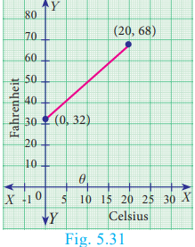

(b) Use the slope and y intercept to write an equation

the equations is y=(9x/5)+32

(c) In Celsius, the mean temperature of the earth is25°. To 
find the mean temperature in Fahrenheit, we find the 
value of y when x = 25

 Therefore, the mean temperature of the earth is 77° F

 ## Point-Slope form

 Here we will find the equation of a straight line 
passing through a given point A (x1,y2) and having the 
slope m.

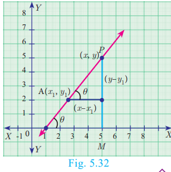

LetP(x,y) be any point other than A on the given 
line. Slope of the line joining A (x1,y2)and P(x,y) is given by

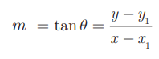

>Therefore, the equation of the required line is 
y-y1=m(x-x1) (Point slope form)

<b>Example 5.21</b>
 Find the equation of a line passing through the point (3,-4) and having slope -5/7

<b>Solution</b>

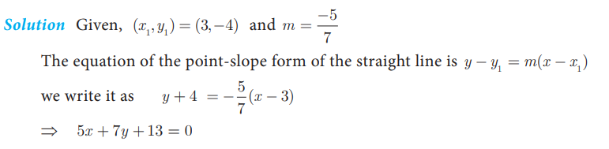

<b>Example 5.22</b> Find the equation of a line passing through the point A(1,4) and 
perpendicular to the line joining points (2,5) and (4,7).

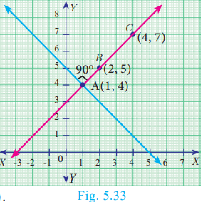

<b>Solution</b>

Let the given points be A(1,4), B(2,5) and C(4,7).

Let m be the slope of the required line.
Since the required line is perpendicular to BC,

m x 1 = -1

m = -1

The required line also pass through the point A(1,4).

y-4 = -1(x-1)

y-4 = -x + 1

We get, x+y-5=0

##  Two Point form

Let A(x1,y1) and B(x2,y2)be two given distinct points. Slope of the straight line

<b>Example 5.23</b>

 Find the equation of a straight line passing through (5 -3) and (7,-4).

 <b>Solution</b> The equation of a straight line passing through the two points is (x1,y1) and (x2,y2)

 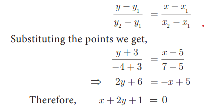

<b>Example 5.24</b> Two buildings of different heights are located at opposite sides of each other. If a heavy rod is attached joining the terrace of the buildings from (6,10) to (14,12), find the equation of the rod joining the buildings ?

 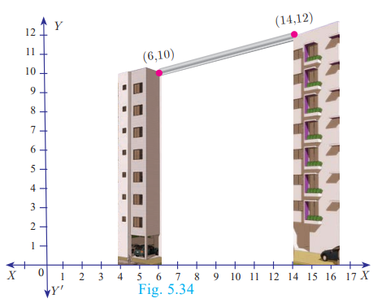

<b>Solution</b> Let A(6,10), B(14,12) be the 
points denoting the terrace of the 
buildings

The equation of the rod is the 
equation of the straight line passing 
through A(6,10) and B(14,12)

 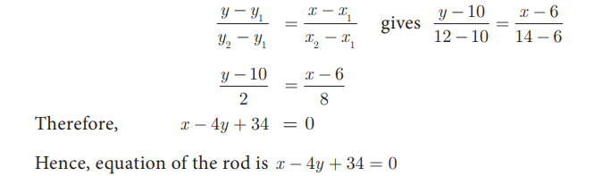

 ## Intercept Form

 We will find the equation of a line whose 
intercepts are a and b on the coordinate axes 
respectively

 

Let PQ be a line meeting X axis at A and Y axis at B. Let OA=a, OB=b. Then the coordinates of A and B are (a,0) and (b,0) respectively. Therefore, the equation of the line joining A and B is

### Progress Check Fill the details in respective boxes

<b>Example 5.25</b> Find the equation of a line which passes through (5,7) and makes intercepts 
on the axes equal in magnitude but opposite in sign.

<b>Solution</b>
 Let the x intercept be ‘a’ and y intercept be ‘–a’

 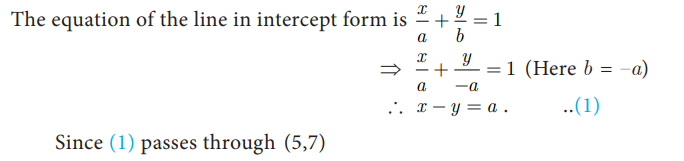

 Therefore, 5-7= a ⇒ a = −2

<b>Example 5.26</b> Find the intercepts made by the line 4x-9y+36 =0 on the coordinate axes

<b>Solution</b> Equation of the given line is 4x-9y+36 =0

<b>Example 5.27</b> A mobile phone is put to use when the battery power is 100%. The percent of battery power ‘y’ (in decimal) remaining after using the mobile phone for x hours is assumed as y= -0.25x+1

- (i) Find the number of hours elapsed if the battery power is 40%.
- (ii) How much time does it take so that the battery has no power?

<b>Solution</b>

(i) To find the time when the battery power is 40%,
we have to take y = 0.40

0.40=-0.25x+1 ⇒ 0.25x = 0.60

we get, x=0.60/0.25=2.4 hours

(ii) If the battery power is 0 then y = 0

Therefore, 0 = -0.25x+1 gives -0.25x = 1 hence x = 4 hours.

Thus, after 4 hours, the battery of the mobile phone will have no power

<b>Example 5.28</b> A line makes positive intercepts on coordinate axes whose sum is 7 and it 
passes through (-3,8). Find its equation.

<b>Solution</b>

If a and b are the intercepts then a+b=7 or b=7-a

<b>Example 5.29</b> A circular garden is bounded by East Avenue and Cross Road. Cross Road intersects North Street at D and East Avenue at E. AD is tangential to the circular garden at A(3, 10). Using the figure

(a) Find the equation of 
- (i) East Avenue.
- (ii) North Street 
- (iii) Cross Road

(b) Where does the Cross Road intersect?

- (i) North Street 
- (ii) East Avenue

<b>Solution</b>

(a) (i) East Avenue is the straight line joining C(0,2) and B(7,2). Thus the 
 equation of East Avenue is obtained by using two-point form which is

 

(ii) Since the point D lie vertically above C(0,2). The x coordinate of D is 0.
 Since any point on North Street has x coordinate value 0.
 The equation of North Street is x = 0

(iii) To find equation of Cross Road.
 Center of circular garden M is at (7, 7), A is (3, 10)
 We first find slope of MA, which we call m1

 (b) (i) If D is (0,k) then D is a point on the Cross Road

 Therefore, substituting x = 0 , y k = in the equation of Cross Road,

 we get, 0-3k+18=0

 Value of k = 6

 Therefore, D is (0, 6)

 

(ii) To find E, let E be (q,2)

Put y = 2 in the equation of the Cross Road,

we get, 4q−6 + 18= 0

4q= −12 gives q = –3

Therefore, The point E is (-3,2)

Thus the Cross Road meets the North Street at D(0, 6) and 
 East Avenue at E (-3,2).

### Activity 4

If line l1is perpendicular to line l2  and line l3 has slope 3 then

- (i) find the equation of line l1
- (ii) find the equation of line l2
- (iii) find the equation of line l3

### Activity 5

A ladder is placed against a vertical wall with its foot touching the horizontal floor. Find 
the equation of the ladder under the following conditions. 

### Exercise 5.3

1. Find the equation of a straight line passing through the mid-point of a line segment 
joining the points (1,-5), (4,2) and parallel to (i) X axis (ii) Y axis

2. The equation of a straight line is 2(x-y)+5=0. Find its slope, inclination and intercept on the Y axis

3. Find the equation of a line whose inclination is 30˚ and making an intercept -3 on 
the Y axis

4. Find the value of ‘a’, if the line through (–2,3) and (8,5) is perpendicular to y=mx+2

5. The hill in the form of a right triangle has its foot at (19,3). The inclination of the hill 
to the ground is 45˚. Find the equation of the hill joining the foot and top

6. A cat is located at the point(-6,-4) in xy plane. A bottle of milk is kept at (5,11). 
The cat wish to consume the milk travelling through shortest possible distance. Find 
the equation of the path it needs to take its milk.

7. Find the equation of the median and altitude of DABC through A where the vertices 
are A(6,2), B(-5,-1) and C(1,9)

8. You are downloading a song. The percent y (in decimal form) of mega bytes 
remaining to get downloaded in x seconds is given by y= -0.1x+1

- (i) find the total MB of the song.
- (ii) after how many seconds will 75% of the song gets downloaded?
- (iii) after how many seconds the song will be downloaded completely?

9. Find the intercepts made by the following lines on the coordinate axes.
(i)3x-2y-6=0

(ii)4x+3y+12=0

10. Find the equation of a straight line

- (i) passing through (1,-4) and has intercepts which are in the ratio 2:5
- (ii) passing through (-8,4) and making equal intercepts on the coordinate axes

11. Find the equation of a line whose intercepts on the x and y axes are given below.

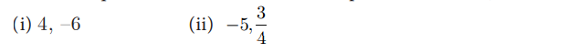

