## 5.5 Straight Line

Any first degree equation in two variables 
x
 and 
y
 of the form:


ax + by + c = 0 \quad \text{...(1)}


where 
a, b, c
 are real numbers and at least one of 
a, b
 is non-zero is called **"Straight line"** in XY plane.
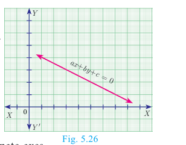

### 5.5.1 Equation of coordinate axes

The X-axis and Y-axis together are called **coordinate axes**.

The x-coordinate of every point on 
OY
 (Y-axis) is 
0
. Therefore equation of 
OY
 (Y-axis) is 
x = 0
.
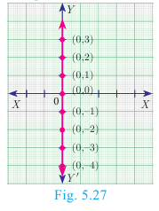

The y-coordinate of every point on 
OX
 (X-axis) is 
0
. Therefore the equation of 
OX
 (X-axis) is 
y = 0
.
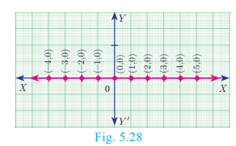

### 5.5.2 Equation of a straight line parallel to X axis

Let 
AB
 be a straight line parallel to X-axis, which is at a distance '
b
'. Then y-coordinate of every point on '
AB
' is '
b
'.

Therefore, the equation of 
AB
 is 
y = b
.

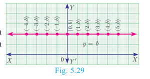

> **Note:**
> - If 
b > 0
, then the line 
y = b
 lies above the X-axis
> - If 
b < 0
, then the line 
y = b
 lies below the X-axis
> - If 
b = 0
, then the line 
y = b
 is the X-axis itself.

### 5.5.3 Equation of a Straight line parallel to the Y axis

Let 
CD
 be a straight line parallel to Y-axis, which is at a distance '
c
'. Then x-coordinate of every point on 
CD
 is '
c
'. The equation of 
CD
 is 
x = c
.

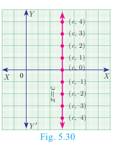

- If 
c > 0
, then the line 
x = c
 lies right to the side of the Y-axis
- If 
c < 0
, then the line 
x = c
 lies left to the side of the Y-axis
- If 
c = 0
, then the line 
x = c
 is the Y-axis itself.

### Example 5.17

Find the equation of a straight line passing through 
(5,7)
 and is (i) parallel to X-axis (ii) parallel to Y-axis.

**Solution:**

(i) The equation of any straight line parallel to X-axis is 
y = b
. Since it passes through 
(5,7)
, 
b = 7
. Therefore, the required equation of the line is 
y = 7
.

(ii) The equation of any straight line parallel to Y-axis is 
x = c
. Since it passes through 
(5,7)
, 
c = 5
. Therefore, the required equation of the line is 
x = 5
.

---

### 5.5.4 Slope-Intercept Form

Every straight line that is not vertical will cut the Y-axis at a single point. The y-coordinate of this point is called **y-intercept** of the line.

A line with slope 
m
 and y-intercept 
c
 can be expressed through the equation:


y = mx + c


We call this equation as the **slope-intercept form** of the equation of a line.

> **KNOW?**
> - If a line with slope 
m
, 
m \neq 0
 makes x-intercept 
d
, then the equation of the straight line is 
y = m(x-d)
.
> - 
y = mx
 represents equation of a straight line with slope 
m
 and passing through the origin.

### Example 5.18

Find the equation of a straight line whose
(i) Slope is 
5
 and y-intercept is 
-9

(ii) Inclination is 
45°
 and y-intercept is 
11


**Solution:**

(i) Given, Slope 
= 5
, y-intercept, 
c = -9


Therefore, equation of a straight line is 
y = mx + c



y = 5x - 9 \Rightarrow 5x - y - 9 = 0


(ii) Given, 
\theta = 45°
, y-intercept, 
c = 11


Slope 
m = \tan\theta = \tan 45° = 1


Therefore, equation of a straight line is of the form 
y = mx + c


Hence we get, 
y = x + 11 \Rightarrow x - y + 11 = 0


---

### Example 5.19

Calculate the slope and y-intercept of the straight line 
8x - 7y + 6 = 0


**Solution:** Equation of the given straight line is 
8x - 7y + 6 = 0



7y = 8x + 6 \text{ (bringing it to the form } y = mx + c)



y = \frac{8}{7}x + \frac{6}{7}


Comparing with 
y = mx + c
:
- Slope 
m = \frac{8}{7}

- y-intercept 
c = \frac{6}{7}


> For the point 
(x,y)
 in a xy-plane, the x-coordinate 
x
 is called **"Abscissae"** and the y-coordinate 
y
 is called **"Ordinate"**.

---

### Example 5.20

The graph relates temperatures 
y
 (in Fahrenheit degree) to temperatures 
x
 (in Celsius degree)
(a) Find the slope and y-intercept
(b) Write an equation of the line
(c) What is the mean temperature of the earth in Fahrenheit degree if its mean temperature is 
25°C
?

**Solution:**

(a) From the figure, slope 
= \frac{\text{change in y coordinate}}{\text{change in x coordinate}} = \frac{68-32}{20-0} = \frac{36}{20} = \frac{9}{5}


The line crosses the Y-axis at 
(0,32)


So the slope is 
\frac{9}{5}
 and y-intercept is 
32
.

(b) Use the slope and y-intercept to write an equation:

The equation is 
y = \frac{9}{5}x + 32


(c) In Celsius, the mean temperature of the earth is 
25°
. To find the mean temperature in Fahrenheit, we find the value of 
y
 when 
x = 25
:


y = \frac{9}{5}(25) + 32 = 45 + 32 = 77

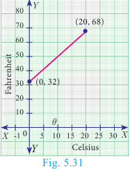

> **Note:** The formula for converting Celsius to Fahrenheit is given by 
F = \frac{9}{5}C + 32
, which is the linear equation representing a straight line derived in the example.

Therefore, the mean temperature of the earth is **
77°F
**.

---

### 5.5.5 Point-Slope form
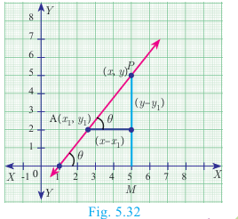

Here we will find the equation of a straight line passing through a given point 
A(x_1, y_1)
 and having the slope 
m
.

Let 
P(x,y)
 be any point other than 
A
 on the given line. Slope of the line joining 
A(x_1, y_1)
 and 
P(x,y)
 is given by:


m = \tan\theta = \frac{y - y_1}{x - x_1}


Therefore, the equation of the required line is:


y - y_1 = m(x - x_1) \quad \text{(Point-slope form)}


### Example 5.21

Find the equation of a line passing through the point 
(3,-4)
 and having slope 
\frac{-5}{7}
.

**Solution:** Given, 
(x_1, y_1) = (3,-4)
 and 
m = \frac{-5}{7}


The equation of the point-slope form of the straight line is 
y - y_1 = m(x - x_1)



y + 4 = -\frac{5}{7}(x - 3)



7y + 28 = -5x + 15



5x + 7y + 13 = 0


---

### Thinking Corner

Is it possible to express the equation of a straight line in slope-intercept form, when it is parallel to Y-axis?

---

### Example 5.22

Find the equation of a line passing through the point 
A(1,4)
 and perpendicular to the line joining points 
(2,5)
 and 
(4,7)
.

**Solution:** Let the given points be 
A(1,4)
, 
B(2,5)
 and 
C(4,7)
.

Slope of line 
BC = \frac{7-5}{4-2} = \frac{2}{2} = 1


Let 
m
 be the slope of the required line.

Since the required line is perpendicular to 
BC
:


m \times 1 = -1 \Rightarrow m = -1


The required line also passes through the point 
A(1,4)
. The equation of the required straight line is 
y - y_1 = m(x - x_1)
:


y - 4 = -1(x - 1)



y - 4 = -x + 1



x + y - 5 = 0

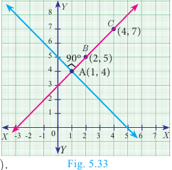

---

### 5.5.6 Two Point form

Let 
A(x_1, y_1)
 and 
B(x_2, y_2)
 be two given distinct points. Slope of the straight line passing through these points is given by 
m = \frac{y_2 - y_1}{x_2 - x_1}
, 
(x_1 \neq x_2)
.

From the equation of the straight line in point-slope form, we get:


y - y_1 = \frac{y_2 - y_1}{x_2 - x_1}(x - x_1)


Hence,


\frac{y - y_1}{y_2 - y_1} = \frac{x - x_1}{x_2 - x_1}


is the equation of the line in **two-point form**.

### Example 5.23

Find the equation of a straight line passing through 
(5,-3)
 and 
(7,-4)
.

**Solution:** The equation of a straight line passing through the two points 
(x_1, y_1)
 and 
(x_2, y_2)
 is:


\frac{y - y_1}{y_2 - y_1} = \frac{x - x_1}{x_2 - x_1}


Substituting the points we get:


\frac{y + 3}{-4 + 3} = \frac{x - 5}{7 - 5}



\frac{y + 3}{-1} = \frac{x - 5}{2}



2(y + 3) = -(x - 5)



2y + 6 = -x + 5



x + 2y + 1 = 0


> The great mathematical physicists like **Galileo** and **Newton** used coordinate geometry to characterize the motions of objects in plane and space.

---

### Example 5.24

Two buildings of different heights are located at opposite sides of each other. If a heavy rod is attached joining the terrace of the buildings from 
(6,10)
 to 
(14,12)
, find the equation of the rod joining the buildings?
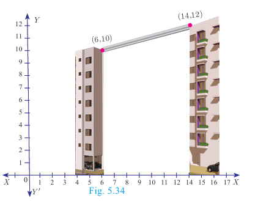

**Solution:** Let 
A(6,10)
, 
B(14,12)
 be the points denoting the terrace of the buildings.

The equation of the rod is the equation of the straight line passing through 
A(6,10)
 and 
B(14,12)
:


\frac{y - 10}{12 - 10} = \frac{x - 6}{14 - 6}



\frac{y - 10}{2} = \frac{x - 6}{8}



8(y - 10) = 2(x - 6)



8y - 80 = 2x - 12



2x - 8y + 68 = 0



x - 4y + 34 = 0


Hence, equation of the rod is 
x - 4y + 34 = 0
.

---

### 5.5.7 Intercept Form

We will find the equation of a line whose intercepts are 
a
 and 
b
 on the coordinate axes respectively.
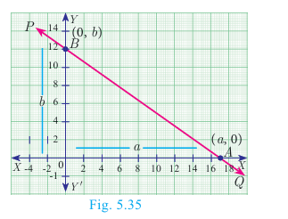

Let 
PQ
 be a line meeting X-axis at 
A
 and Y-axis at 
B
. Let 
OA = a
, 
OB = b
. Then the coordinates of 
A
 and 
B
 are 
(a, 0)
 and 
(0, b)
 respectively. Therefore, the equation of the line joining 
A
 and 
B
 is:


\frac{y - 0}{b - 0} = \frac{x - a}{0 - a}



\frac{y}{b} = \frac{x - a}{-a}



\frac{y}{b} = -\frac{x}{a} + 1


Hence,


\frac{x}{a} + \frac{y}{b} = 1 \quad \text{(Intercept form of a line)}


---

## Progress Check

Fill the details in respective boxes

| Form | When to use? | Name |
|------|-------------|------|
| 
y = mx + c| Slope = m, Intercept = c are given | |
| 
\frac{y - y_1}{y_2 - y_1} = \frac{x - x_1}{x_2 - x_1}
 | | |
| | The intercepts are given | Intercept form |

---

### Example 5.25

Find the equation of a line which passes through 
(5,7)
 and makes intercepts on the axes equal in magnitude but opposite in sign.

**Solution:** Let the x-intercept be '
a
' and y-intercept be '
-a
'.

The equation of the line in intercept form is 
\frac{x}{a} + \frac{y}{b} = 1
:


\frac{x}{a} + \frac{y}{-a} = 1 \quad (\text{Here } b = -a)



\therefore x - y = a \quad \text{...(1)}


Since (1) passes through 
(5,7)
:


5 - 7 = a Rightarrow a = -2


Thus the required equation of the straight line is 
x - y = -2 or  x - y + 2 = 0
.

---

### Example 5.26

Find the intercepts made by the line 
4x - 9y + 36 = 0
 on the coordinate axes.

**Solution:** Equation of the given line is 
4x - 9y + 36 = 0


We write it as 
4x - 9y = -36
 (bringing it to the normal form)

Dividing by 
-36
 we get:


\frac{x}{-9} + \frac{y}{4} = 1


Comparing with intercept form, we get:
- x-intercept 
a = -9

- y-intercept 
b = 4


---

### Example 5.27

A mobile phone is put to use when the battery power is 100%. The percent of battery power 
y
 (in decimal) remaining after using the mobile phone for 
x
 hours is assumed as 
y = -0.25x + 1
.

(i) Find the number of hours elapsed if the battery power is 40%.
(ii) How much time does it take so that the battery has no power?

**Solution:**
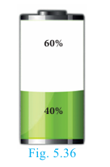

(i) To find the time when the battery power is 40%, we have to take 
y = 0.40
:


0.40 = -0.25x + 1



0.25x = 0.60



x = \frac{0.60}{0.25} = 2.4 \text{ hours}


(ii) If the battery power is 0 then 
y = 0
:


0 = -0.25x + 1 \text{ gives } 0.25x = 1 \text{ hence } x = 4 \text{ hours}


Thus, after 4 hours, the battery of the mobile phone will have no power.

---

### Example 5.28

A line makes positive intercepts on coordinate axes whose sum is 7 and it passes through 
(-3,8)
. Find its equation.

**Solution:** If 
a
 and 
b
 are the intercepts then 
a + b = 7
 or 
b = 7 - a
.

By intercept form: 
\frac{x}{a} + \frac{y}{b} = 1


We have:


\frac{x}{a} + \frac{y}{7-a} = 1


As this line passes through the point 
(-3,8)
, we have:


\frac{-3}{a} + \frac{8}{7-a} = 1



-3(7-a) + 8a = a(7-a)



-21 + 3a + 8a = 7a - a^2



a^2 + 4a - 21 = 0



(a-3)(a+7) = 0



a = 3 \text{ or } a = -7


Since 
a
 is positive, we have 
a = 3
 and 
b = 7 - a = 7 - 3 = 4
.

Hence 
\frac{x}{3} + \frac{y}{4} = 1


Therefore, 
4x + 3y - 12 = 0
 is the required equation.

---

### Example 5.29

A circular garden is bounded by East Avenue and Cross Road. Cross Road intersects North Street at 
D
 and East Avenue at 
E
. 
AD
 is tangential to the circular garden at 
A(3,10)
.

(a) Find the equation of (i) East Avenue, (ii) North Street, (iii) Cross Road
(b) Where does the Cross Road intersect? (i) North Street, (ii) East Avenue
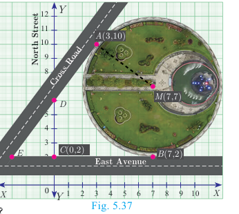

**Solution:**

(a) (i) **East Avenue** is the straight line joining 
C(0,2)
 and 
B(7,2)
. Thus the equation of East Avenue is obtained by using two-point form:


\frac{y - 2}{2 - 2} = \frac{x - 0}{7 - 0}



y = 2


(ii) Since the point 
D
 lies vertically above 
C(0,2)
. The x-coordinate of 
D
 is 
0
. Since any point on North Street has x-coordinate value 
0
. The equation of North Street is 
x = 0
.

(iii) **To find equation of Cross Road:**

Center of circular garden 
M
 is at 
(7,7)
, 
A
 is 
(3,10)


We first find slope of 
MA
, which we call 
m_1
:


m_1 = \frac{10-7}{3-7} = \frac{3}{-4} = -\frac{3}{4}


Since the Cross Road is perpendicular to 
MA
, if 
m_2
 is the slope of the Cross Road then:


m_1 \cdot m_2 = -1 \Rightarrow -\frac{3}{4} \cdot m_2 = -1 \Rightarrow m_2 = \frac{4}{3}


Now, the cross road has slope 
\frac{4}{3}
 and it passes through the point 
A(3,10)
.

The equation of the Cross Road is:


y - 10 = \frac{4}{3}(x - 3)



3(y - 10) = 4(x - 3)



3y - 30 = 4x - 12



4x - 3y + 18 = 0


(b) (i) If 
D
 is 
(0, k)
 then 
D
 is a point on the Cross Road.

Therefore, substituting 
x = 0
, 
y = k
 in the equation of Cross Road:


0 - 3k + 18 = 0 \Rightarrow k = 6


Therefore, 
D
 is 
(0, 6)
.

(ii) To find 
E
, let 
E
 be 
(q, 2)
. Put 
y = 2
 in the equation of the Cross Road:


4q - 6 + 18 = 0 \Rightarrow 4q = -12 \Rightarrow q = -3


Therefore, the point 
E
 is 
(-3, 2)
.

Thus the Cross Road meets the North Street at 
D(0,6)
 and East Avenue at 
E(-3,2)
.

---

## Progress Check

Fill the details in respective boxes

| S.No. | Equation | Slope | x-intercept | y-intercept |
|-------|----------|-------|-------------|-------------|
| 1 | 
3x - 4y + 2 = 0
 | | | |
| 2 | 
y = 14x
 | | | 0  |
| 3 | | | 2 | 
-3
 |

---

## Activity 4

If line 
l_1
 is perpendicular to line 
l_2
 and line 
l_3
 has slope 3 then:
(i) Find the equation of line 
l_1

(ii) Find the equation of line 
l_2

(iii) Find the equation of line 
l_3

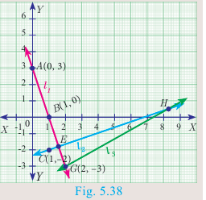

---

## Activity 5

A ladder is placed against a vertical wall with its foot touching the horizontal floor. Find the equation of the ladder under the following conditions.

| No. | Condition | Picture | Equation of the ladder |
|-----|-----------|---------|------------------------|
| (i) | The ladder is inclined at  60° to the floor and it touches the wall at (0,8) |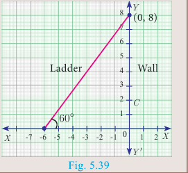 | |
| (ii) | The foot and top of the ladder are at the points 
(2,4) and (5,1) | | |

---

## Exercise 5.3

1. Find the equation of a straight line passing through the mid-point of a line segment joining the points 
(1,-5)
, 
(4,2)
 and parallel to (i) X-axis (ii) Y-axis.

2. The equation of a straight line is 
2(x-y) + 5 = 0
. Find its slope, inclination and intercept on the Y-axis.

3. Find the equation of a line whose inclination is 
30°
 and making an intercept 
-3
 on Y-axis.

4. Find the slope and y-intercept of 
\sqrt{3}x + (1-\sqrt{3})y = 3
.

5. Find the value of '
a
', if the line through 
(-2,3)
 and 
(8,5)
 is perpendicular to 
y = ax + 2
.

6. The hill in the form of a right triangle has its foot at 
(19,3)
. The inclination of the hill to the ground is 
45°
. Find the equation of the hill joining the foot and top.

7. Find the equation of a line through the given pair of points:
   - (i) 
\left(2, \frac{2}{3}\right)
 and 
\left(-\frac{1}{2}, -2\right)

   - (ii) 
(2,3)
 and 
(-7,-1)


8. A cat is located at the point 
(-6,4)
 in xy-plane. A bottle of milk is kept at 
(5,11)
. The cat wishes to consume the milk travelling through shortest possible distance. Find the equation of the path it needs to take its milk.

9. If the vertices of a 
\triangle ABC
 are 
A(6,2)
, 
B(-5,1)
 and 
C(1,9)
; through the vertex 
A
:
   - (i) Find the equation of median
   - (ii) Find the equation of altitude

10. Find the equation of a straight line which has slope 
\frac{-5}{4}
 and passing through the point 
(-1,2)
.

11. You are downloading a song. The percent 
y
 (in decimal form) of mega bytes remaining to get downloaded in 
x
 seconds is given by 
y = -0.1x + 1
.
    - (i) Find the total MB of the song.
    - (ii) After how many seconds will 75% of the song gets downloaded?
    - (iii) After how many seconds the song will be downloaded completely?

12. Find the equation of a line whose intercepts on the x and y axes are given below.
    - (i) 
4, -6

    - (ii) 
-5, \frac{3}{4}


13. Find the intercepts made by the following lines on the coordinate axes.
    - (i) 
3x - 2y - 6 = 0

    - (ii) 
4x + 3y + 12 = 0


14. Find the equation of a straight line:
    - (i) Passing through 
(1,-4)
 and has intercepts which are in the ratio 
2:5

    - (ii) Passing through 
(-8,4)
 and making equal intercepts on the coordinate axes

---