# Chapter 4

## GEOMETRY

"The knowledge of which geometry aims is the knowledge of eternal" - Plato

Omar Khayyam was a Persian mathematician, astronomer and poet. As a poet, his classic work Rubaiyat attained world fame.

Khayyam's work is an effort to unify Algebra and Geometry. Khayyam's work can be considered the first systematic study and the first exact method of solving cubic equations. He accomplished this task using Geometry. His efforts in trying to generalize the principles of Geometry provided by Euclid, inspired many European mathematicians to the eventual discovery of non-Euclidean Geometry. Khayyam was a perfect example of being a notable scientist and a great poet, an achievement which many do not possess.

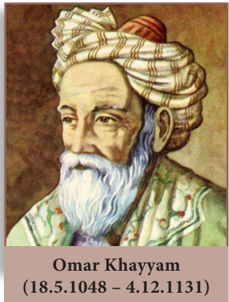

Omar Khayyam (18.5.1048 - 4.12.1131)

---

## Learning Outcomes

To recall congruent triangles and understand the definition of similar triangles. To understand the properties and construction of similar triangles and apply them to solve problems. To prove basic proportionality theorem, angle bisector theorem and study their applications and study the construction of triangles under given conditions. To prove Pythagoras theorem and study its applications. To understand the concept of tangent to a circle and study construction of tangent to circle. To understand and apply concurrency theorems.

---

### 4.1 Introduction

The study of Geometry is concerned with knowing properties of various shapes and structures. Arithmetic and Geometry were considered to be the two oldest branches of mathematics. Greeks held Geometry in high esteem and used its properties to discuss various scientific principles which otherwise would have been impossible. Eratosthenes used the similarity of circle to determine the circumference of the Earth, distances of the moon and the sun from the Earth, to a remarkable accuracy. Apart from these achievements, similarity is used to find width of rivers, height of trees and much more.

In this chapter, we will be discussing the concepts mainly as continuation of previous classes and discuss most important concepts like Similar Triangles, Basic Proportionality Theorem, Angle Bisector Theorem, the most prominent and widely acclaimed Pythagoras Theorem and much more. Ceva's Theorem and Menelaus Theorem is introduced for the first time. These two new theorems generalize all concurrent theorems that we know. Overall, the study of Geometry will create interest in the deep understanding of objects around us.

Geometry plays vital role in the field of Science, Engineering and Architecture. We see many Geometrical patterns in nature. We are familiar with triangles and many of their properties from earlier classes.

### 4.2 Similarity

Two figures are said to be similar if every aspect of one figure is proportional to other figure. For example:

The above houses look the same but different in size. Both the mobile phones are the same but they vary in their sizes. Therefore, mathematically we say that two objects are similar if they are of same shape but not necessarily they need to have the same size. The ratio of the corresponding measurements of two similar objects must be proportional.

Here is a box of geometrical shapes. Collect the similar objects and list out.

In this chapter, we will be discussing specifically the use of similar triangles which is of utmost importance where if it is beyond our reach to physically measure the distance and height with simple measuring instruments. The concept of similarity is widely used in the fields of engineering, architecture and construction.

Here are few applications of similarity

- (i) By analyzing the shadows that make triangles, we can determine the actual height of the objects.

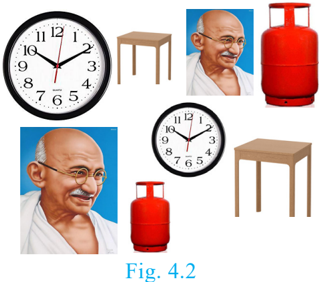

- (ii) Used in aerial photography to determine the distance from sky to a particular location on the ground.
- (iii) Used in Architecture to aid in design of their work.

#### 4.2.1 Similar triangles

In class IX, we have studied congruent triangles. We can say that two geometrical figures are congruent, if they have same size and shape. But, here we shall study about geometrical figures which have same shape but proportional sizes. These figures are called "similar".

**Congruency and similarity of triangles**

equal. While in similar triangles, the corresponding sides are proportional.

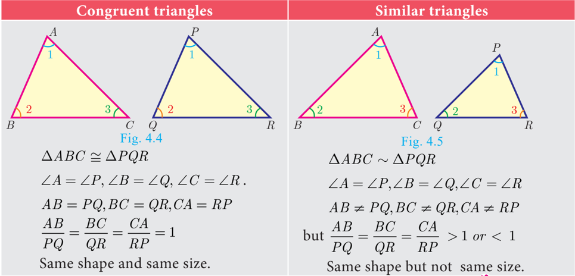

**Thinking Corner**

- Are square and a rhombus similar or congruent. Discuss.
- Are a rectangle and a parallelogram similar. Discuss.

#### 4.2.2 Criteria of Similarity

The following criteria are sufficient to prove that two triangles are similar.

**AA Criterion of similarity**

If two angles of one triangle are respectively equal to two angles of another triangle, then the two triangles are similar, because the third angle in both triangles must be equal. Therefore, AA similarity criterion is same as the AAA similarity criterion.

**SAS Criterion of similarity**

If one angle of a triangle is equal to one angle of another triangle and if the sides including them are proportional then the two triangles are similar.

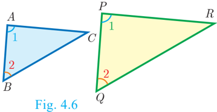

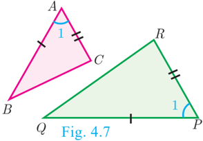

**SSS Criterion of similarity**

If three sides of a triangle are proportional to the three corresponding sides of another triangle, then the two triangles are similar.

**Thinking Corner**

Are any two right angled triangles similar? If so why?

**Some useful results on similar triangles**

- A perpendicular line drawn from the vertex of a right angled triangle divides the triangle into two triangles similar to each other and also to original triangle.

- If two triangles are similar, then the ratio of the corresponding sides are equal to the ratio of their corresponding altitudes.

- If two triangles are similar, then the ratio of the corresponding sides are equal to the ratio of the corresponding perimeters.

- The ratio of the area of two similar triangles are equal to the ratio of the squares of their corresponding sides.

- If two triangles have common vertex and their bases are on the same straight line, the ratio between their areas is equal to the ratio between the length of their bases.

10th 164 Standard Mathematics

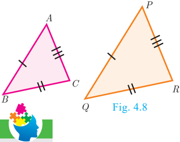

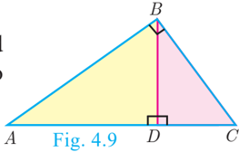

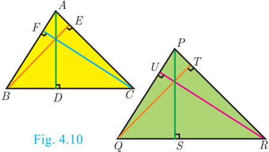

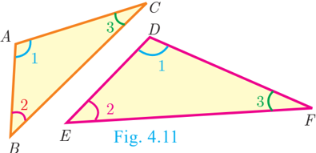

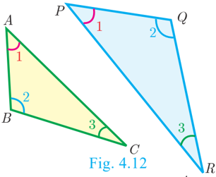

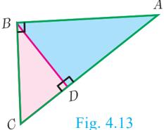

**Definition 1**

Two triangles are said to be similar if their corresponding sides are proportional. Definition 2

The triangles are equiangular if the corresponding angles are equal.

Two triangles, DXYZ and DLMN are similar because the corresponding angles are equal. X L

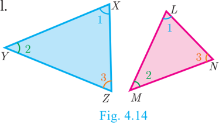

- (i) A pair of equiangular triangles are similar.
- (ii) If two triangles are similar, then they are equiangular.

- (i) ∠= XL∠∠, ∠,, YM ∠ YM =∠ ∠= ZN∠ (by angles) (ii)

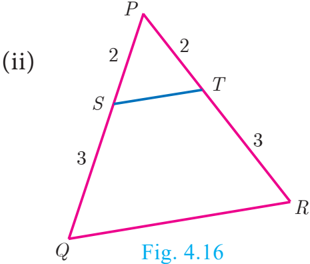

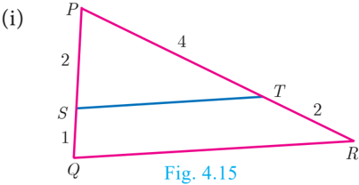

**Solution**

- (i) In DPST and DPQR ,
- (ii) In DPST and DPQR ,

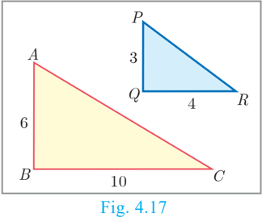

Solution In DABC and DPQR ,

The corresponding sides are not proportional. Therefore DABC is not similar to DPQR .

If we change exactly one of the four given lengths, then we can make these triangles similar.

Example 4.3 Observe Fig.4.18 and find ÐP .

In DBAC and DPRQ , AB RQ == 3 6 1 2 ;

∠=PC∠ (since the corresponding parts of similar triangle) ∠=PC∠= 180 ° −∠() AB +∠ =° 180 −° () 90 +° 60 ÐP =° 180 −° 150 = 30 °

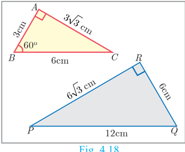

Example 4.4 A boy of height 90cm is walking away from the base of a lamp post at a speed of 1.2m/sec. If the lamppost is 3.6m above the ground, find the length of his shadow cast after 4 seconds. A

Given, speed = 1.2 m/s,

time = 4 seconds

distance = speed ´ time

Let x be the length of the shadow after 4 seconds

The length of his shadow DE =1.6 m

In DCAB and DCED , ÐC is common, ∠=AC∠ E CED

10th 166 Standard Mathematics Example 4.6 In Fig.4.21, QA and PB are perpendiculars to AB. If AO = 10 cm, BO=6 cm and PB = 9 cm. Find AQ .

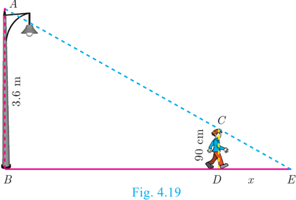

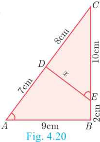

In DAOQ and DBOP , ∠= OAQO∠= BP 90 °

Example 4.7 The perimeters of two similar triangles ABC and PQR are respectively 36 cm and 24 cm. If PQ =10 cm, find AB .

The ratio of the corresponding sides of similar triangles is same as the ratio of their perimeters.

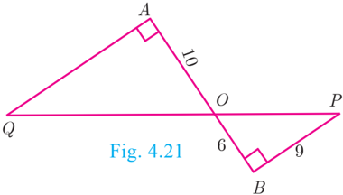

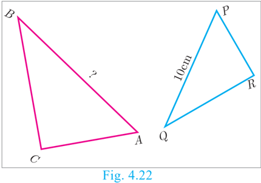

Example 4.8 If DABC is similar to DDEF such that BC=3 cm, EF=4 cm and area of DABC = 54 cm 2 . Find the area of DDEF .

Since the ratio of area of two similar triangles is equal to the ratio of the squares of any two corresponding sides, we have

Let AB and CD be two poles of height ' a ' metres and 'b' metres respectively such that the poles are 'p' metres apart. That is AC=p

metres. Suppose the lines AD and BC meet at O, such that OL=h metres

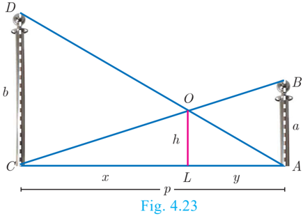

**Progress Check**

- All circles are ________ (congruent/ similar).

- All squares are ________ (similar/ congruent).
- Two triangles are similar, if their corresponding angles are _______ and their corresponding sides are

. --- --- --- --- --- --- --- --- --- --- --- --- --- --- --- --- --- --- --- --- --- --- --- --- --- --- --- --- --- --- --- --- --- --- --- --- --- --- --- --- --- --- --- --- --- --- --- --- --- --- --- --- --- --- --- --- --- --- --- --- --- --- --- --- --- --- --- --- --- --- --- --- --- --- --- --- --- --- --- --- --- --- --- --- --- --- --- --- --- --- --- --- --- --- --- --- --- --- --- --- --- --- --- --- --- --- --- --- --- --- --- --- --- --- --- --- --- --- --- --- --- --- --- --- --- --- --- --- --- --- --- --- --- --- --- --- --- --- --- --- --- --- --- --- --- --- --- --- --- --- --- --- --- --- --- --- --- --- --- --- --- --- --- --- --- --- --- --- ---

- (a) All similar triangles are congruent – True/False (b) All congruent triangles are similar – True/False.

In DALO and DACD , we have

- Give two different examples of pair of non-similar figures?

Hence, the height of the intersection of the lines joining the top of each pole to the foot of the opposite pole is ab metres.

ab +

**Activity 1**

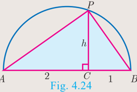

Let us try to construct a line segment of length 2 .

For this, we consider the following steps.

Step1: Take a line segment of length 3 units. Call it as AB.

Step2: Take a point C on AB such that AC=2 , CB=1. A

Step3: Draw a semi-circle with AB as diameter as shown in the diagram

Step4: Take a point 'P' on the semi-circle such that CP is perpendicular to AB .

Step5: Join P to A and B. We will get two right triangles ACP and BCP .

Step6: Verify that the triangles ACP and BCP are similar.

Step7: Let CP =h be the common altitude. Using similarity, find h .

Step8: What do you get upon finding h?

Repeating the same process, can you construct a line segment of lengths 35 , 5 ,, 8 .

#### 4.2.3 Construction of similar triangles

So far we have discussed the theoretical approach of similar triangles and their properties. Now we shall discuss the geometrical construction of a triangle similar to a given triangle whose sides are in a given ratio with the corresponding sides of the given triangle.

This construction includes two different cases. In one, the triangle to be constructed is smaller and in the other it is larger than the given triangle. So, we use the following term called "scale factor" which measures the ratio of the sides of the triangle to be constructed with the corresponding sides of the given triangle. Let us take the following examples involving the two cases:

Example 4.10 Construct a triangle similar to a given triangle PQR with its sides equal to

3 5 of the corresponding sides of the triangle PQR (scale factor 3 5 < 1)

Given a triangle PQR we are required to construct another triangle whose sides are 3 5 of the corresponding sides of the triangle PQR .

**Steps of construction**

- Construct a DPQR with any measurement.
- Draw a ray QX making an acute angle with QR on the side opposite to vertex P .
- Draw line through R ¢ parallel to the line RP to intersect QP at P ¢ .

Then, ∆PQ′ Q′′ R ′ R is the required triangle each of whose sides is threefifths of the corresponding sides of DPQR .

Example 4.11 Construct a triangle similar to a given triangle PQR with its sides equal to 7 4 of the corresponding sides of the triangle PQR (scale factor 7 4 > 1)

Given a triangle PQR, we are required to construct another triangle whose sides are 7 4 of the corresponding sides of the triangle PQR .

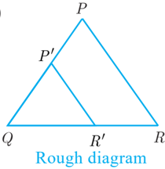

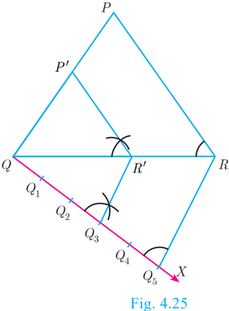

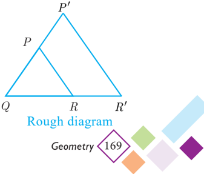

- Construct a DPQR with any measurement.
- Draw a ray QX making an acute angle with QR on the side opposite to vertex P .

- Draw a line through R ¢ parallel to RP intersecting the extended line segment QP at P ¢
- Then ∆PQ′ Q′′ R ′ R is the required triangle each of whose sides is seven-fourths of the corresponding sides of DPQR .

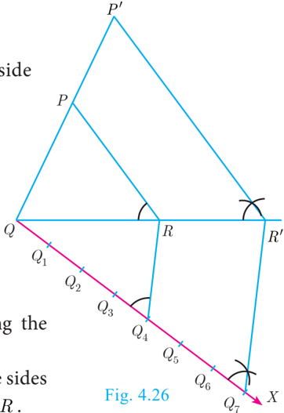

- In the given triangles, check which triangles are similar? Also find the value of x.

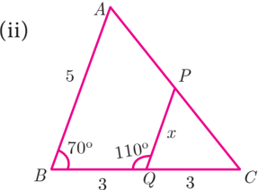

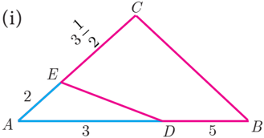

- A girl looks the reflection of the top of the lamp post on the mirror which is 6.6 m away from the foot of the lamppost. The girl whose height is 1.25 m is standing 2.5 m away from the mirror. Assuming the mirror is placed on the ground facing the sky and the girl, mirror and the lamppost are in a same line, find the height of the lamp post.
- A vertical stick of length 6 m casts a shadow 400 cm long on the ground and at the same time a tower casts a shadow 28 m long. Using similarity, find the height of the tower.
- Two triangles QPR and QSR, right angled at P and S respectively are drawn on the same base QR and on the same side of QR. If PR and SQ intersect at T, prove that PT × TR = ST × TQ .

10th 170 Standard Mathematics

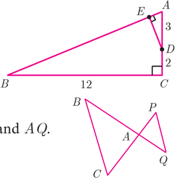

- Two vertical poles of heights 6 m and 3 m are erected above a horizontal ground AC. Find the value of y .

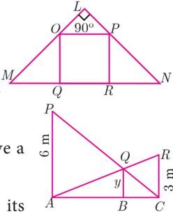

- Construct a triangle similar to a given triangle PQR with its sides equal to 2 3 of the corresponding sides of the triangle PQR (scale factor 2 3 < 1). A B C
- Construct a triangle similar to a given triangle LMN with its sides equal to 4 5 of the corresponding sides of the triangle LMN (scale factor 4 5 < 1).
- Construct a triangle similar to a given triangle ABC with its sides equal to 6 5 of the corresponding sides of the triangle ABC (scale factor 6 5 > 1).
- Construct a triangle similar to a given triangle PQR with its sides equal to 7 3 of the corresponding sides of the triangle PQR (scale factor 7 3 > 1).

### 4.3 Thales Theorem and Angle Bisector Theorem

#### 4.3.1 Introduction

Thales, (640 - 540 BC (BCE)) the most famous Greek mathematician and philosopher lived around seventh century BC (BCE). He possessed knowledge to the extent that he became the first of seven sages of Greece. Thales was the first man to announce that any idea that emerged should be tested scientifically and only then it can be accepted. In this aspect, he did great investigations in mathematics and astronomy and discovered many concepts. He was credited for providing first proof in

mathematics, which today is called by the name "Basic Proportionality Theorem". It is also called "Thales Theorem" named after its discoverer.

The discovery of the Thales theorem itself is a very interesting story. When Thales travelled to Egypt, he was challenged by Egyptians to determine the height of one of several magnificent pyramids that they had constructed. Thales accepted the challenge and used similarity of triangles to determine the

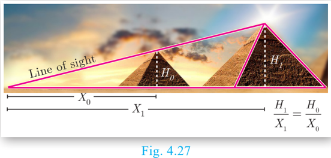

same successfully, another triumphant application of Geometry. Since X0 X0, X1 X1 and H0 H0 are known, we can determine the height H 1 of the pyramid.

To understand the basic proportionality theorem or Thales theorem, let us do the following activity.

**Activity 2**

Take any ruled paper and draw a triangle ABC with its base on one of the lines. Several parallel lines will cut the triangle ABC. C. A

Select any one line among them and name the points where it meets the sides AB and AC as P and Q .

PB , AQ and QC through a scale, verify whether the ratios are equal or not? Try for different parallel lines, say MN and RS. S.

*Fig. 4.28*

Check if they are equal? The conclusion will lead us to one of the most important theorem in Geometry, which we will discuss below.

**Theorem 1: Basic Proportionality Theorem (BPT) or Thales theorem Statement**

A straight line drawn parallel to a side of triangle intersecting the other two sides, divides the sides in the same ratio.

**Proof**

Given: In DABC , D is a point on AB and E is a point on AC. C.

To prove:

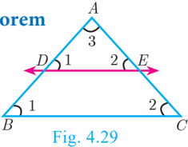

| No. | Statement | Reason | \n |
| --- | --- | --- | \n |
| 1. | ∠= ABCA∠= DE  ∠1 | Corresponding angles are equal because DE  BC | \n |
| 2. | ∠= ACBA∠= ED  ∠2 | Corresponding angles are equal because DE  BC | \n |
| 3. | ∠= DAEB∠= AC  ∠3 | Both triangles have a common angle | \n |
| 4. | DD ABCA   DE AB AD AC AE  = AD  DB AD AE  EC AE +  =  + 1+  DB AD  = 1+  EC AE DB AD EC AE  = AD DB AE EC  = | By AAA similarity Corresponding sides are proportional Split AB and AC using the points D and E . On simplification Cancelling 1 on both sides Taking reciprocals Hence proved |  |

10th 172 Standard Mathematics

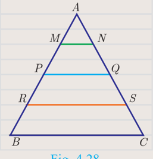

**Corollary**

If in DABC , a straight line DE parallel to BC, intersects AB at D and AC at E, then

**Proof**

- (ii) Add 1 to both the sides

Is the converse of Basic Proportionality Theorem also true? To examine let us do the following illustration.

**Illustration**

Similarly joining B 2 C2 C2, B 3 C3 C3 and B4 B4 C4 C4 you see that

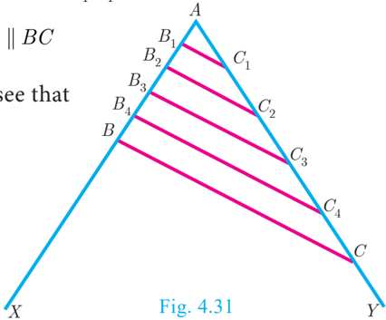

From this we observe that if a line divides two sides of a triangle in the same ratio, then the line is parallel to the third side.

Therefore, we obtain the following theorem called converse of the Thales theorem.

**Theorem 2: Converse of Basic Proportionality Theorem**

**Statement**

If a straight line divides any two sides of a triangle in the same ratio, then the line must be parallel to the third side.

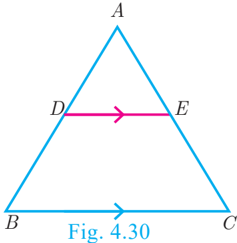

Given

To prove

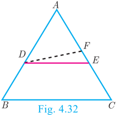

| No. | Statement | Reason | \n |
| --- | --- | --- | \n |
| 1. | AD DB AE EC  =   … (1) | Given | \n |
| 2. | DABCB, D ,  BDFFD BCE | Construction | \n |
| 3. | AD DB AF FC  =  …  (2) | Thales theorem | \n |
| 4. | AE EC AF FC  = AE EC AF FC AF
 +=11 + EC AF  FC +  =  + | From (1) and (2) | \n |
|  | AE  EC FC AC EC AC FC  =  EC = FC | Adding 1 to both sides | \n |
|  |  | Cancelling AC on both sides | \n |
|  | Therefore, E =  F | Our assumption that DE is not parallel to BC is wrong. | \n |
|  | Thus DE  BC | Hence proved |  |

**Theorem 3: Angle Bisector Theorem**

**Statement**

The internal bisector of an angle of a triangle divides the opposite side internally in the ratio of the corresponding sides containing the angle.

**Proof**

In D ABC, AD is the internal bisector

Given :

To prove :

:Draw a line through C parallel to AB . Extend AD to meet line through C at E

Construction AB AC BD CD =

10th 174 Standard Mathematics

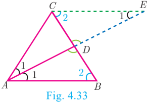

| No | Statement | Reason | \n |
| --- | --- | --- | \n |
| 1. | ∠= AECB∠= AE  ∠1 ∠ABD = ∠ECD = ∠2 | Two parallel lines cut by a transversal make  alternate angles equal. | \n |
| 2. | DACE is isosceles AC = CE … (1) | In ∆ACEC ,∠A , C ∠= AE  ∠CEA | \n |
| 3. | DD ABDE   CD AB CE BD CD  = | By AA Similarity | \n |
| 4. | AB AC BD CD  = | From (1) AC = CE  .  Hence proved. |  |

**Activity 3**

Take a chart and cut it like a triangle as shown in Fig.4.34(a).

- Step 2: Then fold it along the symmetric line AD. Then C and B will be one upon the other.
- Step 3: Similarly fold it along CE, then B and A will be one upon the other.
- Step 4: Similarly fold it along BF, then A and C will be one upon the other.

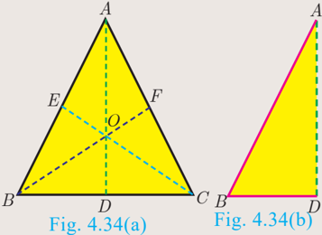

In the three cases, the internal bisector of an angle of a triangle divides the opposite side internally in the ratio of the corresponding sides containing the angle.

What do you conclude from this activity?

**Theorem 4: Converse of Angle Bisector Theorem Statement**

If a straight line through one vertex of a triangle divides the opposite side internally in the ratio of the other two sides, then the line bisects the angle internally at the vertex.

**Proof**

- :ABC is a triangle. AD divides BC in the ratio of the sides containing the angles ÐAto meet BC at D .

Given

AD bisects ÐA i.e. ∠=12 ∠

To prove :

Construction :

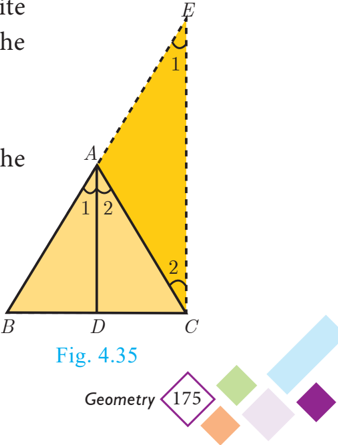

| No. | Statement | Reason | \n |
| --- | --- | --- | \n |
| 1. | Let ∠= BAD  ∠1 and ∠= DAC  ∠2 | Assumption | \n |
| 2. | ∠= BADA∠= EC  ∠1 | Since DA CE and AC is transversal ,  corresponding angles are equal | \n |
| 3. | ∠= DACA∠= CE  ∠2 | Since DA CE and AC is transversal, Alternate  angles are equal | \n |
| 4. | BA AE BD DC  =  …  (2) | In DBCE by Thales theorem | \n |
| 5. | AB AC BD DC  = | From (1) | \n |
| 6. | AB AC BA AE  = | From (1) and (2) | \n |
| 7. | AC = AE … (3) | Cancelling AB | \n |
| 8. | ∠=12 ∠ | DACE is isosceles by (3) | \n |
| 9. | AD bisects ÐA | Since, ∠=12 ∠= BADD ∠= ∠  AC . Hence proved |  |

By Thales theorem, we have AD DB AE EC =

When x = 4 , AD = 4 , DB =−x 22 = , AE =+x 26 = , EC =−x 13 = .

Therefore, AB = 6, AC = 9 .

We have AB = 56. . cm, AD = 14. . cm, AC = 72. . cm and AE = 18. . cm.

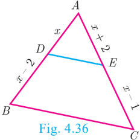

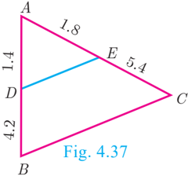

Therefore, by converse of Basic Proportionality Theorem, we have DE is parallel to BC. C. Hence proved.

we have

From (1) and (2) we get, BE EC BC CP = . Hence proved .

Example 4.15 In the Fig.4.39, AD is the bisector of ÐA. If BD = 4 cm, DC = 3 cm and AB = 6 cm, find AC.

In DABC , AD is the bisector of ÐA

By Angle Bisector Theorem

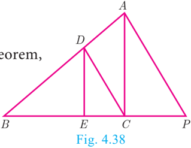

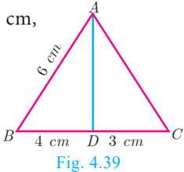

Example 4.16 In the Fig. 4.40, AD is the bisector of ÐBAC , if AB = 10 cm, AC =14 cm and BC = 6 cm. Find BD and DC. C. A

Let BD = x x cm, then DC = (6–x)cm

AD is the bisector of ÐA

By Angle Bisector Theorem

Therefore, BD = 2.5 cm, DC =−6 x =−62 . 5 = 3.5 cm

**Progress Check**

- A straight line drawn _______ to a side of a triangle divides the other two sides proportionally.
- Basic Proportionality Theorem is also known as _______.

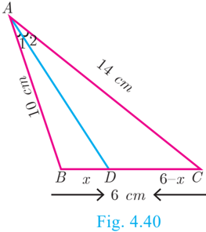

- Let DABC be equilateral. If D is a point on BC and AD is the internal bisector of ÐA . Using Angle Bisector Theorem, BD DC is _______.
- The _______ of an angle of a triangle divides the opposite side internally in the ratio of the corresponding sides containing the angle.
- If the median AD to the side BC of a DABC is also an angle bisector of ÐA then AB AC is _______.

#### 4.3.2 Construction of triangle

We have already learnt in previous class how to construct triangles when sides and angles are given.

In this section, let us construct a triangle when the following are given :

- (i) the base, vertical angle and the median on the base
- (ii) the base, vertical angle and the altitude on the base

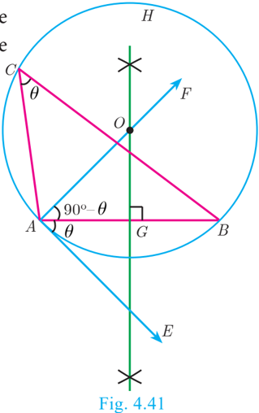

- (iii) the base, vertical angle and the point on the base where the bisector of the vertical angle meets the base. C

First, we consider the following construction,

of a segment of a circle on a given line segment containing an angle q

**Construction**

- Step 1: Draw a line segment AB
- Step 2: At A, take ∠= BAE q Draw AE .
- Step 3: Draw,AF ^ AE .
- Step 4: Draw the perpendicular bisector of AB meeting AF at O .
- Step 5: With O as centre and OA as radius draw a circle ABH. H.
- Step 6: Take any point C on the circle, By the alternate segments theorem, the major arc ACB is the required segment of the circle containing the angle q .

10th 178 Standard Mathematics

**Construction of a triangle when its base, the vertical angle and the median from the vertex of the base are given.**

Example 4.17 Construct a DPQR in which PQ = 8 cm, ∠= R 60 ° and the median RG from R to PQ is 5.8 cm. Find the length of the altitude from R to PQ . R

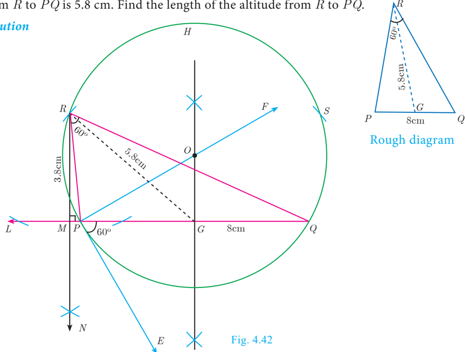

**Construction**

- Step 1: Draw a line segment PQ = 8cm.
- Step 4: Draw the perpendicular bisector to PQ, which intersects PF at O and PQ at G .
- Step 5: With O as centre and OP as radius draw a circle.
- Step 6: From G mark arcs of radius 5.8 cm on the circle. Mark them as R and S .

Solution

Step 8 : From R draw a line RN perpendicular to LQ . LQ meets RN at M

- Step 9: The length of the altitude is RM = 3.8 cm.

We can get another DPQS for the given measurements.

**Construct a triangle when its base, the vertical angle and the altitude from the vertex to the base are given. P**

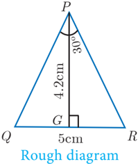

Example 4.18 Construct a triangle DPQR such that QR = 5 cm, ∠= P 30 ° and the altitude from P to QR is of length 4.2 cm.

Solution

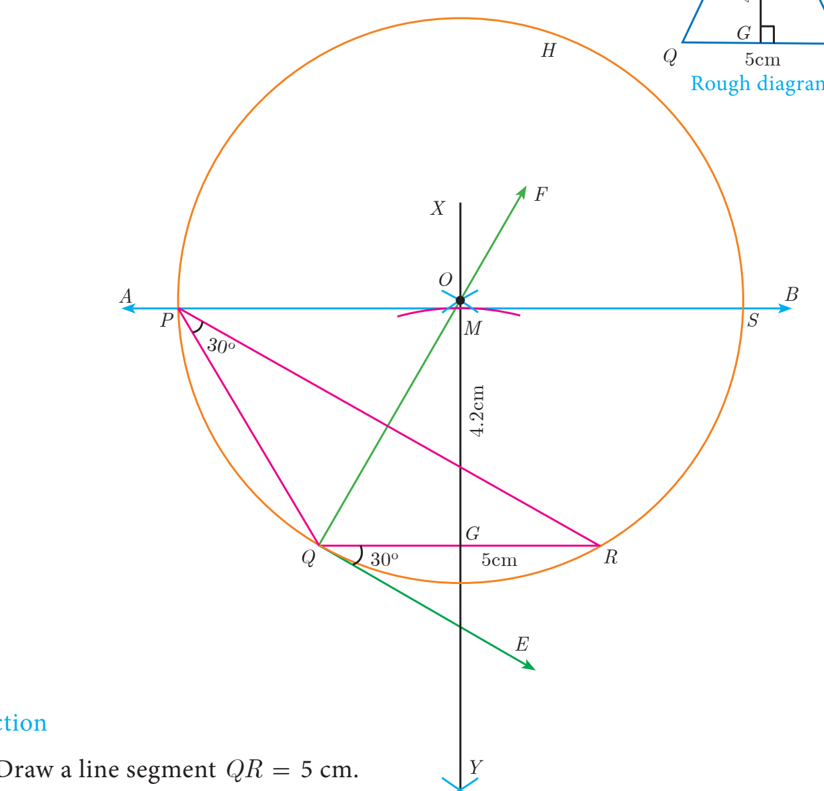

**Construction**

Fig. 4.43 Step 2 : At Q draw QE such that∠= RQE 30 ° .

Step 3 : At Q draw QF such that ∠= EQF 90 ° .

Step 4 : Draw the perpendicular bisector XY to QR which intersects QF at O and QR at G .

Step 5 : With O as centre and OQ as radius draw a circle.

Step 6: From G mark an arc in the line XY at M, such that GM = 42. . cm.

Step 7 : Draw AB through M which is parallel to QR .

Step 8 : AB meets the circle at P and S .

10th 180 Standard Mathematics DSQR is another required triangle for the given measurements.

**Construct of a triangle when its base, the vertical angle and the point on the base where the bisector of the vertical angle meets the base**

Solution

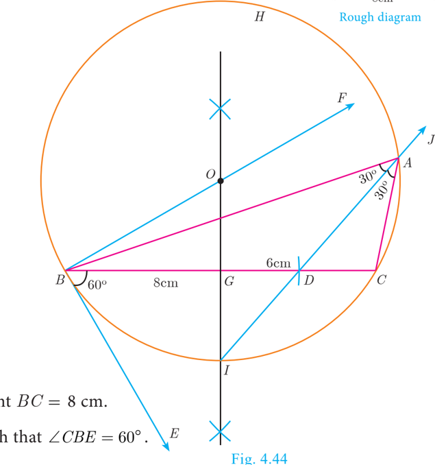

**Construction**

Draw a line segment BC = 8 cm.

At B, draw BE such that ∠= CBE 60 ° .

Step 2 :

Step 3 : At B, draw BF such that ∠= EBF 90 ° .

Draw the perpendicular bisector to BC, which intersects BF at O and BC at G .

Step 4 :

With O as centre and OB as radius draw a circle.

Step 5 :

From B, mark an arc of 6cm on BC at D

Step 6 :

Step 7 : The perpendicular bisector intersects the circle at I. Joint ID .

ID produced meets the circle at A. Now join AB and AC.

Step 8 :

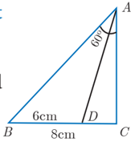

(ii) If AD =− 87 x , DB =− 53 x , AE =− 43 x and EC =− 3x − 31 x , find the value of x. x.

- ABCD is a trapezium in which AB || DC and P,Q are points on AD and BC respectively, such that PQ || DC if PD = 18 cm, BQ = 35 cm and QC = 15 cm, find AD .

- Rhombus PQRB is inscribed in DABC such that ÐB is one of its angle. P , Q and R lie on AB , AC and BC respectively. If AB=12 cm and BC = 6 cm, find the sides PQ , RB of the rhombus.
- Check whether AD is bisector of ÐAof DABC in each of the following
- (i) AB = 5 cm, AC = 10 cm, BD . 1 = . 15 cm and CD . 3 = . 35 cm.
- (ii) AB= 4 cm, AC = 6 cm, BD = 16. . cm and CD . 2 = . 24 cm.
- In figure ∠= QPR 90 ° , PS is its bisector. If ST ^ PR , prove that ST×(PQ+PR)=PQ×PR.

- Construct a DPQR in which QR = 5 cm, ∠= P 40 ° and the median PG from P to QR is 4.4 cm. Find the length of the altitude from P to QR .
- Construct a DPQR such that QR = 6.5 cm, ∠= P 60 ° and the altitude from P to QR is of length 4.5 cm.
- Construct a DABC such that AB = 5.5 cm, ∠= C 25 ° and the altitude from C to AB is 4 cm.

10th 182 Standard Mathematics

- Draw a triangle ABC of base BC = 5.6 cm, ∠= A 40 ° and the bisector of ÐA meets BC at D such that CD = 4 cm.
- Draw DPQR such that PQ = 6.8 cm, vertical angle is 50 ° and the bisector of the vertical angle meets the base at D where PD = 5.2 cm.

### 4.4 Pythagoras Theorem

Among all existing theorems in mathematics, Pythagoras theorem is considered to be the most important because it has maximum number of proofs. There are more than 350 ways of proving Pythagoras theorem through different methods. Each of these proofs was discovered by eminent mathematicians, scholars, engineers and math enthusiasts, including one by the 20 th American president James Garfield. The book titled "The Pythagorean Proposition" written by Elisha Scott Loomis, published by the National Council of Teaching of Mathematics (NCTM) in America contains 367 proofs of Pythagoras Theorem.

Now we are in a position to study this most famous and important theorem not only in Geometry but in whole of mathematics.

- Step 2: Take three more different colour chart papers and cut out three triangles such that the sides of triangle (ii) is three times of the triangle (i), the sides of triangle (iii) is four times of the triangle (i), the sides of triangle (iv) is five times of triangle (i).

*Step 3: Now keeping the common side length 12 place the triangle (ii) and (iii) over the triangle (iv) such that the sides of these two triangles [(ii) and (iii)] coincide with the triangle (iv).*

Observe the hypotenuse side and write down the equation. What do you conclude?

**Note**

- ¾ In a right angled triangle, the side opposite to 90° (the right angle) is called the hypotenuse.
- ¾ The other two sides are called legs of the right angled triangle.
- ¾ The hypotenuse will be the longest side of the triangle.

**Theorem 5 : Pythagoras Theorem**

**Statement**

In a right angled triangle, the square of the hypotenuse is equal to the sum of the squares of the other two sides.

**Proof**

, ∠= A 90 °

Given : In DABC

To prove : AB

Construction : Draw AD ^ BC

| No. | Statement | Reason | \n |
| --- | --- | --- | \n |
| 1. | Compare DABC and DDBA ÐB is common ∠= BACB∠= DA  90 ° Therefore, DD ABCD   BA AB BD BC AB  = AB  BC  BD  2  BC =×  …  (1) | Given ∠= BAC  90 °   and by  construction ∠= BDA  90 ° By AA similarity | \n |
| 2. | Compare DABC and DDAC ÐC is common ∠= BACA∠= DC  90  Therefore, DD ABCD   AC BC AC AC DC  = AC  BC  DC  2  BC =×  … (2) | Given ∠= BAC  90 °   and by  construction ∠= ADC  90 ° By AA similarity |  |

Hence the theorem is proved.

**Thinking Corner**

- Write down any five Pythagorean triplets?
- In a right angle triangle the sum of other two angles is _____.

**Converse of Pythagoras Theorem**

**Statement**

In India, Pythagoras Theorem is also referred as "Baudhayana Theorem".

If the square of the longest side of a triangle is equal to sums of squares of other two sides, then the triangle is a right angle triangle.

**Activity 5**

- (i) Take two consecutive odd numbers.
- (ii) Write the reciprocals of the above numbers and add them. You will get a number of the form p q .
- (iii) Add 2 to the denominator of p q to get q + 2 .
- (iv) Now consider the numbers pq, q,, q + 2 . What relation you get between these three numbers? Try for three pairs of consecutive odd numbers and conclude your answer.

**Thinking Corner**

Can all the three sides of a right angled triangle be odd numbers? Why?

Example 4.20 An insect 8 m away initially from the foot of a lamp post which is 6 m tall, crawls towards it moving through a distance. If its distance from the top of the lamp post is equal to the distance it has moved, how far is the insect away from the foot of the lamp post?

Distance between the insect and the foot of the lamp post BD = 8 m

The height of the lamp post, AB = 6 m

After moving a distance of x m, let the insect be at C

Therefore the insect is 1 . 75 m away from the foot of the lamp post.

Solution

Example 4.22 What length of ladder is needed to reach a height of 7 ft along the wall when the base of the ladder is 4 ft from the wall? Round off your answer to the next tenth place. A

Let x be the length of the ladder. BC=4 ft, AC=7 ft.

The number 65 is between 8 and 8.1 .

Therefore, the length of the ladder is approximately 8 . 1 ft.

Example 4.23 An Aeroplane after take off from an airport and flies due north at a speed of 1000 km/hr. At the same time, another aeroplane take off from the same airport and flies due west at a speed of 1200 km/hr. How far apart will be the two planes after 1½ hours?

Let the first aeroplane starts from O and goes upto A towards north, (Distance = Speed × time)

Let the second aeroplane starts from O at the same time and goes upto B towards west,

10th 186 Standard Mathematics

**Progress Check**

- _________ is the longest side of the right angled triangle.
- The first theorem in mathematics is _________.
- If the square of the longest side of a triangle is equal to sums of squares of other two sides, then the triangle is _________.
- State True or False. Justify them.
- (i) Pythagoras Theorem is applicable to all triangles.
- (ii) One side of a right angled triangle must always be a multiple of 4.

- A man goes 18 m due east and then 24 m due north. Find the distance of his current position from the starting point? Sarah's
- There are two paths that one can choose to go from Sarah's house to James house. One way is to take C street, and the other way requires to take B street and then A street. How much shorter is the direct path along C street? (Using figure).
- To get from point A to point B you must avoid walking through a pond. You must walk 34 m south and 41 m east. To the nearest meter, how many meters would be saved if it were possible to make a way through the pond? Z Y
- In the rectangle WXYZ, XY+YZ=17 cm, and XZ+YW=26 cm. Calculate the length and breadth of the rectangle?
- The hypotenuse of a right triangle is 6 m more than twice of the shortest side. If the third side is 2 m less than the hypotenuse, find the sides of the triangle.
- 5 m long ladder is placed leaning towards a vertical wall such that it reaches the wall at a point 4m high. If the foot of the ladder is moved 1.6 m towards the wall, then find the distance by which the top of the ladder would slide upwards on the wall.

- The perpendicular PS on the base QR of a DPQR intersects QR at S, such that QS = 3 SR. Prove that 22 2PQ = 2 22 PR 2 2 22 PQ =+ PR QR A

### 4.5 Circles and Tangents

In our day-to-day real life situations, we have seen two lines intersect at a point or do not intersect in a plane. For example, two parallel lines in a railway track, do not intersect. Whereas, grills in a window intersect.

Similarly what happens when a curve and a line is given in a plane? The curve may be parabola, circle or any general curve.

Similarly, what happens when we consider intersection of a line and a circle?

**We may get three situations as given in the following diagram**

**Figure 1**

**Figure 2**

- (i) Straight line PQ touches the circle at a common point A.
- (i) Straight line PQ does not touch the circle.
- (ii) There is no common point between the straight line and circle.
- (ii) PQ is called the tangent to the circle at A.
- (iii) Thus the number of points of intersection of a line and circle is zero .
- (iii) Thus the number of points of intersection of a line and circle is one .

**Note**

The line segment AB inscribed in the circle in Fig.4.52(c) is called chord of the circle. Thus a chord is a sub-section of a secant.

10th 188 Standard Mathematics The word "tangent" comes from the latin word "tangere" which means "to touch" and was introduced by Danish mathematician, 'Thomas Fineko' in 1583.

Fig. 4.51

**Figure 3**

- (i) Straight line PQ intersects the circle at two points A and B.
- (ii) The line PQ is called a secant of the circle.
- (iii) Thus the number of points of intersection of a line and circle is two .

**Definition**

If a line touches the given circle at only one point, then it is called tangent to the circle.

**Real life examples of tangents to circles**

- (i) When a cycle moves along a road, then the road becomes the tangent at each point when the wheels rolls on it.
- (ii) When a stone is tied at one end of a string and is rotated from the other end, then the stone will describe a circle. If we suddenly stop the motion, the stone will go in a direction tangential to the circular motion.

**Some results on circles and tangents**

- A tangent at any point on a circle and the radius through the point are perpendicular to each other.

- (a) No tangent can be drawn from an interior point of the circle.
- (b) Only one tangent can be drawn at any point on a circle.

- The lengths of the two tangents drawn from an exterior point to a circle are equal,

By 1. OA ^^ PA,OB , OB PB . Also OA = OB = radius, OP is common side. ∠= AOPB∠ OP

Therefore, by SAS Rule ∆∆ OAPO ≅ BP. Hence PA = PB

- If two circles touch externally the distance between their centers is equal to the sum of their radii, that is OP =+rr 12 +rr 12

The distance between their centers OP = d . It is clear from the Fig. 4.57 that when the circles touch externally OP ==dOQP + Q =+rr 12 +rr 12 .

- If two circles touch internally, the distance between their centers is equal to the difference of their radii, that is OP =−rr 12 rr 12 .

The distance between their centers OP = d . It is clear from the Fig. 4.58 that when the circles touch internally, OP ==dOQP − Q P

- The two direct common tangents drawn to the circles are equal in length, that is AB = CD .

**Proof :**

The lengths of tangents drawn from P to the two circles are equal.

Therefore, PA = PC and PB = PD .

**Thinking Corner**

- Can we draw two tangents parallel to each other on a circle?
- Can we draw two tangents perpendicular to each other on a circle?

**Alternate segment**

In the Fig. 4.60, the chord PQ divides the circle into two segments. The tangent AB is drawn such that it touches the circle at P .

The angle in the alternate segment for ÐQPB () Ð1 isÐQSP () Ð1 and that for ÐQPA () Ð2 is ÐPTQ () Ð2 .

Theorem 6 : Alternate Segment theorem

**Statement**

If a line touches a circle and from the point of contact a chord is drawn, the angles between the tangent and the chord are respectively equal to the angles in the corresponding alternate segments.

**Proof**

Given : A circle with centre at O, tangent AB touches the circle at P and PQ is a chord. S and T are two points on the circle in the opposite sides of chord PQ .

10th 190 Standard Mathematics

To prove : (i) ∠= QPBP∠ SQ and (ii)∠= QPAP∠

Draw the diameter POR. Draw QR

TQ

, QS and PS .

| No. | Statement | Statement | Reason | \n |
| --- | --- | --- | --- | \n |
| 1 . | ∠= RPB  90 °  Now, ∠+ RPQQ∠= PB  90 ° | ... (1) | Diameter RP is perpendicular to tangent AB. | \n |
| 2 . | In DRPQ ,  ∠= PQR  90 ° | ... (2) | Angle in a semicircle is 90° . | \n |
| 3 . | ∠+ QRPR∠= PQ  90 ° | ... (3) | In a right angled triangle, sum of the two  acute angles is 90° . | \n |
| 4 . | ∠+ RPQQ∠= PB  ∠+ QRPR∠  ∠= QPBQ∠  RP | PQ ... (4) | From (1) and (3) . | \n |
| 5 . | ∠= QRPP∠ SQ | ... (5) | Angles in the same segment are equal. | \n |
| 6 . | ∠= QPBP∠ SQ | ... (6) | From (4) and (5); Hence (i) is proved. | \n |
| 7 . | ∠+ QPBQ∠= PA  180 ° | ... (7) | Linear pair of angles. | \n |
| 8 . | ∠+ PSQP∠= TQ  180 ° | ... (8) | Sum of opposite angles of a cyclic  quadrilateral is 180° . | \n |
| 9 . | ∠+ QPBQ∠= PA  ∠+ PSQP∠ | TQ | From (7) and (8) . | \n |
| 10. | ∠+ QPBQ∠= PA  ∠+ QPBP∠ | TQ | ∠= QPBP∠ SQ from (6) | \n |
| 11 . | ∠= QPAP∠  TQ |  | Hence (ii) is proved.  This completes the proof. |  |

Example 4.24 Find the length of the tangent drawn from a point whose distance from the centre of a circle is 5 cm and radius of the circle is 3 cm.

Given OP = 5 cm, radius r = 3 cm

To find the length of tangent PT. T.

In right angled DOTP ,

Length of the tangent PT = 4 cm Example 4.25 PQ is a chord of length 8 cm to a circle of radius 5 cm. The tangents at P and Q intersect at a point T. Find the length of the tangent TP.

Let TR = y . Since, OT is perpendicular bisector of PQ.

Example 4.26 In Fig.4.64, O is the centre of a circle. PQ is a chord and the tangent PR at P makes an angle of 50ϒ° ϒ° ϒ with PQ . Find ÐPOQ .

∠= OPQ 90°− 50°= 40 ° (angle between the radius and tangent is 90 ° )

Example 4.27 In Fig.4.65, DABC is circumscribing a circle. Find the length of BC. C.

AN == AM AM 3 cm (Tangents drawn from same external point are equal)

Gives BC =+= BL CL CL 46 += 10 cm

10th 192 Standard Mathematics Example 4.28 If radii of two concentric circles are 4 cm and 5 cm then find the length of the chord of one circle which is a tangent to the other circle.

OA = 4 cm, OB = 5 cm; also OA ^ BC .

Therefore AB = 3 cm

BC = 2AB hence ⇒= BC 23 × = 6 cm

#### 4.5.1 Construction

**Construction of tangents to a circle**

Now let us discuss how to draw

- (i) a tangent to a circle using its centre
- (ii) a tangent to a circle using alternate segment theorem
- (iii) pair of tangents from an external point

**Construction of a tangent to a circle (Using the centre)**

Example 4.29 Draw a circle of radius 3 cm. Take a point P on this circle and draw a tangent at P .

Given, radius r = 3 cm

**Construction**

Draw a circle with centre at O of radius 3 cm.

Take a point P on the circle. Join OP .

Step 3: Draw perpendicular line to OP which passes through P .

Step 4: TT ¢ is the required tangent.

Construct of a tangent to a circle (Using alternate segment theorem)

Example 4.30 Draw a circle of radius 4 cm. At a point L on it draw a tangent to the circle using the alternate segment. M

**Solution**

Given, radius=4 cm

**Construction of pair of tangents to a circle from an external point P .**

**Construction**

With O as the centre, draw a circle of radius 4 cm.

Step 1 :

Take a point L on the circle. Through L draw any chord LM. M.

Step 2 :

Take a point N distinct from L and M on the circle, so that L , M and N are in anti-clockwise direction. Join LN and NM. M.

Step 3 :

Through L draw a tangent TT ¢ such that ∠= TLMM∠ N MNL .

Step 4 :

TT ¢ is the required tangent.

Step 5 :

Example 4.31 Draw a circle of diameter 6 cm from a point P, which is 8 cm away from its centre. Draw the two tangents PA and PB to the circle and measure their lengths.

With centre at O, draw a circle of radius 3 cm.

Draw a line OP of length 8 cm.

Step 3: Draw a perpendicular bisector of OP, which cuts OP at M. M.

Step 4: With M as centre and MO as radius, draw a circle which cuts previous circle at A and B .

Step5: Join AP and BP . AP and BP are the required tangents. Thus length of the tangents are PA = PB = 7 . 4 cm.

### 4.6 Concurrency Theorems

**Definition**

A cevian is a line segment that extends from one vertex of a triangle to the opposite side. In the diagram, AD is a cevian, from A .

**Special cevians**

- (i) A median is a cevian that divides the opposite side into two congruent(equal) lengths.
- (ii) An altitude is a cevian that is perpendicular to the opposite side.
- (iii) An angle bisector is a cevian that bisects the corresponding angle.

**Ceva's Theorem (without proof)**

**Statement**

Let ABC be a triangle and let D,E,F be points on lines BC, C, CA, AB respectively. Then the cevians AD, BE, CF are concurrent if and only if BD DC CE EA AF FB ×× = 1 where the lengths are directed. This also works for the reciprocal of each of the ratios as the reciprocal of 1 is 1 . B

**Giovanni Ceva (Dec 7, 1647 – June 15, 1734)**

The term cevian comes from the name of Italian engineer Giovanni Ceva, who proved a well known theorem about cevians.

In 1686, Ceva was designated as the professor of Mathematics, University of Mantua and worked there for the rest of the life. In 1678, he published an important theorem on synthetic geometry for a triangle called Ceva's theorem.

Ceva also rediscovered and published in the Journal Opuscula mathematica and Geometria motus in 1692. He applied these ideas in mechanics and hydraulics.

The cevians do not necessarily lie within the triangle, although they do in the diagram.

**Menelaus Theorem (without proof)**

**Menelaus**

was a Greek mathematician who lived during the Roman empire in both Alexandria and Rome during first century (CE). His work was largely on the geometry of spheres.

theorem was first discussed in his book, sphaerica and later mentioned by Ptolemy in his work Almagest.

theorem proves that spheres are made up of spherical triangles.

**Note**

- ¾ Menelaus theorem can also be given as BP ×× CQ AR =−PC ×× QA RB .
- ¾ If BP is replaced by PB (or) CQ by QC (or) AR by RA, or if any one of the six directed line segments BP, P, PC, C, CQ , QA , AR , RB is interchanged, then the product will be 1 .

Example 4.32 Show that in a triangle, the medians are concurrent. Solution Medians are line segments joining each vertex to the midpoint of the corresponding opposite sides.

Thus medians are the cevians where D , E, E, F are midpoints of BC, C, CA and AB respectively.

Thus, multiplying (1) , (2) and (3) we get,

And so, Ceva's theorem is satisfied.

Hence the Medians are concurrent.

10th 196 Standard Mathematics Centroid is the point of concurrence of the median of a triangle.

Given that AB = 13 , AC = 14 and BC = 15 .

Using Ceva's theorem, we have, BD DC CE EA AF FB ×× = 1 … (1)

Substitute the values of AF FB and CE EA in (1) ,

From (2), using xy = 4 in (3) we get, 41 yy += 5 gives 51 y = 5 then y = 3 Substitute y = 3 in (3) we get, x = 12 . Hence BD = 12 , DC = 3.

Example 4.34 In a garden containing several trees, three particular trees P , Q , R are located in the following way, BP = 2 m, CQ = 3 m, RA = 10 m, PC = 6 m, QA = 5 m, RB = 2 m, where A , B , C are points such that P lies on BC, C, Q lies on AC and R lies on AB. Check whether the trees P, Q , R lie on a same straight line.

By Meanlau's theorem, the trees P , Q , R will be collinear (lie on same straight line)

Given BP =2 m, CQ =3 m, RA =10 m, PC =6 m, QA = 5 m and RB = 2 m

Hence the trees P, Q , R lie on a same straight line.

**Progress Check**

- A straight line that touches a circle at a common point is called a _______.
- 1.
- A chord is a subsection of _______.

- The lengths of the two tangents drawn from _______ point to a circle are equal.
- No tangent can be drawn from _______ of the circle.
- _______ is a cevian that divides the angle, into two equal halves.

- The length of the tangent to a circle from a point P, which is 25 cm away from the centre is 24 cm. What is the radius of the circle?
- A circle is inscribed in DABC having sides 8 cm, 10 cm and 12 cm as shown in figure, Find AD , BE and CF. F.

- PQ is a tangent drawn from a point P to a circle with centre O and QOR is a diameter of the circle such that ∠= POR 120 ° . Find ÐOPQ .
- A tangent ST to a circle touches it at B . AB is a chord such that∠= ABT 65 ° . Find ÐAOB , where "O" is the centre of the circle. A P
- In figure, O is the centre of the circle with radius 5 cm. T is a point such that OT = 13 cm and OT intersects the circle E, E, if AB is the tangent to the circle at E, find the lenght of AB .
- In two concentric circles, a chord of length 16 cm of larger circle becomes a tangent to the smaller circle whose radius is 6 cm. Find the radius of the larger circle.
- Two circles with centres O and O ¢ of radii 3 cm and 4 cm, respectively intersect at two points P and Q, such that OP and OP¢ ¢ are tangents to the two circles. Find the length of the common chord PQ . B
- Show that the angle bisectors of a triangle are concurrent.
- An artist has created a triangular stained glass window and has one strip of small length left before completing the window. She needs to figure out the length of left out portion based on the lengths of the other sides as shown in the figure.
- Draw a tangent at any point R on the circle of radius 3 . 4 cm and centre at P ?

A --- A --- A --- A --- A --- A --- A --- A --- A --- A --- A --- A --- A --- A --- A --- A --- A --- A --- A --- A --- A --- A --- A --- A --- A --- A --- A --- A --- A --- A --- A --- A --- A --- A --- A --- A --- A --- A --- A --- A --- A --- A --- A --- A --- A --- A --- A --- A --- A --- A --- A --- A --- A --- A --- A --- A --- A --- A --- A --- A --- A --- A --- A --- A --- A --- A --- A --- A --- A --- A --- A --- A --- A --- A --- A --- A --- A --- A --- A --- A --- A --- A --- A --- A --- A --- A --- A --- A --- A --- A --- A --- A --- A --- A --- A --- A --- A --- A --- A --- A --- A

- Draw a circle of radius 4 . 5 cm. Take a point on the circle. Draw the tangent at that point using the alternate segment theorem.
- Draw the two tangents from a point which is 10 cm away from the centre of a circle of radius 5 cm. Also, measure the lengths of the tangents.
- Take a point which is 11 cm away from the centre of a circle of radius 4 cm and draw the two tangents to the circle from that point.
- Draw the two tangents from a point which is 5 cm away from the centre of a circle of diameter 6 cm. Also, measure the lengths of the tangents.

10th 198 Standard Mathematics

16. Draw a tangent to the circle from the point P having radius 3 . 6 cm, and centre at O. Point P is at a distance 7 . 2 cm from the centre.

**Multiple choice questions**

- If in triangles ABC and EDF, F, AB DE BC FD = then they will be similar, when
- (A) ∠= BE∠
- (B) ∠= AD∠
- (C) ∠= BD∠
- (D) ∠= AF∠

QR then the value of ÐR is

In DLMN

∠= L

∠= M

2.

60

50

- (A) 40 °
- (B) 70 °
- (C) 30 °
- (D) 110 °
- and AC = 5 cm, then AB is

If DABC is an isosceles triangle with ∠= C

3.

90

- (A) 2.5 cm
- (B) 5 cm
- (C) 10 cm
- (D) 52 cm

- (A) 25 : 4
- (B) 25 : 7
- (C) 25 : 11
- (D) 25 : 13
- The perimeters of two similar triangles DABC and DPQR are 36 cm and 24 cm respectively. If PQ = 10 cm, then the length of AB is
- (B) 10 6 3 cm
- (A) 6 2 3 cm
- (C) 66 2 3 cm
- (D) 15 cm
- (A) 1.4 cm
- (B) 1.8 cm
- (C) 1.2 cm
- (D) 1.05 cm
7. In a DABC , A AD is the bisector of ÐBAC . If AB = 8 cm, BD = 6 cm and DC = 3 cm. The length of the side AC is
- (A) 6 cm
- (B) 4 cm
- (C) 3 cm
- (D) 8 cm

- In the adjacent figure ∠= BAC 90 ° and AD ^ BC then
- (B) AB . AC = BC 2
- (A)BD ⋅= CD BC 2
- (D) AB ⋅= AC AD 2
- (C)BD ⋅= CD AD 2
- Two poles of heights 6 m and 11 m stand vertically on a plane ground. If the distance between their feet is 12 m, what is the distance between their tops?

- (A) 13 m
- (B) 14 m
- (C) 15 m
10. In the given figure, PR = 26 cm, QR = 24 cm, ∠= PAQ 90 ° , PA=6 cm and QA = 8 cm. Find ÐPQR
- (A) 80 °
- (B) 85 °
- (C) 75 °
- (D) 90 °

- A tangent is perpendicular to the radius at the
- (B) point of contact (C) infinity
- (A) centre
- How many tangents can be drawn to the circle from an exterior point?
- (C) infinite
- (A) one
- (B) two
- (D) chord
- (D) zero
- The two tangents from an external points P to a circle with centre at O are PA and PB. If ∠= APB 70 ° then the value of ÐAOB is
- (A) 100 °
- (B) 110 °
- (C) 120 °
- In figure CP and CQ are tangents to a circle with centre at O . ARB is another tangent touching the circle at R. If CP = 11 cm and BC = 7 cm, then the length of BR is
- (A) 6 cm
- (B) 5 cm
- (C) 8 cm
- (D) 4 cm
- In figure if PR is tangent to the circle at P and O is the centre of the circle, then ÐPOQ is
- (A) 120 °
- (B) 100 °
- (C) 110 °
- (D) 90 °

**Unit Exercise - 4**

- In the figure, if BD ^ AC and CE ^ AB , prove that
- DB (ii) CA AB CE DB =

If AB = 6 cm, CD = x cm, EF = 4 cm, BD = 5 cm and DE = y cm. Find x and y .

- O is any point inside a triangle ABC. The bisector of ÐAOB , ÐBOC and ÐCOA meet the sides AB , BC and CA in point D , E and F respectively. Show that AD ×× BE CF =× DB EC ×FA
- In the figure, ABC is a triangle in which AB = AC . Points D and E are points on the side AB and AC respectively such that AD = AE . Show that the points B , C, C, E and D lie on a same circle.
- (D) 130 °

- Two trains leave a railway station at the same time. The first train travels due west and the second train due north. The first train travels at a speed of 20 km/hr and the second train travels at 30 km/hr. After 2 hours, what is the distance between them?

10th 200 Standard Mathematics

- D is the mid point of side BC and AE ^ BC . If BC = a , AC = b , AB = c , ED = x , AD = p and AE = h , prove that

- A man whose eye-level is 2 m above the ground wishes to find the height of a tree. He places a mirror horizontally on the ground 20 m from the tree and finds that if he stands at a point C which is 4 m from the mirror B, he can see the reflection of the top of the tree. How height is the tree?
- An Emu which is 8 feet tall is standing at the foot of a pillar which is 30 feet high. It walks away from the pillar. The shadow of the Emu falls beyond Emu. What is the relation between the length of the shadow and the distance from the Emu to the pillar?
- Two circles intersect at A and B. From a point P on one of the circles lines PAC and PBD are drawn intersecting the second circle at C and D. Prove that CD is parallel to the tangent at P .
- Let ABC be a triangle and D,E,F are points on the respective sides AB , BC, C, AC (or their extensions). Let AD :: DB = 53 , BE :: EC = 32 and AC = 21 . Find the length of the line segment CF. F.

**Points to Remember**

- z Two triangles are similar if
- (i) their corresponding angles are equal
- (ii) their corresponding sides are in the same ratio or prvoportional.
- z Any congruent triangles are similar but the converse is not true
- z AA similarity criterion is same as the AAA similarity criterion.
- z If one angle of a triangle is equal to one angle of another triangle and the sides including these angles are in the same ratio then the triangles are similar. (SAS)
- z If three sides of a triangle are proportional to the corresponding sides of another triangle, then the two triangles are similar (SSS)
- z If two triangles are similar then the ratio of the corresponding sides is equal to the ratio of the corresponding perimeters.
- z The ratio of the area of two similar triangles are equal to the ratio of the squares of their corresponding sides.
- z A tangent to a circle will be perpendicular to the radius at the point of contact.
- z Two tangents can be drawn from any exterior point of a circle.
- z The lengths of the two tangents drawn from an exterior point to a circle are equal.
- z Two direct common tangents drawn to two circles are equal in length.

**ICT CORNER**

**ICT 4.1**

Open the Browser type the URL Link given below (or) Scan the QR Code. 10th Standard Mathematics Chapter named "Geometry" will open. Select the work sheet "Angular Bisector theorem"

In the given worksheet you can see Triangle ABC and its Angular Bisector CD. and you can change the triangle by dragging the Vertices. Observe the ratios given on Left hand side and learn the theorem.

**Step 1**

**ICT 4.2**

Open the Browser type the URL Link given below (or) Scan the QR Code. 10th Standard Mathematics Chapter named "Geometry" will open. Select the work sheet "Pair of Tangents".

In the given worksheet you can change the radius and Distance by moving the sliders given on Left hand side. Move the Slider in the middle to see the steps for construction.

**Step 1**

You can repeat the same steps for other activities

https://www.geogebra.org/m/jfr2zzgy#chapter/356194 or Scan the QR Code.

10th 202 Standard Mathematics

**Expected results**

**Step 2**

**Expected results**

**Step 2**
