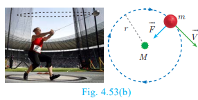


# Geometry

## Circles and Tangents

In our day-to-day real life situations, we have seen two lines intersect at a point or do not intersect in a plane. For example, two parallel lines in a railway track, do not intersect. Whereas, grills in a window intersect.

Similarly what happens when a curve and a line is given in a plane? The curve may be parabola, circle or any general curve.

Similarly, what happens when we consider intersection of a line and a circle?

We may get three situations as given in the following diagram

**Note**:
The line segment AB inscribed in the circle in Fig.4.52(c) is called chord of the circle.Thus a chord is a sub-section of a secant.

**Definition**

If a line touches the given circle at only one point, then it is called tangent to the circle.

**Real life examples of tangents to circles**

(i) When a cycle moves along a road, then the road becomes the tangent at each point when the wheels rolls on it.

(ii) When a stone is tied at one end of a string and is rotated from the other end, then the stone will describe a circle. If we suddenly stop the motion, the stone will go in a direction tangential to the circular motion.

**Some results on circles and tangents**

1. A tangent at any point on a circle and the radius through the point are perpendicular to each other.

3. The lengths of the two tangents drawn from an exterior point to a circle are equal,

Proof : By 1. \\(O A \perp P A, O B \perp P B. Also O A=O B= radius, O P is common side. \angle A O P=\angle B O P\\)

Therefore, by SAS Rule \\(\triangle O A P \cong \triangle O B P. Hence P A=P B\\)

4. If two circles touch externally the distance between their centers is equal to the sum of their radii, that is \\(O P=r_{1}+r_{2}\\)

**Proof:** Let two circles with centers at \\(O and P touch other at Q\\).

Let \\(O Q=r_{1} and P Q=r_{2} and let r_{1}>r_{2}\\).

The distance between their centers \\(O P=d. It is clear from the Fig. 4.57 that when the circles touch externally O P=d=O Q+P Q=r_{1}+r_{2}\\).

5. If two circles touch internally, the distance between their centers is equal to the difference of their radii, that is \\(O P=r_{1}-r_{2}\\).

**Proof** : Let two circles with centers at \\(O and P touch each other at Q. Let O Q=r_{1} and P Q=r_{2} and let r_{1}>r_{2}\\).

The distance between their centers \\(O P=d. It is clear from the Fig. 4.58 that when the circles touch internally, O P=d=O Q-P Q\\)

\\(\\)
O P=r_{1}-r_{2}
\\(\\)

6. The two direct common tangents drawn to the circles are equal in length, that is \\(A B=C D\\).

**Proof**:

The lengths of tangents drawn from \\(P to the two circles are equal. Therefore, P A=P C and P B=P D\\).

\\(\begin{gathered}
\Rightarrow P A-P B=P C-P D A B=C D \end{gathered}\\)

**Thinking Corner**

1. Can we draw two tangents parallel to each other on a circle?
2. Can we draw two tangents perpendicular to each other on a circle?

**Alternate segment**

In the Fig. 4.60, the chord \\(\mathrm{PQ} divides the circle into two segments. The tangent A B is drawn such that it touches the circle at P\\).

The angle in the alternate segment for \\(\angle Q P B(\angle 1) is \angle Q S P(\angle 1) and that for \angle Q P A(\angle 2) is \angle P T Q(\angle 2)\\). Theorem 6 : Alternate Segment theorem

**Statement**

If a line touches a circle and from the point of contact a chord is drawn, the angles between the tangent and the chord are respectively equal to the angles in the corresponding alternate segments.

**Proof**

Given : A circle with centre at \\(O, tangent A B touches the circle at P and P Q is a chord. S and T are two points on the circle in the opposite sides of chord P Q\\).

**To prove** \\(\quad: (i) \angle Q P B=\angle P S Q and (ii) \angle Q P A=\angle P T Q\\)

**Construction:** Draw the diameter POR. Draw \\(Q R, Q S and P S\\).

| No. | Statement | Reason |
| :---: | :---: | :---: |
| 1. | \\(\angle R P B=90^{\circ}  Now, \angle R P Q+\angle Q P B=90^{\circ}\\) | Diameter RP is perpendicular to tangent A B. |
| 2. | In \\(\triangle R P Q, \angle P Q R=90^{\circ}\\) | Angle in a semicircle is 90. |
| 3. | \\(\angle Q R P+\angle R P Q=90^{\circ}\\) | In a right angled triangle, sum of the two   acute angles is 90. |
| 4. | \\(\angle R P Q+\angle Q P B=\angle Q R P+\angle R P Q  \angle Q P B=\angle Q R P\\) | From (1) and (3). |
| 5. | \\(\angle Q R P=\angle P S Q\\) | Angles in the same segment are equal. |
| 6. | \\(\angle Q P B=\angle P S Q\\) | From (4) and (5); Hence (i) is proved. |
| 7. | \\(\angle Q P B+\angle Q P A=180^{\circ}\\) | Linear pair of angles. |
| 8. | \\(\angle P S Q+\angle P T Q=180^{\circ}\\) | Sum of opposite angles of a cyclic   quadrilateral is 180. |
| 9. | \\(\angle Q P B+\angle Q P A=\angle P S Q+\angle P T Q\\) | From (7) and (8). |
| 10 | \\(\angle Q P B+\angle Q P A=\angle Q P B+\angle P T Q \\)| \\(\angle Q P B=\angle P S Q from (6)\\) |
| 11. | \\(\angle Q P A=\angle P T Q\\) | Hence (ii) is proved.   This completes the proof. |

**Example 4.24** Find the length of the tangent drawn from a point whose distance from the centre of a circle is \\(5 \mathrm{~cm} and radius of the circle is 3 \mathrm{~cm}\\).

**Solution** Given OP \\(=5 \mathrm{~cm}, radius r=3 \mathrm{~cm}\\)

To find the length of tangent \\(P T\\).

In right angled \\(\triangle O T P\\),

\\(O P^{2}=O T^{2}+P T^{2}\\) (by Pythagoras theorem)

\\(5^{2}=3^{2}+P T^{2} gives P T^{2}=25-9=16\\)

Length of the tangent \\(P T=4 \mathrm{~cm}\\)

**Example 4.25** PQ is a chord of length \\(8 \mathrm{~cm} to a circle of radius 5 \mathrm{~cm}. The tangents at \mathrm{P} and \mathrm{Q}\\) intersect at a point T. Find the length of the tangent TP.

**Solution** Let \\(T R=y\\). Since, OT is perpendicular bisector of PQ.

\\(\\)
P R=Q R=4 \mathrm{~cm}
\\(\\)

In \\(\triangle O R P, O P^{2}=O R^{2}+P R^{2}\\)

\\(\begin{aligned} & O R^{2}=O P^{2}-P R^{2} & O R^{2}=5^{2}-4^{2}=25-16= & O T=O R+R T=3+y\end{aligned}\\)

\\(\\)
O R^{2}=5^{2}-4^{2}=25-16=9 \Rightarrow O R=3 \mathrm{~cm}
\\(\\)

In \\(\triangle P R T, T P^{2}=T R^{2}+P R^{2}\\)

and \\(\triangle O P T we have, O T^{2}=T P^{2}+O P^{2}\\)

\\(\begin{aligned}
& O T^{2}=\left(T R^{2}+P R^{2}\right)+O P^{2} \quad\left(\text { substitute for } T P^{2} \text { from }(2)\right) 
&(3+y)^{2}=y^{2}+4^{2}+5^{2} \quad(\text { substitute for } O T \text { from }(1)) 
& 9+6 y+y^{2}=y^{2}+16+25 
& 6 y=41-9 \text { we get } y=\frac{16}{3}
\end{aligned}\\)

From (2), \\(T P^{2}=T R^{2}+P R^{2}\\)

\\(\begin{aligned}T P^{2}=\left(\frac{16}{3}\right)^{2}+4^{2}=\frac{256}{9}+16=\frac{400}{9} \text { so, } T P=\frac{20}{3} \mathrm{~cm}\end{aligned}\\)

**Example 4.26** In Fig.4.64, \\(O is the centre of a circle. P Q is a chord and the tangent P R at P makes an angle of 50^{\circ} with P Q. Find \angle P O Q\\).

**Solution** \\(\angle O P Q=90^{\circ}-50^{\circ}=40^{\circ} (angle between the radius and tangent is 90^{\circ}\\) )

\\(\begin{gathered}
O P=O Q \quad(\text { Radii of a circle are equal }) 
\angle O P Q=\angle O Q P=40^{\circ} \quad(\triangle O P Q \text { is isosceles }) 
\angle P O Q=180^{\circ}-\angle O P Q-\angle O Q P 
\angle P O Q=180^{\circ}-40^{\circ}-40^{\circ}=100^{\circ}
\end{gathered}\\)

Example 4.27 In Fig.4.65, \\(\triangle A B C is circumscribing a circle. Find the length of B C\\).

Solution \\(A N=A M=3 \mathrm{~cm}\\) (Tangents drawn from same external point are equal)

\\(\begin{aligned}
& B N=B L=4 \mathrm{~cm} 
& C L=C M=A C-A M=9-3=6 \mathrm{~cm}
\end{aligned}\\)

Gives \\(B C=B L+C L=4+6=10 \mathrm{~cm}\\)

**Example 4.28** If radii of two concentric circles are \\(4 \mathrm{~cm} and 5 \mathrm{~cm}\\) then find the length of the chord of one circle which is a tangent to the other circle.

**Solution**

\\(O A=4 \mathrm{~cm}, \mathrm{OB}=5 \mathrm{~cm}; also O A \perp B C\\).

\\(\begin{aligned}
O B^{2} & =O A^{2}+A B^{2} 
5^{2} & =4^{2}+A B^{2} \text { gives } A B^{2}=9
\end{aligned}\\)

Therefore \\(A B=3 \mathrm{~cm}\\)

\\(\begin{aligned}
B C=2 \mathrm{AB} \text { hence } B C=2 \times 3=6 \mathrm{~cm}
\end{aligned}\\)

### Construction

**Construction of tangents to a circle**

Now let us discuss how to draw

1. a tangent to a circle using its centre
2. a tangent to a circle using alternate segment theorem
3. pair of tangents from an external point

**Construction of a tangent to a circle (Using the centre)**

**Example 4.29** Draw a circle of radius \\(3 \mathrm{~cm}. Take a point P on this circle and draw a tangent at P\\).

**Solution** Given, radius \\(r=3 \mathrm{~cm}\\)

**Construction**

Step 1: Draw a circle with centre at \\(O of radius 3 \mathrm{~cm}\\).

Step 2: Take a point \\(P on the circle. Join O P\\).

Step 3: Draw perpendicular line to \\(O P which passes through P\\).

Step 4: \\(T T^{\prime}\\) is the required tangent.

**Construct of a tangent to a circle (Using alternate segment theorem)**

**Example 4.30** Draw a circle of radius \\(4 \mathrm{~cm}. At a point L\\) on it draw a tangent to the circle using the alternate segment.

**Solution**

Given, radius \\(=4 \mathrm{~cm}\\)

**Construction**

Step 1: With \\(O as the centre, draw a circle of radius 4 \mathrm{~cm}\\).

Step 2: Take a point \\(L on the circle. Through L draw any chord L M\\).

Step 3: Take a point \\(N distinct from L and M on the circle, so that L, M and N are in anti-clockwise direction. Join L N and N M\\).

Step 4: Through \\(L draw a tangent T T^{\prime} such that \angle T L M=\angle M N L\\).

Step 5: \\(T T^{\prime}\\) is the required tangent.

**Construction of pair of tangents to a circle from an external point \\(P\\).**

**Example 4.31** Draw a circle of diameter \\(6 \mathrm{~cm} from a point P, which is 8 \mathrm{~cm} away from its centre. Draw the two tangents P A and P B\\) to the circle and measure their lengths.

**Solution** Given, diameter \\((d)=6 \mathrm{~cm}, we find radius (r)=\frac{6}{2}=3 \mathrm{~cm}\\)

**Construction**

Step 1: With centre at \\(O, draw a circle of radius 3 \mathrm{~cm}\\).

Step 2: Draw a line \\(O P of length 8 \mathrm{~cm}\\).

Step 3: Draw a perpendicular bisector of \\(O P, which cuts O P at M\\).

Step 4: With \\(M as centre and M O as radius, draw a circle which cuts previous circle at A and B\\).

Step5: Join \\(A P and B P. A P and B P are the required tangents. Thus length of the tangents are P A=P B=7.4 \mathrm{~cm}\\).

Verification : In the right angle triangle \\(O A P, P A^{2}=O P^{2}-O A^{2}=8^{2}-3^{2}=64-9=55\\)

\\(\begin{aligned}
P A=\sqrt{55}=7.4 \mathrm{~cm} \text { (approximately). }
\end{aligned}\\)
