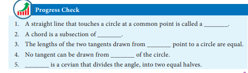
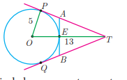
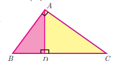
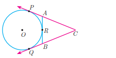
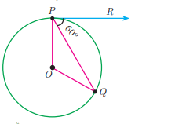
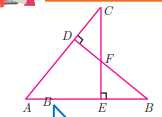
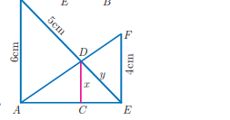
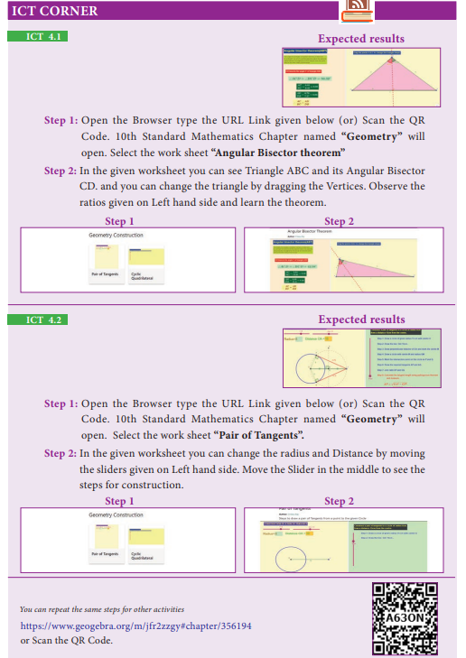

# 4.6 Concurrency Theorems

## Definition

A **cevian** is a line segment that extends from one vertex of a triangle to the opposite side. In the diagram,   AD

 is a cevian, from   A
.

## Special Cevians

- **(i) A median** is a cevian that divides the opposite side into two congruent (equal) lengths.
- **(ii) An altitude** is a cevian that is perpendicular to the opposite side.
- **(iii) An angle bisector** is a cevian that bisects the corresponding angle.

The term cevian comes from the name of Italian engineer **Giovanni Ceva**, who proved a well known theorem about cevians.

---

## Ceva's Theorem (without proof)

**Statement:** Let   ABC

 be a triangle and let   D, E, F
 
 be points on lines   BC
,
    CA
,
     AB
 
   respectively. Then the cevians   \overline{AD}, \overline{BE}, \overline{CF}
 are concurrent if and only if:




where the lengths are directed. This also works for the reciprocal of each of the ratios as the reciprocal of 1 is 1.

**Note:** The cevians do not necessarily lie within the triangle, although they do in the diagram.

---

## Menelaus Theorem (without proof)

**Statement:** A necessary and sufficient condition for points   P, Q, R
 
on the respective sides   BC, CA, AB

 (or their extension) of a triangle   ABC
 to be collinear is that:

  \frac{BP}{PC} \times \frac{CQ}{QA} \times \frac{AR}{RB} = -1


where all segments in the formula are directed segments.

**Note:** 
- Menelaus theorem can also be given as   \frac{BP}{PC} \times \frac{CQ}{QA} \times \frac{AR}{RB} = -1
.
- If   BP
 
is replaced by   PB

 (or)   CQ
 by 
   QC
 (or) 
   AR
 by
    RA
,
   or if any one of the six directed line segments   BP, PC, CQ, QA, AR, RB
 is interchanged, then the product will be 1.

---

## Examples

### Example 4.32

Show that in a triangle, the medians are concurrent.

**Solution:** Medians are line segments joining each vertex to the midpoint of the corresponding opposite sides.

Thus medians are the cevians where   D, E, F
 
are midpoints of   BC, CA
 
and   AB
 respectively.

Since   D

 is a midpoint of   BC
,
    BD = DC so \frac{BD}{DC} = 1
 ... (1)

Since,   E
 
is a midpoint of   CA
, 
  CE = EA
 
so   \frac{CE}{EA} = 1
 ... (2)

Since,   F

 is a midpoint of   AB
,
    AF = FB

   so   \frac{AF}{FB} = 1
 ... (3)

Thus, multiplying (1), (2) and (3) we get:

  \frac{BD}{DC} \times \frac{CE}{EA} \times \frac{AF}{FB} = 1 \times 1 \times 1 = 1


And so, Ceva's theorem is satisfied.

Hence the Medians are concurrent.

---

### Example 4.33

In   \triangle ABC

, points   D, E, F
 
lies on   BC, CA, AB

 respectively. Suppose   AB, AC

  and   BC
 
  have lengths 13, 14 and 15 respectively. If   \frac{AF}{FB} = \frac{2}{5}
 
      and   \frac{CE}{EA} = \frac{5}{8}LM.   Find    BD   LM and DC.

**Solution:** Given that   AB = 13
,
   AC = 14

  and   BC = 15
.

Let   BD = x
, 
  DC = y


Using Ceva's theorem, we have:

  \frac{BD}{DC} \times \frac{CE}{EA} \times \frac{AF}{FB} = 1 \text{ ... (1)}


Substitute the values of   \frac{AF}{FB}

 and   \frac{CE}{EA}
 in (1):

  \frac{x}{y} \times \frac{5}{8} \times \frac{2}{5} = 1


  \frac{x}{y} \times \frac{10}{40} = 1


  \frac{x}{y} \times \frac{1}{4} = 1


Hence,   \frac{x}{y} = 4
,
 so   x = 4y
 ... (2)

  BC = BD + DC = 15
 so,
   x + y = 15
 ... (3)

From (2), using   x = 4y

 in (3) we get,   4y + y = 15

  gives   5y = 15
 
  then   y = 3


Substitute   y = 3
 
in (3) we get,   x = 12
.

Hence   BD = 12

,   DC = 3
.

---

### Example 4.34

In a garden containing several trees, three particular trees   P, Q, R
 
are located in the following way,   BP = 2
 
m,   CQ = 3
 
m,   RA = 10

 m,   PC = 6

  m,   QA = 5

   m,   RB = 2
 
   m, where   A, B, C
 
   are points such that   P
 
   lies on   BC
,
      Q

    lies on   AC
 
    and   R

     lies on   AB
.
      Check whether the trees   P, Q, R
 lie on a same straight line.

**Solution:** By Menelaus's theorem, the trees   P, Q, R
 will be collinear (lie on same straight line) if:

  \frac{BP}{PC} \times \frac{CQ}{QA} \times \frac{AR}{RB} = 1 \text{ ... (1)}


Given   BP = 2
 m,
   CQ = 3
 m,
    RA = 10
 
  m,   PC = 6

   m,   QA = 5

    m and   RB = 2
 m

Substituting these values in (1) we get:

  \frac{BP}{PC} \times \frac{CQ}{QA} \times \frac{RA}{RB} = \frac{2}{6} \times \frac{3}{5} \times \frac{10}{2} = \frac{1}{3} \times \frac{3}{5} \times 5 = \frac{60}{60} = 1


Hence the trees   P, Q, R
 lie on a same straight line.

## Exercise 4.4

1. The length of the tangent to a circle from a point P, which is 25cm away from the centre is 24cm. What is the radius of the circle?

2. LMN is a right angled triangle with ∠L = 90°. A circle is inscribed in it. The lengths of the sides containing the right angle are 6cm and 8cm. Find the radius of the circle.

3. A circle is inscribed in ΔABC having sides 8cm, 10cm and 12cm as shown in figure, Find AD, BE and CF.

4. PQ is a tangent drawn from a point P to a circle with centre O and QOR is a diameter of the circle such that ∠POR = 120°. Find ∠OPQ.

5. A tangent ST to a circle touches it at B. AB is a chord such that ∠ABT = 65°. Find ∠AOB, where "O" is the centre of the circle.

6. In figure, O is the centre of the circle with radius 5cm. T is a point such that OT = 13cm and OT intersects the circle at E, if AB is the tangent to the circle at E, find the length of AB.

7. In two concentric circles, a chord of length 16cm of larger circle becomes a tangent to the smaller circle whose radius is 6cm. Find the radius of the larger circle.

8. Two circles with centres O and O' of radii 3cm and 4cm, respectively intersect at two points P and Q, such that OP and O'P are tangents to the two circles. Find the length of the common chord PQ.

9. Show that the angle bisectors of a triangle are concurrent.

10. An artist has created a triangular stained glass window and has one strip of small length left before completing the window. She needs to figure out the length of left out portion based on the lengths of the other sides as shown in the figure.

11. Draw a tangent at any point R on the circle of radius 3.4cm and centre at P.

12. Draw a circle of radius 4.5cm. Take a point on the circle. Draw the tangent at that point using the alternate segment theorem.

13. Draw the two tangents from a point which is 10cm away from the centre of a circle of radius 5cm. Also, measure the lengths of the tangents.

14. Take a point which is 11cm away from the centre of a circle of radius 4cm and draw the two tangents to the circle from that point.

15. Draw the two tangents from a point which is 5cm away from the centre of a circle of diameter 6cm. Also, measure the lengths of the tangents.

16. Draw a tangent to the circle from the point P having radius 3.6cm, and centre at O. Point P is at a distance 7.2cm from the centre.

---

## Exercise 4.5 (Multiple Choice Questions)

1. If in triangles ABC and EDF, AB/DE = BC/FD then they will be similar, when
   (A) ∠B = ∠E
   (B) ∠A = ∠D
   (C) ∠B = ∠D
   (D) ∠A = ∠F

2. In ΔLMN, ∠L = 60°, ∠M = 50°. If ΔLMN ~ ΔPQR then the value of ∠R is
   (A) 40°
   (B) 70°
   (C) 30°
   (D) 110°

3. If ΔABC is an isosceles triangle with ∠C = 90° and AC = 5cm, then AB is
   (A) 2.5cm
   (B) 5cm
   (C) 10cm
   (D) 5√2 cm

4. In a given figure ST || QR, PS = 2cm and SQ = 3cm. Then the ratio of the area of ΔPQR to the area of ΔPST is
   (A) 25:4
   (B) 25:7
   (C) 25:11
   (D) 25:13

5. The perimeters of two similar triangles ΔABC and ΔPQR are 36cm and 24cm respectively. If PQ = 10cm, then the length of AB is
   (A) 6⅔ cm
   (B) 10⅔ cm
   (C) 6⅔ cm
   (D) 15cm

6. If in ΔABC, DE || BC. AB = 3cm, AC = 2.4cm and AD = 2.1cm then the length of AE is
   (A) 1.4cm
   (B) 1.8cm
   (C) 1.2cm
   (D) 1.05cm

7. In a ΔABC, AD is the bisector of ∠BAC. If AB = 8cm, BD = 6cm and DC = 3cm. The length of the side AC is
   (A) 6cm
   (B) 4cm
   (C) 3cm
   (D) 8cm

8. In the adjacent figure ∠BAC = 90° and AD ⊥ BC then
   (A) BD × CD = BC²
   (B) AB × AC = BC²
   (C) BD × CD = AD²
   (D) AB × AC = AD²

9. Two poles of heights 6m and 11m stand vertically on a plane ground. If the distance between their feet is 12m, what is the distance between their tops?
   (A) 13m
   (B) 14m
   (C) 15m
   (D) 12.8m

10. In the given figure, PR = 26cm, QR = 24cm, ∠PAQ = 90°, PA = 6cm and QA = 8cm. Find ∠PQR
    (A) 80°
    (B) 85°
    (C) 75°
    (D) 90°

11. A tangent is perpendicular to the radius at the
    (A) centre
    (B) point of contact
    (C) infinity
    (D) chord

12. How many tangents can be drawn to the circle from an exterior point?
    (A) one
    (B) two
    (C) infinite
    (D) zero

13. The two tangents from an external points P to a circle with centre at O are PA and PB. If ∠APB = 70° then the value of ∠AOB is
    (A) 100°
    (B) 110°
    (C) 120°
    (D) 130°

14. In figure if AB is another tangent touching the circle at R. If CP = 11cm and BC = 7cm, then BR =
    (A) 6cm
    (B) 5cm
    (C) 8cm
    (D) 4cm

    

15. In figure if PR is tangent to the circle at P and O is the centre of the circle, then ∠POQ is
    (A) 120°
    (B) 100°
    (C) 110°
    (D) 90°

 

---

## Unit Exercise - 4

1. In the figure, if BD ⊥ AC and CE ⊥ AB, prove that
   (i) ΔAEC ~ ΔADB
   (ii) CA/AB = CE/DB

 

2. In the given figure AB || CD || EF. If AB = 6cm, CD = x cm, EF = 4cm, BD = 5cm and DE = y cm. Find x and y.

 

3. O is any point inside a triangle ABC. The bisector of ∠AOB, ∠BOC and ∠COA meet the sides AB, BC and CA in point D, E and F respectively. Show that (AD/DB) × (BE/EC) × (CF/FA) = 1

4. In the figure, ABC is a triangle in which AB = AC. Points D and E are points on the side AB and AC respectively such that AD = AE. Show that the points B, C, E and D lie on a same circle.

 

5. Two trains leave a railway station at the same time. The first train travels due west and the second train due north. The first train travels at a speed of 20km/hr and the second train travels at 30km/hr. After 2 hours, what is the distance between them?

6. D is the mid point of side BC and AE ⊥ BC. If BC = a, AC = b, AB = c, ED = x, AD = p and AE = h, prove that
   (i) b² = p² + ax + a²/4
   (ii) c² = p² - ax + a²/4
   (iii) b² + c² = 2p² + a²/2

7. A man whose eye-level is 2m above the ground wishes to find the height of a tree. He places a mirror horizontally on the ground 20m from the tree and finds that if he stands at a point C which is 4m from the mirror B, he can see the reflection of the top of the tree. How height is the tree?

8. An Emu which is 8 feet tall is standing at the foot of a pillar which is 30 feet high. It walks away from the pillar. The shadow of the Emu falls beyond Emu. What is the relation between the length of the shadow and the distance from the Emu to the pillar?

9. Two circles intersect at A and B. From a point P on one of the circles lines PAC and PBD are drawn intersecting the second circle at C and D. Prove that CD is parallel to the tangent at P.

10. Let ABC be a triangle and D, E, F are points on the respective sides AB, BC, AC (or their extensions). Let AD:DB = 5:3, BE:EC = 3:2 and AC = 21. Find the length of the line segment CF.

 

  