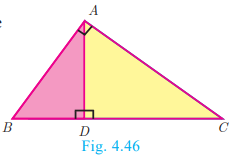
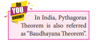
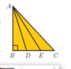

# 4.4 Pythagoras Theorem

Among all existing theorems in mathematics, Pythagoras theorem is considered to be the most important because it has maximum number of proofs. There are more than 350 ways of proving Pythagoras theorem through different methods. Each of these proofs was discovered by eminent mathematicians, scholars, engineers and math enthusiasts, including one by the 20th American president James Garfield. The book titled "The Pythagorean Proposition" written by Elisha Scott Loomis, published by the National Council of Teaching of Mathematics (NCTM) in America contains 367 proofs of Pythagoras Theorem.

Three natural numbers   (a, b, c)
 
are said to form **Pythagorean Triplet**, if they form sides of a right triangle. Thus   (a, b, c)
 
is a Pythagorean Triplet if and only if   c^2 = a^2 + b^2
.

Now we are in a position to study this most famous and important theorem not only in Geometry but in whole of mathematics.

**Note:**
- In a right angled triangle, the side opposite to   90°
 (the right angle) is called the **hypotenuse**.
- The other two sides are called **legs** of the right angled triangle.
- The hypotenuse will be the longest side of the triangle.

---

## Theorem 5: Pythagoras Theorem

**Statement:** In a right angled triangle, the square of the hypotenuse is equal to the sum of the squares of the other two sides.

**Proof:**

**Given:** In   \triangle ABC
,
   \angle A = 90°


**To prove:**   AB^2 + AC^2 = BC^2


**Construction:** Draw   AD \perp BC


| No. | Statement | Reason |
|:---|:---|:---|
| 1. | Compare   \triangle ABC and   \triangle DBA | |
| |   \angle B is common | |
| |   \angle BAC = \angle BDA = 90° | Given   \angle BAC = 90°  and by construction   \angle BDA = 90° |
| | Therefore,   \triangle ABC \sim \triangle DBA | By AA similarity |
| |   \frac{AB}{BD} = \frac{BC}{AB} | |
| |   AB^2 = BC \times BD ... (1) | |
| 2. | Compare   \triangle ABC and   \triangle DAC | |
| |   \angle C is common | |
| |   \angle BAC = \angle ADC = 90° | Given   \angle BAC = 90°  and by construction   \angle ADC = 90° |
| | Therefore,   \triangle ABC \sim \triangle DAC | By AA similarity |
| |   \frac{BC}{AC} = \frac{AC}{DC} | |
| |   AC^2 = BC \times DC ... (2) | |

Adding (1) and (2) we get:

  AB^2 + AC^2 = BC \times BD + BC \times DC

  = BC(BD + DC)

  = BC \times BC

  AB^2 + AC^2 = BC^2


Hence the theorem is proved.

---

## Converse of Pythagoras Theorem

**Statement:** If the square of the longest side of a triangle is equal to sums of squares of other two sides, then the triangle is a right angle triangle.

---

## Examples

### Example 4.20

An insect 8m away initially from the foot of a lamp post which is 6m tall, crawls towards it moving through a distance. If its distance from the top of the lamp post is equal to the distance it has moved, how far is the insect away from the foot of the lamp post?

**Solution:** Distance between the insect and the foot of the lamp post   BD = 8
 m

The height of the lamp post,   AB = 6
 m

After moving a distance of   x
 
m, let the insect be at   C
.

Let,   AC = CD = x
.
 Then   BC = BD - CD = 8 - x


In   \triangle ABC
,
   \angle B = 90°


  AC^2 = AB^2 + BC^2 \text{ gives } x^2 = 6^2 + (8-x)^2

  x^2 = 36 + 64 - 16x + x^2

  16x = 100 \text{ then } x = 6.25


Then,   BC = 8 - x = 8 - 6.25 = 1.75
 m

Therefore the insect is **1.75 m** away from the foot of the lamp post.

---

### Example 4.21

  P
 
and   Q
 
are the mid-points of the sides   CA
 
and   CB

 respectively of a   \triangle ABC
,
 right angled at   C
.
  Prove that   4(AQ^2 + BP^2) = 5AB^2
.

**Solution:**   \triangle AQC
 
is a right triangle at   C
,

  AQ^2 = AC^2 + QC^2 \text{ ... (1)}


  \triangle BPC
 
is a right triangle at   C
,

  BP^2 = BC^2 + CP^2 \text{ ... (2)}


  \triangle ABC
 
is a right triangle at   C
,

  AB^2 = AC^2 + BC^2 \text{ ... (3)}


From (1) and (2),

  AQ^2 + BP^2 = AC^2 + QC^2 + BC^2 + CP^2
    
   4(AQ^2 + BP^2) = 4(AC^2 + QC^2 + BC^2 + CP^2)
    \
   = 4AC^2 + 4QC^2 + 4BC^2 + 4CP^2
    \
  = 4AC^2 + BC^2 + 4BC^2 + AC^2 \text{ (Since } P \text{ and } Q \text{ are mid points)}
\
  = 5AC^2 + 5BC^2 = 5(AC^2 + BC^2)

  = 5AB^2 \text{ (From equation (3))}
\
  \therefore 4(AQ^2 + BP^2) = 5AB^2

---

### Example 4.22

What length of ladder is needed to reach a height of 7ft along the wall when the base of the ladder is 4ft from the wall? Round off your answer to the next tenth place.

**Solution:** Let   x

 be the length of the ladder.   BC = 4
 
 ft,   AC = 7
 ft.

By Pythagoras theorem we have:

  AB^2 = AC^2 + BC^2

  x^2 = 7^2 + 4^2 = 49 + 16 = 65


Hence,   x = \sqrt{65}


The number 65 is between 8 and 8.1.

8^2 = 64 < 65 < 65.61 = (8.1)^2


Therefore, the length of the ladder is approximately **8.1 ft**.

---

### Example 4.23

An Aeroplane after take off from an airport and flies due north at a speed of 1000 km/hr. At the same time, another aeroplane take off from the same airport and flies due west at a speed of 1200 km/hr. How far apart will be the two planes after   1\frac{1}{2}
 hours?

**Solution:** Let the first aeroplane starts from   O
 
and goes up to   A
 towards north,

  OA = 1000 \times \frac{3}{2} = 1500 \text{ km}


Let the second aeroplane starts from   O
 
at the same time and goes up to   B
 towards west,

  OB = 1200 \times \frac{3}{2} = 1800 \text{ km}


The required distance to be found is   BA
.

In right angled triangle   AOB
,

  AB^2 = OA^2 + OB^2

\
  = 1500^2 + 1800^2

\
  = 100^2(15^2 + 18^2)

\
  = 100^2 \times 549 = 100^2 \times 9 \times 61

\
  AB = 100 \times 3 \times \sqrt{61} = 300\sqrt{61} \text{ km}


## Exercise 4.3

1. A man goes 18m due east and then 24m due north. Find the distance of his current position from the starting point?

2. There are two paths that one can choose to go from Sarah's house to James house. One way is to take C street, and the other way requires to take B street and then A street. How much shorter is the direct path along C street? (Using figure).

3. To get from point A to point B you must avoid walking through a pond. You must walk 34m south and 41m east. To the nearest meter, how many meters would be saved if it were possible to make a way through the pond?

4. In the rectangle WXYZ, XY + YZ = 17cm, and XZ + YW = 26cm. Calculate the length and breadth of the rectangle?

5. The hypotenuse of a right triangle is 6m more than twice of the shortest side. If the third side is 2m less than the hypotenuse, find the sides of the triangle.

6. 5m long ladder is placed leaning towards a vertical wall such that it reaches the wall at a point 4m high. If the foot of the ladder is moved 1.6m towards the wall, then find the distance by which the top of the ladder would slide upwards on the wall.

7. The perpendicular PS on the base QR of a ΔPQR intersects QR at S, such that QS = 3SR. Prove that 2PQ² + 2PR² = 5QR².

8. In the adjacent figure, ABC is a right angled triangle with right angle at B and points D, E trisect BC. Prove that 8AE² = 3AC² + 5AD².

---