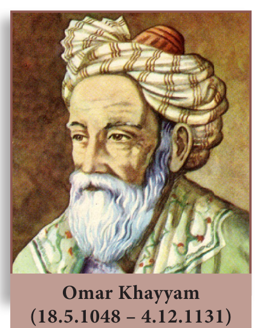

> "The knowledge of which geometry aims is the knowledge of eternal" — Plato

Omar Khayyam was a Persian mathematician, astronomer and poet. As a poet, his classic work Rubaiyat attained world fame.

Khayyam's work is an effort to unify Algebra and Geometry. Khayyam's work can be considered the first systematic study and the first exact method of solving cubic equations. He accomplished this task using Geometry. His efforts in trying to generalize the principles of Geometry provided by Euclid, inspired many European mathematicians to the eventual discovery of non-Euclidean Geometry. Khayyam was a perfect example of being a notable scientist and a great poet, an achievement which many do not possess.

