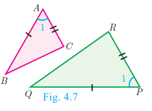
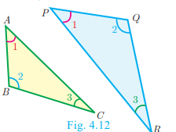
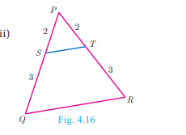
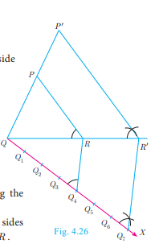

# 4.2 Similarity

Two figures are said to be similar if every aspect of one figure is proportional to other figure.

Mathematically we say that two objects are **similar** if they are of same shape but not necessarily they need to have the same size. The ratio of the corresponding measurements of two similar objects must be constant.

## Applications of Similarity

1. By analyzing the shadows that make triangles, we can determine the actual height of objects
2. Used in aerial photography to determine the distance from sky to a particular location on the ground
3. Used in Architecture to aid in design of their projects

---

## 4.2.1 Similar Triangles

In class IX, we have studied congruent triangles. We can say that two geometrical figures are **congruent**, if they have same size and shape. But, here we shall study about geometrical figures which have same shape but proportional sizes. These figures are called **similar figures**.

### Congruency and Similarity of Triangles

Congruency is a particular case of similarity. In both the cases, three angles of one triangle are equal to the three corresponding angles of the other triangle. But in congruent triangles, the corresponding sides are equal. While in similar triangles, the corresponding sides are proportional.

### Difference Between Congruent and Similar Triangles

---

**Note:**  

The triangles   \triangle ABC   and   \triangle PQR   are similar if written as   \triangle ABC \sim \triangle PQR 
---

## 4.2.2 Criteria of Similarity

### AA Criterion of Similarity

If two angles of one triangle are respectively equal to two angles of another triangle, then the two triangles are similar, because the third angle in both triangles must be equal. Therefore, AA similarity criterion is same as the AAA similarity criterion.

If   \angle A = \angle P = 1 

 and   \angle B = \angle Q= 2
,
  then   \triangle ABC \sim \triangle PQR


### SAS Criterion of Similarity

If one angle of a triangle is equal to one angle of another triangle and if the sides including them are proportional then the two triangles are similar.

Thus if   \angle A = \angle P =1
 
and 
\
  \frac{AB}{PQ} = \frac{AC}{PR}
, 
then   \triangle ABC \sim \triangle PQR


### SSS Criterion of Similarity

If three sides of a triangle are proportional to the three corresponding sides of another triangle, then the two triangles are similar.

So if,   \frac{AB}{PQ} = \frac{AC}{PR} = \frac{BC}{QR}
,
 then   \triangle ABC \sim \triangle PQR


---

## Some Useful Results on Similar Triangles

1. A perpendicular line drawn from the vertex of a right angled triangle divides the triangle into two triangles similar to each other and also to original triangle.

     \triangle ADB \sim \triangle BDC \sim \triangle ABC


2. If two triangles are similar, then the ratio of the corresponding sides are equal to the ratio of their corresponding altitudes.
   
   i.e. if   \triangle ABC \sim \triangle PQR
, then:
   
     \frac{AB}{PQ} = \frac{BC}{QR} = \frac{CA}{RP} = \frac{AD}{PS} = \frac{BE}{QT} = \frac{CF}{RU}


3.If two triangles are similar, then the ratio of the corresponding sides are equal to the ratio of the corresponding perimeters.
   
   If   \triangle ABC \sim \triangle DEF
, then:
   
     \frac{AB}{DE} = \frac{BC}{EF} = \frac{CA}{FD} = \frac{AB + BC + CA}{DE + EF + FD}


4. The ratio of the area of two similar triangles are equal to the ratio of the squares of their corresponding sides.
   
     \frac{\text{area}(\triangle ABC)}{\text{area}(\triangle PQR)} = \frac{AB^2}{PQ^2} = \frac{BC^2}{QR^2} = \frac{AC^2}{PR^2}


5. If two triangles have common vertex and their bases are on the same straight line, the ratio between their areas is equal to the ratio between the length of their bases.
   
     \frac{\text{area}(\triangle ABD)}{\text{area}(\triangle BDC)} = \frac{AD}{DC}


---

**Illustration:** Two triangles,   \triangle XYZ

 and   \triangle LMN
 are similar because:
-   \angle X = \angle L

-   \angle Y = \angle M
  
-   \angle Z = \angle N


**Note:**
- A pair of equiangular triangles are similar.
- If two triangles are similar, then they are equiangular.
-   \frac{XY}{LM} = \frac{YZ}{MN} = \frac{XZ}{LN}
 (by sides)

Here the vertices   X, Y, Z
 
correspond to the vertices   L, M, N

 respectively. Thus in symbol   \triangle XYZ \sim \triangle LMN


---

## Examples

### Example 4.1

Show that   \triangle PST \sim \triangle PQR


**(i)** 

In   \triangle PST

 and   \triangle PQR
,
  \frac{PS}{PQ} = \frac{2}{2+1} = \frac{2}{3}, \quad \frac{PT}{PR} = \frac{4}{4+2} = \frac{2}{3}


Thus,   \frac{PS}{PQ} = \frac{PT}{PR}

 and   \angle P
 is common

Therefore, by **SAS similarity**,   \triangle PST \sim \triangle PQR


**(ii)** 

In   \triangle PST
 and 
  \triangle PQR
,
  \frac{PS}{PQ} = \frac{2}{2+3} = \frac{2}{5}, \quad \frac{PT}{PR} = \frac{2}{2+3} = \frac{2}{5}


Thus,   \frac{PS}{PQ} = \frac{PT}{PR}
,
 and   \angle P
 is common

Therefore, by **SAS similarity**,   \triangle PST \sim \triangle PQR


---

### Example 4.2

Is   \triangle ABC \sim \triangle PQR
?

**Solution:** In   \triangle ABC

 and   \triangle PQR
,

  \frac{PQ}{AB} = \frac{3}{6} = \frac{1}{2}, \quad \frac{QR}{BC} = \frac{4}{10} = \frac{2}{5}


Since   \frac{1}{2} \neq \frac{2}{5}
, the corresponding sides are not proportional.

Therefore   \triangle ABC
 
is **not similar** to   \triangle PQR
.

**Note:** If we change exactly one of the four given lengths, then we can make these triangles similar.

---

### Example 4.3

Observe the figure and find   \angle P
.

**Solution:** In   \triangle BAC

 and   \triangle PRQ
,
  \frac{AB}{RQ} = \frac{3}{6} = \frac{1}{2}; \quad \frac{BC}{QP} = \frac{6}{12} = \frac{1}{2}; \quad \frac{CA}{PR} = \frac{3\sqrt{3}}{6\sqrt{3}} = \frac{1}{2}


Therefore,   \frac{AB}{RQ} = \frac{BC}{QP} = \frac{CA}{PR}


By **SSS similarity**, we have   \triangle BAC \sim \triangle QRP


  \angle P = \angle C
 (since the corresponding parts of similar triangle)

  \angle P = \angle C = 180° - (\angle A + \angle B) = 180° - (90° + 60°) = 180° - 150° = 30°


---

### Example 4.4

A boy of height 90cm is walking away from the base of a lamp post at a speed of 1.2 m/sec. If the lamppost is 3.6m above the ground, find the length of his shadow cast after 4 seconds.

**Solution:** Given, speed   = 1.2

 m/s, time   = 4
 s

  \text{distance} = \text{speed} \times \text{time} = 1.2 \times 4 = 4.8 \text{ m}


Let   x
 be the length of the shadow after 4 seconds

Since   \triangle ABE \sim \triangle CDE
,

  \frac{BE}{DE} = \frac{AB}{CD}


  \frac{4.8 + x}{x} = \frac{3.6}{0.9} \quad (\text{since } 90\text{cm} = 0.9\text{m})


  4.8 + x = 4x \text{ gives } 3x = 4.8, \text{ so } x = 1.6 \text{ m}


The length of his shadow   DE = 1.6
 m

---

### Example 4.5

In the figure,   \angle A = \angle CED
. 
Prove that   \triangle CAB \sim \triangle CED

. Also find the value of   x
.

**Solution:** In   \triangle CAB
 
and   \triangle CED
,
   \angle C

 is common,   \angle A = \angle CED


Therefore,   \triangle CAB \sim \triangle CED
 (By **AA similarity**)

  \frac{CA}{CE} = \frac{AB}{DE} = \frac{CB}{CD}


Hence,   \frac{AB}{DE} = \frac{CB}{CD} gives \frac{9}{x} = \frac{10+2}{8}


So,   x = \frac{8 \times 9}{12} = 6
 cm

---

### Example 4.6

In the figure,   QA

 and   PB

  are perpendiculars to   AB
. 
  If   AO = 10
 
  cm,   BO = 6
 
  cm and   PB = 9
 
  cm. Find   AQ
.

**Solution:** In   \triangle AOQ

 and   \triangle BOP
,
-   \angle OAQ = \angle OBP = 90°

-   \angle AOQ = \angle BOP
 (Vertically opposite angles)

Therefore, by **AA Criterion of similarity**,   \triangle AOQ \sim \triangle BOP


  \frac{AO}{BO} = \frac{OQ}{OP} = \frac{AQ}{BP}


  \frac{10}{6} = \frac{AQ}{9} \Rightarrow AQ = \frac{10 \times 9}{6} = 15 \text{ cm}


---

### Example 4.7

The perimeters of two similar triangles   ABC

 and   PQR

  are respectively 36 cm and 24 cm. If   PQ = 10
 
  cm, find   AB
.

**Solution:** The ratio of the corresponding sides of similar triangles is same as the ratio of their perimeters.

Since   \triangle ABC \sim \triangle PQR
,

  \frac{AB}{PQ} = \frac{BC}{QR} = \frac{AC}{PR} = \frac{36}{24}


  \frac{AB}{PQ} = \frac{36}{24} \Rightarrow \frac{AB}{10} = \frac{36}{24}


  AB = \frac{36 \times 10}{24} = 15 \text{ cm}


---

### Example 4.8

If   \triangle ABC

 is similar to   \triangle DEF
 
 such that   BC = 3
 cm,
 \   EF = 4

  cm and area of   \triangle ABC = 54

  ' cm². Find the area of   \triangle DEF
.

**Solution:** Since the ratio of area of two similar triangles is equal to the ratio of the squares of any two corresponding sides, we have

  \frac{\text{Area}(\triangle ABC)}{\text{Area}(\triangle DEF)} = \frac{BC^2}{EF^2}


  \frac{54}{\text{Area}(\triangle DEF)} = \frac{3^2}{4^2} = \frac{9}{16}


  \text{Area}(\triangle DEF) = \frac{16 \times 54}{9} = 96 \text{ cm}^2


---

### Example 4.9

Two poles of height   a

 metres and   b

  metres are   p

   metres apart. Prove that the height of the point of intersection of the lines joining the top of each pole to the foot of the opposite pole is given by   \frac{ab}{a+b}
 metres.

**Solution:** Let   AB
 
and   CD
 
be two poles of height '  a
'
 metres and '  b
'
  metres respectively such that the poles are   p

  \ metres apart. That is   AC = p
 metres.

Suppose the lines   AD

 and   BC

  meet at   O
,
  such that   OL = h

   metres,   CL = x
,
      LA = y
.

Then,   x + y = p


In   \triangle CAB
 
and   \triangle CLO
, we have:
-   \angle CAB = \angle CLO
 (each equal to 90°)
-   \angle C = \angle C
 (C is common)

  \triangle CAB \sim \triangle CLO
 [By AA similarity]

  \frac{CA}{CL} = \frac{AB}{LO} \Rightarrow \frac{p}{x} = \frac{a}{h}


We get,   x = \frac{ph}{a}
 ... (1)

In   \triangle ALO

 and   \triangle ACD
, we have:
-   \angle ALO = \angle ACD
 (each equal to 90°)
-   \angle A = \angle A
 (A is common)

  \triangle ALO \sim \triangle ACD
 [by AA similarity]

  \frac{AL}{AC} = \frac{OL}{DC} \Rightarrow \frac{y}{p} = \frac{h}{b}


We get,   y = \frac{ph}{b}
 ... (2)

(1) + (2)   \Rightarrow x + y = \frac{ph}{a} + \frac{ph}{b} = ph\left(\frac{1}{a} + \frac{1}{b}\right) = ph\left(\frac{a+b}{ab}\right)


Therefore,   p = ph\left(\frac{a+b}{ab}\right)


  h = \frac{ab}{a+b}


(Since   x + y = p
)

Hence, the height of the intersection of the lines joining the top of each pole to the foot of the opposite pole is   \frac{ab}{a+b}
 metres.

---

## 4.2.3 Construction of Similar Triangles

So far we have discussed the theoretical approach of similar triangles and their properties. Now we shall discuss the geometrical construction of a triangle similar to a given triangle whose sides are in a given ratio with the corresponding sides of the given triangle.

This construction includes two different cases. In one, the triangle to be constructed is smaller and in the other it is larger than the given triangle. So, we use the following term called **"scale factor"** which measures the ratio of the sides of the triangle to be constructed with the corresponding sides of the given triangle.

### Example 4.10

Construct a triangle similar to a given triangle   PQR

 with its sides equal to   \frac{3}{5}
 
 of the corresponding sides of the triangle   PQR

  (scale factor   \frac{3}{5} &lt; 1
)

**Solution:** Given a triangle   PQR
 
we are required to construct another triangle whose sides are   \frac{3}{5}

 of the corresponding sides of the triangle   PQR
.

**Steps of construction:**
1. Construct a   \triangle PQR
 with any measurement.
2. Draw a ray   QX
 
making an acute angle with   QR
 
on the side opposite to vertex   P
.
3. Locate 5 (the greater of 3 and 5 in   \frac{3}{5}
)
 points   Q_1, Q_2, Q_3, Q_4
 
 and   Q_5
 
 on   QX

  so that   QQ_1 = Q_1Q_2 = Q_2Q_3 = Q_3Q_4 = Q_4Q_5

4. Join   Q_5R
 
and draw a line through   Q_3
 
(the third point, 3 being smaller of 3 and 5 in   \frac{3}{5}
) parallel to 
  Q_5R

 to intersect   QR
 
 at   R'
.
5. Draw line through   R'
 
parallel to the line   RP
 
to intersect   QP
 
at   P'
.

Then,   \triangle P'QR'
 
is the required triangle each of whose sides is three-fifths of the corresponding sides of   \triangle PQR
.

---

### Example 4.11

Construct a triangle similar to a given triangle   PQR
 
with its sides equal to   \frac{7}{4}
 
of the corresponding sides of the triangle   PQR
 
(scale factor   \frac{7}{4} > 1
)

**Solution:** Given a triangle   PQR
, 
we are required to construct another triangle whose sides are   \frac{7}{4}

 of the corresponding sides of the triangle   PQR
.

**Steps of construction:**
1. Construct a   \triangle PQR
 with any measurement.
2. Draw a ray   QX

 making an acute angle with   QR
 
 on the side opposite to vertex   P
.
3. Locate 7 points (the greater of 7 and 4 in   \frac{7}{4}) Q_1, Q_2, Q_3, Q_4, Q_5, Q_6
 
and   Q_7
 on
   QX
 so that
   QQ_1 = Q_1Q_2 = Q_2Q_3 = Q_3Q_4 = Q_4Q_5 = Q_5Q_6 = Q_6Q_7

4. Join   Q_4
 
(the 4th point, 4 being smaller of 4 and 7 in   \frac{7}{4}) to R

 and draw a line through   Q_7
 
 parallel to   Q_4R

 , intersecting the extended line segment   QR

  at   R'
.
5. Draw a line through   R'

 parallel to   RP
 
 intersecting extended line segment   QP
 
 at   P'
.

Then   \triangle P'QR'
 
is the required triangle each of whose sides is seven-fourths of the corresponding sides of   \triangle PQR
.

## Exercise 4.1

1. In the given triangles, check which triangles are similar? Also find the value of x.

2. A girl looks the reflection of the top of the lamp post on the mirror which is 6.6m away from the foot of the lamppost. The girl whose height is 1.25m is standing 2.5m away from the mirror. Assuming the mirror is placed on the ground facing the sky and the girl, mirror and the lamppost are in a same line, find the height of the lamp post.

3. A vertical stick of length 6m casts a shadow 400cm long on the ground and at the same time a tower casts a shadow 28m long. Using similarity, find the height of the tower.

4. Two triangles QPR and QSR, right angled at P and S respectively are drawn on the same base QR and on the same side of QR. If PR and SQ intersect at T, prove that PT × TR = ST × TQ.

5. In the adjacent figure, ΔABC is right angled at C and DE ⊥ AB. Prove that ΔABC ~ ΔADE and hence find the lengths of AE and DE.

6. In the adjacent figure, ΔACB ~ ΔAPQ. If BC = 8cm, PQ = 4cm, BA = 6.5cm and AP = 2.8cm, find CA and AQ.

7. If figure OPRQ is a square and ∠MLN = 90°. Prove that
   (i) ΔLOP ~ ΔQMO
   (ii) ΔLOP ~ ΔRPN
   (iii) ΔQMO ~ ΔRPN
   (iv) QR² = MQ × RN

8. If ΔABC ~ ΔDEF such that area of ΔABC is 9cm² and the area of ΔDEF is 16cm² and BC = 2.1cm. Find the length of EF.

9. Two vertical poles of heights 6m and 3m are erected above a horizontal ground AC. Find the value of y.

10. Construct a triangle similar to a given triangle PQR with its sides equal to 2/3 of the corresponding sides of the triangle PQR (scale factor 2/3 < 1).

11. Construct a triangle similar to a given triangle LMN with its sides equal to 4/5 of the corresponding sides of the triangle LMN (scale factor 4/5 < 1).

12. Construct a triangle similar to a given triangle ABC with its sides equal to 6/5 of the corresponding sides of the triangle ABC (scale factor 6/5 > 1).

13. Construct a triangle similar to a given triangle PQR with its sides equal to 7/3 of the corresponding sides of the triangle PQR (scale factor 7/3 > 1).

---