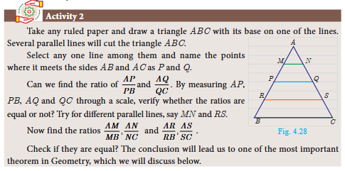
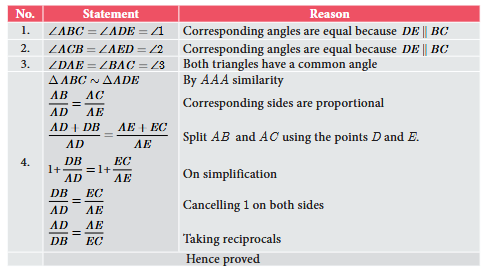
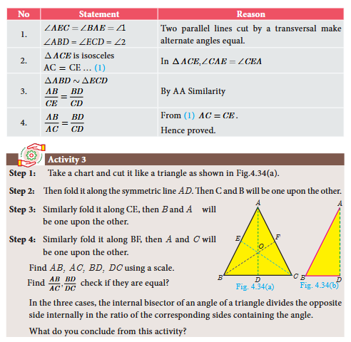
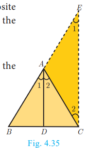
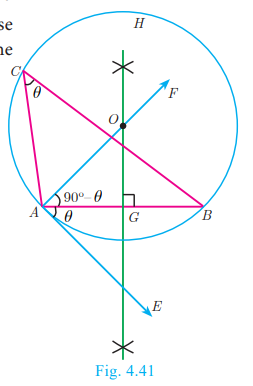
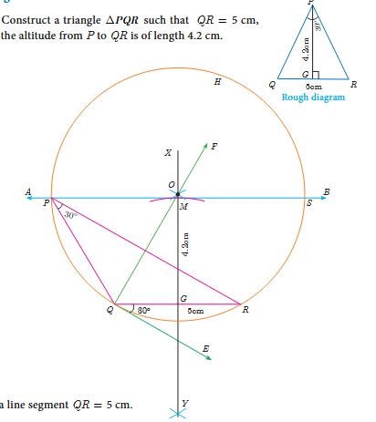

# 4.3 Thales Theorem and Angle Bisector Theorem

## 4.3.1 Introduction

**Thales** (640–540 BC (BCE)), the most famous Greek mathematician and philosopher lived around seventh century BC (BCE). He possessed knowledge to the extent that he became the first of seven sages of Greece. Thales was the first man to announce that any idea that emerged should be tested scientifically and only then it can be accepted. In this aspect, he did great investigations in mathematics and astronomy and discovered many concepts. He was credited for providing first proof in mathematics, which today is called by the name **"Basic Proportionality Theorem"**. It is also called **"Thales Theorem"** named after its discoverer.

The discovery of the Thales theorem itself is a very interesting story. When Thales travelled to Egypt, he was challenged by Egyptians to determine the height of one of several magnificent pyramids that they had constructed. Thales accepted the challenge and used similarity of triangles to determine the same successfully, another triumphant application of Geometry.Since X_0,X_1 and  H_0 are known, we can determine the height   H_1 of the pyramid.


\frac{H_1}{X_1} = \frac{H_0}{X_0}


---

## Theorem 1: Basic Proportionality Theorem (BPT) or Thales Theorem

**Statement:** A straight line drawn parallel to a side of triangle intersecting the other two sides, divides the sides in the same ratio.

**Proof:**


\frac{H_1}{X_1} = \frac{H_0}{X_0}

,   D
 
is a point on   AB

 and   E

  is a point on   AC
.

**To prove:**   \frac{AD}{DB} = \frac{AE}{EC}


**Construction:** Draw a line   DE \parallel BC


## Corollary

If in   \triangle ABC
,
 a straight line   DE
 
 parallel to   BC
,
  intersects   AB
 
  at   D

   and   AC
 
  at   E
, then:
- (i)   \frac{AB}{AD} = \frac{AC}{AE}

- (ii)   \frac{AB}{DB} = \frac{AC}{EC}


**Proof:** In   \triangle ABC
,
   DE \parallel BC
,

  \frac{AD}{DB} = \frac{AE}{EC} \text{ (by Basic Proportionality Theorem)}


(i) Taking reciprocals, we get   \frac{DB}{AD} = \frac{EC}{AE}


Add 1 to both sides:   \frac{DB}{AD} + 1 = \frac{EC}{AE} + 1


  \frac{DB + AD}{AD} = \frac{EC + AE}{AE} \Rightarrow \frac{AB}{AD} = \frac{AC}{AE}


(ii) Similarly,   \frac{AD + DB}{DB} = \frac{AE + EC}{EC}


Therefore,   \frac{AB}{DB} = \frac{AC}{EC}


---

## Theorem 2: Converse of Basic Proportionality Theorem

**Statement:** If a straight line divides any two sides of a triangle in the same ratio, then the line must be parallel to the third side.

**Proof:**

**Given:** In   \triangle ABC
,
   \frac{AD}{DB} = \frac{AE}{EC}


**To prove:**   DE \parallel BC


**Construction:** If   DE
 
is not parallel to   BC
,
 draw   DF \parallel BC
.

---

## Theorem 3: Angle Bisector Theorem

**Statement:** The internal bisector of an angle of a triangle divides the opposite side internally in the ratio of the corresponding sides containing the angle.

**Proof:**

**Given:** In   \triangle ABC
,
   AD
 is the internal bisector

**To prove:**   \frac{AB}{AC} = \frac{BD}{CD}


**Construction:** Draw a line through   C
 parallel to
   AB
. 
Extend   AD

 to meet line through   C
 
 at   E
.

---

## Theorem 4: Converse of Angle Bisector Theorem

**Statement:** If a straight line through one vertex of a triangle divides the opposite side internally in the ratio of the other two sides, then the line bisects the angle internally at the vertex.

**Proof:**

**Given:**   ABC
 
is a triangle.   AD

 divides   BC
 
 in the ratio of the sides containing the angles   \angle A
 
 to meet   BC

  at   D
.

  \frac{AB}{AC} = \frac{BD}{DC} \text{ ... (1)}


**To prove:**   AD
 
bisects   \angle A
 
i.e.   \angle 1 = \angle 2


**Construction:** Draw   CE \parallel DA
. 
Extend   BA
 to meet at 
  E
.

---

## Examples

### Example 4.12

In   \triangle ABC
,
   DE \parallel BC
,
  if   AD = x
,
     DB = x - 2
,
      AE = x + 2

     and   EC = x - 1
 
     then find the lengths of the sides   AB

      and   AC
.

**Solution:** In   \triangle ABC

 we have   DE \parallel BC
.

By Thales theorem, we have:

  \frac{AD}{DB} = \frac{AE}{EC}


  \frac{x}{x-2} = \frac{x+2}{x-1}


Gives   x(x-1) = (x-2)(x+2)


Hence,   x^2 - x = x^2 - 4
 
so,   x = 4


When   x = 4
,
   AD = 4
, 
  DB = x - 2 = 2
,
   AE = x + 2 = 6
,
    EC = x - 1 = 3
.

Hence,   AB = AD + DB = 4 + 2 = 6
,
   AC = AE + EC = 6 + 3 = 9
.

Therefore,   AB = 6
,
   AC = 9
.

---

### Example 4.13

  D
 and
   E
 are respectively the points on the sides 
   AB
 
 and   AC

 of a   \triangle ABC

  such that   AB = 5.6
 
  cm,   AD = 1.4
 cm,
     AC = 7.2
 cm 
   and   AE = 1.8
 cm, 
   show that   DE \parallel BC
.

**Solution:** We have   AB = 5.6
 cm, 
  AD = 1.4
 cm, 
  AC = 7.2
 
cm and   AE = 1.8
 cm.

  BD = AB - AD = 5.6 - 1.4 = 4.2
 cm

and   EC = AC - AE = 7.2 - 1.8 = 5.4
 cm.

  \frac{AD}{DB} = \frac{1.4}{4.2} = \frac{1}{3} \text{ and } \frac{AE}{EC} = \frac{1.8}{5.4} = \frac{1}{3}


  \frac{AD}{DB} = \frac{AE}{EC}


Therefore, by converse of Basic Proportionality Theorem, we have   DE

 is parallel to   BC
. Hence proved.

---

### Example 4.14

In the figure,   DE \parallel AC

 and   DC \parallel AP
. 
 Prove that   \frac{BE}{EC} = \frac{BC}{CP}
.

**Solution:** In   \triangle BPA
,
 we have   DC \parallel AP
. By Basic Proportionality Theorem,

  \frac{BC}{CP} = \frac{BD}{DA} \text{ ... (1)}


In   \triangle BCA
,
 we have   DE \parallel AC
. By Basic Proportionality Theorem,

  \frac{BE}{EC} = \frac{BD}{DA} \text{ ... (2)}


From (1) and (2) we get,   \frac{BE}{EC} = \frac{BC}{CP}
. Hence proved.

---

### Example 4.15

In the figure,   AD
 
is the bisector of   \angle A
.
 If   BD = 4
 cm, 
   DC = 3
 cm and 
   AB = 6
 cm, 
 find   AC
.

**Solution:** In   \triangle ABC
,
   AD
 is the bisector of
    \angle A


By Angle Bisector Theorem:

  \frac{BD}{DC} = \frac{AB}{AC}


  \frac{4}{3} = \frac{6}{AC}


Gives   4AC = 18
. 
Hence,   AC = \frac{18}{4} = 4.5
 cm

---

### Example 4.16

In the figure,   AD
 
is the bisector of   \angle BAC
, 
if   AB = 10
 cm,
   AC = 14
 cm and
    BC = 6
 cm. Find 
    BD
 and 
    DC
.

**Solution:** Let   BD = x
 cm,
 then   DC = (6 - x)
 cm

  AD
 is the bisector of
   \angle A


By Angle Bisector Theorem:

  \frac{AB}{AC} = \frac{BD}{DC}


  \frac{10}{14} = \frac{x}{6-x}


  \frac{5}{7} = \frac{x}{6-x}


  5(6-x) = 7x
 
gives   30 - 5x = 7x
, 
so   12x = 30
, we get 
  x = \frac{30}{12} = 2.5
 cm

Therefore,   BD = 2.5
 cm, 
  DC = 6 - x = 6 - 2.5 = 3.5
 cm

---

## 4.3.2 Construction of Triangle

### Construction of a segment of a circle on a given line segment containing an angle   \theta


**Construction:**
- **Step 1:** Draw a line segment   AB
.
- **Step 2:** At   A
, 
take   \angle BAE = \theta
. 
Draw   AE
.
- **Step 3:** Draw   AF \perp AE
.
- **Step 4:** Draw the perpendicular bisector of   AB
 meeting
   AF
 
at   O
.
- **Step 5:** With   O
 
as centre and   OA
 
as radius draw a circle   ABH
.
- **Step 6:** Take any point   C

 on the circle. By the alternate segments theorem,   \angle ACB
 is the required segment of the circle containing the angle
    \theta
.

**Note:** If   C_1, C_2, ...

 are points on the circle, then all the triangles   \triangle BAC_1, \triangle BAC_2, ...
 are with same base and the same vertical angle.

---

### Construction of a triangle when its base, the vertical angle and the median from the vertex of the base are given.

**Example 4.17** Construct a   \triangle PQR
 
in which   PQ = 8
 cm,
   \angle R = 60°

  and the median   RG
 
  from   R

   to   PQ
 is 
    5.8
 cm.
   Find the length of the altitude from   R

    to   PQ
.

**Construction:**
- **Step 1:** Draw a line segment   PQ = 8
 cm.
- **Step 2:** At   P
,
 draw   PE
 such that 
   \angle QPE = 60°

- **Step 3:** At   P
,
 draw   PF
 such that 
   \angle EPF = 90°
.
- **Step 4:** Draw the perpendicular bisector to   PQ
,
 which intersects   PF
 
 at   O
 and
    PQ
 at 
    G
.
- **Step 5:** With   O
 
as centre and   OP
 as radius draw a circle.
- **Step 6:** From   G

 mark arcs of radius   5.8

  cm on the circle. Mark them as   R

   and   S
.
- **Step 7:** Join   PR
 
and   QR
.
   \triangle PQR
 is the required triangle.
- **Step 8:** From   R
 
draw a line   RN
 
perpendicular to   LQ
.
   LQ
 meets
    RN
 
  at   M
.
- **Step 9:** The length of the altitude is   RM = 3.8
 cm

**Note:** We can get another   \triangle PQS
 for the given measurements.

---

### Construction of a triangle when its base, the vertical angle and the altitude from the vertex to the base are given.

**Example 4.18** Construct a triangle   \triangle PQR
 such that
   QR = 5

 cm,   \angle P = 30°

  and the altitude from   P

  
   to   QR
 is of length
      4.2
 cm.

**Construction:**
- **Step 1:** Draw a line segment   QR = 5
 cm.
- **Step 2:** At   Q
 draw
   QE
 such that
    \angle RQE = 30°
.
- **Step 3:** At   Q
 
draw   QF
 
such that   \angle EQF = 90°
.
- **Step 4:** Draw the perpendicular bisector   XY
 to 
  QR
 which intersects
   QF

  at   O

   and   QR
 
 at   G
.
- **Step 5:** With   O
 
as centre and   OQ
 as radius draw a circle.
- **Step 6:** From   G
 
mark an arc in the line   XY

 at   M
, such that
    GM = 4.2
 cm.
- **Step 7:** Draw   AB

 through   M
 
 which is parallel to   QR
.
- **Step 8:**   AB

 meets the circle at   P

  and   S
.
- **Step 9:** Join   QP
 
and   RP
. Then
   \triangle PQR
 is the required triangle.

**Note:**   \triangle SQR
 is another required triangle for the given measurements.

---

### Construction of a triangle when its base, the vertical angle and the point on the base where the bisector of the vertical angle meets the base

**Example 4.19** Draw a triangle   ABC
 
of base   BC = 8
 cm,
   \angle A = 60°
 
 and the bisector of   \angle A
 
 meets   BC
 at
    D
 such that 
    BD = 6
 cm.

**Construction:**
- **Step 1:** Draw a line segment   BC = 8
 cm.
- **Step 2:** At   B
,
 draw   BE
 such that
    \angle CBE = 60°
.
- **Step 3:** At   B
, 
draw   BF
 such that 
  \angle EBF = 90°
.
- **Step 4:** Draw the perpendicular bisector to   BC
, which intersects
   BF
 at 
   O
 
 and   BC
 at 
   G
.
- **Step 5:** With   O

 as centre and   OB
 as radius draw a circle.
- **Step 6:** From   B
,
 mark an arc of   6
 
 cm on   BC
 
 at   D
.
- **Step 7:** The perpendicular bisector intersects the circle at   I
. 
Join   ID
.
- **Step 8:**   ID
 
produced meets the circle at   A
.
 Now join   AB
 and 
   AC
.
  Then   \triangle ABC
 is the required triangle.

## Exercise 4.2

1. In ΔABC, D and E are points on the sides AB and AC respectively such that DE || BC.
   (i) If AD/DB = 3/4 and AC = 15cm find AE.
   (ii) If AD = x - 8/7, DB = x - 5/3, AE = x - 4/3 and EC = x - 3/1, find the value of x.

2. ABCD is a trapezium in which AB || DC and P, Q are points on AD and BC respectively, such that PQ || DC if PD = 18cm, BQ = 35cm and QC = 15cm, find AD.

3. In ΔABC, D and E are points on the sides AB and AC respectively. Show that DE || BC if AB = 12cm, AD = 8cm, AE = 12cm and AC = 18cm.

4. In fig. if PQ || BC and PR || CD prove that:
   (i) AR/AD = AQ/AB
   (ii) QB/AQ = DR/AR

   

5. Rhombus PQRB is inscribed in ΔABC such that ∠B is one of its angle. P, Q and R lie on AB, AC and BC respectively. If AB = 12cm and BC = 6cm, find the sides PQ, RB of the rhombus.

6. In trapezium ABCD, AB || DC, E and F are points on non-parallel sides AD and BC respectively, such that EF || AB. Show that AE/ED = BF/FC.

7. In figure DE || BC and CD || EF. Prove that AD² = AB × AF.

8. Check whether AD is bisector of ∠A of ΔABC in each of the following:
   (i) AB = 5cm, AC = 10cm, BD = 1.5cm and CD = 3.5cm.
   (ii) AB = 4cm, AC = 6cm, BD = 1.6cm and CD = 2.4cm.

9. In figure ∠QPR = 90°, PS is its bisector. If ST ⊥ PR, prove that ST × (PQ + PR) = PQ × PR.

10. ABCD is a quadrilateral in which AB = AD, the bisector of ∠BAC and ∠CAD intersect the sides BC and CD at the points E and F respectively. Prove that EF || BD.

11. Construct a ΔPQR with the base PQ = 4.5cm, ∠R = 35° and the median RG from R to PQ is 6cm.

12. Construct a ΔPQR in which QR = 5cm, ∠P = 40° and the median PG from P to QR is 4.4cm. Find the length of the altitude from P to QR.

13. Construct a ΔPQR such that QR = 6.5cm, ∠P = 60° and the altitude from P to QR is of length 4.5cm.

14. Construct a ΔABC such that AB = 5.5cm, ∠C = 25° and the altitude from C to AB is 4cm.

15. Draw a triangle ABC of base BC = 5.6cm, ∠A = 40° and the bisector of ∠A meets BC at D such that CD = 4cm.

16. Draw ΔPQR such that PQ = 6.5cm, vertical angle is 50° and the bisector of the vertical angle meets the base at D where PD = 5.2cm.

---