# Chapter 7

## MENSURATION

"Nature is an infinite sphere of which the centre is everywhere and the circumference nowhere". - Blaise Pascal

Pappus, born at Alexandria, Egypt is the last of the great Greek geometers. Pappus major work 'Synagogue' or 'The Mathematical Collection' is a collection of mathematical writings in eight books.

He described the principles of levers, pulleys, wedges, axles and screws. These concepts are widely applied in Physics and modern Engineering Science.

<center>

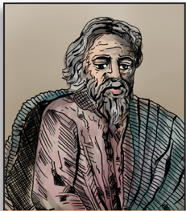

Pappus (290 - 350 AD)
</center>

---

## Learning Outcomes

To determine the surface area and volume of cylinder, cone, sphere, hemisphere and frustum. To compute volume and surface area of combined solids. To solve problems involving conversion of solids from one shape to another with no change in volume.

---

### 7.1 Introduction


The ancient cultures throughout the world sought the idea of measurements for

satisfying their daily needs. For example, they had to know how much area of crops needed to be grown in a given region; how much could a container hold? etc. These questions were very important for making decisions in agriculture and trade. They needed efficient and compact way of doing this. It is for this reason, mathematicians thought of applying geometry to real life situations to attain useful results. This was the reason for the origin

of mensuration. Thus, mensuration can be thought as applied geometry.

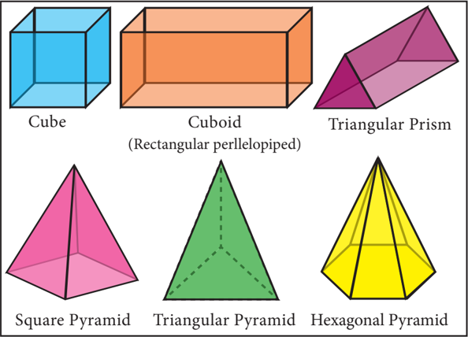

We are already familiar with the areas of plane figures like square, rectangle, triangle, circle etc. These figures are called 2-dimensional shapes as they can be drawn in a plane. But most of the objects which we come across in our daily life cannot be represented in a plane. For example, tubes, water tanks, bricks, ice-cream cones, football etc. These objects are called solid shapes or 3-dimensional shapes.

We often see solids like cube, cuboid, prism and pyramid. For three dimensional objects measurements like surface area and volume exist.

In this chapter, we shall study about the surface area and volume of some of the standard solid shapes such as cylinder, cone, sphere, hemisphere and frustum.

### 7.2 Surface Area

Surface area is the measurement of all exposed area of a solid object.

#### 7.2.1 Right Circular Cylinder

Observe the given figures in Fig.7.2 and identify the shape.

These objects resemble the shape of a cylinder.

A right circular cylinder is a solid generated by the revolution of a rectangle about one of its sides as axis.

If the axis is perpendicular to the radius then the cylinder is called a right circular cylinder. In the Fig.7.3, AB = h represent the height and AD = r r represent the radius of the cylinder. D

A solid cylinder is an object bounded by two circular plane surfaces and a curved surface. The area between the two circular bases is called its 'Lateral Surface Area' (L.S.A.) or 'Curved Surface Area' (C.S.A.).

**Formation of a Right Circular Cylinder – Demonstration**

- (i) Take a rectangle sheet of a paper of length l and breadth b .
- (ii) Revolve the paper about one of its sides, say b to complete a full rotation (without overlapping).
- (iii) The shape thus formed will be a right circular cylinder whose . l

circumference of the base is l and the height is b

10th 270 Standard Mathematics

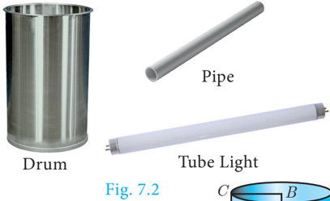

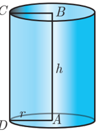

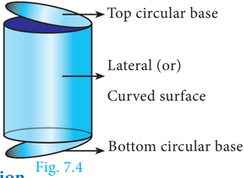

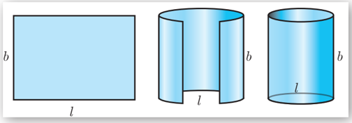

**Surface Area of a Right Circular Cylinder**

**(i) Curved surface area**

Curved surface area (C.S.A.) of a right circular cylinder

= Area of the corresponding rectangle

=×lb

=× 2prh ( l is the circumference

= 2prh of the base, b is the height)[see Fig. 7.5]

**C.S.A. of a right circular cylinder = 2prh sq. units.**

**(ii) Total surface area**

Total surface area refers to the sum of areas of the curved surface area and the two circular regions at the top and bottom.

That is, total surface area (T.S.A.) of right circular cylinder

C.S.A + Area of top circular region

T.S.A. of a right circular cylinder =+ 2prh() r sq. units

- ¾ We always consider p = 22 7 , unless otherwise stated.
- ¾ The term 'surface area' refers to 'total surface area'.

Example 7.1 A cylindrical drum has a height of 20 cm and base radius of 14 cm. Find its curved surface area and the total surface area.

Given that, height of the cylinder h = 20 cm ; radius r =14 cm

Now, C.S.A. of the cylinder = 2prh sq. units

Therefore, C.S.A. = 1760 cm 2 and T.S.A. = 2992 cm2

Example 7.2 The curved surface area of a right circular cylinder of height 14 cm is 88 cm 2 . Find the diameter of the cylinder.

Given that, C.S.A. of the cylinder =88 sq. cm

Therefore, diameter = 2 cm

Example 7.3 A garden roller whose length is 3 m long and whose diameter is 2 . 8 m is rolled to level a garden. How much area will it cover in 8 revolutions?

Given that, diameter d = 2 . 8 m and height = 3 m

Area covered in one revolution = curved surface area of the cylinder

Area covered in 1 revolution = 26.4 m2

Area covered in 8 revolutions =×8264. . = 211.2

Therefore, area covered is 211.2 m 2

**Thinking Corner**

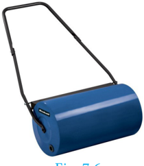

- When 'h' coins each of radius 'r' units and thickness 1 unit is stacked one upon the other, what would be the solid object you get? Also find its C.S.A.
- When the radius of a cylinder is double its height, find the relation between its C.S.A. and base area.
- Two circular cylinders are formed by rolling two rectangular aluminum sheets each of dimensions 12 m length and 5 m breadth, one by rolling along its length and the other along its width. Find the ratio of their curved surface areas.

#### 7.2.2 Hollow Cylinder

An object bounded by two co-axial cylinders of the same height and different radii is called a 'hollow cylinder'.

Let R and r be the outer and inner radii of the cylinder. Let h be its height.

C.S.A of the hollow cylinder = outer C.S.A. of the cylinder + inner C.S.A. of the cylinder

C.S.A of a hollow cylinder=+ 2p() Rr h sq. units T.S.A. of the hollow cylinder =C.S.A. + Area of two rings at the top and bottom.

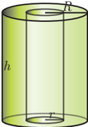

T.S.A. of a hollow cylinder=+ 2p() Rr () Rr −+ h sq. units

Example 7.4 If one litre of paint covers 10 m 2 , how many litres of paint is required to paint the internal and external surface areas of a cylindrical tunnel whose thickness is 2 m, internal radius is 6 m and height is 25 m.

Given that, height h = 25 m; thickness = 2 m

internal radius r r = 6 m

Now, external radius R =+62 = 8 m

C.S.A. of the cylindrical tunnel = C.S.A. of the hollow cylinder Fig. 7.8

C.S.A. of the hollow cylinder =+ 2p() Rr h sq. units

Hence, C.S.A. of the cylindrical tunnel = 2200 m 2

Area covered by one litre of paint = 10 m 2

Therefore, 220 litres of paint is needed to paint the tunnel.

**Progress Check**

- Right circular cylinder is a solid obtained by revolving _______ about _______.
- In a right circular cylinder the axis is _______to the diameter.
- The difference between the C.S.A. and T.S.A. of a right circular cylinder is ______.
- The C.S.A. of a right circular cylinder of equal radius and height is ________ the area of its base.

#### 7.2.3 Right Circular Cone

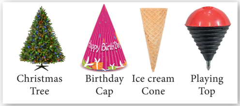

Observe the given figures in Fig.7.9 and identify which solid shape they represent?

These objects resemble the shape of a cone.

*Fig. 7.9*

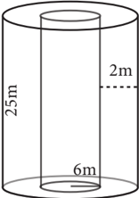

A right circular cone is a solid generated by the revolution of a right angled triangle about one of the sides containing the right angle as axis.

**Formation of a Right Circular Cone - Demonstration**

**Surface area of a right circular cone**

Suppose the surface area of the cone is cut along the hypotenuse AC and then unrolled on a plane, the surface area will take the form of a sector ACD, of which the radius AC and the arc CD are respectively the slant height and the circumference of the base of the cone.

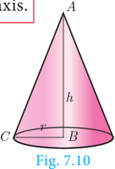

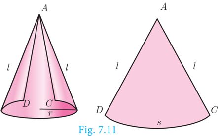

Here the sector of radius 'l' and arc length 's' will be similar to a circle of radius l l .

**(i) Curved surface area**

|  |  | \n |
| --- | --- | \n |
| Area of  sector the | Arclengthofthe sector | \n |
| Area of  circle the | =  Circumferenceofthe circle | \n |
| Area of the sector | =  Arclengthofthe sector Circumferenceofthe circle ´Area of thecircle | \n |
|  | =×  =× s l l  s  l l22p 2 p p  =× 2 2 pr  l  (  sr = 2p  ) |  |

- ∴ Curved Surface Area of the cone = Area of the Sector = prl sq. units.

C.S.A. of a right circular cone = prl sq. units.

**Thinking Corner**

- Give practical example of solid cone.
- Find surface area of a cone in terms of its radius when height is equal to radius.
- Compare the above surface area with the area of the base of the cone.

**Activity 1**

- (i) Take a semi-circular paper with radius 7 cm and make it a cone. Find the C.S.A. of the cone.
- (ii) Take a quarter circular paper with radius 3 . 5 cm and make it a cone. Find the C.S.A. of the cone.

10th 274 Standard Mathematics

**Derivation of slant height ' l'**

ABC is a right angled triangle, right angled at B. The hypotenuse, base and height of the triangle are represented by l, l, r r and h respectively.

Now, using Pythagoras theorem in DABC ,

**(ii) Total surface area**

Total surface area of a cone = C.S.A. + base area of the cone

=+ pp rl r 2 ( the base is a circle)

T.S.A. of a right circular cone=+ prl() r sq. units.

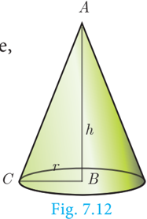

Example 7.5 The radius of a conical tent is 7 m and the height is 24 m. Calculate the length of the canvas used to make the tent if the width of the rectangular canvas is 4 m? Solution Let r and h be the radius and height of the cone respectively.

Given that, radius r =7 m and height h = 24 m

C.S.A. of the conical tent = p rl sq. units

Therefore, the length of the canvas is137.5 m

Example 7.6 If the total surface area of a cone of radius 7cm is 704 cm 2 , then find its slant height.

Given that, radius r = 7 cm

Now, total surface area of the cone =+ prl() r sq. units

Therefore, slant height of the cone is 25 cm.

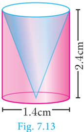

Example 7.7 From a solid cylinder whose height is 2 . 4 cm and diameter 1 . 4 cm, a conical cavity of the same height and base is hollowed out (Fig.7 . 13). Find the total surface area of the remaining solid.

Let h and r be the height and radius of the cone and cylinder.

Let l be the slant height of the cone.

Given that, h = 2.4 cm and d = 1.4 cm ; r = 0.7 cm

Total surface area of the remaining solid = C.S.A. of the cylinder + C.S.A. of the cone + area of the bottom

2 --- 2 --- 2 --- 2 --- 2 --- 2 --- 2 --- 2 --- 2 --- 2 --- 2 --- 2 --- 2 --- 2 --- 2 --- 2 --- 2 --- 2 --- 2 --- 2 --- 2 --- 2 --- 2 --- 2 --- 2 --- 2 --- 2 --- 2 --- 2 --- 2 --- 2 --- 2 --- 2 --- 2 --- 2 --- 2 --- 2 --- 2 --- 2 --- 2 --- 2 --- 2 --- 2 --- 2 --- 2 --- 2 --- 2 --- 2 --- 2 --- 2 --- 2 --- 2 --- 2 --- 2 --- 2 --- 2 --- 2 --- 2 --- 2 --- 2 --- 2 --- 2 --- 2 --- 2 --- 2 --- 2 --- 2 --- 2 --- 2 --- 2 --- 2 --- 2 --- 2 --- 2 --- 2 --- 2 --- 2 --- 2 --- 2 --- 2 --- 2 --- 2 --- 2 --- 2 --- 2 --- 2 --- 2 --- 2 --- 2 --- 2 --- 2 --- 2 --- 2 --- 2 --- 2 --- 2 --- 2 --- 2 --- 2 --- 2 ---

rh rl

=+ 2 prh

+ pp rh
+ h () 2 lr +

=+ prh (2

lr +

sq. units

Now,

l =

2 Transcribe only the visible text in the original language/script. Preserve the exact words, script, punctuation, capitalization, and line content. Return only the visible text once as plain text. 2 Transcribe only the visible text in the original language/script. Preserve the exact words, script, punctuation, capitalization, and line content. Return only the visible text once as plain text. 2 Transcribe only the visible text in the original language/script. Preserve the exact words, script, punctuation, capitalization, and line content. Return only the visible text once as plain text. 2 Transcribe only the visible text in the original language/script. Preserve the exact words, script, punctuation, capitalization, and line content. Return only the visible text once as plain text. 2 Transcribe only the visible text in the original language/script. Preserve the exact words, script, punctuation, capitalization, and line content. Return only the visible text once as plain text. 2 Transcribe only the visible text in the original language/script. Preserve the exact words, script, punctuation, capitalization, and line content. Return only the visible text once as plain text. 2 Transcribe only the visible text in the original language/script. Preserve the exact words, script, punctuation, capitalization, and line content. Return only the visible text once as plain text. 2 Transcribe only the visible text in the original language/script. Preserve the exact words, script, punctuation, capitalization, and line content. Return only the visible text once as plain text. 2 Transcribe only the visible text in the original language/script. Preserve the exact words, script, punctuation, capitalization, and line content. Return only the visible text once as plain text. 2 Transcribe only the visible text in the original language/script. Preserve the exact words, script, punctuation, capitalization, and line content. Return only the visible text once as plain text. 2

5 cm

Therefore, total surface area of the remaining solid is 17 . 6 cm 2

**Progress Check**

- Right circular cone is a solid obtained by revolving ____ about ____.
- In a right circular cone the axis is ____ to the diameter.
- The difference between the C.S.A. and T.S.A. of a cone is ____.
- When a sector of a circle is transformed to form a cone, then match the conversions taking place between the sector and the cone.

| Sector | Cone | \n |
| --- | --- | \n |
| Radius | Circumference of the base | \n |
| Area | Slant height | \n |
| Arc length | Curved surface area |  |

#### 7.2.4 The Sphere

A sphere is a solid generated by the revolution of a semicircle about its diameter as axis.

10th 276 Standard Mathematics Every plane section of a sphere is a circle. The line of section of a sphere by a plane passing through the centre of the sphere is called a great circle all other plane sections are called small circles. Q R

As shown in the diagram, circle with CD as diameter is a great circle, whereas, the circle with QR as diameter is a small circle.

**Surface area of a sphere Archimedes Proof**

Place a sphere inside a right circular cylinder of equal diameter and height. Then the height of the cylinder will be the diameter of the sphere. In this case, Archimedes proved that the outer area of the sphere is same as curved surface area of the cylinder.

Surface area of sphere =curved surface area of cylinder

Surface area of a sphere = 4 2 pr sq.units

**Activity 2**

- (i) Take a sphere of radius 'r'.

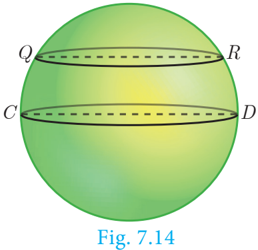

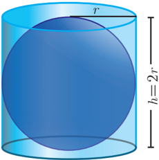

- (ii) Take a cylinder whose base diameter and height are equal to the diameter of the sphere.
- (iii) Now, roll thread around the surface of the sphere and the cylinder without overlapping and leaving space between the threads.
- (iv) Now compare the length of the two threads in both the cases.
- (v) Use this information to find surface area of sphere.

#### 7.2.5 Hemisphere

A section of the sphere cut by a plane through any of its great circle is a hemisphere.

By doing this, we observe that a hemisphere is exactly half the portion of the sphere.

C.S.A. of a hemisphere = 2 2 pr sq.units

T.S.A. of a hemisphere = 3 2 pr sq.units

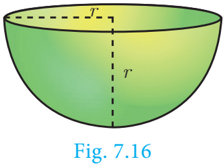

#### 7.2.6 Hollow Hemisphere

Let the inner radius be r and outer radius be R ,

Therefore,

Example 7.8 Find the diameter of a sphere whose surface area is 154 m 2 .

Let r be the radius of the sphere.

Given that, surface area of sphere = 154 m 2

Therefore, diameter is 7 m

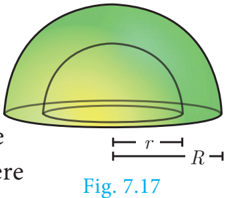

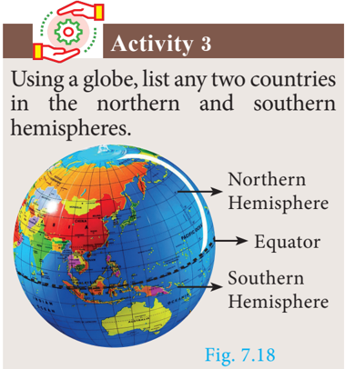

Example 7.9 The radius of a spherical balloon increases from 12 cm to 16 cm as air being pumped into it. Find the ratio of the surface area of the balloons in the two cases.

Therefore, ratio of C.S.A. of balloons is 9:16 .

**Thinking Corner**

- Find the value of the radius of a sphere whose surface area is 36p sq. units.
- How many great circles can a sphere have?
- Find the surface area of the earth whose diameter is 12756 kms.

10th 278 Standard Mathematics

- Every section of a sphere by a plane is a ____________.
- The centre of a great circle is at the ____________ of the sphere.
- The difference between the T.S.A. and C.S.A. of hemisphere is ______.
- The ratio of surface area of a sphere and C.S.A. of hemisphere is _________.
- A section of the sphere by a plane through any of its great circle is ________.

Example 7.10 If the base area of a hemispherical solid is 1386 sq. metres, then find its total surface area?

Let r be the radius of the hemisphere.

For finding the C.S.A. and T.S.A. of a hollow sphere, the formulla for finding the surface area of a sphere can be used.

Given that, base area = pr 2 =

=×3 1386 = 4158

Therefore, T.S.A. of the hemispherical solid is 4158 m 2 .

**Thinking Corner**

- Shall we get a hemisphere when a sphere is cut along the small circle?
- T.S.A of a hemisphere is equal to how many times the area of its base?
- How many hemispheres can be obtained from a given sphere?

Example 7.11 The internal and external radii of a hollow hemispherical shell are 3 m and 5 m respectively. Find the T.S.A. and C.S.A. of the shell.

Let the internal and external radii of the hemispherical shell be r and R respectively.

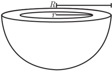

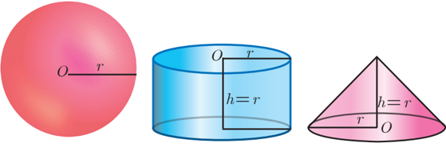

Example 7.12 A sphere, a cylinder and a cone are of the same height which is equal to its radius, where as cone and cylinder are of same height. Find the ratio of their curved surface areas.

*Fig. 7.20*

Required Ratio = C.S.A. of the sphere: C.S.A. of the cylinder : C.S.A. of the cone

= 42 2pr: 2 2 pp rr :: h : hrp l

= 42:: 2 = 22 :: 21

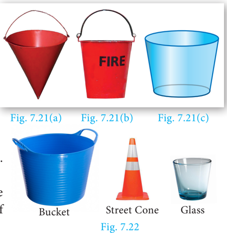

#### 7.2.7 Frustum of a right circular cone

In olden days a cone shaped buckets [Fig.7.21(a)] filled with sand / water were used to extinguish fire during fire accidents. Later, it was reshaped to a round shaped bottom [Fig.7.21(b)] to increase its volume.

The shape in [Fig.7.21(c)] resembling a inverted bucket is called as a frustrum of a cone.

The objects which we use in our daily life such as glass, bucket, street cone are examples of frustum of a cone. (Fig.7.22)

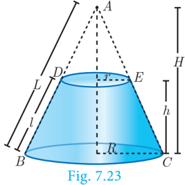

**Definition**

When a cone ABC is cut through by a plane parallel to its base, the portion of the cone DECB between the cutting plane and the base is called a frustum of the cone.

**Surface area of a frustum**

Let R and r be radii of the base and top region of the frustum DECB respectively, h is the height and l is the slant height of the same.

Therefore, C.S.A. = 1 2 (sum of the perimeters of base and top region) × slant height

C.S.A. of a frustum=+ p() Rr l sq. units

T.S.A. = C.S.A. + Area of the bottom circular region + Area of the top circular region.

10th 280 Standard Mathematics

Example 7.13 The slant height of a frustum of a cone is 5 cm and the radii of its ends are 4 cm and 1 cm. Find its curved surface area.

Let l, R and r be the slant height, top radius and bottom radius of the frustum.

Given that, l=5 cm, R =4 cm, r =1 cm

Now, C.S.A. of the frustum =+ p() Rr l sq. units

Therefore, C.S.A. = 78 . 57 cm 2

**Thinking Corner**

- Give two real life examples for a frustum of a cone.
- Can a hemisphere be considered as a frustum of a sphere.

Example 7.14 An industrial metallic bucket is in the shape of the frustum of a right circular cone whose top and bottom diameters are 10 m and 4 m and whose height is 4 m. Find the curved and total surface area of the bucket.

Let h, l, R and r be the height, slant height, top radius and bottom radius of the frustum.

Given that, diameter of the top =10 m; radius of the top R = 5 m.

diameter of the bottom = 4 m; radius of the bottom r = 2 m, height h= 4 m

Therefore, C.S.A. = 110 m 2 and T.S.A. = 122.57 m2

**Progress Check**

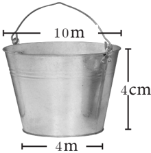

- The portion of a right circular cone intersected between two parallel planes is _________.
- How many frustums can a right circular cone have?


- The radius and height of a cylinder are in the ratio 5:7 and its curved surface area is 5500 sq.cm. Find its radius and height.
- A solid iron cylinder has total surface area of 1848 sq.cm. Its curved surface area is five – sixth of its total surface area. Find the radius and height of the iron cylinder.
- The external radius and the length of a hollow wooden log are 16 cm and 13 cm respectively. If its thickness is 4 cm then find its T.S.A.
- 4 persons live in a conical tent whose slant height is 19 m. If each person require 22 m 2 of the floor area, then find the height of the tent.
- A girl wishes to prepare birthday caps in the form of right circular cones for her birthday party, using a sheet of paper whose area is 5720 cm 2 , how many caps can be made with radius 5 cm and height 12 cm.
- The ratio of the radii of two right circular cones of same height is 1:3. Find the ratio of their curved surface area when the height of each cone is 3 times the radius of the smaller cone.
- The radius of a sphere increases by 25%. Find the percentage increase in its surface area.
- The internal and external diameters of a hollow hemispherical vessel are 20 cm and 28 cm respectively. Find the cost to paint the vessel all over at ` 0 . 14 per cm 2 . 6cm
- The frustum shaped outer portion of the table lamp has to be painted including the top part. Find the total cost of painting the lamp if the cost of painting 1 sq.cm is ` 2 .

### 7.3 Volume

Having discussed about the surface areas of cylinder, cone, sphere, hemisphere and frustum, we shall now discuss about the volumes of these solids.

Volume refers to the amount of space occupied by an object. The volume is measured in cubic units.

#### 7.3.1 Volume of a solid right circular cylinder

Therefore, Volume of a cylinder = prh2 2 cu. units.

10th 282 Standard Mathematics

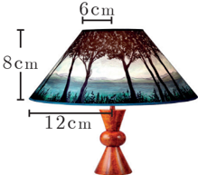

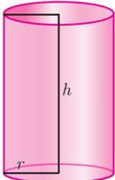

#### 7.3.2 Volume of a hollow cylinder (volume of the material used)

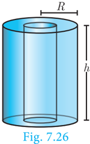

Let the internal and external radii of a hollow cylinder be r and R units respectively. If the height of the cylinder is h units then

The volume

Example 7.15 Find the volume of a cylinder whose height is 2 m and whose base area is 250 m2 .

Let r and h be the radius and height of the cylinder respectively.

Given that, height h = 2 m, base area = 250 m 2

Now, volume of a cylinder = prh2 2 cu. units

=× base area h

Therefore, volume of the cylinder = 500 m 3

**Thinking Corner**

- If the height is inversely proportional to the square of its radius, the volume of the cylinder is ____________.
- What happens to the volume of the cylinder with radius r and height h, when its (a) radius is halved (b) height is halved.

Example 7.16 The volume of a cylindrical water tank is 1 . 078 × 106 litres. If the diameter of the tank is 7 m, find its height.

Let r and h be the radius and height of the cylinder respectively.

Given that, volume of the tank =× 1 078 . 10 6 . = 1078000 litre

volume of the tank = p rh2 2 cu. units

Therefore, height of the tank is 28 m Example 7.17 Find the volume of the iron used to make a hollow cylinder of height 9 cm and whose internal and external radii are 21 cm and 28 cm respectively.

Let r, R and h be the internal radius, external radius and height of the hollow cylinder respectively.

Given that, r =21cm, R = 28 cm, h = 9 cm

Therefore, volume of iron used = 9702 cm 3

Example 7.18 For the cylinders A and B (Fig. 7.27),

- (i) find out the cylinder whose volume is greater.
- (ii) verify whether the cylinder with greater volume has greater total surface area.
- (iii) find the ratios of the volumes of the cylinders A and B .

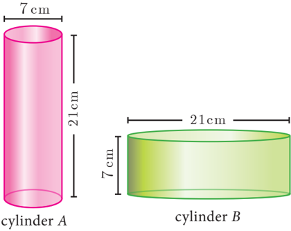

**Solution**

- (i) Volume of cylinder = prh2 2 cu. units

Therefore, volume of cylinder B is greater than volume of cylinder A .

*Fig. 7.27*

- (ii) T.S.A. of cylinder =+ 2prh() r sq. units

Hence verified that cylinder B with greater volume has a greater surface area.

Therefore, ratio of the volumes of cylinders A and B is 1:3 .

10th 284 Standard Mathematics

#### 7.3.3 Volume of a right circular cone

Let r and h be the radius and height of a cone then its volume

**Demonstration**

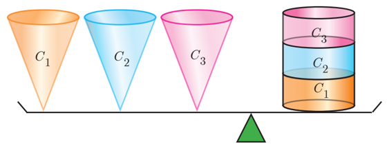

From , Fig.7.28 we see that,

3× (Volume of a cone)

- z Consider a right circular cylinder and three right circular cones of same base radius and height as that of the cylinder.
- z The contents of three cones will exactly occupy the cylinder.

Example 7.19 The volume of a solid right circular cone is 11088 cm 3 . If its height is 24 cm then find the radius of the cone.

Let r and h be the radius and height of the cone respectively.

Given that, volume of the cone =11088 cm 3

Therefore, radius of the cone r = 21 cm

**Thinking Corner**

- Is it possible to find a right circular cone with equal
- (a) height and slant height (b) radius and slant height (c) height and radius.
- There are two cones with equal volumes. What will be the ratio of their radius and height?

Example 7.20 The ratio of the volumes of two cones is 2:3. Find the ratio of their radii if the height of second cone is double the height of the first.

Therefore, ratio of their radii = 23 :

**Progress Check**

- Volume of a cone is the product of its base area and ______.
- If the radius of the cone is doubled, the new volume will be ______ times the original volume.
- Consider the cones given in Fig.7.29
- (i)Without doing any calculation, find out whose volume is greater?
- (ii)Verify whether the cone with greater volume has greater surface area.
- (iii) Volume of cone A : Volume of cone B =?

#### 7.3.4 Volume of sphere

**Demonstration**

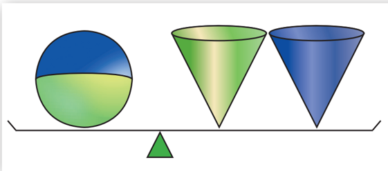

10th 286 Standard Mathematics From the Fig.7.30, we see that Volume of a sphere = 2 × (Volume of a cone)

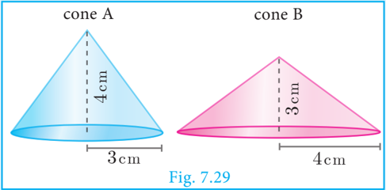

- z Consider a sphere and two right circular cones of same base radius and height such that twice the radius of the sphere is equal to the height of the cones.
- z Then we can observe that the contents of two cones will exactly occupy the sphere.

#### 7.3.5 Volume of a hollow sphere / spherical shell (volume of the material used)

Let r and R be the inner and outer radius of the hollow sphere.

Volume enclosed between the outer and inner spheres

#### 7.3.6 Volume of solid hemisphere

Let r be the radius of the solid hemisphere.

Volume of the solid hemisphere = 1 2 (volume of sphere)

Volume of a solid hemisphere = 2 3 3 pr cu. units

#### 7.3.7 Volume of hollow hemisphere (volume of the material used)

Let r and R be the inner and outer radius of the hollow hemisphere.

**Thinking Corner**

where the diameters of sphere and cone are equal to the height of the cone.

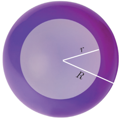

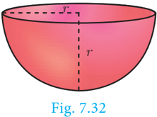

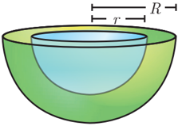

A cone, a hemisphere and a cylinder have equal bases. The heights of the cone and cylinder are equal and are same as the common radius. Are they equal in volume?

Example 7.21 The volume of a solid hemisphere is 29106 cm 3 . Another hemisphere whose volume is two-third of the above is carved out. Find the radius of the new hemisphere.

Let r be the radius of the hemisphere.

Given that, volume of the hemisphere = 29106 cm 3

Now, volume of new hemisphere = 2 3 (Volume of original sphere)

Volume of new hemisphere = 19404 cm 3

Therefore,

r = 21 cm

**Thinking Corner**

- Give any two real life examples of sphere and hemisphere.
- A plane along a great circle will split the sphere into _____ parts.
- If the volume and surface area of a sphere are numerically equal, then the radius of the sphere is ________.

Example 7.22 Calculate the mass of a hollow brass sphere if the inner diameter is 14 cm

and thickness is 1mm, and whose density is 17 . 3 g/ cm 3 . (Hint: mass = density × volume)

Let r and R be the inner and outer radii of the hollow sphere.

Given that, inner diameter d =14 cm; inner radius r = 7 cm; thickness = 1 mm = 1 10 cm

But, density of brass in 1 cm 3 = 17.3 gm

Total mass =× 17.3 × .. 362 × . 36248 = 1080 . 90 gm

Therefore, total mass is 1080.90 grams.

10th 288 Standard Mathematics

- What is the ratio of volume to surface area of a sphere?
- The relationship between the height and radius of the hemisphere is ________.
- The volume of a sphere is the product of its surface area and _______.

#### 7.3.8 Volume of frustum of a cone

Let H and h be the height of cone and frustum respectively, L and l be the slant height of the same.

If R, r are the radii of the circular bases of the frustum, then volume of the frustum of the cone is the difference of the volumes of the two cones.

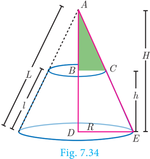

Since the triangles ABC and ADE are similar, the ratio of their corresponding sides are proportional.

**… (1) Thinking Corner**

Is it possible to obtain the volume of the full cone when the volume of the frustum is known?

Example 7.23 If the radii of the circular ends of a frustum which is 45 cm high are 28 cm and 7 cm, find the volume of the frustum.

Let h, r and R be the height, top and bottom radii of the frustum.

Given that, h = 45 cm, R = 28 cm, r = 7 cm

Therefore, volume of the frustum is 48510 cm 3

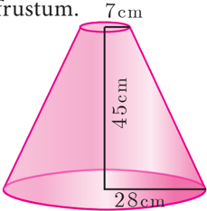


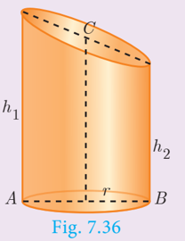

The adjacent figure represents an oblique frustum of a cylinder. Suppose this solid is cut by a plane through C, not parallel to the base AB, then

where h1 h1 and h2 h2 denote the greatest and least height of the frustum.


- A 14 m deep well with inner diameter 10 m is dug and the earth taken out is evenly spread all around the well to form an embankment of width 5 m. Find the height of the embankment.
- A cylindrical glass with diameter 20 cm has water to a height of 9 cm. A small cylindrical metal of radius 5 cm and height 4 cm is immersed completely. Calculate the raise of the water in the glass?
- If the circumference of a conical wooden piece is 484 cm then find its volume when its height is 105 cm.
- A conical container is fully filled with petrol. The radius is 10m and the height is 15 m. If the container can release the petrol through its bottom at the rate of 25 cu. meter per minute, in how many minutes the container will be emptied. Round off your answer to the nearest minute.
- A right angled triangle whose sides are 6 cm, 8 cm and 10 cm is revolved about the sides containing the right angle in two ways. Find the difference in volumes of the two solids so formed.
- The volumes of two cones of same base radius are 3600 cm3 and 5040 cm3. Find the ratio of heights.
- If the ratio of radii of two spheres is 4:7, find the ratio of their volumes.
- A solid sphere and a solid hemisphere have equal total surface area. Prove that the ratio of their volume is 33 : 4 .
- The outer and the inner surface areas of a spherical copper shell are 576p cm 2 and 324p cm 2 respectively. Find the volume of the material required to make the shell.
- A container open at the top is in the form of a frustum of a cone of height 16 cm with radii of its lower and upper ends are 8 cm and 20 cm respectively. Find the cost of milk which can completely fill a container at the rate of `40 per litre.

### 7.4 Volume and Surface Area of Combined Solids

Observe the shapes given (Fig.7.37).

The shapes provided lead to the following definitions of 'Combined Solid'.

10th 290 Standard Mathematics A combined solid is said to be a solid formed by combining two or more solids.

The concept of combined solids is useful in the fields like doll making, building construction, carpentry, etc.

To calculate the surface area of the combined solid, we should only calculate the areas that are visible to our eyes. For example, if a cone is surmounted by a hemisphere, we need

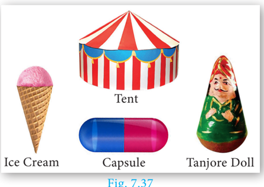

to just find out the C.S.A. of the hemisphere and C.S.A. of the cone separately and add them together. Note that we are leaving the base area of both the cone and the hemisphere since both the bases are attached together and are not visible.

But, the volume of the solid formed by joining two basic solids will be the sum of the volumes of the individual solids.

Example 7.24 A toy is in the shape of a cylinder surmounted by a hemisphere. The height of the toy is 25 cm. Find the total surface area of the toy if its common diameter is 12 cm.

Let r and h be the radius and height of the cylinder respectively.

Given that, diameter d = 12 cm, radius r = 6 cm

Total height of the toy is 25 cm Therefore, height of the cylindrical portion =− 25 6 = 19 cm

T.S.A. of the toy =C.S.A. of the cylinder + C.S.A. of the hemisphere +Base Area of the cylinder

Therefore, T.S.A. of the toy is 1056 cm 2

Example 7.25 A jewel box (Fig. 7 . 39) is in the shape of a cuboid of dimensions 30 cm ´ 15 cm ´10 cm surmounted by a half part of a cylinder as shown in the figure. Find the volume of the box.

Let l, b and h1 h1 be the length, breadth and height of the cuboid. Also let us take r and h2 h2 be the radius and height of the cylinder.

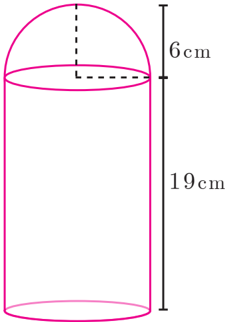

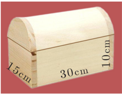

Now, Volume of the box = Volume of the cuboid + 1 2 (Volume of cylinder)

Therefore, Volume of the box = 7151.79 cm 3

Example 7.26 Arul has to make arrangements for the accommodation of 150 persons for his family function. For this purpose, he plans to build a tent which is in the shape of cylinder surmounted by a cone. Each person occupies 4 sq. m of the space on ground and 40 cu. meter of air to breathe. What should be the height of the conical part of the tent if the height of cylindrical part is 8 m?

Let h1 h1 and h 2 be the height of cylinder and cone respectively.

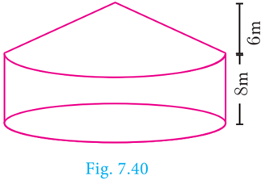

Area for one person = 4 sq. m

Total number of persons =150

Therefore, total base area =150´4

Volume of air required for 1 person = 40 m 3

Total Volume of air required for 150 persons=× 150 40 = 6000 m 3

22

```markdown ``` ``` ``` ``` ``` ``` ``` ``` ``` ``` ``` ``` ``` ``` ``` ``` ``` ``` ``` ``` ``` ``` ``` ``` ``` ``` ``` ``` ``` ``` ``` ``` ``` ``` ``` ``` ``` ``` ``` ``` ``` ``` ``` ``` ``` ``` ``` ``` ``` ``` ``` ``` ``` ``` ``` ``` ``` ``` ``` ``` ``` ``` ``` ``` ``` ``` ``` ``` ``` ``` ``` ``` ``` ``` ``` ``` ``` ``` ``` ``` ``` ``` ``` ``` ``` ``` ``` ``` ``` ``` ``` ``` ``` ``` ``` ``` ``` ``` ``` ``` ``` ``` ``` ``` ``` ``` ``` ``` ``` ``` ``` ``` ``` ``` ``` ``` ``` ``` ``` ``` ``` ``` ``` ``` ``` ``` ``` ``` ``` ``` ``` ``` ``` ``` ``` ``` ``` ``` ``` ``` ``` ``` ``` ``` ``` ``` ``` ``` ``` ``` ``` ``` ``` ``` ``` ``` ``` ``` ``` ``` ``` ``` ``` ``` ``` ``` ``` ``` ``` ```

Therefore, the height of the conical tent h2 h2 is 6 m

Example 7.27 A funnel consists of a frustum of a cone attached to a cylindrical portion 12 cm long attached at the bottom. If the total height be 20 cm, diameter of the cylindrical portion be 12 cm and the diameter of the top of the funnel be 24 cm. Find the outer surface area of the funnel.

10th 292 Standard Mathematics Solution Let R , r r be the top and bottom radii of the frustum.

Let h1 h1, h2 h2 be the heights of the frustum and cylinder respectively.

Therefore, outer surface area of the funnel is 1018 . 28 cm 2

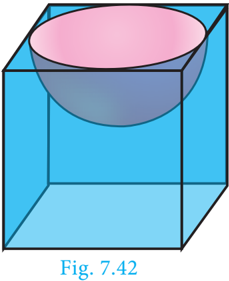

Example 7.28 A hemispherical section is cut out from one face of a cubical block (Fig.7 . 42) such that the diameter l of the hemisphere is equal to side length of the cube. Determine the surface area of the remaining solid.

Let r be the radius of the hemisphere.

Given that, diameter of the hemisphere = side of the cube = l

Radius of the hemisphere = l 2

TSA of the remaining solid = Surface area of the cubical part

+ C.S.A. of the hemispherical part

− Area of the base of the hemispherical part

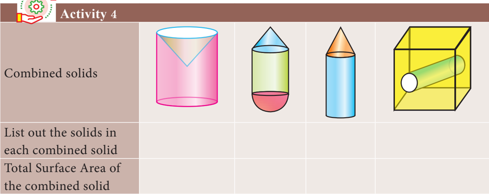


- A vessel is in the form of a hemispherical bowl mounted by a hollow cylinder. The diameter is 14 cm and the height of the vessel is 13 cm. Find the capacity of the vessel.
- Nathan, an engineering student was asked to make a model shaped like a cylinder with two cones attached at its two ends. The diameter of the model is 3 cm and its length is 12 cm. If each cone has a height of 2 cm, find the volume of the model that Nathan made.
- From a solid cylinder whose height is 2 . 4 cm and the diameter 1 . 4 cm, a cone of the same height and same diameter is carved out. Find the volume of the remaining solid to the nearest cm 3 .
- A solid consisting of a right circular cone of height 12 cm and radius 6 cm standing on a hemisphere of radius 6 cm is placed upright in a right circular cylinder full of water such that it touches the bottom. Find the volume of the water displaced out of the cylinder, if the radius of the cylinder is 6 cm and height is 18 cm.
- A capsule is in the shape of a cylinder with two hemisphere stuck to each of its ends. If the length of the entire capsule is 12 mm and the diameter of the capsule is 3 mm, how much medicine it can hold?
- As shown in figure a cubical block of side 7 cm is surmounted by a hemisphere. Find the surface area of the solid.
- A right circular cylinder just enclose a sphere of radius r units. Calculate
- (i) the surface area of the sphere
- (ii) the curved surface area of the cylinder
- (iii) the ratio of the areas obtained in (i) and (ii).

10th 294 Standard Mathematics

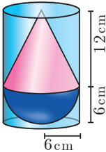

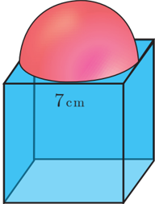

### 7.5 Conversion of Solids from one shape to another with no change in Volume

Conversions or Transformations becomes a common part of our daily life. For example, a gold smith melts a bar of gold to transform it to a jewel. Similarly, a kid playing with clay shapes it into different toys, a carpenter uses the wooden logs to form different house hold articles/furniture. Likewise, the conversion of solids from one shape to another is required for various purposes.

In this section we will be learning problems involving conversions of solids from one shape to another with no change in volume.

Example 7.29 A metallic sphere of radius 16 cm is melted and recast into small spheres each of radius 2 cm. How many small spheres can be obtained?

Let the number of small spheres obtained be n .

Let r be the radius of each small sphere and R be the radius of metallic sphere.

Now, n´(Volume of a small sphere) = Volume of big metallic sphere

Therefore, there will be 512 small spheres.

Example 7.30 A cone of height 24 cm is made up of modeling clay. A child reshapes it in the form of a cylinder of same radius as cone. Find the height of the cylinder.

Let h1 h1 and h2 h2 be the heights of a cone and cylinder respectively.

Also, let r be the raius of the cone.

Given that, height of the cone h1 h1 = 24 cm; radius of the cone and cylinder r = 6 cm

Since, Volume of cylinder = Volume of cone

Therefore, height of cylinder is 8 cm

Example 7.31 A right circular cylindrical container of base radius 6 cm and height 15 cm is full of ice cream. The ice cream is to be filled in cones of height 9 cm and base radius 3 cm, having a hemispherical cap. Find the number of cones needed to empty the container.

Let h and r be the height and radius of the cylinder respectively.

Given that, h = 15 cm, r = 6 cm Volume of the container Vr = p = p h 2 cubic units.

Let, r 1 = 3 cm, h 1 = 9 cm be the radius and height of the cone.

Also, r 1 = 3 cm is the radius of the hemispherical cap.

Volume of one ice cream cone = (Volume of the cone + Volume of the hemispherical cap)

Number of cones = volume of thecylinder

volume of oneice creamcone

Number of ice cream cones needed

Thus 12 ice cream cones are required to empty the cylindrical container.

**Activity 5**

The adjacent figure shows a cylindrical can with two balls. The can is just large enough so that two balls will fit inside with the lid on. The radius of each tennis ball is 3 cm. Calculate the following

- (i) height of the cylinder.
- (ii) radius of the cylinder.
- (iii) volume of the cylinder.
- (iv) volume of two balls.
- (v) volume of the cylinder not occupied by the balls.
- (vi) percentage of the volume occupied by the balls.


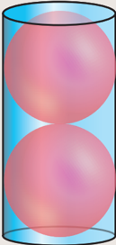

- An aluminium sphere of radius 12 cm is melted to make a cylinder of radius 8 cm. Find the height of the cylinder.
- Water is flowing at the rate of 15 km per hour through a pipe of diameter 14 cm into a rectangular tank which is 50 m long and 44 m wide. Find the time in which the level of water in the tanks will rise by 21 cm.
- A conical flask is full of water. The flask has base radius r units and height h units, the water is poured into a cylindrical flask of base radius xr units. Find the height of water in the cylindrical flask.

10th 296 Standard Mathematics pr

- A solid right circular cone of diameter 14 cm and height 8 cm is melted to form a hollow sphere. If the external diameter of the sphere is 10 cm, find the internal diameter.
- Seenu's house has an overhead tank in the shape of a cylinder. This is filled by pumping water from a sump (underground tank) which is in the shape of a cuboid. The sump has dimensions 2 m ´1 . 5 m ´ 1 m. The overhead tank has its radius of 60 cm and height 105 cm. Find the volume of the water left in the sump after the overhead tank has been completely filled with water from the sump which has been full, initially.
- The internal and external diameter of a hollow hemispherical shell are 6 cm and 10 cm respectively. If it is melted and recast into a solid cylinder of diameter 14 cm, then find the height of the cylinder.
- A solid sphere of radius 6 cm is melted into a hollow cylinder of uniform thickness. If the external radius of the base of the cylinder is 5 cm and its height is 32 cm, then find the thickness of the cylinder.
- A hemispherical bowl is filled to the brim with juice. The juice is poured into a cylindrical vessel whose radius is 50% more than its height. If the diameter is same for both the bowl and the cylinder then find the percentage of juice that can be transferred from the bowl into the cylindrical vessel.


**Multiple choice questions**

- The curved surface area of a right circular cone of height 15 cm and base diameter 16 cm is
- (A) 60p cm 2
- (B) 68p cm 2
- (C) 120p cm 2
- (D) 136p cm 2
- If two solid hemispheres of same base radius r units are joined together along their bases, then curved surface area of this new solid is
- (A) 4 2 pr sq. units

2 --- 2 --- 2 --- 2 --- 2 --- 2 --- 2 --- 2 --- 2 --- 2 --- 2 --- 2 --- 2 --- 2 --- 2 --- 2 --- 2 --- 2 --- 2 --- 2 --- 2 --- 2 --- 2 --- 2 --- 2 --- 2 --- 2 --- 2 --- 2 --- 2 --- 2 --- 2 --- 2 --- 2 --- 2 --- 2 --- 2 --- 2 --- 2 --- 2 --- 2 --- 2 --- 2 --- 2 --- 2 --- 2 --- 2 --- 2 --- 2 --- 2 --- 2 --- 2 --- 2 --- 2 --- 2 --- 2 --- 2 --- 2 --- 2 --- 2 --- 2 --- 2 --- 2 --- 2 --- 2 --- 2 --- 2 --- 2 --- 2 --- 2 --- 2 --- 2 --- 2 --- 2 --- 2 --- 2 --- 2 --- 2 --- 2 --- 2 --- 2 --- 2 --- 2 --- 2 --- 2 --- 2 --- 2 --- 2 --- 2 --- 2 --- 2 --- 2 --- 2 --- 2 --- 2 --- 2 --- 2 --- 2 --- 2 --- 2 ---

2 --- 2 --- 2 --- 2 --- 2 --- 2 --- 2 --- 2 --- 2 --- 2 --- 2 --- 2 --- 2 --- 2 --- 2 --- 2 --- 2 --- 2 --- 2 --- 2 --- 2 --- 2 --- 2 --- 2 --- 2 --- 2 --- 2 --- 2 --- 2 --- 2 --- 2 --- 2 --- 2 --- 2 --- 2 --- 2 --- 2 --- 2 --- 2 --- 2 --- 2 --- 2 --- 2 --- 2 --- 2 --- 2 --- 2 --- 2 --- 2 --- 2 --- 2 --- 2 --- 2 --- 2 --- 2 --- 2 --- 2 --- 2 --- 2 --- 2 --- 2 --- 2 --- 2 --- 2 --- 2 --- 2 --- 2 --- 2 --- 2 --- 2 --- 2 --- 2 --- 2 --- 2 --- 2 --- 2 --- 2 --- 2 --- 2 --- 2 --- 2 --- 2 --- 2 --- 2 --- 2 --- 2 --- 2 --- 2 --- 2 --- 2 --- 2 --- 2 --- 2 --- 2 --- 2 --- 2 --- 2 --- 2 --- 2 --- 2 ---

(B) 6

(C) 3

sq. units

pr sq. units

- (D) 8 2 pr sq. units
- The height of a right circular cone whose radius is 5 cm and slant height is 13 cm will be
- (A) 12 cm
- (B) 10 cm
- (C) 13 cm
- (D) 5 cm
- If the radius of the base of a right circular cylinder is halved keeping the same height, then the ratio of the volume of the cylinder thus obtained to the volume of original cylinder is
- (A) 1:2
- (B) 1:4
- (C) 1:6
- The total surface area of a cylinder whose radius is 1 of its height is
- (D) 1:8
- (D) 56 2 p h sq.units
- In a hollow cylinder, the sum of the external and internal radii is 14 cm and the width is 4 cm. If its height is 20 cm, the volume of the material in it is
- (A) 5600p cm 3
- (B) 1120p cm 3
- (C) 56p cm 3

- (D) 3600p cm 3

Mensuration

- If the radius of the base of a cone is tripled and the height is doubled then the volume is (A) made 6 times (B) made 18 times (C) made 12 times (D) unchanged
- The total surface area of a hemi-sphere is how much times the square of its radius.
- (A) π
- (B) 4p
- (C) 3p
- (D) 2p
- A solid sphere of radius x cm is melted and cast into a shape of a solid cone of same radius. The height of the cone is
- (A) 3x cm
- (B) x cm
- (C)4x cm
- (D)2x cm
- A frustum of a right circular cone is of height 16cm with radii of its ends as 8cm and 20cm. Then, the volume of the frustum is
- (A) 3328p cm 3
- (B) 3228p cm 3
- (C) 3240p cm 3
- (D) 3340p cm 3

A shuttle cock used for playing badminton has the shape of the combination of

11.

- (A) a cylinder and a sphere
- (B) a hemisphere and a cone
- (C) a sphere and a cone
- (D) frustum of a cone and a hemisphere
- (A) 2:1
- (B) 1:2
- (C) 4:1
- (D) 1:4
- The volume (in cm 3 ) of the greatest sphere that can be cut off from a cylindrical log of wood of base radius 1 cm and height 5 cm is
- (A) 4 3 p
- (B) 10 3 p
- (D) 20 3 p
- (C) 5p
- (A) 13:
- (B) 12:
- (C) 21:
- (D) 31:
- The ratio of the volumes of a cylinder, a cone and a sphere, if each has the same diameter and same height is
- (A) 1:2:3
- (B) 2:1:3
- (C) 1:3:2
- (D) 3:1:2


**Unit Exercise - 7**

- The barrel of a fountain-pen cylindrical in shape, is 7 cm long and 5 mm in diameter. A full barrel of ink in the pen will be used for writing 330 words on an average. How many words can be written using a bottle of ink containing one fifth of a litre?
- A hemi-spherical tank of radius 1 . 75 m is full of water. It is connected with a pipe which empties the tank at the rate of 7 litre per second. How much time will it take to empty the tank completely?
- Find the maximum volume of a cone that can be carved out of a solid hemisphere of radius r units.
- An oil funnel of tin sheet consists of a cylindrical portion 10 cm long attached to a frustum of a cone. If the total height is 22 cm, the diameter of the cylindrical portion

10th 298 Standard Mathematics

- be 8 cm and the diameter of the top of the funnel be 18 cm, then find the area of the tin sheet required to make the funnel.
- Find the number of coins, 1 . 5 cm in diameter and 2 mm thick, to be melted to form a right circular cylinder of height 10 cm and diameter 4 . 5 cm.
- A hollow metallic cylinder whose external radius is 4 . 3 cm and internal radius is 1 . 1 cm and whole length is 4 cm is melted and recast into a solid cylinder of 12 cm long. Find the diameter of solid cylinder.
- The slant height of a frustum of a cone is 4 m and the perimeter of circular ends are 18 m and 16 m. Find the cost of painting its curved surface area at `100 per sq. m.
- A hemi-spherical hollow bowl has material of volume 436 3 p cubic cm. Its external diameter is 14 cm. Find its thickness.
- The volume of a cone is 1005 5 7 cu. cm. The area of its base is 201 1 7 sq. cm. Find the slant height of the cone.
- A metallic sheet in the form of a sector of a circle of radius 21 cm has central angle of 216°. The sector is made into a cone by bringing the bounding radii together. Find the volume of the cone formed.

| Points to Remember | Points to Remember | Points to Remember |  | \n |
| --- | --- | --- | --- | \n |
| Solid | Figure Curved surface Area / Lateral surface Area (in sq. units) | Total surface Area (in sq. units) | Volume (in cubic units) | \n |
| Cuboid | 2hl( l() +b | 2() lb ++ bh lh  lh | lb ´´h | \n |
| Cube | 4  2  a | 6  2  a | a 3 | \n |
| Right Circular Cylinder | h l  2 p rh | 2 p rh( h() + r | prh2 2 | \n |
| Right Circular Cone | h p rl lr =+ h 2 + h 22 l  =  slant height | pprl + p rl  r rl ( r + prl =+( 2 l r+() | 1 3 2  p 2 
<br>rh | \n |
| Sphere | 4  2  pr | 4  2  pr | 4 3 3  pr |  |

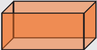

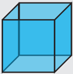

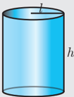

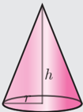


| Hemisphere r | r 2  2  pr | 3  2  pr | 2 3 3  pr | \n |
| --- | --- | --- | --- | \n |
| Hollow  cylinder | 2p () Rr +  h | 2p()Rr+ ()Rr h−+ Rr+ Rr − h + r −+ | p  Rr 
<br>2
<br>− h  22  Rr 
<br>22 () − | \n |
| Hollow sphere | r 4  2  p R  = outer  surface area | 4  22 
<br>+  p 22 
<br>() Rr + | 4 3 33 
<br>r  p 33 
<br>() Rr − | \n |
| Hollow  hemisphere | r  R 2  22 
<br>+  p 22 
<br>() Rr + | p 3 
<br>( 22 
<br>+  3 22 () Rr + | 2 3 33 
<br>r  p 33 
<br>() Rr − | \n |
| Frustum of  right circular  cone | h r  p () Rr +  l where lh =+
<br>2  () Rr −  2  2 | pp () Rr ++l p () Rr ++lR 2 +pr  2 | 1 3 22 
<br>+ p hR 
<br>
<br>
<br>  22 
<br>R ++ rRr 
<br>
<br>  
<br>
<br>  
<br> 
<br>
<br> |  |

**ICT CORNER**

**ICT 7.1**

Open the Browser type the URL Link given below (or) Scan the QR Code. GeoGebra work book named "Mensuration _X" will open. Select the work sheet "Cone-Cylinder relation"

In the given worksheet you can change the radius and height of the cone-Cylinder by moving the sliders on the lefthand side. Move the vertical slider, to view cone filled in the cylinder and this proves 3 times cone equal to one cylinder of same radius and same height.

**Step 1**

**Step 2**


**ICT 7.2**

**Expected results**


Open the Browser type the URL Link given below (or) Scan the QR Code. GeoGebra work book named "Mensuration _X" will open. Select the work sheet "Cylinder Hemispheres"

In the given worksheet you can change the radius of the Hemisphere-Cylinder by moving the sliders on the lefthand side. Move the slider Attach/Detach to see how combined solid is formed. You can rotate 3-D picture to see the faces. Working is given on the left-hand side. Work out and verify your answer.


You can repeat the same steps for other activities

https://www.geogebra.org/m/jfr2zzgy#chapter/356197 or Scan the QR Code.

10th 300 Standard Mathematics
