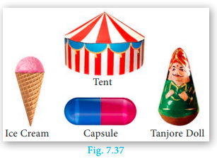
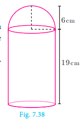
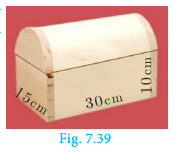
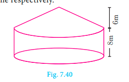
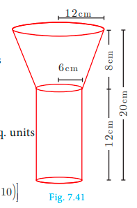
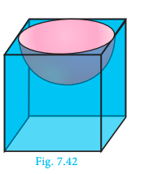
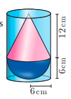
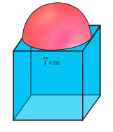

# 7.4 Volume and Surface Area of Combined Solids

Observe the shapes given (Fig. 7.37).

The shapes provided lead to the following definitions of 'Combined Solid'.

*Fig. 7.37 — Ice Cream, Tent, Capsule, Tanjore Doll*

A **combined solid** is said to be a solid formed by combining two or more solids.

The concept of combined solids is useful in the fields like doll making, building construction, carpentry, etc.

To calculate the surface area of the combined solid, we should only calculate the areas that are visible to our eyes. For example, if a cone is surmounted by a hemisphere, we need to just find out the C.S.A. of the hemisphere and C.S.A. of the cone separately and add them together. Note that we are leaving the base area of both the cone and the hemisphere since both the bases are attached together and are not visible.

But, the **volume** of the solid formed by joining two basic solids will be the **sum of the volumes** of the individual solids.

---

**Example 7.24** A toy is in the shape of a cylinder surmounted by a hemisphere. The height of the toy is 25 cm. Find the total surface area of the toy if its common diameter is 12 cm.

*Fig. 7.38*

**Solution** Let r and h be the radius and height of the cylinder respectively.

Given that, diameter d = 12 cm, radius r = 6 cm

Total height of the toy is 25 cm

Therefore, height of the cylindrical portion = 25 − 6 = 19 cm

T.S.A. of the toy = C.S.A. of the cylinder + C.S.A. of the hemisphere + Base Area of the cylinder

= 2πrh + 2πr² + πr²

= πr(2h + 3r) sq. units

= (22/7) × 6 × (2 × 19 + 3 × 6)

= (22/7) × 6 × (38 + 18)

= (22/7) × 6 × 56

= 1056

Therefore, T.S.A. of the toy is **1056 cm²**

---

**Example 7.25** A jewel box (Fig. 7.39) is in the shape of a cuboid of dimensions 30 cm × 15 cm × 10 cm surmounted by a half part of a cylinder as shown in the figure. Find the volume of the box.

*Fig. 7.39*

**Solution** Let l, b and h₁ be the length, breadth and height of the cuboid. Also let r and h₂ be the radius and height of the cylinder.

Now, Volume of the box = Volume of the cuboid + (1/2) × (Volume of cylinder)

= (l × b × h₁) + (1/2)(πr²h₂) cu. units

= (30 × 15 × 10) + (1/2) × (22/7) × (15/2) × (15/2) × 30

= 4500 + 2651.79

= 7151.79

Therefore, Volume of the box = **7151.79 cm³**

---

**Example 7.26** Arul has to make arrangements for the accommodation of 150 persons for his family function. For this purpose, he plans to build a tent which is in the shape of a cylinder surmounted by a cone. Each person occupies 4 sq. m of the space on ground and 40 cu. meter of air to breathe. What should be the height of the conical part of the tent if the height of cylindrical part is 8 m?

*Fig. 7.40*

**Solution** Let h₁ and h₂ be the height of cylinder and cone respectively.

Area for one person = 4 sq. m

Total number of persons = 150

Therefore, total base area = 150 × 4

πr² = 600 ... (1)

Volume of air required for 1 person = 40 m³

Total volume of air required for 150 persons = 150 × 40 = 6000 m³

πr²h₁ + (1/3)πr²h₂ = 6000

πr²[h₁ + (1/3)h₂] = 6000

600 × [8 + (1/3)h₂] = 6000   [using (1)]

8 + (1/3)h₂ = 6000 / 600

(1/3)h₂ = 10 − 8 = 2

h₂ = 6 m

Therefore, the height of the conical tent h₂ is **6 m**

---

**Example 7.27** A funnel consists of a frustum of a cone attached to a cylindrical portion 12 cm long attached at the bottom. If the total height be 20 cm, diameter of the cylindrical portion be 12 cm and the diameter of the top of the funnel be 24 cm. Find the outer surface area of the funnel.

*Fig. 7.41*

**Solution** Let R, r be the top and bottom radii of the frustum. Let h₁, h₂ be the heights of the frustum and cylinder respectively.

Given that, R = 12 cm, r = 6 cm, h₂ = 12 cm

Now, h₁ = 20 − 12 = 8 cm

Here, slant height of the frustum:

l = √[(R − r)² + h₁²] units

= √[6² + 8²]

= √[36 + 64]

= √100

l = 10 cm

Outer surface area = 2πrh₂ + π(R + r)l sq. units

= π[2rh₂ + (R + r)l]

= π[(2 × 6 × 12) + (18 × 10)]

= π[144 + 180]

= (22/7) × 324

= 1018.28

Therefore, outer surface area of the funnel is **1018.28 cm²**

---

**Example 7.28** A hemispherical section is cut out from one face of a cubical block (Fig. 7.42) such that the diameter l of the hemisphere is equal to side length of the cube. Determine the surface area of the remaining solid.

*Fig. 7.42*

**Solution** Let r be the radius of the hemisphere.

Given that, diameter of the hemisphere = side of the cube = l

Radius of the hemisphere = l/2

TSA of the remaining solid = Surface area of the cubical part + C.S.A. of the hemispherical part − Area of the base of the hemispherical part

= 6 × (Edge)² + 2πr² − πr²

= 6 × (Edge)² + πr²

= 6 × l² + π × (l/2)²

= 6l² + πl²/4

= (1/4)(24 + π)l²

Total surface area of the remaining solid = **(1/4)(24 + π)l² sq. units**

---

### Activity 4

Combined solids — List out the solids in each combined solid and find the Total Surface Area of the combined solid.

---

## Exercise 7.3

1. A vessel is in the form of a hemispherical bowl mounted by a hollow cylinder. The diameter is 14 cm and the height of the vessel is 13 cm. Find the capacity of the vessel.

2. Nathan, an engineering student was asked to make a model shaped like a cylinder with two cones attached at its two ends. The diameter of the model is 3 cm and its length is 12 cm. If each cone has a height of 2 cm, find the volume of the model that Nathan made.

3. From a solid cylinder whose height is 2.4 cm and the diameter 1.4 cm, a cone of the same height and same diameter is carved out. Find the volume of the remaining solid to the nearest cm³.

4. A solid consisting of a right circular cone of height 12 cm and radius 6 cm standing on a hemisphere of radius 6 cm is placed upright in a right circular cylinder full of water such that it touches the bottom. Find the volume of the water displaced out of the cylinder, if the radius of the cylinder is 6 cm and height is 18 cm.

5. A capsule is in the shape of a cylinder with two hemispheres stuck to each of its ends. If the length of the entire capsule is 12 mm and the diameter of the capsule is 3 mm, how much medicine it can hold?

6. As shown in figure, a cubical block of side 7 cm is surmounted by a hemisphere. Find the surface area of the solid.

7. A right circular cylinder just encloses a sphere of radius r units. Calculate
   (i) the surface area of the sphere
   (ii) the curved surface area of the cylinder
   (iii) the ratio of the areas obtained in (i) and (ii).