# 7.3 Volume

Having discussed about the surface areas of cylinder, cone, sphere, hemisphere and frustum, we shall now discuss about the volumes of these solids.

**Volume** refers to the amount of space occupied by an object.

The volume is measured in **cubic units**.

---

## 7.3.1 Volume of a Solid Right Circular Cylinder

The volume of a right circular cylinder of base radius **r** and height **h** is given by:

V = (Base Area) × (Height) = πr² × h = πr²h cubic units.

> **Volume of a cylinder = πr²h cu. units**

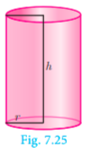

*Fig. 7.25*

---

## 7.3.2 Volume of a Hollow Cylinder (Volume of the Material Used)

Let the internal and external radii of a hollow cylinder be **r** and **R** units respectively. If the height of the cylinder is **h** units, then:

V = (Volume of outer cylinder) − (Volume of inner cylinder)

V = πR²h − πr²h = π(R² − r²)h

> **Volume of a hollow cylinder = π(R² − r²)h cu. units**

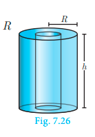

*Fig. 7.26*

---

**Example 7.15** Find the volume of a cylinder whose height is 2 m and whose base area is 250 m².

**Solution** Given that, height h = 2 m, base area = 250 m²

Now, volume of a cylinder = πr²h cu. units

= base area × h

= 250 × 2 = 500 m³

Therefore, volume of the cylinder = **500 m³**

---

### Thinking Corner

1. If the height is inversely proportional to the square of its radius, the volume of the cylinder is ____________.
2. What happens to the volume of the cylinder with radius r and height h, when its
   (a) radius is halved
   (b) height is halved.

---

**Example 7.16** The volume of a cylindrical water tank is 1.078 × 10⁶ litres. If the diameter of the tank is 7 m, find its height.

**Solution** Given that, volume of the tank = 1.078 × 10⁶ = 1078000 litre

= 1078 m³   (∵ 1 l = 1/1000 m³)

diameter = 7 m ⟹ radius = 7/2 m

Volume of the tank = πr²h cu. units

1078 = (22/7) × (7/2) × (7/2) × h

Therefore, height of the tank is **28 m**

---

**Example 7.17** Find the volume of the iron used to make a hollow cylinder of height 9 cm and whose internal and external radii are 21 cm and 28 cm respectively.

**Solution** Let r, R and h be the internal radius, external radius and height of the hollow cylinder respectively.

Given that, r = 21 cm, R = 28 cm, h = 9 cm

Now, volume of hollow cylinder = π(R² − r²)h cu. units

= (22/7) × (28² − 21²) × 9

= (22/7) × (784 − 441) × 9

= (22/7) × 343 × 9 = 9702

Therefore, volume of iron used = **9702 cm³**

---

**Example 7.18** For the cylinders A and B (Fig. 7.27),
(i) find out the cylinder whose volume is greater.
(ii) verify whether the cylinder with greater volume has greater total surface area.
(iii) find the ratios of the volumes of the cylinders A and B.

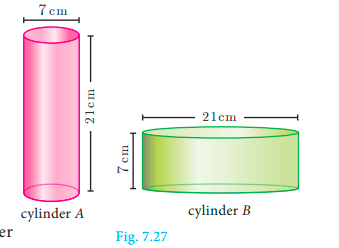

*Fig. 7.27*

**Solution**

**(i)** Volume of cylinder = πr²h cu. units

Volume of cylinder A = (22/7) × (7/2) × (7/2) × 21 = 808.5 cm³

Volume of cylinder B = (22/7) × (21/2) × (21/2) × 7 = 2425.5 cm³

Therefore, volume of cylinder **B is greater** than volume of cylinder A.

**(ii)** T.S.A. of cylinder = 2πr(h + r) sq. units

T.S.A. of cylinder A = 2 × (22/7) × (7/2) × (21 + 3.5) = 539 cm²

T.S.A. of cylinder B = 2 × (22/7) × (21/2) × (7 + 10.5) = 1155 cm²

Hence verified that cylinder B with greater volume has a greater surface area.

**(iii)** Volume of cylinder A / Volume of cylinder B = 808.5 / 2425.5 = 1/3

Therefore, ratio of the volumes of cylinders A and B is **1 : 3**.

---

## 7.3.3 Volume of a Right Circular Cone

Let r and h be the radius and height of a cone, then its volume:

V = (1/3)πr²h cu. units

### Demonstration

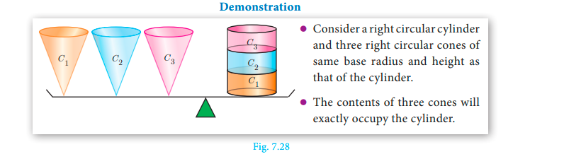

*Fig. 7.28*

- Consider a right circular cylinder and three right circular cones of same base radius and height as that of the cylinder.
- The contents of three cones will exactly occupy the cylinder.

From Fig. 7.28 we see that,

3 × (Volume of a cone) = Volume of cylinder = πr²h cu. units

> **Volume of a cone = (1/3)πr²h cu. units**

---

**Example 7.19** The volume of a solid right circular cone is 11088 cm³. If its height is 24 cm then find the radius of the cone.

**Solution** Let r and h be the radius and height of the cone respectively.

Given that, volume of the cone = 11088 cm³

(1/3)πr²h = 11088

(1/3) × (22/7) × r² × 24 = 11088

r² = 441

Therefore, radius of the cone **r = 21 cm**

---

### Thinking Corner

1. Is it possible to find a right circular cone with equal
   (a) height and slant height
   (b) radius and slant height
   (c) height and radius.
2. There are two cones with equal volumes. What will be the ratio of their radius and height?

---

**Example 7.20** The ratio of the volumes of two cones is 2 : 3. Find the ratio of their radii if the height of second cone is double the height of the first.

**Solution** Let r₁ and h₁ be the radius and height of cone-I and let r₂ and h₂ be the radius and height of cone-II.

Given that, h₂ = 2h₁ and Volume of cone I / Volume of cone II = 2/3

[(1/3)πr₁²h₁] / [(1/3)πr₂²h₂] = 2/3

(r₁² / r₂²) × (h₁ / 2h₁) = 2/3

r₁² / r₂² = 4/3

r₁ / r₂ = 2 / √3

Therefore, ratio of their radii = **2 : √3**

---

### Progress Check

1. Volume of a cone is the product of its base area and ______.
2. If the radius of the cone is doubled, the new volume will be ______ times the original volume.
3. Consider the cones given in Fig. 7.29
   (i) Without doing any calculation, find out whose volume is greater?
   (ii) Verify whether the cone with greater volume has greater surface area.
   (iii) Volume of cone A : Volume of cone B = ?

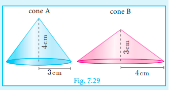

*Fig. 7.29*

---

## 7.3.4 Volume of Sphere

Let r be the radius of a sphere, then its volume is given by:

V = (4/3)πr³ cu. units

### Demonstration

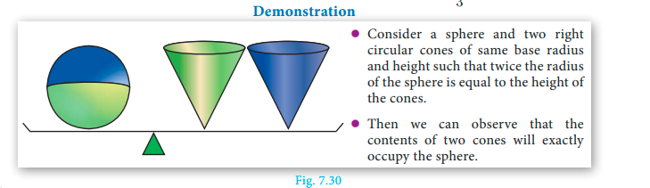

*Fig. 7.30*

- Consider a sphere and two right circular cones of same base radius and height such that twice the radius of the sphere is equal to the height of the cones.
- Then we can observe that the contents of two cones will exactly occupy the sphere.

From Fig. 7.30, we see that:

Volume of a sphere = 2 × (Volume of a cone)

where the diameters of sphere and cone are equal to the height of the cone.

= 2 × (1/3)πr²h

= (2/3)πr²(2r),   (∵ h = 2r)

> **Volume of a sphere = (4/3)πr³ cu. units**

---

## 7.3.5 Volume of a Hollow Sphere / Spherical Shell (Volume of the Material Used)

Let r and R be the inner and outer radii of the hollow sphere.

Volume enclosed between the outer and inner spheres:

= (4/3)πR³ − (4/3)πr³

> **Volume of a hollow sphere = (4/3)π(R³ − r³) cu. units**

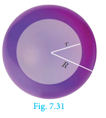

*Fig. 7.31*

---

## 7.3.6 Volume of Solid Hemisphere

Let r be the radius of the solid hemisphere.

Volume of the solid hemisphere = (1/2) × (volume of sphere)

= (1/2) × (4/3)πr³

> **Volume of a solid hemisphere = (2/3)πr³ cu. units**

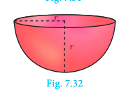

*Fig. 7.32*

---

## 7.3.7 Volume of Hollow Hemisphere (Volume of the Material Used)

Let r and R be the inner and outer radii of the hollow hemisphere.

Volume of hollow hemisphere = Volume of outer hemisphere − Volume of inner hemisphere

= (2/3)πR³ − (2/3)πr³

> **Volume of a hollow hemisphere = (2/3)π(R³ − r³) cu. units**

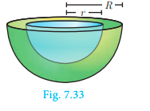

*Fig. 7.33*

---

### Thinking Corner

A cone, a hemisphere and a cylinder have equal bases. The heights of the cone and cylinder are equal and are same as the common radius. Are they equal in volume?

---

**Example 7.21** The volume of a solid hemisphere is 29106 cm³. Another hemisphere whose volume is two-third of the above is carved out. Find the radius of the new hemisphere.

**Solution** Let r be the radius of the hemisphere.

Given that, volume of the hemisphere = 29106 cm³

Now, volume of new hemisphere = (2/3) × (Volume of original sphere)

= (2/3) × 29106

Volume of new hemisphere = 19404 cm³

(2/3)πr³ = 19404

r³ = (19404 × 3 × 7) / (2 × 22) = 9261

r = ∛9261 = 21 cm

Therefore, **r = 21 cm**

---

### Thinking Corner

1. Give any two real life examples of sphere and hemisphere.
2. A plane along a great circle will split the sphere into ______ parts.
3. If the volume and surface area of a sphere are numerically equal, then the radius of the sphere is ________.

---

**Example 7.22** Calculate the mass of a hollow brass sphere if the inner diameter is 14 cm and thickness is 1 mm, and whose density is 17.3 g/cm³. (Hint: mass = density × volume)

**Solution** Let r and R be the inner and outer radii of the hollow sphere.

Given that, inner diameter d = 14 cm; inner radius r = 7 cm; thickness = 1 mm = 1/10 cm

Outer radius R = 7 + 1/10 = 71/10 = 7.1 cm

Volume of hollow sphere = (4/3)π(R³ − r³) cu. units

= (4/3) × (22/7) × (357.91 − 343)

= 62.48 cm³

But, density of brass in 1 cm³ = 17.3 gm

Total mass = 17.3 × 62.48 = 1080.90 gm

Therefore, total mass is **1080.90 grams**.

---

### Progress Check

1. What is the ratio of volume to surface area of a sphere?
2. The relationship between the height and radius of the hemisphere is ________.
3. The volume of a sphere is the product of its surface area and _______.

---

## 7.3.8 Volume of Frustum of a Cone

Let H and h be the height of cone and frustum respectively, L and l be the slant height of the same.

If R, r are the radii of the circular bases of the frustum, then volume of the frustum of the cone is the difference of the volumes of the two cones.

V = (1/3)πR²H − (1/3)πr²(H − h)

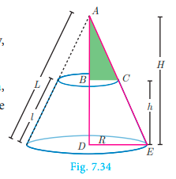

*Fig. 7.34*

Since the triangles ABC and ADE are similar, the ratio of their corresponding sides are proportional.

Therefore, (H − h) / H = r / R

⟹ H = hR / (R − r)  ... (1)

V = (1/3)πR²H − (1/3)πr²(H − h)

= (π/3) × H(R² − r²) + (1/3)πr²h

= (π/3) × [hR / (R − r)] × (R² − r²) + (π/3)r²h   [using (1)]

= (π/3)hR(R + r) + (π/3)r²h

> **Volume of a frustum = (πh/3)(R² + Rr + r²) cu. units**

---

**Example 7.23** If the radii of the circular ends of a frustum which is 45 cm high are 28 cm and 7 cm, find the volume of the frustum.

**Solution** Let h, r and R be the height, top and bottom radii of the frustum.

Given that, h = 45 cm, R = 28 cm, r = 7 cm

Volume = (1/3)π[R² + Rr + r²]h cu. units

= (1/3) × (22/7) × [28² + (28 × 7) + 7²] × 45

= (1/3) × (22/7) × [784 + 196 + 49] × 45

= (1/3) × (22/7) × 1029 × 45

= 48510

Therefore, volume of the frustum is **48510 cm³**

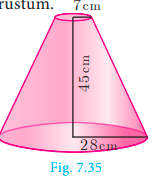

*Fig. 7.35*

---

### Thinking Corner

Is it possible to obtain the volume of the full cone when the volume of the frustum is known?

---

### Progress Check

1. What is the ratio of volume to surface area of a sphere?
2. The relationship between the height and radius of the hemisphere is ________.
3. The volume of a sphere is the product of its surface area and _______.

---

### Do You Know?

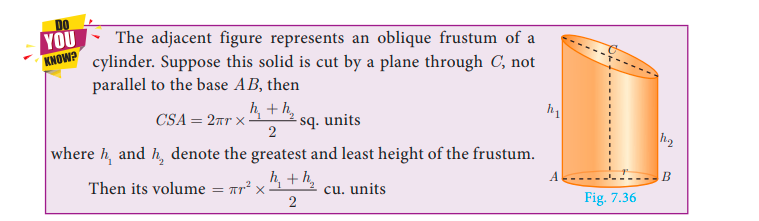

The adjacent figure represents an **oblique frustum of a cylinder**. Suppose this solid is cut by a plane through C, not parallel to the base AB, then:

CSA = 2πr × (h₁ + h₂)/2 sq. units

where h₁ and h₂ denote the greatest and least height of the frustum.

Then its volume = πr² × (h₁ + h₂)/2 cu. units

---

## Exercise 7.2

1. A 14 m deep well with inner diameter 10 m is dug and the earth taken out is evenly spread all around the well to form an embankment of width 5 m. Find the height of the embankment.

2. A cylindrical glass with diameter 20 cm has water to a height of 9 cm. A small cylindrical metal of radius 5 cm and height 4 cm is immersed completely. Calculate the raise of the water in the glass?

3. If the circumference of a conical wooden piece is 484 cm then find its volume when its height is 105 cm.

4. A conical container is fully filled with petrol. The radius is 10 m and the height is 15 m. If the container can release the petrol through its bottom at the rate of 25 cu. meter per minute, in how many minutes the container will be emptied. Round off your answer to the nearest minute.

5. A right angled triangle whose sides are 6 cm, 8 cm and 10 cm is revolved about the sides containing the right angle in two ways. Find the difference in volumes of the two solids so formed.

6. The volumes of two cones of same base radius are 3600 cm³ and 5040 cm³. Find the ratio of heights.

7. If the ratio of radii of two spheres is 4 : 7, find the ratio of their volumes.

8. A solid sphere and a solid hemisphere have equal total surface area. Prove that the ratio of their volume is 3√3 : 4.

9. The outer and the inner surface areas of a spherical copper shell are 576π cm² and 324π cm² respectively. Find the volume of the material required to make the shell.

10. A container open at the top is in the form of a frustum of a cone of height 16 cm with radii of its lower and upper ends are 8 cm and 20 cm respectively. Find the cost of milk which can completely fill a container at the rate of ₹40 per litre.