# Chapter 2

## NUMBERS AND SEQUENCES

"I know numbers are beautiful, if they aren't beautiful, nothing is" - Paul Erdos

Srinivasa Ramanujan was an Indian mathematical genius who was born in Erode in a poor family. He was a child prodigy and made calculations at lightning speed. He produced thousands of precious formulae, jotting them on his three notebooks which are now preserved at the University of Madras. With the help of several notable men, he became the first research scholar in the mathematics department of University of Madras. Subsequently, he went to England and collaborated with G.H. Hardy for five years from 1914 to 1919.

He possessed great interest in observing the pattern of numbers and produced several new results in Analytic Number Theory. His mathematical ability was compared to Euler and Jacobi, the two great mathematicians of the past Era. Ramanujan wrote thirty important research papers and wrote seven research papers in collaboration with G.H. Hardy. He has produced 3972 formulas and theorems in very short span of 32 years lifetime. He was awarded B.A. degree for research in 1916 by Cambridge University which is equivalent to modern day Ph.D. Degree. For his contributions to number theory, he was made Fellow of Royal Society (F.R.S.) in 1918.

His works continue to delight mathematicians worldwide even today. Many surprising connections are made in the last few years of work made by Ramanujan nearly a century ago.

<center>


Srinivasa Ramanujan (1887-1920)
</center>

---

## Learning Outcomes

To study the concept of Euclid's Division Lemma. To understand Euclid's Division Algorithm. To find the LCM and HCF using Euclid's Division Algorithm. To understand the Fundamental Theorem of Arithmetic. To understand the congruence modulo \( n \), addition modulo \( n \) and multiplication modulo \( n \). To define sequence and to understand sequence as a function. To define an Arithmetic Progression (A.P.) and Geometric Progression (G.P.). To find the \( n^{\text{th}} \) term of an A.P. and its sum to \( n \) terms. To find the \( n^{\text{th}} \) term of a G.P. and its sum to \( n \) terms. To determine the sum of some finite series such as \( \sum n, \sum n^2, \sum n^3 \).

---

### 2.1 Introduction

The study of numbers has fascinated humans since several thousands of years. The discovery of Lebombo and Ishango bones which existed around 25000 years ago has confirmed the fact that humans made counting process for meeting various day to day needs. By making notches in the bones they carried out counting efficiently. Most consider that these bones were used as lunar calendar for knowing the phases of moon thereby understanding the seasons. Thus the bones were considered to be the ancient tools for counting. We have come a long way since this primitive counting method existed.

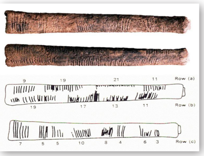

*Fig.2.1*

It is very true that the patterns exhibited by numbers have fascinated almost all professional mathematicians' right from the time of Pythagoras to current time. We will be discussing significant concepts provided by Euclid and continue our journey of studying Modular Arithmetic and knowing about Sequences and Finite Series. These ideas are most fundamental to your progress in mathematics for upcoming classes. It is time for us to begin our journey to understand the most fascinating part of mathematics, namely, the study of numbers.

### 2.2 Euclid's Division Lemma

Euclid, one of the most important mathematicians wrote an important book named "Elements" in 13 volumes. The first six volumes were devoted to Geometry and for this reason, Euclid is called the "Father of Geometry". But in the next few volumes, he made fundamental contributions to understand the properties of numbers. One among them is the "Euclid's Divison Lemma". This is a simplified version of the long division process that you were performing for division of numbers in earlier classes.

Le us now discuss Euclid's Lemma and its application through an Algorithm termed as "Euclid's Division Algorithm".

Lemma is an auxiliary result used for proving an important theorem. It is usually considered as a mini theorem.

**Theorem 1: Euclid's Division Lemma**

Let a and b be any two positive integers. Then, there exist unique integers q and r such that ab =+qr , 0 ≤<rb . Note

- � The remainder is always less than the divisor.
- � If r = 0 then a = bq so b divides a .
- � Conversely, if b divides a then a = bq

37

Numbers and Sequences

Example 2.1 We have 34 cakes. Each box can hold 5 cakes only. How many boxes we need to pack and how many cakes are unpacked?

We see that 6 boxes are required to pack 30 cakes with 4 cakes left over. This distribution of cakes can be understood as follows:

| 34 | = | 5 | × | 6 | + | 4 | \n |
| --- | --- | --- | --- | --- | --- | --- | \n |
| Total number  of cakes | = | Number of cakes  in each box | × | Number of  boxes | + | Number of cakes  left over | \n |
| (Dividend) a | = | (Divisor) b b | × | (Quotient) q | + | (Remainder) r |  |

**Note**

- ¾ The above lemma is nothing but a restatement of the long division process, the integers q q and r are called quotient and remainder respectively.
- ¾ When a positive integer is divided by 2 the remainder is either 0 or 1. So, any positive integer will of the form 2k, k, 2k+1 for some integer k .

Euclid's Division Lemma can be generalised to any two integers.

**Generalised form of Euclid's division lemma**

Example 2.2 Find the quotient and remainder when a is divided by b in the following cases (i)a =−12 , b = 5 (ii)a = 17 , b =−3 (iii)a =−19 , b =−4

**Solutions**

Therefore, Quotient q =−3, Remainder r = 3

Therefore Quotient q = 5, Remainder r = 1 .

10th 38 Standard Mathematics Example 2.3 Show that the square of an odd integer is of the form 41 q + , for some integer q .

**Thinking Corner**

When a positive integer is divided by 3

- What are the possible remainders?
- In which form can it be written?

**Progress Check**

Find q and r for the following pairs of integers a and b satisfying ab =+qr .

Let x be any odd integer. Since any odd integer is one more than an even integer, we have xk =+ 21, for some integers k .

### 2.3 Euclid's Division Algorithm

) 1 is some integer.

In the previous section, we have studied about Euclid's division lemma and its applications. We now study the concept Euclid's Division Algorithm. The word 'algorithm' comes from the name of 9th century Persian Mathematician Al-khwarizmi. An algorithm means a series of methodical step-by-step procedure of calculating successively on the results of earlier steps till the desired answer is obtained.

Euclid's division algorithm provides an easier way to compute the Highest Common Factor (HCF) of two given positive integers. Let us now prove the following theorem.

**Theorem 2**

If a and b are positive integers such that ab =+qr , then every common divisor of a a and b is a common divisor of b and r and vice-versa.

**Euclid's Division Algorithm**

To find Highest Common Factor of two positive integers a and b, where a > b

- Step1: Using Euclid's division lemma ab =+qr ; 0 ≤<rb . where q is the quotient, r is the remainder. If r = 0 then b is the Highest Common Factor of a and b .
- Step 4: Otherwise using Euclid's division lemma, repeat the process until we get the remainder zero. In that case, the corresponding divisor is the HCF of a and b .

**Note**

- ¾ The above algorithm will always produce remainder zero at some stage. Hence the algorithm should terminate.
- ¾ Euclid's Division Algorithm is a repeated application of Division Lemma until we get zero remainder.
- ¾ Highest Common Factor (HCF) of two positive numbers is denoted by (a,b).
- ¾ Highest Common Factor (HCF) is also called as Greatest Common Divisor (GCD).

- Euclid's division algorithm is a repeated application of division lemma until we get remainder as _____.
- The HCF of two equal positive integers k , k is _____.

**Illustration 1**

Using the above Algorithm, let us find HCF of two given positive integers. Leta = 273 and b = 119 be the two given positive integers such that ab > .

We start dividing 273 by 119 using Euclid's division lemma.

we get,

The remainder is 35 ¹ 0 .

Therefore, applying Euclid's Division Algorithm to the divisor 119 and remainder 35 . we get,

The remainder is 14 ¹ 0 .

Applying Euclid's Division Algorithm to the divisor 35 and remainder 14 .

we get,

The remainder is 7 ≠ 0 .

Applying Euclid's Division Algorithm to the divisor 14 and remainder 7 .

we get,

The remainder at this stage= 0 .

The divisor at this stage= 7 .

Therefore, Highest Common Factor of 273 , 119 = 7 .

Example 2.4 If the Highest Common Factor of 210 and 55 is expressible in the form 55x - 325 , find x .

Using Euclid's Division Algorithm, let us find the HCF of given numbers

The remainder is zero.

So, the last divisor 5 is the Highest Common Factor (HCF) of 210 and 55.

HCF is expressible in the form 55x −= 325 5

x = 6

10th 40 Standard Mathematics

Example 2.5 Find the greatest number that will divide 445 and 572 leaving remainders 4 and 5 respectively.

Since the remainders are 4 , 5 respectively the required number is the HCF of the number 445 −=4 4 441 , 572 −=5 567 .

Hence, we will determine the HCF of 441 and 567. Using Euclid's Division Algorithm, we have,

441 =× 126 3

126 =× 63

Therefore, HCF of 441 , 567 = 63 and so the required number is 63 .

**Activity 1**

This activity helps you to find HCF of two positive numbers. We first observe the following instructions.

- (i) Construct a rectangle whose length and breadth are the given numbers.
- (ii) Try to fill the rectangle using small squares.
- (iii) Try with 1 × 1 square; Try with 2 × 2 square; Try with 33 ´ square and so on.
- (iv) The side of the largest square that can fill the whole rectangle without any gap will be HCF of the given numbers.
- (v) Find the HCF of (a) 12 , 20 (b) 16 , 24 (c) 11 , 9

**Theorem 3**

If a and b are two positive integers with a > b then G.C.D of (a , b) = GCD of (, ab - b) .

**Activity 2**

This is another activity to determine HCF of two given positive integers.

- (i) From the given numbers, subtract the smaller from the larger number.
- (ii) From the remaining numbers, subtract smaller from the larger.
- (iii) Repeat the subtraction process by subtracting smaller from the larger.
- (iv) Stop the process, when the numbers become equal.
- (v) The number representing equal numbers obtained in step (iv), will be the HCF of the given numbers.

Using this Activity, find the HCF of

**Highest Common Factor of three numbers**

We can apply Euclid's Division Algorithm twice to find the Highest Common Factor (HCF) of three positive integers using the following procedure.

Let a, b, c be the given positive integers.

- (i) Find HCF of a,b. Call it as d

- (ii) Find HCF of d and c .

This will be the HCF of the three given numbers a, b, c

Example 2.6 Find the HCF of 396 , 504 , 636 .

To find HCF of three given numbers, first we have to find HCF of the first two numbers.

To find HCF of 396 and 504

Using Euclid's division algorithm we get 504 =× 396 1 + 108

The remainder is 108 ¹ 0

Again applying Euclid's division algorithm 396 =× 108 37 + 2

The remainder is 72 ¹ 0 ,

Again applying Euclid's division algorithm 108 =× 72 13 + 6

The remainder is 36 ¹ 0 ,

Again applying Euclid's division algorithm 72 =× 36 20 +

Here the remainder is zero. Therefore HCF of 396 , 504 = 36 .

To find the HCF of 636 and 36 .

Using Euclid's division algorithm we get 636 =× 36 17 + 24

The remainder is 24 ¹ 0

Again applying Euclid's division algorithm 36 =× 24 11 + 2

The remainder is12 ¹ 0

Again applying Euclid's division algorithm 24 =× 12 20 +

Here the remainder is zero. Therefore HCF of 636 , 36 = 12

Therefore Highest Common Factor of 396 , 504 and 636 is 12 .

Two positive integers are said to be relatively prime or co prime if their Highest Common Factor is 1 .


- Find all positive integers, when divided by 3 leaves remainder 2 .
- A man has 532 flower pots. He wants to arrange them in rows such that each row contains 21 flower pots. Find the number of completed rows and how many flower pots are left over.

10th 42 Standard Mathematics

- Prove that the product of two consecutive positive integers is divisible by 2 .
- When the positive integers a , b and c are divided by 13, the respective remainders are 9 , 7 and 10. Show that a+b+c is divisible by 13 .
- Prove that square of any integer leaves the remainder either 0 or 1 when divided by 4 .
- Use Euclid's Division Algorithm to find the Highest Common Factor (HCF) of
- (i) 340 and 412
- (ii) 867 and 255
- (iii)10224 and 9648
- (iv) 84 , 90 and 120
- Find the largest number which divides 1230 and 1926 leaving remainder 12 in each case.
- If d is the Highest Common Factor of 32 and 60, find x and y satisfying dx =+ 32 60y .
- A positive integer when divided by 88 gives the remainder 61. What will be the remainder when the same number is divided by 11?
- Prove that two consecutive positive integers are always coprime.

### 2.4 Fundamental Theorem of Arithmetic

Let us consider the following conversation between a Teacher and students.

Factorise the number 240.

Teacher :

Malar

: 24 ×10

Raghu

: 8×30

Iniya

: 12×20

Kumar :

15×16

Malar

: Whose answer is correct Sir?

: All the answers are correct.

Teacher

Raghu

: How sir?

: Split each of the factors into product of prime numbers.

Teacher

Malar

: 2×2×2×3×2×5

Raghu

: 2×2×2×2×3×5

Iniya

: 2×2×3×2×2×5

Kumar

: 3×5×2×2×2×2

: Good! Now, count the number of 2's, 3's and 5's.

Teacher

Malar

: I got four 2's, one 3 and one 5.

Raghu

: I got four 2's, one 3 and one 5.

: I also got the same numbers too.

Iniya

Kumar

: Me too sir.

Malar :

All of us got four 2's, one 3 and one 5. This is very surprising to us.

Yes, It should be. Once any number is factorized up to a product of prime numbers, everyone should get the same collection of prime numbers.

Teacher :

This concept leads us to the following important theorem.

**Theorem 4 (Fundamental Theorem of Arithmetic) (without proof)**

"Every positive integer (except the number 1) can be represented in exactly one way apart from rearrangement as a product of one or more primes."

The fundamental theorem asserts that every composite number can be decomposed as a product of prime numbers and that the decomposition is unique. In the sense that there is one and only way to express the decomposition as product of primes.

In general, we conclude that given a composite number N, we decompose it uniquely in the form

First, we try to factorize N into its factors. If all the factors are themselves primes then we can stop. Otherwise, we try to further split the factors which are not prime. Continue the process till we get only prime numbers.

**Illustration**

For example, if we try to factorize 32760 we get

Thus, in whatever way we try to factorize 32760, we should finally get three 2's, two 3's, one 5, one 7 and one 13 .

The fact that "Every composite number

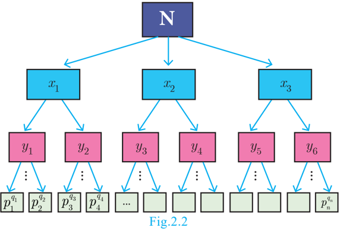

**Thinking Corner**

Is 1 a prime number?

**Progress Check**

- Every natural number except ______ can be expressed as ______.
- In how many ways a composite number can be written as product of power of primes?
- The number of divisors of any prime number is ______.

can be written uniquely as the product of power of primes" is called Fundamental Theorem of Arithmetic .

#### 2.4.1 Significance of the Fundamental Theorem of Arithmetic

The fundamental theorem about natural numbers except 1, that we have stated above has several applications, both in Mathematics and in other fields. The theorem is vastly important in Mathematics, since it highlights the fact that prime numbers are the 'Building Blocks' for all the positive integers. Thus, prime numbers can be compared to atoms making up a molecule.

10th 44 Standard Mathematics

- If a prime number p divides ab then either p divides a or p divides b , that is p divides at least one of them.
- If a composite number n divides ab, then n neither divide a nor b . For example, 6 divides 4 × 3 but 6 neither divide 4 nor 3 .

Example 2.7 In the given factorisation, find the numbers m and n .

Value of the first box from bottom =×52 = 10

Value of the second box from bottom =×350 = 150

Thus, the required numbers are m = 300 , n = 50

Example 2.8 Can the number 6 n , n n being a natural number end with the digit 5? Give reason for your answer.

2 is a factor of 6 n . So, 6 n is always even. But any number whose last digit is 5 is always odd. Hence, 6 n cannot end with the digit 5 .

Example 2.9 Is 75 ××32 ×+ 3 a composite number? Justify your answer.

Yes, the given number is a composite number, because


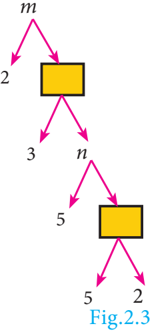

**Progress Check**

- Let m divides n. Then GCD and LCM of m , n n are ____ and ____.
- The HCF of numbers of the form 2m and 3 n is _____.

Since the given number can be factorized in terms of two primes, it is a composite number.

The number 800 can be factorized as

This implies that a = 2 and b = 5 (or) a = 5 and b = 2 .

**Activity 3**

**Thinking Corner**

Can you think of positive integers a , b such thatab b= b ba = ?


Numbers and Sequences


- For what values of natural number n , 4n can end with the digit 6?
- If m , n n are natural numbers, for what values of m, does 25 n´ 5 nm ´ ´ ends in 5?
- Find the HCF of 252525 and 363636 .
- If 13824 =× 23 a × 3 ab then find a and b .
- Find the LCM and HCF of 408 and 170 by applying the fundamental theorem of arithmetic.
- Find the greatest number consisting of 6 digits which is exactly divisible by 24 , 15 , 36?
- What is the smallest number that when divided by three numbers such as 35 , 56 and 91 leaves remainder 7 in each case?
- Find the least number that is divisible by the first ten natural numbers.

### 2.5 Modular Arithmetic

In a clock, we use the numbers 1 to 12 to represent the time period of 24 hours. How is it possible to represent the 24 hours of a day in a 12 number format? We use 1 , 2 , 3 , 4 , 5 , 6 , 7 , 8 , 9 , 10 , 11 , 12 and after 12, we use 1 instead of 13 and 2 instead of 14 and so on. That is after 12 we again start from 1 , 2 , 3,... In this system the numbers wrap around 1 to 12. This type of wrapping around after hitting some value is called Modular Arithmetic .

In Mathematics, modular arithmetic is a system of arithmetic for integers where numbers wrap around a certain value. Unlike normal arithmetic, Modular Arithmetic process cyclically. The ideas of Modular arithmetic was developed by great German mathematician Carl Friedrich Gauss, who is hailed as the "Prince of mathematicians". .

**Examples**

- The day and night change repeatedly.
- The days of a week occur cyclically from Sunday to Saturday.
- The life cycle of a plant.
- The seasons of a year change cyclically. (Summer, Autumn, Winter, Spring)
- The railway and aeroplane timings also work cyclically. The railway time starts at 00:00 and continue. After reaching 23:59, the next minute will become 00:00 instead of 24:00 .

10th 46 Standard Mathematics


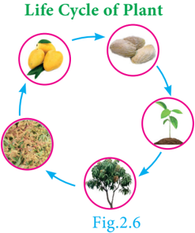

#### 2.5.1 Congruence Modulo

Two integers a and b are congruence modulo n if they differ by an integer multiple of n. That ab − b −= kn for some integer k. This can also be written as ab º (mod n).

Here the number n is called modulus. In other words, ab º (mod n) means ab - - is divisible by n .

For example, 61 º 5 (mod 7) because 61 – 55 = 6 is divisible by 7 .

Note

- ¾ When a positive integer is divided by n, then the possible remainders are 0 , 1 , 2 , . . . , n - 1 .
- ¾ Thus, when we work with modulo n, we replace all the numbers by their remainders upon division by n, given by 0 , 1 , 2 , 3 ,..., n - 1 .

Two illustrations are provided to understand modulo concept more clearly.

**Illustration 1**

To find 8 (mod 4)

With a modulus of 4 (since the possible remainders are 0 , 1 , 2 , 3) we make a diagram like a clock with numbers 0 , 1 , 2 , 3. We start at 0 and go through 8 numbers in a clockwise sequence 1 , 2 , 3 , 0 , 1 , 2 , 3 , 0. After doing so cyclically, we end at 0 .

Therefore, 80 º (mod 4)

**Illustration 2**

To find - 5 (mod 3)

With a modulus of 3 (since the possible remainders are 0 , 1 , 2) we make a diagram like a clock with numbers 0 , 1 , 2 .

We start at 0 and go through 5 numbers in anti-clockwise sequence 2 , 1 , 0 , 2 , 1. After doing so cyclically, we end at 1 .

Therefore, −≡51 (mod 3)

#### 2.5.2 Connecting Euclid's Division lemma and Modular Arithmetic

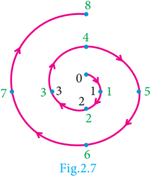

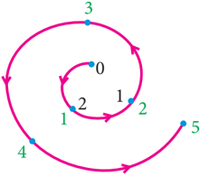

Let m and n be integers, where m is positive. Then by Euclid's division lemma, we can write nm =+qr where 0 ≤<rm and q is an integer. Instead of writing nm =+qr we can use the congruence notation in the following way.

We say that n is congruent to r modulo m , if nm =+qr for some integer q .

n =+ mq r n– n– r = mq n– n– r º 0 (mod m) n º r (mod m)

**Progress Check**

- Two integers a and b are congruent modulo n if ___________.
- The set of all positive integers which leave remainder 5 when divided by 7 are ___________.

Thus the equation nm =+qr through Euclid's Division lemma can also be written as nr º (mod m).

Two integers a and b are congruent modulo m , written as ab º (mod m), if they leave the same remainder when divided by m .

How many integers exist which leave a remainder of 2 when divided by 3?

#### 2.5.3 Modulo operations

Similar to basic arithmetic operations like addition, subtraction and multiplication performed on numbers we can think of performing same operations in modulo arithmetic. The following theorem provides the information of doing this.

**Theorem 5**

a , b , c and d are integers and m is a positive integer such that if ab º (mod m) and cd º (mod m) then

**Illustration 3**

If 17 º 4 (mod 13) and 42 º 3 (mod 13) then from theorem 5,

- (i) 17 + 42 ≡+43 (mod 13)

- (ii) 17 - 42 ≡−43 (mod 13)

- (iii) 17´42 ≡×43 (mod 13)

**Theorem 6**

If ab º (mod m) then

- (i) ac º bc (mod m) (ii) ac ±± º bc (mod m) for any integer c

**Progress Check**

- The positive values of k such that () k−≡ 35 (mod11) are _________.
- If 59 º3 (mod 7), 46 º4 (mod 7) then 105 º _______ (mod 7),
- 13 º _______ (mod 7), 413 º _______ (mod 7), 368 ≡ _______ (mod 7).
- The remainder when 71 ´´3192 ´´´ 32931 is divided by 6 is ________.

10th 48 Standard Mathematics

Example 2.11 Find the remainders when 70004 and 778 is divided by 7 .

Since 70000 is divisible by 7

Therefore, the remainder when 70004 is divided by 7 is 4 .

777 is divisible by 7

Therefore, the remainder when 778 is divided by 7 is 1 .

Example 2.12 Determine the value of d such that 15 º 3 (mod d).

15 º 3 (mod d) means 15 −=3 kd , for some integer k .

⇒ d divides 12 .

The divisors of 12 are 1 , 2 , 3 , 4 , 6 , 12. But d should be larger than 3 and so the possible values for d are 4 , 6 , 12 .

Example 2.13 Find the least positive value of x such that

Solution (i)

66 + x is a multiple of 4 .

Therefore, the least positive value of x must be 2, since 68 is the nearest multiple of 4 more than 66 .

(ii) 98 ≡+ () x 4 ) 4 (mod 5) 98 −+ () x 4 4 = 5n , for some integer n . 94 - x = 5n 94 - x is a multiple of 5 . Therefore, the least positive value of x must be 4 94 −=490 is the nearest multiple of 5 less than 94 .

While solving congruent equations, we get infinitely many solutions compared to finite number of solutions in solving a polynomial equation in Algebra.

Example 2.14 Solve 81 x º (mod 11)

81 x º (mod 11) can be written as 81 xk −= 11 , for some integer k .

When we put k = 5 , 13 , 21 , 29,... then 11k+1 is divisible by 8 .

∴ The solutions are 7 , 18 , 29 , 40 , …

Example 2.15 Compute x, such that 10 4 º x (mod 19)

Solution

Example 2.16 Find the number of integer solutions of 31 x º (mod 15).

31 x º (mod 15) can be written as

Solution

31 xk −= 15 for some integer k

5k is an integer, 5 1 3 k + cannot be an integer.

So there is no integer solution.

Example 2.17 A man starts his journey from Chennai to Delhi by train. He starts at 22 . 30 hours on Wednesday. If it takes 32 hours of travelling time and assuming that the train is not late, when will he reach Delhi?

10th 50 Standard Mathematics

Starting time 22 . 30, Travelling time 32 hours. Here we use modulo 24 .

The reaching time is

22 . 30 + 32 (mod 24) º 54 . 30 (mod24) º . 6 . 630 (mod24) ( 32 = (1×24) + 8 Thursday Friday)

Thus, he will reach Delhi on Friday at 6 . 30 hours.

Example 2.18 Kala and Vani are friends. Kala says, "Today is my birthday" and she asks Vani, "When will you celebrate your birthday?" Vani replies, "Today is Monday and I celebrated my birthday 75 days ago". Find the day when Vani celebrated her birthday.

Let us associate the numbers 0 , 1 , 2 , 3 , 4 , 5 , 6 to represent the weekdays from Sunday to Saturday respectively.

Vani says today is Monday. So the number for Monday is 1. Since Vani's birthday was 75 days ago, we have to subtract 75 from 1 and take the modulo 7, since a week contain 7 days.

Thus, 17 −≡53 (mod 7)

The day for the number 3 is Wednesday.

Therefore, Vani's birthday must be on Wednesday.


- Find the least positive value of x such that
- (i) 71 º x (mod 8) (ii) 78 +≡x 3 (mod 5) (iii) 89 ≡+ () x 3 ) 3 (mod 4)

- If x is congruent to 13 modulo 17 then 73 x - - is congruent to which number modulo 17?
- Solve 54 x º (mod 6)
- Solve 32 x −≡ 0 (mod 11)
- What is the time 100 hours after 7 a.m.?
- What is the time 15 hours before 11 p.m.?
- Today is Tuesday. My uncle will come after 45 days. In which day my uncle will be coming?
- Find the remainder when 2 81 is divided by 17 .

- The duration of flight travel from Chennai to London through British Airlines is approximately 11 hours. The airplane begins its journey on Sunday at 23:30 hours. If the time at Chennai is four and half hours ahead to that of London's time, then find the time at London, when will the flight lands at London Airport.

### 2.6 Sequences

Consider the following pictures.

There is some pattern or arrangement in these pictures. In the first picture, the first row contains one apple, the second row contains two apples and in the third row there are three

apples etc... The number of apples in each of the rows are 1 , 2 , 3 , ...

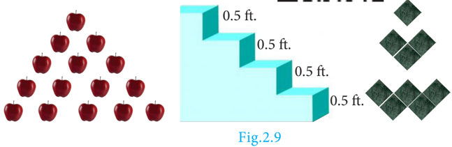

In the second picture each step have 0 . 5 feet height. The total height of the steps from the base are 0 . 5 feet,1 feet, 1 . 5 feet,... In the third picture one square, 3 squares, 5 squares, ... These numbers belong to category called "Sequences". .

**Definition**

A real valued sequence is a function defined on the set of natural numbers and taking real values.

Each element in the sequence is called a term of the sequence. The element in the first position is called the first term of the sequence. The element in the second position is called second term of the sequence and so on.

**Illustration**

- 1 , 3 , 5 , 7,... is a sequence with general term an n =2 n n =− 2 n − 21 . When we put n = 12, 2,, 3 ,..., we get a 1 =1 , a 2 = 3 , a 3 = 5 , a 4 = 7 , ...

If the number of elements in a sequence is finite then it is called a Finite sequence . If the number of elements in a sequence is infinite then it is called an Infinite sequence .

10th 52 Standard Mathematics

**Sequence as a Function**

**Progress Check**

- Fill in the blanks for the following sequences
- (i) 7 , 13 , 19 , _____ , ... (ii) 2 , _____, 10 , 17 , 26
- (iii) 1000 , 100 , 10 , 1 , _____, ...
- A sequence is a function defined on the set of _____.
- The nth term of the sequence 0 , 2 , 6 , 12 , 20,... can be expressed as _____.
- Say True or False
- (i) All sequences are functions
- (ii) All functions are sequences.

Example 2.19 Find the next three terms of the sequences

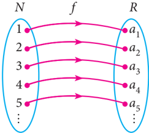

In the above sequence the numerators are same and the denominator is increased by 4 .

So the next three terms are a 5 1 14 4 1 18 = + =

Here each term is decreased by 3. So the next three terms are -7, -10 , - 13 .

Though all the sequences are functions, not all the functions are sequences.

Here each term is divided by 10. Hence, the next three terms are

Example 2.20 Find the general term for the following sequences

(i) 369 ,, 69 ,,, ...

Here the terms are multiples of 3. So the general term is

- (iii) 52 ,- 2 ,, 5 - , 5 125 , ...

The terms of the sequence have + and – sign alternatively and also they are in powers of 5 .

Example 2.21 The general term of a sequence is defined as

Find the eleventh and eighteenth terms.

To find a 11 , since 11 is odd, we put n = 11in an n =( n n n =+ ()3

Thus, the eleventh term

To finda 18 , since 18 is even, we put

Thus, the eighteenth term

Example 2.22 Find the first five terms of the following sequence.

The first two terms of this sequence are given bya 1 = 1 , a 2 = 1. The third term a 3 depends on the first and second terms.

10th 54 Standard Mathematics

Similarly the fourth term a 4 depends upon a 2 and a 3 .

In the same way, the fifth term a 5 can be calculated as

Therefore, the first five terms of the sequence are 1 , 1 , 1 4 , 1 16 , and 1 52


- Find the next three terms of the following sequence.

- (i) 8 , 24 , 72 , …
- (ii) 5 , 1 , - 3, …
- Find the first four terms of the sequences whose n th terms are given by

- (i) an n = n n =− 3 2
- Find the n th term of the following sequences

- (i) 25, 5,, 10 ,, 17 17 ...
- (iii) 38, 8,, 13 ,, 18 18 ...
- Find the indicated terms of the sequences whose n th terms are given by

### 2.7 Arithmetic Progression

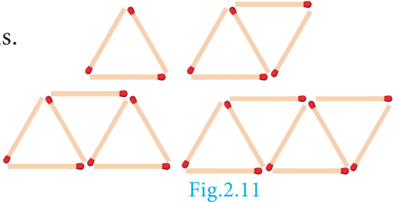

Let us begin with the following two illustrations.

**Illustration 1**

Make the following figures using match sticks

- (i) How many match sticks are required for each figure? 3 , 5 , 7 and 9 .
- (ii) Can we find the difference between the successive numbers?

Therefore, the difference between successive numbers is always 2 .

A man got a job whose initial monthly salary is fixed at ₹10 , 000 with an annual increment of ₹2000. His salary during 1 st , 2 nd and 3 rd years will be ₹10000, ₹12000 and ₹14000 respectively.

If we now calculate the difference of the salaries for the successive years, we get 12000 –; 10000 == 2000 14000 – 12000 14000 – 12000 2000 . Thus the difference between the successive numbers (salaries) is always 2000 .

Did you observe the common property behind these two illustrations? In these two examples, the difference between successive terms always remains constant. Moreover, each term is obtained by adding a fixed number (2 and 2000 in illustrations 1 and 2 presented above) to the preceding term except the first term. This fixed number which is a constant for the differences between successive terms is called the "common difference". .

**Definition**

Let a and d be real numbers. Then the numbers of the form a , ad + , ad + 2 , ad + 3 , ad + 4 , ... is said to form Arithmetic Progression denoted by A.P. The number 'a' is called the first term and 'd' is called the common difference .

Simply, an Arithmetic Progression is a sequence whose successive terms differ by a constant number. Thus, for example, the set of even positive integers 2 , 4 , 6 , 8 , 10 , 12,… is an A.P. whose first term is a = 2 and common difference is also d = 2 since 42 −= 2 , 64 −= 2 , 86 −= 2 , …

Most of common real−life situations often produce numbers in A.P.

- ¾ The difference between any two consecutive terms of an A.P. is always constant. That constant value is called the common difference.
- ¾ If there are finite numbers of terms in an A.P. then it is called Finite Arithmetic Progression. If there are infinitely many terms in an A.P. then it is called Infinite Arithmetic Progression.

#### 2.7.1 Terms and Common Difference of an A.P.

- The terms of an A.P. can be written as

In general, the n th term denoted by t n can be written as ta = nd ) −1 n a n=+ () −1 .

- In general to find the common difference of an A.P. we should subtract first term from the second term, second from the third and so on.

**Progress Check**

- The difference between any two consecutive terms of an A.P. is _______.
- If a and d are the first term and common difference of an A.P. then the 8 th term is _______.


Let us try to find the common differences of the following A.P.'s

The common difference of an A.P. can be positive, negative or zero.

**Thinking Corner**

Example 2.23 Check whether the following sequences are in A.P. or not?

To check that the given sequence is in A.P., it is enough to check if the differences between the consecutive terms are equal or not.

Thus, the differences between consecutive terms are equal.

Hence the sequence xx ++ 22, x + 2,, 3 , 33x + 4 , ... is in A.P.

Thus, the differences between consecutive terms are not equal. Hence the terms of the sequence 2 , 4 , 8 , 16, . . . are not in A.P.

Thus, the differences between consecutive terms are equal. Hence the terms of the sequence 32 , 52 , 72 , 92 , ... are in A.P.

Example 2.24 Write an A.P. whose first term is 20 and common difference is 8 .

First term ==a a 20 ; common difference = d= 8

Arithmetic Progression is a , ad + , ad + 2, ad + 3, ...

In this case, we get 20 , 20 + 8 , 20 + 28() , 20 + 38() , ...

So, the required A.P. is 20 , 28 , 36 , 44 , …

Note

An Arithmetic progression having a common difference of zero is called a constant arithmetic progression.

**Activity 4**

There are five boxes here. You have to pick one number from each box and form five Arithmetic Progressions.

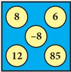

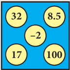

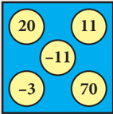

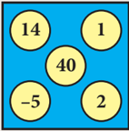

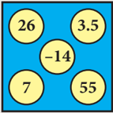

Example 2.25 Find the 15 th , 24 th and n th term (general term) of an A.P. given by 3 , 15 , 27 , 39 ,…

We have, first term ==a 3 and common difference ==d 15 −=312 .

Thus,

12

9 ```markdown 9 ``` ``` 9 ``` 9 ``` 9 ``` 9 ``` 9 ``` 9 ``` 9 ``` 9 ``` 9 ``` 9 ``` 9 ``` 9 ``` 9 ``` 9 ``` 9 ``` 9 ``` 9 ``` 9 ``` 9 ``` 9 ``` 9 ``` 9 ``` 9 ``` 9 ``` 9 ``` 9 ``` 9 ``` 9 ``` 9 ``` 9 ``` 9 ``` 9 ``` 9 ``` 9 ``` 9 ``` 9 ``` 9 ``` 9 ``` 9 ``` 9 ``` 9 ``` 9 ``` 9 ``` 9 ``` 9 ``` 9 ``` 9 ``` 9 ``` 9 ``` 9 ``` 9 ``` 9 ``` 9 ``` 9 ``` 9 ``` 9 ``` 9 ``` 9 ``` 9 ``` 9 ``` 9 ``` 9 ``` 9 ``` 9 ``` 9 ``` 9 ``` 9 ``` 9 ``` 9 ``` 9 ``` 9 ``` 9 ``` 9 ``` 9 ``` 9 ``` 9 ``` 9 ``` 9 ``` 9 ``` 9 ``` 9 ``` 9 ``` 9 ``` 9 ``` 9 ``` 9 ``` 9 ``` 9 ``` 9 ``` 9 ``` 9 ``` 9 ``` 9 ``` 9 ``` 9 ``` 9 ``` 9 ``` 9 ```

tn =12

n =− 12

n --- n --- --- --- --- --- --- --- --- --- --- --- --- --- --- --- --- --- --- --- --- --- --- --- --- --- --- --- --- --- --- --- --- --- --- --- --- --- --- --- --- --- --- --- --- --- --- --- --- --- --- --- --- --- --- --- --- --- --- --- --- --- --- --- --- --- --- --- --- --- --- --- --- --- --- --- --- --- --- --- --- --- --- --- --- --- --- --- --- --- --- --- --- --- --- --- --- --- --- --- --- --- --- --- --- --- --- --- --- --- --- --- --- --- --- --- --- --- --- --- --- --- --- --- --- --- --- --- --- --- --- --- --- --- --- --- --- --- --- --- --- --- --- --- --- --- --- --- --- --- --- --- --- --- --- --- --- --- --- --- --- --- --- --- --- --- ---

10th 58 Standard Mathematics

In a finite A.P. whose first term is a and last term l, then the number of terms in the A.P. is

Example 2.26 Find the number of terms in the A.P. 3 , 6 , 9 , 12 ,…, 111 .

**Solution**

First term a = 3 ; common difference d =−= 63 3 ; last term l = 111

Thus the A.P. contain 37 terms.

**Progress Check**

- The common difference of a constant A.P. is _______.
- If a and l are first and last terms of an A.P. then the number of terms is _______.

Example 2.27 Determine the general term of an A.P. whose 7 th term is −1 and 16 th term is 17 .

It is given that t 7 =− 1and t 16 = 17 ad +− () 71 =−1and ad +− () 16 1 d ) 11 = 7 ad + 6 =−1 ... (1) ad + 15 = 17 ... (2)

Subtracting equation (1) from equation (2), we get 91 d = 8 ⇒ d = 2

Putting d = 2 in equation (1), we get a += 12 −1 ∴ a = –13

Hence, general term t n =+an() −1 d

Example 2.28 If l th , m th and nth terms of an A.P. are x , y, z z respectively, then show that

(i) Let a be the first term and d be the common difference. It is given that

Using the general term formula

- (ii) On subtracting equation (2) from equation (1), equation (3) from equation (2) and equation (1) from equation (3), we get

**Note**

In an Arithmetic Progression

- ¾ If every term is added or subtracted by a constant, then the resulting sequence is also an A.P.
- ¾ If every term is multiplied or divided by a non-zero number, then the resulting sequence is also an A.P.
- ¾ If the sum of three consecutive terms of an A.P. is given, then they can be taken as ad - - , a a and ad + . Here the common difference is d .
- ¾ If the sum of four consecutive terms of an A.P. is given then, they can be taken as ad - 3 - 3 , ad - - , ad + and ad + 3 . Here common difference is 2d .

Example 2.29 In an A.P., sum of four consecutive terms is 28 and the sum of their squares is 276. Find the four numbers.

Let us take the four terms in the form () ad - 3 , () ad - , () ad + and () ad + 3 .

Since, sum of the four terms is 28 ,

Similarly, since sum of their squares is 276 ,

If d = 2 then the four numbers are 73 - - ()2 , 72 - - , 72 + , 7+3(2)

That is the four numbers are 1 , 5 , 9 and 13 .

10th 60 Standard Mathematics If a = 7, d =−2 then the four numbers are 13 , 9 , 5 and 1

Therefore, the four consecutive terms of the A.P. are 1 , 5 , 9 and 13 .

**Condition for three numbers to be in A.P.**

If a , b , c are in A.P. then a = a, ba =+d , ca =+ 2d

Similarly, if 2ba =+c , then ba −= cb − − so a , b , c are in A.P.

Thus three non-zero numbers a , b , c are in A.P. if and only if 2ba =+c

Example 2.30 A mother divides ₹207 into three parts such that the amount are in A.P. and gives it to her three children. The product of the two least amounts that the children had ₹4623. Find the amount received by each child.

Let the amount received by the three children be in the form of A.P. is given by ad - - , a , ad + . Since, sum of the amount is ₹207, we have

It is given that product of the two least amounts is 4623 .

Therefore, amount given by the mother to her three children are ₹(69−2), ₹69, ₹(69+2). That is, ₹67, ₹69 and ₹71 .

**Progress Check**

- If every term of an A.P. is multiplied by 3, then the common difference of the new A.P. is _______.
- Three numbers a , b and c will be in A.P. if and only if _______.


- Check whether the following sequences are in A.P.

- First term a and common difference d are given below. Find the corresponding A.P.

- Find the first term and common difference of the Arithmetic Progressions whose n th terms are given below

- n
- n
- Find the 19 th term of an A.P. -- 11 11 ,,, 15 19 15 - 19 ...
- Which term of an A.P. 16 , 11 , 6 , 1,... is - 54 ?
- Find the middle term(s) of an A.P. 9 , 15 , 21 , 27 ,…, 183 .
- If nine times ninth term is equal to the fifteen times fifteenth term, show that six times twenty fourth term is zero.
- If 3 + k , 18 - k , 51 k + are in A.P. then find k .
- Find x , y y and z, given that the numbers x , 10 , y, 24 , z z are in A.P.
- In a theatre, there are 20 seats in the front row and 30 rows were allotted. Each successive row contains two additional seats than its front row. How many seats are there in the last row?
- The sum of three consecutive terms that are in A.P. is 27 and their product is 288 . Find the three terms.
- The ratio of 6 th and 8 th term of an A.P. is 7:9. Find the ratio of 9 th term to 13 th term.
- In a winter season let us take the temperature of Ooty from Monday to Friday to be in A.P. The sum of temperatures from Monday to Wednesday is 0° C and the sum of the temperatures from Wednesday to Friday is 18° C. Find the temperature on each of the five days.
- Priya earned ₹15 , 000 in the first month. Thereafter her salary increased by ₹1500 per year. Her expenses are ₹13 , 000 during the first month and the expenses increases by ₹900 per year. How long will it take for her to save ₹20 , 000 per month.

### 2.8 Series

If a series has finite number of terms then it is called a Finite series. If a series has infinite number of terms then it is called an Infinite series. Let us focus our attention only on studying finite series.

#### 2.8.1 Sum to n terms of an A.P.

A series whose terms are in Arithmetic progression is called Arithmetic series.

Let aa, a,, +d , ++ da 23 da,+ 3 a,, + d + d ... be the Arithmetic Progression.

The sum of first n terms of a Arithmetic Progression denoted by S n n is given by,

Rewriting the above in reverse order

Adding (1) and (2) we get,

If the first term a, and the last term l (n th term) are given then

**Progress Check**

- The sum of terms of a sequence is called ______.
- If a series have finite number of terms then it is called ______.
- A series whose terms are in ______ is called Arithmetic series.
- If the first and last terms of an A.P. are given, then the formula to find the sum is ______.

Here the first term a = 8, common difference d =− 7 1 1 4 8 =− 3 4 ,

Here the value of n is not given. But the last term is given. From this, we can find the value of n .

Given, a = 04. . 0 and l = 1 , we find d =− 04.3 4.. 30 − . 30 40 = 00. . 3 .

So, the sum of 21 terms of the given series is 14 . 7 .

Example 2.33 How many terms of the series 15 +++9 ... must be taken so that their sum is 190?

Here we have to find the value of n, such that S n = 190.

First term a = 1, common difference d =−51 = 4 .

Sum of first n terms of an A.P.

**Thinking Corner**

The value of n must be positive. Why?

**Progress Check**

State True or False. Justify it.

- The nth term of any A.P. is of the form pn+q where p and q are some constants.
- The sum to nth term of any A.P. is of the form pn 2 +qn + r where p , q, r are some constants.

Example 2.34 The 13 th term of an A.P. is 3 and the sum of first 13 terms is 234. Find the common difference and the sum of first 21 terms.

10th 64 Standard Mathematics

Solving (1) and (2) we get, a = 33 , d = − 5 2

Therefore, common difference is - 5 2 .

Example 2.35 In an A.P. the sum of first n terms is 5 2 3 2 2 3nn + . Find the 17 th term. Solution The 17th term can be obtained by subtracting the sum of first 16 terms from the sum of first 17 terms

Example 2.36 Find the sum of all natural numbers between 300 and 600 which are divisible by 7 .

The natural numbers between 300 and 600 which are divisible by 7 are 301 , 308 , 315 , …, 595 .

The terms of the above series are in A.P.

First term a = 301 ; common difference d = 7 ; Last term l = 595 .

Example 2.37 A mosaic is designed in the shape of an equilateral triangle, 12 ft on each side. Each tile in the mosaic is in the shape of an equilateral triangle of 12 inch side. The tiles are alternate in colour as shown in the figure. Find the number of tiles of each colour and total number of tiles in the mosaic.

Since the mosaic is in the shape of an equilateral triangle of 12 feet, and the tile is in the shape of an equilateral triangle of 12 inch (1 feet), there will be 12 rows in the mosaic.

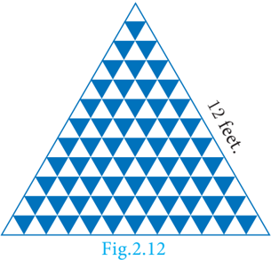

From the figure, it is clear that number of white tiles in each row are 1 , 2 , 3 , 4 , …, 12 which clearly forms an Arithmetic Progression.

Similarly the number of blue tiles in each row are 0 , 1 , 2 , 3 , …, 11 which is also an Arithmetic Progression.

66 = 144

Example 2.38 The houses of a street are numbered from 1 to 49. Senthil's house is numbered such that the sum of numbers of the houses prior to Senthil's house is equal to the sum of numbers of the houses following Senthil's house. Find Senthil's house number?

Let Senthil's house number be x .

Therefore, Senthil's house number is 35 .

If SS12 , SS12 , and S3 S3 are sum of first n , 2n and 3n terms of an A.P. respectively then

10th 66 Standard Mathematics

**Thinking Corner**

- What is the sum of first n n odd natural numbers?
- What is the sum of first n n even natural numbers?


- Find the sum of the following

- (ii) 102 , 97 , 92,… up to 27 terms.

- How many consecutive odd integers beginning with 5 will sum to 480?
- Find the sum of first 28 terms of an A.P. whose nth term is 43 n - - .
- The sum of first n terms of a certain series is given as 23 2n2 3 nn - - . Show that the series is an A.P.
- The 104th term and 4th term of an A.P. are 125 and 0. Find the sum of first 35 terms.
- Find the sum of all odd positive integers less than 450 .
- Find the sum of all natural numbers between 602 and 902 which are not divisible by 4 .
- Raghu wish to buy a laptop. He can buy it by paying ₹40 , 000 cash or by giving it in 10 installments as ₹4800 in the first month, ₹4750 in the second month, ₹4700 in the third month and so on. If he pays the money in this fashion, find
- (i) total amount paid in 10 installments.
- (ii) how much extra amount that he has to pay than the cost?
- A man repays a loan of ₹65 , 000 by paying ₹400 in the first month and then increasing the payment by ₹300 every month. How long will it take for him to clear the loan?
- A brick staircase has a total of 30 steps. The bottom step requires 100 bricks. Each successive step requires two bricks less than the previous step.
- (i) How many bricks are required for the top most step?
- (ii) How many bricks are required to build the stair case?

### 2.9 Geometric Progression

In the diagram given in Fig.2.13, D DEF is formed by joining the mid points of the sides AB, BC and CA of D ABC. Then the size of the triangle D DEF is exactly one-fourth of the size of D ABC. Similarly D GHI is also one-fourth of D DEF and so on. In general, the successive areas are one-fourth of the previous areas.

The area of these triangles are

In this case, we see that beginning with D ABC, C, we see that the successive triangles are formed whose areas are precisely one-fourth the area of the previous triangle. So, each term is obtained by multiplying 1 4 to the previous term.

As another case, let us consider that a viral disease is spreading in a way such that at any stage two new persons get affected from an affected person. At first stage, one person is affected, at second stage two persons are affected and is spreading to four persons and so on. Then, number of persons affected at each stage are 1 , 2 , 4 , 8, ... where except the first term, each term is precisely twice the previous term.

From the above examples, it is clear that each term is got by multiplying a fixed number to the preceding number.

This idea leads us to the concept of Geometric Progression.

**Definition**

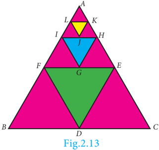

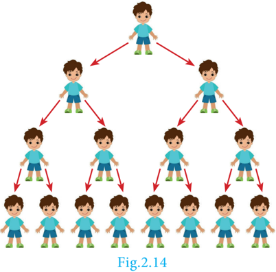

A Geometric Progression is a sequence in which each term is obtained by multiplying a fixed non-zero number to the preceding term except the first term. The fixed number is called common ratio. The common ratio is usually denoted by r .

#### 2.9.1 General form of Geometric Progression

#### 2.9.2 General term of Geometric Progression

We try to find a formula for n th term or general term of Geometric Progression (G.P.) whose terms are in the common ratio.

10th 68 Standard Mathematics aararar ,, ,..., n ar,, , ... ar ,, ... n 21 - - where a is the first term and 'r' is the common ratio. Let t n be the n th term of the G.P.

Thus, the general term or n th term of a G.P. is t n = ar n - 1

If we consider the ratio of successive terms of the G.P. then we have

Thus, the ratio between any two consecutive terms of the Geometric Progression is always constant and that constant is the common ratio of the given Progression.

**Progress Check**

- A G.P. is obtained by multiplying _____ to the preceding term.
- The ratio between any two consecutive terms of the G.P. is _____ and it is called _____.
- Fill in the blanks if the following are in G.P.

Example 2.40 Which of the following sequences form a Geometric Progression?

To check if a given sequence form a G.P. we have to see if the ratio between successive terms are equal.

Since the ratios between successive terms are not equal, the sequence 7 , 14 , 21 , 28, … is not a Geometric Progression.

Here the ratios between successive terms are equal. Therefore the sequence

1 2 ,,1 ,12 ,, 4 4 ... is a Geometric Progression with common ratio r = 2 .

**Thinking Corner**

Since the ratios between successive terms are not equal, the sequence 5 , 25 , 50 , 75,... is not a Geometric Progression.

Example 2.41 Find the geometric progression whose first term and common ratios are given by (i) a =−7 , r = 6 (ii) a = 256 , r = 0.5

(i) The general form of Geometric progression is a , ar, r, ar 2 ,...

Therefore the required Geometric Progression is −7, − 42, − 252 ,...

- , ar, r, ar 2 ,...
- (ii) The general form of Geometric progression is a

Therefore the required Geometric progression is 256 , 128 , 64 ,....

**Progress Check**

- If first term = a , common ratio = r, then find the value of t9 t9 and t 27 .

Example 2.42 Find the 8 th term of the G.P. 9 , 3 , 1 ,…

To find the 8th term we have to use the n th term formula tar = n n = − 1

Therefore the 8th term of the G.P. is 1 243 .

Example 2.43 In a Geometric progression, the 4 th term is 8 9 and the 7th term is 64 243 . Find the Geometric Progression.

10th 70 Standard Mathematics

Therefore the Geometric Progression is a, ar, ar 2 , … That is, 3 , 2 , 4 3 , ...

**Note**

- ¾ When the product of three consecutive terms of a G.P. are given, we can take the three terms as a r , a , ar. r.
- ¾ When the products of four consecutive terms are given for a G.P. then we can take the four terms as a r 3 , a r , ar, r, ar 3 .
- ¾ When each term of a Geometric Progression is multiplied or divided by a non– zero constant then the resulting sequence is also a Geometric Progression.

Example 2.44 The product of three consecutive terms of a Geometric Progression is 343 and their sum is 91 3 . Find the three terms.

Since the product of 3 consecutive terms is given.

**Thinking Corner**

we can take them as a r ,, a , aar . Product of the terms = 343

- Split 64 into three parts such that the numbers are in G.P.

- If a , b , c , … are in G.P. then 2a , 2b , 2c , …. are in ______

Sum of the terms = 91

- If 3 , x , 6 . 75 are in G.P. then x is ______

**Progress Check**

Three non-zero numbers a , b,c are in G.P. if and only if _____.

If a = 7 , r = 3 then the three terms are 7 3 , 7 , 21 .

**Condition for three numbers to be in G.P.**

Example 2.45 The present value of a machine is ₹40 , 000 and its value depreciates each year by 10%. Find the estimated value of the machine in the 6 th year.

The value of the machine at present is ₹40 , 000. Since it is depreciated at the rate of 10% after one year the value of the machine is 90% of the initial value.

After two years, the value of the machine is 90% of the value in the first year.

Continuing this way, the value of the machine depreciates in the following way as

This sequence is in the form of G.P. with first term 40 , 000 and common ratio 90 100 . For finding the value of the machine at the end of 5 th year (i.e. in 6 th year), we need to find the sixth term of this G.P.

Therefore the value of the machine in 6th year = ₹23619 . 60


- Which of the following sequences are in G.P.?

- Write the first three terms of the G.P. whose first term and the common ratio are given below.

- In a G.P. 729 , 243 , 81,… find t 7 .
- Find x so that x + 6, x + 12 and x + 15 are consecutive terms of a Geometric Progression.
- Find the number of terms in the following G.P.

10th 72 Standard Mathematics

- In a G.P. the 9th term is 32805 and 6th term is 1215. Find the 12th term.
- Find the 10th term of a G.P. whose 8th term is 768 and the common ratio is 2 .
- In a G.P. the product of three consecutive terms is 27 and the sum of the product of two terms taken at a time is 57 2 . Find the three terms.
- A man joined a company as Assistant Manager. The company gave him a starting salary of ₹60 , 000 and agreed to increase his salary 5% annually. What will be his salary after 5 years?
- Sivamani is attending an interview for a job and the company gave two offers to him. Offer A: ₹20 , 000 to start with followed by a guaranteed annual increase of 6% for the first 5 years.
- Offer B: ₹22 , 000 to start with followed by a guaranteed annual increase of 3% for the first 5 years.

What is his salary in the 4 th year with respect to the offers A and B?

### 2.10 Sum to n terms of a Geometric progression

A series whose terms are in Geometric progression is called Geometric series.

Let a , ar, r, ar 2 , ... ar n - 1 , ... be the Geometric Progression.

The sum of first n terms of the Geometric progression is

**Progress Check**

- A series whose terms are in Geometric progression is called _______.

The above formula for sum of first n terms of a G.P. is not applicable when r = 1 .

- Whenr = 1 , the formula for finding sum to n terms of a G.P. is ______.

- Whenr ¹ 1 , the formula for finding sum to n terms of a G.P. is ______.

#### 2.10.1 Sum to infinite terms of a G.P.

Example 2.46 Find the sum of 8 terms of the G.P. 13 ,− 3 ,, 3 −−9 −92 , , 7 …

Example 2.47 Find the first term of a G.P. in which S6 S6 = 4095 and r = 4 .

Common ratio=>41, Sum of first 6 terms S6 S6 = 4095

Let n be the number of terms to be added to get the sum 1365

Example 2.50 Find the rational form of the number 0 . 6666 ¼

We can express the number 0 . 6666 ¼ as follows

**Progress Check**

- Sum to infinite number of terms of a G.P. is ___.
- For what values of r, does the formula for infinite G.P. valid?

We now see that numbers 06. 6., 00. 0., 6 , 60 . 006 ... form a G.P. whose first term a = 06. . and

Using the infinite G.P. formula, we have

Thus the rational number equivalent of 0 . 6666 ¼ is 2 3

10th 74 Standard Mathematics


The sides of a given square is 10 cm. The mid points of its sides are joined to form a new square. Again, the mid points of the sides of this new square are joined to form another square. This process is continued indefinitely. Find the sum of the areas and the sum of the perimeters of the squares formed through this process.

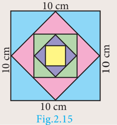

The series is neither Arithmetic nor Geometric series. So it can be split into two series and then find the sum.

We have to find the least number of terms for which the sum must be greater than 5000 .

That is, to find the least value of n. such that S n > 5000

Example 2.53 A person saved money every year, half as much as he could in the previous year. If he had totally saved ₹ 7875 in 6 years then how much did he save in the first year? Solution Total amount saved in 6 years is S6 S6 = 7875

Since he saved half as much money as every year he saved in the previous year,

The amount saved in the first year is ₹ 4000 .


- Find the sum of first six terms of the G.P. 5 , 15 , 45 , …
- Find the first term of the G.P. whose common ratio 5 and whose sum to first 6 terms is 46872 .
- If the first term of an infinite G.P. is 8 and its sum to infinity is 32 3 then find the common ratio.
- Kumar writes a letter to four of his friends. He asks each one of them to copy the letter and mail to four different persons with the instruction that they continue the process similarly. Assuming that the process is unaltered and it costs ₹2 to mail one letter, find the amount spent on postage when 8 th set of letters is mailed.
- Find the rational form of the number 0 . 123 .

### 2.11 Special Series

There are some series whose sum can be expressed by explicit formulae. Such series are called special series .

10th 76 Standard Mathematics Here we study some common special series like

- (i) Sum of first 'n' natural numbers
- (ii) Sum of first 'n' odd natural numbers.
- (iii) Sum of squares of first 'n' natural numbers.
- (iv) Sum of cubes of first 'n' natural numbers.

#### 2.11.1 Sum of first n natural numbers

Adding all these equations and cancelling the terms on the Left Hand side, we get,

#### 2.11.2 Sum of first n odd natural numbers

#### 2.11.3 Sum of squares of first n natural numbers

Adding all these equations and cancelling the terms on the Left Hand side, we get,

#### 2.11.4 Sum of cubes of first n natural numbers

Adding all these equations and cancelling the terms on the Left Hand side, we get,


**Ideal Friendship**

Consider the numbers 220 and 284 .

Sum of the divisors of 220 (excluding 220) = 1+2+4+5+10+11+20+22+44+55+110=284

Sum of the divisors of 284 (excluding 284) =1+2+4+71+142=220 .

Thus, sum of divisors of one number excluding itself is the other. Such pair of numbers is called Amicable Numbers or Friendly Numbers.

220 and 284 are least pair of Amicable Numbers. They were discovered by Pythagoras. We now know more than 12 million amicable pair of Numbers.


**Take a triangle like this**

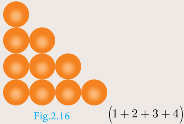

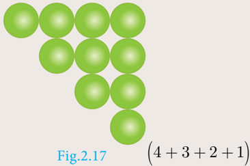

Join the second triangle with the first to get Make another triangle like this.

Thus, two copies of 1 ++234 + provide a rectangle of size 45 ´ .

We can write in numbers, what we did with pictures.

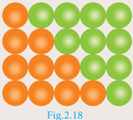

In a similar, fashion, try to find the sum of first 5 natural numbers. Can you relate these answers to any of the known formula?

- The sum of first n natural numbers are also called Triangular Numbers because they form triangle shapes.
- The sum of squares of first n natural numbers are also called Square Pyramidal Numbers because they form pyramid shapes with square base.

**Thinking Corner**

- How many squares are there in a standard chess board?
- How many rectangles are there in a standard chess board?

Here is a summary of list of some useful summation formulae which we discussed. These formulae are used in solving summation problems with finite terms.

Example 2.54 Find the value of (i)12 ++ 35 ++ ... ... 0 (ii) 16 ++ 17 18 ++ ... ... 75

**Progress Check**

- The sum of cubes of first n natural numbers is __________ of the first n natural numbers.
- The average of first 100 natural numbers is __________.

10th 80 Standard Mathematics

But n ≠−37 ( n is a natural number); Hence n = 36 .

**Progress Check**

Say True or False. Justify them.

- The sum of first n odd natural numbers is always an odd number.
- The sum of consecutive even numbers is always an even number.
- The difference between the sum of squares of first n natural numbers and the sum of first n natural numbers is always divisible by 2 .
- The sum of cubes of the first n natural numbers is always a square number.


- Find the sum of the following series

- The sum of the cubes of the first n natural numbers is 2025, then find the value of n .
- Rekha has 15 square colour papers of sizes 10 cm, 11 cm, 12 cm,…, 24 cm. How much area can be decorated with these colour papers?


- Euclid's division lemma states that for positive integers a and b, there exist unique integers q and r such that ab =+qr , where r must satisfy.
- (A) 1 <<rb
- (B) 0 <<rb
- (C) 0 ≤<rb
- (D) 0 <≤rb
- Using Euclid's division lemma, if the cube of any positive integer is divided by 9 then the possible remainders are
- (A) 0 , 1 , 8
- (B) 1 , 4 , 8
- (C) 0 , 1 , 3
- (D) 1 , 3 , 5
- If the HCF of 65 and 117 is expressible in the form of 65m -117 , then the value of m is
- (A) 4
- (B) 2
- (C) 1
- (D) 3
- The sum of the exponents of the prime factors in the prime factorization of 1729 is
- (A) 1
- (B) 2
- (C) 3
- (D) 4
5. The least number that is divisible by all the numbers from 1 to 10 (both inclusive) is
- (A) 2025
- (B) 5220
- (C) 5025
- (D) 2520
- 74k º_____ (mod 100)
- (A) 1
- (B) 2
- (C) 3
- (D) 4
- (A)3
- (B)5
- (C)8
- (D)11
8. The first term of an arithmetic progression is unity and the common difference is 4 . Which of the following will be a term of this A.P.
- (A) 4551
- (B) 10091
- (C) 7881
- (D) 13531
- If 6 times of 6th term of an A.P. is equal to 7 times the 7 th term, then the 13 th term of the A.P. is
- (A) 0
- (B) 6
- (C) 7
- (D) 13
- An A.P. consists of 31 terms. If its 16th term is m, then the sum of all the terms of this A.P. is
- (D) 31 2 m
- (A) 16 m
- (B) 62 m
- (C) 31 m
11. In an A.P., the first term is 1 and the common difference is 4. How many terms of the A.P. must be taken for their sum to be equal to 120?
- (A) 6
- (B) 7
- (C) 8
- (D) 9
- (A) B is 2 64 more than A
- (B) A and B are equal
- (C) B is larger than A by 1
- (D) A is larger than B by 1

- 10th 82 Standard Mathematics

- (A) 1
- (B) 1 27
- (D) 1 81
- (C) 2 3

- (B) an Arithmetic Progression
- (A) a Geometric Progression
- (C) neither an Arithmetic Progression nor a Geometric Progression
- (D) a constant sequence


**Unit Exercise - 2**

- A milk man has 175 litres of cow's milk and 105 litres of buffalow's milk. He wishes to sell the milk by filling the two types of milk in cans of equal capacity. Calculate the following (i) Capacity of a can (ii) Number of cans of cow's milk (iii) Number of cans of buffalow's milk.
- When the positive integers a , b and c are divided by 13 the respective remainders are 9 , 7 and 10. Find the remainder when ab ++ 23c is divided by 13 .
- Show that 107 is of the form 43 q + for any integer q .
- If () m + 1 th + 1 term of an A.P. is twice the () n + 1 th + 1 term, then prove that (3m+1) th term is twice the () mn ++ 1 th n ++ 1 term.
- Find the 12th term from the last term of the A. P --2 -24 , 4 ,, -- 6 6 , ... 100 .
- Two A.P.'s have the same common difference. The first term of one A.P. is 2 and that of the other is 7. Show that the difference between their 10th terms is the same as the difference between their 21st terms, which is the same as the difference between any two corresponding terms.
- A man saved ₹16500 in ten years. In each year after the first he saved ₹100 more than he did in the preceding year. How much did he save in the first year?
- Find the G.P. in which the 2nd term is 6 and the 6th term is 96 .
- The value of a motor cycle depreciates at the rate of 15% per year. What will be the value of the motor cycle 3 year hence, which is now purchased for ₹ 45 , 000?

**Points to Remember**

**z Euclid's division lemma**

If a and b are two positive integers then there exist unique integers q and r such that ab =+qr , 0 ≤ r < |b |

**z Fundamental theorem of arithmetic**

Every composite number can be expressed as a product of primes and this factorization is unique except for the order in which the prime factors occur.

**z Arithmetic Progression**

- (i) Arithmetic Progression is aa , a ,, +d , ++ da 23 da ,+ 3 a ,, +d 3 , +…d . n th term is given by (nd) n =+ −1 n =+ −1
- (iii) If the last term l (n th term) is given, then S n al + n a=+[ 2 al +[]

**z Geometric Progression**

- (iii) Suppose r =1 then Sna n = n =

**z Special Series**

**ICT CORNER**

**ICT 2.1**

Step 1: Open the Browser type the URL Link given below (or) Scan the QR Code. GeoGebra work book named "Numbers and Sequences" will open. In the left side of the work book there are many activity related to mensuration chapter. Select the work sheet "Euclid's Lemma division"

Step 2: In the given worksheet Drag the point mentioned as "Drag Me" to get new set of points. Now compare the Division algorithm you learned from textbook.

**ICT 2.2**

**Expected results**

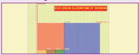

Step 1: Open the Browser type the URL Link given below (or) Scan the QR Code. GeoGebra work book named "Numbers and Sequences" will open. In the left side of the work book there are many activity related to mensuration chapter. Select the work sheet "Bouncing Ball Problem".

Step 2: In the given worksheet you can change the height, Number of bounces and debounce ratio by typing new value. Then click "Get Ball", and then click "Drop". The ball bounces as per your value entered. Observe the working given on right hand side to learn the sum of sequence.

You can repeat the same steps for other activities

https://www.geogebra.org/m/jfr2zzgy#chapter/356192 or Scan the QR Code.

10th 84 Standard Mathematics

**Expected results**

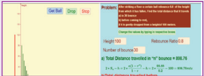
