# Chapter 2

## NUMBERS AND SEQUENCES

"I know numbers are beautiful, if they aren't beautiful, nothing is" – Paul Erdos

Srinivasa Ramanujan was an Indian mathematical genius who was born in Erode in a poor family. He was a child prodigy and made calculations at lightning speed. He produced thousands of precious formulae, jotting them on his three notebooks which are now preserved at the University of Madras. With the help of several notable men, he became the first research scholar in the mathematics department of University of Madras. Subsequently, he went to England and collaborated with G.H. Hardy for five years from 1914 to 1919.

He possessed great interest in observing the pattern of numbers and produced several new results in Analytic Number Theory. His mathematical ability was compared to Euler and Jacobi, the two great mathematicians of the past Era. Ramanujan wrote thirty important research papers and wrote seven research papers in collaboration with G.H. Hardy. He has produced 3972 formulas and theorems in very short span of 32 years lifetime. He was awarded B.A. degree for research in 1916 by Cambridge University which is equivalent to modern day Ph.D. Degree. For his contributions to number theory, he was made Fellow of Royal Society (F.R.S.) in 1918.

His works continue to delight mathematicians worldwide even today. Many surprising connections are made in the last few years of work made by Ramanujan nearly a century ago.

---

## Learning Outcomes

- To study the concept of Euclid's Division Lemma.
- To understand Euclid's Division Algorithm.
- To find the LCM and HCF using Euclid's Division Algorithm.
- To understand the Fundamental Theorem of Arithmetic.
- To understand the congruence modulo '$n$', addition modulo '$n$' and multiplication modulo '$n$'.
- To define sequence and to understand sequence as a function.
- To define an Arithmetic Progression (A.P.) and Geometric Progression (G.P.).
- To find the $n^{th}$ term of an A.P. and its sum to $n$ terms.
- To find the $n^{th}$ term of a G.P. and its sum to $n$ terms.
- To determine the sum of some finite series such as $\sum n$, $\sum n^2$, $\sum n^3$.

---

### 2.1 Introduction

The study of numbers has fascinated humans since several thousands of years. The discovery of Lebombo and Ishango bones which existed around 25000 years ago has confirmed the fact that humans made counting process for meeting various day to day needs. By making notches in the bones they carried out counting efficiently. Most consider that these bones were used as lunar calendar for knowing the phases of moon thereby understanding the seasons. Thus the bones were considered to be the ancient tools for counting. We have come a long way since this primitive counting method existed.

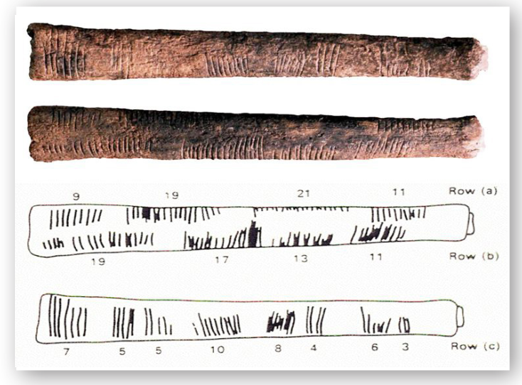

It is very true that the patterns exhibited by numbers have fascinated almost all professional mathematicians' right from the time of Pythagoras to current time. We will be discussing significant concepts provided by Euclid and continue our journey of studying Modular Arithmetic and knowing about Sequences and Finite Series. These ideas are most fundamental to your progress in mathematics for upcoming classes. It is time for us to begin our journey to understand the most fascinating part of mathematics, namely, the study of numbers.

### 2.2 Euclid's Division Lemma

Euclid, one of the most important mathematicians wrote an important book named "Elements" in 13 volumes. The first six volumes were devoted to Geometry and for this reason, Euclid is called the "Father of Geometry". But in the next few volumes, he made fundamental contributions to understand the properties of numbers. One among them is the "Euclid's Divison Lemma". This is a simplified version of the long division process that you were performing for division of numbers in earlier classes.

Le us now discuss Euclid's Lemma and its application through an Algorithm termed as "Euclid's Division Algorithm".

> Lemma is an auxiliary result used for proving an important theorem. It is usually considered as a mini theorem.

> **Theorem 1: Euclid's Division Lemma**
>
> Let $a$ and $b$ be any two positive integers. Then, there exist unique integers $q$ and $r$ such that $a = bq + r$, $0 \leq r < b$.

> **Note**
> - The remainder is always less than the divisor.
> - If $r = 0$ then $a = bq$ so $b$ divides $a$.
> - Conversely, if $b$ divides $a$ then $a = bq$

**Example 2.1** We have $34$ cakes. Each box can hold $5$ cakes only. How many boxes we need to pack and how many cakes are unpacked?

**Solution** We see that $6$ boxes are required to pack $30$ cakes with $4$ cakes left over. This distribution of cakes can be understood as follows:

| $34$ | $=$ | $5$ | $\times$ | $6$ | $+$ | $4$ |
|:---:|:---:|:---:|:---:|:---:|:---:|:---:|
| Total number of cakes | $=$ | Number of cakes in each box | $\times$ | Number of boxes | $+$ | Number of cakes left over |
| $\downarrow$ | | $\downarrow$ | | $\downarrow$ | | $\downarrow$ |
| (Dividend) $a$ | $=$ | (Divisor) $b$ | $\times$ | (Quotient) $q$ | $+$ | (Remainder) $r$ |

> **Note**
> - The above lemma is nothing but a restatement of the long division process, the integers $q$ and $r$ are called quotient and remainder respectively.
> - When a positive integer is divided by $2$ the remainder is either $0$ or $1$. So, any positive integer will of the form $2k$, $2k+1$ for some integer $k$.

Euclid's Division Lemma can be generalised to any two integers.

**Generalised form of Euclid's division lemma**

If $a$ and $b$ are ($b \neq 0$) any two integers then there exist unique integers $q$ and $r$ such that $a = bq + r$, where $0 \leq r < |b|$

**Example 2.2** Find the quotient and remainder when $a$ is divided by $b$ in the following cases (i) $a = -12$, $b = 5$ (ii) $a = 17$, $b = -3$ (iii) $a = -19$, $b = -4$

**Thinking Corner**

When a positive integer is divided by $3$

1. What are the possible remainders?
2. In which form can it be written?

**Solutions**

(i) $a = -12$, $b = 5$

By Euclid's division lemma

$$a = bq + r, \text{ where } 0 \leq r < |b|$$

$$-12 = 5 \times (-3) + 3 \quad 0 \leq r < |5|$$

Therefore, Quotient $q = -3$, Remainder $r = 3$

(ii) $a = 17$, $b = -3$

By Euclid's division lemma

$$a = bq + r, \text{ where } 0 \leq r < |b|$$

$$17 = (-3) \times (-5) + 2, \ 0 \leq r < |-3|$$

Therefore Quotient $q = -5$, Remainder $r = 2$

(iii) $a = -19$, $b = -4$

By Euclid's division lemma

$$a = bq + r, \text{ where } 0 \leq r < |b|$$

$$-19 = (-4) \times (5) + 1, \ 0 \leq r < |-4|$$

Therefore Quotient $q = 5$, Remainder $r = 1$.

**Progress Check**

Find $q$ and $r$ for the following pairs of integers $a$ and $b$ satisfying $a = bq + r$.

1. $a = 13$, $b = 3$
2. $a = 18$, $b = 4$
3. $a = 21$, $b = -4$
4. $a = -32$, $b = -12$
5. $a = -31$, $b = 7$

**Example 2.3** Show that the square of an odd integer is of the form $4q + 1$, for some integer $q$.

**Solution** Let $x$ be any odd integer. Since any odd integer is one more than an even integer, we have $x = 2k + 1$, for some integers $k$.

$$x^2 = (2k+1)^2$$

$$= 4k^2 + 4k + 1$$

$$= 4k(k+1) + 1$$

$$= 4q + 1, \text{ where } q = k(k+1) \text{ is some integer.}$$

### 2.3 Euclid's Division Algorithm

In the previous section, we have studied about Euclid's division lemma and its applications. We now study the concept Euclid's Division Algorithm. The word 'algorithm' comes from the name of 9th century Persian Mathematician Al-khwarizmi. An algorithm means a series of methodical step-by-step procedure of calculating successively on the results of earlier steps till the desired answer is obtained.

Euclid's division algorithm provides an easier way to compute the Highest Common Factor (HCF) of two given positive integers. Let us now prove the following theorem.

> **Theorem 2**
>
> If $a$ and $b$ are positive integers such that $a = bq + r$, then every common divisor of $a$ and $b$ is a common divisor of $b$ and $r$ and vice-versa.

**Euclid's Division Algorithm**

To find Highest Common Factor of two positive integers $a$ and $b$, where $a > b$

**Step1:** Using Euclid's division lemma $a = bq + r$; $0 \leq r < b$. where $q$ is the quotient, $r$ is the remainder. If $r = 0$ then $b$ is the Highest Common Factor of $a$ and $b$.

**Step 2:** Otherwise applying Euclid's division lemma divide $b$ by $r$ to get $b = rq_1 + r_1$, $0 \leq r_1 < r$

**Step 3:** If $r_1 = 0$ then $r$ is the Highest common factor of $a$ and $b$.

**Step 4:** Otherwise using Euclid's division lemma, repeat the process until we get the remainder zero. In that case, the corresponding divisor is the HCF of $a$ and $b$.

> **Note**
> - The above algorithm will always produce remainder zero at some stage. Hence the algorithm should terminate.
> - Euclid's Division Algorithm is a repeated application of Division Lemma until we get zero remainder.
> - Highest Common Factor (HCF) of two positive numbers is denoted by $(a,b)$.
> - Highest Common Factor (HCF) is also called as Greatest Common Divisor (GCD).

**Progress Check**

1. Euclid's division algorithm is a repeated application of division lemma until we get remainder as ____.
2. The HCF of two equal positive integers $k$, $k$ is ____.

**Illustration 1**

Using the above Algorithm, let us find HCF of two given positive integers. Let $a = 273$ and $b = 119$ be the two given positive integers such that $a > b$.

We start dividing $273$ by $119$ using Euclid's division lemma.

we get,

$$273 = 119 \times 2 + 35 \qquad \ldots(1)$$

The remainder is $35 \neq 0$.

Therefore, applying Euclid's Division Algorithm to the divisor $119$ and remainder $35$. we get,

$$119 = 35 \times 3 + 14 \qquad \ldots(2)$$

The remainder is $14 \neq 0$.

Applying Euclid's Division Algorithm to the divisor $35$ and remainder $14$.

we get,

$$35 = 14 \times 2 + 7 \qquad \ldots(3)$$

The remainder is $7 \neq 0$.

Applying Euclid's Division Algorithm to the divisor $14$ and remainder $7$.

we get,

$$14 = 7 \times 2 + 0 \qquad \ldots(4)$$

The remainder at this stage $= 0$.

The divisor at this stage $= 7$.

Therefore, Highest Common Factor of $273, 119 = 7$.

**Example 2.4** If the Highest Common Factor of $210$ and $55$ is expressible in the form $55x - 325$, find $x$.

**Solution** Using Euclid's Division Algorithm, let us find the HCF of given numbers

$$210 = 55 \times 3 + 45$$

$$55 = 45 \times 1 + 10$$

$$45 = 10 \times 4 + 5$$

$$10 = 5 \times 2 + 0$$

The remainder is zero.

So, the last divisor $5$ is the Highest Common Factor (HCF) of $210$ and $55$.

$\because$ HCF is expressible in the form $55x - 325 = 5$

$$\Rightarrow 55x = 330$$

$$x = 6$$

**Example 2.5** Find the greatest number that will divide $445$ and $572$ leaving remainders $4$ and $5$ respectively.

**Solution** Since the remainders are $4$, $5$ respectively the required number is the HCF of the number $445 - 4 = 441$, $572 - 5 = 567$.

Hence, we will determine the HCF of $441$ and $567$. Using Euclid's Division Algorithm, we have,

$$567 = 441 \times 1 + 126$$

$$441 = 126 \times 3 + 63$$

$$126 = 63 \times 2 + 0$$

Therefore, HCF of $441, 567 = 63$ and so the required number is $63$.

**Activity 1**

This activity helps you to find HCF of two positive numbers. We first observe the following instructions.

(i) Construct a rectangle whose length and breadth are the given numbers.

(ii) Try to fill the rectangle using small squares.

(iii) Try with $1 \times 1$ square; Try with $2 \times 2$ square; Try with $3 \times 3$ square and so on.

(iv) The side of the largest square that can fill the whole rectangle without any gap will be HCF of the given numbers.

(v) Find the HCF of (a) $12, 20$ (b) $16, 24$ (c) $11, 9$

> **Theorem 3**
>
> If $a$ and $b$ are two positive integers with $a > b$ then G.C.D of $(a,b) = $ GCD of $(a-b, b)$.

**Activity 2**

This is another activity to determine HCF of two given positive integers.

(i) From the given numbers, subtract the smaller from the larger number.

(ii) From the remaining numbers, subtract smaller from the larger.

(iii) Repeat the subtraction process by subtracting smaller from the larger.

(iv) Stop the process, when the numbers become equal.

(v) The number representing equal numbers obtained in step (iv), will be the HCF of the given numbers.

> Using this Activity, find the HCF of
>
> (i) $90, 15$ &emsp; (ii) $80, 25$ &emsp; (iii) $40, 16$ &emsp; (iv) $23, 12$ &emsp; (v) $93, 13$

**Highest Common Factor of three numbers**

> We can apply Euclid's Division Algorithm twice to find the Highest Common Factor (HCF) of three positive integers using the following procedure.
>
> Let $a, b, c$ be the given positive integers.
>
> (i) Find HCF of $a, b$. Call it as $d$
>
> $$d = (a,b)$$
>
> (ii) Find HCF of $d$ and $c$.
>
> This will be the HCF of the three given numbers $a, b, c$

**Example 2.6** Find the HCF of $396, 504, 636$.

**Solution** To find HCF of three given numbers, first we have to find HCF of the first two numbers.

To find HCF of $396$ and $504$

Using Euclid's division algorithm we get $504 = 396 \times 1 + 108$

The remainder is $108 \neq 0$

Again applying Euclid's division algorithm $396 = 108 \times 3 + 72$

The remainder is $72 \neq 0$,

Again applying Euclid's division algorithm $108 = 72 \times 1 + 36$

The remainder is $36 \neq 0$,

Again applying Euclid's division algorithm $72 = 36 \times 2 + 0$

Here the remainder is zero. Therefore HCF of $396, 504 = 36$.

To find the HCF of $636$ and $36$.

Using Euclid's division algorithm we get $636 = 36 \times 17 + 24$

The remainder is $24 \neq 0$

Again applying Euclid's division algorithm $36 = 24 \times 1 + 12$

The remainder is $12 \neq 0$

Again applying Euclid's division algorithm $24 = 12 \times 2 + 0$

Here the remainder is zero. Therefore HCF of $636, 36 = 12$

Therefore Highest Common Factor of $396, 504$ and $636$ is $12$.

> **Do You Know**
>
> Two positive integers are said to be relatively prime or co prime if their Highest Common Factor is $1$.

### Exercise 2.1

1. Find all positive integers, when divided by $3$ leaves remainder $2$.
2. A man has $532$ flower pots. He wants to arrange them in rows such that each row contains $21$ flower pots. Find the number of completed rows and how many flower pots are left over.

3. Prove that the product of two consecutive positive integers is divisible by $2$.

4. When the positive integers $a$, $b$ and $c$ are divided by $13$, the respective remainders are $9,7$ and $10$. Show that $a+b+c$ is divisible by $13$.

5. Prove that square of any integer leaves the remainder either $0$ or $1$ when divided by $4$.

6. Use Euclid's Division Algorithm to find the Highest Common Factor (HCF) of
   (i) $340$ and $412$ &emsp; (ii) $867$ and $255$
   (iii) $10224$ and $9648$ &emsp; (iv) $84$, $90$ and $120$

7. Find the largest number which divides $1230$ and $1926$ leaving remainder $12$ in each case.

8. If $d$ is the Highest Common Factor of $32$ and $60$, find $x$ and $y$ satisfying $d = 32x + 60y$.

9. A positive integer when divided by $88$ gives the remainder $61$. What will be the remainder when the same number is divided by $11$?

10. Prove that two consecutive positive integers are always coprime.

### 2.4 Fundamental Theorem of Arithmetic

Let us consider the following conversation between a Teacher and students.

**Teacher** : Factorise the number $240$.

**Malar** : $24 \times 10$

**Raghu** : $8 \times 30$

**Iniya** : $12 \times 20$

**Kumar** : $15 \times 16$

**Malar** : Whose answer is correct Sir?

**Teacher** : All the answers are correct.

**Raghu** : How sir?

**Teacher** : Split each of the factors into product of prime numbers.

**Malar** : $2 \times 2 \times 2 \times 3 \times 2 \times 5$

**Raghu** : $2 \times 2 \times 2 \times 2 \times 3 \times 5$

**Iniya** : $2 \times 2 \times 3 \times 2 \times 2 \times 5$

**Kumar** : $3 \times 5 \times 2 \times 2 \times 2 \times 2$

**Teacher** : Good! Now, count the number of 2's, 3's and 5's.

**Malar** : I got four 2's, one 3 and one 5.

**Raghu** : I got four 2's, one 3 and one 5.

**Iniya** : I also got the same numbers too.

**Kumar** : Me too sir.

**Malar** : All of us got four 2's, one 3 and one 5. This is very surprising to us.

**Teacher** : Yes, It should be. Once any number is factorized up to a product of prime numbers, everyone should get the same collection of prime numbers.

This concept leads us to the following important theorem.

**Theorem 4 (Fundamental Theorem of Arithmetic) (without proof)**

> **Theorem**
>
> "Every positive integer (except the number 1) can be represented in exactly one way apart from rearrangement as a product of one or more primes."

The fundamental theorem asserts that every composite number can be decomposed as a product of prime numbers and that the decomposition is unique. In the sense that there is one and only way to express the decomposition as product of primes.

In general, we conclude that given a composite number N, we decompose it uniquely in the form $N = p_1^{q_1} \times p_2^{q_2} \times p_3^{q_3} \times \cdots \times p_n^{q_n}$ where $p_1, p_2, p_3, \ldots, p_n$ are primes and $q_1, q_2, q_3, \ldots, q_n$ are natural numbers.

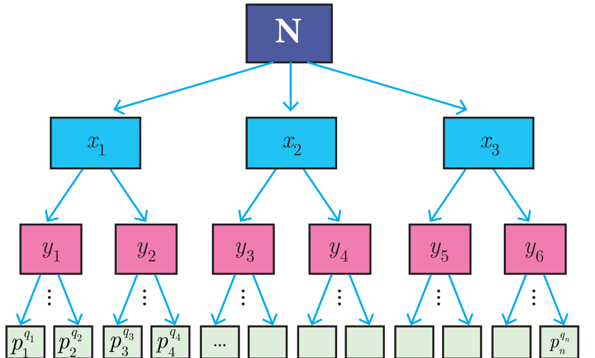

First, we try to factorize N into its factors. If all the factors are themselves primes then we can stop. Otherwise, we try to further split the factors which are not prime. Continue the process till we get only prime numbers.

**Thinking Corner**

Is $1$ a prime number?

**Illustration**

For example, if we try to factorize $32760$ we get

$$32760 = 2 \times 2 \times 2 \times 3 \times 3 \times 5 \times 7 \times 13$$

$$= 2^3 \times 3^2 \times 5^1 \times 7^1 \times 13^1$$

Thus, in whatever way we try to factorize $32760$, we should finally get three 2's, two 3's, one 5, one 7 and one 13.

**Progress Check**

1. Every natural number except ____ can be expressed as ____.
2. In how many ways a composite number can be written as product of power of primes?
3. The number of divisors of any prime number is ____.

The fact that "Every composite number can be written uniquely as the product of power of primes" is called Fundamental Theorem of Arithmetic.

#### 2.4.1 Significance of the Fundamental Theorem of Arithmetic

The fundamental theorem about natural numbers except $1$, that we have stated above has several applications, both in Mathematics and in other fields. The theorem is vastly important in Mathematics, since it highlights the fact that prime numbers are the 'Building Blocks' for all the positive integers. Thus, prime numbers can be compared to atoms making up a molecule.

> **Do You Know**
>
> 1. If a prime number $p$ divides $ab$ then either $p$ divides $a$ or $p$ divides $b$, that is $p$ divides at least one of them.
> 2. If a composite number $n$ divides $ab$, then $n$ neither divide $a$ nor $b$. For example, $6$ divides $4 \times 3$ but $6$ neither divide $4$ nor $3$.

**Example 2.7** In the given factorisation, find the numbers $m$ and $n$.

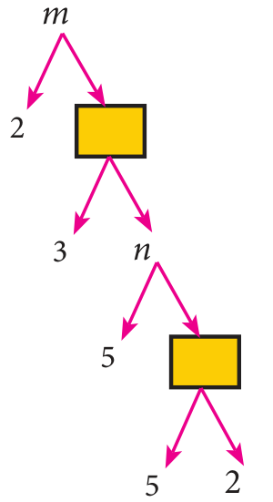

**Solution** Value of the first box from bottom $= 5 \times 2 = 10$

Value of $n = 5 \times 10 = 50$

Value of the second box from bottom $= 3 \times 50 = 150$

Value of $m = 2 \times 150 = 300$

Thus, the required numbers are $m = 300$, $n = 50$

**Example 2.8** Can the number $6^n$, $n$ being a natural number end with the digit $5$? Give reason for your answer.

**Solution** Since $6^n = (2 \times 3)^n = 2^n \times 3^n$,

$2$ is a factor of $6^n$. So, $6^n$ is always even.

But any number whose last digit is $5$ is always odd.

Hence, $6^n$ cannot end with the digit $5$.

**Progress Check**

1. Let $m$ divides $n$. Then GCD and LCM of $m$, $n$ are ____ and ____.
2. The HCF of numbers of the form $2^m$ and $3^n$ is ____.

**Example 2.9** Is $7 \times 5 \times 3 \times 2 + 3$ a composite number? Justify your answer.

**Solution** Yes, the given number is a composite number, because

$$7 \times 5 \times 3 \times 2 + 3 = 3 \times \left(7 \times 5 \times 2 + 1\right) = 3 \times 71$$

Since the given number can be factorized in terms of two primes, it is a composite number.

**Example 2.10** '$a$' and '$b$' are two positive integers such that $a^b \times b^a = 800$. Find '$a$' and '$b$'.

**Solution** The number $800$ can be factorized as

$$800 = 2 \times 2 \times 2 \times 2 \times 2 \times 5 \times 5 = 2^5 \times 5^2$$

Hence, $a^b \times b^a = 2^5 \times 5^2$

This implies that $a = 2$ and $b = 5$ (or) $a = 5$ and $b = 2$.

**Thinking Corner**

Can you think of positive integers $a$, $b$ such that $a^b = b^a$?

**Activity 3**

Can you find the 4-digit pin number '$pqrs$' of an ATM card such that $p^2 \times q^1 \times r^4 \times s^3 = 3,15,000$?

### Exercise 2.2

1. For what values of natural number $n$, $4^n$ can end with the digit $6$?

2. If $m$, $n$ are natural numbers, for what values of $m$, does $2^n \times 5^m$ ends in $5$?

3. Find the HCF of $252525$ and $363636$.

4. If $13824 = 2^a \times 3^b$ then find $a$ and $b$.

5. If $p_1^{x_1} \times p_2^{x_2} \times p_3^{x_3} \times p_4^{x_4} = 113400$ where $p_1, p_2, p_3, p_4$ are primes in ascending order and $x_1, x_2, x_3, x_4$ are integers, find the value of $p_1, p_2, p_3, p_4$ and $x_1, x_2, x_3, x_4$.

6. Find the LCM and HCF of $408$ and $170$ by applying the fundamental theorem of arithmetic.

7. Find the greatest number consisting of $6$ digits which is exactly divisible by $24, 15, 36$?

8. What is the smallest number that when divided by three numbers such as $35$, $56$ and $91$ leaves remainder $7$ in each case?

9. Find the least number that is divisible by the first ten natural numbers.

### 2.5 Modular Arithmetic

In a clock, we use the numbers $1$ to $12$ to represent the time period of $24$ hours. How is it possible to represent the $24$ hours of a day in a $12$ number format? We use $1, 2, 3, 4, 5, 6, 7, 8, 9, 10, 11, 12$ and after $12$, we use $1$ instead of $13$ and $2$ instead of $14$ and so on. That is after $12$ we again start from $1, 2, 3, \ldots$ In this system the numbers wrap around $1$ to $12$. This type of wrapping around after hitting some value is called Modular Arithmetic.

In Mathematics, modular arithmetic is a system of arithmetic for integers where numbers wrap around a certain value. Unlike normal arithmetic, Modular Arithmetic process cyclically. The ideas of Modular arithmetic was developed by great German mathematician Carl Friedrich Gauss, who is hailed as the "Prince of mathematicians".

**Examples**

1. The day and night change repeatedly.
2. The days of a week occur cyclically from Sunday to Saturday.
3. The life cycle of a plant.
4. The seasons of a year change cyclically. (Summer, Autumn, Winter, Spring)
5. The railway and aeroplane timings also work cyclically. The railway time starts at 00:00 and continue. After reaching 23:59, the next minute will become 00:00 instead of 24:00.

#### 2.5.1 Congruence Modulo

Two integers $a$ and $b$ are congruence modulo $n$ if they differ by an integer multiple of $n$. That $a - b = kn$ for some integer $k$. This can also be written as $a \equiv b \ (\text{mod } n)$.

Here the number $n$ is called modulus. In other words, $a \equiv b \ (\text{mod } n)$ means $a - b$ is divisible by $n$.

For example, $61 \equiv 5 \ (\text{mod } 7)$ because $61 - 5 = 56$ is divisible by $7$.

> **Note**
> - When a positive integer is divided by $n$, then the possible remainders are $0, 1, 2, \ldots, n-1$.
> - Thus, when we work with modulo $n$, we replace all the numbers by their remainders upon division by $n$, given by $0, 1, 2, 3, \ldots, n-1$.

Two illustrations are provided to understand modulo concept more clearly.

**Illustration 1**

To find $8 \ (\text{mod } 4)$

With a modulus of $4$ (since the possible remainders are $0, 1, 2, 3$) we make a diagram like a clock with numbers $0, 1, 2, 3$. We start at $0$ and go through $8$ numbers in a clockwise sequence $1, 2, 3, 0, 1, 2, 3, 0$. After doing so cyclically, we end at $0$.

Therefore, $8 \equiv 0 \ (\text{mod } 4)$

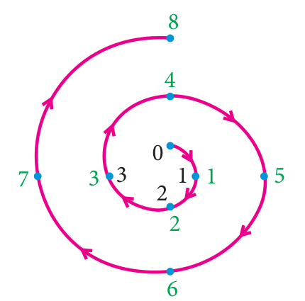

**Illustration 2**

To find $-5 \ (\text{mod } 3)$

With a modulus of $3$ (since the possible remainders are $0, 1, 2$) we make a diagram like a clock with numbers $0, 1, 2$.

We start at $0$ and go through $5$ numbers in anti-clockwise sequence $2, 1, 0, 2, 1$. After doing so cyclically, we end at $1$.

Therefore, $-5 \equiv 1 \ (\text{mod } 3)$

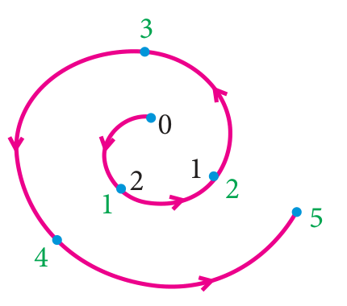

#### 2.5.2 Connecting Euclid's Division lemma and Modular Arithmetic

Let $m$ and $n$ be integers, where $m$ is positive. Then by Euclid's division lemma, we can write $n = mq + r$ where $0 \leq r < m$ and $q$ is an integer. Instead of writing $n = mq + r$ we can use the congruence notation in the following way.

We say that $n$ is congruent to $r$ modulo $m$, if $n = mq + r$ for some integer $q$.

$$n = mq + r$$

$$n - r = mq$$

$$n - r \equiv 0 \ (\text{mod } m)$$

$$n \equiv r \ (\text{mod } m)$$

**Progress Check**

1. Two integers $a$ and $b$ are congruent modulo $n$ if ____.
2. The set of all positive integers which leave remainder $5$ when divided by $7$ are ____.

Thus the equation $n = mq + r$ through Euclid's Division lemma can also be written as $n \equiv r \ (\text{mod } m)$.

> **Note**
>
> Two integers $a$ and $b$ are congruent modulo $m$, written as $a \equiv b \ (\text{mod } m)$, if they leave the same remainder when divided by $m$.

**Thinking Corner**

How many integers exist which leave a remainder of $2$ when divided by $3$?

#### 2.5.3 Modulo operations

Similar to basic arithmetic operations like addition, subtraction and multiplication performed on numbers we can think of performing same operations in modulo arithmetic. The following theorem provides the information of doing this.

**Theorem 5**

$a$, $b$, $c$ and $d$ are integers and $m$ is a positive integer such that if $a \equiv b \ (\text{mod } m)$ and $c \equiv d \ (\text{mod } m)$ then

(i) $(a + c) \equiv (b + d) \ (\text{mod } m)$ &emsp; (ii) $(a - c) \equiv (b - d) \ (\text{mod } m)$

(iii) $(a \times c) \equiv (b \times d) \ (\text{mod } m)$

**Illustration 3**

If $17 \equiv 4 \ (\text{mod } 13)$ and $42 \equiv 3 \ (\text{mod } 13)$ then from theorem 5,

(i) $17 + 42 \equiv 4 + 3 \ (\text{mod } 13)$

$$59 \equiv 7 \ (\text{mod } 13)$$

(ii) $17 - 42 \equiv 4 - 3 \ (\text{mod } 13)$

$$-25 \equiv 1 \ (\text{mod } 13)$$

(iii) $17 \times 42 \equiv 4 \times 3 \ (\text{mod } 13)$

$$714 \equiv 12 \ (\text{mod } 13)$$

**Theorem 6**

If $a \equiv b \ (\text{mod } m)$ then

(i) $ac \equiv bc \ (\text{mod } m)$ &emsp; (ii) $a \pm c \equiv b \pm c \ (\text{mod } m)$ for any integer $c$

**Progress Check**

1. The positive values of $k$ such that $(k - 3) \equiv 5 \ (\text{mod } 11)$ are ____.
2. If $59 \equiv 3 \ (\text{mod } 7)$, $46 \equiv 4 \ (\text{mod } 7)$ then $105 \equiv$ ____ $(\text{mod } 7)$, $13 \equiv$ ____ $(\text{mod } 7)$, $413 \equiv$ ____ $(\text{mod } 7)$, $368 \equiv$ ____ $(\text{mod } 7)$.
3. The remainder when $7 \times 13 \times 19 \times 23 \times 29 \times 31$ is divided by $6$ is ____.

**Example 2.11** Find the remainders when $70004$ and $778$ is divided by $7$.

**Solution** Since $70000$ is divisible by $7$

$$70000 \equiv 0 \ (\text{mod } 7)$$

$$70000 + 4 \equiv 0 + 4 \ (\text{mod } 7)$$

$$70004 \equiv 4 \ (\text{mod } 7)$$

Therefore, the remainder when $70004$ is divided by $7$ is $4$.

$\because$ $777$ is divisible by $7$

$$777 \equiv 0 \ (\text{mod } 7)$$

$$777 + 1 \equiv 0 + 1 \ (\text{mod } 7)$$

$$778 \equiv 1 \ (\text{mod } 7)$$

Therefore, the remainder when $778$ is divided by $7$ is $1$.

**Example 2.12** Determine the value of $d$ such that $15 \equiv 3 \ (\text{mod } d)$.

**Solution** $15 \equiv 3 \ (\text{mod } d)$ means $15 - 3 = kd$, for some integer $k$.

$$12 = kd.$$

$\Rightarrow$ $d$ divides $12$.

The divisors of $12$ are $1, 2, 3, 4, 6, 12$. But $d$ should be larger than $3$ and so the possible values for $d$ are $4, 6, 12$.

**Example 2.13** Find the least positive value of $x$ such that
(i) $67 + x \equiv 1 \ (\text{mod } 4)$ &emsp; (ii) $98 \equiv \left(x + 4\right) \ (\text{mod } 5)$

**Solution** (i) $67 + x \equiv 1 \ (\text{mod } 4)$

$$67 + x - 1 = 4n, \text{ for some integer } n$$

$$66 + x = 4n$$

$66 + x$ is a multiple of $4$.

Therefore, the least positive value of $x$ must be $2$, since $68$ is the nearest multiple of $4$ more than $66$.

(ii) $98 \equiv (x + 4) \ (\text{mod } 5)$

$$98 - (x + 4) = 5n, \text{ for some integer } n.$$

$$94 - x = 5n$$

$94 - x$ is a multiple of $5$.

Therefore, the least positive value of $x$ must be $4$

$\because$ $94 - 4 = 90$ is the nearest multiple of $5$ less than $94$.

> **Note**
>
> While solving congruent equations, we get infinitely many solutions compared to finite number of solutions in solving a polynomial equation in Algebra.

**Example 2.14** Solve $8x \equiv 1 \ (\text{mod } 11)$

**Solution** $8x \equiv 1 \ (\text{mod } 11)$ can be written as $8x - 1 = 11k$, for some integer $k$.

$$x = \dfrac{11k + 1}{8}$$

When we put $k = 5, 13, 21, 29, \ldots$ then $11k + 1$ is divisible by $8$.

$$x = \dfrac{11 \times 5 + 1}{8} = 7$$

$$x = \dfrac{11 \times 13 + 1}{8} = 18$$

$\therefore$ The solutions are $7, 18, 29, 40, \ldots$

**Example 2.15** Compute $x$, such that $10^4 \equiv x \ (\text{mod } 19)$

**Solution**

$$10^2 = 100 \equiv 5 \ (\text{mod } 19)$$

$$10^4 = (10^2)^2 \equiv 5^2 \ (\text{mod } 19)$$

$$10^4 \equiv 25 \ (\text{mod } 19)$$

$$10^4 \equiv 6 \ (\text{mod } 19) \qquad (\because 25 \equiv 6 \ (\text{mod } 19))$$

$\therefore$ $x = 6$.

**Example 2.16** Find the number of integer solutions of $3x \equiv 1 \ (\text{mod } 15)$.

**Solution** $3x \equiv 1 \ (\text{mod } 15)$ can be written as

$$3x - 1 = 15k \text{ for some integer } k$$

$$3x = 15k + 1$$

$$x = \dfrac{15k + 1}{3}$$

$$x = 5k + \dfrac{1}{3}$$

$\because$ $5k$ is an integer, $5k + \dfrac{1}{3}$ cannot be an integer.

So there is no integer solution.

**Example 2.17** A man starts his journey from Chennai to Delhi by train. He starts at $22.30$ hours on Wednesday. If it takes $32$ hours of travelling time and assuming that the train is not late, when will he reach Delhi?

**Solution** Starting time $22.30$, Travelling time $32$ hours. Here we use modulo $24$.

The reaching time is

$$22.30 + 32 \ (\text{mod } 24) \equiv 54.30 \ (\text{mod } 24)$$

$$\equiv 6.30 \ (\text{mod } 24) \qquad (\because 32 = \underset{\text{Thursday}}{(1 \times 24)} + \underset{\text{Friday}}{8})$$

Thus, he will reach Delhi on Friday at $6.30$ hours.

**Example 2.18** Kala and Vani are friends. Kala says, "Today is my birthday" and she asks Vani, "When will you celebrate your birthday?" Vani replies, "Today is Monday and I celebrated my birthday $75$ days ago". Find the day when Vani celebrated her birthday.

**Solution** Let us associate the numbers $0, 1, 2, 3, 4, 5, 6$ to represent the weekdays from Sunday to Saturday respectively.

Vani says today is Monday. So the number for Monday is $1$. Since Vani's birthday was $75$ days ago, we have to subtract $75$ from $1$ and take the modulo $7$, since a week contain $7$ days.

$$-74 \ (\text{mod } 7) \equiv -4 \ (\text{mod } 7) \equiv 7 - 4 \ (\text{mod } 7) \equiv 3 \ (\text{mod } 7)$$

$$(\because -74 - 3 = -77 \text{ is divisible by } 7)$$

Thus, $1 - 75 \equiv 3 \ (\text{mod } 7)$

The day for the number $3$ is Wednesday.

Therefore, Vani's birthday must be on Wednesday.

### Exercise 2.3

1. Find the least positive value of $x$ such that
   (i) $71 \equiv x \ (\text{mod } 8)$ &emsp; (ii) $78 + x \equiv 3 \ (\text{mod } 5)$ &emsp; (iii) $89 \equiv (x + 3) \ (\text{mod } 4)$
   (iv) $96 \equiv \dfrac{x}{7} \ (\text{mod } 5)$ &emsp; (v) $5x \equiv 4 \ (\text{mod } 6)$
2. If $x$ is congruent to $13$ modulo $17$ then $7x - 3$ is congruent to which number modulo $17$?
3. Solve $5x \equiv 4 \ (\text{mod } 6)$
4. Solve $3x - 2 \equiv 0 \ (\text{mod } 11)$
5. What is the time $100$ hours after $7$ a.m.?
6. What is the time $15$ hours before $11$ p.m.?
7. Today is Tuesday. My uncle will come after $45$ days. In which day my uncle will be coming?
8. Prove that $2^n + 6 \times 9^n$ is always divisible by $7$ for any positive integer $n$.
9. Find the remainder when $2^{81}$ is divided by $17$.
10. The duration of flight travel from Chennai to London through British Airlines is approximately $11$ hours. The airplane begins its journey on Sunday at $23{:}30$ hours. If the time at Chennai is four and half hours ahead to that of London's time, then find the time at London, when will the flight lands at London Airport.

### 2.6 Sequences

Consider the following pictures.

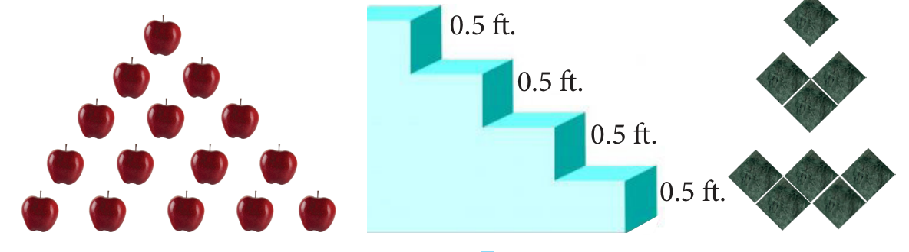

There is some pattern or arrangement in these pictures. In the first picture, the first row contains one apple, the second row contains two apples and in the third row there are three apples etc... The number of apples in each of the rows are $1, 2, 3, \ldots$

In the second picture each step have $0.5$ feet height. The total height of the steps from the base are $0.5$ feet, $1$ feet, $1.5$ feet, ... In the third picture one square, $3$ squares, $5$ squares, ... These numbers belong to category called "Sequences".

> **Definition**
>
> A **real valued sequence** is a function defined on the set of natural numbers and taking real values.

Each element in the sequence is called a term of the sequence. The element in the first position is called the first term of the sequence. The element in the second position is called second term of the sequence and so on.

If the $n^{th}$ term is denoted by $a_n$, then $a_1$ is the first term, $a_2$ is the second term, and so on. A sequence can be written as $a_1, a_2, a_3, \ldots, a_n, \ldots$

**Illustration**

1. $1, 3, 5, 7, \ldots$ is a sequence with general term $a_n = 2n - 1$. When we put $n = 1, 2, 3, \ldots$, we get $a_1 = 1$, $a_2 = 3$, $a_3 = 5$, $a_4 = 7, \ldots$
2. $\dfrac{1}{2}, \dfrac{1}{3}, \dfrac{1}{4}, \dfrac{1}{5}, \ldots$ is a sequence with general term $\dfrac{1}{n+1}$. When we put $n = 1, 2, 3, \ldots$ we get $a_1 = \dfrac{1}{2}$, $a_2 = \dfrac{1}{3}$, $a_3 = \dfrac{1}{4}$, $a_4 = \dfrac{1}{5}, \ldots$

If the number of elements in a sequence is finite then it is called a Finite sequence. If the number of elements in a sequence is infinite then it is called an Infinite sequence.

#### Sequence as a Function

A sequence can be considered as a function defined on the set of natural numbers $\mathbb{N}$. In particular, a sequence is a function $f : \mathbb{N} \to \mathbb{R}$, where $\mathbb{R}$ is the set of all real numbers.

If the sequence is of the form $a_1, a_2, a_3, \ldots$ then we can associate the function to the sequence $a_1, a_2, a_3, \ldots$ by $f(k) = a_k$, $k = 1, 2, 3, \ldots$

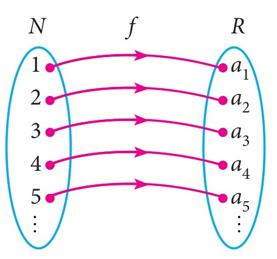

**Progress Check**

1. Fill in the blanks for the following sequences
   (i) $7, 13, 19, \_\_\_\_, \ldots$ &emsp; (ii) $2, \_\_\_\_, 10, 17, 26, \ldots$
   (iii) $1000, 100, 10, 1, \_\_\_\_, \ldots$
2. A sequence is a function defined on the set of ____.
3. The $n^{th}$ term of the sequence $0, 2, 6, 12, 20, \ldots$ can be expressed as ____.
4. Say True or False
   (i) All sequences are functions &emsp; (ii) All functions are sequences.

**Example 2.19** Find the next three terms of the sequences
(i) $\dfrac{1}{2}, \dfrac{1}{6}, \dfrac{1}{10}, \dfrac{1}{14}, \ldots$ &emsp; (ii) $5, 2, -1, -4, \ldots$ &emsp; (iii) $1, 0.1, 0.01, \ldots$

**Solution** (i)

$$\dfrac{1}{2} \xrightarrow{+4} \dfrac{1}{6} \xrightarrow{+4} \dfrac{1}{10} \xrightarrow{+4} \dfrac{1}{14}, \ \ldots$$

In the above sequence the numerators are same and the denominator is increased by $4$.

So the next three terms are

$$a_5 = \dfrac{1}{14 + 4} = \dfrac{1}{18}$$

$$a_6 = \dfrac{1}{18 + 4} = \dfrac{1}{22}$$

$$a_7 = \dfrac{1}{22 + 4} = \dfrac{1}{26}$$

> **Note**
>
> Though all the sequences are functions, not all the functions are sequences.

(ii)

$$5 \xrightarrow{-3} 2 \xrightarrow{-3} -1 \xrightarrow{-3} -4, \ \ldots$$

Here each term is decreased by $3$. So the next three terms are $-7, -10, -13$.

(iii)

$$1 \xrightarrow{\div 10} 0.1 \xrightarrow{\div 10} 0.01, \ \ldots$$

Here each term is divided by $10$. Hence, the next three terms are

$$a_4 = \dfrac{0.01}{10} = 0.001$$

$$a_5 = \dfrac{0.001}{10} = 0.0001$$

$$a_6 = \dfrac{0.0001}{10} = 0.00001$$

**Example 2.20** Find the general term for the following sequences
(i) $3, 6, 9, \ldots$ &emsp; (ii) $\dfrac{1}{2}, \dfrac{2}{3}, \dfrac{3}{4}, \ldots$ &emsp; (iii) $5, -25, 125, \ldots$

**Solution** (i) $3, 6, 9, \ldots$

Here the terms are multiples of $3$. So the general term is

$$a_n = 3n,$$

(ii) $\dfrac{1}{2}, \dfrac{2}{3}, \dfrac{3}{4}, \ldots$

$$a_1 = \dfrac{1}{2};\ a_2 = \dfrac{2}{3};\ a_3 = \dfrac{3}{4}$$

We see that the numerator of $n^{th}$ term is $n$, and the denominator is one more than the numerator. Hence, $a_n = \dfrac{n}{n+1}, n \in \mathbb{N}$

(iii) $5, -25, 125, \ldots$

The terms of the sequence have $+$ and $-$ sign alternatively and also they are in powers of $5$.

So the general term $a_n = (-1)^{n+1} 5^n, n \in \mathbb{N}$

**Example 2.21** The general term of a sequence is defined as

$$a_n = \begin{cases} n(n + 3); & n \in \mathbb{N} \text{ is odd} \\ n^2 + 1; & n \in \mathbb{N} \text{ is even} \end{cases}$$

Find the eleventh and eighteenth terms.

**Solution** To find $a_{11}$, since $11$ is odd, we put $n = 11$ in $a_n = n(n + 3)$

Thus, the eleventh term $a_{11} = 11(11 + 3) = 154$.

To find $a_{18}$, since $18$ is even, we put $n = 18$ in $a_n = n^2 + 1$

Thus, the eighteenth term $a_{18} = 18^2 + 1 = 325$.

**Example 2.22** Find the first five terms of the following sequence.

$$a_1 = 1,\ a_2 = 1,\ a_n = \dfrac{a_{n-1}}{a_{n-2} + 3};\ n \geq 3,\ n \in \mathbb{N}$$

**Solution** The first two terms of this sequence are given by $a_1 = 1$, $a_2 = 1$. The third term $a_3$ depends on the first and second terms.

$$a_3 = \dfrac{a_{3-1}}{a_{3-2} + 3} = \dfrac{a_2}{a_1 + 3} = \dfrac{1}{1 + 3} = \dfrac{1}{4}$$

Similarly the fourth term $a_4$ depends upon $a_2$ and $a_3$.

$$a_4 = \dfrac{a_{4-1}}{a_{4-2} + 3} = \dfrac{a_3}{a_2 + 3} = \dfrac{\frac{1}{4}}{1 + 3} = \dfrac{\frac{1}{4}}{4} = \dfrac{1}{4} \times \dfrac{1}{4} = \dfrac{1}{16}$$

In the same way, the fifth term $a_5$ can be calculated as

$$a_5 = \dfrac{a_{5-1}}{a_{5-2} + 3} = \dfrac{a_4}{a_3 + 3} = \dfrac{\frac{1}{16}}{\frac{1}{4} + 3} = \dfrac{1}{16} \times \dfrac{4}{13} = \dfrac{1}{52}$$

Therefore, the first five terms of the sequence are $1, 1, \dfrac{1}{4}, \dfrac{1}{16}$ and $\dfrac{1}{52}$

### Exercise 2.4

1. Find the next three terms of the following sequence.
   (i) $8, 24, 72, \ldots$ &emsp; (ii) $5, 1, -3, \ldots$ &emsp; (iii) $\dfrac{1}{4}, \dfrac{2}{9}, \dfrac{3}{16}, \ldots$
2. Find the first four terms of the sequences whose $n^{th}$ terms are given by
   (i) $a_n = n^3 - 2$ &emsp; (ii) $a_n = (-1)^{n+1} n(n + 1)$ &emsp; (iii) $a_n = 2n^2 - 6$
3. Find the $n^{th}$ term of the following sequences
   (i) $2, 5, 10, 17, \ldots$ &emsp; (ii) $0, \dfrac{1}{2}, \dfrac{2}{3}, \ldots$ &emsp; (iii) $3, 8, 13, 18, \ldots$
4. Find the indicated terms of the sequences whose $n^{th}$ terms are given by
   (i) $a_n = \dfrac{5n}{n + 2}$; $a_6$ and $a_{13}$ &emsp; (ii) $a_n = -(n^2 - 4)$; $a_4$ and $a_{11}$
5. Find $a_8$ and $a_{15}$ whose $n^{th}$ term is $a_n = \begin{cases} \dfrac{n^2 - 1}{n + 3}; & n \text{ is even}, n \in \mathbb{N} \\[2ex] \dfrac{n^2}{2n + 1}; & n \text{ is odd}, n \in \mathbb{N} \end{cases}$
6. If $a_1 = 1$, $a_2 = 1$ and $a_n = 2a_{n-1} + a_{n-2}$, $n \geq 3$, $n \in \mathbb{N}$, then find the first six terms of the sequence.

### 2.7 Arithmetic Progression

Let us begin with the following two illustrations.

**Illustration 1**

Make the following figures using match sticks

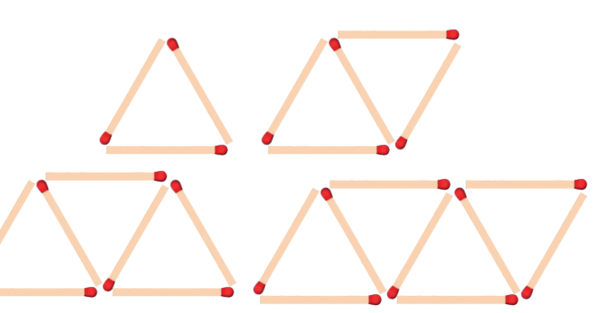

(i) How many match sticks are required for each figure? $3, 5, 7$ and $9$.

(ii) Can we find the difference between the successive numbers?

$$5 - 3 = 7 - 5 = 9 - 7 = 2$$

Therefore, the difference between successive numbers is always $2$.

**Illustration 2**

A man got a job whose initial monthly salary is fixed at ₹$10,000$ with an annual increment of ₹$2000$. His salary during $1^{st}$, $2^{nd}$ and $3^{rd}$ years will be ₹$10000$, ₹$12000$ and ₹$14000$ respectively.

If we now calculate the difference of the salaries for the successive years, we get $12000 - 10000 = 2000$; $14000 - 12000 = 2000$. Thus the difference between the successive numbers (salaries) is always $2000$.

Did you observe the common property behind these two illustrations? In these two examples, the difference between successive terms always remains constant. Moreover, each term is obtained by adding a fixed number ($2$ and $2000$ in illustrations 1 and 2 presented above) to the preceding term except the first term. This fixed number which is a constant for the differences between successive terms is called the "common difference".

> **Definition**
>
> Let $a$ and $d$ be real numbers. Then the numbers of the form $a$, $a + d$, $a + 2d$, $a + 3d$, $a + 4d$, ... is said to form **Arithmetic Progression** denoted by A.P. The number '$a$' is called the first term and '$d$' is called the common difference.

Simply, an Arithmetic Progression is a sequence whose successive terms differ by a constant number. Thus, for example, the set of even positive integers $2, 4, 6, 8, 10, 12, \ldots$ is an A.P. whose first term is $a = 2$ and common difference is also $d = 2$ since $4 - 2 = 2$, $6 - 4 = 2$, $8 - 6 = 2, \ldots$

Most of common real–life situations often produce numbers in A.P.

> **Note**
> - The difference between any two consecutive terms of an A.P. is always constant. That constant value is called the common difference.
> - If there are finite numbers of terms in an A.P. then it is called Finite Arithmetic Progression. If there are infinitely many terms in an A.P. then it is called Infinite Arithmetic Progression.

#### 2.7.1 Terms and Common Difference of an A.P.

1. The terms of an A.P. can be written as

$$t_1 = a = a + (1 - 1)d, \qquad t_2 = a + d = a + (2 - 1)d,$$

$$t_3 = a + 2d = a + (3 - 1)d, \qquad t_4 = a + 3d = a + (4 - 1)d, \ldots$$

In general, the $n^{th}$ term denoted by $t_n$ can be written as $t_n = a + (n - 1)d$.

$$\boxed{\text{In an AP, } n^{th} \text{ term is, } t_n = a + (n - 1)d \text{, here, } a \text{ is the first term, } d \text{ is the common difference.}}$$

2. In general to find the common difference of an A.P. we should subtract first term from the second term, second from the third and so on.

   For example, $t_1 = a$, $t_2 = a + d$

   $\therefore t_2 - t_1 = (a + d) - a = d$

   Similarly, $t_2 = a + d$, $t_3 = a + 2d, \ldots$

   $\therefore t_3 - t_2 = (a + 2d) - (a + d) = d$

   In general, $d = t_2 - t_1 = t_3 - t_2 = t_4 - t_3 = \ldots$

   $d = t_n - t_{n-1}$ for $n = 2, 3, 4, \ldots$

**Progress Check**

1. The difference between any two consecutive terms of an A.P. is ____.
2. If $a$ and $d$ are the first term and common difference of an A.P. then the $8^{th}$ term is ____.
3. If $t_n$ is the $n^{th}$ term of an A.P., then $t_{2n} - t_n$ is ____.

Let us try to find the common differences of the following A.P.'s

(i) $1, 4, 7, 10, \ldots$

$d = 4 - 1 = 7 - 4 = 10 - 7 = \ldots = 3$

(ii) $6, 2, -2, -6, \ldots$

$d = 2 - 6 = -2 - 2 = -6 - (-2) = \ldots = -4$

> **Do You Know**
>
> The common difference of an A.P. can be positive, negative or zero.

**Thinking Corner**

If $t_n$ is the $n^{th}$ term of an A.P. then the value of $t_{n+1} - t_{n-1}$ is ____.

**Example 2.23** Check whether the following sequences are in A.P. or not?
   (i) $x + 2, \ 2x + 3, \ 3x + 4, \ldots$ &emsp; (ii) $2, 4, 8, 16, \ldots$ &emsp; (iii) $3\sqrt{2}, \ 5\sqrt{2}, \ 7\sqrt{2}, \ 9\sqrt{2}, \ldots$

**Solution** To check that the given sequence is in A.P., it is enough to check if the differences between the consecutive terms are equal or not.

(i)
$$t_2 - t_1 = (2x + 3) - (x + 2) = x + 1$$
$$t_3 - t_2 = (3x + 4) - (2x + 3) = x + 1$$
$$t_2 - t_1 = t_3 - t_2$$

Thus, the differences between consecutive terms are equal.

Hence the sequence $x + 2, \ 2x + 3, \ 3x + 4, \ldots$ is in A.P.

(ii)
$$t_2 - t_1 = 4 - 2 = 2$$
$$t_3 - t_2 = 8 - 4 = 4$$
$$t_2 - t_1 \neq t_3 - t_2$$

Thus, the differences between consecutive terms are not equal. Hence the terms of the sequence $2, 4, 8, 16, \ldots$ are not in A.P.

(iii)
$$t_2 - t_1 = 5\sqrt{2} - 3\sqrt{2} = 2\sqrt{2}$$
$$t_3 - t_2 = 7\sqrt{2} - 5\sqrt{2} = 2\sqrt{2}$$
$$t_4 - t_3 = 9\sqrt{2} - 7\sqrt{2} = 2\sqrt{2}$$

Thus, the differences between consecutive terms are equal. Hence the terms of the sequence $3\sqrt{2}, \ 5\sqrt{2}, \ 7\sqrt{2}, \ 9\sqrt{2}, \ldots$ are in A.P.

**Example 2.24** Write an A.P. whose first term is $20$ and common difference is $8$.

**Solution** First term $= a = 20$; common difference $= d = 8$

Arithmetic Progression is $a, \ a + d, \ a + 2d, \ a + 3d, \ldots$

In this case, we get $20, \ 20 + 8, \ 20 + 2(8), \ 20 + 3(8), \ldots$

So, the required A.P. is $20, 28, 36, 44, \ldots$

> **Note**
>
> An Arithmetic progression having a common difference of zero is called a constant arithmetic progression.

**Activity 4**

There are five boxes here. You have to pick one number from each box and form five Arithmetic Progressions.

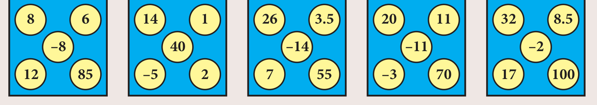

**Example 2.25** Find the $15^{th}$, $24^{th}$ and $n^{th}$ term (general term) of an A.P. given by $3, 15, 27, 39, \ldots$

**Solution** We have, first term $= a = 3$ and common difference $= d = 15 - 3 = 12$.

We know that $n^{th}$ term (general term) of an A.P. with first term $a$ and common difference $d$ is given by $t_n = a + (n - 1)d$

$$t_{15} = a + (15 - 1)d = a + 14d = 3 + 14(12) = 171$$

(Here $a = 3$ and $d = 12$)

$$t_{24} = a + (24 - 1)d = a + 23d = 3 + 23(12) = 279$$

The $n^{th}$ (general term) term is given by $t_n = a + (n - 1)d$

Thus,
$$t_n = 3 + (n - 1)12$$
$$t_n = 12n - 9$$

> **Note**
>
> In a finite A.P. whose first term is $a$ and last term $l$, then the number of terms in the A.P. is given by $l = a + (n - 1)d \Rightarrow n = \left(\dfrac{l - a}{d}\right) + 1$

**Example 2.26** Find the number of terms in the A.P. $3, 6, 9, 12, \ldots, 111$.

**Solution**

First term $a = 3$; common difference $d = 6 - 3 = 3$; last term $l = 111$

We know that, $n = \left(\dfrac{l - a}{d}\right) + 1$

$$n = \left(\dfrac{111 - 3}{3}\right) + 1 = 37$$

Thus the A.P. contain $37$ terms.

**Progress Check**

1. The common difference of a constant A.P. is ____.
2. If $a$ and $l$ are first and last terms of an A.P. then the number of terms is ____.

**Example 2.27** Determine the general term of an A.P. whose $7^{th}$ term is $-1$ and $16^{th}$ term is $17$.

**Solution** Let the A.P. be $t_1, t_2, t_3, t_4, \ldots$

It is given that $t_7 = -1$ and $t_{16} = 17$

$$a + (7 - 1)d = -1 \text{ and } a + (16 - 1)d = 17$$
$$a + 6d = -1 \qquad \ldots(1)$$
$$a + 15d = 17 \qquad \ldots(2)$$

Subtracting equation (1) from equation (2), we get $9d = 18 \Rightarrow d = 2$

Putting $d = 2$ in equation (1), we get $a + 12 = -1 \ \therefore a = -13$

Hence, general term $t_n = a + (n - 1)d$

$$= -13 + (n - 1) \times 2 = 2n - 15$$

**Example 2.28** If $l^{th}$, $m^{th}$ and $n^{th}$ terms of an A.P. are $x$, $y$, $z$ respectively, then show that
   (i) $x(m - n) + y(n - l) + z(l - m) = 0$ &emsp; (ii) $(x - y)n + (y - z)l + (z - x)m = 0$

**Solution** (i) Let $a$ be the first term and $d$ be the common difference. It is given that

$t_l = x$, $t_m = y$, $t_n = z$

Using the general term formula

$$a + (l - 1)d = x \qquad \ldots(1)$$
$$a + (m - 1)d = y \qquad \ldots(2)$$
$$a + (n - 1)d = z \qquad \ldots(3)$$

We have, $x(m - n) + y(n - l) + z(l - m)$

$$= a[(m - n) + (n - l) + (l - m)] + d[(m - n)(l - 1) + (n - l)(m - 1) + (l - m)(n - 1)]$$
$$= a[0] + d[lm - ln - m + n + mn - lm - n + l + ln - mn - l + m]$$
$$= a(0) + d(0) = 0$$

(ii) On subtracting equation (2) from equation (1), equation (3) from equation (2) and equation (1) from equation (3), we get

$$x - y = (l - m)d$$
$$y - z = (m - n)d$$
$$z - x = (n - l)d$$
$$(x - y)n + (y - z)l + (z - x)m = [(l - m)n + (m - n)l + (n - l)m]d$$
$$= \left[ln - mn + lm - nl + nm - lm\right]d = 0$$

> **Note**
>
> In an Arithmetic Progression
> - If every term is added or subtracted by a constant, then the resulting sequence is also an A.P.
> - If every term is multiplied or divided by a non-zero number, then the resulting sequence is also an A.P.
> - If the sum of three consecutive terms of an A.P. is given, then they can be taken as $a - d$, $a$ and $a + d$. Here the common difference is $d$.
> - If the sum of four consecutive terms of an A.P. is given then, they can be taken as $a - 3d$, $a - d$, $a + d$ and $a + 3d$. Here common difference is $2d$.

**Example 2.29** In an A.P., sum of four consecutive terms is $28$ and the sum of their squares is $276$. Find the four numbers.

**Solution** Let us take the four terms in the form $(a - 3d), (a - d), (a + d)$ and $(a + 3d)$.

Since, sum of the four terms is $28$,

$$a - 3d + a - d + a + d + a + 3d = 28$$
$$4a = 28 \Rightarrow a = 7$$

Similarly, since sum of their squares is $276$,

$$(a - 3d)^2 + (a - d)^2 + (a + d)^2 + (a + 3d)^2 = 276.$$
$$a^2 - 6ad + 9d^2 + a^2 - 2ad + d^2 + a^2 + 2ad + d^2 + a^2 + 6ad + 9d^2 = 276$$
$$4a^2 + 20d^2 = 276 \Rightarrow 4(7)^2 + 20d^2 = 276.$$
$$d^2 = 4 \Rightarrow d = \pm\sqrt{4} \text{ then, } d = \pm 2$$

If $d = 2$ then the four numbers are $7 - 3(2), \ 7 - 2, \ 7 + 2, \ 7 + 3(2)$

That is the four numbers are $1, 5, 9$ and $13$.

If $a = 7$, $d = -2$ then the four numbers are $13, 9, 5$ and $1$

Therefore, the four consecutive terms of the A.P. are $1, 5, 9$ and $13$.

**Condition for three numbers to be in A.P.**

If $a, b, c$ are in A.P. then $a = a$, $b = a + d$, $c = a + 2d$

so
$$a + c = 2a + 2d = 2(a + d) = 2b$$

Thus, $2b = a + c$

Similarly, if $2b = a + c$, then $b - a = c - b$ so $a, b, c$ are in A.P.

Thus three non-zero numbers $a, b, c$ are in A.P. if and only if $2b = a + c$

**Example 2.30** A mother divides ₹207 into three parts such that the amount are in A.P. and gives it to her three children. The product of the two least amounts that the children had ₹4623. Find the amount received by each child.

**Solution** Let the amount received by the three children be in the form of A.P. is given by $a - d$, $a$, $a + d$. Since, sum of the amount is ₹207, we have

$$(a - d) + a + (a + d) = 207$$
$$3a = 207 \Rightarrow a = 69$$

It is given that product of the two least amounts is $4623$.

$$(a - d)a = 4623$$
$$(69 - d)69 = 4623$$
$$d = 2$$

Therefore, amount given by the mother to her three children are

₹$(69 - 2)$, ₹$69$, ₹$(69 + 2)$. That is, ₹67, ₹69 and ₹71.

**Progress Check**

1. If every term of an A.P. is multiplied by $3$, then the common difference of the new A.P. is ____.
2. Three numbers $a$, $b$ and $c$ will be in A.P. if and only if ____.

### Exercise 2.5

1. Check whether the following sequences are in A.P.
   (i) $a - 3, \ a - 5, \ a - 7, \ldots$ &emsp; (ii) $\dfrac{1}{2}, \dfrac{1}{3}, \dfrac{1}{4}, \dfrac{1}{5}, \ldots$ &emsp; (iii) $9, 13, 17, 21, 25, \ldots$
   (iv) $\dfrac{-1}{3}, 0, \dfrac{1}{3}, \dfrac{2}{3}, \ldots$ &emsp; (v) $1, -1, 1, -1, 1, -1, \ldots$

2. First term $a$ and common difference $d$ are given below. Find the corresponding A.P.
   (i) $a = 5$, $d = 6$ &emsp; (ii) $a = 7$, $d = -5$ &emsp; (iii) $a = \dfrac{3}{4}$, $d = \dfrac{1}{2}$

3. Find the first term and common difference of the Arithmetic Progressions whose $n^{th}$ terms are given below
   (i) $t_n = -3 + 2n$ &emsp; (ii) $t_n = 4 - 7n$

4. Find the $19^{th}$ term of an A.P. $-11, -15, -19, \ldots$

5. Which term of an A.P. $16, 11, 6, 1, \ldots$ is $-54$?

6. Find the middle term(s) of an A.P. $9, 15, 21, 27, \ldots, 183$.

7. If nine times ninth term is equal to the fifteen times fifteenth term, show that six times twenty fourth term is zero.

8. If $3 + k, \ 18 - k, \ 5k + 1$ are in A.P. then find $k$.

9. Find $x$, $y$ and $z$, given that the numbers $x, 10, y, 24, z$ are in A.P.

10. In a theatre, there are $20$ seats in the front row and $30$ rows were allotted. Each successive row contains two additional seats than its front row. How many seats are there in the last row?

11. The sum of three consecutive terms that are in A.P. is $27$ and their product is $288$. Find the three terms.

12. The ratio of $6^{th}$ and $8^{th}$ term of an A.P. is $7:9$. Find the ratio of $9^{th}$ term to $13^{th}$ term.

13. In a winter season let us take the temperature of Ooty from Monday to Friday to be in A.P. The sum of temperatures from Monday to Wednesday is $0°$ C and the sum of the temperatures from Wednesday to Friday is $18°$ C. Find the temperature on each of the five days.

14. Priya earned ₹15,000 in the first month. Thereafter her salary increased by ₹1500 per year. Her expenses are ₹13,000 during the first month and the expenses increases by ₹900 per year. How long will it take for her to save ₹20,000 per month.

### 2.8 Series

The sum of the terms of a sequence is called **series**. Let $a_1, a_2, a_3, \ldots, a_n, \ldots$ be the sequence of real numbers. Then the real number $a_1 + a_2 + a_3 + \cdots$ is defined as the series of real numbers.

If a series has finite number of terms then it is called a **Finite series**. If a series has infinite number of terms then it is called an **Infinite series**. Let us focus our attention only on studying finite series.

#### 2.8.1 Sum to $n$ terms of an A.P.

A series whose terms are in Arithmetic progression is called **Arithmetic series**.

Let $a, a + d, a + 2d, a + 3d, \ldots$ be the Arithmetic Progression.

The sum of first $n$ terms of a Arithmetic Progression denoted by $S_n$ is given by,

$$S_n = a + (a + d) + (a + 2d) + \cdots + (a + (n - 1)d) \qquad \ldots(1)$$

Rewriting the above in reverse order

$$S_n = (a + (n - 1)d) + (a + (n - 2)d) + \cdots + (a + d) + a \qquad \ldots(2)$$

Adding (1) and (2) we get,

$$2S_n = [a + a + (n - 1)d] + [a + d + a + (n - 2)d] + \cdots + [a + (n - 2)d + (a + d)] + [a + (n - 1)d + a]$$
$$= [2a + (n - 1)d] + [2a + (n - 1)d + \cdots + [2a + (n - 1)d] \quad (n \text{ terms})$$
$$2S_n = n \times [2a + (n - 1)d] \qquad \Rightarrow S_n = \dfrac{n}{2}\left[2a + (n - 1)d\right]$$

> **Note**
>
> If the first term $a$, and the last term $l$ ($n^{th}$ term) are given then
>
> $$S_n = \dfrac{n}{2}\left[2a + (n - 1)d\right] = \dfrac{n}{2}\left[a + a + (n - 1)d\right] \quad (\because l = a + (n - 1)d)$$
>
> $$S_n = \dfrac{n}{2}[a + l].$$

**Progress Check**

1. The sum of terms of a sequence is called ____.
2. If a series have finite number of terms then it is called ____.
3. A series whose terms are in ____ is called Arithmetic series.
4. If the first and last terms of an A.P. are given, then the formula to find the sum is ____.

**Example 2.31** Find the sum of first $15$ terms of the A. P. $8, \ 7\dfrac{1}{4}, \ 6\dfrac{1}{2}, \ 5\dfrac{3}{4}, \ldots$

**Solution** Here the first term $a = 8$, common difference $d = 7\dfrac{1}{4} - 8 = -\dfrac{3}{4}$,

Sum of first $n$ terms of an A.P. $S_n = \dfrac{n}{2}\left[2a + (n - 1)d\right]$

$$S_{15} = \dfrac{15}{2}\left[2 \times 8 + (15 - 1)\left(-\dfrac{3}{4}\right)\right]$$
$$S_{15} = \dfrac{15}{2}\left[16 - \dfrac{21}{2}\right] = \dfrac{165}{4}$$

**Example 2.32** Find the sum of $0.40 + 0.43 + 0.46 + \cdots + 1$.

**Solution** Here the value of $n$ is not given. But the last term is given. From this, we can find the value of $n$.

Given, $a = 0.40$ and $l = 1$, we find $d = 0.43 - 0.40 = 0.03$.

Therefore, $n = \left(\dfrac{l - a}{d}\right) + 1$

$$= \left(\dfrac{1 - 0.40}{0.03}\right) + 1 = 21$$

Sum of first $n$ terms of an A.P. $S_n = \dfrac{n}{2}[a + l]$

, $n = 21$. Therefore, $S_{21} = \dfrac{21}{2}[0.40 + 1] = 14.7$

So, the sum of 21 terms of the given series is 14.7.

**Example 2.33** How many terms of the series $1 + 5 + 9 + \ldots$ must be taken so that their sum is 190?

**Solution** Here we have to find the value of $n$, such that $S_n = 190$.

First term $a = 1$, common difference $d = 5 - 1 = 4$.

Sum of first $n$ terms of an A.P.

$$S_n = \dfrac{n}{2}[2a + (n-1)d] = 190$$

$$\dfrac{n}{2}[2 \times 1 + (n-1) \times 4] = 190$$

$$n[4n - 2] = 380$$

$$2n^2 - n - 190 = 0$$

$$(n - 10)(2n + 19) = 0$$

But, $n = 10$ as $n = -\dfrac{19}{2}$ is impossible. Therefore, $n = 10$.

**Thinking Corner**

The value of $n$ must be positive. Why?

**Progress Check**

State True or False. Justify it.

1. The $n^{\text{th}}$ term of any A.P. is of the form $pn + q$ where $p$ and $q$ are some constants.
2. The sum to $n^{\text{th}}$ term of any A.P. is of the form $pn^2 + qn + r$ where $p$, $q$, $r$ are some constants.

**Example 2.34** The $13^{th}$ term of an A.P. is 3 and the sum of first 13 terms is 234. Find the common difference and the sum of first 21 terms.

**Solution** Given, the $13^{\text{th}}$ term $= 3$ so, $t_{13} = a + 12d = 3$ &emsp;&emsp;&emsp; ...(1)

Sum of first 13 terms $= 234 \Rightarrow S_{13} = \dfrac{13}{2}[2a + 12d] = 234$

$$2a + 12d = 36 \qquad \ldots(2)$$

Solving (1) and (2) we get, $a = 33$, $d = \dfrac{-5}{2}$

Therefore, common difference is $\dfrac{-5}{2}$.

Sum of first 21 terms $S_{21} = \dfrac{21}{2}\left[2 \times 33 + (21 - 1) \times \left(-\dfrac{5}{2}\right)\right] = \dfrac{21}{2}[66 - 50] = 168$.

**Example 2.35** In an A.P. the sum of first $n$ terms is $\dfrac{5n^2}{2} + \dfrac{3n}{2}$. Find the $17^{\text{th}}$ term.

**Solution** The $17^{\text{th}}$ term can be obtained by subtracting the sum of first 16 terms from the sum of first 17 terms

$$S_{17} = \dfrac{5 \times (17)^2}{2} + \dfrac{3 \times 17}{2} = \dfrac{1445}{2} + \dfrac{51}{2} = 748$$

$$S_{16} = \dfrac{5 \times (16)^2}{2} + \dfrac{3 \times 16}{2} = \dfrac{1280}{2} + \dfrac{48}{2} = 664$$

Now, $t_{17} = S_{17} - S_{16} = 748 - 664 = 84$

**Example 2.36** Find the sum of all natural numbers between 300 and 600 which are divisible by 7.

**Solution** The natural numbers between 300 and 600 which are divisible by 7 are 301, 308, 315, …, 595.

The sum of all natural numbers between 300 and 600 is $301 + 308 + 315 + \cdots + 595$.

The terms of the above series are in A.P.

First term $a = 301$; common difference $d = 7$; Last term $l = 595$.

$$n = \left(\dfrac{l - a}{d}\right) + 1 = \left(\dfrac{595 - 301}{7}\right) + 1 = 43$$

$\because S_n = \dfrac{n}{2}[a + l]$, we have $S_{43} = \dfrac{43}{2}[301 + 595] = 19264$.

**Example 2.37** A mosaic is designed in the shape of an equilateral triangle, 12 ft on each side. Each tile in the mosaic is in the shape of an equilateral triangle of 12 inch side. The tiles are alternate in colour as shown in the figure. Find the number of tiles of each colour and total number of tiles in the mosaic.

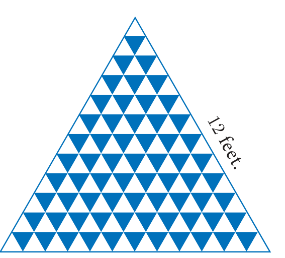

**Solution** Since the mosaic is in the shape of an equilateral triangle of 12 feet, and the tile is in the shape of an equilateral triangle of 12 inch (1 feet), there will be 12 rows in the mosaic.

From the figure, it is clear that number of white tiles in each row are 1, 2, 3, 4, …, 12 which clearly forms an Arithmetic Progression.

Similarly the number of blue tiles in each row are 0, 1, 2, 3, …, 11 which is also an Arithmetic Progression.

$$\text{Number of white tiles} = 1 + 2 + 3 + \cdots + 12 = \dfrac{12}{2}[1 + 12] = 78$$

$$\text{Number of blue tiles} = 0 + 1 + 2 + 3 + \cdots + 11 = \dfrac{12}{2}[0 + 11] = 66$$

$$\text{The total number of tiles in the mosaic} = 78 + 66 = 144$$

**Example 2.38** The houses of a street are numbered from 1 to 49. Senthil's house is numbered such that the sum of numbers of the houses prior to Senthil's house is equal to the sum of numbers of the houses following Senthil's house. Find Senthil's house number?

**Solution** Let Senthil's house number be $x$.

It is given that $1 + 2 + 3 + \cdots + (x - 1) = (x + 1) + (x + 2) + \cdots + 49$

$$1 + 2 + 3 + \cdots + (x - 1) = \left[1 + 2 + 3 + \cdots + 49\right] - \left[1 + 2 + 3 + \cdots + x\right]$$

$$\dfrac{x - 1}{2}\left[1 + (x - 1)\right] = \dfrac{49}{2}\left[1 + 49\right] - \dfrac{x}{2}\left[1 + x\right]$$

$$\dfrac{x(x - 1)}{2} = \dfrac{49 \times 50}{2} - \dfrac{x(x + 1)}{2}$$

$$x^2 - x = 2450 - x^2 - x \Rightarrow 2x^2 = 2450$$

$$x^2 = 1225 \Rightarrow x = 35$$

Therefore, Senthil's house number is 35.

**Example 2.39** The sum of first $n$, $2n$ and $3n$ terms of an A.P. are $S_1$, $S_2$ and $S_3$ respectively. Prove that $S_3 = 3(S_2 - S_1)$.

**Solution** If $S_1, S_2$ and $S_3$ are sum of first $n$, $2n$ and $3n$ terms of an A.P. respectively then

$$S_1 = \dfrac{n}{2}\left[2a + (n - 1)d\right], \quad S_2 = \dfrac{2n}{2}\left[2a + (2n - 1)d\right], \quad S_3 = \dfrac{3n}{2}\left[2a + (3n - 1)d\right]$$

Consider, 

$$S_2 - S_1 = \dfrac{2n}{2}\left[2a + (2n - 1)d\right] - \dfrac{n}{2}\left[2a + (n - 1)d\right]$$

$$= \dfrac{n}{2}\left[\left[4a + 2(2n - 1)d\right] - \left[2a + (n - 1)d\right]\right]$$

$$S_2 - S_1 = \dfrac{n}{2} \times \left[2a + (3n - 1)d\right]$$

$$3(S_2 - S_1) = \dfrac{3n}{2}\left[2a + (3n - 1)d\right]$$

$$3(S_2 - S_1) = S_3$$

**Thinking Corner**

1. What is the sum of first $n$ odd natural numbers?
2. What is the sum of first $n$ even natural numbers?

### Exercise 2.6

1. Find the sum of the following
   (i) 3, 7, 11,… up to 40 terms. &emsp;&emsp;&emsp;&emsp; (ii) 102, 97, 92,… up to 27 terms.
   (iii) $6 + 13 + 20 + \cdots + 97$

2. How many consecutive odd integers beginning with 5 will sum to 480?

3. Find the sum of first 28 terms of an A.P. whose $n^{\text{th}}$ term is $4n - 3$.

4. The sum of first $n$ terms of a certain series is given as $2n^2 - 3n$. Show that the series is an A.P.

5. The $104^{\text{th}}$ term and $4^{\text{th}}$ term of an A.P. are 125 and 0. Find the sum of first 35 terms.

6. Find the sum of all odd positive integers less than 450.

7. Find the sum of all natural numbers between 602 and 902 which are not divisible by 4.

8. Raghu wish to buy a laptop. He can buy it by paying ₹40,000 cash or by giving it in 10 installments as ₹4800 in the first month, ₹4750 in the second month, ₹4700 in the third month and so on. If he pays the money in this fashion, find
   (i) total amount paid in 10 installments.
   (ii) how much extra amount that he has to pay than the cost?

9. A man repays a loan of ₹65,000 by paying ₹400 in the first month and then increasing the payment by ₹300 every month. How long will it take for him to clear the loan?

10. A brick staircase has a total of 30 steps. The bottom step requires 100 bricks. Each successive step requires two bricks less than the previous step.
    (i) How many bricks are required for the top most step?
    (ii) How many bricks are required to build the stair case?

11. If $S_1, S_2, S_3, \ldots, S_m$ are the sums of $n$ terms of $m$ A.P.'s whose first terms are $1, 2, 3, \ldots, m$ and whose common differences are $1, 3, 5, \ldots, (2m - 1)$ respectively, then show that $S_1 + S_2 + S_3 + \cdots + S_m = \dfrac{1}{2}mn(mn + 1)$.

12. Find the sum $\left[\dfrac{a - b}{a + b} + \dfrac{3a - 2b}{a + b} + \dfrac{5a - 3b}{a + b} + \cdots \text{to 12 terms}\right]$.

### 2.9 Geometric Progression

In the diagram given in Fig.2.13, $\Delta DEF$ is formed by joining the mid points of the sides $AB$, $BC$ and $CA$ of $\Delta ABC$. Then the size of the triangle $\Delta DEF$ is exactly one-fourth of the size of $\Delta ABC$. Similarly $\Delta GHI$ is also one-fourth of $\Delta DEF$ and so on. In general, the successive areas are one-fourth of the previous areas.

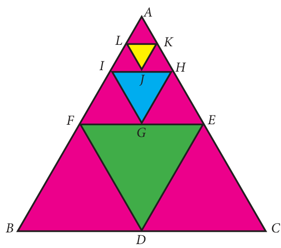

The area of these triangles are

$\Delta ABC$, $\dfrac{1}{4}\Delta ABC$, $\dfrac{1}{4} \times \dfrac{1}{4}\Delta ABC$,…

That is, $\Delta ABC$, $\dfrac{1}{4}\Delta ABC$, $\dfrac{1}{16}\Delta ABC$,…

In this case, we see that beginning with $\Delta ABC$, we see that the successive triangles are formed whose areas are precisely one-fourth the area of the previous triangle. So, each term is obtained by multiplying $\dfrac{1}{4}$ to the previous term.

As another case, let us consider that a viral disease is spreading in a way such that at any stage two new persons get affected from an affected person. At first stage, one person is affected, at second stage two persons are affected and is spreading to four persons and so on. Then, number of persons affected at each stage are 1, 2, 4, 8, ... where except the first term, each term is precisely twice the previous term.

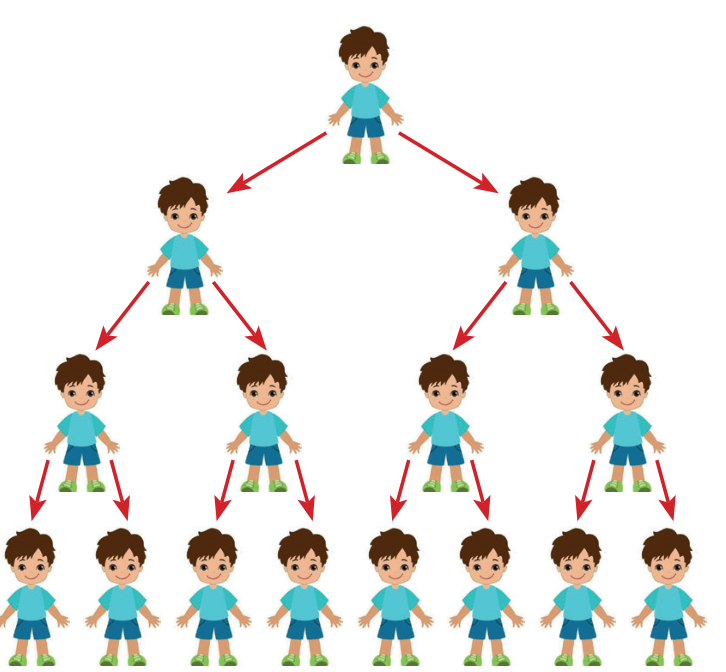

From the above examples, it is clear that each term is got by multiplying a fixed number to the preceding number.

This idea leads us to the concept of Geometric Progression.

> **Definition**
>
> A Geometric Progression is a sequence in which each term is obtained by multiplying a fixed non-zero number to the preceding term except the first term. The fixed number is called common ratio. The common ratio is usually denoted by $r$.

#### 2.9.1 General form of Geometric Progression

Let $a$ and $r \neq 0$ be real numbers. Then the numbers of the form $a, ar, ar^2, \ldots ar^{n-1} \ldots$ is called a Geometric Progression. The number '$a$' is called the first term and number '$r$' is called the common ratio.

We note that beginning with first term $a$, each term is obtained by multiplied with the common ratio '$r$' to give $ar, ar^2, ar^3, \ldots$

#### 2.9.2 General term of Geometric Progression

We try to find a formula for $n^{th}$ term or general term of Geometric Progression (G.P.) whose terms are in the common ratio.

$a, ar, ar^2, \ldots, ar^{n-1}, \ldots$ where $a$ is the first term and '$r$' is the common ratio. Let $t_n$ be the $n^{\text{th}}$ term of the G.P.

Then

$$t_1 = a = a \times r^0 = a \times r^{1-1}$$

$$t_2 = t_1 \times r = a \times r = a \times r^{2-1}$$

$$t_3 = t_2 \times r = ar \times r = ar^2 = ar^{3-1}$$

$$\vdots \qquad \vdots$$

$$t_n = t_{n-1} \times r = ar^{n-2} \times r = ar^{n-2+1} = ar^{n-1}$$

$$\boxed{\text{Thus, the general term or } n^{th} \text{ term of a G.P. is } t_n = ar^{n-1}}$$

> **Note**
>
> If we consider the ratio of successive terms of the G.P. then we have
>
> $$\dfrac{t_2}{t_1} = \dfrac{ar}{a} = r, \quad \dfrac{t_3}{t_2} = \dfrac{ar^2}{ar} = r, \quad \dfrac{t_4}{t_3} = \dfrac{ar^3}{ar^2} = r, \quad \dfrac{t_5}{t_4} = \dfrac{ar^4}{ar^3} = r, \ldots$$
>
> Thus, the ratio between any two consecutive terms of the Geometric Progression is always constant and that constant is the common ratio of the given Progression.

**Progress Check**

1. A G.P. is obtained by multiplying ____ to the preceding term.
2. The ratio between any two consecutive terms of the G.P. is ____ and it is called ____.
3. Fill in the blanks if the following are in G.P.
   (i) $\dfrac{1}{8}, \dfrac{3}{4}, \dfrac{9}{2}, \rule{0.9cm}{0.4pt}$ &emsp;&emsp; (ii) $7, \dfrac{7}{2}, \rule{0.9cm}{0.4pt}$ &emsp;&emsp; (iii) $\rule{0.9cm}{0.4pt}, 2\sqrt{2}, 4, \ldots$

**Example 2.40** Which of the following sequences form a Geometric Progression?

(i) 7, 14, 21, 28, … &emsp;&emsp; (ii) $\dfrac{1}{2}$, 1, 2, 4, ... &emsp;&emsp; (iii) 5, 25, 50, 75, …

**Solution** To check if a given sequence form a G.P. we have to see if the ratio between successive terms are equal.

(i) 7, 14, 21, 28, …

$$\dfrac{t_2}{t_1} = \dfrac{14}{7} = 2; \qquad \dfrac{t_3}{t_2} = \dfrac{21}{14} = \dfrac{3}{2}; \qquad \dfrac{t_4}{t_3} = \dfrac{28}{21} = \dfrac{4}{3}$$

Since the ratios between successive terms are not equal, the sequence 7, 14, 21, 28, … is not a Geometric Progression.

(ii) $\dfrac{1}{2}$, 1, 2, 4, ...

$$\dfrac{t_2}{t_1} = \dfrac{1}{\frac{1}{2}} = 2; \qquad \dfrac{t_3}{t_2} = \dfrac{2}{1} = 2; \qquad \dfrac{t_4}{t_3} = \dfrac{4}{2} = 2$$

Here the ratios between successive terms are equal. Therefore the sequence $\dfrac{1}{2}$, 1, 2, 4, ... is a Geometric Progression with common ratio $r = 2$.

(iii) 5, 25, 50, 75,...

$$\dfrac{t_2}{t_1} = \dfrac{25}{5} = 5; \qquad \dfrac{t_3}{t_2} = \dfrac{50}{25} = 2; \qquad \dfrac{t_4}{t_3} = \dfrac{75}{50} = \dfrac{3}{2}$$

Since the ratios between successive terms are not equal, the sequence 5, 25, 50, 75,... is not a Geometric Progression.

**Thinking Corner**

Is the sequence $2, 2^2, 2^{2^2}, 2^{2^{2^2}}, \ldots$ is a G.P. ?

**Example 2.41** Find the geometric progression whose first term and common ratios are given by (i) $a = -7$, $r = 6$ &emsp; (ii) $a = 256$, $r = 0.5$

**Solution** (i) The general form of Geometric progression is $a$, $ar$, $ar^2$,...

$a = -7$, $ar = -7 \times 6 = -42$, $ar^2 = -7 \times 6^2 = -252$

Therefore the required Geometric Progression is $-7, -42, -252, \ldots$

(ii) The general form of Geometric progression is $a$, $ar$, $ar^2$,...

$a = 256$, $ar = 256 \times 0.5 = 128$, $ar^2 = 256 \times (0.5)^2 = 64$

Therefore the required Geometric progression is 256, 128, 64,....

**Progress Check**

1. If first term $= a$, common ratio $= r$, then find the value of $t_9$ and $t_{27}$.
2. In a G.P. if $t_1 = \dfrac{1}{5}$ and $t_2 = \dfrac{1}{25}$ then the common ratio is ____.

**Example 2.42** Find the $8^{\text{th}}$ term of the G.P. 9, 3, 1,…

**Solution** To find the $8^{\text{th}}$ term we have to use the $n^{th}$ term formula $t_n = ar^{n-1}$

First term $a = 9$, Common ratio $r = \dfrac{t_2}{t_1} = \dfrac{3}{9} = \dfrac{1}{3}$

$$t_8 = 9 \times \left(\dfrac{1}{3}\right)^{8-1} = 9 \times \left(\dfrac{1}{3}\right)^7 = \dfrac{1}{243}$$

Therefore the $8^{\text{th}}$ term of the G.P. is $\dfrac{1}{243}$.

**Example 2.43** In a Geometric progression, the $4^{\text{th}}$ term is $\dfrac{8}{9}$ and the $7^{\text{th}}$ term is $\dfrac{64}{243}$. Find the Geometric Progression.

**Solution** $4^{\text{th}}$ term, $t_4 = \dfrac{8}{9} \Rightarrow ar^3 = \dfrac{8}{9}$ &emsp;&emsp;&emsp; …(1)

$7^{\text{th}}$ term, $t_7 = \dfrac{64}{243} \Rightarrow ar^6 = \dfrac{64}{243}$ &emsp;&emsp;&emsp; …(2)

Dividing (2) by (1) we get, $\dfrac{ar^6}{ar^3} = \dfrac{\dfrac{64}{243}}{\dfrac{8}{9}}$

$$r^3 = \dfrac{8}{27} \Rightarrow r = \dfrac{2}{3}$$

Substituting the value of $r$ in (1), we get $a \times \left[\dfrac{2}{3}\right]^3 = \dfrac{8}{9} \Rightarrow a = 3$

Therefore the Geometric Progression is $a, ar, ar^2, \ldots$ That is, $3, 2, \dfrac{4}{3}, \ldots$

> **Note**
> - When the product of three consecutive terms of a G.P. are given, we can take the three terms as $\dfrac{a}{r}, a, ar$.
> - When the products of four consecutive terms are given for a G.P. then we can take the four terms as $\dfrac{a}{r^3}, \dfrac{a}{r}, ar, ar^3$.
> - When each term of a Geometric Progression is multiplied or divided by a non–zero constant then the resulting sequence is also a Geometric Progression.

**Example 2.44** The product of three consecutive terms of a Geometric Progression is $343$ and their sum is $\dfrac{91}{3}$. Find the three terms.

**Solution** Since the product of 3 consecutive terms is given.

we can take them as $\dfrac{a}{r}, a, ar$.

Product of the terms $= 343$

$$\dfrac{a}{r} \times a \times ar = 343$$

$$a^3 = 7^3 \Rightarrow a = 7$$

Sum of the terms $= \dfrac{91}{3}$

Hence $a\left(\dfrac{1}{r} + 1 + r\right) = \dfrac{91}{3} \Rightarrow 7\left(\dfrac{1 + r + r^2}{r}\right) = \dfrac{91}{3}$

$$3 + 3r + 3r^2 = 13r \Rightarrow 3r^2 - 10r + 3 = 0$$

$$(3r - 1)(r - 3) = 0 \Rightarrow r = 3 \text{ or } r = \dfrac{1}{3}$$

If $a = 7$, $r = 3$ then the three terms are $\dfrac{7}{3}, 7, 21$.

If $a = 7$, $r = \dfrac{1}{3}$ then the three terms are $21, 7, \dfrac{7}{3}$.

**Thinking Corner**

1. Split $64$ into three parts such that the numbers are in G.P.
2. If $a, b, c, \ldots$ are in G.P. then $2a, 2b, 2c, \ldots$ are in ____
3. If $3, x, 6.75$ are in G.P. then $x$ is ____

**Progress Check**

Three non-zero numbers $a, b, c$ are in G.P. if and only if ____.

**Condition for three numbers to be in G.P.**

If $a, b, c$ are in G.P. then $b = ar$, $c = ar^2$. So $ac = a \times ar^2 = (ar)^2 = b^2$. Thus $b^2 = ac$

Similarly, if $b^2 = ac$, then $\dfrac{b}{a} = \dfrac{c}{b}$. So $a, b, c$ are in G.P.

Thus three non-zero numbers $a, b, c$ are in G.P. if and only if $b^2 = ac$.

**Example 2.45** The present value of a machine is ₹$40,000$ and its value depreciates each year by $10\%$. Find the estimated value of the machine in the $6^{\text{th}}$ year.

**Solution** The value of the machine at present is ₹$40,000$. Since it is depreciated at the rate of $10\%$ after one year the value of the machine is $90\%$ of the initial value.

That is the value of the machine at the end of the first year is $40,000 \times \dfrac{90}{100}$

After two years, the value of the machine is $90\%$ of the value in the first year.

Value of the machine at the end of the $2^{\text{nd}}$ year is $40,000 \times \left(\dfrac{90}{100}\right)^2$

Continuing this way, the value of the machine depreciates in the following way as

$$40000,\ 40000 \times \dfrac{90}{100},\ 40000 \times \left(\dfrac{90}{100}\right)^2 \ldots$$

This sequence is in the form of G.P. with first term $40,000$ and common ratio $\dfrac{90}{100}$. For finding the value of the machine at the end of $5^{\text{th}}$ year (i.e. in $6^{\text{th}}$ year), we need to find the sixth term of this G.P.

Thus, $n = 6$, $a = 40,000$, $r = \dfrac{90}{100}$.

Using $t_n = ar^{n-1}$, we have $t_6 = 40,000 \times \left(\dfrac{90}{100}\right)^{6-1} = 40000 \times \left(\dfrac{90}{100}\right)^5$

$$t_6 = 40,000 \times \dfrac{9}{10} \times \dfrac{9}{10} \times \dfrac{9}{10} \times \dfrac{9}{10} \times \dfrac{9}{10} = 23619.6$$

Therefore the value of the machine in $6^{\text{th}}$ year $=$ ₹$23619.60$

### Exercise 2.7

1. Which of the following sequences are in G.P.?

   (i) $3, 9, 27, 81, \ldots$ &emsp; (ii) $4, 44, 444, 4444, \ldots$ &emsp; (iii) $0.5, 0.05, 0.005, \ldots$

   (iv) $\dfrac{1}{3}, \dfrac{1}{6}, \dfrac{1}{12}, \ldots$ &emsp; (v) $1, -5, 25, -125, \ldots$ &emsp; (vi) $120, 60, 30, 18, \ldots$ &emsp; (vii) $16, 4, 1, \dfrac{1}{4}, \ldots$

2. Write the first three terms of the G.P. whose first term and the common ratio are given below.

   (i) $a = 6$, $r = 3$ &emsp; (ii) $a = \sqrt{2}$, $r = \sqrt{2}$ &emsp; (iii) $a = 1000$, $r = \dfrac{2}{5}$

3. In a G.P. $729, 243, 81, \ldots$ find $t_7$.

4. Find $x$ so that $x + 6$, $x + 12$ and $x + 15$ are consecutive terms of a Geometric Progression.

5. Find the number of terms in the following G.P.

   (i) $4, 8, 16, \ldots, 8192$? &emsp; (ii) $\dfrac{1}{3}, \dfrac{1}{9}, \dfrac{1}{27}, \ldots, \dfrac{1}{2187}$

6. In a G.P. the $9^{\text{th}}$ term is $32805$ and $6^{\text{th}}$ term is $1215$. Find the $12^{\text{th}}$ term.

7. Find the $10^{\text{th}}$ term of a G.P. whose $8^{\text{th}}$ term is $768$ and the common ratio is $2$.

8. If $a, b, c$ are in A.P. then show that $3^a, 3^b, 3^c$ are in G.P.

9. In a G.P. the product of three consecutive terms is $27$ and the sum of the product of two terms taken at a time is $\dfrac{57}{2}$. Find the three terms.

10. A man joined a company as Assistant Manager. The company gave him a starting salary of ₹$60,000$ and agreed to increase his salary $5\%$ annually. What will be his salary after 5 years?

11. Sivamani is attending an interview for a job and the company gave two offers to him.

    Offer A: ₹$20,000$ to start with followed by a guaranteed annual increase of $6\%$ for the first 5 years.

    Offer B: ₹$22,000$ to start with followed by a guaranteed annual increase of $3\%$ for the first 5 years.

    What is his salary in the $4^{th}$ year with respect to the offers $A$ and $B$?

12. If $a, b, c$ are three consecutive terms of an A.P. and $x, y, z$ are three consecutive terms of a G.P. then prove that $x^{b-c} \times y^{c-a} \times z^{a-b} = 1$.

### 2.10 Sum to $n$ terms of a Geometric progression

A series whose terms are in Geometric progression is called **Geometric series.**

Let $a, ar, ar^2, \ldots ar^{n-1}, \ldots$ be the Geometric Progression.

The sum of first $n$ terms of the Geometric progression is

$$S_n = a + ar + ar^2 + \cdots + ar^{n-2} + ar^{n-1} \qquad \ldots(1)$$

Multiplying both sides by $r$, we get $rS_n = ar + ar^2 + ar^3 + \cdots + ar^{n-1} + ar^n \quad \ldots(2)$

$$(2) - (1) \Rightarrow rS_n - S_n = ar^n - a$$

$$S_n(r - 1) = a(r^n - 1)$$

Thus, the sum to n terms is $S_n = \dfrac{a(r^n - 1)}{r - 1}$, $r \neq 1$.

> **Note**
>
> The above formula for sum of first $n$ terms of a G.P. is not applicable when $r = 1$.
>
> If $r = 1$, then $S_n = a + a + a + \cdots + a = na$

**Progress Check**

1. A series whose terms are in Geometric progression is called ____.
2. When $r = 1$, the formula for finding sum to $n$ terms of a G.P. is ____.
3. When $r \neq 1$, the formula for finding sum to n terms of a G.P. is ____.

#### 2.10.1 Sum to infinite terms of a G.P.

The sum of infinite terms of a G.P. is given by $S_\infty = a + ar + ar^2 + ar^3 + \cdots = \dfrac{a}{1 - r}, -1 < r < 1$

**Example 2.46** Find the sum of 8 terms of the G.P. $1, -3, 9, -27 \ldots$

**Solutions** Here, the first term $a = 1$, common ratio $r = \dfrac{-3}{1} = -3 < 1$, Here, $n = 8$.

Sum to $n$ terms of a G.P. is $S_n = \dfrac{a(r^n - 1)}{r - 1}$ if $r \neq 1$

Hence, $S_8 = \dfrac{1\left((-3)^8 - 1\right)}{(-3) - 1} = \dfrac{6561 - 1}{-4} = -1640$

**Example 2.47** Find the first term of a G.P. in which $S_6 = 4095$ and $r = 4$.

**Solution** Common ratio $= 4 > 1$, Sum of first 6 terms $S_6 = 4095$

Hence, $S_6 = \dfrac{a(r^n - 1)}{r - 1} = 4095$

$\because$ $r = 4$, $\dfrac{a(4^6 - 1)}{4 - 1} = 4095 \Rightarrow a \times \dfrac{4095}{3} = 4095$

First term $a = 3$.

**Example 2.48** How many terms of the series $1 + 4 + 16 + \cdots$ make the sum $1365$?

**Solution** Let $n$ be the number of terms to be added to get the sum $1365$

$$a = 1,\ r = \dfrac{4}{1} = 4 > 1$$

$$S_n = 1365 \Rightarrow \dfrac{a(r^n - 1)}{r - 1} = 1365$$

$$\dfrac{1(4^n - 1)}{4 - 1} = 1365 \text{ so, } (4^n - 1) = 4095$$

$$4^n = 4096 \text{ then } 4^n = 4^6$$

$$n = 6$$

**Example 2.49** Find the sum $3 + 1 + \dfrac{1}{3} + \ldots \infty$

**Solution** Here $a = 3$, $r = \dfrac{t_2}{t_1} = \dfrac{1}{3}$

Sum of infinite terms $S_\infty = \dfrac{a}{1 - r} = \dfrac{3}{1 - \dfrac{1}{3}} = \dfrac{9}{2}$

**Progress Check**

1. Sum to infinite number of terms of a G.P. is ____.
2. For what values of $r$, does the formula for infinite G.P. valid?

**Example 2.50** Find the rational form of the number $0.6666\ldots$

**Solution** We can express the number $0.6666\ldots$ as follows

$$0.6666\ldots = 0.6 + 0.06 + 0.006 + 0.0006 + \cdots$$

We now see that numbers $0.6, 0.06, 0.006 \ldots$ form a G.P. whose first term $a = 0.6$ and common ratio $r = \dfrac{0.06}{0.6} = 0.1$. Also $-1 < r = 0.1 < 1$

Using the infinite G.P. formula, we have

$$0.6666\ldots = 0.6 + 0.06 + 0.006 + 0.0006 + \cdots = \dfrac{0.6}{1 - 0.1} = \dfrac{0.6}{0.9} = \dfrac{2}{3}$$

Thus the rational number equivalent of $0.6666\ldots$ is $\dfrac{2}{3}$

**Activity 5**

The sides of a given square is $10$ cm. The mid points of its sides are joined to form a new square. Again, the mid points of the sides of this new square are joined to form another square. This process is continued indefinitely. Find the sum of the areas and the sum of the perimeters of the squares formed through this process.

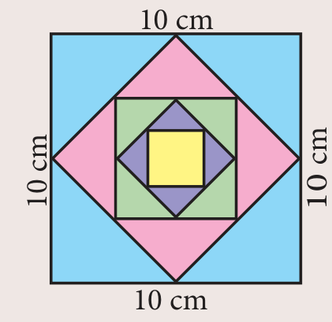

**Example 2.51** Find the sum to $n$ terms of the series $5 + 55 + 555 + \cdots$

**Solution** The series is neither Arithmetic nor Geometric series. So it can be split into two series and then find the sum.

$$5 + 55 + 555 + \cdots + n\ terms = 5\left[1 + 11 + 111 + \cdots + n\ terms\right]$$

$$= \dfrac{5}{9}\left[9 + 99 + 999 + \cdots + n\ terms\right]$$

$$= \dfrac{5}{9}\left[(10 - 1) + (100 - 1) + (1000 - 1) + \cdots + n\ terms\right]$$

$$= \dfrac{5}{9}\left[(10 + 100 + 1000 + \cdots + n\ terms) - n\right]$$

$$= \dfrac{5}{9}\left[\dfrac{10(10^n - 1)}{(10 - 1)} - n\right] = \dfrac{50(10^n - 1)}{81} - \dfrac{5n}{9}$$

**Progress Check**

1. Is the series $3 + 33 + 333 + \ldots$ a Geometric series?
2. The value of $r$, such that $1 + r + r^2 + r^3 \ldots = \dfrac{3}{4}$ is ____.

**Example 2.52** Find the least positive integer $n$ such that $1 + 6 + 6^2 + \cdots + 6^n > 5000$

**Solution** We have to find the least number of terms for which the sum must be greater than $5000$.

That is, to find the least value of $n$. such that $S_n > 5000$

We have, $S_n = \dfrac{a(r^n - 1)}{r - 1} = \dfrac{1(6^n - 1)}{6 - 1} = \dfrac{6^n - 1}{5}$

$$S_n > 5000 \Rightarrow \dfrac{6^n - 1}{5} > 5000$$

$$6^n - 1 > 25000 \Rightarrow 6^n > 25001$$

$$\because \quad 6^5 = 7776 \text{ and } 6^6 = 46656$$

The least positive value of $n$ is 6 such that $1 + 6 + 6^2 + \cdots + 6^n > 5000$.

**Example 2.53** A person saved money every year, half as much as he could in the previous year. If he had totally saved ₹ $7875$ in 6 years then how much did he save in the first year?

**Solution** Total amount saved in 6 years is $S_6 = 7875$

Since he saved half as much money as every year he saved in the previous year,

We have $r = \dfrac{1}{2} < 1$

$$\dfrac{a\left(1 - r^n\right)}{1 - r} = \dfrac{a\left(1 - \left(\dfrac{1}{2}\right)^6\right)}{1 - \dfrac{1}{2}} = 7875$$

$$\dfrac{a\left(1 - \dfrac{1}{64}\right)}{\dfrac{1}{2}} = 7875 \Rightarrow a \times \dfrac{63}{32} = 7875$$

$$a = \dfrac{7875 \times 32}{63}$$

$$a = 4000$$

The amount saved in the first year is ₹ $4000$.

### Exercise 2.8

1. Find the sum of first $n$ terms of the G.P. (i) $5, -3, \dfrac{9}{5}, -\dfrac{27}{25}, \ldots$ &emsp; (ii) $256, 64, 16, \ldots$

2. Find the sum of first six terms of the G.P. $5, 15, 45, \ldots$

3. Find the first term of the G.P. whose common ratio $5$ and whose sum to first $6$ terms is $46872$.

4. Find the sum to infinity of (i) $9 + 3 + 1 + \cdots$ &emsp; (ii) $21 + 14 + \dfrac{28}{3} + \cdots$

5. If the first term of an infinite G.P. is $8$ and its sum to infinity is $\dfrac{32}{3}$ then find the common ratio.

6. Find the sum to $n$ terms of the series

   (i) $0.4 + 0.44 + 0.444 + \cdots$ to $n$ terms &emsp; (ii) $3 + 33 + 333 + \cdots$ to $n$ terms

7. Find the sum of the Geometric series $3 + 6 + 12 + \cdots + 1536$.

8. Kumar writes a letter to four of his friends. He asks each one of them to copy the letter and mail to four different persons with the instruction that they continue the process similarly. Assuming that the process is unaltered and it costs ₹$2$ to mail one letter, find the amount spent on postage when $8^{\text{th}}$ set of letters is mailed.

9. Find the rational form of the number $0.\overline{123}$.

10. If $S_n = (x + y) + (x^2 + xy + y^2) + (x^3 + x^2y + xy^2 + y^3) + \cdots n$ terms then prove that

    $$(x - y)S_n = \left[\dfrac{x^2(x^n - 1)}{x - 1} - \dfrac{y^2(y^n - 1)}{y - 1}\right]$$

### 2.11 Special Series

There are some series whose sum can be expressed by explicit formulae. Such series are called **special series.**

Here we study some common special series like

(i) Sum of first '$n$' natural numbers

(ii) Sum of first '$n$' odd natural numbers.

(iii) Sum of squares of first '$n$' natural numbers.

(iv) Sum of cubes of first '$n$' natural numbers.

We can derive the formula for sum of any powers of first $n$ natural numbers using the expression $(x + 1)^{k+1} - x^{k+1}$. That is to find $1^k + 2^k + 3^k + \ldots + n^k$ we can use the expression $(x + 1)^{k+1} - x^{k+1}$.

#### 2.11.1 Sum of first $n$ natural numbers

To find $1 + 2 + 3 + \cdots + n$, let us consider the identity $(x + 1)^2 - x^2 = 2x + 1$

Where $x = 1, 2, 3, \ldots n - 1, n$

$$x = 1,\ 2^2 - 1^2 = 2(1) + 1$$

$$x = 2,\ 3^2 - 2^2 = 2(2) + 1$$

$$x = 3,\ 4^2 - 3^2 = 2(3) + 1$$

$$\vdots \qquad \vdots \qquad \vdots$$

$$x = n - 1,\ n^2 - (n - 1)^2 = 2(n - 1) + 1$$

$$x = n,\ (n + 1)^2 - n^2 = 2(n) + 1$$

Adding all these equations and cancelling the terms on the Left Hand side, we get,

$$(n + 1)^2 - 1^2 = 2(1 + 2 + 3 + \cdots + n) + n$$

$$n^2 + 2n = 2(1 + 2 + 3 + \cdots + n) + n$$

$$2(1 + 2 + 3 + \cdots + n) = n^2 + n = n(n + 1)$$

$$1 + 2 + 3 + \cdots + n = \dfrac{n(n + 1)}{2}$$

#### 2.11.2 Sum of first $n$ odd natural numbers

$1 + 3 + 5 + \cdots + (2n - 1)$

It is an A.P. with $a = 1$, $d = 2$ and $l = 2n - 1$

$$S_n = \dfrac{n}{2}\left[a + l\right]$$

$$= \dfrac{n}{2}\left[1 + 2n - 1\right]$$

$$S_n = \dfrac{n}{2} \times 2n = n^2$$

#### 2.11.3 Sum of squares of first $n$ natural numbers

To find $1^2 + 2^2 + 3^2 + \cdots + n^2$, let us consider the identity $(x + 1)^3 - x^3 = 3x^2 + 3x + 1$

Where $x = 1, 2, 3, \ldots n - 1, n$

$$x = 1,\ 2^3 - 1^3 = 3(1)^2 + 3(1) + 1$$

$$x = 2,\ 3^3 - 2^3 = 3(2)^2 + 3(2) + 1$$

$$x = 3,\ 4^3 - 3^3 = 3(3)^2 + 3(3) + 1$$

$$\vdots \qquad \vdots \qquad \vdots$$

$$x = n - 1,\ n^3 - (n - 1)^3 = 3(n - 1)^2 + 3(n - 1) + 1$$

$$x = n,\ (n + 1)^3 - n^3 = 3n^2 + 3n + 1$$

Adding all these equations and cancelling the terms on the Left Hand side, we get,

$$(n + 1)^3 - 1^3 = 3(1^2 + 2^2 + 3^2 + \cdots + n^2) + 3(1 + 2 + 3 + \cdots + n) + n$$

$$n^3 + 3n^2 + 3n = 3(1^2 + 2^2 + 3^2 + \cdots + n^2) + \dfrac{3n(n + 1)}{2} + n$$

$$3(1^2 + 2^2 + 3^2 + \cdots + n^2) = n^3 + 3n^2 + 2n - \dfrac{3n(n + 1)}{2} = \dfrac{2n^3 + 6n^2 + 4n - 3n^2 - 3n}{2}$$

$$3(1^2 + 2^2 + 3^2 + \ldots + n^2) = \dfrac{2n^3 + 3n^2 + n}{2} = \dfrac{n(2n^2 + 3n + 1)}{2} = \dfrac{n(n + 1)(2n + 1)}{2}$$

$$1^2 + 2^2 + 3^2 + \cdots + n^2 = \dfrac{n(n + 1)(2n + 1)}{6}$$

#### 2.11.4 Sum of cubes of first $n$ natural numbers

To find $1^3 + 2^3 + 3^3 + \cdots + n^3$, let us consider the identity $(x + 1)^4 - x^4 = 4x^3 + 6x^2 + 4x + 1$

Where $x = 1, 2, 3, \ldots n - 1, n$

$$x = 1,\ 2^4 - 1^4 = 4(1)^3 + 6(1)^2 + 4(1) + 1$$

$$x = 2,\ 3^4 - 2^4 = 4(2)^3 + 6(2)^2 + 4(2) + 1$$

$$x = 3,\ 4^4 - 3^4 = 4(3)^3 + 6(3)^2 + 4(3) + 1$$

$$\vdots \qquad \vdots \qquad \vdots$$

$$x = n - 1,\ n^4 - (n - 1)^4 = 4(n - 1)^3 + 6(n - 1)^2 + 4(n - 1) + 1$$

$$x = n,\ (n + 1)^4 - n^4 = 4n^3 + 6n^2 + 4n + 1$$

Adding all these equations and cancelling the terms on the Left Hand side, we get,

$$(n + 1)^4 - 1^4 = 4(1^3 + 2^3 + 3^3 + \cdots + n^3) + 6(1^2 + 2^2 + 3^2 + \cdots + n^2) + 4(1 + 2 + 3 + \cdots + n) + n$$

$$n^4 + 4n^3 + 6n^2 + 4n = 4(1^3 + 2^3 + 3^3 + \cdots + n^3) + 6 \times \dfrac{n(n + 1)(2n + 1)}{6} + 4 \times \dfrac{n(n + 1)}{2} + n$$

$$4(1^3 + 2^3 + 3^3 + \cdots + n^3) = n^4 + 4n^3 + 6n^2 + 4n - 2n^3 - n^2 - 2n^2 - n - 2n^2 - 2n - n$$

$$4(1^3 + 2^3 + 3^3 + \cdots + n^3) = n^4 + 2n^3 + n^2 = n^2(n^2 + 2n + 1) = n^2(n + 1)^2$$

$$1^3 + 2^3 + 3^3 + \cdots + n^3 = \left[\dfrac{n(n + 1)}{2}\right]^2$$

> **Do You Know**
>
> **Ideal Friendship**
>
> Consider the numbers $220$ and $284$.
>
> Sum of the divisors of $220$ (excluding $220$) $= 1 + 2 + 4 + 5 + 10 + 11 + 20 + 22 + 44 + 55 + 110 = 284$
>
> Sum of the divisors of $284$ (excluding $284$) $= 1 + 2 + 4 + 71 + 142 = 220$.
>
> Thus, sum of divisors of one number excluding itself is the other. Such pair of numbers is called **Amicable Numbers** or **Friendly Numbers**.
>
> $220$ and $284$ are least pair of Amicable Numbers. They were discovered by Pythagoras. We now know more than 12 million amicable pair of Numbers.

**Activity 6**

Take a triangle like this

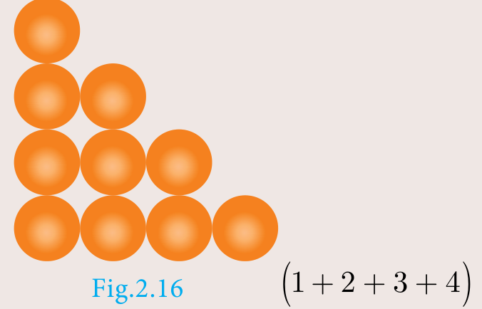

Make another triangle like this.

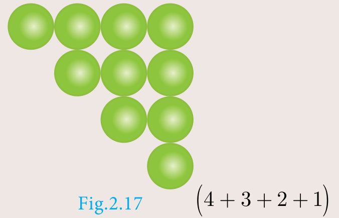

Join the second triangle with the first to get

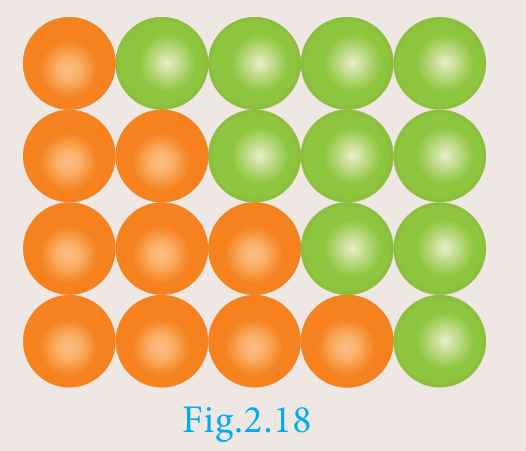

Thus, two copies of $1 + 2 + 3 + 4$ provide a rectangle of size $4 \times 5$.

We can write in numbers, what we did with pictures. Let us write, $(4 + 3 + 2 + 1) + (1 + 2 + 3 + 4) = 4 \times 5$

$$2(1 + 2 + 3 + 4) = 4 \times 5$$

Therefore, $1 + 2 + 3 + 4 = \dfrac{4 \times 5}{2} = 10$

In a similar, fashion, try to find the sum of first $5$ natural numbers. Can you relate these answers to any of the known formula?

> **Do You Know**
> 1. The sum of first $n$ natural numbers are also called **Triangular Numbers** because they form triangle shapes.
> 2. The sum of squares of first $n$ natural numbers are also called **Square Pyramidal Numbers** because they form pyramid shapes with square base.

**Thinking Corner**

1. How many squares are there in a standard chess board?
2. How many rectangles are there in a standard chess board?

Here is a summary of list of some useful summation formulae which we discussed. These formulae are used in solving summation problems with finite terms.

$$\sum_{k=1}^{n} k = 1 + 2 + 3 + \cdots + n = \dfrac{n(n + 1)}{2}$$

$$\sum_{k=1}^{n} (2k - 1) = 1 + 2 + 3 + \cdots + (2n - 1) = n^2$$

$$\sum_{k=1}^{n} k^2 = 1^2 + 2^2 + 3^2 + \cdots + n^2 = \dfrac{n(n + 1)(2n + 1)}{6}$$

$$\sum_{k=1}^{n} k^3 = 1^3 + 2^3 + 3^3 + \cdots + n^3 = \left[\dfrac{n(n + 1)}{2}\right]^2$$

**Example 2.54** Find the value of (i) $1 + 2 + 3 + \ldots + 50$ &emsp; (ii) $16 + 17 + 18 + \ldots + 75$

**Solution** (i) $1 + 2 + 3 + \cdots + 50$

Using, $1 + 2 + 3 + \cdots + n = \dfrac{n(n + 1)}{2}$

$$1 + 2 + 3 + \cdots + 50 = \dfrac{50 \times (50 + 1)}{2} = 1275$$

(ii) $16 + 17 + 18 + \cdots + 75 = (1 + 2 + 3 + \cdots + 75) - (1 + 2 + 3 + \cdots + 15)$

$$= \dfrac{75(75 + 1)}{2} - \dfrac{15(15 + 1)}{2}$$

$$= 2850 - 120 = 2730$$

**Progress Check**

1. The sum of cubes of first $n$ natural numbers is ____ of the first $n$ natural numbers.
2. The average of first $100$ natural numbers is ____.

**Example 2.55** Find the sum of (i) $1 + 3 + 5 + \cdots$ to $40$ terms &emsp; (ii) $2 + 4 + 6 + \cdots + 80$ &emsp; (iii) $1 + 3 + 5 + \cdots + 55$

**Solution** (i) $1 + 3 + 5 + \cdots 40$ terms $= 40^2 = 1600$

(ii) $2 + 4 + 6 + \cdots + 80 = 2(1 + 2 + 3 + \cdots + 40) = 2 \times \dfrac{40 \times (40 + 1)}{2} = 1640$

(iii) $1 + 3 + 5 + \cdots + 55$

Here the number of terms is not given. Now we have to find the number of terms using the formula, $n = \dfrac{(l - a)}{d} + 1 \Rightarrow n = \dfrac{(55 - 1)}{2} + 1 = 28$

Therefore, $1 + 3 + 5 + \cdots + 55 = (28)^2 = 784$

**Example 2.56** Find the sum of (i) $1^2 + 2^2 + \cdots + 19^2$ &emsp; (ii) $5^2 + 10^2 + 15^2 + \cdots + 105^2$ &emsp; (iii) $15^2 + 16^2 + 17^2 + \cdots + 28^2$

**Solution** (i) $1^2 + 2^2 + \cdots + 19^2 = \dfrac{19 \times (19 + 1)(2 \times 19 + 1)}{6} = \dfrac{19 \times 20 \times 39}{6} = 2470$

(ii) $5^2 + 10^2 + 15^2 + \cdots + 105^2 = 5^2(1^2 + 2^2 + 3^2 + \cdots + 21^2)$

$$= 25 \times \dfrac{21 \times (21 + 1)(2 \times 21 + 1)}{6}$$

$$= \dfrac{25 \times 21 \times 22 \times 43}{6} = 82775$$

(iii) $15^2 + 16^2 + 17^2 + \cdots + 28^2 = (1^2 + 2^2 + 3^2 + \cdots + 28^2) - (1^2 + 2^2 + 3^2 + \cdots + 14^2)$

$$= \dfrac{28 \times 29 \times 57}{6} - \dfrac{14 \times 15 \times 29}{6} = 7714 - 1015 = 6699$$

**Example 2.57** Find the sum of (i) $1^3 + 2^3 + 3^3 + \cdots + 16^3$ &emsp; (ii) $9^3 + 10^3 + \cdots + 21^3$

**Solution** (i) $1^3 + 2^3 + 3^3 + \cdots + 16^3 = \left[\dfrac{16 \times (16 + 1)}{2}\right]^2 = (136)^2 = 18496$

(ii) $9^3 + 10^3 + \cdots + 21^3 = (1^3 + 2^3 + 3^3 + \cdots + 21^3) - (1^3 + 2^3 + 3^3 + \cdots + 8^3)$

$$= \left[\dfrac{21 \times (21 + 1)}{2}\right]^2 - \left[\dfrac{8 \times (8 + 1)}{2}\right]^2 = (231)^2 - (36)^2 = 52065$$

**Example 2.58** If $1 + 2 + 3 + \cdots + n = 666$ then find $n$.

**Solution** Since, $1 + 2 + 3 + \ldots + n = \dfrac{n(n + 1)}{2}$, we have $\dfrac{n(n + 1)}{2} = 666$

$$n^2 + n - 1332 = 0 \Rightarrow (n + 37)(n - 36) = 0$$

So, $n = -37$ or $n = 36$

But $n \neq -37$ ($\because n$ is a natural number); Hence $n = 36$.

**Progress Check**

Say True or False. Justify them.

1. The sum of first $n$ odd natural numbers is always an odd number.
2. The sum of consecutive even numbers is always an even number.
3. The difference between the sum of squares of first $n$ natural numbers and the sum of first $n$ natural numbers is always divisible by $2$.
4. The sum of cubes of the first $n$ natural numbers is always a square number.

### Exercise 2.9

1. Find the sum of the following series

   (i) $1 + 2 + 3 + \cdots + 60$ &emsp; (ii) $3 + 6 + 9 + \cdots + 96$ &emsp; (iii) $51 + 52 + 53 + \cdots + 92$

   (iv) $1 + 4 + 9 + 16 + \cdots + 225$ &emsp; (v) $6^2 + 7^2 + 8^2 + \cdots + 21^2$

   (vi) $10^3 + 11^3 + 12^3 + \cdots + 20^3$ &emsp; (vii) $1 + 3 + 5 + \cdots + 71$

2. If $1 + 2 + 3 + \cdots + k = 325$, then find $1^3 + 2^3 + 3^3 + \cdots + k^3$.

3. If $1^3 + 2^3 + 3^3 + \cdots + k^3 = 44100$ then find $1 + 2 + 3 + \cdots + k$.

4. How many terms of the series $1^3 + 2^3 + 3^3 + \cdots$ should be taken to get the sum $14400$?

5. The sum of the cubes of the first $n$ natural numbers is $2025$, then find the value of $n$.

6. Rekha has $15$ square colour papers of sizes $10$ cm, $11$ cm, $12$ cm, $\ldots$, $24$ cm. How much area can be decorated with these colour papers?

7. Find the sum of the series $(2^3 - 1^3) + (4^3 - 3^3) + (6^3 - 5^3) + \cdots$ to

   (i) $n$ terms &emsp; (ii) $8$ terms

### Exercise 2.10

**Multiple choice questions**

1. Euclid's division lemma states that for positive integers $a$ and $b$, there exist unique integers $q$ and $r$ such that $a = bq + r$, where $r$ must satisfy.

   (A) $1 < r < b$ &emsp; (B) $0 < r < b$ &emsp; (C) $0 \leq r < b$ &emsp; (D) $0 < r \leq b$

2. Using Euclid's division lemma, if the cube of any positive integer is divided by $9$ then the possible remainders are

   (A) $0, 1, 8$ &emsp; (B) $1, 4, 8$ &emsp; (C) $0, 1, 3$ &emsp; (D) $1, 3, 5$

3. If the HCF of $65$ and $117$ is expressible in the form of $65m - 117$, then the value of $m$ is

   (A) $4$ &emsp; (B) $2$ &emsp; (C) $1$ &emsp; (D) $3$

4. The sum of the exponents of the prime factors in the prime factorization of $1729$ is

   (A) $1$ &emsp; (B) $2$ &emsp; (C) $3$ &emsp; (D) $4$

5. The least number that is divisible by all the numbers from $1$ to $10$ (both inclusive) is

   (A) $2025$ &emsp; (B) $5220$ &emsp; (C) $5025$ &emsp; (D) $2520$

6. $7^{4k} \equiv$ ____ $(\text{mod } 100)$

   (A) $1$ &emsp; (B) $2$ &emsp; (C) $3$ &emsp; (D) $4$

7. Given $F_1 = 1$, $F_2 = 3$ and $F_n = F_{n-1} + F_{n-2}$ then $F_5$ is

   (A) $3$ &emsp; (B) $5$ &emsp; (C) $8$ &emsp; (D) $11$

8. The first term of an arithmetic progression is unity and the common difference is $4$. Which of the following will be a term of this A.P.

   (A) $4551$ &emsp; (B) $10091$ &emsp; (C) $7881$ &emsp; (D) $13531$

9. If $6$ times of $6^{\text{th}}$ term of an A.P. is equal to $7$ times the $7^{\text{th}}$ term, then the $13^{\text{th}}$ term of the A.P. is

   (A) $0$ &emsp; (B) $6$ &emsp; (C) $7$ &emsp; (D) $13$

10. An A.P. consists of $31$ terms. If its $16^{\text{th}}$ term is $m$, then the sum of all the terms of this A.P. is

    (A) $16\,m$ &emsp; (B) $62\,m$ &emsp; (C) $31\,m$ &emsp; (D) $\dfrac{31}{2}\,m$

11. In an A.P., the first term is $1$ and the common difference is $4$. How many terms of the A.P. must be taken for their sum to be equal to $120$?

    (A) $6$ &emsp; (B) $7$ &emsp; (C) $8$ &emsp; (D) $9$

12. If $A = 2^{65}$ and $B = 2^{64} + 2^{63} + 2^{62} + \cdots + 2^0$ which of the following is true?

    (A) $B$ is $2^{64}$ more than $A$ &emsp; (B) $A$ and $B$ are equal

    (C) $B$ is larger than $A$ by $1$ &emsp; (D) $A$ is larger than $B$ by $1$

13. The next term of the sequence $\dfrac{3}{16}, \dfrac{1}{8}, \dfrac{1}{12}, \dfrac{1}{18}, \cdots$ is

    (A) $\dfrac{1}{24}$ &emsp; (B) $\dfrac{1}{27}$ &emsp; (C) $\dfrac{2}{3}$ &emsp; (D) $\dfrac{1}{81}$

14. If the sequence $t_1, t_2, t_3, \ldots$ are in A.P. then the sequence $t_6, t_{12}, t_{18}, \ldots$ is

    (A) a Geometric Progression &emsp; (B) an Arithmetic Progression

    (C) neither an Arithmetic Progression nor a Geometric Progression

    (D) a constant sequence

15. The value of $(1^3 + 2^3 + 3^3 + \cdots + 15^3) - (1 + 2 + 3 + \cdots + 15)$ is

    (A) $14400$ &emsp; (B) $14200$ &emsp; (C) $14280$ &emsp; (D) $14520$

### Unit Exercise - 2

1. Prove that $n^2 - n$ divisible by $2$ for every positive integer $n$.

2. A milk man has $175$ litres of cow's milk and $105$ litres of buffalow's milk. He wishes to sell the milk by filling the two types of milk in cans of equal capacity. Calculate the following (i) Capacity of a can (ii) Number of cans of cow's milk (iii) Number of cans of buffalow's milk.

3. When the positive integers $a$, $b$ and $c$ are divided by $13$ the respective remainders are $9$, $7$ and $10$. Find the remainder when $a + 2b + 3c$ is divided by $13$.

4. Show that $107$ is of the form $4q + 3$ for any integer $q$.

5. If $(m + 1)^{th}$ term of an A.P. is twice the $(n + 1)^{th}$ term, then prove that $(3m + 1)^{\text{th}}$ term is twice the $(m + n + 1)^{th}$ term.

6. Find the $12^{\text{th}}$ term from the last term of the A. P $-2, -4, -6, \ldots -100$.

7. Two A.P.'s have the same common difference. The first term of one A.P. is $2$ and that of the other is $7$. Show that the difference between their $10^{\text{th}}$ terms is the same as the difference between their $21^{\text{st}}$ terms, which is the same as the difference between any two corresponding terms.

8. A man saved ₹$16500$ in ten years. In each year after the first he saved ₹$100$ more than he did in the preceding year. How much did he save in the first year?

9. Find the G.P. in which the $2^{\text{nd}}$ term is $\sqrt{6}$ and the $6^{\text{th}}$ term is $9\sqrt{6}$.

10. The value of a motor cycle depreciates at the rate of $15\%$ per year. What will be the value of the motor cycle $3$ year hence, which is now purchased for ₹ $45,000$?

### Points to Remember

- **Euclid's division lemma**

  If $a$ and $b$ are two positive integers then there exist unique integers $q$ and $r$ such that $a = bq + r$, $0 \leq r < |b|$

- **Fundamental theorem of arithmetic**

  Every composite number can be expressed as a product of primes and this factorization is unique except for the order in which the prime factors occur.

- **Arithmetic Progression**
  1. Arithmetic Progression is $a,\ a + d,\ a + 2d,\ a + 3d, \ldots$ $n^{th}$ term is given by $t_n = a + (n - 1)d$
  2. Sum to first $n$ terms of an A.P. is $S_n = \dfrac{n}{2}\left[2a + (n - 1)d\right]$
  3. If the last term $l$ ($n^{th}$ term) is given, then $S_n = \dfrac{n}{2}\left[a + l\right]$

- **Geometric Progression**
  1. Geometric Progression is $a,\ ar,\ ar^2, \ldots, ar^{n-1}$. $n^{th}$ term is given by $t_n = ar^{n-1}$
  2. Sum to first $n$ terms of an G.P. is $S_n = \dfrac{a(r^n - 1)}{r - 1}$ if $r \neq 1$
  3. Suppose $r = 1$ then $S_n = na$
  4. Sum to infinite terms of a G.P. $a + ar + ar^2 + \cdots$ is $S_\infty = \dfrac{a}{1 - r}$, where $-1 < r < 1$

- **Special Series**
  1. The sum of first $n$ natural numbers $1 + 2 + 3 + \cdots + n = \dfrac{n(n + 1)}{2}$
  2. The sum of squares of first $n$ natural numbers $1^2 + 2^2 + 3^2 + \cdots + n^2 = \dfrac{n(n + 1)(2n + 1)}{6}$
  3. The sum of cubes of first $n$ natural numbers $1^3 + 2^3 + 3^3 + \cdots + n^3 = \left[\dfrac{n(n + 1)}{2}\right]^2$
  4. The sum of first $n$ odd natural numbers $1 + 3 + 5 + \cdots + (2n - 1) = n^2$

### ICT CORNER

**ICT 2.1**

**Step 1:** Open the Browser type the URL Link given below (or) Scan the QR Code. GeoGebra work book named **"Numbers and Sequences"** will open. In the left side of the work book there are many activity related to mensuration chapter. Select the work sheet **"Euclid's Lemma division"**

**Step 2:** In the given worksheet Drag the point mentioned as **"Drag Me"** to get new set of points. Now compare the Division algorithm you learned from textbook.

*(Screenshots for Step 1, Step 2, and Expected results of the "Euclid's Lemma division" GeoGebra worksheet appear here in the source — not reproduced as these are illustrative app-navigation screenshots rather than content figures.)*

**ICT 2.2**

**Step 1:** Open the Browser type the URL Link given below (or) Scan the QR Code. GeoGebra work book named **"Numbers and Sequences"** will open. In the left side of the work book there are many activity related to mensuration chapter. Select the work sheet **"Bouncing Ball Problem".**

**Step 2:** In the given worksheet you can change the height, Number of bounces and debounce ratio by typing new value. Then click **"Get Ball"**, and then click **"Drop"**. The ball bounces as per your value entered. Observe the working given on right hand side to learn the sum of sequence.

*(Screenshots for Step 1, Step 2, and Expected results of the "Bouncing Ball Problem" GeoGebra worksheet appear here in the source — not reproduced as these are illustrative app-navigation screenshots rather than content figures.)*

*You can repeat the same steps for other activities*

[https://www.geogebra.org/m/jfr2zzgy#chapter/356192](https://www.geogebra.org/m/jfr2zzgy#chapter/356192) or Scan the QR Code.

*(A QR code linking to the GeoGebra activity appears here in the source; code label: PX02U.)*
