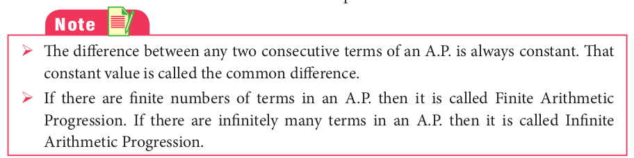
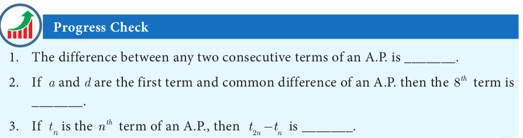
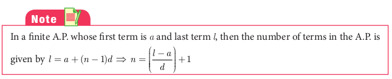
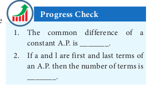
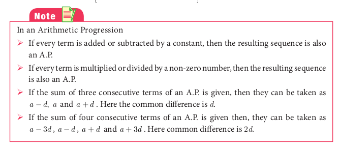
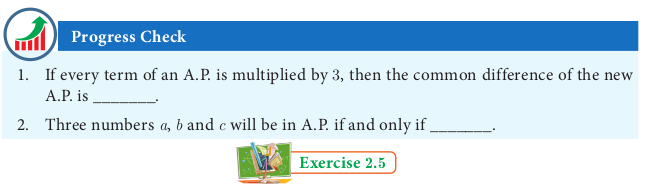

# Arithmetic Progression
Let us begin with the following two illustrations.

**Illustration 1** 

Make the following figures using match sticks 
(i). How many match sticks are required for each figure? 3, 5, 7 and 9. 
(ii). Can we find the difference between the successive numbers? 5 - 3=7-5=9-7=2 
Therefore, the difference between successive numbers is always 2.

**Illustration 2** 

A man got a job whose initial monthly salary is fixed at ₹10,000 with an annual increment of ₹2000. His salary during 1^{\text {st }}, 2^{\text {nd }} and 3^{\text {rd }} years will be ₹10000, ₹12000 and ₹14000 respectively.

If we now calculate the difference of the salaries for the successive years, we get 12000 - 10000 = 2000; 14000 - 12000 = 2000. Thus the difference between the successive numbers (salaries) is always 2000.

Did you observe the common property behind these two illustrations? In these two examples, the difference between successive terms always remains constant. Moreover, each term is obtained by adding a fixed number (2 and 2000 in illustrations 1 and 2 presented above) to the preceding term except the first term. This fixed number which is a constant for the differences between successive terms is called the “common difference”.

**Definition**

    Let a and d be real numbers. Then the numbers of the form a, a+d, a+2d, a+3d, a+4d, ... is said to form Arithmetic Progression denoted by A.P. The number ‘a’ is called the first term and ‘d’ is called the common difference.

Simply, an Arithmetic Progression is a sequence whose successive terms differ by a constant number. Thus, for example, the set of even positive integers 2, 4, 6, 8, 10, 12 … is an A.P. whose first term is a = 2 and common difference is also d = 2 since 4-2 =2, 6-4 = 2, 8 - 6 =2, …

Most of common real−life situations often produce numbers in A.P.

## Terms and Common Difference of an A.P

1. The terms of an A.P. can be written as


\begin{array}{ll}
t_{1}=a=a+(1-1) d, & t_{2}=a+d=a+(2-1) d, \\
t_{3}=a+2 d=a+(3-1) d, & t_{4}=a+3 d=a+(4-1) d, \ldots
\end{array}


In general, the n^{\text {th }} term denoted by t_{n} can be written as t_{n}=a+(n-1) d.

In an AP, n^{t h} term is, t_{n}=a+(n-1) d, here, $a$ is the first term, $d$ is the common difference.

2. In general to find the common difference of an A.P. we should subtract first term from the second term, second from the third and so on.

For example, t_{1}=a, t_{2}=a+d

\therefore t_{2}-t_{1}=(a+d)-a=d

Similarly, t_{2}=a+d, t_{3}=a+2 d, \ldots

\therefore t_{3}-t_{2}=(a+2 d)-(a+d)=d

In general, d=t_{2}-t_{1}=t_{3}-t_{2}=t_{4}-t_{3}=\ldots

d=t_{n}-t_{n-1} for n=2,3,4, \ldots

Let us try to find the common differences of the following A.P.’s 
(i). 1, 4, 7, 10,... 
d= 4-1 = 7-4 = 10 - 7 = ...3 
(ii). 6, 2, -2, -6, ... 
d= 2 -6 = -2 -2 = -6-(-2)= ...= -4 

**Example 2.23** Check whether the following sequences are in A.P. or not?
(i) x+2,2 x+3,3 x+4, \ldots
(ii) 2,4,8,16, \ldots.
(iii) 3 \sqrt{2}, 5 \sqrt{2}, 7 \sqrt{2}, 9 \sqrt{2}, \ldots

*Solution* To check that the given sequence is in A.P., it is enough to check if the differences between the consecutive terms are equal or not.

(i) t_{2}-t_{1}=(2 x+3)-(x+2)=x+1

t_{3}-t_{2}=(3 x+4)-(2 x+3)=x+1

t_{2}-t_{1}=t_{3}-t_{2}

Thus, the differences between consecutive terms are equal.

Hence the sequence x+2,2 x+3,3 x+4, \ldots is in A.P.

(ii) t_{2}-t_{1}=4-2=2

t_{3}-t_{2}=8-4=4

t_{2}-t_{1} \neq t_{3}-t_{2}

Thus, the differences between consecutive terms are not equal. Hence the terms of the sequence 2,4,8,16, \ldots are not in A.P.
(iii) t_{2}-t_{1}=5 \sqrt{2}-3 \sqrt{2}=2 \sqrt{2}


\begin{aligned}
& t_{3}-t_{2}=7 \sqrt{2}-5 \sqrt{2}=2 \sqrt{2} \\
& t_{4}-t_{3}=9 \sqrt{2}-7 \sqrt{2}=2 \sqrt{2}
\end{aligned}


Thus, the differences between consecutive terms are equal. Hence the terms of the sequence 3 \sqrt{2}, 5 \sqrt{2}, 7 \sqrt{2}, 9 \sqrt{2}, \ldots are in A.P.

**Example 2.24** Write an A.P. whose first term is 20 and common difference is 8 .

*Solution* First term =a=20; common difference =d=8

Arithmetic Progression is a, a+d, a+2 d, a+3 d, \ldots

In this case, we get 20,20+8,20+2(8), 20+3(8), \ldots

So, the required A.P. is 20,28,36,44, \ldots

**Example 2.25** Find the 15^{\text {th }}, 24^{\text {th }} and n^{\text {th }} term (general term) of an A.P. given by 3, 15, 27,39, \ldots

Solution We have, first term =a=3 and common difference =d=15-3=12.

We know that n^{\text {th }} term (general term) of an A.P. with first term a and common difference d is given by t_{n}=a+(n-1) d


\begin{gathered}
t_{15}=a+(15-1) d=a+14 d=3+14(12)=171 \\
\quad(\text { Here } a=3 \text { and } d=12) \\
t_{24}=a+(24-1) d=a+23 d=3+23(12)=279
\end{gathered}


The n^{\text {th }} (general term) term is given by t_{n}=a+(n-1) d

Thus,


\begin{aligned}
& t_{n}=3+(n-1) 12 \\
& t_{n}=12 n-9
\end{aligned}


**Example 2.26** Find the number of terms in the A.P. 3, 6, 9, 12,..., 111.

*Solution*

First term a=3; common difference

d=6-3=3; last term l=111

We know that, n=\left(\frac{l-a}{d}\right)+1


n=\left(\frac{111-3}{3}\right)+1=37


Thus the A.P. contain 37 terms.

**Example 2.27** Determine the general term of an A.P. whose 7^{\text {th }} term is -1 and 16^{\text {th }} term is 17.

*Solution* Let the A.P. be t_{1}, t_{2}, t_{3}, t_{4}, \ldots

It is given that t_{7}=-1 and t_{16}=17


\begin{array}{rlr}
a+(7-1) d & =-1 \text { and } a+(16-1) d=17 \\
a+6 d & =-1 \\
a+15 d & =17
\end{array}


Subtracting equation (1) from equation (2), we get 9 d=18 \Rightarrow d=2

Putting d=2 in equation (1), we get a+12=-1 \therefore a=-13

Hence, general term t_{n}=a+(n-1) d


=-13+(n-1) \times 2=2 n-15


**Example 2.28** If l^{\text {th }}, m^{\text {th }} and n^{\text {th }} terms of an A.P. are x, y, z respectively, then show that
(i) x(m-n)+y(n-l)+z(l-m)=0
(ii) (x-y) n+(y-z) l+(\mathrm{z}-x) m=0

*Solution* (i) Let a be the first term and $d$ be the common difference. It is given that


t_{l}=x, t_{m}=y, t_{n}=z


Using the general term formula


\begin{aligned}
a+(l-1) d & =x \\
a+(m-1) d & =y \\
a+(n-1) d & =z
\end{aligned}


We have, x(m-n)+y(n-l)+z(l-m) =a[(m-n)+(n-l)+(l-m)]+d[(m-n)(l-1)+(n-l)(m-1)+(l-m)(n-1)] =a[0]+d[\operatorname{lm}-\ln -m+n+m n-l m-n+l+l n-m n-l+m]   =a(0)+d(0)=0

(ii) On subtracting equation (2) from equation (1), equation (3) from equation (2) and equation (1) from equation (3), we get


\begin{gathered}
x-y=(l-m) d \\
y-z=(m-n) d \\
z-x=(n-l) d \\
(x-y) n+(y-z) l+(z-x) m=[(l-m) n+(m-n) l+(n-l) m] d \\
=[l n-m n+l m-n l+n m-l m] d=0
\end{gathered}


**Example 2.29** In an A.P., sum of four consecutive terms is 28 and the sum of their squares is 276 . Find the four numbers.

*Solution* Let us take the four terms in the form (a-3 d),(a-d),(a+d) and (a+3 d).

Since, sum of the four terms is 28 ,


\begin{aligned}
& a-3 d+a-d+a+d+a+3 d=28 \\
& 4 a=28 \Rightarrow a=7
\end{aligned}


Similarly, since sum of their squares is 276 ,


\begin{aligned}
& (a-3 d)^{2}+(a-d)^{2}+(a+d)^{2}+(a+3 d)^{2}=276 \\
& a^{2}-6 a d+9 d^{2}+a^{2}-2 a d+d^{2}+a^{2}+2 a d+d^{2}+a^{2}+6 a d+9 d^{2}=276 \\
& 4 a^{2}+20 d^{2}=276 \Rightarrow 4(7)^{2}+20 d^{2}=276 \\
& d^{2}=4 \Rightarrow d= \pm \sqrt{4} \text { then, } d= \pm 2
\end{aligned}


If d=2 then the four numbers are 7-3(2), 7-2,7+2,7+3(2)

That is the four numbers are 1,5,9 and 13.

If a=7, d=-2 then the four numbers are 13,9,5 and 1

Therefore, the four consecutive terms of the A.P. are 1, 5, 9 and 13.

**Condition for three numbers to be in A.P.**

If a, b, c are in A.P. then a=a, b=a+d, c=a+2 d


\text { so } \quad a+c=2 a+2 d=2(a+d)=2 b


Thus, 2b=a+c

Similarly, if 2 b=a+c, then b-a=c-b so a, b, c are in A.P.

Thus three non-zero numbers a, b, c are in A.P. if and only if 2b=a+c

**Example 2.30** A mother divides ₹207 into three parts such that the amount are in A.P. and gives it to her three children. The product of the two least amounts that the children had ₹ 4623 . Find the amount received by each child.

Solution Let the amount received by the three children be in the form of A.P. is given by a-d, a, a+d. Since, sum of the amount is ₹ 207 , we have


\begin{array}{r}
(a-d)+a+(a+d)=207 \\
3 a=207 \Rightarrow a=69
\end{array}


It is given that product of the two least amounts is 4623 .


\begin{aligned}
(a-d) a & =4623 \\
(69-d) 69 & =4623 \\
d & =2
\end{aligned}


Therefore, amount given by the mother to her three children are ₹ (69-2), ₹ 69 , ₹(69+2). That is, ₹ 67 , ₹ 69 and ₹ 71 .

1. Check whether the following sequences are in A.P.
(i) a-3, a-5, a-7, \ldots
(ii) \frac{1}{2}, \frac{1}{3}, \frac{1}{4}, \frac{1}{5}, \ldots 
(iii)  9,13,17,21,25, \ldots 
(iv)  \frac{-1}{3}, 0, \frac{1}{3}, \frac{2}{3}, \ldots 
(v)  1,-1,1,-1,1,-1, \ldots 
2. First term a and common difference d are given below. Find the corresponding A.P.
(i) a=5, d=6
(ii) a=7, d=-5
(iii)  a=\frac{3}{4}, d=\frac{1}{2} 
3. Find the first term and common difference of the Arithmetic Progressions whose  n^{\text {th }}  terms are given below
(i)  t_{n}=-3+2 n 
(ii)  t_{n}=4-7 n 
4. Find the  19^{\text {th }}  term of an A.P.  -11,-15,-19, \ldots 
5. Which term of an A.P.  16,11,6,1, \ldots  is -54 ?
6. Find the middle term(s) of an A.P. 9, 15, 21, 27,...,183.
7. If nine times ninth term is equal to the fifteen times fifteenth term, show that six times twenty fourth term is zero.
8. If  3+k, 18-k, 5 k+1  are in A.P. then find k.
9. Find x, y and z, given that the numbers x, 10, y, 24, z are in A.P.
10. In a theatre, there are 20 seats in the front row and 30 rows were allotted. Each successive row contains two additional seats than its front row. How many seats are there in the last row?
11. The sum of three consecutive terms that are in A.P. is 27 and their product is 288. Find the three terms.
12. The ratio of  6^{\text {th }}  and  8^{\text {th }}  term of an A.P. is 7:9. Find the ratio of  9^{\text {th }}  term to  13^{\text {th }}  term.
13. In a winter season let us take the temperature of Ooty from Monday to Friday to be in A.P. The sum of temperatures from Monday to Wednesday is  0^{\circ} \mathrm{C}  and the sum of the temperatures from Wednesday to Friday is  18^{\circ} \mathrm{C} . Find the temperature on each of the five days.
14. Priya earned ₹ 15,000 in the first month. Thereafter her salary increased by ₹ 1500 per year. Her expenses are ₹13,000 during the first month and the expenses increases by ₹ 900 per year. How long will it take for her to save ₹ 20,000 per month.

