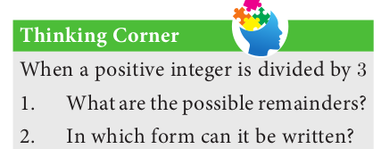

## 2.2 Euclid's Division Lemma

Euclid, one of the most important mathematicians wrote an important book named "Elements" in 13 volumes. The first six volumes were devoted to Geometry and for this reason, Euclid is called the "Father of Geometry". But in the next few volumes, he made fundamental contributions to understand the properties of numbers. One among them is the "Euclid's Divison Lemma". This is a simplified version of the long division process that you were performing for division of numbers in earlier classes.

Let us now discuss Euclid's Lemma and its application through an Algorithm termed as "Euclid's Division Algorithm".

&gt; **Lemma** is an auxiliary result used for proving an important theorem. It is usually considered as a mini theorem.

### Theorem 1: Euclid's Division Lemma

Let a 
and b 
be any two positive integers. Then, there exist unique integers q 
and r such that:
a = bq + r, \quad 0 \leq r &lt; b

The remainder is always less than the divisor. If r = 0 
then a 
is divisible by b.
Conversely, if b 
divides a 
then a = bq.

---

### Example 2.1

We have 34 cakes. Each box can hold 5 cakes only. How many boxes we need to pack and how many cakes are unpacked?

**Solution:** We see that 6 boxes are required to pack 30 cakes with 4 cakes left over. This distribution of cakes can be understood as follows:

| 34 | = | 5 | × | 6 | + | 4 |
|:---|:---|:---|:---|:---|:---|:---|
| Total number of cakes | | Number of cakes in each box | × | Number of boxes | + | Number of cakes leftover |
| ↓ | | ↓ | | ↓ | | ↓ |
| (Dividend) a 
| | (Divisor) b 
| × | (Quotient) q 
| + | (Remainder) r |

&gt; **Note**
&gt; - The above lemma is nothing but a restatement of the long division process, the integers q 
and r are called quotient and remainder respectively.
&gt; - When a positive integer is divided by 2 the remainder is either 0 or 1. So, any positive integer will be of the form 2k, 
2k+1 
for some integer k.

Euclid's Division Lemma can be generalised to any two integers.

### Generalised form of Euclid's division lemma

If a 
and b 
are any two integers then there exist unique integers q 
and r such that:
a = bq + r \quad \text{where} \quad 0 \leq r &lt; |b|

### Example 2.2

Find the quotient and remainder when a 
is divided by b in the following cases:
- (i) a = -12, 
b = 5
- (ii) a = 17, 
b = -3
- (iii) a = -19, 
b = -4

**Solutions:**

**(i)** a = -12, 
b = 5

By Euclid's division lemma a = bq + r, where 
0 \leq r &lt; |b|

-12 = 5 \times (-3) + 3, \quad 0 \leq r &lt; |5|

Therefore, Quotient q = -3, 
Remainder r = 3

**(ii)** a = 17, 
b = -3

By Euclid's division lemma a = bq + r, where 
0 \leq r &lt; |b|

17 = (-3) \times (-5) + 2, \quad 0 \leq r &lt; |-3|

Therefore Quotient q = -5, 
Remainder r = 2

**(iii)** a = -19, 
b = -4

By Euclid's division lemma a = bq + r, 
where 0 \leq r &lt; |b|

-19 = (-4) \times (5) + 1, \quad 0 \leq r &lt; |-4|

Therefore Quotient q = 5, 
Remainder r = 1

---

---

### Progress Check

Find q
and r
for the following pairs of integers a
and b 
satisfying a = bq + r.

1. a = 13, 
b = 3
2. a = 18, 
b = 4
3. a = 21, 
b = -4
4. a = -32, 
b = -12
5. a = -31, 
b = 7

---

### Example 2.3

Show that the square of an odd integer is of the form 4q + 1, 
for some integer q.

**Solution:** Let x be any odd integer. Since any odd integer is one more than an even integer, we have:
x = 2k + 1, \quad \text{for some integer } k

\begin{aligned}
x^2 &= (2k + 1)^2 \\
&= 4k^2 + 4k + 1 \\
&= 4k(k + 1) + 1 \\
&= 4q + 1, \quad \text{where } q = k(k+1) \text{ is some integer.}
\end{aligned}

---
