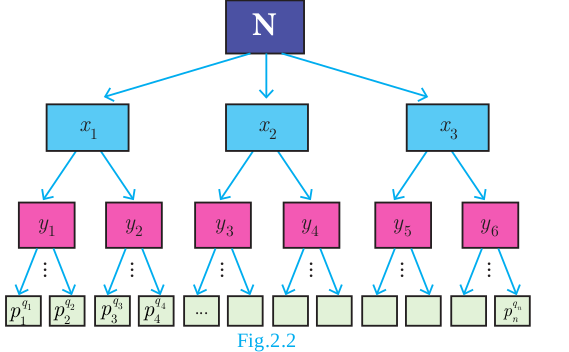

## 2.4 Fundamental Theorem of Arithmetic

Let us consider the following conversation between a Teacher and students.

**Teacher:** Factorise the number 240.
- **Malar:** 24 \times 10
- **Raghu:** 8 \times 30
- **Iniya:** 12 \times 20
- **Kumar:** 15 \times 16

**Malar:** Whose answer is correct Sir?
**Teacher:** All the answers are correct.
**Raghu:** How sir?
**Teacher:** Split each of the factors into product of prime numbers.
- **Malar:** 2 \times 2 \times 2 \times 3 \times 2 \times 5
- **Raghu:** 2 \times 2 \times 2 \times 2 \times 3 \times 5
- **Iniya:** 2 \times 2 \times 3 \times 2 \times 2 \times 5
- **Kumar:** 3 \times 5 \times 2 \times 2 \times 2 \times 2

**Teacher:** Good! Now, count the number of 2's, 3's and 5's.
- **Malar:** I got four 2's, one 3 and one 5.
- **Raghu:** I got four 2's, one 3 and one 5.
- **Iniya:** I also got the same numbers too.
- **Kumar:** Me too sir.

**Malar:** All of us got four 2's, one 3 and one 5. This is very surprising to us.
**Teacher:** Yes, It should be. Once any number is factorized up to a product of prime numbers, everyone should get the same collection of prime numbers.

This concept leads us to the following important theorem.

---

### Theorem 4 (Fundamental Theorem of Arithmetic) (without proof)

 "Every positive integer (except the number 1) can be represented in exactly one way apart from rearrangement as a product of one or more primes."

The fundamental theorem asserts that every composite number can be decomposed as a product of prime numbers and that the decomposition is unique. In the sense that there is one and only way to express the decomposition as product of primes.

In general, we conclude that given a composite number N, we decompose it uniquely in the form:

N = p_1^{q_1} \times p_2^{q_2} \times p_3^{q_3} \times \cdots \times p_n^{q_n}

where p_1, p_2, p_3, ..., p_n
 are primes and q_1, q_2, q_3, \ldots, q_n are natural numbers.

First, we try to factorize N into its factors. If all the factors are themselves primes then we can stop. Otherwise, we try to further split the factors which are not prime. Continue the process till we get only prime numbers.

 **Thinking Corner**
 Is 1 a prime number?

---

### Progress Check

1. Every natural number except ______ can be expressed as ______.
2. In how many ways a composite number can be written as product of power of primes?
3. The number of divisors of any prime number is ______.

---

### Illustration

For example, if we try to factorize 32760 we get:

32760 = 2 \times 2 \times 2 \times 3 \times 3 \times 5 \times 7 \times 13 = 2^3 \times 3^2 \times 5^1 \times 7^1 \times 13^1

Thus, in whatever way we try to factorize 32760, we should finally get three 2's, two 3's, one 5, one 7 and one 13.

The fact that "Every composite number can be written uniquely as the product of power of primes" is called **Fundamental Theorem of Arithmetic**.

---

### 2.4.1 Significance of the Fundamental Theorem of Arithmetic

The fundamental theorem about natural numbers except 1, that we have stated above has several applications, both in Mathematics and in other fields. The theorem is vastly important in Mathematics, since it highlights the fact that prime numbers are the 'Building Blocks' for all the positive integers. Thus, prime numbers can be compared to atoms making up a molecule.

---

 **KNOW?**
 1. If a prime number p 
divides ab
 then either p 
 divides a
  or p
   divides b
    that is p divides at least one of them.
 2. If a composite number n
 divides ab,
  then n 
  neither divide a 
  nor b.
   For example, 6 divides 4 \times 3 but 6 neither divide 4 nor 3.

---

### Example 2.7

In the given factorisation, find the numbers m 
and n.

**Solution:**

Value of the first box from bottom = 5 \times 2 = 10

n = 5 \times 10 = 50

Value of the second box from bottom = 3 \times 50 = 150

Value of m = 2 \times 150 = 300

Thus, the required numbers are m = 300,
 n = 50

---

### Example 2.8

Can the number 6^n,
 n being a natural number end with the digit 5? Give reason for your answer.

**Solution:** Since 6^n = (2 \times 3)^n = 2^n \times 3^n

6^n
 is always even for any natural number n.

But any number whose last digit is 5 is always odd.

Hence, 6^n **cannot** end with the digit 5.

---

### Example 2.9

Is 7 \times 5 \times 3 \times 2 + 3 a composite number? Justify your answer.

**Solution:** Yes, the given number is a composite number, because:

7 \times 5 \times 3 \times 2 + 3 = 3 \times (7 \times 5 \times 2 + 1) = 3 \times 71

Since the given number can be factorized in terms of two primes, it is a composite number.

---

### Progress Check

1. Let m
 divides n.
  Then GCD and LCM of m, n are ____ and ____.
2. The HCF of numbers of the form 2^m 
and 3^n is _____.

---

### Example 2.10

a
 and b 
 are two positive integers such that a^b \times b^a = 800.
  Find a 
  and b.

**Solution:** The number 800 can be factorized as:

800 = 2 \times 2 \times 2 \times 2 \times 2 \times 5 \times 5 = 2^5 \times 5^2

Hence, a^b \times b^a = 2^5 \times 5^2

This implies that a = 2
 and b = 5
  (or) a = 5
   and b = 2.

 **Thinking Corner**
 Can you think of positive integers a, b
 such that a^b = b^a?

---

### Activity 3

Can you find the 4-digit pin number 'pqrs' of an ATM card such that:

p^2 \times q^1 \times r^4 \times s^3 = 3,15,000

## Exercise 2.2

1. For what values of natural number n,
 4^n can end with the digit 6?

2. If m, n
 are natural numbers, for what values of m,
  does 2^{5n} \times 5^m ends in 5?

3. Find the HCF of 252525 and 363636.

4. If 13824 = 2^a \times 3^b 
then find a
 and b.

5. If p_1^{x_1} \times p_2^{x_2} \times p_3^{x_3} \times p_4^{x_4} = 113400
 where p_1, p_2, p_3, p_4
  are primes in ascending order and x_1, x_2, x_3, x_4 
  are integers, find the value of p_1, p_2, p_3, p_4
   and x_1, x_2, x_3, x_4.

6. Find the LCM and HCF of 408 and 170 by applying the fundamental theorem of arithmetic.

7. Find the greatest number consisting of 6 digits which is exactly divisible by 24, 15, 36?

8. What is the smallest number that when divided by three numbers such as 35, 56 and 91 leaves remainder 7 in each case?

9. Find the least number that is divisible by the first ten natural numbers.

---