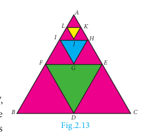
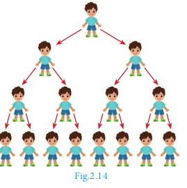

## 2.9 Geometric Progression

In the diagram given in Fig. 2.13, \triangle DEF
 is formed by joining the mid points of the sides AB, BC
  and CA
   of \triangle ABC. 
   Then the size of the triangle DEF 
   is exactly one-fourth of the size of \triangle ABC.
    Similarly \triangle GHI 
    is also one-fourth of \triangle DEF and so on. In general, the successive areas are one-fourth of the previous areas.

The area of these triangles are:
\triangle ABC, \frac{1}{4}\triangle ABC, \frac{1}{4} \times \frac{1}{4}\triangle ABC, \ldots

That is, \triangle ABC, \frac{1}{4}\triangle ABC, \frac{1}{16}\triangle ABC, \ldots

In this case, we see that beginning with \triangle ABC,
 we see that the successive triangles are formed whose areas are precisely one-fourth the area of the previous triangle. So, each term is obtained by multiplying \frac{1}{4} to the previous term.

As another case, let us consider that a viral disease is spreading in a way such that at any stage two new persons get affected from an affected person. At first stage, one person is affected, at second stage two persons are affected and is spreading to four persons and so on. Then, number of persons affected at each stage are:
1, 2, 4, 8, \ldots

Here each term is precisely twice the previous term.

From the above examples, it is clear that each term is got by multiplying a fixed number to the preceding number. This idea leads us to the concept of **Geometric Progression**.

### Definition

A **Geometric Progression** is a sequence in which each term is obtained by multiplying a fixed non-zero number to the preceding term except the first term. The fixed number is called **common ratio**. The common ratio is usually denoted by r.

### 2.9.1 General form of Geometric Progression

Let a
 and r \neq 0
  be real numbers. Then the numbers of the form a, ar, ar^2, ar^3, \ldots, ar^{n-1}, \ldots 
  is called a **Geometric Progression**. The number 'a'
   is called the **first term** and number 'r' is called the **common ratio**.

We note that beginning with first term a, 
each term is obtained by multiplied with the common ratio r 
to give ar, ar^2, ar^3, \ldots

### 2.9.2 General term of Geometric Progression

We try to find a formula for n^{\text{th}} term or general term of Geometric Progression (G.P.) whose terms are in the common ratio.

a, ar, ar^2, \ldots, ar^{n-1}, \ldots

where a
 is the first term and 'r'
  is the common ratio. Let t_n
   be the n^{\text{th}} term of the G.P.

Then:
\begin{aligned}
t_1 &= a = a \times r^0 = a \times r^{1-1} \\
t_2 &= t_1 \times r = a \times r = a \times r^{2-1} \\
t_3 &= t_2 \times r = ar \times r = ar^2 = ar^{3-1} \\
&\vdots \qquad \vdots \\
t_n &= t_{n-1} \times r = ar^{n-2} \times r = ar^{n-2+1} = ar^{n-1}
\end{aligned}

Thus, the general term or n^{\text{th}} term of a G.P. is:
\boxed{t_n = ar^{n-1}}

If we consider the ratio of successive terms of the G.P. then we have:
\frac{t_2}{t_1} = \frac{ar}{a} = r, \quad \frac{t_3}{t_2} = \frac{ar^2}{ar} = r, \quad \frac{t_4}{t_3} = \frac{ar^3}{ar^2} = r, \ldots

> **Note**
> Thus, the ratio between any two consecutive terms of the Geometric Progression is always constant and that constant is the common ratio of the given Progression.

**Progress Check**
1. A G.P. is obtained by multiplying _____ to the preceding term.
2. The ratio between any two consecutive terms of the G.P. is _____ and it is called _____.
3. Fill in the blanks if the following are in G.P.:
   - (i) \frac{1}{8}, \frac{3}{4}, \frac{9}{2}, \_\_\_\_\_
   - (ii) \sqrt{7}, \_\_\_\_\_, \_\_\_\_\_
   - (iii) \_\_\_\_\_, 2, 24, \ldots

**Example 2.40** Which of the following sequences form a Geometric Progression?
- (i) 7, 14, 21, 28, \ldots
- (ii) \frac{1}{2}, 1, 2, 4, \ldots
- (iii) 5, 25, 50, 75, \ldots

**Solution:** To check if a given sequence form a G.P. we have to see if the ratio between successive terms are equal.

**(i)** 7, 14, 21, 28, \ldots
\frac{t_2}{t_1} = \frac{14}{7} = 2; \quad \frac{t_3}{t_2} = \frac{21}{14} = \frac{3}{2}; \quad \frac{t_4}{t_3} = \frac{28}{21} = \frac{4}{3}

Since the ratios between successive terms are not equal, the sequence 7, 14, 21, 28, \ldots is not a Geometric Progression.

**(ii)** \frac{1}{2}, 1, 2, 4, \ldots

Here the ratios between successive terms are equal. Therefore the sequence \frac{1}{2}, 1, 2, 4, \ldots
 is a Geometric Progression with common ratio r = 2.

**(iii)** 5, 25, 50, 75, \ldots
\frac{t_2}{t_1} = \frac{25}{5} = 5; \quad \frac{t_3}{t_2} = \frac{50}{25} = 2; \quad \frac{t_4}{t_3} = \frac{75}{50} = \frac{3}{2}

Since the ratios between successive terms are not equal, the sequence 5, 25, 50, 75, \ldots is not a Geometric Progression.

> **Thinking Corner**
> Is the sequence 2, 2^2, 2^{2^2}, 2^{2^{2^2}}, \ldots a G.P.?

**Example 2.41** Find the geometric progression whose first term and common ratios are given by:
- (i) a = -7, r = 6
- (ii) a = 256, r = 0.5

**Solution:**

**(i)** The general form of Geometric progression is a, ar, ar^2, \ldots
a = -7, ar = -7 \times 6 = -42, \quad ar^2 = -7 \times 6^2 = -252

Therefore the required Geometric Progression is -7, -42, -252, \ldots

**(ii)** The general form of Geometric progression is a, ar, ar^2, \ldots
a = 256, ar = 256 \times 0.5 = 128, \quad ar^2 = 256 \times (0.5)^2 = 64

Therefore the required Geometric Progression is 256, 128, 64, \ldots

**Progress Check**
1. If first term = a,
 common ratio = r,
  then find the value of t_9
   and t_{27}
2. In a G.P. if t_1 = \frac{1}{5}
 and t_2 = \frac{1}{25} then the common ratio is ______.

**Example 2.42** Find the 8^{\text{th}}
 term of the G.P. 9, 3, 1, \ldots

**Solution:** To find the 8^{\text{th}}
 term we have to use the n^{\text{th}} 
 term formula t_n = ar^{n-1}

First term a = 9,
 Common ratio r = \frac{t_2}{t_1} = \frac{3}{9} = \frac{1}{3}.

t_8 = 9 \times \left(\frac{1}{3}\right)^{8-1} = 9 \times \left(\frac{1}{3}\right)^7 = \frac{1}{243}

Therefore the 8^{\text{th}} 
term of the G.P. is \frac{1}{243}.

**Example 2.43** In a Geometric progression, the 4^{\text{th}} 
term is \frac{8}{9}
 and the 7^{\text{th}}
  term is \frac{64}{243}. Find the Geometric Progression.

**Solution:** 4^{\text{th}}
 term, t_4 = \frac{8}{9} \implies ar^3 = \frac{8}{9} \quad \ldots(1)

7^{\text{th}} 
term, t_7 = \frac{64}{243} \implies ar^6 = \frac{64}{243} \quad \ldots(2)

Dividing (2) by (1) we get:
\frac{ar^6}{ar^3} = \frac{64/243}{8/9} \implies r^3 = \frac{8}{27} \implies r = \frac{2}{3}

Substituting the value of r in (1), we get:
a \times \left[\frac{2}{3}\right]^3 = \frac{8}{9} \implies a = 3

Therefore the Geometric Progression is a, ar, ar^2, \ldots 
That is, 3, 2, \frac{4}{3}, \ldots

> **Note**
> - When the product of three consecutive terms of a G.P. are given, we can take the three terms as \frac{a}{r}, a, ar.
> - When the products of four consecutive terms are given for a G.P. then we can take the four terms as \frac{a}{r^3}, \frac{a}{r}, ar, ar^3.
> - When each term of a Geometric Progression is multiplied or divided by a non–zero constant then the resulting sequence is also a Geometric Progression.

**Example 2.44** The product of three consecutive terms of a Geometric Progression is 343 and their sum is \frac{91}{3}. Find the three terms.

**Solution:** Since the product of 3 consecutive terms is given, we can take them as \frac{a}{r}, a, ar.

Product of the terms = 343:
\frac{a}{r} \times a \times ar = 343 \implies a^3 = 7^3 \implies a = 7

Sum of the terms = \frac{91}{3}:
\frac{a}{r} + a + ar = \frac{91}{3} \implies 7\left(\frac{1}{r} + 1 + r\right) = \frac{91}{3}
\frac{1 + r + r^2}{r} = \frac{13}{3} \implies 3r^2 - 10r + 3 = 0
(3r - 1)(r - 3) = 0 \implies r = 3 \quad \text{or} \quad r = \frac{1}{3}

If a = 7, r = 3
 then the three terms are \frac{7}{3}, 7, 21.

If a = 7, r = \frac{1}{3} 
then the three terms are 21, 7, \frac{7}{3}.

**Progress Check**
Three non-zero numbers a, b, c are in G.P. if and only if _____.

### Condition for three numbers to be in G.P.

If a, b, c 
are in G.P. then b = ar, 
c = ar^2. So:
ac = a \times ar^2 = (ar)^2 = b^2

Thus, b^2 = ac

Similarly, if b^2 = ac, 
then \frac{b}{a} = \frac{c}{b}.
 So a, b, c are in G.P.

Thus three non-zero numbers a, b, c 
are in G.P. if and only if \boxed{b^2 = ac}

**Example 2.45** The present value of a machine is ₹40,000 and its value depreciates each year by 10%. Find the estimated value of the machine in the 6th year.

**Solution:** The value of the machine at present is ₹40,000. Since it is depreciated at the rate of 10% after one year the value of the machine is 90% of the initial value.

That is the value of the machine at the end of the first year is 40000 \times \frac{90}{100},

After two years, the value of the machine is 90% of the value in the first year.

Value of the machine at the end of the 2^{\text{nd}}
 year is 40,000 \times \left(\frac{90}{100}\right)^2,

Continuing this way, the value of the machine depreciates in the following way as:
40000, 40000 \times \frac{90}{100}, 40000 \times \left(\frac{90}{100}\right)^2, \ldots

This sequence is in the form of G.P. with first term 40,000 and common ratio \frac{90}{100}.

For finding the value of the machine at the end of 5^{\text{th}} year (i.e. in 6th year), we need to find the sixth term of this G.P.

Thus, n = 6, a = 40,000, r = \frac{90}{100}.

Using t_n = ar^{n-1}:
t_6 = 40000 \times \left(\frac{90}{100}\right)^5 = 40000 \times \frac{9}{10} \times \frac{9}{10} \times \frac{9}{10} \times \frac{9}{10} \times \frac{9}{10} = 23619.60

Therefore the value of the machine in 6th year = ₹23619.60

---

## Exercise 2.7

1. Which of the following sequences are in G.P.?
   - (i) 3, 9, 27, 81, \ldots
   - (ii) 4, 44, 444, 4444, \ldots
   - (iii) 0.5, 0.05, 0.005, \ldots
   - (iv) \frac{1}{3}, \frac{1}{6}, \frac{1}{12}, \ldots
   - (v) 1, -5, 25, -125, \ldots
   - (vi) 120, 60, 30, 18, \ldots
   - (vii) 16, 4, 1, \frac{1}{4}, \ldots

2. Write the first three terms of the G.P. whose first term and the common ratio are given below.
   - (i) a = 6, r = 3
   - (ii) a = \sqrt{2}, r = \sqrt{2}
   - (iii) a = 1000, r = \frac{2}{5}

3. In a G.P. 729, 243, 81, \cdots
 find t_7

4. Find x so that  x + 6, x + 12
 and x + 15 are consecutive terms of a Geometric Progression.

5. Find the number of terms in the following G.P.
   - (i) 4, 8, 16, \ldots, 8192?
   - (ii) \frac{1}{3}, \frac{1}{9}, \frac{1}{27}, \ldots, \frac{1}{2187}

6. In a G.P. the 9^{\text{th}} 
term is 32805 and 6^{\text{th}}
 term is 1215. Find the 12^{\text{th}} term.

7. Find the 10^{\text{th}} 
term of a G.P. whose 8^{\text{th}} term is 768 and the common ratio is 2.

8. If a, b, c 
are in A.P. then show that 3^a, 3^b, 3^c are in G.P.

9. In a G.P. the product of three consecutive terms is 27 and the sum of the product of two terms taken at a time is \frac{57}{2}. Find the three terms.

10. A man joined a company as Assistant Manager. The company gave him a starting salary of ₹60,000 and agreed to increase his salary 5% annually. What will be his salary after 5 years?

11. Sivamani is attending an interview for a job and the company gave two offers to him.
    - Offer A: ₹20,000 to start with followed by a guaranteed annual increase of 6% for the first 5 years.
    - Offer B: ₹22,000 to start with followed by a guaranteed annual increase of 3% for the first 5 years.
    
    What is his salary in the 4^{\text{th}} year with respect to the offers A and B?

12. If a, b, c
 are three consecutive terms of an A.P. and x, y, z 
 are three consecutive terms of a G.P. then prove that x^{b-c} \times y^{c-a} \times z^{a-b} = 1.

---