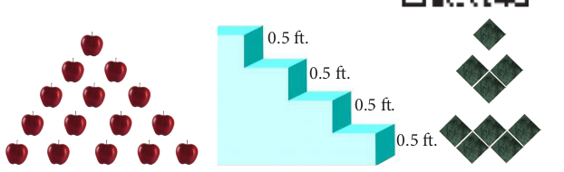
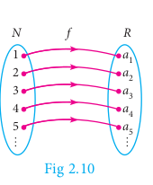
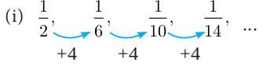
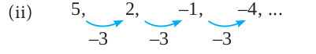
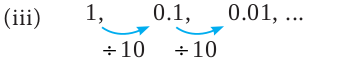
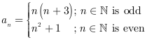

## 2.6 Sequences

Consider the following pictures.

There is some pattern or arrangement in these pictures. In the first picture, the first row contains one apple, the second row contains two apples and in the third row there are three apples etc... The number of apples in each of the rows are 1, 2, 3, \ldots.

In the second picture each step have 0.5 feet height. The total height of the steps from the base are 0.5 
feet, 1
 feet, 1.5 feet, ... In the third picture one square, 3 squares, 5 squares, ... These numbers belong to category called **"Sequences"**.

### Definition

A real valued sequence is a function defined on the set of natural numbers and taking real values.

Each element in the sequence is called a **term** of the sequence. The element in the first position is called the **first term** of the sequence. The element in the second position is called **second term** of the sequence and so on.

If the n^{\text{th}} 
term is denoted by a_n,
 then a_1 
 is the first term, a_2 is the second term, and so on.

A sequence can be written as a_1, a_2, a_3, \ldots, a_n, \ldots

### Illustration

1. 1, 3, 5, 7, \ldots 
is a sequence with general term a_n = 2n - 1.
 When we put n = 1, 2, 3, \ldots,
  we get a_1 = 1, a_2 = 3, a_3 = 5, a_4 = 7, \ldots

2. \frac{1}{2}, \frac{1}{3}, \frac{1}{4}, \frac{1}{5}, \ldots
 is a sequence with general term \frac{1}{n+1}.
  When we put n = 1, 2, 3, \ldots,
   we get a_1 = \frac{1}{2}, a_2 = \frac{1}{3}, a_3 = \frac{1}{4}, a_4 = \frac{1}{5}, \ldots

If the number of elements in a sequence is finite then it is called a **Finite sequence**. If the number of elements in a sequence is infinite then it is called an **Infinite sequence**.

### Sequence as a Function

A sequence can be considered as a function defined on the set of natural numbers \mathbb{N}.
 In particular, a sequence is a function f: \mathbb{N} \to \mathbb{R}
  where \mathbb{R} is the set of all real numbers.
  

If the sequence is of the form a_1, a_2, a_3, \ldots
 by then we can associate the function to the sequence a_1, a_2, a_3, \ldots
  by f(k) = a_k,
   k = 1, 2, 3, \ldots

> **Note**
> Though all the sequences are functions, not all the functions are sequences.

**Progress Check**
1. Fill in the blanks for the following sequences:
   - (i) 7, 13, 19, \_\_\_\_\_, \ldots
   - (ii) 2, \_\_\_\_\_, 10, 17, 26, \ldots
   - (iii) 1000, 100, 10, 1, \_\_\_\_\_, \ldots

2. A sequence is a function defined on the set of _____.

3. The n^{\text{th}}
 term of the sequence \frac{1}{2}, \frac{2}{3}, \frac{3}{4}, \ldots can be expressed as _____.

4. Say True or False:
   - (i) All sequences are functions
   - (ii) All functions are sequences.

**Example 2.19** Find the next three terms of the sequences:
- (i) \frac{1}{12}, \frac{1}{6}, \frac{1}{10}, \frac{1}{14}, \ldots
- (ii) 5, 2, -1, -4, \ldots
- (iii) 1, 0.1, 0.01, \ldots

**Solution:**

In the above sequence the numerators are same and the denominator is increased by 4.

So the next three terms are:
\begin{aligned}
a_5 &= \frac{1}{14 + 4} = \frac{1}{18} \\
a_6 &= \frac{1}{18 + 4} = \frac{1}{22} \\
a_7 &= \frac{1}{22 + 4} = \frac{1}{26}
\end{aligned}

Here each term is decreased by 3. So the next three terms are -7, -10, -13.

Here each term is divided by 10. Hence, the next three terms are:
\begin{aligned}
a_4 &= \frac{0.01}{10} = 0.001 \\
a_5 &= \frac{0.001}{10} = 0.0001 \\
a_6 &= \frac{0.0001}{10} = 0.00001
\end{aligned}

**Example 2.20** Find the general term for the following sequences:
- (i) 3, 6, 9, \ldots
- (ii) \frac{1}{2}, \frac{2}{3}, \frac{3}{4}, \ldots
- (iii) 5, -25, 125, \ldots

**Solution:**

**(i)** 3, 6, 9, \ldots

Here the terms are multiples of 3. So the general term is a_n = 3n, 
n \in \mathbb{N}

**(ii)** \frac{1}{2}, \frac{2}{3}, \frac{3}{4}, \ldots

We see that the numerator of n^{\text{th}}
 term is n, and the denominator is one more than the numerator. Hence:
a_n = \frac{n}{n+1}, \quad n \in \mathbb{N}

**(iii)** 5, -25, 125, \ldots

The terms of the sequence have + 
and - sign alternatively and also they are in powers of 5.

So the general term:
a_n = (-1)^{n+1} 5^n, \quad n \in \mathbb{N}

**Example 2.21** The general term of a sequence is defined as:

Find the eleventh and eighteenth terms.

**Solution:** To find a_{11},
 since 11 is odd, we put n = 11 
 in a_n = \frac{n(n+3)}{2}:
a_{11} = \frac{11 \times 14}{2} = 77

To find a_{18}, 
since 18 is even, we put n = 18 
in a_n = \frac{n^2+1}{2}:
a_{18} = \frac{18^2 + 1}{2} = \frac{325}{2} = 162.5

**Example 2.22** Find the first five terms of the following sequence.
a_1 = 1, a_2 = 1, a_n = \frac{a_{n-1}}{a_{n-2} + 3}, \quad n \geq 3, n \in \mathbb{N}

**Solution:** The first two terms of this sequence are given by a_1 = 1, a_2 = 1.
 The third term a_3 depends on the first and second terms.

a_3 = \frac{a_{3-1}}{a_{3-2} + 3} = \frac{a_2}{a_1 + 3} = \frac{1}{1 + 3} = \frac{1}{4}

Similarly the fourth term a_4 
depends upon a_3 
and a_2:
a_4 = \frac{a_{4-1}}{a_{4-2} + 3} = \frac{a_3}{a_2 + 3} = \frac{\frac{1}{4}}{1 + 3} = \frac{\frac{1}{4}}{4} = \frac{1}{4} \times \frac{1}{4} = \frac{1}{16}

In the same way, the fifth term a_5 can be calculated as:
a_5 = \frac{a_{5-1}}{a_{5-2} + 3} = \frac{a_4}{a_3 + 3} = \frac{\frac{1}{16}}{\frac{1}{4} + 3} = \frac{1}{16} \times \frac{4}{13} = \frac{1}{52}

Therefore, the first five terms of the sequence are 1, 1, \frac{1}{4}, \frac{1}{16}, \frac{1}{52}.

---

1. Find the next three terms of the following sequence.
   - (i) 8, 24, 72, \ldots
   - (ii) 5, 1, -3, \ldots
   - (iii) \frac{1}{4}, \frac{2}{9}, \frac{3}{16}, \ldots

2. Find the first four terms of the sequences whose n^{\text{th}} terms are given by:
   - (i) a_n = n^3 - 2
   - (ii) a_n = (-1)^{n+1} n(n+1)
   - (iii) a_n = \frac{n^2 - 6}{2}

3. Find the n^{\text{th}} term of the following sequences:
   - (i) 2, 5, 10, 17, \ldots
   - (ii) 0, \frac{1}{2}, \frac{2}{3}, \ldots
   - (iii) 3, 8, 13, 18, \ldots

4. Find the indicated terms of the sequences whose n^{\text{th}} terms are given by:
   - (i) a_n = \frac{5n}{n+2};
    a_6
     and a_{13}
   - (ii) a_n = -(n^2 - 4);
    a_4,
     a_{11}
      and a_{20}

5. Find a_8
 and a_{15}
  whose n^{\text{th}} term is:
a_n = \begin{cases} \frac{n^2 - 1}{n+3} & ; \quad n \text{ is even}, \quad n \in \mathbb{N} \\ \frac{n^2}{2n+1} & ; \quad n \text{ is odd}, \quad n \in \mathbb{N} \end{cases}

6. If a_1 = 1, a_2 = 1 
and a_n = a_{n-1} + a_{n-2}, \quad n \geq 3, n \in \mathbb{N}, then find the first six terms of the sequence.

---

