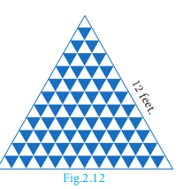

# Series

The sum of the terms of a sequence is called series. Let a_{1}, a_{2}, a_{3} \ldots, a_{n}, \ldots be the sequence of real numbers. Then the real number a_{1}+a_{2}+a_{3}+\cdots is defined as the series of real numbers.

If a series has finite number of terms then it is called a Finite series. If a series has infinite number of terms then it is called an Infinite series. Let us focus our attention only on studying finite series.

## Sum to n terms of an A.P

A series whose terms are in Arithmetic progression is called Arithmetic series.

Let a, a+d, a+2 d, a+3 d, \ldots be the Arithmetic Progression.

The sum of first $n$ terms of a Arithmetic Progression denoted by S_{n} is given by,


S_{n}=a+(a+d)+(a+2 d)+\cdots+(a+(n-1) d)


Rewriting the above in reverse order


S_{n}=(a+(n-1) d)+(a+(n-2) d)+\cdots+(a+d)+a


Adding (1) and (2) we get,


\begin{aligned}
& 2 S_{n}=[a+a+(n-1) d]+[a+d+a+(n-2) d]+\cdots+[a+(n-2) d+(a+d)]+[a+(n-1) d+a] \\
& \quad=[2 a+(n-1) d]+[2 a+(n-1) d]+\cdots+[2 a+(n-1) d] \quad(n \text { terms }) \\
& 2 S_{n}=n \times[2 a+(n-1) d] \quad \Rightarrow S_{n}=\frac{n}{2}[2 a+(n-1) d] 
\end{aligned}


**Example 2.31** Find the sum of first 15 terms of the A. P. 8,7 \frac{1}{4}, 6 \frac{1}{2}, 5 \frac{3}{4}, \ldots

*Solution* Here the first term a=8, common difference d=7 \frac{1}{4}-8=-\frac{3}{4},


\begin{aligned}
\text { Sum of first } n \text { terms of an A.P. } S_{n} & =\frac{n}{2}[2 a+(n-1) d] \\
S_{15} & =\frac{15}{2}\left[2 \times 8+(15-1)\left(-\frac{3}{4}\right)\right] \\
S_{15} & =\frac{15}{2}\left[16-\frac{21}{2}\right]=\frac{165}{4}
\end{aligned}


**Example 2.32** Find the sum of 0.40+0.43+0.46+\cdots+1.

*Solution* Here the value of n is not given. But the last term is given. From this, we can find the value of n.

Given,a=0.40 and l=1, we find d=0.43-0.40=0.03.


\text { Therefore, } \begin{aligned}
n & =\left(\frac{l-a}{d}\right)+1 \\
& =\left(\frac{1-0.40}{0.03}\right)+1=21
\end{aligned}


Sum of first $n$ terms of an A.P. S_{n}=\frac{n}{2}[a+l]

, n=21 . \quad Therefore, \quad S_{21}=\frac{21}{2}[0.40+1]=14.7

So, the sum of 21 terms of the given series is 14.7.

**Example 2.33** How many terms of the series 1+5+9+\ldots must be taken so that their sum is 190 ?

*Solution* Here we have to find the value of n, such that S_{n}=190.

First term a=1, common difference d=5-1=4.

Sum of first n terms of an A.P.


\begin{aligned}
S_{n}=\frac{n}{2}[2 a+(n-1) d] & =190 \\
\frac{n}{2}[2 \times 1+(n-1) \times 4] & =190 \\
n[4 n-2] & =380 \\
2 n^{2}-n-190 & =0 \\
(n-10)(2 n+19) & =0
\end{aligned}


But, n=10 as n=-\frac{19}{2} is impossible. Therefore, n=10

**Example 2.34** The 13^{\text {th }} term of an A.P. is 3 and the sum of first 13 terms is 234 . Find the common difference and the sum of first 21 terms.

*Solution* Given, the 13^{\text {th }} term =3 so, t_{13}=a+12 d=3

Sum of first 13 terms =234 \quad \Rightarrow S_{13}=\frac{13}{2}[2 a+12 d]=234


2 a+12 d=36


Solving (1) and (2) we get, a=33, d=\frac{-5}{2}

Therefore, common difference is \frac{-5}{2}.

Sum of first 21 terms S_{21}=\frac{21}{2}\left[2 \times 33+(21-1) \times\left(-\frac{5}{2}\right)\right]=\frac{21}{2}[66-50]=168.

**Example 2.35** In an A.P. the sum of first n terms is \frac{5 n^{2}}{2}+\frac{3 n}{2}. Find the 17^{\text {th }} term.

*Solution* The 17^{\text {th }} term can be obtained by subtracting the sum of first 16 terms from the sum of first 17 terms

Now,


\begin{aligned}
& S_{17}=\frac{5 \times(17)^{2}}{2}+\frac{3 \times 17}{2}=\frac{1445}{2}+\frac{51}{2}=748 \\
& S_{16}=\frac{5 \times(16)^{2}}{2}+\frac{3 \times 16}{2}=\frac{1280}{2}+\frac{48}{2}=664
\end{aligned}



t_{17}=S_{17}-S_{16}=748-664=84


**Example 2.36** Find the sum of all natural numbers between 300 and 600 which are divisible by 7 .

*Solution* The natural numbers between 300 and 600 which are divisible by 7 are 301, 308, 315, \ldots, 595.

The sum of all natural numbers between 300 and 600 is 301+308+315+\cdots+595.

The terms of the above series are in A.P.

First term a=301; common difference d=7; Last term l=595.


\begin{aligned}
n & =\left(\frac{l-a}{d}\right)+1=\left(\frac{595-301}{7}\right)+1=43 \\
\because S_{n} & =\frac{n}{2}[a+l], \text { we have } S_{43}=\frac{43}{2}[301+595]=19264 .
\end{aligned}


**Example 2.37** A mosaic is designed in the shape of an equilateral triangle, 12 \mathrm{ft} on each side. Each tile in the mosaic is in the shape of an equilateral triangle of 12 inch side. The tiles are alternate in colour as shown in the figure. Find the number of tiles of each colour and total number of tiles in the mosaic.

*Solution* Since the mosaic is in the shape of an equilateral triangle of 12 feet, and the tile is in the shape of an equilateral triangle of 12 inch ( 1 feet), there will be 12 rows in the mosaic.

From the figure, it is clear that number of white tiles in each row are 1, 2, 3, 4, ... 12 which clearly forms an Arithmetic Progression.

Similarly the number of blue tiles in each row are 0,1,2,3, \ldots, 11 which is also an Arithmetic Progression.

Number of white tiles =1+2+3+\cdots+12=\frac{12}{2}[1+12]=78

Number of blue tiles =0+1+2+3+\cdots+11=\frac{12}{2}[0+11]=66

The total number of tiles in the mosaic =78+66=144

**Example 2.38** The houses of a street are numbered from 1 to 49. Senthil's house is numbered such that the sum of numbers of the houses prior to Senthil's house is equal to the sum of numbers of the houses following Senthil's house. Find Senthil's house number?

*Solution* Let Senthil's house number be x.

It is given that 1+2+3+\cdots+(x-1)=(x+1)+(x+2)+\cdots+49


\begin{aligned}
1+2+3+\cdots+(x-1) & =[1+2+3+\cdots+49]-[1+2+3+\cdots+x] \\
\frac{x-1}{2}[1+(x-1)] & =\frac{49}{2}[1+49]-\frac{x}{2}[1+x] \\
\frac{x(x-1)}{2} & =\frac{49 \times 50}{2}-\frac{x(x+1)}{2} \\
x^{2}-x & =2450-x^{2}-x \Rightarrow 2 x^{2}=2450 \\
x^{2} & =1225 \Rightarrow x=35
\end{aligned}


Therefore, Senthil's house number is 35 .

**Example 2.39** The sum of first n, 2n and 3n terms of an A.P. are S_{1}, S_{2} and S_{3} respectively. Prove that S_{3}=3\left(S_{2}-S_{1}\right).

*Solution* If S_{1}, S_{2} and S_{3} are sum of first n, 2n and 3n terms of an A.P. respectively then


S_{1}=\frac{n}{2}[2 a+(n-1) d], \quad S_{2}=\frac{2 n}{2}[2 a+(2 n-1) d], S_{3}=\frac{3 n}{2}[2 a+(3 n-1) d]


Consider,


\begin{aligned}
S_{2}-S_{1} & =\frac{2 n}{2}[2 a+(2 n-1) d]-\frac{n}{2}[2 a+(n-1) d] \\
& =\frac{n}{2}[[4 a+2(2 n-1) d]-[2 a+(n-1) d]] \\
S_{2}-S_{1} & =\frac{n}{2} \times[2 a+(3 n-1) d] \\
& 3\left(S_{2}-S_{1}\right)=\frac{3 n}{2}[2 a+(3 n-1) d] \\
& 3\left(S_{2}-S_{1}\right)=S_{3}
\end{aligned}


1. Find the sum of the following
(i) 3,7,11, \ldots up to 40 terms.
(ii) 102,97,92, \ldots up to 27 terms.
(iii) 6+13+20+\cdots+97
2. How many consecutive odd integers beginning with 5 will sum to 480 ?
3. Find the sum of first 28 terms of an A.P. whose n^{\text {th }} term is 4n-3.
4. The sum of first $n$ terms of a certain series is given as 2 n^{2}-3 n. Show that the series is an A.P.
5. The 104^{\text {th }} term and 4^{\text {th }} term of an A.P. are 125 and 0 . Find the sum of first 35 terms.
6. Find the sum of all odd positive integers less than 450 .
7. Find the sum of all natural numbers between 602 and 902 which are not divisible by 4 .
8. Raghu wish to buy a laptop. He can buy it by paying ₹ 40,000 cash or by giving it in 10 installments as ₹ 4800 in the first month, ₹ 4750 in the second month, ₹ 4700 in the third month and so on. If he pays the money in this fashion, find

(i) total amount paid in 10 installments.

(ii) how much extra amount that he has to pay than the cost?

9. A man repays a loan of ₹ 65,000 by paying ₹ 400 in the first month and then increasing the payment by ₹ 300 every month. How long will it take for him to clear the loan?
10. A brick staircase has a total of 30 steps. The bottom step requires 100 bricks. Each successive step requires two bricks less than the previous step.

(i) How many bricks are required for the top most step?

(ii) How many bricks are required to build the stair case?

11. If S_{1}, S_{2}, S_{3}, \ldots, S_{m} are the sums of n terms of m A.P.'s whose first terms are 1,2,3, \ldots, m and whose common differences are 1,3,5, \ldots,(2 m-1) respectively, then show that S_{1}+S_{2}+S_{3}+\cdots+S_{m}=\frac{1}{2} m n(m n+1).
12. Find the sum \left[\frac{a-b}{a+b}+\frac{3 a-2 b}{a+b}+\frac{5 a-3 b}{a+b}+\cdots\right. to 12terms].

