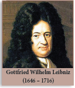

# UNIT 1:RELATIONS AND FUNCTIONS

> "Mathematicians do not study objects, but relations between objects ... Content to them is irrelevant: they are interested in form only" – Henri Poincare

---

## Historical Note

**Gottfried Wilhelm Leibniz** (1646–1716) was a prominent German mathematician, philosopher, physicist and inventor. He wrote extensively on 26 topics covering wide range of subjects among which were Geology, Medicine, Biology, Epidemiology, Paleontology, Psychology, Engineering, Philology, Sociology, Ethics, History, Politics, Law and Music Theory. In a manuscript Leibniz used the word "function" to mean any quantity varying from point to point of a curve. Leibniz provided the foundations of Formal Logic and Boolean Algebra, which are fundamental for modern day computers. For all his remarkable discoveries and contributions in various fields, Leibniz is hailed as "The Father of Applied Mathematics".

**Pierre de Fermat** (1601–1665)

---

## Learning Outcomes

- To define and determine cartesian product of sets.
- To define a relation as a subset of cartesian product of sets.
- To understand function as a special relation.
- To represent a function through an arrow diagram, a set of ordered pairs, a table, a rule or a graph.
- To classify functions as one-one, many-one, onto, into and bijection.
- To study combination of functions through composition operation.
- To understand the graphs of linear, quadratic, cubic and reciprocal functions.

---

## 1.1 Introduction

The notion of sets provides the stimulus for learning higher concepts in mathematics. A set is a collection of well-defined objects. This means that a set is merely a collection of something which we may recognize. In this chapter, we try to extend the concept of sets in two forms called **Relations** and **Functions**. For doing this, we need to first know about cartesian products that can be defined between two non-empty sets.

It is quite interesting to note that most of the day-to-day situations can be represented mathematically either through a relation or a function. For example:
- The distance travelled by a vehicle in given time can be represented as a function.
- The price of a commodity can be expressed as a function in terms of its demand.
- The area of polygons and volume of common objects like circle, right circular cone, right circular cylinder, sphere can be expressed as a function with one or more variables.

In class IX, we had studied the concept of sets. We have also seen how to form new sets from the given sets by taking union, intersection and complementation. Now we are about to study a new set called **"cartesian product"** for the given sets A and B.
---
