# Chapter 1

## RELATIONS AND FUNCTIONS

"Mathematicians do not study objects, but relations between objects...Content to them is irrelevant: they are interested in form only" - Henri Poincare

Gottfried Wilhelm Leibniz (also known as von Leibniz) was a prominent German mathematician, philosopher, physicist and inventor. He wrote extensively on 26 topics covering wide range of subjects among which were Geology, Medicine, Biology, Epidemiology, Paleontology, Psychology, Engineering, Philology, Sociology, Ethics, History, Politics, Law and Music Theory.

In a manuscript Leibniz used the word "function" to mean any quantity varying from point to point of a curve. Leibniz provided the foundations of Formal Logic and Boolean Algebra, which are fundamental for modern day computers. For all his remarkable discoveries and contributions in various fields, Leibniz is hailed as "The Father of Applied Sciences".

Gottfried Wilhelm Leibniz (1646-1716)

---

## Learning Outcomes

To define and determine cartesian product of sets. To define a relation as a subset of cartesian product of sets. To understand function as a special relation. To represent a function through an arrow diagram, a set of ordered pairs, a table, a rule or a graph. To classify functions as one-one, many-one, onto, into and bijection. To study combination of functions through composition operation. To understand the graphs of linear, quadratic, cubic and reciprocal functions.

---

### 1.1 Introduction

The notion of sets provides the stimulus for learning higher concepts in mathematics. A set is a collection of well-defined objects. This means that a set is merely a collection of something which we may recognize. In this chapter, we try to extend the concept of sets in two forms called Relations and Functions. For doing this, we need to first know about cartesian products that can be defined between two non-empty sets.

It is quite interesting to note that most of the day-to-day situations can be represented mathematically either through a relation or a function. For example, the distance travelled by a vehicle in given time can be represented as a function. The price of a commodity can be expressed as a function in terms of its demand. The area of polygons and volume

Relations and Functions of common objects like circle, right circular cone, right circular cylinder, sphere can be expressed as a function with one or more variables.

In class IX, we had studied the concept of sets. We have also seen how to form new sets from the given sets by taking union, intersection and complementation.

Now we are about to study a new set called "cartesian product" for the given sets A and B .

### 1.2 Ordered Pair

Observe the seating plan in an auditorium (Fig.1.1). To help orderly occupation of seats, tokens with numbers such as (1 , 5), (7 , 16), (3 , 4), (10 , 12) etc. are issued. The person who gets (4 , 10) will go to row 4 and occupy the 10 th seat. Thus the first number denotes the row and the second number, the seat. Which seat will the visitor with token (5 , 9) occupy? Can he go to 9 th row and take the 5th seat? Do (9 , 5) and (5 , 9) refer to the same location? No,

certainly! What can you say about the tokens (2 , 3), (6 , 3) and (10 , 3)?

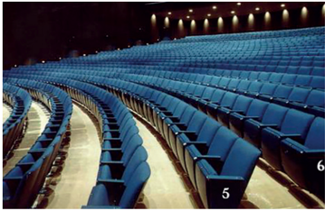

This is one example where a pair of numbers, written in a particular order, precisely indicates a location. Such a number pair is called an ordered pair of numbers. This notion is skillfully used to mathematize the concept of a "Relation".

### 1.3 Cartesian Product

**Illustration 1**

Let us consider the following two sets.

A is the set of 3 vegetables and B is the set of 4 fruits. That is,

A = {carrot, brinjal, ladies finger} and B = {apple, orange, grapes, strawberry}

What are the possible ways of choosing a vegetable with a fruit? (Fig.1.2)

|  |  | \n |
| --- | --- | \n |
| Vegetables (A) | Fruits (B) | \n |
| Carrot (c) | Apple (a) | \n |
| Brinjal (b) | Orange (o) | \n |
| Ladies finger (l) | Grapes (g) | \n |
|  | Strawberry (s) |  |

We can select them in 12 distinct pairs as given below.

(c , a ), (c , o ), (c , g), (c , s ), (b , a ), (b , o ), (b , g), (b , s ), (l, l, a ), (l, l, o ), (l, l, g), (l, l, s )

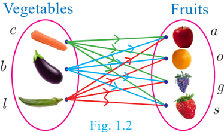

This collection represents the cartesian product of the set of vegetables and set of fruits.

**Definition**

If A and B are two non-empty sets, then the set of all ordered pairs (a , b) such that aAÎ , bB Î is called the Cartesian Product of A and B, and is denoted by AB ´ .

Thus, AB ´ =∈ {(ab,)|, aA bB ∈ } (read as A cross B). Also note that A × f =f

10th Standard Mathematics

**Note**

- ¾ A × B is the set of all possible ordered pairs between the elements of A and B such that the first coordinate is an element of A and the second coordinate is an element of B .
- ¾ B × A is the set of all possible ordered pairs between the elements of A and B such that the first coordinate is an element of B and the second coordinate is an element of A .
- ¾ In general (a , b) ≠ (b , a ), in particular, if a = b, then (a , b) = (b , a ).
- ¾ The "cartesian product" is also referred as "cross product".

**Illustration 2**

Let A = {1, 2, 3} and B = {a, b}. Write AB ´ and BA´ ?

AB ´ = {1,2,3}×{a , b}= {(11 ,) ab ,( ,),(22 ,) ab ,( ,),(33 ,) ab ,( ,)} (as shown in Fig.1.3)

BA´ = {a , b} × {1,2,3} = {(a,1), (a,2), (a,3),(b,1), (b,2), (b,3)} (as shown in Fig.1.3)

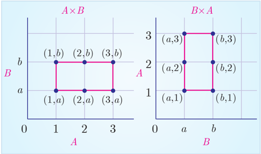

**Thinking Corner**

When will AB ´ be equal to BA´ ?

**Note**

- ¾ In general AB ×≠ BA× , but nA() ×= Bn() BA×
- ¾ A×B=f if and only if A = f orB = f
- ¾ If nA() = p and nB() = q then nA() ×= Bpq

*Fig. 1.3*

**Recall of standard infinite sets**

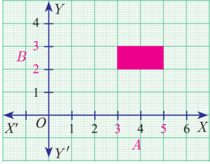

**Illustration 3**

For example, let A be the set of numbers in the interval [3, 5] and B be the set of numbers in the interval [2,3]. Then the Cartesian product AB ´ corresponds to the rectangular region shown in the Fig. 1.4. It consists of all points (x, x, y) within the region.

*Fig. 1.4*

**Progress Check**

- For any two non-empty sets A and B, AB ´ is called as _____.
- If nA() ×= B 20 and nA() = 5 then nB() is _____.
- If A =−{, 11} and B =−{,11} then geometrically describe the set of points of AB ´ .
- If A, B are the line segments given by the intervals (–4, 3) and (–2, 3) respectively, represent the cartesian product of A and B.

The set of all points in the cartesian plane can be viewed as the set of all ordered pairs (x, x, y) where x, x, y are real numbers. In fact, ℝ×ℝ is the set of all points which we call as the cartesian plane.

**Activity 1**

Represent AB ´ and BA´ in a graph sheet. Can you see the difference between AB ´ and BA´ ?

Example 1.1 If A = {1,3,5} and B = {2,3} then (i) find AB ´ and BA´ .

Given that A = {1,3,5} and B = {2,3}

- (ii) From (1) and (2) we conclude that AB ×≠ BA× as (,12)( ¹ 21,) and (,13)( ¹ 31,) , etc.

From (1) and (2) we observe that, n (A×B) = n (B×A) = 6;

we see that,n (A) ×n (B) = 3 × 2 = 6 and n (B) × n (A) = 2×3 = 6

Example 1.2 If A×B = {(3,2), (3,4), (5,2), (5,4)} then find A and B .

We have A = {set of all first coordinates of elements of AB ´ }. ∴ A = {3,5}

B = {set of all second coordinates of elements of AB ´ }. ∴ B = {2,4}

10th Standard Mathematics

From (1) and (2), AB ×∪ () CA =× () BA ∪× () C is verified.

From (3) and (4), AB ×∩ () CA =× () BA ∩× () C is verified.

The above two verified properties are called distributive property of cartesian product over union and intersection respectively. In fact, for any three sets A , B , C we have (i) AB ×∪ () C =× () AB ∪× () AC (ii) AB ×∩ () CC =× (A B)∩× (A ) .

#### 1.3.1 Cartesian Product of three Sets

If A, B, C are three non-empty sets then the cartesian product of three sets is the set of all possible ordered triplets given by

**Illustration for Geometrical understanding of cartesian product of two and three sets**

Representing AB´ in the XY - plane we get a picture shown in Fig. 1.5.

Representing AB ´´C in the XYZ - space we get a picture as shown in Fig. 1.6.

Thus,AB ´ represent vertices of a square in two dimensions and AB ´´C represent vertices of a cube in three dimensions.

In general if we join the cartesian product of two non-empty sets provides a shape in two dimensions and similarly cartesian product of three non-empty sets provide an object in three dimensions.

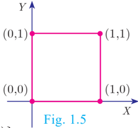

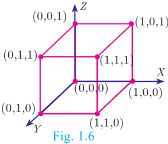

- Find AB ´ , AA´ and BA´

- Let A = {1,2,3} and B = {xx| is a prime number less than 10}. Find AB ´ and BA´ .
- Given A={1,2,3}, B = {2,3,5}, C = {3,4} and D = {1,3,5}, check if () AC∩×() BD∩= () AB×∩() CD× is true?

- Let A = The set of all natural numbers less than 8, B = The set of all prime numbers less than 8, C = The set of even prime number. Verify that

### 1.4 Relations

Many day-to-day occurrences involve two objects that are connected with each other by some rule of correspondence. We say that the two objects are related under the specified rule. How shall we represent it? Here are some examples,

| Relationship | Expressing using the  symbol R | Representation as  ordered pair | \n |
| --- | --- | --- | \n |
| New Delhi is the capital of India | New Delhi R India | (New Delhi, India) | \n |
| Line AB is perpendicular to line XY line AB R line XY |  | (line AB, line XY) | \n |
| –1 is greater than –5 | –1 R –5 | (–1, –5) | \n |
| ℓ is a line of symmetry for DPQR | ℓ R DPQR | (ℓ, DPQR ) |  |

How are New Delhi and India related? We may expect the response, "New Delhi is the capital of India". But there are several ways in which 'New Delhi' and 'India' are related. Here are some possible answers.

- New Delhi is the capital of India .
- New Delhi is in the northern part of India.
- New Delhi is one of the largest cities of India etc.,

So, when we wish to specify a particular relation, providing only one ordered pair

10th Standard Mathematics

(New Delhi, India) it may not be practically helpful. If we ask the relation in the following set of ordered pairs,

{(New Delhi, India), (Washington, USA), (Beijing, China), (London, U.K.), (Kathmandu, Nepal)} then specifying the relation is easy.

**Progress Check**

Let A = {1, 2, 3, 4} and B = {a, b, c}.

|  |  | \n |
| --- | --- | \n |
| 1.  Which of the following are  relations from A to B? | 2.  Which of the following are  relations from B to A? | \n |
| (i) { (1, b), (1, c), (3, a), (4, b) } (i) { (c, a), (c, b), (c, 1) } |  | \n |
| (ii) { (1, a), (b, 4), ( c, 3) } | (ii) { (c, 1), (c, 2), (c, 3), (c, 4) } | \n |
| (iii) { (1, a), (a, 1), (2, b), (b, 2) } (iii) { (a, 4), (b, 3), (c, 2) } |  |  |

**Illustration 4**

|  |  |  |  |  |  |  |  |  |  |  | \n |
| --- | --- | --- | --- | --- | --- | --- | --- | --- | --- | --- | \n |
| Students in a class | S1  S1 | S2  S2 | S 3 | S4  S4 | S5  S5 | S6  S6 | S7  S7 | S 8 | S9  S9 | S1 S10 | \n |
| Heights (in feet) | 4.5 | 5.2 | 5 | 4.5 | 5 | 5.1 | 5.2 | 5 | 4.7 | 4.9 |  |

Let us define a relation between heights of corresponding students. (Fig.1.7)

**Definition**

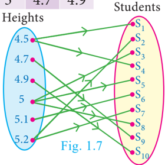

Let A and B be any two non-empty sets. A 'relation' R from A to B is a subset of AB ´ satisfying some specified conditions. If xAÎ is related to yB Î through R , then we write it as x Ry . x Ry if and only if (, xy) Î R .

The domain of the relation R ={| xAÎÎ xy Rf,} orsomeyB

The co-domain of the relation R is B

The range of the relation R ={| yB ÎÎ xyRf,} orsome xA

From these definitions, we note that domain of R Í A, co-domain of R = B and range of R Í B .

**Illustration 5**

Let A = {1,2,3,4,5} and B = {Mathi, Arul, John}

A relation R between the above sets A and B can be represented by an arrow diagram (Fig. 1.8).

Then, domain of R = {1,2,3,4}

range of R= {Mathi, Arul, John} = co-domain of R .

that domain of R is a proper subset of A .

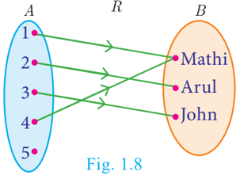

**Activity 2**

Let A and B be the set of lines in xy-plane such that A consists of lines parallel to X-axis. For xAÎ , yB Î , let R be a relation from A to B defined by xyR if x is perpendicular to y. Find the elements of B using a graph sheet.

**Illustration 6**

Let A = {1,3,5,7} and B = {4,8}. If R is a relation defined by "is less than" from A to B, then 1R4 ( 1 is less than 4). Similarly, it is observed that 1R8, 3R4, 3R8, 5R8, 7R8

Equivalently R= {(1,4), (1,8), (3,4), (3,8), (5,8), (7,8)}

In the above illustration A×B = {(1,4), (1,8), (3,4), (3,8), (5,4), (5,8), (7,4),(7,8)} R = {(1,4), (1,8), (3,4), (3,8), (5,8), (7,8)} We see that R is a subset of AB ´ .

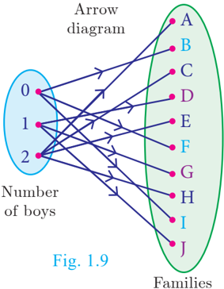

**Illustration 7**

In a particular area of a town, let us consider ten families A , B , C, C, D , E, E, F, F, G, G, H, H, I and J with two children. Among these, families B , F, F, I have two girls; D , G , J have one boy and one girl; the remaining have two boys. Let us define a relation R by xRy, where x denote the number of boys and y denote the family with x number of boys. Represent this situation as a relation through ordered pairs and arrow diagram.

Since the domain of the relation R is concerned about the number of boys, and we are considering families with two

children, the domain of R will consist of three elements given by {0,1,2}, where 0, 1, 2 represent the number of boys say no, one, two boys respectively. We note that families with two girls are the ones with no boys. Hence the relation R is given by

This relation is shown in an arrow diagram (Fig.1.9).

Example 1.4 Let A = {3,4,7,8} and B = {1,7,10}. Which of the following sets are relations from A to B?

- (i) R 1 ={(3,7), (4,7), (7,10), (8,1)} (ii) R 2 = {(3,1), (4,12)}
- (iii) R 3 = {(3,7), (4,10), (7,7), (7,8), (8,11), (8,7), (8,10)}

AB ´ = {(3,1), (3,7), (3,10), (4,1), (4,7), (4,10), (7,1), (7,7), (7,10), (8,1), (8,7), (8,10)}

- (i) We note that, R 1 ⊆×AB . Thus, R 1 is a relation from A to B .
- (ii) Here, (, 412) 2 2 Î R , but (, 412) ∉×AB . So, R 2 is not a relation from A to B .
- (iii) Here, (, 78) 3 3 Î R , but (, 78) ∉×AB . So, R 3 is not a relation from A to B .

10th Standard Mathematics

- ¾ A relation may be represented algebraically either by the roster method or by the set builder method.
- ¾ An arrow diagram is a visual representation of a relation.

Example 1.5 The arrow diagram shows (Fig.1.10) a relationship between the sets P and Q. Write the relation in (i) Set builder form (ii) Roster form (iii) What is the domain and range of R .

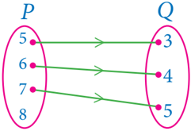

**Solution**

- (i) Set builder form of R == {} (, xy)| yx −∈ 2,, xP yQ∈ ∈ ,, xP ∈ , xP yQ∈
- (ii) Roster form R = {(53,),(64,),(75,)}
- (iii) Domain of R = {5,6,7} and range of R = {} 345 ,, 4,,

*Fig. 1.10*

**' Null relation'**

Let us consider the following example. Suppose A = {–3,–2,–1} and B = {1,2,3,4}. A relation from A to B is defined as ab − b −= 8 i.e., there is no pair(a , b) such that ab − b −= 8 . Thus R contain no element and so R = f .

If nA() = p , nB() = q , then the total number of relations that exist from A to B is 2pq .

A relation which contains no element is called a " Null relation".

- Let A = {1,2,3,7} and B = {3,0,–1,7} , which of the following are relation from A to B ?

- (iv) R 4 = {(7,–1), (0,3), (3,3), (0,7)}
- Let A={1,2,3,4,...,45} and R be the relation defined as "square is of a number" on A . Write R as a subset of AA´ . Also, find the domain and range of R.
- Represent each of the given relations by (a) an arrow diagram, (b) a graph and (c) a set in roster form, wherever possible.
- (i) {(x, x, y)|x = 2y , x ∈{2,3,4,5}, y ∈{1,2,3,4}}
- (ii) {(x, x, y)|y = x+3, x, x, y are natural numbers < 10}
- A company has four categories of employees given by Assistants (A), Clerks (C), Managers (M) and an Executive Officer (E). The company provide ₹10,000, ₹25,000, ₹50,000 and ₹1,00,000 as salaries to the people who work in the categories

A , C, C, M and E respectively. If A 1, A 2, A 3, A 4 and A 5 were Assistants; C 1, C2 C2, C3 C3, C4 C4 were Clerks; M 1, M2 M2, M3 M3 were managers and E 1, E2 E2 were Executive officers and if the relation R is defined by xRy, where x is the salary given to person y , express the relation R through an ordered pair and an arrow diagram.

### 1.5 Functions

Among several relations that exist between two non-empty sets, some special relations are important for further exploration. Such relations are called "Functions".

**Illustration 8**

A company has 5 employees in different categories. If we consider their salary distribution for a month as shown by arrow diagram in Fig.1.11, we see that there is only one salary associated for every employee of the company.

Here are various real life situations illustrating some special relations:

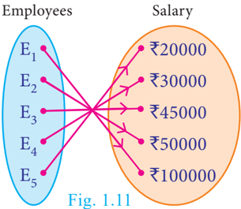

- Consider the set A of all of your classmates; corresponding to each student, there is only one age.
- You go to a shop to buy a book. If you take out a book, there is only one price corresponding to it; it does not have two prices corresponding to it. (of course, many books may have the same price).
- You are aware of Boyle's law. Corresponding to a given value of pressure P, there is only one value of volume V. V.
- In Economics, the quantity demanded can be expressed as QP =− 360 4 4 , where P is the price of the commodity. We see that for each value of P, there is only one value of Q. Thus the quantity demanded Q depend on the price P of the commodity.

We often come across certain relations, in which, for each element of a set A, there is only one corresponding element of a set B. Such relations are called functions. We usually use the symbol f to denote a functional relation.

**Definition**

A relation f between two non-empty sets X and Y is called a function from X to Y if, for each xX Î there exists only one yYÎ such that (, xy) Î f .

That is, f ={(x, x, y)| for all x ∈ X, X, y ∈Y } .

A function f from X to Y is written as fX: ®Y .

Comparing the definitions of relation and function, we see that every function is a relation. Thus, functions are subsets of relations and relations are subsets of cartesian product. (Fig.1.12(a))

10th Standard Mathematics A function f can be thought as a mechanism (or device) (Fig.1.12(b)), which gives a unique output f(x) to every input x .

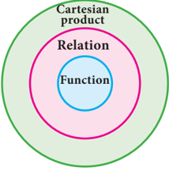

A function is also called as a mapping or transformation.

If fX: ®Y is a function then

- ¾ The set X is called the domain of the function f and the set Y is called its co-domain.
- ¾ If f (a) = b, then b is called 'image' of a under f and a is called a 'pre-image' of b .
- ¾ The set of all images of the elements of X under f is called the 'range' of f. f.
- ¾ fX: ®Y is a function only if
- (i) every element in the domain of f has an image.
- (ii) the image is unique.
- ¾ If A and B are finite sets such that nA() = p , nB() = q then the total number of functions that exist from A to B is q p .
- ¾ In this chapter we always consider f to be a real valued function.
- ¾ Describing domain of a function
- (ii) Let fx( xx−5 x() = x−+5 1 x+56 2 ; If x = 23, , then f (2) and f (3) are not defined. Hence f is

**Progress Check**

- Relations are subsets of ____. Functions are subsets of ____.
- True or False: All the elements of a relation should have images.
- True or False: All the elements of a function should have images.
- True or False: If R : AB ® is a relation then the domain of R = A .
- What is the difference between relation and function?
- Let A and B be two non-empty finite sets. Then which one among the following two collection is large?
- (i) The number of relations between A and B .
- (ii) The number of functions between A and B .

**Illustration 9 - Testing for functions**

**Representation by Arrow diagram**

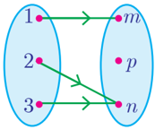

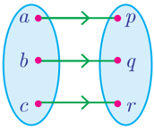

This represents a function. Each input corresponds to a single output.

*This represents a function. Each input corresponds to a single output.*

Fig. 1.13(a)

Fig. 1.13(b)

Functions play very important role in the understanding of higher ideas in mathematics. They are basic tools to convert from one form to another form. In this sense, functions are widely applied in Engineering Sciences.

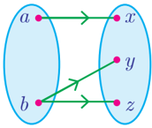

Fig. 1.13(c)

**Note**

The range of a function is a subset of its co-domain.

. Solution Pictorial representation of R is given in Fig.1.14. From the diagram, we see that for each xX Î , there exists only one yYÎ . Thus all elements in X have only one image in Y. Therefore R is a function. Domain X = {1,2,3,4}; Co-domain Y = {2,4,6,8,10}; Range of f = {2,4,6,8}. 1 2 3 4 Fig. 1.14 2 4 6 8 10

2 --- 2 --- 2 --- 2 --- 2 --- 2 --- 2 --- 2 --- 2 --- 2 --- 2 --- 2 --- 2 --- 2 --- 2 --- 2 --- 2 --- 2 --- 2 --- 2 --- 2 --- 2 --- 2 --- 2 --- 2 --- 2 --- 2 --- 2 --- 2 --- 2 --- 2 --- 2 --- 2 --- 2 --- 2 --- 2 --- 2 --- 2 --- 2 --- 2 --- 2 --- 2 --- 2 --- 2 --- 2 --- 2 --- 2 --- 2 --- 2 --- 2 --- 2 --- 2 --- 2 --- 2 --- 2 --- 2 --- 2 --- 2 --- 2 --- 2 --- 2 --- 2 --- 2 --- 2 --- 2 --- 2 --- 2 --- 2 --- 2 --- 2 --- 2 --- 2 --- 2 --- 2 --- 2 --- 2 --- 2 --- 2 --- 2 --- 2 --- 2 --- 2 --- 2 --- 2 --- 2 --- 2 --- 2 --- 2 --- 2 --- 2 --- 2 --- 2 --- 2 --- 2 --- 2 --- 2 --- 2 --- 2 --- 2 --- 2 --- 2

2 where X

Solution fx() =

−{, 21 −

, 03}

x --- x --- --- --- --- --- --- --- --- --- --- --- --- --- --- --- --- --- --- --- --- --- --- --- --- --- --- --- --- --- --- --- --- --- --- --- --- --- --- --- --- --- --- --- --- --- --- --- --- --- --- --- --- --- --- --- --- --- --- --- --- --- --- --- --- --- --- --- --- --- --- --- --- --- --- --- --- --- --- --- --- --- --- --- --- --- --- --- --- --- --- --- --- --- --- --- --- --- --- --- --- --- --- --- --- --- --- --- --- --- --- --- --- --- --- --- --- --- --- --- --- --- --- --- --- --- --- --- --- --- --- --- --- --- --- --- --- --- --- --- --- --- --- --- --- --- --- --- --- --- --- --- --- --- --- --- --- --- --- --- --- --- --- --- --- --- ---

,, 0

- (ii) We note that each element in the domain of f has a unique image. Therefore, f is a function.

**Thinking Corner**

Is the relation representing the association between planets and their respective moons a function?

Example 1.8 If X = {–5,1,3,4} and Y = {a , b , c }, then which of the following relations are functions from X to Y ?

10th Standard Mathematics

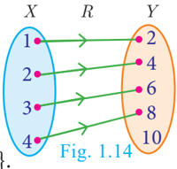

**Solution**

- (i) R

1 = {(–5,a), (1,a), (3,b)} We may represent the relation R 1 in an arrow diagram (Fig.1.15(a)).

R 1 is not a function as 4 Î X does not have an image in Y. Y.

- (ii) R 2 = {(–5,b), (1,b), (3,a),(4,c)}

Arrow diagram of R 2 is shown in Fig.1.15(b).

R 2 is a function as each element of X has an unique image in Y. Y.

- (iii) R 3 = {(–5,a), (1,a), (3,b),(4,c),(1,b)}

Representing R 3 in an arrow diagram (Fig.1.15(c)).

R 3 is not a function as 1 Î X has two images aYÎ and bYÎ .

that the image of an element should always be unique.

Example 1.9 Given fx () x = 2 = 2 – x 2 ,

Solution (i) x = 1, we get

- (ii) x = x+1, we get

[Note that ff () x + f +≠ ()11 fx() + . In general f() ab + is not equal tof(a)+f(b)]

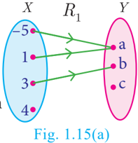

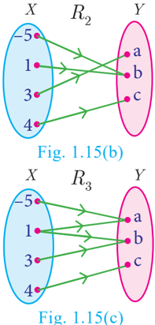

- Let fx =∈ {( ,) yx|,yN and2 yx = } be a relation on ℕ. Find the domain, co-domain and range. Is this relation a function?

- Given the function fx: →− xx + 2 5 2 x + 56 , evaluate
- (i) f () -1 (ii) fa () 2 (iii) f ()2 (iv) f () x − 1 − 1
- A graph representing the function f (x) is given in Fig.1.16 it is clear that f(9) = 2.
- (i) Find the following values of the function

- (ii) For what value of x is f(x) = 1?
- (iii) Describe the following (i) Domain (ii) Range.
- (iv) What is the image of 6 under f ?
- Let f(x) = 2x+5. If x ¹ 0 then find fx ( f x x f() +−22() .
- A function f is defined by fx() = 23 x – –
- (i) find ff ()01()+ 2 + .
- (ii) find x such that f(x) = 0 .
- (iii) find x such that fx() = x .
- (iv) find x such that fx() =− fx () 1 .

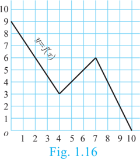

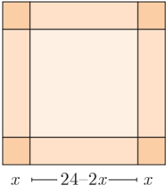

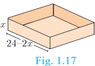

- An open box is to be made from a square piece of material, 24 cm on a side, by cutting equal squares from the corners and turning up the sides as shown (Fig.1.17). Express the volume V of the box as a function of x .
- A plane is flying at a speed of 500 km per hour. Express the distance 'd ' travelled by the plane as function of time t in hours.
- The data in the adjacent table depicts the length of a person forehand and their corresponding height. Based on this data, a student finds a relationship between the height (y) and the forehand length(x) as ya =+xb , where a , b are constants.
- (i) Check if this relation is a function.
- (ii) Find a and b .

10th Standard Mathematics

|  |  | \n |
| --- | --- | \n |
| Length ‘x’ of  forehand (in cm) | Height ‘y ’ (in inches) | \n |
| 35 | 56 | \n |
| 45 | 65 | \n |
| 50 | 69.5 | \n |
| 55 | 74 |  |

- (iii) Find the height of a person whose forehand length is 40 cm.
- (iv) Find the length of forehand of a person if the height is 53.3 inches.

### 1.6 Representation of Functions

A function may be represented by

- (a) a set of ordered pairs
- (b) a table form
- (c) an arrow diagram
- (d) a graphical form

Let fA: ® B be a function

**(a) Set of ordered pairs**

The set fx == {, () yy|(fx),xA∈ } of all ordered pairs represent a function.

**(b) Table form**

The values of x and the values of their respective images under f can be given in the form of a table .

**(c) Arrow diagram**

An arrow diagram indicates the elements of the domain of f and their respective images by means of arrows.

**(d) Graph**

The ordered pairs in the collection fx == {( ,( yy )| f ( fx),xA∈ } are plotted as points in the XY- plane. The graph of f is the totality of all such points.

Every function can be represented by a curve in a graph. But not every curve drawn in a graph will represent a function.

The following test will help us in determining whether a given curve is a function or not.

#### 1.6.1 Vertical line test

A curve drawn in a graph represents a function, if every vertical line intersects the curve at only one point.

Example 1.10 Using vertical line test, determine which of the following curves (Fig.1.18(a), 1.18(b), 1.18(c), 1.18(d)) represent a function?

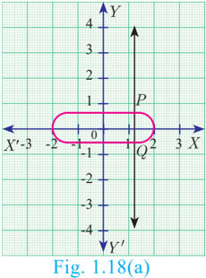

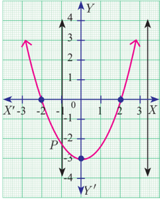

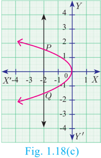

The curves in Fig.1.18 (a) and Fig.1.18 (c) do not represent a function as the vertical lines meet the curves in two points P and Q .

The curves in Fig.1.18 (b) and Fig.1.18 (d) represent a function as the vertical lines meet the curve in at most one point.

Any equation represented in a graph is usually called a curve.

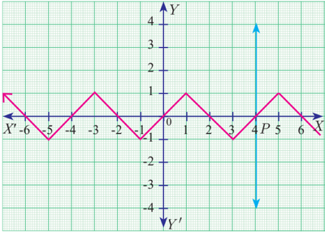

Example 1.11 Let A = {,1 234 ,, 3,, } and B = {} 25,, 81,,114 5,, 81, 1,,1 } ,114 be two sets. Let fA: ® B be a function given by fx() =− 31 x . Represent this function

- (i) by arrow diagram (ii) in a table form
- (iii) as a set of ordered pairs (iv) in a graphical form

**Solution**

**(i) Arrow diagram**

Let us represent the function fA: ® B by an arrow diagram (Fig.1.19).

**(ii) Table form**

The given function f can be represented in a tabular form as given below

|  |  |  |  | \n |
| --- | --- | --- | --- | \n |
| x  1 | 2 | 3 | 4 | \n |
| f(x)  2 | 5 | 8 | 11 |  |

**(iii) Set of ordered pairs**

The function f can be represented as a set of ordered pairs as

**(iv) Graphical form**

In the adjacent XY -plane the points (1,2), (2,5), (3,8), (4,11) are plotted (Fig.1.20).

10th Standard Mathematics

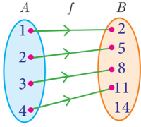

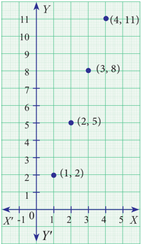

### 1.7 Types of Functions

In this section, we will discuss the following types of functions with suitable examples.

- (i) one – one (ii) many – one

#### 1.7.1 One – one function

Let us assume that we have a cell phone with proper working condition. If you make a usual call to your friend then you can make only one call at a time (Fig.1.21).

If we treat making calls as a function, then it will be one - one.

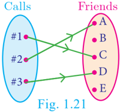

A function fA: ® B is called one – one function if distinct elements of A have distinct images in B .

A one-one function is also called an injection .

Equivalently,

**Illustration 10**

- (i) Let f = {(1,a), (2,b), (3,d), (4,c)}
- In Fig. 1.22, for different elements in A, there are different

images in B .

Hence f is a one – one function.

- Let g = {(1,b), (2,b), (3,c), (4,e)}

g is a function from A to B such that gg ()12 == () b , but 12 ¹ . Thus two distinct elements 1 and 2 in the first set A have same image b the second set in B (Fig.1.23). Hence, g is not a one–one function.

#### 1.7.2 Many – one function

In a theatre complex three films F 1, F2 F2, F3 F3 are shown. Seven persons (P 1 to P7 P7 ) arrive at the theatre and buy tickets as shown (Fig.1.24).

If the selection of films is considered as a relation, then this is a function which is many–one, since more than one person may choose to watch the same film.

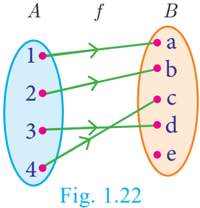

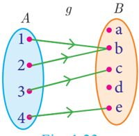

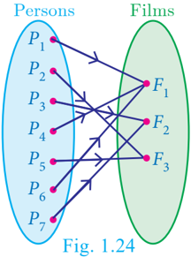

A function fA: ® B is called many-one function if two or more elements of A have same image in B .

In other words, a function fA: ® B is called many-one if f it is not one–one.

**Illustration 11**

Then f is a function from A to B in which different elements 1 and 2 of A have the same image a in B. Hence f is a many – one function.

#### 1.7.3 Onto function

In a mobile phone assume that there are 3 persons in the contact. If every person in the contact receives a call, then the function representing making calls will be onto. (Fig.1.25)

A function fA: ® B is said to be onto function if the range of f is equal to the co-domain of f. f.

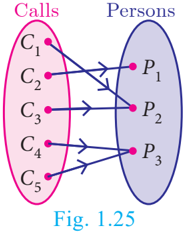

In other words, every element in the co-domain B has a pre-image in the domain A .

An onto function is also called a surjection .

If fA: ® B is an onto function then, the range of fB = .

**Illustration 12**

Hence f is an onto function.

#### 1.7.4 Into function

In a home appliance showroom, the products television, air conditioner, washing machine and water heater were provided with 20% discount as new year sale offer. If the selection of the above products by the three customers C1 C1, C2 C2, C3 C3 is considered as a function then the following diagram (Fig.1.27) will represent an into function .

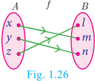

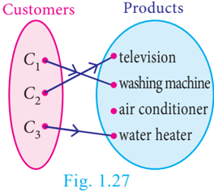

During winter season customers usually do not prefer buying air conditioner. Here air conditioner is not chosen by any customer. This is an example of into function.

10th Standard Mathematics A function fA: ® B is called an into function if there exists atleast one element in B which is not the image of any element of A .

That is the range of f is a proper subset of the co-domain of f. f.

In other words, a function fA: ® B is called 'into' if it is not 'onto'.

**Illustration 13**

Let A = {1,2,3,} and Bw = {} ,, xy,z ,, x , xy , z , fw = {(12 ,,)( w ,,) 2 ,)} (,zx ),(3, )

Here, range of fw =⊂ {} ,, xz ,, x , xz B (Fig.1.28)

∴ f is a into function.

that yB Î is not an image of any element in A .

#### 1.7.5 Bijection

Consider the circle where each letter of the English alphabet is changed from inner portion to a letter in the outer portion. Thus AD ® , BE ® , CF ® , … ZC ® . We call this circle as 'cipher circle'. (Fig.1.29) In this way if we try to change the word 'HELLO' then it will become 'KHOOR'. Now using the same circle if we substitute for each outer letter the corresponding inner letter we will get back the word 'HELLO'. This process of converting

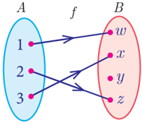

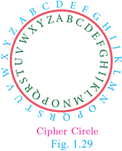

from one form to an other form and receiving back the required information is called bijection. This process is widely used in the study of secret codes called cryptography .

If a function fA: ® B is both one–one and onto, then f is called a bijection from A to B .

**Illustration 14**

| one to one and onto function (Bijection) | one to one and onto function (Bijection) | \n |
| --- | --- | \n |
| Fig. 1.30 1 2 3 w x z A  f  B | Distinct elements of A have distinct images  in B and every element in B has a pre-image  in A . |  |

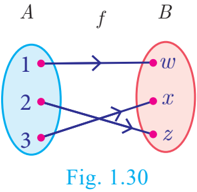

**Illustration 15**

**One to One**

**Many to One**

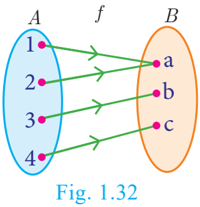

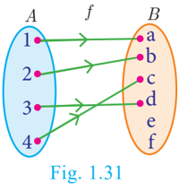

Two or more elements of A have same image in B .

Distinct elements of A have distinct images in B .

**Onto**

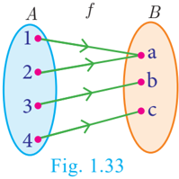

**Range of f = co-domain**

( Every element in B has a pre-image in A)

A one – one and onto function is also called a one – one correspondence.

**Thinking Corner**

Can there be a one to many function?

**Into**

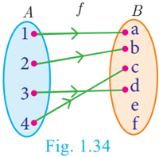

Range of f is a proper subset of co-domain (There exists at least one element in B which is not the image of any element of A)

To determine whether the given function is one–one or not the following test may help us.

#### 1.7.6 Horizontal Line Test

Previously we have seen the vertical line test. Now let us see the horizontal line test. "A function represented in a graph is one–one, if every horizontal line intersects the curve at only one point".

Example 1.12 Using horizontal line test (Fig.1.35 (a), 1.35 (b), 1.35 (c)), determine which of the following functions are one – one.

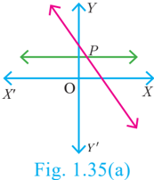

The curves in Fig.1.35 (a) and Fig.1.35 (c) represent a one–one function as the horizontal lines meet the curves in only one point P .

The curve in Fig. 1.35 (b) does not represent a one–one function, since, the horizontal line intersects the curve at two points P and Q .

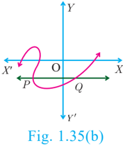

10th Standard Mathematics Example 1.13 Let A = {} 12,, 3 2,, 3 , B = {} 4,,, 567 ,,, 56 } ,, 567 and f = {(14,),(25,),(36,)} be a function from A to B. Show that f is one – one but not onto function.

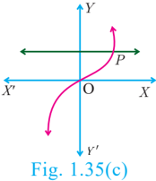

Then f is a function from A to B and for different elements in A, there are different images in B. Hence f is one–one function. Note that the element 7 in the co-domain does not have any pre-image in the domain. Hence f is not onto (Fig.1.36).

∴ f is one–one but not an onto function.

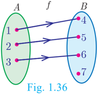

Example 1.14 If A =−{} 21 ,, − 01,,2 1 ,, − 01, 1,, } 2 and fA: ® B is an onto function defined by fx() =+ xx + 2 2 1 then find B .

Given A =−{ −{} 21 ,, − 01,,2 1 ,, − 01, 1,, 2 and fx() =+ xx + 2 2 1

- (i) Find the images of 1, 2, 3 (ii) Find the pre-images of 29, 53
- (ii) Identify the type of function

The images of 1, 2, 3 are 5, 8, 11 respectively.

- (ii) If x is the pre-image of 29, then fx() = 29 . Hence 32 x += 29

Thus the pre-images of 29 and 53 are 9 and 17 respectively.

- ∴ f is not an onto function. That is, f is an into function.

Thus f is one – one and into function.

Example 1.16 Forensic scientists can determine the height (in cm) of a person based on the length of the thigh bone. They usually do so using the function hb() =⋅ 2475 b +⋅ 410 where b is the length of the thigh bone.

- (i) Verify the function h is one – one or not.
- (ii) Also find the height of a person if the length of his thigh bone is 50 cm.
- (iii) Find the length of the thigh bone if the height of a person is 147 × 96 cm.

- (iii) If the height of a person is 147 × 96 cm, then hb() =⋅ 147 96 and so the length of the thigh bone is given by

Therefore, the length of the thigh bone is 38 cm.

**Activity 3**

Check whether the following curves represent a function. In the case of a function, check whether it is one-one? (Hint: Use the vertical and the horizontal line tests)

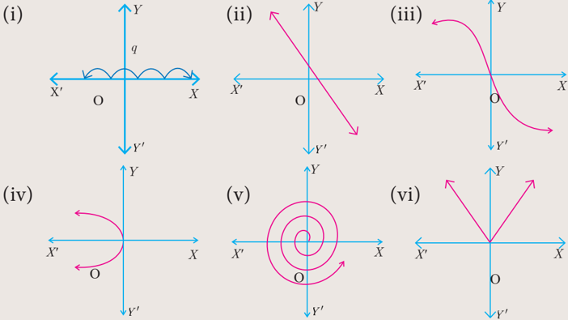

### 1.8 Special Cases of Functions

There are some special cases of a function which will be very useful. We discuss some of them below

- (i) Constant function
- (ii) Identity function
- (iii) Real – valued function

10th Standard Mathematics

**(i) Constant function**

A function fA: ® B is called a constant function if the range of f contains only one element. That is, fx() = c , for all xAÎ and for some fixed cB Î . A f B

**Illustration 16**

From Fig.1.37, Aa = {} ,, bcd, ,, b , bcd, , , B = {,12,}3 and fa = {( ,, 3) , 33 )(bcd ,,)( ,, 3)( 3 ,,) ,)( ,, 3) d , 33 )( , , )} . fx() = 3 ∀ xAÎ , Range of f = {}3 , f is a constant function.

**(ii) Identity function**

Let A be a non–empty set. Then the function fA: ® A defined by fx() = x for all xAÎ is called an identity function on A and is denoted by IA IA .

**Illustration 17**

**(iii) Real valued function**

**Progress Check**

**State True or False.**

- All one – one functions are onto functions.
- There will be no one – one function from A to B when nA() = 4 , nB() = 3 .
- All onto functions are one – one functions.
- There will be no onto function from A to B when nA() = 4 , nB() = 5 .
- If f is a bijection from A to B, then nn () AB = ( B () .
- If nn () AB = ( B (), then f is a bijection from A to B .
- All constant functions are bijections.

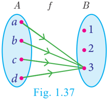

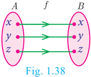

**Thinking Corner**

Is an identity function one to one function?

then find the values of

**Solution**

The function f is defined by three values in intervals I, II, III as shown by the side

For a given value of xa = , find out the interval at which the point a is located, there after find fa() using the particular value defined in that interval.

- (i) First, we see that, x = 4 lie in the third interval.

- (ii) x =−2 lies in the second interval.

- (iii) From (i), f()41 = 0 .

To find f()1 , first we see that x = 1 lies in the second interval.

- (iv) We know that f ()11 =− and f () 41 = 0 .

For finding f() -3 , we see that x =−3 , lies in the first interval.

- Determine whether the graph given below represent functions. Give reason for your answers concerning each graph .

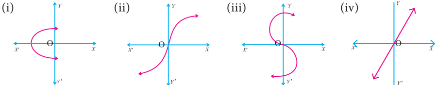

10th Standard Mathematics

- (i) set of ordered pairs (ii) a table (iii) an arrow diagram (iv) a graph
- Represent the function f = {, () 12 ,, () 22, () 22, , () 32, ) 2,,, ,, () 43 (5 ,, , () 43 () 54 } through
- (i) an arrow diagram (ii) a table form
- (iii) a graph
- In each of the following cases state whether the function is bijective or not. Justify your answer.
- LetA =−{} 11, , and B = {} 02, , . If the function fA: ® B defined by fx() =+ ax b is an onto function? Find a and b .

- (i) t()0 (ii) t() 28
- (iii) t() -10
- (iv) the value of C when tC() = 212
- (v) the temperature when the Celsius value is equal to the Farenheit value.

### 1.9 Composition of Functions

When a car driver depresses the accelerator pedal, it controls the flow of fuel which in turn influences the speed of the car. Likewise, the composition of two functions is a kind of 'chain reaction', where the functions act upon one after another (Fig.1.40).

We can explain this further with the concept that a function is a 'process'. If f and g are two functions then the composition gf((x)) (Fig.1.41) is formed in two steps.

- (i) Feed an input (say x) to f ;
- (ii) Feed the output f(x) to g to get gf((x)) and call it gf(x).

**Illustration**

Consider the set A of all students, who appeared in class X of Board Examination. Each student appearing in the Board Examination is assigned a roll number. In order to have confidentiality, the Board arranges to deface the roll number of each student and assigns a code number to each roll number.

We can write cg == ()bg(() fa ) .

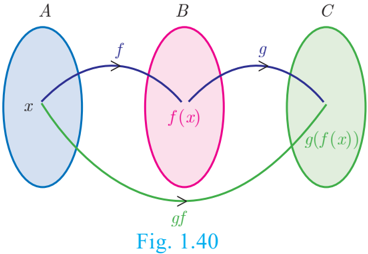

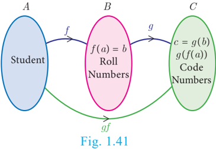

Thus, by the combination of these two functions, each student is eventually attached a code number. This idea leads to the following definition. A B C

**Definition**

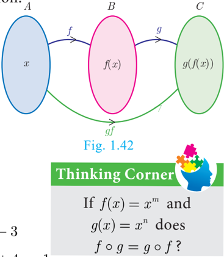

Example 1.20 Represent the function fx()=− 25 xx + 3 2 2 as a composition of two functions.

#### 1.9.1 Composition of three functions

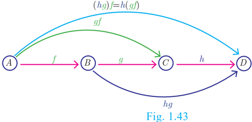

We observed that the composition of functions is not commutative. The natural question is about the associativity of the operation.

Example 1.24 Find x if gff(x) = fgg(x), given fx() =+ 31 x and gx() =+x 3 .

gff(x) = g [f {f (x)}] (This means "g of f of f of x") = g [ f (3x +1)] = g [ 3(3x +1)+1] = g (9x + 4) g (9x + 4) = [ (9x + 4) + 3] = 9x + 7 fgg(x) = f [g {g (x)}] (This means "f of g of g of x") = f [ g (x + 3)] = f [ (x + 3) + 3] = f (x + 6) f (x + 6) = [ 3(x + 6) + 1 ] = 3x + 19

These two quantities being equal, we get 9x + 7 = 3x + 19. Solving this equation we obtain x = 2.

**Progress Check**

State your answer for the following questions by selecting the correct option.

- Composition of functions is commutative
- (a) Always true
- (b) Never true
- (c) Sometimes true
- Composition of functions is associative
- (a) Always true
- (b) Never true
- (c) Sometimes true

**Activity 4**

How to find h(1) ?

| x | g(x) | \n |
| --- | --- | \n |
| 1 | 2 | \n |
| 2 | 4 | \n |
| 3 | 3 | \n |
| 4 | 1 |  |

| x | h(x) | \n |
| --- | --- | \n |
| 1 | 3 | \n |
| 2 | - | \n |
| 3 | - | \n |
| 4 | - |  |

| x | f(x) | \n |
| --- | --- | \n |
| 1 | 2 | \n |
| 2 | 3 | \n |
| 3 | 1 | \n |
| 4 | 4 |  |

10th Standard Mathematics

### 1.10 Identifying the Graphs of Linear, Quadratic, Cubic and Reciprocal Functions

Graphs provide visualization of curves and functions. Hence, graphs help a lot in understanding the concepts in a much efficient way.

In this section, we will be discussing about the identification of some of the functions through their graphs. In particular, we discuss graphs of Linear, Quadratic, Cubic and Reciprocal functions.

#### 1.10.1 Linear Function

Some Specific Linear Functions and their graphs are given below.

| No. | Function | Domain and Definition | Graph | \n |
| --- | --- | --- | --- | \n |
| 1 | The identity  function | f :  ®  defined by  fx() =  x | X Y  ¢ Fig. 1.44 Y 4 3 2 1 -1
 1  -2 -3 -4 0  X′ X′ -4  -3  -2  -1  1  2  3  4 fx() =  x | \n |
| 2 | Additive inverse  function | f :  ®  defined by  fx() =−x | X Y  ¢ Fig. 1.45 Y 4 3 2 1 -1
 1  -2 -3 -4 X ′ 1
 X 0 ′-4 -3 -2 -1  -3  -2  -1  1  2  3  4 fx() =−x |  |

#### 1.10.2 Modulus or Absolute valued Function

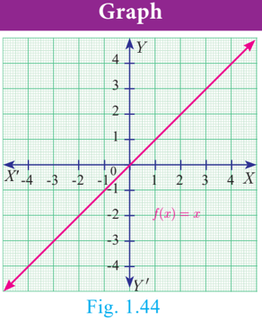

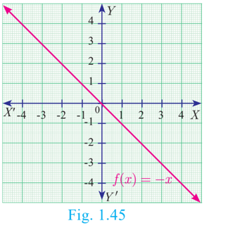

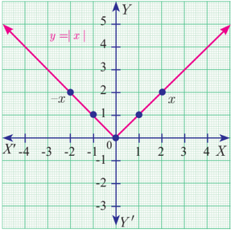

- ¾ Modulus function is not a linear function but it is composed of two linear functions x and –x. x.
- ¾ Linear functions are always one-one functions and has applications in Cryptography as well as in several branches of Science and Technology.

#### 1.10.3 Quadratic Function

Some specific quadratic functions and their graphs

| Function, Domain, Range and Definition | Graph | \n |
| --- | --- | \n |
| f :  ®  defined by fx() =∈ xx,
 2  ∈ x,.  2    fx() ∈∞[, 0  ) | X Y′  Y′  O  X ′ Y Fig. 1.47(a) | \n |
| f :  ®   defined by fx() =−xx,
 2  x,. ∈  ∈  2   fx() ∈−(, ∞ 0] | X Y′ Y′ O Y X ′ Fig. 1.47(b) |  |

#### 1.10.4 Cubic Function

defined by

The graph of fx() = x 3 is shown in Fig.1.48.

#### 1.10.5 Reciprocal Function

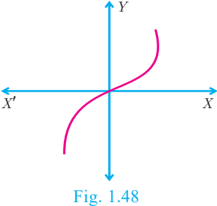

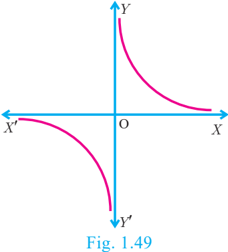

#### 1.10.6 Constant Function

**Progress Check**

- Is a constant function a linear function?
- Is quadratic function a one – one function?
- Is cubic function a one – one function?
- Is the reciprocal function a bijection?

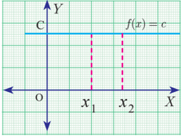

- If fA: ® B is a constant function, then the range of f will have ____ elements.

- (v) fx() =− 41 xg ,(xx ) =+1 2 2

- (i) fx() =−x 1 , gx() =+ 31 x and hx() = x 2
- (ii) fx() = x , 2 gx() = 2x and hx() =+x 4
- (iii) fx() =−x 4 , gx() = x 2 and hx() =− 35 x

**Multiple choice questions**

- If nA() ×= B 6 and A = {,13} then nB() is

1.

- (A) 1
- (B) 2
- (C) 3
- (D) 6
- Aa = {,bp,} , B = {, 23}, Cp = {,qr, r,, s } then nA[( ∪× CB )] is
- (A) 8
- (B) 20
- (C) 12
- (D) 16
- If A = {,12}, B = {,1 234 ,, 3,, },C = {, 56} and D = {, 56 ,, 7 , 78} then state which of the following statement is true.
- (A) () AC×⊂ () BD×
- (B) () BD×⊂ () AC×
- (C)() AB ×⊂ () AD×
- (D) () DA×⊂ () BA×
- If there are 1024 relations from a set A = {1, 2, 3, 4, 5} to a set B, then the number of elements in B is
- (A) 3
- (B) 2
- (C) 4
- (D) 8
- The range of the relation Rx = {( ,) xx| 2 2 is a prime number less than 13} is
- (A) {2,3,5,7}
- (B) {2,3,5,7,11}
- (C) {4,9,25,49,121}
- (D) {1,4,9,25,49,121}
- If the ordered pairs (, a + 24) and (, 52ab + )are equal then (, ab) is
- (A) (2, –2)
- (B) (5,1)
- (C) (2,3)
- (D) (3, –2)
- Let nA() = m and n(B) = n then the total number of non-empty relations that can be defined from A to B is
- (A) m n
- (B) n m
- (C) 21 mn - mn -
- (D) 2 mn
- If {} (, ab 86 ),(, ) represents an identity function, then the value of a and b are respectively
- (A) (8,6)
- (B) (8,8)
- (C) (6,8)
- (D) (6,6)

10th Standard Mathematics

- Let A = {,1 234 ,, 3,, } andB = {, 48 ,, 9 , 910}. A function fA: ® B given by f = {(14,),(28,),(39,),(41,)0 } is a
- (A) Many-one function
- (B) Identity function
- (C) One-to-one function
- (D) Into function
- (D) 1 6 2 x
- (A) 3 2 2 x
- (B) 2 3 2 x
- (C) 2 9 2 x
- If fA: ® B is a bijective function and if nB() = 7 , then nA() is equal to
- (A) 7
- (B) 49
- (C) 1
- (D) 14
- Let f and g be two functions given by

- (A) {0,2,3,4,5}
- (B) {–4,1,0,2,7}
- (C) {1,2,3,4,5} (D) {0,1,2}
- Let fx() =+1 x 2 then
- (A) fx() yf = () xf.(y)
- (B) fx() yf ³ () xf.(y)
- (D) None of these
- (C) fx() yf £ () xf.(y)
- If g = {(11,),(23,),(35,),(47,)} is a function given by gx() =+ αβ x then the values of a and b are
- (A) (–1,2)
- (B)(2, –1)

(C) (–1, –2)

(D) (1,2)

- fx() =+ () xx 11 −− () 3 x 1 () 33 represents a function which is
- (A) linear
- (B) cubic
- (C) reciprocal
- (D) quadratic

**Unit Exercise - 1**

- The cartesian product A×A has 9 elements among which (–1, 0) and (, 01) are found. Find the set A and the remaining elements of A×A .
- (ii) f()3 (iii) fa() + 1 in terms of a.(Given that a ³ 0 )
- (i) f()0

- Find the domain of the function fx() =+11−−1 x 2
- Let A = {,12} and B = {,1 234 ,, 3,, } , C = {} 56, , and D = {, 567, 7,, 8} . Verify whether A×C is a subset of B×D?
- The functions f and g are defined by fx() =+ 68 x ; gx( x x() = − 2 3
- (ii) Write an expression for gf() x in its simplest form.
- Write the domain of the following real functions

**Points to Remember**

- z The Cartesian Product of A with B is defined as AB ×= {(ab,) | for allaAÎ , bB Î }
- z A relation R from A to B is always a subset ofAB ´ . That is R ⊆×AB
- z A relation R from X to Y is a function if for every xX Î there exists only oneyYÎ .
- z A function can be represented by
- (i) an arrow diagram
- (ii) a tabular form
- (iii) a set of ordered pairs
- (iv) a graphical form
- z Some types of functions
- (i) One-one function
- (ii) Onto function
- (iii) Many-one function
- (iv) Into function
- z Identity function fx() = x
- z Reciprocal function fx( x x() = 1

10th Standard Mathematics

- z Constant function fx() = c
- z Linear function fx() =+ ax b , a ¹ 0

**ICT CORNER**

**ICT 1.1**

Open the Browser type the URL Link given below (or) Scan the QR Code. GeoGebra work book named "Relations and Functions–X" will open. In the left side of the work book there are many activity related to Relations and Functions chapter. Select the work sheet "Functions Identification"

In the given worksheet click on the check boxes corresponding to each function on left hand side. You can see the graph of respective function on Right hand side. Analyse each graph and then click "New Functions" and continue till you understand.

**Step 1**

**Step 2**

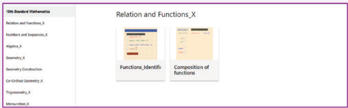

**ICT 1.2**

**Expected results**

Open the Browser type the URL Link given below (or) Scan the QR Code. GeoGebra work book named "Relations and Functions–X" will open. In the left side of the work book there are many activity related to Relations and Functions chapter. Select the work sheet "Composition of Functions"

In the given worksheet click on the check boxes corresponding to each function on left hand side. You can see the graph of respective function on Right hand side. Analyse each graph and then click "New Functions" and continue till you understand.

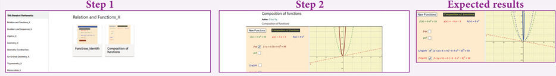

You can repeat the same steps for other activities

https://www.geogebra.org/m/jfr2zzgy#chapter/356191

or Scan the QR Code.
