# Chapter 1

## RELATIONS AND FUNCTIONS

"Mathematicians do not study objects, but relations between objects . . . Content to them is irrelevant: they are interested in form only" – Henri Poincare

Gottfried Wilhelm Leibniz (also known as von Leibniz) was a prominent German mathematician, philosopher, physicist and inventor. He wrote extensively on 26 topics covering wide range of subjects among which were Geology, Medicine, Biology, Epidemiology, Paleontology, Psychology, Engineering, Philology, Sociology, Ethics, History, Politics, Law and Music Theory.

In a manuscript Leibniz used the word "function" to mean any quantity varying from point to point of a curve. Leibniz provided the foundations of Formal Logic and Boolean Algebra, which are fundamental for modern day computers. For all his remarkable discoveries and contributions in various fields, Leibniz is hailed as "The Father of Applied Sciences".

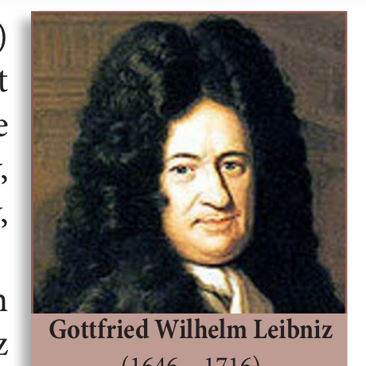

---

## Learning Outcomes

- To define and determine cartesian product of sets.
- To define a relation as a subset of cartesian product of sets.
- To understand function as a special relation.
- To represent a function through an arrow diagram, a set of ordered pairs, a table, a rule or a graph.
- To classify functions as one-one, many-one, onto, into and bijection.
- To study combination of functions through composition operation.
- To understand the graphs of linear, quadratic, cubic and reciprocal functions.

---

### 1.1 Introduction

The notion of sets provides the stimulus for learning higher concepts in mathematics. A set is a collection of well-defined objects. This means that a set is merely a collection of something which we may recognize. In this chapter, we try to extend the concept of sets in two forms called Relations and Functions. For doing this, we need to first know about cartesian products that can be defined between two non-empty sets.

It is quite interesting to note that most of the day-to-day situations can be represented mathematically either through a relation or a function. For example, the distance travelled by a vehicle in given time can be represented as a function. The price of a commodity can be expressed as a function in terms of its demand. The area of polygons and volume of common objects like circle, right circular cone, right circular cylinder, sphere can be expressed as a function with one or more variables.

In class IX, we had studied the concept of sets. We have also seen how to form new sets from the given sets by taking union, intersection and complementation.

Now we are about to study a new set called "cartesian product" for the given sets $A$ and $B$.

### 1.2 Ordered Pair

Observe the seating plan in an auditorium (Fig.1.1). To help orderly occupation of seats, tokens with numbers such as $(1,5)$, $(7,16)$, $(3,4)$, $(10,12)$ etc. are issued. The person who gets $(4,10)$ will go to row 4 and occupy the 10th seat. Thus the first number denotes the row and the second number, the seat. Which seat will the visitor with token $(5,9)$ occupy? Can he go to 9th row and take the 5th seat? Do $(9,5)$ and $(5,9)$ refer to the same location? No, certainly! What can you say about the tokens $(2,3)$, $(6,3)$ and $(10,3)$?

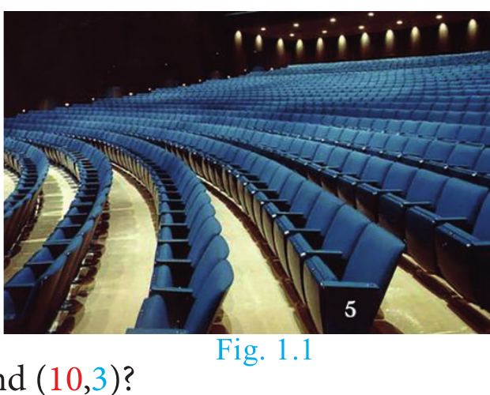

This is one example where a pair of numbers, written in a particular order, precisely indicates a location. Such a number pair is called an ordered pair of numbers. This notion is skillfully used to mathematize the concept of a "Relation".

### 1.3 Cartesian Product

**Illustration 1**

Let us consider the following two sets.

$A$ is the set of 3 vegetables and $B$ is the set of 4 fruits. That is,

$A = \{\text{carrot, brinjal, ladies finger}\}$ and $B = \{\text{apple, orange, grapes, strawberry}\}$

What are the possible ways of choosing a vegetable with a fruit? (Fig.1.2)

| Vegetables (A) | Fruits (B) |
|---|---|
| Carrot ($c$) | Apple ($a$) |
| Brinjal ($b$) | Orange ($o$) |
| Ladies finger ($l$) | Grapes ($g$) |
| | Strawberry ($s$) |

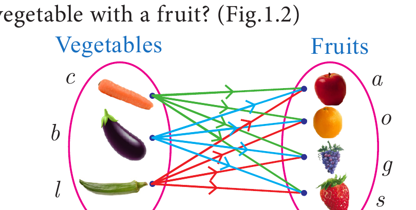

We can select them in 12 distinct pairs as given below.

$(c, a), (c, o), (c, g), (c, s), (b, a), (b, o), (b, g), (b, s), (l, a), (l, o), (l,g), (l, s)$

This collection represents the cartesian product of the set of vegetables and set of fruits.

> **Definition**
>
> If A and B are two non-empty sets, then the set of all ordered pairs $(a, b)$ such that $a \in A, b \in B$ is called the **Cartesian Product of A and B**, and is denoted by $A \times B$.
>
> Thus, $A \times B = \{(a,b) \mid a \in A, b \in B\}$ (read as A cross B). Also note that $A \times \phi = \phi$

> **Note**
> - $A \times B$ is the set of all possible ordered pairs between the elements of $A$ and $B$ such that the first coordinate is an element of $A$ and the second coordinate is an element of $B$.
> - $B \times A$ is the set of all possible ordered pairs between the elements of $A$ and $B$ such that the first coordinate is an element of $B$ and the second coordinate is an element of $A$.
> - In general $(a, b) \neq (b, a)$, in particular, if $a = b$, then $(a, b) = (b, a)$.
> - The "cartesian product" is also referred as "cross product".

**Illustration 2**

Let A = $\{1, 2, 3\}$ and B = $\{a, b\}$. Write $A \times B$ and $B \times A$?

$A \times B = \{1,2,3\} \times \{a,b\} = \{(1,a),(1,b),(2,a),(2,b),(3,a),(3,b)\}$ (as shown in Fig.1.3)

$B \times A = \{a,b\} \times \{1,2,3\} = \{(a,1), (a,2), (a,3),(b,1), (b,2), (b,3)\}$ (as shown in Fig.1.3)

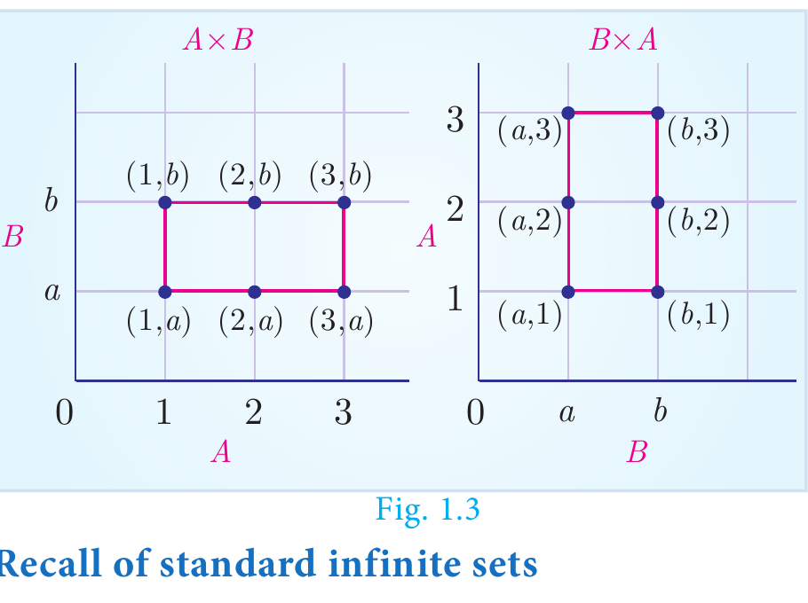

**Thinking Corner**

When will $A \times B$ be equal to $B \times A$?

> **Note**
> - In general $A \times B \neq B \times A$, but $n(A \times B) = n(B \times A)$
> - $A \times B = \phi$ if and only if $A = \phi$ or $B = \phi$
> - If $n(A) = p$ and $n(B) = q$ then $n(A \times B) = pq$

#### Recall of standard infinite sets

Natural Numbers $\mathbb{N} = \{1,2,3,4\ldots\}$; Whole Numbers $\mathbb{W} = \{0,1,2,3, ...\}$;

Integers $\mathbb{Z} = \{..., -2,-1,0,1,2, ...\}$; Rational Numbers $\mathbb{Q} = \left\{\dfrac{p}{q} \mid p,q \in \mathbb{Z}, q \neq 0\right\}$;

Real Numbers $\mathbb{R} = \mathbb{Q} \cup \mathbb{Q}'$, where $\mathbb{Q}'$ is the set of all irrational numbers.

**Illustration 3**

For example, let A be the set of numbers in the interval $[3, 5]$ and $B$ be the set of numbers in the interval $[2,3]$. Then the Cartesian product $A \times B$ corresponds to the rectangular region shown in the Fig. 1.4. It consists of all points $(x, y)$ within the region.

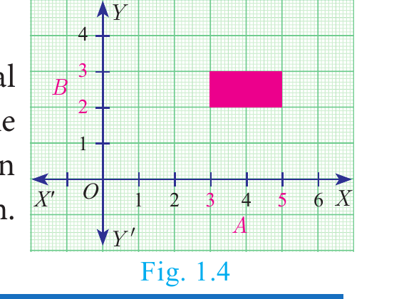

> **Note**
>
> The set of all points in the cartesian plane can be viewed as the set of all ordered pairs $(x, y)$ where $x, y$ are real numbers. In fact, $\mathbb{R} \times \mathbb{R}$ is the set of all points which we call as the cartesian plane.

**Activity 1**

Let $A = \{x \mid x \in \mathbb{N}, x \leq 4\}$, $B = \{y \mid y \in \mathbb{N}, y < 3\}$

Represent $A \times B$ and $B \times A$ in a graph sheet. Can you see the difference between $A \times B$ and $B \times A$?

**Example 1.1** If $A = \{1,3,5\}$ and $B = \{2,3\}$ then (i) find $A \times B$ and $B \times A$.
(ii) Is $A \times B = B \times A$? If not why? (iii) Show that $n(A \times B) = n(B \times A) = n(A) \times n(B)$

**Solution** Given that $A = \{1,3,5\}$ and $B = \{2,3\}$

(i) $A \times B = \{1,3,5\} \times \{2,3\} = \{(1,2), (1,3), (3,2), (3,3), (5,2), (5,3)\}$ ...(1)

$B \times A = \{2,3\} \times \{1,3,5\} = \{(2,1), (2,3), (2,5), (3,1), (3,3), (3,5)\}$ ...(2)

(ii) From (1) and (2) we conclude that $A \times B \neq B \times A$ as $(1,2) \neq (2,1)$ and $(1,3) \neq (3,1)$, etc.

(iii) $n(A)=3$; $n(B) = 2$.

From (1) and (2) we observe that, $n(A \times B) = n(B \times A) = 6$;

we see that, $n(A) \times n(B) = 3 \times 2 = 6$ and $n(B) \times n(A) = 2 \times 3 = 6$

Hence, $n(A \times B) = n(B \times A) = n(A) \times n(B) = 6$.

Thus, $n(A \times B) = n(B \times A) = n(A) \times n(B)$.

**Example 1.2** If $A \times B = \{(3,2), (3,4), (5,2), (5,4)\}$ then find $A$ and $B$.

**Solution** $A \times B = \{(3,2), (3,4), (5,2), (5,4)\}$

We have $A = \{\text{set of all first coordinates of elements of } A \times B\}$. $\therefore A = \{3,5\}$

$B = \{\text{set of all second coordinates of elements of } A \times B\}$. $\therefore B = \{2,4\}$

Thus $A = \{3,5\}$ and $B = \{2,4\}$.

**Example 1.3** Let $A = \{x \in \mathbb{N} \mid 1 < x < 4\}$, $B = \{x \in \mathbb{W} \mid 0 \leq x < 2\}$ and $C = \{x \in \mathbb{N} \mid x < 3\}$. Then verify that

(i) $A \times (B \cup C) = (A \times B) \cup (A \times C)$ &emsp;&emsp;&emsp; (ii) $A \times (B \cap C) = (A \times B) \cap (A \times C)$

**Solution** $A = \{x \in \mathbb{N} \mid 1 < x < 4\} = \{2, 3\}$, $B = \{x \in \mathbb{W} \mid 0 \leq x < 2\} = \{0,1\}$,

$C = \{x \in \mathbb{N} \mid x < 3\} = \{1,2\}$

(i) &emsp; $A \times (B \cup C) = (A \times B) \cup (A \times C)$

$B \cup C = \{0,1\} \cup \{1,2\} = \{0,1,2\}$

$A \times (B \cup C) = \{2,3\} \times \{0,1,2\} = \{(2,0),(2,1),(2,2),(3,0),(3,1),(3,2)\}$ ...(1)

$A \times B = \{2,3\} \times \{0,1\} = \{(2,0),(2,1),(3,0),(3,1)\}$

$A \times C = \{2,3\} \times \{1,2\} = \{(2,1),(2,2),(3,1),(3,2)\}$

$(A \times B) \cup (A \times C) = \{(2,0),(2,1),(3,0),(3,1)\} \cup \{(2,1),(2,2),(3,1),(3,2)\}$

$= \{(2,0),(2,1),(2,2),(3,0),(3,1),(3,2)\}$ ...(2)

From (1) and (2), $A \times (B \cup C) = (A \times B) \cup (A \times C)$ is verified.

(ii) &emsp; $A \times (B \cap C) = (A \times B) \cap (A \times C)$

$B \cap C = \{0,1\} \cap \{1,2\} = \{1\}$

$A \times (B \cap C) = \{2,3\} \times \{1\} = \{(2,1),(3,1)\}$ ...(3)

$A \times B = \{2,3\} \times \{0,1\} = \{(2,0),(2,1),(3,0),(3,1)\}$

$A \times C = \{2,3\} \times \{1,2\} = \{(2,1),(2,2),(3,1),(3,2)\}$

$(A \times B) \cap (A \times C) = \{(2,0),(2,1),(3,0),(3,1)\} \cap \{(2,1),(2,2),(3,1),(3,2)\}$

$= \{(2,1),(3,1)\}$ ...(4)

From (3) and (4), $A \times (B \cap C) = (A \times B) \cap (A \times C)$ is verified.

> **Note**
>
> The above two verified properties are called distributive property of cartesian product over union and intersection respectively. In fact, for any three sets $A$, $B$, $C$ we have
>
> (i) $A \times (B \cup C) = (A \times B) \cup (A \times C)$ &emsp; (ii) $A \times (B \cap C) = (A \times B) \cap (A \times C)$.

#### 1.3.1 Cartesian Product of three Sets

If A, B, C are three non-empty sets then the cartesian product of three sets is the set of all possible ordered triplets given by

$$
A \times B \times C = \{(a,b,c) \text{ for all } a \in A, b \in B, c \in C\}
$$

**Illustration for Geometrical understanding of cartesian product of two and three sets**

Let $A = \{0,1\}$, $B = \{0,1\}$, $C = \{0,1\}$

$A \times B = \{0,1\} \times \{0,1\} = \{(0,0),(0,1),(1,0),(1,1)\}$

Representing $A \times B$ in the $XY$-plane we get a picture shown in Fig. 1.5.

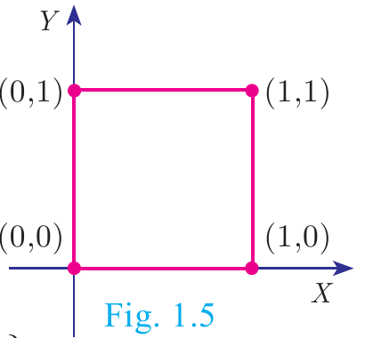

$(A \times B) \times C = \{(0,0),(0,1),(1,0),(1,1)\} \times \{0,1\}$

$= \{(0,0,0),(0,0,1),(0,1,0),(0,1,1),(1,0,0),(1,0,1),(1,1,0),(1,1,1)\}$

Representing $A \times B \times C$ in the $XYZ$-space we get a picture as shown in Fig. 1.6.

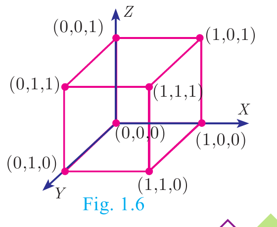

Thus, $A \times B$ represent vertices of a square in two dimensions and $A \times B \times C$ represent vertices of a cube in three dimensions.

> **Note**
>
> In general if we join the cartesian product of two non-empty sets provides a shape in two dimensions and similarly cartesian product of three non-empty sets provide an object in three dimensions.

**Exercise 1.1**

1. Find $A \times B$, $A \times A$ and $B \times A$
   (i) $A = \{2,-2,3\}$ and $B = \{1,-4\}$ &emsp; (ii) $A = B = \{p,q\}$ &emsp; (iii) $A = \{m,n\}$; $B = \phi$

2. Let $A = \{1,2,3\}$ and $B = \{x \mid x \text{ is a prime number less than } 10\}$. Find $A \times B$ and $B \times A$.

3. If $B \times A = \{(-2,3),(-2,4),(0,3),(0,4),(3,3),(3,4)\}$ find $A$ and $B$.

4. If $A = \{5,6\}$, $B = \{4,5,6\}$, $C = \{5,6,7\}$, Show that $A \times A = (B \times B) \cap (C \times C)$.

5. Given A=$\{1,2,3\}$, $B = \{2,3,5\}$, $C = \{3,4\}$ and $D = \{1,3,5\}$, check if $(A \cap C) \times (B \cap D) = (A \times B) \cap (C \times D)$ is true?

6. Let $A = \{x \in W \mid x < 2\}$, $B = \{x \in N \mid 1 < x \leq 4\}$ and $C = \{3,5\}$. Verify that
   (i) $A \times (B \cup C) = (A \times B) \cup (A \times C)$ &emsp; (ii) $A \times (B \cap C) = (A \times B) \cap (A \times C)$
   (iii) $(A \cup B) \times C = (A \times C) \cup (B \times C)$

7. Let $A$ = The set of all natural numbers less than 8, $B$ = The set of all prime numbers less than 8, $C$ = The set of even prime number. Verify that
   (i) $(A \cap B) \times C = (A \times C) \cap (B \times C)$ &emsp; (ii) $A \times (B - C) = (A \times B) - (A \times C)$

### 1.4 Relations

Many day-to-day occurrences involve two objects that are connected with each other by some rule of correspondence. We say that the two objects are related under the specified rule. How shall we represent it? Here are some examples,

| Relationship | Expressing using the symbol R | Representation as ordered pair |
|---|---|---|
| New Delhi is the capital of India | New Delhi R India | (New Delhi, India) |
| Line $AB$ is perpendicular to line $XY$ | line $AB$ R line XY | (line $AB$, line $XY$) |
| −1 is greater than −5 | −1 R −5 | (−1, −5) |
| $\ell$ is a line of symmetry for $\triangle PQR$ | $\ell$ R $\triangle PQR$ | ($\ell$, $\triangle PQR$) |

How are New Delhi and India related? We may expect the response, "New Delhi is the capital of India". But there are several ways in which 'New Delhi' and 'India' are related. Here are some possible answers.

- New Delhi is the capital of India.
- New Delhi is in the northern part of India.
- New Delhi is one of the largest cities of India etc.,

So, when we wish to specify a particular relation, providing only one ordered pair (New Delhi, India) it may not be practically helpful. If we ask the relation in the following set of ordered pairs,

$\{(\text{New Delhi, India}), (\text{Washington, USA}), (\text{Beijing, China}), (\text{London, U.K.}), (\text{Kathmandu, Nepal})\}$

then specifying the relation is easy.

**Progress Check**

Let A = $\{1, 2, 3, 4\}$ and B = $\{a, b, c\}$.

1. Which of the following are relations from A to B?
   (i) $\{(1, b), (1, c), (3, a), (4, b)\}$ &emsp; (ii) $\{(1, a), (b, 4), (c, 3)\}$ &emsp; (iii) $\{(1, a), (a, 1), (2, b), (b, 2)\}$

2. Which of the following are relations from $B$ to $A$?
   (i) $\{(c, a), (c, b), (c, 1)\}$ &emsp; (ii) $\{(c, 1), (c, 2), (c, 3), (c, 4)\}$ &emsp; (iii) $\{(a, 4), (b, 3), (c, 2)\}$

**Illustration 4**

| Students in a class | $S_1$ | $S_2$ | $S_3$ | $S_4$ | $S_5$ | $S_6$ | $S_7$ | $S_8$ | $S_9$ | $S_{10}$ |
|---|---|---|---|---|---|---|---|---|---|---|
| Heights (in feet) | 4.5 | 5.2 | 5 | 4.5 | 5 | 5.1 | 5.2 | 5 | 4.7 | 4.9 |

Let us define a relation between heights of corresponding students. (Fig.1.7)

$R = \{(\text{heights, students})\}$

$R = \big\{(4.5,S_1), (4.5,S_4), (4.7,S_9), (4.9,S_{10}), (5,S_3), (5,S_5),(5,S_8), (5.1,S_6), (5.2,S_2), (5.2,S_7)\big\}$

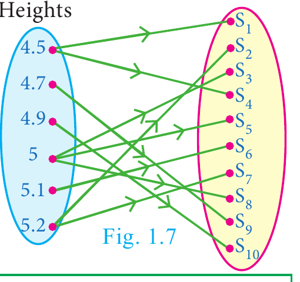

> **Definition**
>
> Let $A$ and $B$ be any two non-empty sets. A 'relation' R from $A$ to $B$ is a subset of $A \times B$ satisfying some specified conditions. If $x \in A$ is related to $y \in B$ through R, then we write it as $x \mathrm{R} y$. $x \mathrm{R} y$ if and only if $(x,y) \in \mathrm{R}$.

The **domain** of the relation R $= \{x \in A \mid x \mathrm{R} y, \text{for some } y \in B\}$

The **co-domain** of the relation R is $B$

The **range** of the relation R $= \{y \in B \mid x \mathrm{R} y, \text{for some } x \in A\}$

From these definitions, we note that domain of R $\subseteq A$, co-domain of R $= B$ and range of R $\subseteq B$.

**Illustration 5**

Let $A = \{1,2,3,4,5\}$ and $B = \{\text{Mathi, Arul, John}\}$

A relation R between the above sets $A$ and $B$ can be represented by an arrow diagram (Fig. 1.8).

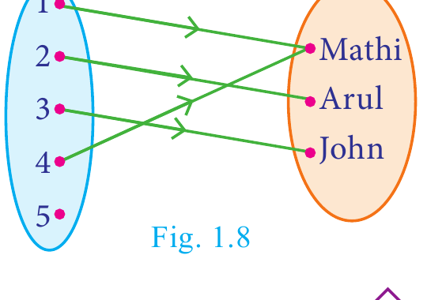

Then, domain of R $= \{1,2,3,4\}$

range of R $= \{\text{Mathi, Arul, John}\} = $ co-domain of R.

Note that domain of R is a proper subset of $A$.

**Activity 2**

Let $A$ and $B$ be the set of lines in $xy$-plane such that $A$ consists of lines parallel to $X$-axis. For $x \in A$, $y \in B$, let R be a relation from $A$ to $B$ defined by $x \mathrm{R} y$ if $x$ is perpendicular to $y$. Find the elements of $B$ using a graph sheet.

**Illustration 6**

Let $A = \{1,3,5,7\}$ and $B = \{4,8\}$. If R is a relation defined by "is less than" from $A$ to $B$, then 1R4 ($\because$ 1 is less than 4). Similarly, it is observed that 1R8, 3R4, 3R8, 5R8, 7R8

Equivalently R= $\{(1,4), (1,8), (3,4), (3,8), (5,8), (7,8)\}$

> **Note**
>
> In the above illustration $A \times B = \{(1,4), (1,8), (3,4), (3,8), (5,4), (5,8), (7,4),(7,8)\}$
>
> R = $\{(1,4), (1,8), (3,4), (3,8), (5,8), (7,8)\}$ We see that R is a subset of $A \times B$.

**Illustration 7**

In a particular area of a town, let us consider ten families $A, B, C, D, E, F, G, H, I$ and $J$ with two children. Among these, families $B, F, I$ have two girls; $D, G, J$ have one boy and one girl; the remaining have two boys. Let us define a relation R by $x \mathrm{R} y$, where $x$ denote the number of boys and $y$ denote the family with $x$ number of boys. Represent this situation as a relation through ordered pairs and arrow diagram.

Since the domain of the relation R is concerned about the number of boys, and we are considering families with two children, the domain of R will consist of three elements given by $\{0,1,2\}$, where 0, 1, 2 represent the number of boys say no, one, two boys respectively. We note that families with two girls are the ones with no boys. Hence the relation R is given by

$$
R = \{(0,B),(0,F),(0,I),(1,D),(1,G),(1,J),(2,A),(2,C),(2,E),(2,H)\}
$$

This relation is shown in an arrow diagram (Fig.1.9).

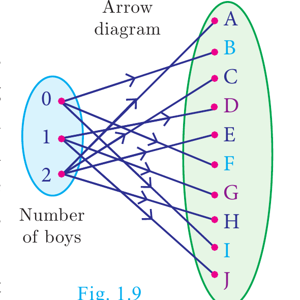

**Example 1.4** Let $A = \{3,4,7,8\}$ and $B = \{1,7,10\}$. Which of the following sets are relations from $A$ to $B$?

(i) $R_1 = \{(3,7), (4,7), (7,10), (8,1)\}$ &emsp;&emsp; (ii) $R_2 = \{(3,1), (4,12)\}$

(iii) $R_3 = \{(3,7), (4,10), (7,7), (7,8), (8,11), (8,7), (8,10)\}$

**Solution** $A \times B = \{(3,1), (3,7), (3,10), (4,1), (4,7), (4,10), (7,1), (7,7), (7,10), (8,1), (8,7), (8,10)\}$

(i) We note that, $R_1 \subseteq A \times B$. Thus, $R_1$ is a relation from $A$ to $B$.

(ii) Here, $(4,12) \in R_2$, but $(4,12) \notin A \times B$. So, $R_2$ is not a relation from $A$ to $B$.

(iii) Here, $(7,8) \in R_3$, but $(7,8) \notin A \times B$. So, $R_3$ is not a relation from $A$ to $B$.

> **Note**
> - A relation may be represented algebraically either by the roster method or by the set builder method.
> - An arrow diagram is a visual representation of a relation.

**Example 1.5** The arrow diagram shows (Fig.1.10) a relationship between the sets $P$ and $Q$. Write the relation in (i) Set builder form (ii) Roster form (iii) What is the domain and range of R.

**Solution**

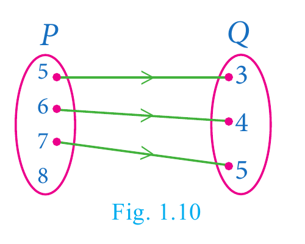

(i) Set builder form of R $= \{(x,y) \mid y = x - 2, \ x \in P, y \in Q\}$

(ii) Roster form R $= \{(5,3),(6,4),(7,5)\}$

(iii) Domain of R $= \{5,6,7\}$ and range of R $= \{3,4,5\}$

> **'Null relation'**
>
> Let us consider the following example. Suppose $A = \{-3,-2,-1\}$ and $B = \{1,2,3,4\}$. A relation from $A$ to $B$ is defined as $a - b = 8$ i.e., there is no pair $(a,b)$ such that $a - b = 8$. Thus R contain no element and so R $= \phi$.
>
> A relation which contains no element is called a "Null relation".

> **Do You Know?**
>
> If $n(A) = p$, $n(B) = q$, then the total number of relations that exist from $A$ to $B$ is $2^{pq}$.

**Exercise 1.2**

1. Let $A = \{1,2,3,7\}$ and $B = \{3,0,-1,7\}$, which of the following are relation from $A$ to $B$?
   (i) $R_1 = \{(2,1), (7,1)\}$ &emsp;&emsp;&emsp;&emsp;&emsp;&emsp;&emsp; (ii) $R_2 = \{(-1,1)\}$
   (iii) $R_3 = \{(2,-1), (7,7), (1,3)\}$ &emsp;&emsp; (iv) $R_4 = \{(7,-1), (0,3), (3,3), (0,7)\}$

2. Let $A = \{1,2,3,4,...,45\}$ and $R$ be the relation defined as "square is of a number" on $A$. Write R as a subset of $A \times A$. Also, find the domain and range of R.

3. A Relation R is given by the set $\{(x,y) \mid y = x + 3, x \in \{0,1,2,3,4,5\}\}$. Determine its domain and range.

4. Represent each of the given relations by (a) an arrow diagram, (b) a graph and (c) a set in roster form, wherever possible.
   (i) $\{(x,y) \mid x = 2y, x \in \{2,3,4,5\}, y \in \{1,2,3,4\}\}$
   (ii) $\{(x,y) \mid y = x+3, x, y \text{ are natural numbers} < 10\}$

5. A company has four categories of employees given by Assistants ($A$), Clerks ($C$), Managers ($M$) and an Executive Officer ($E$). The company provide ₹10,000, ₹25,000, ₹50,000 and ₹1,00,000 as salaries to the people who work in the categories $A$, $C$, $M$ and $E$ respectively. If $A_1, A_2, A_3, A_4$ and $A_5$ were Assistants; $C_1, C_2, C_3, C_4$ were Clerks; $M_1, M_2, M_3$ were managers and $E_1, E_2$ were Executive officers and if the relation R is defined by $x \mathrm{R} y$, where $x$ is the salary given to person $y$, express the relation R through an ordered pair and an arrow diagram.

### 1.5 Functions

Among several relations that exist between two non-empty sets, some special relations are important for further exploration. Such relations are called "Functions".

**Illustration 8**

A company has 5 employees in different categories. If we consider their salary distribution for a month as shown by arrow diagram in Fig.1.11, we see that there is only one salary associated for every employee of the company.

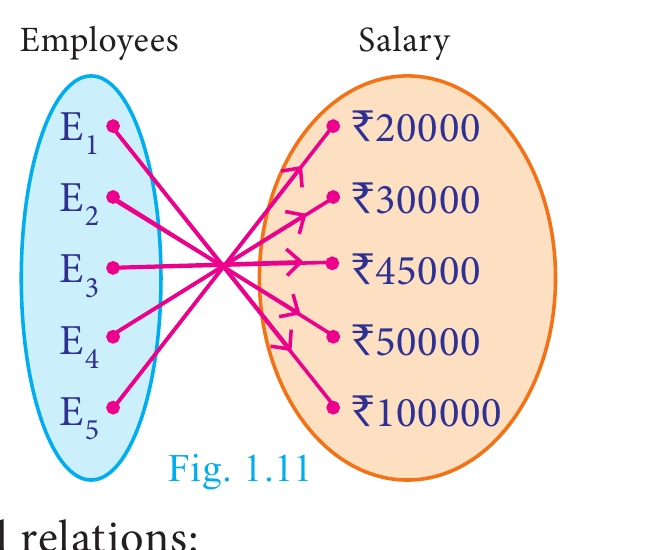

Here are various real life situations illustrating some special relations:

1. Consider the set $A$ of all of your classmates; corresponding to each student, there is only one age.
2. You go to a shop to buy a book. If you take out a book, there is only one price corresponding to it; it does not have two prices corresponding to it. (of course, many books may have the same price).
3. You are aware of Boyle's law. Corresponding to a given value of pressure $P$, there is only one value of volume $V$.
4. In Economics, the quantity demanded can be expressed as $Q = 360 - 4P$, where P is the price of the commodity. We see that for each value of $P$, there is only one value of $Q$. Thus the quantity demanded $Q$ depend on the price $P$ of the commodity.

We often come across certain relations, in which, for each element of a set $A$, there is only one corresponding element of a set $B$. Such relations are called functions. We usually use the symbol $f$ to denote a functional relation.

> **Definition**
>
> A relation $f$ between two non-empty sets $X$ and $Y$ is called a **function** from $X$ to $Y$ if, for each $x \in X$ there exists only one $y \in Y$ such that $(x,y) \in f$.
>
> That is, $f = \{(x,y) \mid \text{for all } x \in X, y \in Y\}$.

A function $f$ from $X$ to $Y$ is written as $f: X \to Y$.

Comparing the definitions of relation and function, we see that every function is a relation. Thus, functions are subsets of relations and relations are subsets of cartesian product. (Fig.1.12(a))

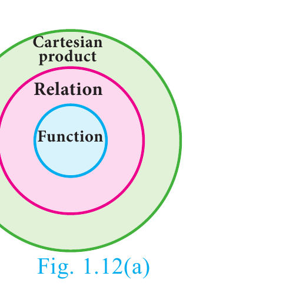

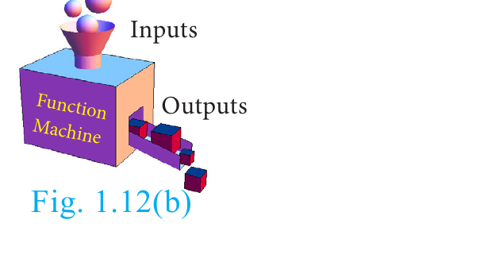
A function $f$ can be thought as a mechanism (or device) (Fig.1.12($b$)), which gives a unique output $f(x)$ to every input $x$.

> **Do You Know?**
> A function is also called as a mapping or transformation.

> **Note**
>
> If $f : X \to Y$ is a function then
>
> - The set $X$ is called the domain of the function $f$ and the set $Y$ is called its co-domain.
> - If $f(a) = b$, then $b$ is called 'image' of $a$ under $f$ and $a$ is called a 'pre-image' of $b$.
> - The set of all images of the elements of $X$ under $f$ is called the 'range' of $f$.
> - $f : X \to Y$ is a function only if
>   (i) every element in the domain of $f$ has an image.
>   (ii) the image is unique.
> - If $A$ and $B$ are finite sets such that $n(A) = p$, $n(B) = q$ then the total number of functions that exist from $A$ to $B$ is $q^p$.
> - In this chapter we always consider $f$ to be a real valued function.
> - Describing domain of a function
>
>   (i) Let $f(x) = \dfrac{1}{x+1}$. If $x = -1$ then $f(-1)$ is not defined. Hence $f$ is defined for all real numbers except at $x = -1$. So, domain of $f$ is $\mathbb{R} - \{-1\}$.
>
>   (ii) Let $f(x) = \dfrac{1}{x^2 - 5x + 6}$; If $x = 2,3$ then $f(2)$ and $f(3)$ are not defined. Hence $f$ is defined for all real numbers except at $x = 2$ and 3. So, domain of $f = \mathbb{R} - \{2,3\}$.

> **Progress Check**
>
> 1. Relations are subsets of ____. Functions are subsets of ____.
> 2. True or False: All the elements of a relation should have images.
> 3. True or False: All the elements of a function should have images.
> 4. True or False: If R $: A \to B$ is a relation then the domain of R $= A$.
> 5. If $f : \mathbb{N} \to \mathbb{N}$ is defined as $f(x) = x^2$ the image of 1 and 2 are ____ and ____.
> 6. What is the difference between relation and function?
> 7. Let $A$ and $B$ be two non-empty finite sets. Then which one among the following two collection is large?
>    (i) The number of relations between $A$ and $B$.
>    (ii) The number of functions between $A$ and $B$.

**Illustration 9 - Testing for functions**

**Representation by Arrow diagram**

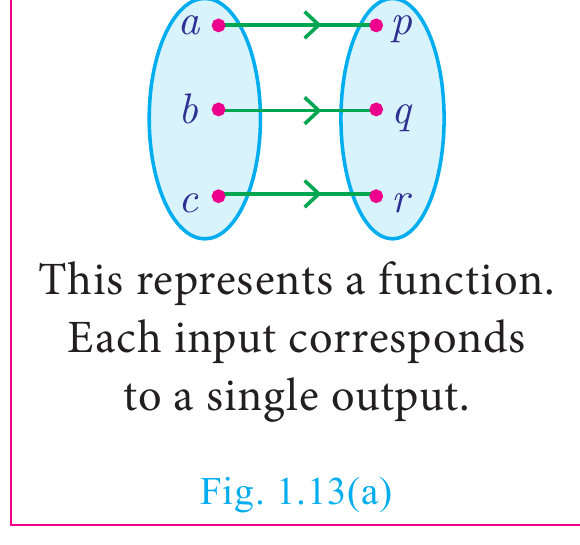

This represents a function. Each input corresponds to a single output.

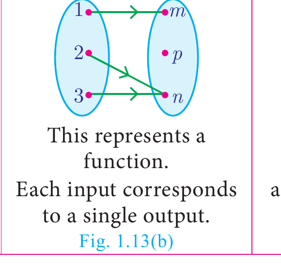

This represents a function. Each input corresponds to a single output.

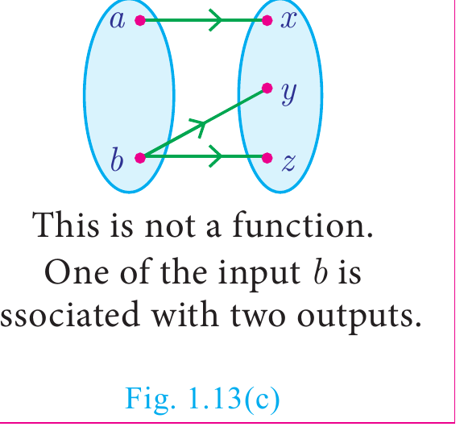

This is not a function. One of the input $b$ is associated with two outputs.

Functions play very important role in the understanding of higher ideas in mathematics. They are basic tools to convert from one form to another form. In this sense, functions are widely applied in Engineering Sciences.

> **Note**
> The range of a function is a subset of its co-domain.

**Example 1.6** Let $X = \{1,2,3,4\}$ and $Y = \{2,4,6,8,10\}$ and R $= \{(1,2),(2,4),(3,6),(4,8)\}$. Show that R is a function and find its domain, co-domain and range?

**Solution** Pictorial representation of R is given in Fig.1.14. From the diagram, we see that for each $x \in X$, there exists only one $y \in Y$. Thus all elements in $X$ have only one image in $Y$. Therefore R is a function.

Domain $X = \{1,2,3,4\}$; Co-domain $Y = \{2,4,6,8,10\}$; Range of $f = \{2,4,6,8\}$.

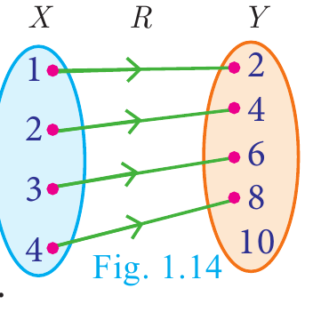

**Example 1.7** A relation $f : X \to Y$ is defined by $f(x) = x^2 - 2$ where, $X = \{-2,-1,0,3\}$ and $Y = \mathbb{R}$. (i) List the elements of $f$ (ii) Is $f$ a function?

**Solution** $f(x) = x^2 - 2$ where $X = \{-2,-1,0,3\}$

(i)
$$f(-2) = (-2)^2 - 2 = 2 ; \quad f(-1) = (-1)^2 - 2 = -1$$
$$f(0) = (0)^2 - 2 = -2 ; \quad f(3) = (3)^2 - 2 = 7$$
$$\therefore f = \{(-2,2),(-1,-1),(0,-2),(3,7)\}$$

(ii) We note that each element in the domain of $f$ has a unique image. Therefore, $f$ is a function.

> **Thinking Corner**
> Is the relation representing the association between planets and their respective moons a function?

**Example 1.8** If $X = \{-5,1,3,4\}$ and Y $= \{a,b,c\}$, then which of the following relations are functions from $X$ to $Y$?

(i) $R_1 = \{(-5,a), (1,a), (3,b)\}$ &emsp; (ii) $R_2 = \{(-5,b), (1,b), (3,a),(4,c)\}$

(iii) $R_3 = \{(-5,a), (1,a), (3,b),(4,c),(1,b)\}$

**Solution**

(i) $R_1 = \{(-5,a), (1,a), (3,b)\}$

We may represent the relation $R_1$ in an arrow diagram (Fig.1.15(a)).

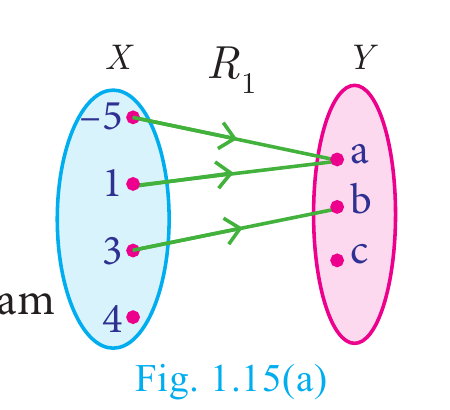

$R_1$ is not a function as $4 \in X$ does not have an image in $Y$.

(ii) $R_2 = \{(-5,b), (1,b), (3,a),(4,c)\}$

Arrow diagram of $R_2$ is shown in Fig.1.15(b).

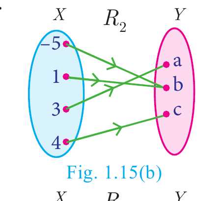

$R_2$ is a function as each element of $X$ has an unique image in $Y$.

(iii) $R_3 = \{(-5,a), (1,a), (3,b),(4,c),(1,b)\}$

Representing $R_3$ in an arrow diagram (Fig.1.15(c)).

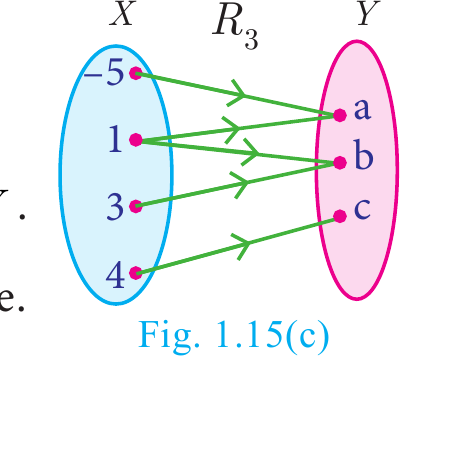

$R_3$ is not a function as $1 \in X$ has two images $a \in Y$ and $b \in Y$.

Note that the image of an element should always be unique.

**Example 1.9** Given $f(x) = 2x - x^2$, find (i) $f(1)$ (ii) $f(x+1)$ (iii) $f(x) + f(1)$

**Solution** (i) $x = 1$, we get

$$f(1) = 2(1) - (1)^2 = 2 - 1 = 1$$

(ii) $x = x+1$, we get

$$f(x+1) = 2(x+1) - (x+1)^2 = 2x + 2 - (x^2 + 2x + 1) = -x^2 + 1$$

(iii) $f(x) + f(1) = (2x - x^2) + 1 = -x^2 + 2x + 1$

[Note that $f(x) + f(1) \neq f(x+1)$. In general $f(a+b)$ is not equal to $f(a) + f(b)$]

#### Exercise 1.3

1. Let $f = \{(x,y) \mid x,y \in N \text{ and } y = 2x\}$ be a relation on N. Find the domain, co-domain and range. Is this relation a function?
2. Let $X = \{3,4,6,8\}$. Determine whether the relation $R = \{(x,f(x)) \mid x \in X, f(x) = x^2+1\}$ is a function from $X$ to $N$?
3. Given the function $f : x \to x^2 - 5x + 6$, evaluate

   (i) $f(-1)$ &emsp;&emsp;&emsp;&emsp;&emsp;&emsp;&emsp;&emsp; (ii) $f(2a)$

   (iii) $f(2)$ &emsp;&emsp;&emsp;&emsp;&emsp;&emsp;&emsp;&emsp;&emsp; (iv) $f(x-1)$

4. A graph representing the function $f(x)$ is given in Fig.1.16 it is clear that $f(9) = 2$.

   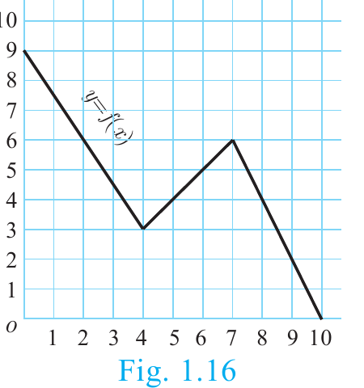

   (i) Find the following values of the function

   (a) $f(0)$ &emsp; (b) $f(7)$ &emsp; (c) $f(2)$ &emsp; (d) $f(10)$

   (ii) For what value of $x$ is $f(x) = 1$?

   (iii) Describe the following (i) Domain (ii) Range.

   (iv) What is the image of 6 under $f$?

5. Let $f(x) = 2x+5$. If $x \neq 0$ then find $\dfrac{f(x+2) - f(2)}{x}$.

6. A function $f$ is defined by $f(x) = 2x - 3$

   (i) find $\dfrac{f(0) + f(1)}{2}$.

   (ii) find $x$ such that $f(x) = 0$.

   (iii) find $x$ such that $f(x) = x$.

   (iv) find $x$ such that $f(x) = f(1-x)$.

7. An open box is to be made from a square piece of material, 24 cm on a side, by cutting equal squares from the corners and turning up the sides as shown (Fig.1.17). Express the volume $V$ of the box as a function of $x$.

   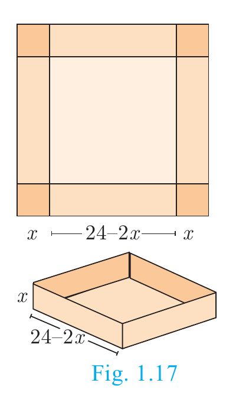

8. A function $f$ is defined by $f(x) = 3 - 2x$. Find $x$ such that $f(x^2) = (f(x))^2$.

9. A plane is flying at a speed of 500 km per hour. Express the distance '$d$' travelled by the plane as function of time $t$ in hours.

10. The data in the adjacent table depicts the length of a person forehand and their corresponding height. Based on this data, a student finds a relationship between the height ($y$) and the forehand length($x$) as $y = ax+b$, where $a, b$ are constants.

    | Length '$x$' of forehand (in cm) | Height '$y$' (in inches) |
    |:---:|:---:|
    | 35 | 56 |
    | 45 | 65 |
    | 50 | 69.5 |
    | 55 | 74 |

    (i) Check if this relation is a function.

    (ii) Find $a$ and $b$.

    (iii) Find the height of a person whose forehand length is 40 cm.

    (iv) Find the length of forehand of a person if the height is 53.3 inches.

### 1.6 Representation of Functions

A function may be represented by

(a) a set of ordered pairs &emsp;&emsp;&emsp;&emsp;&emsp; (b) a table form

(c) an arrow diagram &emsp;&emsp;&emsp;&emsp;&emsp;&emsp;&emsp; (d) a graphical form

Let $f : A \to B$ be a function

**(a) Set of ordered pairs**

The set $f = \{(x,y) \mid y = f(x), x \in A\}$ of all ordered pairs represent a function.

**(b) Table form**

The values of $x$ and the values of their respective images under $f$ can be given in the form of a table.

**(c) Arrow diagram**

An arrow diagram indicates the elements of the domain of $f$ and their respective images by means of arrows.

**(d) Graph**

The ordered pairs in the collection $f = \{(x,y) \mid y = f(x), x \in A\}$ are plotted as points in the $XY$-plane. The graph of $f$ is the totality of all such points.

Every function can be represented by a curve in a graph. But not every curve drawn in a graph will represent a function.

The following test will help us in determining whether a given curve is a function or not.

#### 1.6.1 Vertical line test

A curve drawn in a graph represents a function, if every vertical line intersects the curve at only one point.

**Example 1.10** Using vertical line test, determine which of the following curves (Fig.1.18(a), 1.18(b), 1.18(c), 1.18(d)) represent a function?

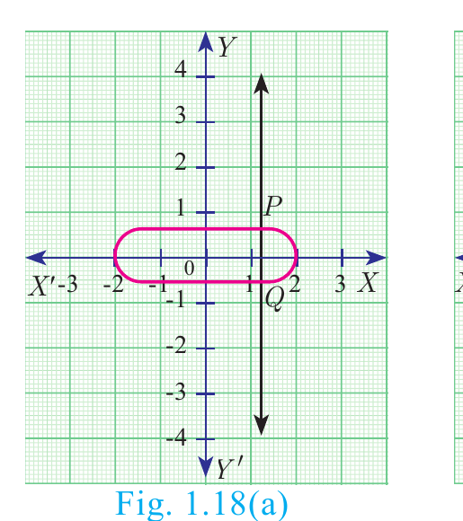 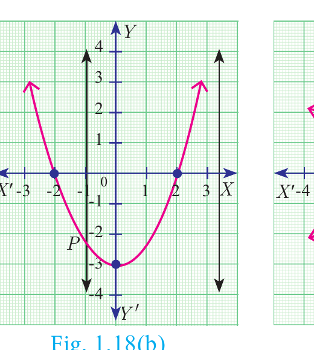 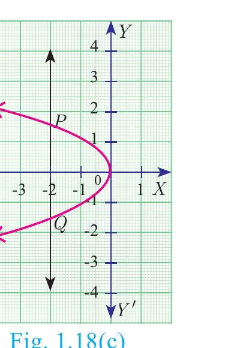

**Solution** The curves in Fig.1.18 ($a$) and Fig.1.18 ($c$) do not represent a function as the vertical lines meet the curves in two points $P$ and $Q$.

The curves in Fig.1.18 (b) and Fig.1.18 (d) represent a function as the vertical lines meet the curve in at most one point.

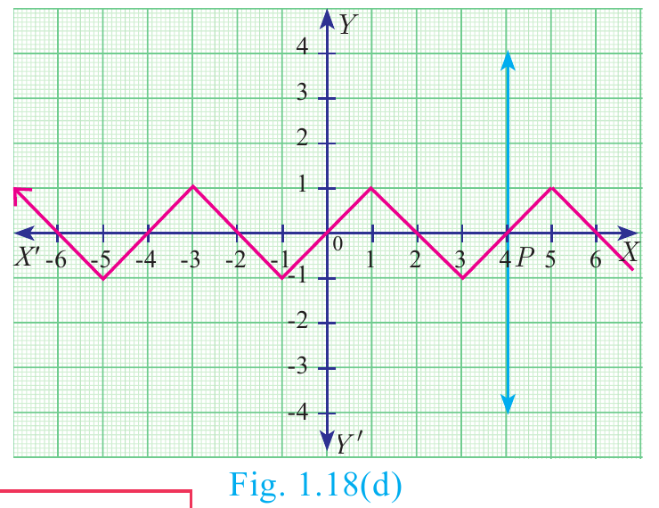

> **Note**
> Any equation represented in a graph is usually called a curve.

**Example 1.11** Let $A = \{1,2,3,4\}$ and $B = \{2,5,8,11,14\}$ be two sets. Let $f : A \to B$ be a function given by $f(x) = 3x - 1$. Represent this function

(i) by arrow diagram &emsp;&emsp;&emsp;&emsp;&emsp; (ii) in a table form

(iii) as a set of ordered pairs &emsp;&emsp; (iv) in a graphical form

**Solution**

$$A = \{1,2,3,4\} ; \ B = \{2,5,8,11,14\} ; \ f(x) = 3x - 1$$
$$f(1) = 3(1) - 1 = 3 - 1 = 2 ; \quad f(2) = 3(2) - 1 = 6 - 1 = 5$$
$$f(3) = 3(3) - 1 = 9 - 1 = 8 ; \quad f(4) = 4(3) - 1 = 12 - 1 = 11$$

**(i) Arrow diagram**

Let us represent the function $f : A \to B$ by an arrow diagram (Fig.1.19).

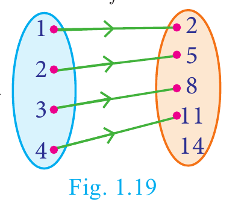

**(ii) Table form**

The given function $f$ can be represented in a tabular form as given below

| $x$ | 1 | 2 | 3 | 4 |
|:---:|:---:|:---:|:---:|:---:|
| $f(x)$ | 2 | 5 | 8 | 11 |

**(iii) Set of ordered pairs**

The function $f$ can be represented as a set of ordered pairs as

$$f = \{(1,2),(2,5),(3,8),(4,11)\}$$

**(iv) Graphical form**

In the adjacent $XY$-plane the points $(1,2), (2,5), (3,8), (4,11)$ are plotted (Fig.1.20).

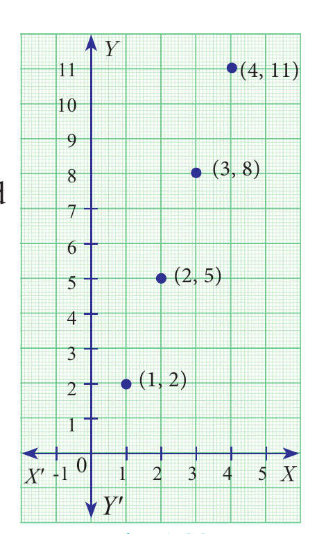
### 1.7 Types of Functions

In this section, we will discuss the following types of functions with suitable examples.

(i) one – one   (ii) many – one   (iii) onto   (iv) into

#### 1.7.1 One – one function

Let us assume that we have a cell phone with proper working condition. If you make a usual call to your friend then you can make only one call at a time (Fig.1.21).

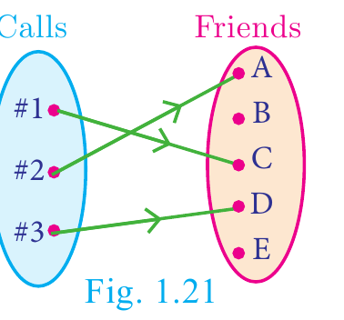

If we treat making calls as a function, then it will be one - one.

> A function $f : A \to B$ is called **one – one function** if distinct elements of $A$ have distinct images in $B$.

A one-one function is also called an **injection**.

Equivalently,

> If for all $a_1, a_2 \in A$, $f(a_1) = f(a_2)$ implies $a_1 = a_2$, then $f$ is called **one – one function**.

**Illustration 10**

$A = \{1,2,3,4\}$ and $B = \{a,b,c,d,e\}$

(i) Let $f = \{(1,a), (2,b), (3,d), (4,c)\}$

In Fig. 1.22, for different elements in $A$, there are different images in $B$.

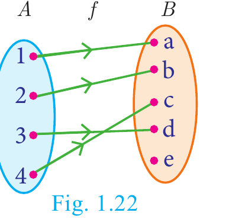

Hence $f$ is a one – one function.

(ii) Let $g = \{(1,b), (2,b), (3,c), (4,e)\}$

$g$ is a function from $A$ to $B$ such that $g(1) = g(2) = b$, but $1 \neq 2$. Thus two distinct elements 1 and 2 in the first set $A$ have same image $b$ the second set in $B$ (Fig.1.23). Hence, $g$ is not a one–one function.

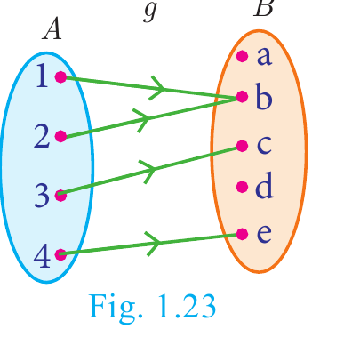

#### 1.7.2 Many – one function

In a theatre complex three films $F_1$, $F_2$, $F_3$ are shown. Seven persons ($P_1$ to $P_7$) arrive at the theatre and buy tickets as shown (Fig.1.24).

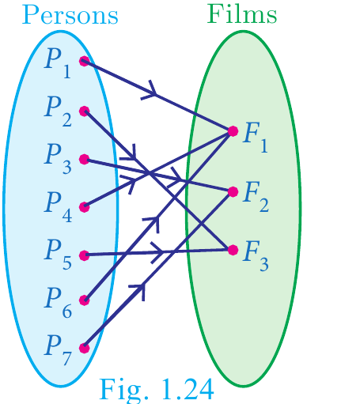

If the selection of films is considered as a relation, then this is a function which is many–one, since more than one person may choose to watch the same film.

> A function $f : A \to B$ is called **many-one function** if two or more elements of $A$ have same image in $B$.

In other words, a function $f : A \to B$ is called many-one if $f$ it is not one–one.

**Illustration 11**

Let $A = \{1,2,3,4\}$ and $B = \{a,b,c\}$, $f = \{(1,a), (2,a), (3,b), (4,c)\}$

Then $f$ is a function from $A$ to $B$ in which different elements 1 and 2 of $A$ have the same image $a$ in $B$. Hence $f$ is a many – one function.

#### 1.7.3 Onto function

In a mobile phone assume that there are 3 persons in the contact. If every person in the contact receives a call, then the function representing making calls will be onto. (Fig.1.25)

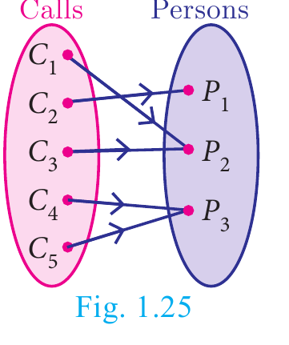

> A function $f : A \to B$ is said to be **onto function** if the range of $f$ is equal to the co-domain of $f$.

In other words, every element in the co-domain $B$ has a pre-image in the domain $A$.

An onto function is also called a **surjection**.

>**Note**
>
> If $f : A \to B$ is an onto function then, the range of $f = B$.

**Illustration 12**

Let $A = \{x,y,z\}, B = \{l,m,n\}$;

Range of $f = \{l,m,n\} = B$ (Fig.1.26)

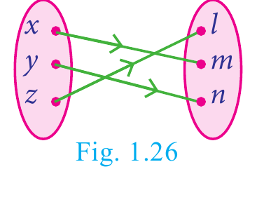

Hence $f$ is an onto function.

#### 1.7.4 Into function

In a home appliance showroom, the products television, air conditioner, washing machine and water heater were provided with 20% discount as new year sale offer. If the selection of the above products by the three customers $C_1$, $C_2$, $C_3$ is considered as a function then the following diagram (Fig.1.27) will represent an into function.

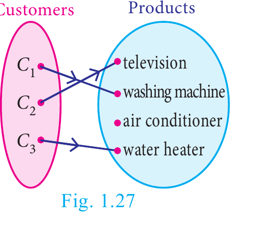

During winter season customers usually do not prefer buying air conditioner. Here air conditioner is not chosen by any customer. This is an example of into function.

> A function $f : A \to B$ is called an **into function** if there exists atleast one element in $B$ which is not the image of any element of $A$.

That is the range of $f$ is a proper subset of the co-domain of $f$.

In other words, a function $f : A \to B$ is called 'into' if it is not 'onto'.

**Illustration 13**

Let $A = \{1,2,3\}$ and $B = \{w,x,y,z\}$, $f = \{(1,w),(2,z),(3,x)\}$

Here, range of $f = \{w, x, z\} \subset B$ (Fig.1.28)

$\therefore f$ is a into function.

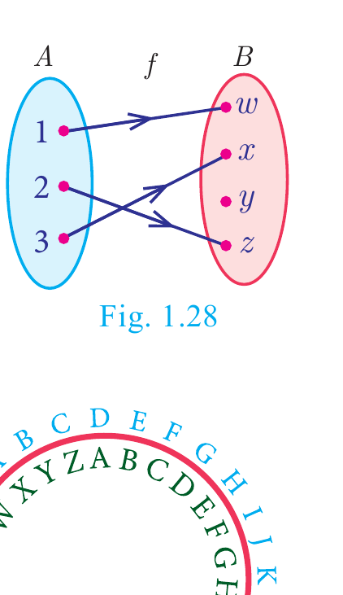

Note that $y \in B$ is not an image of any element in $A$.

#### 1.7.5 Bijection

Consider the circle where each letter of the English alphabet is changed from inner portion to a letter in the outer portion. Thus $A \to D$, $B \to E$, $C \to F$, … $Z \to C$. We call this circle as 'cipher circle'. (Fig.1.29) In this way if we try to change the word 'HELLO' then it will become 'KHOOR'. Now using the same circle if we substitute for each outer letter the corresponding inner letter we will get back the word 'HELLO'. This process of converting from one form to an other form and receiving back the required information is called **bijection**. This process is widely used in the study of secret codes called **cryptography**.

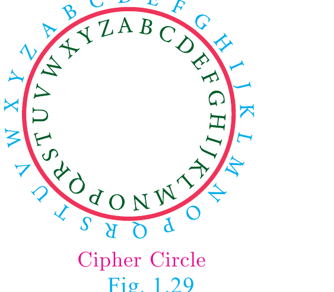

> If a function $f : A \to B$ is both one–one and onto, then $f$ is called a **bijection** from $A$ to $B$.

**Illustration 14**

| one to one and onto function (Bijection) | |
|---|---|
| 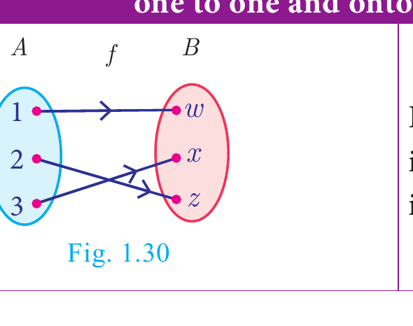 | Distinct elements of $A$ have distinct images in $B$ and every element in $B$ has a pre-image in $A$. |

**Illustration 15**

| One to One | Many to One |
|---|---|
| 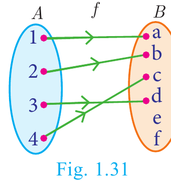 | 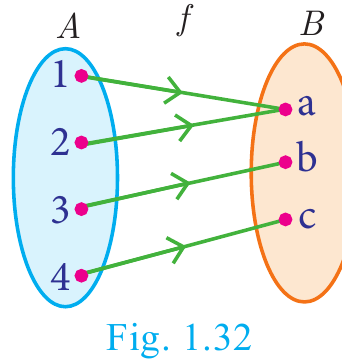 |
| Distinct elements of $A$ have distinct images in $B$. | Two or more elements of $A$ have same image in $B$. |

>**Note**
>
> A one – one and onto function is also called a **one – one correspondence**.

>**Thinking Corner**
>
> Can there be a one to many function?

| Onto | Into |
|---|---|
| 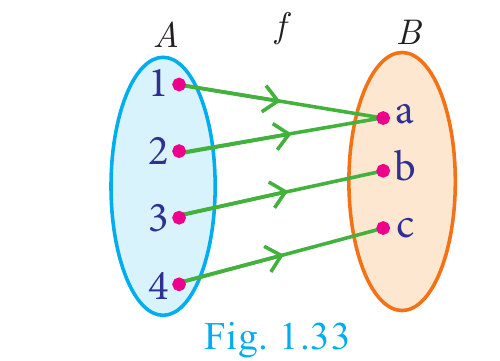 | 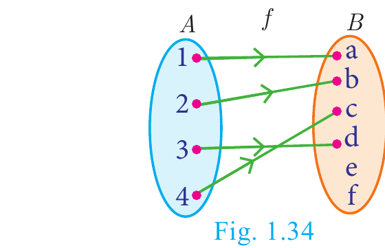 |
| Range of $f$ = co-domain ( Every element in $B$ has a pre-image in $A$) | Range of $f$ is a proper subset of co-domain (There exists at least one element in $B$ which is not the image of any element of $A$) |

To determine whether the given function is one–one or not the following test may help us.

### 1.7.6 Horizontal Line Test

Previously we have seen the vertical line test. Now let us see the horizontal line test. "A function represented in a graph is one–one, if every horizontal line intersects the curve at only one point".

**Example 1.12** Using horizontal line test (Fig.1.35 (a), 1.35 (b), 1.35 (c)), determine which of the following functions are one – one.

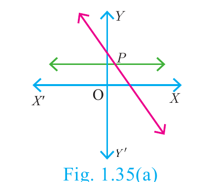 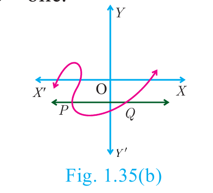 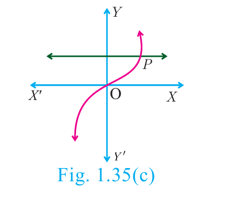

**Solution** The curves in Fig.1.35 (a) and Fig.1.35 (c) represent a one–one function as the horizontal lines meet the curves in only one point $P$.

The curve in Fig. 1.35 (b) does not represent a one–one function, since, the horizontal line intersects the curve at two points $P$ and $Q$.

**Example 1.13** Let $A = \{1,2,3\}$, $B = \{4,5,6,7\}$ and $f = \{(1,4),(2,5),(3,6)\}$ be a function from $A$ to $B$. Show that $f$ is one – one but not onto function.

**Solution** $A = \{1,2,3\}$, $B = \{4,5,6,7\}$; $f = \{(1,4),(2,5),(3,6)\}$

Then $f$ is a function from $A$ to $B$ and for different elements in $A$, there are different images in $B$. Hence $f$ is one–one function. Note that the element 7 in the co-domain does not have any pre-image in the domain. Hence $f$ is not onto (Fig.1.36).

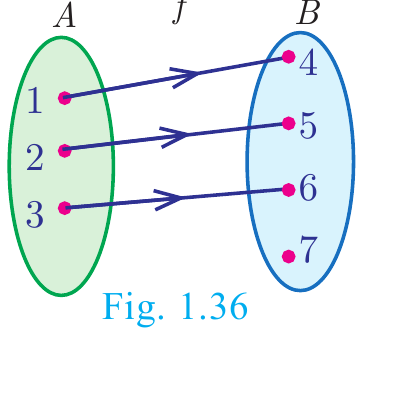

$\therefore f$ is one–one but not an onto function.

**Example 1.14** If $A = \{-2,-1,0,1,2\}$ and $f : A \to B$ is an onto function defined by $f(x) = x^2 + x + 1$ then find $B$.

**Solution** Given $A = \{-2,-1,0,1,2\}$ and $f(x) = x^2 + x + 1$.

$$f(-2) = (-2)^2 + (-2) + 1 = 3;$$
$$f(-1) = (-1)^2 + (-1) + 1 = 1$$
$$f(0) = 0^2 + 0 + 1 = 1;$$
$$f(1) = 1^2 + 1 + 1 = 3$$
$$f(2) = 2^2 + 2 + 1 = 7$$

$\therefore B = \{1, 3, 7\}$.

**Example 1.15** Let $f$ be a function $f : \mathbb{N} \to \mathbb{N}$ be defined by $f(x) = 3x + 2, x \in \mathbb{N}$

(i) Find the images of 1, 2, 3   (ii) Find the pre-images of 29, 53

(ii) Identify the type of function

**Solution** The function $f : \mathbb{N} \to \mathbb{N}$ is defined by $f(x) = 3x + 2$

(i) If $x = 1$, $f(1) = 3(1) + 2 = 5$

If $x = 2$, $f(2) = 3(2) + 2 = 8$

If $x = 3$, $f(3) = 3(3) + 2 = 11$

The images of 1, 2, 3 are 5, 8, 11 respectively.

(ii) If $x$ is the pre-image of 29, then $f(x) = 29$. Hence $3x + 2 = 29$

$3x = 27 \Rightarrow x = 9$.

Similarly, if $x$ is the pre-image of 53, then $f(x) = 53$. Hence $3x + 2 = 53$

$3x = 51 \Rightarrow x = 17$.

Thus the pre-images of 29 and 53 are 9 and 17 respectively.

(iii) Since different elements of $\mathbb{N}$ have different images in the co-domain, the function $f$ is one – one function.

The co-domain of $f$ is $\mathbb{N}$.

But the range of $f = \{5, 8, 11, 14, 17, ...\}$ is a proper subset of $\mathbb{N}$.

$\therefore f$ is not an onto function. That is, $f$ is an into function.

Thus $f$ is one – one and into function.

**Example 1.16** Forensic scientists can determine the height (in cm) of a person based on the length of the thigh bone. They usually do so using the function $h(b) = 2 \cdot 47b + 54 \cdot 10$ where $b$ is the length of the thigh bone.

(i) Verify the function $h$ is one – one or not.

(ii) Also find the height of a person if the length of his thigh bone is 50 cm.

(iii) Find the length of the thigh bone if the height of a person is $147 \cdot 96$ cm.

**Solution** (i) To check if $h$ is one – one, we assume that $h(b_1) = h(b_2)$.

Then we get, $2 \cdot 47b_1 + 54 \cdot 10 = 2 \cdot 47b_2 + 54 \cdot 10$

$$2 \cdot 47b_1 = 2 \cdot 47b_2$$
$$\Rightarrow b_1 = b_2$$

Thus, $h(b_1) = h(b_2) \Rightarrow b_1 = b_2$. So, the function $h$ is one – one.

(ii) If the length of the thigh bone $b = 50$, then the height is

$$h(50) = (2 \cdot 47 \times 50) + 54 \cdot 10 = 177 \cdot 6 \text{ cm}.$$

(iii) If the height of a person is $147 \cdot 96$ cm, then $h(b) = 147 \cdot 96$ and so the length of the thigh bone is given by

$$2 \cdot 47b + 54 \cdot 10 = 147 \cdot 96$$
$$\Rightarrow 2 \cdot 47b = 147 \cdot 96 - 54 \cdot 10 = 93 \cdot 86$$
$$b = \frac{93 \cdot 86}{2 \cdot 47} = 38$$

Therefore, the length of the thigh bone is 38 cm.

>**Activity 3**
>
> Check whether the following curves represent a function. In the case of a function, check whether it is one-one? (Hint: Use the vertical and the horizontal line tests)
>
> 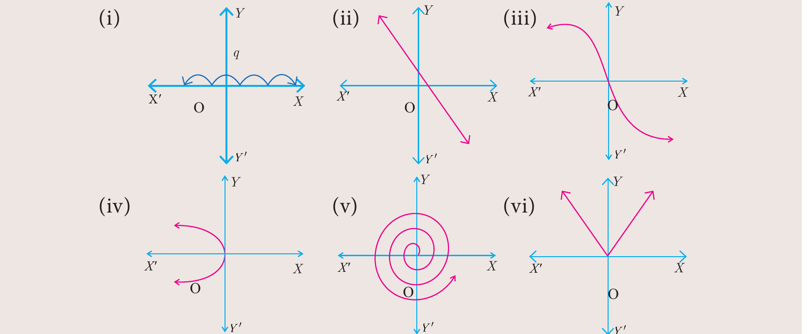

### 1.8 Special Cases of Functions

There are some special cases of a function which will be very useful. We discuss some of them below

(i) Constant function   (ii) Identity function   (iii) Real – valued function
#### (i) Constant function

A function $f : A \to B$ is called a constant function if the range of $f$ contains only one element. That is, $f(x) = c$, for all $x \in A$ and for some fixed $c \in B$.

**Illustration 16**

From Fig.1.37, $A = \{a,b,c,d\}$, $B = \{1,2,3\}$ and $f = \{(a,3),(b,3),(c,3),(d,3)\}$. $\therefore f(x) = 3 \ \forall \ x \in A$, Range of $f = \{3\}$, $f$ is a constant function.

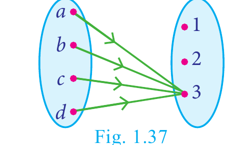

#### (ii) Identity function

Let $A$ be a non-empty set. Then the function $f : A \to A$ defined by $f(x) = x$ for all $x \in A$ is called an identity function on $A$ and is denoted by $I_A$.

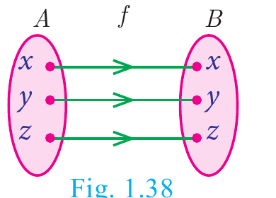

**Illustration 17**

If $A = \{a,b,c\}$ then $f = I_A = \{(a,a),(b,b),(c,c)\}$ is an identity function on $A$.

>**Thinking Corner**
>Is an identity function one to one function?

#### (iii) Real valued function

A function $f : A \to B$ is called a real valued function if the range of $f$ is a subset of the set of all real numbers $\mathbb{R}$. That is, $f(a) \subseteq \mathbb{R}, \ \forall \ a \in A$.

>**Progress Check**
>
>State True or False.
>
>1. All one – one functions are onto functions.
>2. There will be no one – one function from A to B when $n(A) = 4$, $n(B) = 3$.
>3. All onto functions are one – one functions.
>4. There will be no onto function from A to B when $n(A) = 4$, $n(B) = 5$.
>5. If $f$ is a bijection from $A$ to $B$, then $n(A) = n(B)$.
>6. If $n(A) = n(B)$, then $f$ is a bijection from $A$ to $B$.
>7. All constant functions are bijections.

**Example 1.17** Let $f$ be a function from $\mathbb{R}$ to $\mathbb{R}$ defined by $f(x) = 3x - 5$. Find the values of $a$ and $b$ given that $(a, 4)$ and $(1, b)$ belong to $f$.

**Solution** $f(x) = 3x - 5$ can be written as $f = \{(x,\ 3x-5) \mid x \in R\}$

$(a, 4)$ means the image of $a$ is 4. i.e., $f(a) = 4$

$$3a - 5 = 4 \Rightarrow a = 3$$

$(1, b)$ means the image of 1 is $b$. i.e., $f(1) = b$

$$3(1) - 5 = b \Rightarrow b = -2$$

**Example 1.18** If the function $f : \mathbb{R} \to \mathbb{R}$ is defined by

$$f(x) = \begin{cases} 2x+7; & x < -2 \\ x^2-2; & -2 \le x < 3 \\ 3x-2; & x \ge 3 \end{cases}$$

then find the values of

(i) $f(4)$ &nbsp;&nbsp;&nbsp; (ii) $f(-2)$ &nbsp;&nbsp;&nbsp; (iii) $f(4) + 2f(1)$ &nbsp;&nbsp;&nbsp; (iv) $\dfrac{f(1) - 3f(4)}{f(-3)}$

**Solution** The function $f$ is defined by three values in intervals I, II, III as shown by the side

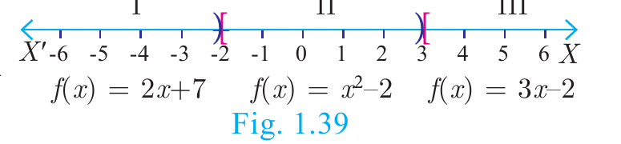

For a given value of $x = a$, find out the interval at which the point $a$ is located, there after find $f(a)$ using the particular value defined in that interval.

(i) First, we see that, $x = 4$ lie in the third interval.

$$\therefore f(x) = 3x - 2;\ f(4) = 3(4) - 2 = 10$$

(ii) $x = -2$ lies in the second interval.

$$\therefore f(x) = x^2 - 2;\ f(-2) = (-2)^2 - 2 = 2$$

(iii) From (i), $f(4) = 10$.

To find $f(1)$, first we see that $x = 1$ lies in the second interval.

$$\therefore f(x) = x^2 - 2 \Rightarrow f(1) = 1^2 - 2 = -1$$

$$f(4) + 2f(1) = 10 + 2(-1) = 8$$

(iv) We know that $f(1) = -1$ and $f(4) = 10$.

For finding $f(-3)$, we see that $x = -3$, lies in the first interval.

$$\therefore f(x) = 2x + 7;\ \text{thus},\ f(-3) = 2(-3) + 7 = 1$$

Hence,

$$\frac{f(1) - 3f(4)}{f(-3)} = \frac{-1 - 3(10)}{1} = -31$$

### Exercise 1.4

1. Determine whether the graph given below represent functions. Give reason for your answers concerning each graph.

   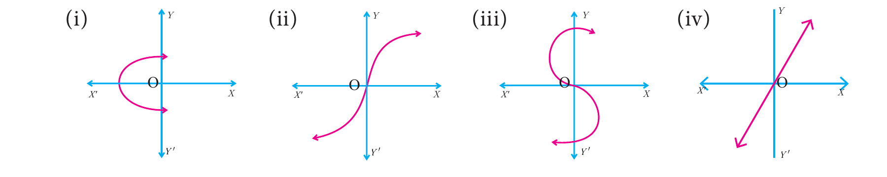

2. Let $f : A \to B$ be a function defined by $f(x) = \dfrac{x}{2} - 1$, where $A = \{2,4,6,10,12\}$, $B = \{0,1,2,4,5,9\}$. Represent $f$ by

   (i) set of ordered pairs &nbsp;&nbsp;&nbsp; (ii) a table &nbsp;&nbsp;&nbsp; (iii) an arrow diagram &nbsp;&nbsp;&nbsp; (iv) a graph

3. Represent the function $f = \{(1,2),(2,2),(3,2),(4,3),(5,4)\}$ through

   (i) an arrow diagram &nbsp;&nbsp;&nbsp; (ii) a table form &nbsp;&nbsp;&nbsp; (iii) a graph

4. Show that the function $f : \mathbb{N} \to \mathbb{N}$ defined by $f(x) = 2x - 1$ is one-one but not onto.

5. Show that the function $f : \mathbb{N} \to \mathbb{N}$ defined by $f(m) = m^2 + m + 3$ is one-one function.

6. Let $A = \{1,2,3,4\}$ and $B = \mathbb{N}$. Let $f : A \to B$ be defined by $f(x) = x^3$ then,

   (i) find the range of $f$ &nbsp;&nbsp;&nbsp; (ii) identify the type of function

7. In each of the following cases state whether the function is bijective or not. Justify your answer.

   (i) $f : \mathbb{R} \to \mathbb{R}$ defined by $f(x) = 2x + 1$ &nbsp;&nbsp;&nbsp; (ii) $f : \mathbb{R} \to \mathbb{R}$ defined by $f(x) = 3 - 4x^2$

8. Let $A = \{-1,1\}$ and $B = \{0,2\}$. If the function $f : A \to B$ defined by $f(x) = ax + b$ is an onto function? Find $a$ and $b$.

9. If the function $f$ is defined by

   $$f(x) = \begin{cases} x+2; & x > 1 \\ 2; & -1 \le x \le 1 \\ x-1; & -3 < x < -1 \end{cases}$$

   find the values of

   (i) $f(3)$ &nbsp;&nbsp;&nbsp; (ii) $f(0)$ &nbsp;&nbsp;&nbsp; (iii) $f(-1 \cdot 5)$ &nbsp;&nbsp;&nbsp; (iv) $f(2) + f(-2)$

10. A function $f : [-5,9] \to \mathbb{R}$ is defined as follows:

    $$f(x) = \begin{cases} 6x+1; & -5 \le x < 2 \\ 5x^2-1; & 2 \le x < 6 \\ 3x-4; & 6 \le x \le 9 \end{cases}$$

    Find &nbsp;&nbsp;&nbsp; (i) $f(-3) + f(2)$ &nbsp;&nbsp;&nbsp; (ii) $f(7) - f(1)$ &nbsp;&nbsp;&nbsp; (iii) $2f(4) + f(8)$ &nbsp;&nbsp;&nbsp; (iv) $\dfrac{2f(-2) - f(6)}{f(4) + f(-2)}$

11. The distance $S$ an object travels under the influence of gravity in time $t$ seconds is given by $S(t) = \dfrac{1}{2}gt^2 + at + b$ where, ($g$ is the acceleration due to gravity), $a > 0$, $b$ are constants. Verify wheather the function $S(t)$ is one-one or not.

12. The function '$t$' which maps temperature in Celsius ($C$) into temperature in Fahrenheit ($F$) is defined by $t(C) = F$ where $F = \dfrac{9}{5}C + 32$. Find,

    (i) $t(0)$ &nbsp;&nbsp;&nbsp; (ii) $t(28)$ &nbsp;&nbsp;&nbsp; (iii) $t(-10)$

    (iv) the value of $C$ when $t(C) = 212$

    (v) the temperature when the Celsius value is equal to the Farenheit value.

### 1.9 Composition of Functions

When a car driver depresses the accelerator pedal, it controls the flow of fuel which in turn influences the speed of the car. Likewise, the composition of two functions is a kind of 'chain reaction', where the functions act upon one after another (Fig.1.40).

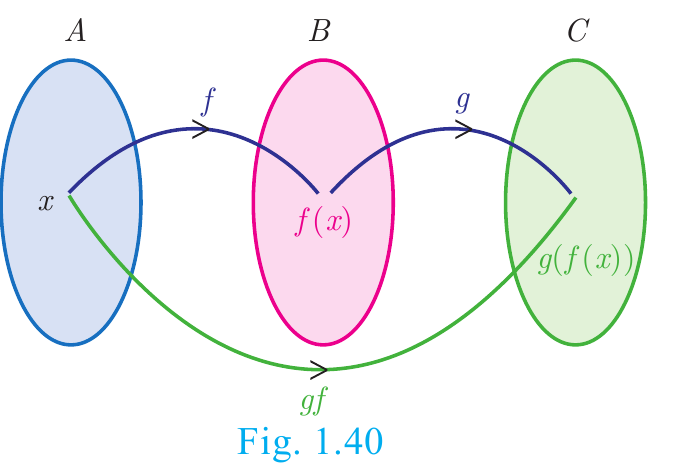

We can explain this further with the concept that a function is a 'process'. If $f$ and $g$ are two functions then the composition $g(f(x))$ (Fig.1.41) is formed in two steps.

(i) Feed an input (say $x$) to $f$;

(ii) Feed the output $f(x)$ to $g$ to get $g(f(x))$ and call it $gf(x)$.

**Illustration**

Consider the set $A$ of all students, who appeared in class X of Board Examination. Each student appearing in the Board Examination is assigned a roll number. In order to have confidentiality, the Board arranges to deface the roll number of each student and assigns a code number to each roll number.

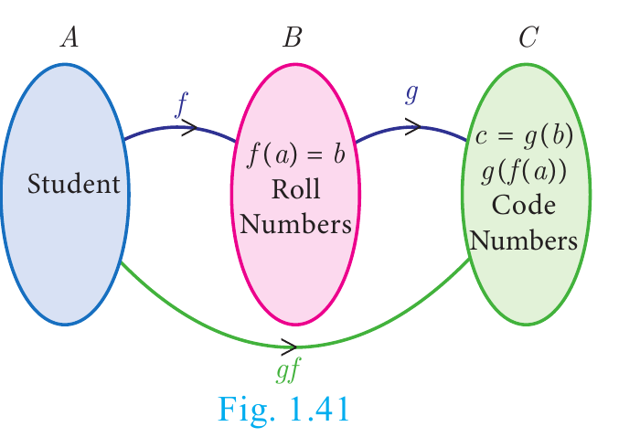

Let $A$ be the set of all students appearing for the board exam. $B \subseteq \mathbb{N}$ be the set all roll numbers and $C \subseteq \mathbb{N}$ be the set of all code numbers (Fig.1.41). This gives rise to two functions $f : A \to B$ and $g : B \to C$ given by $b = f(a)$ be the roll number assigned to student $a$, $c = g(b)$ be the code number assigned to roll number $b$, where $a \in A$, $b \in B$ and $c \in C$.

We can write $c = g(b) = g(f(a))$.

Thus, by the combination of these two functions, each student is eventually attached a code number. This idea leads to the following definition.

>**Definition**
>Let $f : A \to B$ and $g : B \to C$ be two functions (Fig.1.42). Then the composition of $f$ and $g$ denoted by $g \circ f$ is defined as the function $g \circ f(x) = g(f(x))\ \forall\ x \in A$.

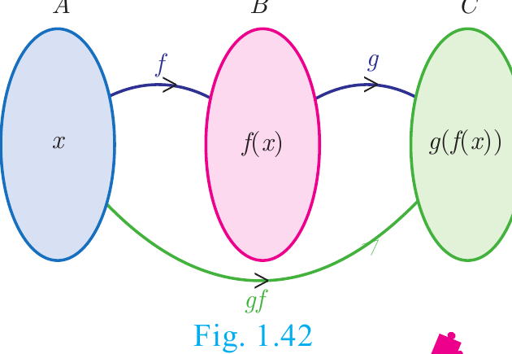

**Example 1.19** Find $f \circ g$ and $g \circ f$ when $f(x) = 2x + 1$ and $g(x) = x^2 - 2$

>**Thinking Corner**
>If $f(x) = x^m$ and $g(x) = x^n$ does $f \circ g = g \circ f$?

**Solution** $f(x) = 2x+1$, $g(x) = x^2-2$

$$f \circ g(x) = f(g(x)) = f(x^2-2) = 2(x^2-2)+1 = 2x^2-3$$

$$g \circ f(x) = g(f(x)) = g(2x+1) = (2x+1)^2-2 = 4x^2+4x-1$$

Thus $f \circ g = 2x^2 - 3$, $g \circ f = 4x^2 + 4x - 1$. From the above, we see that $f \circ g \ne g \circ f$.

>**Note**
>Generally, $f \circ g \ne g \circ f$ for any two functions $f$ and $g$. So, composition of functions is not commutative.

**Example 1.20** Represent the function $f(x) = \sqrt{2x^2 - 5x + 3}$ as a composition of two functions.

**Solution** $f_2(x) = 2x^2 - 5x + 3$ and $f_1(x) = \sqrt{x}$

$$f(x) = \sqrt{2x^2-5x+3} = \sqrt{f_2(x)}$$

$$= f_1\left[f_2(x)\right] = f_1 f_2(x)$$

**Example 1.21** If $f(x) = 3x - 2$, $g(x) = 2x + k$ and if $f \circ g = g \circ f$, then find the value of $k$.

**Solution** $f(x) = 3x - 2$, $g(x) = 2x + k$

$$f \circ g(x) = f(g(x)) = f(2x+k) = 3(2x+k) - 2 = 6x + 3k - 2$$

$$f \circ g(x) = 6x + 3k - 2.$$

$$g \circ f(x) = g(3x-2) = 2(3x-2) + k$$

$$g \circ f(x) = 6x - 4 + k.$$

>**Do You Know?**
>The Composition $g \circ f(x)$ exists only when range of $f$ is a subset of domain of $g$.

Given that $f \circ g = g \circ f$

$$\therefore 6x + 3k - 2 = 6x - 4 + k$$

$$6x - 6x + 3k - k = -4 + 2 \Rightarrow k = -1$$

**Example 1.22** Find $k$ if $f \circ f(k) = 5$ where $f(k) = 2k - 1$.

**Solution** $f \circ f(k) = f(f(k))$

$$= 2(2k-1) - 1 = 4k - 3.$$

$$f \circ f(k) = 4k - 3$$

But, $f \circ f(k) = 5$

$$\therefore 4k - 3 = 5 \Rightarrow k = 2.$$

### 1.9.1 Composition of three functions

Let $A$, $B$, $C$, $D$ be four sets and let $f : A \to B$, $g : B \to C$ and $h : C \to D$ be three functions (Fig.1.43). Using composite functions $f \circ g$ and $g \circ h$, we get two new functions like $(f \circ g) \circ h$ and $f \circ (g \circ h)$.

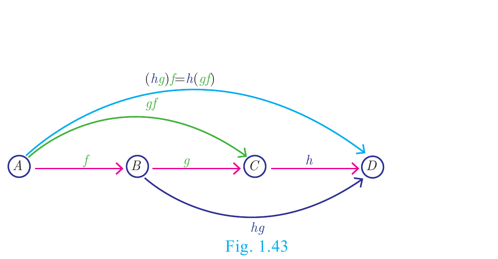

We observed that the composition of functions is not commutative. The natural question is about the associativity of the operation.

>**Note**
>Composition of three functions is always associative. That is, $f \circ (g \circ h) = (f \circ g) \circ h$

**Example 1.23** If $f(x) = 2x+3$, $g(x) = 1-2x$ and $h(x) = 3x$. Prove that $f \circ (g \circ h) = (f \circ g) \circ h$

**Solution** $f(x) = 2x+3$, $g(x) = 1-2x$, $h(x) = 3x$

Now, $(f \circ g)(x) = f(g(x)) = f(1-2x) = 2(1-2x)+3 = 5-4x$

Then, $(f \circ g) \circ h(x) = (f \circ g)(h(x)) = (f \circ g)(3x) = 5-4(3x) = 5-12x$ &nbsp;&nbsp;&nbsp;....(1)

$(g \circ h)(x) = g(h(x)) = g(3x) = 1-2(3x) = 1-6x$

$\Rightarrow\ f \circ (g \circ h)(x) = f(1-6x) = 2(1-6x)+3 = 5-12x$ &nbsp;&nbsp;&nbsp;....(2)

From (1) and (2), we get $(f \circ g) \circ h = f \circ (g \circ h)$

**Example 1.24** Find $x$ if $gff(x) = fgg(x)$, given $f(x) = 3x+1$ and $g(x) = x+3$.

**Solution**

$$gff(x) = g\left[f\{f(x)\}\right] \text{ (This means "}g\text{ of }f\text{ of }f\text{ of }x\text{")}$$

$$= g\left[f(3x+1)\right] = g\left[3(3x+1)+1\right] = g(9x+4)$$

$$g(9x+4) = \left[(9x+4)+3\right] = 9x+7$$

$$fgg(x) = f\left[g\{g(x)\}\right] \text{ (This means "}f\text{ of }g\text{ of }g\text{ of }x\text{")}$$

$$= f\left[g(x+3)\right] = f\left[(x+3)+3\right] = f(x+6)$$

$$f(x+6) = \left[3(x+6)+1\right] = 3x+19$$

These two quantities being equal, we get $9x + 7 = 3x + 19$. Solving this equation we obtain $x = 2$.

>**Progress Check**
>
>State your answer for the following questions by selecting the correct option.
>
>1. Composition of functions is commutative
>   (a) Always true &nbsp;&nbsp;&nbsp; (b) Never true &nbsp;&nbsp;&nbsp; (c) Sometimes true
>2. Composition of functions is associative
>   (a) Always true &nbsp;&nbsp;&nbsp; (b) Never true &nbsp;&nbsp;&nbsp; (c) Sometimes true

>**Activity 4**
>Given that $h(x) = f \circ g(x)$, fill in the table for $h(x)$
>
>| $x$ | $f(x)$ |
>|---|---|
>| 1 | 2 |
>| 2 | 3 |
>| 3 | 1 |
>| 4 | 4 |
>
>| $x$ | $g(x)$ |
>|---|---|
>| 1 | 2 |
>| 2 | 4 |
>| 3 | 3 |
>| 4 | 1 |
>
>| $x$ | $h(x)$ |
>|---|---|
>| 1 | 3 |
>| 2 | - |
>| 3 | - |
>| 4 | - |
>
>How to find $h(1)$?
>
>$$h(x) = f \circ g(x)$$
>$$h(1) = f \circ g(1)$$
>$$= f(2) = 3$$
>$$\therefore\ h(1) = 3$$
### 1.10 Identifying the Graphs of Linear, Quadratic, Cubic and Reciprocal Functions

Graphs provide visualization of curves and functions. Hence, graphs help a lot in understanding the concepts in a much efficient way.

In this section, we will be discussing about the identification of some of the functions through their graphs. In particular, we discuss graphs of Linear, Quadratic, Cubic and Reciprocal functions.

#### 1.10.1 Linear Function

A function $f:\mathbb{R}\to\mathbb{R}$ defined by $f(x) = mx + c$, $m \neq 0$ is called a linear function. Geometrically this represents a straight line in the graph.

Some Specific Linear Functions and their graphs are given below.

| No. | Function | Domain and Definition | Graph |
|---|---|---|---|
| 1 | The identity function | $f:\mathbb{R}\to\mathbb{R}$ defined by $f(x) = x$ | 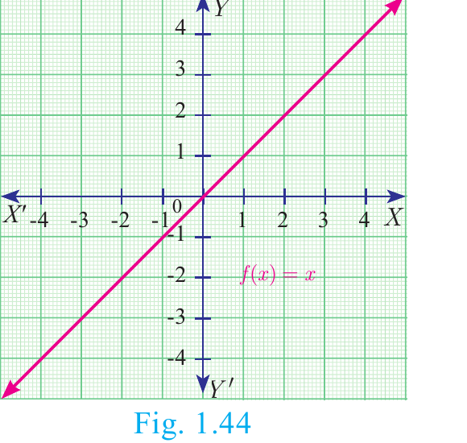 |
| 2 | Additive inverse function | $f:\mathbb{R}\to\mathbb{R}$ defined by $f(x) = -x$ | 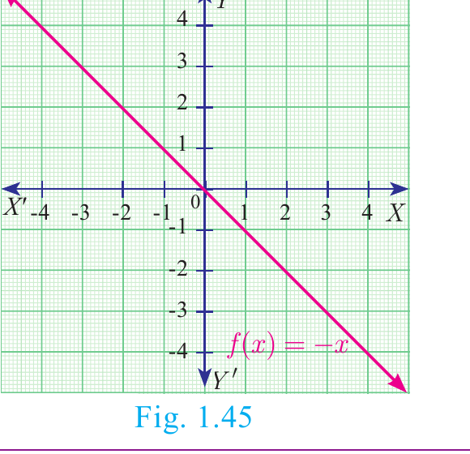 |

#### 1.10.2 Modulus or Absolute valued Function

$$f:\mathbb{R}\to[0,\infty) \text{ defined by } f(x) = |x|$$

$$= \begin{cases} x; & x \geq 0 \\ -x; & x < 0 \end{cases}$$

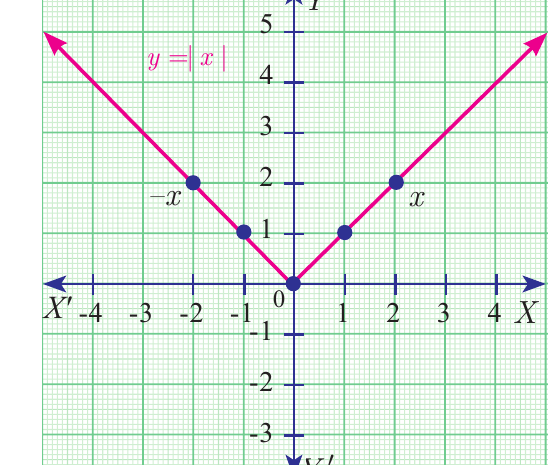

>**Note**
>- Modulus function is not a linear function but it is composed of two linear functions $x$ and $-x$.
>- Linear functions are always one-one functions and has applications in Cryptography as well as in several branches of Science and Technology.

#### 1.10.3 Quadratic Function

A function $f:\mathbb{R}\to\mathbb{R}$ defined by $f(x) = ax^2 + bx + c, (a \neq 0)$ is called a quadratic function.

Some specific quadratic functions and their graphs

| Function, Domain, Range and Definition | Graph |
|---|---|
| $f:\mathbb{R}\to\mathbb{R}$ defined by $f(x) = x^2, x \in \mathbb{R}$. $f(x) \in [0,\infty)$ | 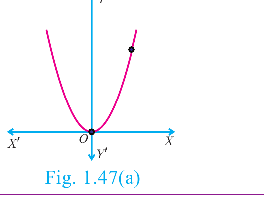 |
| $f:\mathbb{R}\to\mathbb{R}$ defined by $f(x) = -x^2, x \in \mathbb{R}$. $f(x) \in (-\infty,0]$ | 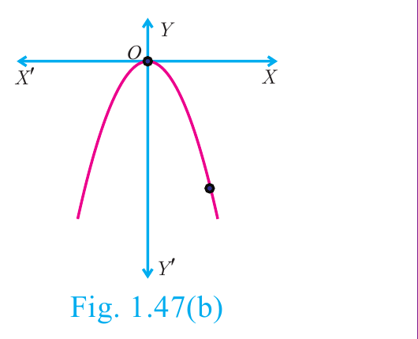 |

#### 1.10.4 Cubic Function

A function $f:\mathbb{R}\to\mathbb{R}$ defined by $f(x) = ax^3 + bx^2 + cx + d, (a \neq 0)$ is called a cubic function. The graph of $f(x) = x^3$ is shown in Fig.1.48.

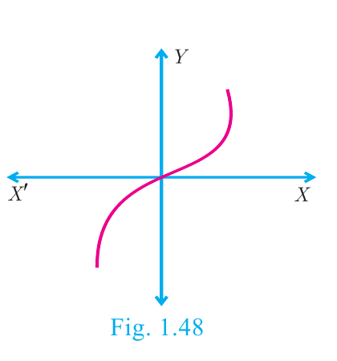

#### 1.10.5 Reciprocal Function

A function $f:\mathbb{R} - \{0\}\to\mathbb{R}$ defined by $f(x) = \dfrac{1}{x}$ is called a reciprocal function (Fig.1.49).

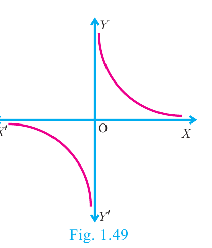

#### 1.10.6 Constant Function

A function $f:\mathbb{R}\to\mathbb{R}$ defined by $f(x) = c, \ \forall\ x \in \mathbb{R}$ is called a constant function (Fig.1.50).

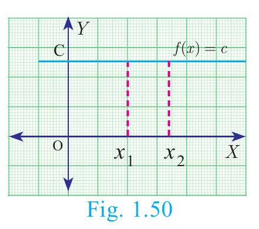

> **Progress Check**
> 1. Is a constant function a linear function?
> 2. Is quadratic function a one – one function?
> 3. Is cubic function a one – one function?
> 4. Is the reciprocal function a bijection?
> 5. If $f:A\to B$ is a constant function, then the range of $f$ will have _____ elements.

### Exercise 1.5

1. Using the functions $f$ and $g$ given below, find $f \circ g$ and $g \circ f$. Check whether $f \circ g = g \circ f$.
   1. $f(x) = x - 6$, $g(x) = x^2$
   2. $f(x) = \dfrac{2}{x}$, $g(x) = 2x^2 - 1$
   3. $f(x) = \dfrac{x+6}{3}$, $g(x) = 3 - x$
   4. $f(x) = 3 + x$, $g(x) = x - 4$
   5. $f(x) = 4x^2 - 1$, $g(x) = 1 + x$
2. Find the value of $k$, such that $f \circ g = g \circ f$
   1. $f(x) = 3x + 2$, $g(x) = 6x - k$
   2. $f(x) = 2x - k$, $g(x) = 4x + 5$
3. If $f(x) = 2x - 1$, $g(x) = \dfrac{x+1}{2}$, show that $f \circ g = g \circ f = x$
4. If $f(x) = x^2 - 1$, $g(x) = x - 2$ find $a$, if $g \circ f(a) = 1$.
5. Let $A, B, C \subseteq \mathbb{N}$ and a function $f:A\to B$ be defined by $f(x) = 2x + 1$ and $g:B\to C$ be defined by $g(x) = x^2$. Find the range of $f \circ g$ and $g \circ f$.
6. Let $f(x) = x^2 - 1$. Find (i) $f \circ f$ (ii) $f \circ f \circ f$
7. If $f:\mathbb{R}\to\mathbb{R}$ and $g:\mathbb{R}\to\mathbb{R}$ are defined by $f(x) = x^5$ and $g(x) = x^4$ then check if $f, g$ are one-one and $f \circ g$ is one-one?
8. Consider the functions $f(x)$, $g(x)$, $h(x)$ as given below. Show that $(f \circ g) \circ h = f \circ (g \circ h)$ in each case.
   1. $f(x) = x - 1$, $g(x) = 3x + 1$ and $h(x) = x^2$
   2. $f(x) = x^2$, $g(x) = 2x$ and $h(x) = x + 4$
   3. $f(x) = x - 4$, $g(x) = x^2$ and $h(x) = 3x - 5$
9. Let $f = \{(-1,3),(0,-1),(2,-9)\}$ be a linear function from $\mathbb{Z}$ into $\mathbb{Z}$. Find $f(x)$.
10. In electrical circuit theory, a circuit $C(t)$ is called a linear circuit if it satisfies the superposition principle given by $C(at_1 + bt_2) = aC(t_1) + bC(t_2)$, where $a,b$ are constants. Show that the circuit $C(t) = 3t$ is linear.

### Exercise 1.6

*(A QR code linking to an online practice quiz appears here in the source; code label: Z7JYT.)*

**Multiple choice questions**

1. If $n(A \times B) = 6$ and $A = \{1,3\}$ then $n(B)$ is
   (A) 1   (B) 2   (C) 3   (D) 6
2. $A = \{a,b,p\}$, $B = \{2,3\}$, $C = \{p,q,r,s\}$ then $n[(A \cup C) \times B]$ is
   (A) 8   (B) 20   (C) 12   (D) 16
3. If $A = \{1,2\}$, $B = \{1,2,3,4\}$, $C = \{5,6\}$ and $D = \{5,6,7,8\}$ then state which of the following statement is true.
   (A) $(A \times C) \subset (B \times D)$
   (B) $(B \times D) \subset (A \times C)$
   (C) $(A \times B) \subset (A \times D)$
   (D) $(D \times A) \subset (B \times A)$
4. If there are 1024 relations from a set $A = \{1, 2, 3, 4, 5\}$ to a set $B$, then the number of elements in $B$ is
   (A) 3   (B) 2   (C) 4   (D) 8
5. The range of the relation $R = \{(x,x^2) \mid x \text{ is a prime number less than } 13\}$ is
   (A) $\{2,3,5,7\}$
   (B) $\{2,3,5,7,11\}$
   (C) $\{4,9,25,49,121\}$
   (D) $\{1,4,9,25,49,121\}$
6. If the ordered pairs $(a+2,4)$ and $(5,2a+b)$ are equal then $(a,b)$ is
   (A) $(2,-2)$   (B) $(5,1)$   (C) $(2,3)$   (D) $(3,-2)$
7. Let $n(A) = m$ and $n(B) = n$ then the total number of non-empty relations that can be defined from $A$ to $B$ is
   (A) $m^n$   (B) $n^m$   (C) $2^{mn} - 1$   (D) $2^{mn}$
8. If $\{(a,8),(6,b)\}$ represents an identity function, then the value of $a$ and $b$ are respectively
   (A) $(8,6)$   (B) $(8,8)$   (C) $(6,8)$   (D) $(6,6)$
9. Let $A = \{1,2,3,4\}$ and $B = \{4,8,9,10\}$. A function $f:A\to B$ given by $f = \{(1,4),(2,8),(3,9),(4,10)\}$ is a
   (A) Many-one function
   (B) Identity function
   (C) One-to-one function
   (D) Into function
10. If $f(x) = 2x^2$ and $g(x) = \dfrac{1}{3x}$, then $f \circ g$ is
    (A) $\dfrac{3}{2x^2}$   (B) $\dfrac{2}{3x^2}$   (C) $\dfrac{2}{9x^2}$   (D) $\dfrac{1}{6x^2}$
11. If $f:A\to B$ is a bijective function and if $n(B) = 7$, then $n(A)$ is equal to
    (A) 7   (B) 49   (C) 1   (D) 14
12. Let $f$ and $g$ be two functions given by
    $$f = \{(0,1),(2,0),(3,-4),(4,2),(5,7)\}$$
    $$g = \{(0,2),(1,0),(2,4),(-4,2),(7,0)\}$$
    then the range of $f \circ g$ is
    (A) $\{0,2,3,4,5\}$
    (B) $\{-4,1,0,2,7\}$
    (C) $\{1,2,3,4,5\}$
    (D) $\{0,1,2\}$
13. Let $f(x) = \sqrt{1+x^2}$ then
    (A) $f(xy) = f(x).f(y)$
    (B) $f(xy) \geq f(x).f(y)$
    (C) $f(xy) \leq f(x).f(y)$
    (D) None of these
14. If $g = \{(1,1),(2,3),(3,5),(4,7)\}$ is a function given by $g(x) = \alpha x + \beta$ then the values of $\alpha$ and $\beta$ are
    (A) $(-1,2)$   (B) $(2,-1)$   (C) $(-1,-2)$   (D) $(1,2)$
15. $f(x) = (x+1)^3 - (x-1)^3$ represents a function which is
    (A) linear   (B) cubic   (C) reciprocal   (D) quadratic

### Unit Exercise - 1

1. If the ordered pairs $(x^2 - 3x, y^2 + 4y)$ and $(-2,5)$ are equal, then find $x$ and $y$.
2. The cartesian product $A \times A$ has 9 elements among which $(-1, 0)$ and $(0,1)$ are found. Find the set $A$ and the remaining elements of $A \times A$.
3. Given that $f(x) = \begin{cases} \sqrt{x-1} & x \geq 1 \\ 4 & x < 1 \end{cases}$. Find
   1. $f(0)$
   2. $f(3)$
   3. $f(a+1)$ in terms of $a$. (Given that $a \geq 0$)
4. Let $A = \{9,10,11,12,13,14,15,16,17\}$ and let $f:A\to \mathbb{N}$ be defined by $f(n) = $ the highest prime factor of $n \in A$. Write $f$ as a set of ordered pairs and find the range of $f$.
5. Find the domain of the function $f(x) = \sqrt{1 + \sqrt{1 - \sqrt{1-x^2}}}$
6. If $f(x) = x^2$, $g(x) = 3x$ and $h(x) = x - 2$, Prove that $(f \circ g) \circ h = f \circ (g \circ h)$.
7. Let $A = \{1,2\}$ and $B = \{1,2,3,4\}$, $C = \{5,6\}$ and $D = \{5,6,7,8\}$. Verify whether $A \times C$ is a subset of $B \times D$?
8. If $f(x) = \dfrac{x-1}{x+1}$, $x \neq -1$ show that $f(f(x)) = -\dfrac{1}{x}$, provided $x \neq 0$.
9. The functions $f$ and $g$ are defined by $f(x) = 6x + 8$; $g(x) = \dfrac{x-2}{3}$
   1. Calculate the value of $gg\left(\dfrac{1}{2}\right)$
   2. Write an expression for $gf(x)$ in its simplest form.
10. Write the domain of the following real functions
    1. $f(x) = \dfrac{2x+1}{x-9}$
    2. $p(x) = \dfrac{-5}{4x^2+1}$
    3. $g(x) = \sqrt{x-2}$
    4. $h(x) = x + 6$

### Points to Remember

- The Cartesian Product of $A$ with $B$ is defined as $A \times B = \{(a,b) \mid \text{for all } a \in A, b \in B\}$
- A relation R from $A$ to $B$ is always a subset of $A \times B$. That is $R \subseteq A \times B$
- A relation R from $X$ to $Y$ is a function if for every $x \in X$ there exists only one $y \in Y$.
- A function can be represented by
  1. an arrow diagram
  2. a tabular form
  3. a set of ordered pairs
  4. a graphical form
- Some types of functions
  1. One-one function
  2. Onto function
  3. Many-one function
  4. Into function
- Identity function $f(x) = x$
- Reciprocal function $f(x) = \dfrac{1}{x}$
- Constant function $f(x) = c$
- Linear function $f(x) = ax + b$, $a \neq 0$
- Quadratic function $f(x) = ax^2 + bx + c$, $a \neq 0$
- Cubic function $f(x) = ax^3 + bx^2 + cx + d$, $a \neq 0$
- For three non-empty sets $A$, $B$ and $C$, if $f:A\to B$ and $g:B\to C$ are two functions, then the composition of $f$ and $g$ is a function $g \circ f : A \to C$ will be defined as $g \circ f(x) = g(f(x))$ for all $x \in A$.
- If $f$ and $g$ are any two functions, then in general, $f \circ g \neq g \circ f$
- If $f$, $g$ and $h$ are any three functions, then $f \circ (g \circ h) = (f \circ g) \circ h$

### ICT CORNER

**ICT 1.1**

**Step 1:** Open the Browser type the URL Link given below (or) Scan the QR Code. GeoGebra work book named **"Relations and Functions–X"** will open. In the left side of the work book there are many activity related to Relations and Functions chapter. Select the work sheet **"Functions Identification"**

**Step 2:** In the given worksheet click on the check boxes corresponding to each function on left hand side. You can see the graph of respective function on Right hand side. Analyse each graph and then click "New Functions" and continue till you understand.

*(Screenshots for Step 1, Step 2, and Expected results of the "Functions Identification" GeoGebra worksheet appear here in the source — not reproduced as these are illustrative app-navigation screenshots rather than content figures.)*

**ICT 1.2**

**Step 1:** Open the Browser type the URL Link given below (or) Scan the QR Code. GeoGebra work book named **"Relations and Functions–X"** will open. In the left side of the work book there are many activity related to Relations and Functions chapter. Select the work sheet **"Composition of Functions"**

**Step 2:** In the given worksheet click on the check boxes corresponding to each function on left hand side. You can see the graph of respective function on Right hand side. Analyse each graph and then click **"New Functions"** and continue till you understand.

*(Screenshots for Step 1, Step 2, and Expected results of the "Composition of Functions" GeoGebra worksheet appear here in the source — not reproduced as these are illustrative app-navigation screenshots rather than content figures.)*

*You can repeat the same steps for other activities*

[https://www.geogebra.org/m/jfr2zzgy#chapter/356191](https://www.geogebra.org/m/jfr2zzgy#chapter/356191) or Scan the QR Code.

*(A QR code linking to the GeoGebra activity appears here in the source; code label: ILGVH.)*
